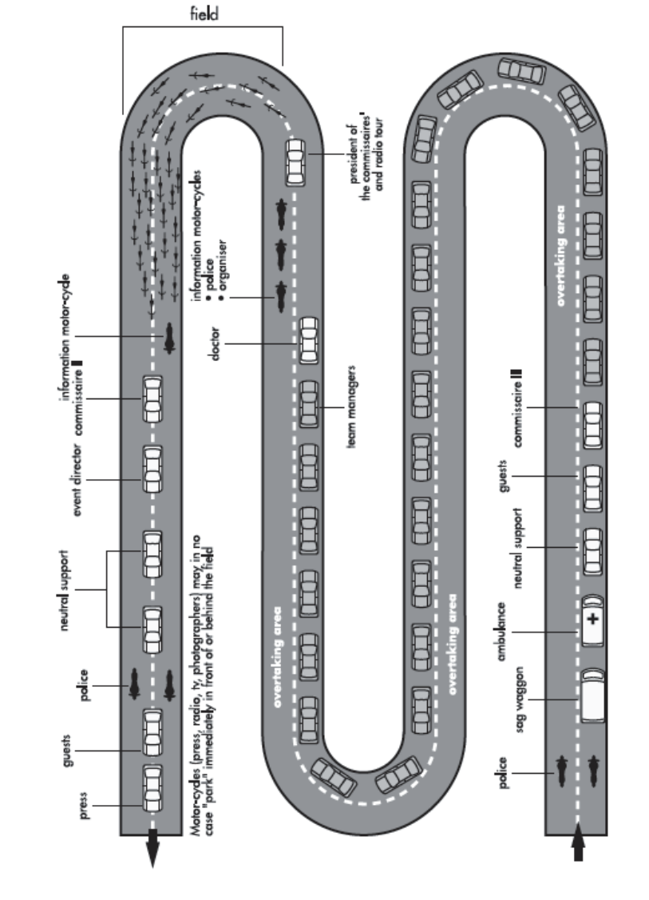

> **Amendment — tracked changes.** This document shows UCI’s amendments as tracked changes: <del>struck-through</del> text is being removed and the adjacent plain text is its replacement. Some character-level edits (numbers, word fragments) from the source PDF may display imperfectly — for the clean, in-force wording see the consolidated regulation in the sidebar or the [official PDF](https://www.uci.org/regulations/3MyLDDrwJCJJ0BGGOFzOat).

# **PART 2 ROAD RACES** 

**Version on 01.09.2026** 

E0726 

1 

ROAD RACES 

E0726 

2 

ROAD RACES 

E0726 

3 

ROAD RACES 

## **PART 2 ROAD RACES** 

### **Preamble** 

In addition to the present part which applies to road races, licence-holders must also respect and comply with the specifications, financial obligations, guides and guidelines published by the UCI and in particular, but not limited to, the following publications: 

- UCI International Calendar registration procedure; 

- Registration guide for UCI Teams; 

- Specifications for UCI WorldTour, UCI Women's WorldTour and Men Elite UCI ProSeries organisers; 

- Organisational specifications for UCI WorldTeams and UCI Women's WorldTeams; 

- Joint agreements on the working conditions of UCI WorldTeams and UCI ProTeams riders; 

- UCI financial obligations and International Control Agency (ITA) financial obligations; 

- Organiser’s guide to road events; 

- Guidelines for vehicle circulation in the race convoy; 

- TV production guide, timekeeping guide for provider, regulator’s guide to road events; 

- Visual guidelines for UCI teams and organisers of international events and Use of the rainbow stripes, the UCI marks and the UCI event marks; 

- Users guide of the centralised prize money management system; 

- Training guides for Commissaires. 

All the above-mentioned documents are published on the UCI website in the regulations or publications pages. 

_(text introduced on 08.02.21)._ 

### **Chapter I CALENDAR AND PARTICIPATION** 

##### **International calendar** 

- **2.1.001** Road races are registered on the international calendar in accordance with their classification as per article 2.1.005. 

The UCI WorldTour and UCI Women’s WorldTour calendars are established by the Professional Cycling Council and proposed to the UCI Management Committee for approval. 

The UCI Management Committee of the UCI enters the other events of the international calendar in one or another class in accordance with the criteria which it shall draw up. 

As a general rule, the international calendar and the road cycling season shall start on the day following the conclusion of the previous year’s final UCI World Championships event or WorldTour event and end upon conclusion of the final UCI WorldTour or World Championships event of the year in question. 

E0726 

ROAD RACES 

4 

The dates of the international calendar and the road cycling season shall be set annually by the UCI Management Committee, which will take into account the above as well as specificities regarding the events registered on the calendar. 

_(text modified on 01.01.02; 01.01.05; 01.01.17; 23.10.19; 01.01.25)_ 

- **2.1.002** A continental circuit is composed of all elite (ME) and all under 23 (MU) men’s road races of the continental calendar of each continent. These circuits are respectively known as Africa Tour, America Tour, Asia Tour, Europe Tour and Oceania Tour. 

_(text modified on 01.01.02; 01.01.05; 01.01.06; 01.08.13; 01.01.15; 01.03.16; 01.01.17)._ 

- **2.1.003** In order to be registered on the international calendar, a race must guarantee the participation of at least 10 teams, among which 5 foreign teams. A mixed team is regarded as a foreign team if the majority of its riders are of foreign nationality. 

_(text modified on 01.01.02; 01.01.03; 01.01.04; 01.01.05; 01.01.17)._ 

- **2.1.004** A mixed team shall be composed exclusively of riders originating from a maximum of two distinct teams or clubs, both of which must be eligible to participate in accordance with Article 2.1.005. 

A mixed team may be registered for only one event per year and shall be designated in the event by the combination of the names of the constituent teams, followed by the word "mix". 

Each team forming the mixed team must enter, for the event in question, a minimum of two riders from its regular roster. 

The two teams forming the mixed team must be of the same nationality, unless one of them is a club established outside of Europe; in such case, the difference in nationality shall be permitted. 

A mixed team may also be composed of two national teams. In this case, each national team must enter at least two riders for the event. 

The participation of riders licensed with a team registered with the UCI is prohibited within a mixed team. Likewise, UCI-registered teams are not permitted to form a mixed team. 

Riders participating as part of a mixed team shall wear the jersey of their regular team or club. 

_(text modified on 01.01.99; 01.01.05; 28.04.05; 01.01.07; 12.06.20; 01.01.25; 01.01.26)._ 

##### **Junior Development Teams** 

- **2.1.004** A junior development team shall be established for a duration of one year with the 

   - **bis** purpose of participating in junior events, in accordance with the provisions of Article 2.1.005. 

E0726 

ROAD RACES 

5 

The junior development team shall be registered by the National Federation corresponding to the majority nationality of its riders, and in accordance with the procedures set out in the specifications defined by that federation. 

The team must be managed by a club duly affiliated with the relevant National Federation, or by a team registered with the UCI in one of the following categories: UCI WorldTeam, UCI Women’s WorldTeam, UCI ProTeam or UCI Women’s ProTeam. The managing entity shall assume full administrative and sporting responsibility for the team. 

The UCI or Continental Confederations may establish a junior development team comprising primarily athletes from emerging cycling nations, as part of a specific development policy for cycling. Given its international nature and in the interest of fairness among nations, such a team shall be considered as having neither a nationality nor an affiliated National Federation. It shall be registered for events under the banner of the UCI World Cycling Centre or the relevant Continental Confederation. 

The team may include up to a maximum of fifteen riders, all registered for the entirety of the current season. 

The calendar of events in which the team will participate shall be established in consultation with the National Federation. 

The team must adopt a single official name and use a single jersey for the entire season. 

National Federations shall inform the UCI of the list of junior development teams registered within their federation no later than 1 March. 

The UCI shall publish on its website the list of teams communicated by the National Federations. 

_(Article introduced on 01.01.26)_ 

##### **2.1.005  International races and participation** 

|**International**<br>**Calendar**|**Categor**<br>**y of**<br>**event**|**Class**|**Participation**|
|---|---|---|---|
|Olympic games|ME<br>WE|JO|-As per part XI|
|World championships|ME<br>WE<br>MU<br>WU<br>MJ<br>WJ|CM|-National teams, in accordance with<br>the world championships (see part<br>IX)|
|Continental<br>championships|ME<br>WE<br>MU|CC|-National teams, in accordance with<br>the continental championships (see<br>part X)|
|Continental games|WU<br>MJ|JC|-National teams, in accordance with<br>the specific regulations of the event|
|Regional games|WJ|JR|-<br>National teams, in accordance<br>with the regional games (see part X)|

E0726 

6 

ROAD RACES 

|**International**<br>**Calendar**|**Categor**<br>**y of**<br>**event**|**Class**|**Participation**|
|---|---|---|---|
|UCI WorldTour|ME|1.UWT<br>2.UWT|-UCI WorldTeams (see Art. 2.15.127)<br>-Invited UCI ProTeams<br>-National team of the organising<br>country in events determined by the<br>PCC|
|UCI Europe Tour|ME|1.Pro<br>2.Pro|-UCI WorldTeams (max 72%)<br>-UCI ProTeams<br>-UCI continental teams of the country<br>(1)<br>-UCI cyclo-cross professional teams<br>of the country<sup>(1)</sup><br>-Foreign UCI continental teams<br>(max. 2)<sup>(1)</sup><br>-National team of the country of the<br>organiser|
|||1.1<br>2.1|-UCI WorldTeams (max 50%)<br>-UCI ProTeams<br>-UCI continental teams<br>-UCI cyclo-cross professional teams<br>-National teams|
|||1.2<br>2.2|-UCI ProTeams of the country<br>-UCI foreign UCI ProTeams (max. 2)<br>-UCI continental teams<br>-UCI cyclo-cross professional teams<br>-National teams<br>-Regional and club teams|
||MU|1.2U<br>2.2U|-UCI continental teams<br>-UCI cyclo-cross professional teams<br>-National teams<br>-Regional and club teams|
|UCI America Tour<br>UCI Asia Tour<br>UCI Oceania Tour<br>UCI Africa Tour|ME|1.Pro<br>2.Pro|-UCI WorldTeams (max 72%)<br>-UCI ProTeams<br>-UCI continental teams<sup>(1)</sup><br>-UCI cyclo-cross professional teams<br>(1)<br>-National teams|
|||1.1<br>2.1|-UCI WorldTeams (max 50%)<br>-UCI ProTeams<br>-UCI continental teams<br>-UCI cyclo-cross professional teams<br>-National teams|
|||1.2<br>2.2|-UCI ProTeams<br>-UCI continental teams<br>-UCI cyclo-cross professional teams<br>-National teams<br>-Regional and club teams<br>-African mixed teams<sup>(3)</sup>|

E0726 

ROAD RACES 

7 

|**International**<br>**Calendar**|**Categor**<br>**y of**<br>**event**|**Class**|**Participation**|
|---|---|---|---|
||MU|1.2U<br>2.2U|-UCI continental teams<br>-UCI cyclo-cross professional teams<br>-National teams<br>-Regional and club teams<br>-Mixed teams|
|Women Elite|WE|1.WWT<br>2.WWT|-UCI Women’s WorldTeams<br>-UCI Women’s ProTeams<br>-National team from the country of<br>the organiser with the agreement of<br>the UCI<sup>(4)</sup>|
|||1.Pro<br>2.Pro|-UCI Women’s WorldTeams (min 4)<br>-UCI Women’s ProTeams<br>-UCI women’s continental teams<br>-UCI cyclo-cross professional teams<br>-National teams|
|||1.1<br>2.1|-UCI Women’s WorldTeams (min 1,<br>max 7)<br>-UCI Women’s ProTeams<br>-UCI women’s continental teams<br>-UCI cyclo-cross professional teams<br>-National teams<br>-Regional and club teams|
||WE<br>WU|1.2<br>2.2|-UCI Women’s ProTeams<br>-UCI women’s continental teams<br>-UCI cyclo-cross professional teams<br>-National teams<sup>(5)</sup><br>-Regional and club teams<sup>(5)</sup><br>-Mixed teams<sup>(5)</sup>|
|Men Junior|MJ|1.Ncup<br>2.Ncup|-National teams<br>-Nationalmixed teams<br>-Regional teams<br><del>-</del>Continental Confederation’s team<br>(excluding Grand Final)<br>- UCI World Cycling Centre’s<br>team (Grand Final only)|
|||1.1<br>2.1|-National teams<br>-Regional and club teams<br>-Mixed teams<br>-Junior development teams|

E0726 

8 

ROAD RACES 

|**International**<br>**Calendar**|**Categor**<br>**y of**<br>**event**|**Class**|**Participation**|
|---|---|---|---|
|Women Junior|WJ|1.Ncup<br>2.Ncup|-National teams<br>-Nationalmixed teams<br>-Regional teams<br><del>-</del>Continental Confederation’s team<br>(excluding Grand Final)<br>- UCI World Cycling Centre’s<br>team (Grand Final only)|
|||1.1<br>2.1|-National teams<br>-Regional and club teams<br>-Mixed teams WJ 1<br>-Junior development teams|

_(1) In order to compete in a UCI ProSeries event, UCI Continental Teams and UCI cyclo-cross professional teams must contribute to the programme for the fight against doping related to UCI ProSeries events as provided in the Financial Obligations published on the UCI website; the teams concerned will be included in a list published on the UCI website._ 

_(2) Only regional and club teams from the country of the organiser or border country and only if the national team of the country of the regional or club team is also taking part in the event._ 

_(3) only for UCI Africa Tour._ 

_(4) If thirty days prior to the event, the number of confirmed teams remains below the minimum required, and subject to the organiser providing evidence to the UCI that all UCI Women’s WorldTeams and UCI Women’s ProTeams have been duly invited to participate in the event, the UCI may authorise the organiser, as a first step, to invite UCI Women’s Continental Teams registered in the host country, and as a second step, to invite any other UCI Women’s Continental Teams._ 

_(5) Women of the second year of Junior may be included in these teams, provided they have authorisation from the National Federation that issued their license._ 

In order to compete in a UCI WorldTour race, riders must have submitted accurate and up-to-date whereabouts information to an anti-doping organisation for a minimum period of 6 weeks and have been subject to testing in accordance with the athlete biological passport programme as implemented by the UCI. 

_(text modified on 01.01.99; 01.01.05; 01.01.06; 01.10.06; 25.09.07; 01.01.08; 01.1.09; 01.07.09; 01.10.09; 01.10.10; 01.07.11; 01.07.12; 01.10.13; 01.01.14; 01.01.15; 01.01.16; 12.01.17; 01.02.17; 01.01.18; 23.10.19; 01.01.20; 09.11.20; 01.01.24; 01.07.24; 01.01.25; 20.10.25; 01.11.25; 01.01.26; 01.09.26)._ 

##### **Development teams of UCI WorldTeams, UCI Women’s WorldTeams, UCI ProTeams and UCI Women’s ProTeams** 

- **2.1.005** Riders registered with a development team may participate in UCI ProSeries or Class 1 **bis** events with the related UCI WorldTeam, UCI Women’s WorldTeam, UCI ProTeam or UCI Women’s ProTeam subject to the following limitations: 

|**Category of event**|**Number of riders allowed in**|
|---|---|
||**the**<br>**UCI WorldTeam,**<br>**UCI**<br>**Women’s**<br>**WorldTeams,**|
||**UCI ProTeam or UCI Women’s**<br>**ProTeam**|
|UCI ProSeries|Max. 2 riders|
|Class 1|Max. 4 riders|

E0726 

9 

ROAD RACES 

Riders registered with a UCI WorldTeam, UCI Women’s WorldTeams, UCI ProTeam or UCI Women’s ProTeam may participate in class 1 or class 2 events with the related development team subject to the following limitations: 

|**Category of event**|**Number of riders allowed in**|
|---|---|
||**the development team**|
|Class 1|Max. 2 riders|
|Class 2|Max. 1 rider|

_(article introduced on 23.10.19; 01.11.22; 01.07.24)._ 

- **2.1.006** MU riders can participate in races classed as ME. WU riders can participate in races classed WE. 

MU Races are reserved exclusively for riders of the MU category. WU Races are reserved exclusively for riders of the WU category. 

_(text modified on 01.01.05; 01.01.07; 01.01.08; 01.01.15; 01.01.18; 01.07.26)._ 

- **2.1.007** Unless prior authorization has been obtained from the UCI Management Committee, organisers may not set other age limits than the ones corresponding to the junior, under 23 and elite categories. 

_(article introduced on 01.01.05)._ 

- **2.1.007  Obligatory invitations to events on the international calendar** 

##### **bis** 

##### **Provisions for Grand Tours and UCI WorldTour stage races** 

The organiser must invite the best UCI ProTeams on UCI World Ranking by Teams, as considered on the last day of the previous season (within the meaning of article 2.1.001)<sup>(1)</sup>, according to the following: 

|**Number of**<br>**UCI WorldTeams**|**Obligatory**<br>**Invitation of best**<br>**UCI ProTeams**<sup>**(2)(4)**</sup>|**Remaining**<br>**for Org**|**wild cards**<br>**anisers**|
|---|---|---|---|
|||**Grand Tours**<sup>**(3) (4)**</sup><br>**(5)**|**Other stage races**|
|18|3|2|4|
|17|4|2|4|
|16|4|3|5|

> **_(1)_** _For the purpose of this article, teams registered as UCI ProTeam or UCI WorldTeam during the previous season are taken into consideration._ 

> **_(2)_** _As a matter of exception to article 1.2.049, the UCI ProTeam shall confirm its participation or not to the organiser at the latest 70 days before the event. In the UCI ProTeam declines the invitation or fails to confirm its participation within the aforementioned deadline the organiser may issue an additional wild card._ 

> **_(3)_** _The organiser of a Grand Tour must guarantee the participation in the race of at least one UCI WorldTeam or UCI ProTeam from the country of the organiser amongst the 23 participating teams._ 

_(4) From the 2026 season onwards, only the 30 best ranked teams on the UCI World_ 

E0726 

10 

ROAD RACES 

_ranking by teams of the previous season shall be entitled to receive a “wild-card” invitation from a Grand Tour organiser._ 

_UCI ProTeams registered for the first time as UCI ProTeams will be considered based on the addition of the points scored at the end of the previous season by their 20 best riders, according to the list of riders published on the UCI website following the confirmation by the UCI of the registration of the team._ 

_(5) For the 2026, 2027 and 2028 seasons, the allocation of wild cards shall be carried out in such a way as to ensure the participation of 23 teams in each Grand Tour._ 

UCI ProTeams that accept the obligatory invitation from the organiser (except wild card) to participate in at least one Grand Tour, shall pay the same contribution to the biological passport as UCI WorldTeams, as published in the International Testing Agency (ITA) financial obligations document available on the UCI website. 

##### **Provisions for UCI WorldTour one-day races** 

The organiser must invite the best UCI ProTeams on the UCI World Team Ranking, as considered on the last day of the previous season (under the terms of article 2.1.001)<sup>(1)</sup>, according to the followings: 

|**Number of**|**Obligatory Invitation of**|**Remaining wild cards**|
|---|---|---|
|**UCI WorldTeams**|**best UCI ProTeams**<sup>**(2) (3)**</sup>|**for Organisers**<sup>**(3)**</sup>|
|18|3|4|
|17|4|4|
|16|4|5|

> **_(1)_** _For the purpose of this article, teams registered as UCI ProTeam or UCI WorldTeam during the previous season are taken into consideration._ 

> **_(2)_** _Invitations declined by invited UCI ProTeams may be used by the organiser as additional wild cards._ 

##### **Provisions for UCI Women’s WorldTour events** 

The organiser must send an invitation to the two best UCI Women's ProTeams in the UCI World Team Ranking, as at the last day of the previous season (within the meaning of article 2.1.001)<sup>(1)</sup>, in accordance with the following provisions. 

In the event that the number of UCI Women's WorldTeams is less than 13, the number of obligatory invitations to the UCI Women’s ProTeam, based on the abovementioned ranking, shall be increased accordingly in order to ensure a minimum number of 15 invitations to the UCI WorldTeams and UCI Women’s ProTeam. 

##### **Provisions for ME UCI ProSeries** 

The organiser must invite the first 5 UCI ProTeams on the UCI World Team Ranking, as considered on the last day of the previous season (within the meaning of article 2.1.001)<sup>(1)</sup>. 

The organiser must also invite the UCI ProTeams of the host country. 

The organiser must ensure it has received responses from the UCI ProTeams it must invite, as set out above, before inviting other UCI teams. 

As a matter of exception to article 1.2.049, the UCI ProTeam shall confirm its 

E0726 

11 

ROAD RACES 

participation or not to the organiser at the latest 70 days before the event. 

The organiser must accept entries from above mentioned teams who have responded positively to an invitation. If the UCI ProTeam declines the invitation or fails to confirm its participation within the aforementioned deadline the organiser may issue an additional wild card. 

**Provisions for ME and MU class2 events of the Europe Tour as well as ME and MU class 1 and class 2 events of the America Tour, Asia Tour and Oceania Tour** The organiser must invite the first 3 UCI continental teams in the classification by team for the relevant continental circuit of the event, on the last day of the previous season (in the sense of Article 2.1.001). For the application of this provision, only teams from the relevant continental circuit of which the event is part and, amongst these, only the best team of each nation is considered. 

The organiser must accept entries from above mentioned teams who have responded positively to an invitation. 

**Provisions for ME and MU class 1 and class 2 events of the Africa Tour** The organiser must invite the first 3 national teams in the classification by nation for the UCI Africa Tour, on the last day of the previous season (in the sense of Article 2.1.001). 

The organiser must accept entries from above mentioned teams who have responded positively to an invitation. 

_(text modified on 01.01.06; 01.01.07; 01.10.10; 01.02.11; 01.07.11; 01.07.12; 01.10.13; 01.01.15; 01.01.17; 25.10.17; 22.10.18; 23.10.19; 11.02.20; 12.06.20; 08.02.21; 01.11.21; 01.01.23; 01.03.23; 01.01.24; 01.07.24; 01.04.25; 20.10.25; 01.11.25; 01.07.26)._ 

##### **National calendars** 

- **2.1.008** The management of the national calendar, its structure, the classification of national races and the participation rules are the responsibility of the respective National Federations, subject to the provisions below. 

_(article introduced on 01.01.05)._ 

- **2.1.009** Only the following teams and riders may participate in national events: 

##### **Provisions for Men Elite national events in Europe** 

- UCI ProTeams of the country with no more than 10 events of the ME category registered on the international calendar with the approval of their National Federation; 

- UCI continental teams of the country; 

- regional and club teams; 

- national teams; 

- mixed teams. 

##### **Provisions for Men Elite national events outside of Europe** 

- UCI ProTeams of the country with the approval of their National Federation; 

- UCI continental teams of the country; 

- regional and club teams; 

- national teams; 

- mixed teams. 

E0726 

12 

ROAD RACES 

##### **Provisions for Women Elite national events** 

- UCI Women's ProTeams of the organiser's country for countries for which a maximum of 10 WE category events are registered on the UCI international calendar and with the approval of the country's National Federation; 

- UCI women’s continental teams; 

- national teams; 

- regional and club teams; 

- mixed teams. 

Only national teams may include riders from a team registered with the UCI. 

_(article introduced on 01.01.05; modified on 01.08.13; 01.01.15; 25.10.17; 23.10.19; 01.01.24; 01.07.24)._ 

- **2.1.010** A national event may accept a maximum of 3 foreign teams. 

_(article introduced on 01.01.05)._ 

- **2.1.011** National Federations may conclude agreements for the participation of foreign riders residing in border zones; such riders shall not be considered foreign riders. These agreements must be presented to the commissaires’ panel presiding over the race. 

_(article introduced on 01.01.05)._ 

### **Chapter II GENERAL PROVISIONS** 

_(numbering of the articles modified on 01.01.05)._ 

#### **§ 1 Participation** 

- **2.2.001** Riders belonging to a team registered with the UCI with the same paying agent or main partner may not compete in the same race except in the case of an individual event. Furthermore, no more than one national team of each nationality may compete in an event. 

In addition, the participation of both a UCI team (UCI WorldTeam, UCI Women’s WorldTeam, UCI ProTeam or UCI Women’s ProTeam) and the UCI registered development team supported by such team is prohibited. 

National Federations shall declare to the UCI their affiliated club teams that have the same paying agent / team representative or main partner than a team registered with the UCI. 

Finally, they must refrain from selecting riders whose team, in which the rider is registered for the current season, is taking part in the same event. 

For events reserved to the Women Junior (WJ) category, a maximum of two (2) riders registered with a club team may participate in the same event as members of their respective National Team. 

_(text modified on 01.01.05; 01.07.10; 01.10.11; 01.01.13; 01.01.15; 25.10.17; 01.11.22; 01.07.24; 01.07.26)._ 

E0726 

13 

ROAD RACES 

##### **2.2.002** The number of riders starting a road race shall be limited according to the following table: 

|**Category**|**Maximum**|
|---|---|
|Olympic Games||
|UCI World Championships||
|Continental Championships|200|
|Continental Games||
|Regional Games||
|National Championships||
|**Men International Events**|**Maximum**|
|Grand Tours|184|
|Other UCI WorldTour events||
|UCI Europe Tour, UCI America Tour, UCI Asia Tour,<br>UCIOceaniaTourand UCI AfricaTour|176|
|UCI Nations’Cups||
|Men Junior||

|**Women International Events**|**Maximum**|
|---|---|
|One-day races of the UCI Women’s WorldTour and UCI ProSeries|144|
|Stage races of the UCI Women’s WorldTour and UCI ProSeries|168|
|Class 1||
|Class 2|176|
|UCI Nations’Cup||
|Women Junior||
|**National Events**|**Maximum**|
|(N*) National Calendars|176|

- _within the limit of 200._ 

Without prejudice to the minimum of starting riders resulting from any other provision of the UCI Regulations, the minimum number of riders starting a road race is established according to the following table: 

|**Category**|**Minimum**|
|---|---|
|**Women international events**||
|UCI Women’sWorldTour, UCI ProSeries and Class1|90|
|Other events|40|

_(text modified on 01.01.18; 22.10.18; 23.10.19; 01.01.20; 01.04.25)._ 

- **2.2.003** Without prejudice to specific provisions of the UCI Regulations (e.g. provisions in Part IX and XI regarding respectively the UCI Road World Championships and Olympic Games), the number of starting riders per team shall be set by the organiser, with a minimum of 4 and maximum of 7. The organiser shall indicate in the programme or technical guide and on the entry form the number of starting riders per team for the event. This number shall be the same for all teams. 

E0726 

14 

ROAD RACES 

The number of starting riders who are registered on the entry form must be equal to the number set by the organiser. No account shall be taken of any riders entered in excess of that number. 

##### **Special provisions for UCI WorldTour** 

In UCI WorldTour events, the number of starting riders per team is 8 for Grand Tours and 7 for other events. 

Without prejudice to articles 1.2.053, 1.2.055 and 2.2.003 bis, if a team, without valid justification, starts a UCI WorldTour event with fewer riders than that established by the previous paragraph, the team shall be subject to a fine of CHF 5,000 for each missing rider. 

##### **Special provisions for UCI ProSeries men elite events** 

For one-day events and stage races, the number of starting riders per team is set at 6 or 7 by the organiser. 

The minimum number of starting teams for UCI ProSeries events is established as follows: 

||**2020**|**2021**|**2022 and**<br>**subsequent**|
|---|---|---|---|
|**Events in Europ**|**e**|||
|Stage races|17 teams of 6 riders;<br>or<br>16 teams of 7 riders|18 teams of 6<br>riders;<br>or<br>17 teams of 7 riders|19 teams of 6 riders;<br>or<br>18 teams of 7 riders|
|One-day<br>events|20 teams of 6 riders;<br>or<br>17 teams of 7 riders|21 teams of 6<br>riders;<br>or<br>18 teams of 7 riders|22 teams of 6 riders;<br>or<br>19 teams of 7 riders|
|**Events outside**|**Europe**|||
|Stage<br>races<br>and<br>One-day<br>events|17 teams of 6 riders;<br>or<br>15 teams of 7 riders|18 teams of 6<br>riders;<br>or<br>16 teams of 7 riders|19 teams of 6 riders;<br>or<br>17 teams of 7 riders|

**Special provisions for Women Elite events of the UCI Women’s WorldTour and UCI ProSeries** 

For one-day races, the number of starting riders per team is set at 6. 

For stage races of 5 stages and less of the UCI Women’s WorldTour, the organiser can set the number of starting riders per team to 6 or 7. 

For stage races of 6 stages and more of the UCI Women’s WorldTour, the number of starting riders per team is set at 7. 

For stage races of UCI ProSeries, the organiser can set the number of starting riders per team to 6 or 7. 

E0726 

15 

ROAD RACES 

##### **Special provisions for Men Under 23** 

Men Under 23 riders registered with a UCI WorldTeam or a UCI ProTeam are not authorised to participate in 1.2U and 2.2U class events. Such restriction does not apply to Men Under 23 riders registered as trainees with UCI WorldTeams or UCI ProTeams according to articles 2.15.110bis or 2.16.033. 

_(text modified on 01.01.05; 01.01.07; 26.01.08; 01.02.12; 01.07.12; 01.10.13; 01.01.15; 01.01.18; 23.10.19; 01.01.20; 12.06.20; 01.11.22; 01.11.25)._ 

- **2.2.003** For all road races, without prejudice to Article 1.2.053, if the number of starting riders per **bis** team is set at 4, 5 or 6, a team may not start with less than 4 riders. If the number of starting riders per team is 7 or 8, a team may not start with less than 5 riders. 

A team at the start of an event with fewer riders than the minimum established in the previous paragraph of this article may not start. In the case of a UCI WorldTeam, the team is considered to be absent for the purposes of the application of Articles 2.15.128 and 2.15.129. 

_(article introduced on 01.01.18)._ 

- **2.2.004** (N) Teams may enter substitutes for the titular riders provided that the number of substitutes does not exceed one-half of the number of titular riders. For class 2 events, only entered substitutes may replace the titular riders. 

For other events, a maximum of 2 riders may replace the titular riders and regardless of whether they were entered as substitutes or not. 

_(text modified on 01.01.16)._ 

- **2.2.005** (N) Teams must confirm in writing to the organiser the names of titular riders and two substitutes no later than 72 hours before the start of the race. Only the riders mentioned in that confirmation will be permitted to take the start. 

In the context of Grand Tours and for medical reasons only, a maximum of two riders may be substituted, subject to the common agreement of the president of the commissaires’ panel, the organiser of the Grand Tour and the UCI official doctor and the prior remittance of a medical certificate at medical@uci.ch. In order to benefit from this provision, teams must declare two substitute riders to the commissaires at the riders’ confirmation. 

_(text modified on 01.01.05; 01.05.17)._ 

- **2.2.006** Should the number of riders entered in a team race exceed the number of participants admitted to that race, the number of participants per team shall be reduced to a number that will be equal for all teams. In other races, priority shall be given according to the order in which entry forms were received by the organiser. The organiser shall, as quickly as possible, announce any reduction to all entered teams or to the riders that were not selected. 

E0726 

16 

ROAD RACES 

- **2.2.007** If, fifteen days before the race, the number of riders entered is less than 100, the organiser may authorise entered teams to increase the number of riders per team to a maximum of 8. 

_(text modified on 01.01.05; 01.01.16; 23.10.19)._ 

- **2.2.008** Riders belonging to a UCI WorldTeam, to a UCI Women’s WorldTeam, to a UCI ProTeam or to a UCI Women’s ProTeam may not take part in cycling for all events unless an exemption is granted by the Professional Cycling Council. 

However, without obtaining an exemption, riders may participate once a year in a cycling for all event bearing their name. 

Riders belonging to a UCI continental team or a UCI women’s continental team can take part a maximum of 3 times a year in a cycling for all event. 

The number of participants belonging to a team registered with the UCI being limited to three, every rider must, however, check with the organiser that this number is not exceeded. 

_(article introduced on 01.01.05; 23.10.19; 01.07.24)._ 

##### **Participation allowance** 

- **2.2.009** The contribution made by the organiser to the travel and subsistence expenses of the teams or riders in a road race on the international calendar shall be negotiated directly between the parties, except in the following cases: 

   1. UCI WorldTour races: the organiser must pay a participation allowance of which the amount is determined by the Professional Cycling Council and published in the financial obligation document; this amount shall be increased with CHF 1,550 for those one day races where a team cannot return home on the same day because of the time of arrival of the race; 

   2. UCI Europe Tour UCI ProSeries, class 1 and Ncup races: the organiser must pay a participation allowance for which the minimum amount is determined by the UCI Management Committee and published in the financial obligation document; 

   3. Races of the women elite UCI Women’s WorldTour and UCI ProSeries: the organiser of a race must pay a participation allowance for which the minimum amount is determined by the UCI Management Committee and published in the financial obligation document. 

_(text modified on 01.01.05; 01.01.06; 01.10.06; 01.01.08; 01.01.09; 01.01.18; 01.01.19; 23.10.19)._ 

- **2.2.010** In all road stage races on the international calendar, the organisers must cover the subsistence expenses of the teams from the night before the start to the final day; riders must stay in the hotels provided by the organiser throughout the entire duration of the race. 

   - Team support staff will be covered up to a number equal to the number of riders per team determined in the specific regulations for the event, without prejudice to any special provision provided in the financial obligation document published by the UCI. 

The organisers of the UCI WorldTour, UCI Women’s WorldTour or UCI Europe Tour UCI ProSeries and class 1 races must cover the expenses for one more night at the hotel 

E0726 

17 

ROAD RACES 

where a team cannot return home on the same day because of the time of arrival of the race. 

Teams taking part in a UCI WorldTour race must compulsorily stay in a hotel at the start venue the night before the start. 

_(article introduced on 01.01.05; text modified on 01.01.09; 19.06.15; 01.01.18)._ 

##### **Exclusion from races** 

- **2.2.010** Without prejudice to the disciplinary penalties provided for by the regulation, a licence **bis** holder or a team may be excluded from a race if he/it seriously blemishes the image of cycling or of the race. This exclusion can occur before or during the race. 

The exclusion shall be imposed by joint decision of the president of the commissaires panel and the organiser. 

In case of disagreement between the president of the commissaires panel and the organiser, the decision shall be taken by the president of the Professional Cycling Council in the case of a UCI WorldTour event, and by the president of the road commission in other cases, or by the deputies they shall have designated. 

The licence holder or the team must be heard. 

If the decision is taken by the president of the Professional Cycling Council or by the president of the road commission, he may decide solely on the basis of the report from the president of the commissaires panel. 

Unless otherwise provided in this regulation, the results and the bonuses and prizes obtained before the facts on which the exclusion is based shall not be withdrawn. 

Special provisions applicable to road events: 

The organiser may refuse permission to participate in – or exclude from – an event, a team or one of its members whose presence might be prejudicial to the image or reputation of the organiser or of the event. 

If the UCI and/or the team and/or one of its members does not agree with the decision taken in this way by the organiser, the dispute shall be placed before the Court of Arbitration for Sport which must hand down a ruling within an appropriate period. However, in the case of the Tour de France, the dispute shall be placed before the Chambre Arbitrale du Sport [Sports Arbitration Chamber] (Maison du sport français, 1 avenue Pierre de Coubertin, 75640 Paris Cedex 13). 

_(text introduced on 01.01.03; text modified on 01.01.05; 25.09.07; 01.01.09)._ 

#### **§ 2 Organisation** 

##### **Race programme - technical guide** 

- **2.2.011** (N) The organiser shall prepare a programme - technical guide for his race each time it is held. 

- **2.2.012** (N) The programme - technical guide shall cover all details of organisation, and at minimum: 

E0726 

18 

ROAD RACES 

- the specific regulations for the event which, depending on the type of race, shall include the following: 

   - mention of the fact that the race will be run under UCI regulations; 

   - a statement that only the UCI scale of penalties will apply; 

   - where applicable, the local anti-doping legislation which will be applicable in addition to the UCI's anti-doping regulations; 

   - the class of event and the UCI points scale applicable; 

   - the categories of riders; 

   - the number of riders per team (maximum and minimum); 

   - the opening hours of the race headquarters; 

   - the venue and time for the confirmation of starters and the distribution of identification numbers; 

   - the venue and time of the sports directors’ meeting; 

   - the exact location of race headquarters, the testing station for anti-doping tests; 

   - the frequency used for radio-tour; 

   - secondary classifications including all the information required (points, tiebreak procedures, etc.); 

   - the prizes awarded for all classifications; 

   - any applicable time bonuses; 

   - the finishing time limits; 

   - stages with summit finishes for the purposes of article 2.6.027; 

   - awards ceremony procedures; 

   - the procedures for applying the times recorded during team time trial stages to individual classifications; 

   - the presence of the neutral support service via motorcycle, if any; 

   - feeding points, if any, during time trial events or stages and the relevant procedures; 

   - the criteria used to determine the starting order of a time trial event or prologue; the criteria shall determine the order of teams; each team shall determine the starting order of its riders. 

- a description of the course or the stages with profile (profile if necessary), distances, feeding points and, where applicable, circuits; 

- obstacles on the course (tunnels, level crossings, specific points, etc.); 

- A visual representation of the signage used on the course, including directional arrows and signs indicating narrowing roads, roundabouts, level crossings, specific points, etc.); 

- A visual representation of the signage used for vehicles; 

- a detailed route and the schedule anticipated; 

- intermediate sprints, mountain primes and special primes; 

- the plan and the profile (profile if necessary) of the final three kilometres; 

- exact start and finish points; 

- the list of hospitals contacted by the organiser in order to receive any injured; 

- the composition of the commissaires’ panel; 

- the name, address and telephone number of the event director, event safety manager and the names of the other officials; 

- the event’s safety organisation chart, providing details of the identity, functions and contact details of those in charge of the various sectors; 

- in races with time trial stages: whether the use of a specific time trial bicycle is prohibited for time trial stages. 

_(text modified on 01.01.02; 01.01.05; 01.01.07; 01.01.09; 01.01.15; 08.02.21; 06.02.26)._ 

E0726 

19 

ROAD RACES 

##### **Results** 

- **2.2.013** (N) The organiser shall provide the commissaires with the equipment necessary for the electronic transmission to the UCI and to the National Federation of the results of the race or the stage together with the list of riders having taken the start. 

_(text modified on 01.01.05)._ 

- **2.2.014** (N) The National Federation of the organiser shall without delay communicate to the UCI any changes made to the results communicated by the organiser. 

##### **Security** 

- **2.2.015 Event safety manager** 

   - The organiser shall appoint an event safety manager as part of its organisation staff, whose role is defined in the organisers’ guide to road events as published by the UCI. 

The event safety manager will assess the risks of the event and oversee the observance of the safety regulations set out by both the national authorities and the sporting authorities (UCI, National Federation, etc.). 

The organiser shall ensure that the event safety manager has a good knowledge of the organisation and safety procedures of cycling events, has the relevant regulatory training to carry out his duties and has successfully passed the UCI examination. The name of the event safety manager must be included in the organisation chart published in the technical guide. 

The Event Safety Manager must always be readily and visibly identifiable, distinguished by a clearly marked uniform or badge that sets them apart from other organisation staff members. 

##### **The course** 

In general, the course of a road race is defined by the paved road available to road traffic. Riders cannot leave the prescribed course, as per article 1.2.064. 

The organiser will physically mark the course (with barriers, tape, etc.) when it is very likely for riders to deviate from it, intentionally or not, for instance when the course is lined by a sidewalk/pavement, a path or a cycle path separated by edges, a verge or a difference in road level that can be easily crossed. 

The organiser shall, by way of signs, give sufficient prior notice of any obstacle that he can reasonably be expected to know or anticipate and that presents an abnormal security risk for riders and attendants. 

Hence, the organiser shall in particular take care to ensure the lighting of tunnels so that it is possible, at all points in the tunnel and at its entrance, to make out a car number plate at 10 metres and a dark-coloured car at 50 metres with the naked eye. 

For stage races, the organiser will systematically indicate in the daily communiqué of the organisation any important information concerning the safety of the next day's stage, for the benefit of the teams, riders and followers. 

E0726 

20 

ROAD RACES 

##### **The use of unpaved roads** 

If an organiser wishes to include unpaved roads in an event, the UCI must be informed at the time of registering the event on the calendar. Furthermore, the organiser shall make every effort to ensure the safety of the riders, spectators and race followers and that the event runs smoothly in sporting terms and with regards to the equitable treatment of participants. In particular, the organiser shall: 

- A. provide the teams with a detailed description of the relevant sections (length, type of surface, degree of difficulty of each section, road width, etc.), if necessary providing photos or videos; 

- B. ensure that the course can be traversed at all times (weather conditions, etc.) by a road bicycle as defined by Chapter III of Part I of the UCI Regulations; 

- C. ensure the safety of the course (maintenance, sweeping and stabilising the surface, protective measures, signage, etc.); 

- D. ensure that the following vehicles are suitable for the course and that the drivers have the necessary skills. 

The UCI may refuse to register an event on the calendar and/or refuse the inclusion of an unpaved section. 

(N) The elements referred to in the present article shall be indicated in the race programme – technical guide. For one-day races, they shall also be especially mentioned during the meeting of sports directors. 

##### **Lead vehicle** 

The organiser shall have an inspection vehicle lead the race, in which the event safety manager (or another person designated by the latter) shall travel, to point out any possible obstacles and intervene if necessary. 

##### **Inflatable structures** 

(N) Inflatable structures on the road or crossing the road are prohibited, except in order to mark the position of the start line. 

_(text modified on 01.01.03; 01.01.18; 01.01.19; 11.02.20; 08.02.21; 01.01.24; 01.01.25)._ 

##### **Evaluation of the event route** 

- **2.2.016** The UCI may use the services of independent experts to evaluate the safety and compliance of the route. The UCI collects essential information from the organisers for this purpose and/or mandates an independent expert to collect the essential information directly from the organisers. The information collected may include videos of the route, the route layout in GPX format and any other information as deemed relevant by the UCI. The evaluation of the event route by the UCI or the appointed independent expert may lead to the issuance of recommendations, which will be timely communicated by the UCI, or the independent experts to the organiser so that the latter can implement any corrective actions required. 

Only organisers that are contacted by the UCI are required to submit the requested information. 

Organisers remain solely responsible for choosing the route and implementing any recommendations, pursuant to articles 1.2.032, 1.2.035, 1.2.035bis,1.2.036 and 1.2.061. 

_(text introduced on 08.02.21; modified on 01.11.22; 06.02.26)._ 

E0726 

21 

ROAD RACES 

- **2.2.017** (N) A zone of at least 300 metres before and 100 metres after the finishing line shall be protected by barriers. Any situation in which it is impossible to respect the distance of 100 metres after the finish (without materially affecting safety) in particular at a mountain top finish, requires the organiser to install the maximum number of barriers possible according to the topography of the site. This decision is taken under the organiser's responsibility. 

In addition, this 400-meter zone shall be accessible exclusively to representatives of the organiser, riders, paramedical assistants, sports directors and accredited press personnel. 

The 400 metres of barriers thus formed must be continuous and the barriers firmly attached to each other. No gaps are allowed (in particular at the finish line). A gate system must be installed at least 100 metres after the finish line to allow organisation personnel to pass through the barriers. 

The use of lightweight barriers (e.g. plastic) to cordon off the event route is prohibited, including after the finish line. The barriers must be weighted down so that they do not move in strong winds or when subject to pressure by spectators or other forces. 

The event safety manager shall pay special attention to the final section of the race route and shall ensure that the safety requirements are observed. 

The finishing straight should be as long as possible, at least 200 meters. This is especially important for events likely to finish in bunch sprints. 

_(text modified on 01.04.21; 01.07.26)._ 

- **2.2.018** In no case can the UCI be held responsible for any defects in the course or accidents that may occur. 

##### **Medical care** 

- **2.2.019** Medical care during the race shall be administered exclusively by the doctor(s) designated by the organiser of the race from the moment the riders enter the checking area at the start until they leave that at the finish. 

_(text modified on 01.01.05)._ 

- **2.2.020** Should any major treatment be necessary on mountain passes or hill-climbs, the doctor shall stop to administer that treatment. The doctor shall be responsible for his car and its occupants and will tolerate no assistance whatsoever being rendered that might help a rider receiving treatment to remain in or return to the bunch (by towing him or allowing him to ride in the wake of the vehicle, etc.). 

##### **Radio-tour** 

- **2.2.021** (N) The organiser shall provide a «radio-tour» information service from the car of the president of the commissaires’ panel. He shall require all vehicles to be equipped with a receiver so that they can continually pick up «radio-tour». 

_(text modified on 01.01.06)._ 

E0726 

22 

ROAD RACES 

##### **Finish** 

- **2.2.022** The organiser must provide space for 3 vehicles per team in the arrival section, in order for teams to meet riders at arrival. 

_(text modified on 01.01.05)._ 

##### **Equipment and working environment for commissaires** 

##### **Measuring jig for time-trial bicycles** 

- **2.2.022** Organisers of events that include a time trial must make a measuring jig for time-trial **bis** bicycles at disposal of the commissaires’ panel. The jig must comply with the Protocol for the Construction available on the UCI website. 

The organiser is solely liable for the compliance of the jig with UCI specifications. 

The jig is given to the president of the commissaires' panel who verifies its compliance with UCI specifications. 

##### **TV support commissaire** 

When a TV support commissaire is appointed to an event, the organiser must respect the specifications provided by the UCI. 

In particular, the organiser must ensure a dedicated area for the UCI video refereeing vehicle in the technical zone at the finish of the race or stages. The organiser must also provide electricity, an Internet connection, reception Radio-Tour and the commissaires’ radio channel as well as access to all video feeds from the event’s TV production. 

In addition to the provisions of the financial obligations relating to the care of commissaires during events, the organiser shall also provide the TV support commissaire with a vehicle and experienced driver from the local country for the duration of the event (for transport to hotels and stage finishes). 

_(text modified on 01.01.05; in force on 01.01.11; text modified on 01.03.18; 01.07.19)._ 

   - **§ 3 Race procedure** 

- **2.2.023** [article abrogated on 01.01.23]. 

##### **In-race communications** 

##### **2.2.024** 

1. The use of radio links or other remote means of communication by or with the riders, as well as the possession of any equipment that can be used in this manner, during an event is prohibited except in the following cases: 

   - A. Men Elite: UCI WorldTour, UCI ProSeries and class 1 events; 

   - B. Women Elite: UCI Women’s WorldTour, UCI ProSeries and class 1 events; 

   - C. time trial events. 

In the cases above, a secure communications and information system (the «earpiece») is authorised and may be used for safety reasons and to assist riders under the following conditions: 

- the power of the transceiver may not exceed 5 watts; 

- the range of the system shall be limited to the space occupied by the race; 

E0726 

23 

ROAD RACES 

- its use is limited to exchanges between riders and the sports director and between riders of a same team. 

- the maximum dimensions of any radio unit or other remote communication devices (excluding headphone accessories) carried by or with riders may not exceed 150 x 60 x 35 mm across all three (3) dimensions (including packaging). These devices may be located at the front or at the back of the upper body. 

The use of such a system is subject to any relevant legal provisions and to thoughtful and reasonable use with respect for ethics and the rider’s freedom of decision. 

2. In addition with the sanctions provided in article 2.12.007, the disciplinary commission may impose the following sanctions: 

   - riders: fine of CHF 100 to 10,000; 

   - team: fine of CHF 1,000 to 100,000; 

An infringement committed by a rider leads to the irrefutable presumption of an infringement committed by the rider’s team. 

The sanctions imposed on a rider and the sanctions imposed on his or her team are cumulative. 

An infringement is committed as soon as a rider or team appears at an event in possession of the equipment prohibited by this Article. If the prohibited equipment is removed before the start of the event, the rider or team may start and only the fine may apply. If a further infringement is committed during the same event, sanctions provided in article 2.12.007 apply and a further fine of up to CHF 20,000 for a rider and CHF 200,000 for a team may be applied by the disciplinary commission. 

Articles 1.2.130 and 1.2.131 still apply. 

_(text modified on 01.01.02; 01.01.05; 01.01.08; 01.01.09; 01.01.10; 01.10.10; 01.02.11; 01.01.13; 01.01.16; 03.06.16; 01.07.18; 01.01.19; 23.10.19; 01.07.2026)._ 

##### **Conduct of riders** 

- **2.2.025** Riders may not jettison food, bonk-bags, feeding bottles, clothes, etc. outside of the litter zones provided by the organiser. 

The rider must safely and exclusively deposit their waste on the sides of the road in the litter zones provided by the organiser. The rider may not jettison anything on the roadway itself. The rider may also dispose of bottles and clothing to team cars or organisation vehicles or with the team staff in charge of riders’ feeding. 

In the event of a heat wave, exceptional measures may be put in place by the president of the commissaires' panel in consultation with the organiser. Other exceptional situations where a rider may dispose of bottles is left to commissaires’ discretion. 

It is forbidden to carry and/or use glass objects. 

Riders must not hold onto a vehicle or push off against a vehicle in order to gain a significant advantage. In addition to the sanction provided for in article 2.12.007, the disciplinary commission may impose a suspension of up to one month as well as a fine of CHF 200 to 5’000. 

E0726 

24 

ROAD RACES 

##### **Use of sidewalks, paths, cycle paths or verges** 

It is strictly prohibited to use sidewalks, paths or cycle paths that do not form part of the course as defined in article 2.2.015, separated by kerbs, verges, level changes or other physical features. 

If a dangerous situation is created inter alia for other riders, spectators or race personnel by such action or if such action procures a significant advantage over other riders, the rider will be sanctioned in accordance with article 2.12.007. 

##### **Position on the bicycle** 

Riders must observe the standard position as defined by article 1.3.008. Sitting on the bicycle’s top tube is prohibited. Furthermore, using the forearms as a point of support on the handlebar is prohibited except in time trials where such support is only permitted on fixed additional time trial extension handlebars. 

_(text modified on 01.01.15; 01.01.18; 01.01.19; 01.04.21; 17.04.21; 01.01.26)._ 

- **2.2.025** Pockets on the jersey must be located exclusively on the back of the garment. Any **bis** nutrition, clothing or accessories carried by riders shall be placed exclusively in such pockets. Nutrition, clothing or accessories may exceptionally be placed elsewhere if necessary considering the race circumstances and not beyond the time strictly necessary (e.g. carrying bottles or rain jacket from team car to teammates). 

Pockets may be positioned on the front of the jersey for the sole purpose of incorporating a radio communication device. Any other use of such pocket(s) is prohibited. 

_(article introduced on 01.07.2026)_ 

##### **Riders’ identification** 

- **2.2.026** Riders shall carry two body numbers, save in time trials, where they shall bear just one. 

Save in time trials, riders shall affix a frame number, being identical to the body number, to a visible point on the front (or where this is not possible, to some other part) of their bicycle frame. 

_(text modified on 01.01.17)._ 

- **2.2.027** Teams are allowed to add the name of the rider on the jersey outside of the areas reserved for the team’s principal partners. 

_(text modified on 01.01.17)_ 

##### **Commissaires’ panel** 

- **2.2.028** The composition of the commissaires’ panel is given in article 1.2.116. 

_(text modified on 01.01.05)._ 

- **2.2.028** The race director or his representative able to take decisions takes place next to the **bis** president of the commissaires’ panel in the car driving immediately behind the peloton. 

_(article introduced on 01.01.18)._ 

E0726 

25 

ROAD RACES 

##### **Race incidents** 

- **2.2.029** In case of an exceptional accident or incident that could impinge upon the normal conduct of a race in general or a particular stage thereof, the race director may, after obtaining the agreement of the commissaires' panel and having informed the timekeepers, at any moment, decide: 

   - to modify the course; 

   - to temporarily neutralise the race or stage; 

   - to stop a race or a stage and restart the race or stage; 

   - to definitively stop the race or stage; 

   - to cancel a race or a stage. 

The president of the commissaires’ panel, after consulting the organiser, may take the following sporting decisions: 

- cancel or let the results stand in case the race is temporarily neutralised or stopped, taking account of the gaps recorded at the moment of the incident; 

- - cancel or let the results stand of an intermediate sprint, mountain sprint or any classifications; 

- declare a stage or a race null and void, 

If necessary, the commissaires' panel may consult the technical delegate appointed to UCI WorldTour events by the UCI to reach a decision. 

_(text modified on 01.01.15; 01.01.18; 08.02.21)_ 

##### **Protocol for discussions regarding extreme weather and the riders’ safety during events** 

- **2.2.029** The purpose of the protocol is to prevent and/or address incidents or problems relating **bis** to extreme weather conditions or riders’ safety during events. 

The protocol shall be applied: 

- In UCI WorldTour events, 

- In UCI Women’s WorldTour events, 

- In UCI ProSeries events, 

- In Men Elite Class 1 events with at least 8 UCI WorldTeams and UCI ProTeams at the start, 

- In Women Elite Class 1 events with a least 6 UCI Women’s WorldTeams and UCI Women’s ProTeams at the start. 

All other road events are equally recommended to refer to the procedures set out in the protocol when appropriate. 

The protocol for discussions regarding extreme weather and the riders’ safety during events is appended to this section (Annex B). A document specifies the conditions for discussing the measures to be applied during events organised in high temperature (Annex C). 

_(article introduced on 01.01.16; and modified on 23.10.19; 11.02.20; 05.02.24; 01.01.26)._ 

##### **Drop-out** 

- **2.2.030** A rider dropping out of the race shall immediately remove his body number and hand it in to a commissaire or to the broom wagon. He may not cross the finish line. 

E0726 

26 

ROAD RACES 

Unless he is injured or feels seriously sick, he must travel in the broom wagon. 

##### **Vehicles** 

- **2.2.031** Any vehicle having access to the race course shall bear a distinctive sign. 

- **2.2.032** Except in time trials, all the vehicles accompanying the race are restricted to a maximum height of 1.66 m (not including roof bars). 

_(text modified on 01.01.03; 01.10.13; 03.06.16)._ 

- **2.2.032** Windows on all cars in the race caravan must not be marked as to obstruct the view **bis** through the vehicle or be significantly obstructed with decals. 

_(article introduced on 01.10.13_; _into force on 01.01.15; text modified on 01.01.16)_ 

- **2.2.033** Vehicles shall travel on the side of the road required by the domestic legislation of the host country. 

- **2.2.034** The organiser shall provide each international commissaire with a car having an opening roof and fitted with a radio transmitter-receiver. 

##### **Race security briefing** 

- **2.2.034** (N) At all events registered on the UCI International calendar, the organiser shall provide **bis** for the organisation of a briefing to be attended by all persons who will be driving a car or a motorcycle in the race convoy, a representative of the television production, a representative of the police, and the commissaires' panel. The organiser shall ensure the availability of a suitable meeting room equipped with a screen for the broadcasting of a video presentation. 

The briefing shall be conducted by the president of the commissaires' panel based on the training material drawn up by the UCI and adapted by the president of the commissaires' panel according to the event in question. The organiser (represented by the event director and/or the event safety manager), in conjunction with the president of the commissaires' panel, shall also provide the relevant technical elements specific to his event relating with the circulation of vehicles in the race convoy. 

_(text modified on 01.01.06; 01.01.07; 01.01.15; 01.01.19; 01.01.21; 08.02.21)._ 

##### **Followers** 

- **2.2.035** It is of the organiser’s responsibility to make sure that all persons in a race convoy, except for accredited journalists and guests of honour who are not vehicle drivers, are licence holders and have attended the race security briefing in the sense of Article 2.2.034 bis. 

Before the start of the race, the organiser must provide the president of the commissaires’ panel with a list of followers allowed to drive in the race convoy. This list must include the contact details of the followers as well as their national licence number and UCI ID. 

Team cars shall carry a sports director who holds the appropriate licence, who shall be responsible for the vehicle. For vehicles of teams registered with the UCI, this sports director shall also be registered as such with the UCI. 

_(text modified on 01.01.98; 01.01.05; 01.01.13; 01.01.18; 01.01.21)._ 

E0726 

27 

ROAD RACES 

#### **2.2.035 Regulator** 

#### **bis** 

##### **1. Definition** 

The regulator is a person appointed by the organiser as part of its organisation staff who oversees the safety of the riders during the event and the smooth running of the event. 

The regulator shall travel as a passenger on a motorbike driven by an experienced pilot. 

Two regulators are mandatory in UCI WorldTour and UCI Women’s WorldTour events. At least one regulator is mandatory in UCI ProSeries and Class 1 events. For all other events, the presence of a regulator is strongly recommended. 

##### **2. Qualifications** 

The regulator must: 

- Be licensed with a National Federation, 

- Have significant experience in cycling events, ideally as a former rider or with equivalent expertise, 

- Have significant knowledge of the UCI regulations and the various guides published by the UCI, and 

- Know the specific regulations for the event. 

##### **3. Role** 

The role of the regulator is defined in the Regulator's Guide on Road Events published by the UCI 

##### **4. Identification** 

The regulator must be clearly identifiable through specific red attire as determined by the event organisation. 

##### **5. Collaboration** 

The regulator shall work in close collaboration with the event safety manager, the motorcycle commissaires, and other event stakeholders to ensure the safety and smooth running of the race. 

_(article introduced on 01.01.26)_ 

- **2.2.036** Followers may not jettison anything at all on the course. 

- **2.2.037** Riders may not be sprayed from a vehicle. 

#### **§ 4 Circulation during the race** 

_(numbering of the paragraph modified on 04.05.16)_ 

##### **Drivers** 

- **2.2.038** Drivers (of both cars and motor cycles) must respect the relevant provisions of the Highway Code applicable in the country in which the event is being run and in particular they shall: 

   - ensure that their vehicle is in good condition and roadworthy; 

E0726 

28 

ROAD RACES 

   - ensure that they are fit to drive and not impaired in any way, for example by fatigue or the consumption of alcohol, drugs, medication or any other substances that may influence driving skills; 

   - drive in a prudent manner to safeguard the safety of riders in the race, spectators and other vehicles; 

   - withhold from undertaking any action likely to distract their attention from the road and traffic. 

- Drivers must also comply with: 

   - instructions given to them by race commissaires, the race organiser and with any relevant rules or guidelines issued by the UCI. 

- Drivers must never: 

   - allow riders to hold onto their vehicle; 

   - pass a barrage without prior permission from a commissaire. 

_(text modified on 04.05.16)._ 

- **2.2.039** Any infringements of the provisions of article 2.2.038 may lead to a sanction as defined in article 2.12.007. 

A refusal to leave the race may be penalised by the Disciplinary Commission. 

Whether the infringement was penalised by the Commissaires’ Panel or not, the UCI may refer the case to the Disciplinary Commission, which may impose a suspension of up to one year as well as a fine of CHF 200 to 10’000. 

_(text modified on 04.05.16; 01.01.19)._ 

- **2.2.040** Should a driver and/or passenger(s) be excluded by the Commissaires’ Panel during a UCI WorldTour, a UCI Women’s WorldTour or a UCI ProSeries (ME or WE) event, they shall be automatically suspended, within the meaning of article 12.3.013, until the conclusion of the next event of the same series or a duration of 7 days starting the day after the exclusion, whichever is the shorter. 

_(text modified on 1.01.05; 4.05.16; 1.01.19; 23.10.19, 1.01.23; 01.07.26)._ 

##### **Passengers** 

- **2.2.041** All passengers of vehicles shall act in a prudent manner to safeguard the safety of riders in the race, spectators and other vehicles. In doing so, they shall not make any gestures, manipulate any objects or give any instructions to drivers which are susceptible of causing a risk for safety. 

_(text modified on 04.05.16; 01.01.26)._ 

- **2.2.042** In addition to the sanctions provided in articles 2.12.007 and 2.2.040, any infringements of article 2.2.041 may be referred by the UCI to the Disciplinary Commission, which may impose a suspension of up to one year as well as a fine of CHF 200 to 10’000. 

_(text modified on 4.05.16; 1.01.19; 01.07.26)._ 

- **2.2.043** All licence-holders shall be liable for their own actions with regard to article 2.2.041. 

E0726 

29 

ROAD RACES 

In the event the passenger of a team car is not a licence-holder, the sports director shall be liable for any infringement of article 2.2.041. 

In the event the passenger of a press vehicle is not a licence-holder, both the accredited person responsible for the vehicle and the driver shall be liable for infringements of article 2.2.041. 

In the event the passenger of any other vehicle is not a licence-holder, the driver shall be liable for infringements of article 2.2.041. 

_(text modified on 01.01.05; 01.01.13; 04.05.16; 01.01.26)._ 

- **§ 5 Press specifications (N)** 

_(numbering of the paragraph modified on 04.05.16)_ 

##### **Definition** 

- **2.2.044** These specifications shall concern any representative of the written, audio or visual press and press photographers, exercising their functions from a motor car or motor-cycle. 

##### **Accreditation** 

- **2.2.045** The organiser of the event shall send all press institutions an accreditation request form according to the model in article 2.2.085. 

- **2.2.046** Persons regularly accredited by their press institutions shall hold a card recognised by one of the following associations: 

   - a national press association; 

   - the International Sporting Press Association; 

   - the International Association of Cycling Journalists. 

- **2.2.047** Anyone not previously accredited may not obtain accreditation until agreement has been reached on the matter between the organiser and the designated IACJ delegate whose name shall have been communicated to the organiser. 

- **2.2.048** The organiser shall provide each person accredited with a green badge bearing the name of the event and the dates thereof. 

##### **Information prior to the race** 

- **2.2.049** The organisers shall, during the days preceding the event, provide the various press institutions with a maximum of information regarding their event: itinerary, list of riders participating, starting procedures, etc. They shall, in particular, provide all accredited persons with the lists of the riders entered for the event (at race headquarters by email) and shall do so no later than Friday at noon for an event run over the week-end or no later than noon on the day preceding a race run during the week. 

_(text modified on 01.01.05; 01.07.26)._ 

##### **Information during the race** 

- **2.2.050** Accredited persons shall, in the place to which they have been assigned by the race administration, be given information and instructions on the progress of the race. 

- **2.2.051** Should the race administration, for the sake of safety, have directed the press vehicles onto a parallel road or several kilometres ahead of the race, accredited persons shall be kept permanently informed of the progress of the race. 

E0726 

30 

ROAD RACES 

- **2.2.052** Information shall be conveyed in French or English and the language of the country in which the event is taking place. 

##### **Press motorcade** 

- **2.2.053** Each press institution may not, without first having obtained the agreement of the organiser, have more than one car and one motor-cycle keeping up with the race. 

_(text modified on 01.01.05)._ 

- **2.2.054** Such vehicles shall bear an accreditation plate front and rear which will permit them to circulate at race level. 

   - All vehicles shall be equipped with a radio receiver so that they may permanently receive reports from radio-tour. 

- **2.2.055** Should the nature of the terrain and considerations of safety be such as to make it necessary to limit the number of vehicles, the organiser may not impose any such limitation until having obtained the agreement of the UCI and the IACJ office. 

- **2.2.056** The organisers shall demand that press vehicles be driven by experienced drivers, familiar with cycle races and knowing how to manoeuvre. It is of the organiser’s responsibility to make sure that these drivers hold the licence of a vehicle driver for a road event. 

Before the start of the race, the organiser must provide the president of the commissaires’ panel with a list of press vehicles in the race convoy. This list must include the contact details of the drivers as well as their national licence number and UCI ID. 

Each press institution shall be responsible for the driving skill of the drivers it appoints. If a driver does not hold the licence required in the first paragraph, the press institution concerned shall be excluded from the race convoy of all road events, for a period of one to six months. 

_(text modified on 01.01.13; 04.05.16; 01.01.18)._ 

##### **Press Cars** 

- **2.2.057** The press motorcade, situated ahead of the field, may not include any advertising or team vehicles. 

E0726 

31 

ROAD RACES 

- **2.2.058** Within the press motorcade, press vehicles shall have priority over the vehicles of any guests that may be there on the invitation of the organiser. 

- **2.2.059** Photographing and filming from a moving press car shall be prohibited. 

- **2.2.060** Press vehicles may not form a double file except in order to move away more rapidly after having received permission to do so or at the request of the president of the commissaires panel. 

_(text modified on 04.05.16)._ 

##### **Photographers’ motor-cycles** 

- **2.2.061** Ahead of the race, motor-cyclists shall keep ahead of the leading commissaires’ car thus forming a mobile «screen». 

- **2.2.062** To take photos, they shall, in turn, move slowly up to the front of the race; the photographer shall then take his photo and the motor-cyclist shall immediately move back into the "screen". 

- **2.2.063** No motor-cycle may remain between the head of the field and the leading commissaires’ car. 

In exceptional cases, where the motor-cycle may inadvertently be too close to the riders, it shall let the riders overtake it. It shall not return to its position until authorised so to do by a commissaire. 

- **2.2.064** To the rear of the race, motor-cyclists shall ride in single-file behind the car of the president of the commissaires panel and shall make way for vehicles that have to attend the bunch or wish to overtake the riders. 

- **2.2.065** In the mountains and on climbs, motor-cyclists shall take care not to hinder the riders or the official cars and, in principle, photographers shall be stationary when taking their photos. 

- **2.2.066** At the finish, photographers wearing a distinguishing garment (a cape) shall line up on either side of the road, as shown in the plan in article 2.2.086. 

##### **Radio and TV reporters’ motor-cycles** 

- **2.2.067** At the front of the race, these motor-cycles shall keep ahead of the photographers' "screen" and shall never position themselves between the commissaires’ car and the riders. 

   - They may not move in between two groups of riders unless authorised to do so by the commissaire. 

- **2.2.068** At the rear, they shall keep level with the sports directors’ cars in single-file and shall make way for vehicles that have to attend the bunch or wish to overtake the riders. 

- **2.2.069** Riders may not be interviewed as they race. Sports directors may be interviewed except during the last 10 kilometres and provided that the interview is conducted from a motorcycle. 

_(text modified on 01.01.03; 01.01.19)._ 

E0726 

32 

ROAD RACES 

##### **Cameramen's motorcycles** 

- **2.2.070** 5 motor-cycle mounted cameras and 2 motor-cycle mounted sound recorder shall be permitted. These motor-cycles shall manoeuvre in such a way as neither to help nor hinder the progress of the riders. 

_(text modified on 01.01.98; 01.01.16)._ 

- **2.2.071** Motor-cyclists shall make way for vehicles that have to attend the bunch or wish to overtake the riders. 

- **2.2.072** Cameramen shall film in profile or 3/4 rear view. They may not film as they overtake the bunch unless the road is wide enough. 

   - In the mountains and on climbs, filming shall be carried out from behind. 

- **2.2.073** Motor-cycles may not manoeuvre in the proximity of riders when their passengers are not filming or recording. 

_(text modified on 01.01.05)._ 

- **2.2.074** Filming from a motor-cycle shall be forbidden in the last 500 metres. 

##### **Finish** 

- **2.2.075** The organisers shall provide a sufficiently large area beyond the finishing line to permit accredited persons to work correctly. That area shall be accessible solely to the persons responsible for organisation, riders, paramedical assistants, sports directors and accredited press personnel. The organisers shall undertake to keep the officials responsible for order informed of these arrangements. 

_(text modified on 01.01.00)._ 

##### **Press room** 

- **2.2.076** The press room shall be as close as possible to the finishing line. If it has to be some distance away, it shall be accessible along a clearly signposted road, closed to normal traffic. 

- **2.2.077** The organisers shall provide a sufficiently large and well-equipped place for accredited press personnel to work (with tables, chairs, electric outlets and telephone points, etc.). 

_(text modified on 01.01.05)._ 

- **2.2.078** The press room shall be accessible exclusively to accredited press personnel and members of the organisational team. 

- **2.2.079** The press room shall be open at least two (2) hours before the finish (for UCI WorldTour and UCI Women’s WorldTour events, no later than one (1) hour after the start) and be equipped with TV sets. It may not be closed until all press personnel have finished their work. 

_(text modified on 01.01.05)._ 

E0726 

33 

ROAD RACES 

##### **Telecommunications** 

- **2.2.080** The organisers shall make available to press personnel such means of transmission as they require (telephone, Internet). The press shall make their requirements known on the accreditation request form. 

_(text modified on 01.01.05; 01.07.26)._ 

##### **Press conference** 

- **2.2.081** The first three riders placed shall attend a press conference, accompanied by the organisers, either in the press room or in a designated place reserved for press personnel if the press room is too far away. 

- **2.2.082** After the official ceremony of events of the UCI WorldTour, continental calendars and UCI Women’s WorldTour, the organiser may impose that the leader of the individual general classification and the winner of the event go to the press room for a maximum of 20 minutes accompanied by an escort acting under the authority of the doping control officer. 

This arrangement must be included in the specific regulations for the event. 

_(text modified on 01.01.05; 01.01.09; 01.10.13; 23.10.19)._ 

##### **List of starters and results** 

- **2.2.083** The list of starters and complete results, set out according to the UCI model shown in articles 2.2.087 and 2.2.088, shall be made available to the press as soon as possible. 

_(text modified on 01.01.98)._ 

##### **Accreditation application for press** 

- **2.2.084** Accreditation requests shall be filled out as shown in the model in article 2.2.085. 

E0726 

34 

ROAD RACES 

##### **2.2.085  Accreditation application for press** 

Firm – Publication– Agency: 

|Special representatives:<br>Surname and first name|Position|Press card No.<br>(attach photocopy)|
|---|---|---|
|Car - Make||Registration No.|
|Driver(s)||Licence number|
|Motorcycle – Make||Registration No.|
|Driver(s)||Licence No|
|Press room:<br>No. of places required:|||
|Transmission media required:<br>Firm – Publication – Agency seal:|- Telephone<br>- Internet access point|yes/no<br>yes/no|

Date + signature: 

Information regarding our event is to be sent to the following address: 

Deadline: 

Questionnaire to be returned no later than: 

_(text modified on 01.01.05; 04.05.16; 01.07.26)._ 

##### **Positioning of press photographers** 

- **2.2.086** The positioning of photographers at the finish line shall in no way constitute a danger to the riders, the photographers and any other person present in the area. 

The space for photographers behind the finish line shall not extend for more than 25% of the width of the road. 

The positioning of photographers shall be fixed by the organiser on the basis of the characteristics of the event. A line shall be drawn on the ground to mark the space reserved for photographers. 

E0726 

35 

ROAD RACES 

The photographers must be positioned at a distance from the finish line of at least 30 meters. 

##### **Summit finishes** 

At summit finishes, photographers shall be positioned at least 15 metres from the finish line. 

##### **Race expected to finish in bunch sprint** 

Where a bunch sprint finish is expected, photographers must be positioned at least 50 metres from the finish line. The notion of a bunch sprint finish shall be evaluated by the organiser according to the progress of the event; the organiser shall adjust the positioning of the photographers accordingly. 

Alternatively, the organiser may choose to deny photographers access to the finish line area; in this case, an area outside the barriers shall be reserved for photographers in continuity with the finish line. 

_(text modified on 01.01.07; 07.04.21)._ 

E0726 

36 

ROAD RACES 

**Sample start list 2.2.087** Communiqué No… 

##### **Name of event - Date Start list** 

|Organiser:|||
|---|---|---|
|Number|Surname,First name|UCI ID|
|VCM|VELO CLUB MEDITERRANÉE|FRA|
|1|GRANDGIRARD Stéphane|100 008 415 57|
|2|DUPONT Laurent|100 191 497 03|
|3|DURANT Claude|100 283 114 52|
|4|MAURAS Edouard|100 541 820 59|
|5|PONS Fabrice|100 694 242 94|
|6|FAZAN Jonathan|100 023 382 86|
|Sports Director:|ROSSONE Jean|100 525 577 15|
|CAP|CLUB AZZURE PIEMONTE|ITA|
|11|BRINES Pablo|100 780 196 09|
|12|POGGI Alessandro|100 648 886 37|
|13|RICCI Filipo|100 619 281 17|
|14|PIZZO Dario|100 034 052 86|
|15|LEROY Christian|100 061 405 85|
|16|GUSTOVAS Ignas|100 456 900 14|
|Sports Director:|<br>CASARO Paolo|100 025 943 28|
|MUN|MUNCHEN TEAM|GER|
|21|SCHNIDER Hans|100 263 332 58|
|22|MULLER Uwe|100 019 572 59|
|23|KELLER Tobias|100 574 914 76|
|24|SCHÖLL Mathias|100 394 057 27|
|25|ESPOSITO Filippo|100 582 136 23|
|26|BAUMANN Andreas|100 522 204 37|
|Sports Director:|BECKER Karl|100 010 402 07|
|HCT|HOOGEVEEN CLUB TEAM|NED|
|31|VAN ISSUM Peter|100 616 422 68|
|32|POELMAN Erick|100 765 487 44|
|33|VAN GLIEST Thomas|100 160 979 40|
|34|BERGER Jorg|100 514 735 37|
|35|SUMIAN Christophe|100 694 238 90|
|36|<br>BAUMANN Andreas|100 244 193 28|
|Sports Director:|KOOIMAN Joop|100 741 260 67|

_(text modified on 01.01.98; 01.01.07; 01.01.08)._ 

E0726 

37 

ROAD RACES 

##### **Sample classification** 

**2.2.088** Communiqué No… 

##### **Name of event Final / general / stage no ... (course)** 

Date: Organiser: Number of km: Average speed of the winner: 

|Place|No.|UCI ID|Surname, name|Team code|Time/gap|
|---|---|---|---|---|---|
|1|4|100 741 260 67|MAURAS Edourad|VCM|4h32'05''|
|2|21|100 694 238 90|SCHNIDER Hans|MUN|at 10''|
|3|15|100 023 382 86|LEROY Christian|CAP|at 22''|
|4|1|100 619 281 17|GRANDGIRARD Stép|hane|VCM  at 26''|
|5|32|100 072 599 27|POELMAN Erick|HCT|at 1’46''|

etc. 

Number of starters: Riders finishing out of time limits: Riders abandoning the race: 

_(text modified on 01.01.07; 01.01.08)_ 

#### **§ 6  Guides, Guidelines and Terms of reference for organisers** 

- **2.2.089** The organisers must respect the provisions of the organisers’ guide to road events as well as the guides and guidelines relating to the organisation of events published by the UCI. The organiser must also respect the provisions of Annex A of the present Part of the UCI Regulations relating to minimum criteria for international road events. 

In addition, the organisers of men’s events of the UCI WorldTour and UCI ProSeries as well as women events of the UCI Women’s WorldTour must also respect the provisions of the terms of reference applicable to the respective series and published by the UCI. 

( _article introduced on 01.01.15; modified 1.01.17; 23.10.19; 08.02.21_ ). 

#### **§ 7  Technical delegate** 

- **2.2.090** The technical delegate evaluates the conformity of the organisation of events to which he/she has been appointed by the UCI with the regulations, the specifications for organisers and the various relevant guides and directives published by the UCI. 

The technical delegate may attend events in order to carry out this task in accordance with article 1.2.023. In this case, the organiser shall provide the technical delegate or any other individual appointed by the UCI with a pass allowing free access to the event as well as an accreditation plate for the technical delegate's vehicle granting entry to reserved parking at the race start and finish as well as permission to drive on the event route. 

( _article introduced on 01.01.15; 23.10.19; 08.02.21_ ) 

E0726 

38 

ROAD RACES 

- **2.2.091** The technical delegate draws up a detailed evaluation report of the event and sends it to the UCI administration. The organiser receives a copy of this report. 

( _article introduced on 01.01.15; 23.10.19; 08.02.21_ ). 

- **2.2.092** The technical delegate may also conduct a prior inspection of the event route, paying particular attention to safety issues, the danger points indicated by the organiser and arrangements relating to the specifications for organisers and other relevant UCI publications. 

If such an inspection is to be conducted, the technical delegate contacts the organiser and draws up a report for the attention of the UCI administration which then takes appropriate decisions as necessary. 

( _article introduced on 01.01.15; 23.10.19; 08.02.21_ ). 

#### **§ 8  Team managers’ meeting** 

- **2.2.093** (N) In accordance with article 1.2.087, the organiser must convene a team managers’ meeting. 

##### **Provisions for Women and Men events of the UCI ProSeries and class 1 as well as** 

**for the UCI Nations’ Cup events and UCI Womens’ WorldTour events** 

The meeting must take place at the following times: 

1. event starting before 12:00: the evening before at 17:00; 

2. event starting after 12:00: at 10:00 on the day of the race. 

##### **Provisions for the UCI WorldTour** 

The meeting must take place the day before the race at 16:00 

For Grand Tours, this meeting can take place earlier in the day. 

If several races take place on the same day, or one after the other over two days in the same geographical area, the organisers will adapt the schedule of the meetings accordingly in agreement with the presidents of the commissaires’ panel concerned. 

Moreover, for UCI WorldTour and UCI ProSeries events, the meeting will be held with the presence of the UCI technical advisor as well as the teams’ and riders’ representatives designated in the extreme weather protocol as per article 2.2.029 bis. 

_(article introduced on 01.01.18; text modified on 01.07.19)._ 

E0726 

39 

ROAD RACES 

### **Chapter III ONE-DAY RACES** 

##### **Method** 

- **2.3.001** (N) One-day races are competitions that take place on one day with only one start and only one arrival. 

One-day races are only contested by teams and - when authorised by the present regulations – by mixed teams. 

_(text modified on 01.01.05; 01.01.09)._ 

##### **Distances** 

- **2.3.002** The maximum distance for one-day road races shall be as follows: 

|**International Calendar**|**Category  **|**Class**|**Distance**|
|---|---|---|---|
|_Olympic games and world_<br>_championships_|_ME_<br>_WE_<br>_MU_||_From 250 to 280 km_<br>_From 150 to 180 km_<br>_From 150 to 180 km_|
|_(Distances are subject to the course_<br>_profile)_|_WU_<br>_MJ_<br>_WJ_||_From 110 to 140 km_<br>_From 110  to 140 km_<br>_From 70  to 100  km_|
|Continental championships,<br>continental games, regional<br>games and national<br>championships|ME<br>MU<br>WE<br>WU<br>MJ<br>WJ||Maximum 240 km<br>Maximum 180 km<br>Maximum 140 km<br>Maximum 120 km<br>Maximum 140 km<br>Maximum 100 km|
|UCI WorldTour|ME|UWT|Distance determined by the<br>Professional Cycling Council|
|UCI Continental Circuits|ME<br>ME<br>ME<br>MU|1.Pro<br>1.1<br>1.2<br>1.2|Maximum 200 km*<br>Maximum 200 km*<br>Maximum 180 km<br>Maximum 180 km|
|Women Elite|WE<br>WE<br>WE<br>WE|WWT<br>1.Pro<br>1.1<br>1.2|Maximum 160 km<br>Maximum 140 km<br>Maximum 140 km<br>Maximum 140 km|
|Men Junior|MJ<br>MJ|1. Ncup<br>1.1|Maximum 140 km<br>Maximum 140 km|
|Women Junior|WJ<br>WJ|1.Ncup<br>1.1|Maximum 100 km<br>Maximum 100 km|

_* Except with the prior permission of the UCI Management Committee._ 

_(text modified on 01.01.05; 01.01.08; 01.01.09; 01.07.12; 01.10.13; 01.01.16; 01.01.17; 01.01.18; 23.10.19; 09.11.20; 01.11.23 1.01.25)._ 

- **2.3.003** For international events outside Europe, exemptions may be granted by the UCI Management Committee or, for UCI WorldTour events, by the Professional Cycling Council. 

_(text modified on 01.01.05)._ 

E0726 

40 

ROAD RACES 

##### **Course** 

- **2.3.004** The organiser shall place permanent panels indicating: kilometre zero (the real start), the thirtieth kilometre and then the last 25, 20, 10, 5, 4, 3 and 2 km points. In races ending on a circuit, only the last 3, 2 and 1 km points and the laps remaining to be covered are to be displayed. 

The organiser shall also indicate the following distances from the finishing line: 500 m, 300 m, 200 m, 150 m, 100 m and 50 m. 

_(text modified on 01.01.06; 01.01.19)._ 

- **2.3.005** The last kilometre shall be marked by a red triangle. Apart from the finish banner, no banner may be put up after the red triangle. 

- **2.3.006** The organiser shall, before the finish line, provide a detour which all vehicles (including motorbikes) must follow other than those of the event management, the commissaires and the official doctor. 

_(text modified on 01.01.05; 01.01.18)._ 

- **2.3.007** If the race is run on a circuit, it shall be at least 10 km long. 

On circuits between 10 and 12 km, per team only one vehicle with an official sportive function is permitted to follow the race. 

The race organiser may request that the UCI make exemptions to this provision. He must send such a request to the UCI via his National Federation, to be received not less than 90 days before the start of the race. This request shall include a detailed description of the course and a supporting statement giving reasons for the exemption requested. 

_(text modified on 01.01.99; 01.10.10)._ 

- **2.3.008** One part of an event may take place on a circuit under the following conditions: 

   - The length of the circuit shall be at least 3 km; 

   - The maximum number of laps on the circuit shall be: 

      - 3 for circuits of between 3 and 5 km; 

      - 5 for circuits of between 5 and 8 km; 

      - 8 for circuits of between 8 and 10 km. 

The commissaires shall take all measures indicated to ensure the race be properly run, particularly in the case of a change in the race situation after entry to the circuit. 

_(text modified on 01.10.10)._ 

##### **Team presentation** 

- **2.3.009** A teams’ presentation may be organised the day before the race or the first stage (or prologue). This presentation shall be included in the specific regulations for the event and the organiser shall cover any additional subsistence costs that may be incurred in relation to such presentation. Unless the organiser has explicitly agreed otherwise, the presence of all riders and sports directors registered for the race shall be compulsory. 

During the team presentations, the riders shall wear their competition clothing (official team shorts and jersey) or other official team clothing. 

E0726 

41 

ROAD RACES 

The teams’ presentation cannot last more than one hour and should not interfere with the training period and dinnertime of the riders. 

##### **Signature of the starting sheet** 

The organiser can set the team order for team presentation and to sign the starting sheet for one day events and for the first road race stage of stage races 

The organiser can also set the riders or teams order for all the other stages according to provisions to be detailed in a communique. 

For the signature of the starting sheet, riders will wear their competition clothing (official team shorts and jersey). 

The signature of the starting sheet will take place one hour and 10 minutes before the start time at the assembly point and will end ten minutes before the start time. 

Riders shall be required to sign on the starting sheet. 

Riders and their sports directors shall assemble at the place where the starting sheet is to be signed. 

They shall be present and ready at least fifteen minutes before the time of the start from the assembly point. 

In case of failure to respect the above provisions, the rider and the team manager will be penalised in accordance with article 2.12.007. 

_(text modified on 01.01.05; 01.10.10; 01.10.11; 01.01.15; 01.01.19; 01.07.19)._ 

##### **Start of the race** 

- **2.3.010** The real start will be given - flying or standing - at a point no more than 10 km from the assembly point. 

- **2.3.011** At world championships and olympic games, identification numbers shall be distributed on the day before the road race or two days before. The numbering of the start list will be as follows: 

##### **Men Elite** 

1. the nation which won the world champion title at the previous world championships and the olympic champion title at the previous olympic games; 

2. the other nations in the order of the last published men’s UCI world ranking by nation; 

3. the start order of nations which are not ranked in the men’s UCI world ranking shall be determined by drawing lots. 

##### **Women Elite** 

1. the nation which won the world champion title at the previous world championships and the olympic champion title at the previous olympic games; 

2. the other nations in the order of the last published women’s UCI world ranking by nation; 

3. the start order of nations which are not ranked in the women’s UCI world ranking shall be determined by drawing lots. 

E0726 

42 

ROAD RACES 

##### **Men Under 23** 

1. for the world championships only, the nation which won the previous world champion title; 

2. last published men’s UCI world ranking Under 23 by nation; 

3. the start order of nations which are not ranked in the published men’s UCI world ranking Under 23 by nation shall be determined by drawing lots. 

##### **Women Under 23** 

1.      the nation which won the previous world champion title; 

2. the nations ranked according to the last published women’s UCI world ranking Under 23 by nation; 

3. the start order of nations which are not ranked in the women’s Under 23 UCI world ranking by nations shall be determined by drawing lots. 

##### **Men Junior** 

1. the nation which won the previous world champion title; 

2. the nations ranked according to the latest standings of the men junior nations’ cup; 

3. the start order of nations which are not ranked in the men junior nations’ cup shall be determined by drawing lots. 

##### **Women Junior** 

1. the nation which won the previous world champion title; 

2. the nations ranked according to the latest standings of the women junior nations’ cup; 

3. the start order of nations which are not ranked in the women junior nations’ cup shall be determined by drawing lots. 

The number one bib shall be allotted to the outgoing world champion for the world championships and the outgoing olympic champion for the olympic games. 

The numbers of the nations shall be allotted according to the riders’ alphabetical order. 

The nations shall be called to the starting line according to the numbering of the start list. 

_(text modified on 01.01.00; 01.01.08; 01.01.09; 01.08.13; 01.01.16; 01.07.18; 01.01.25; 01.11.25)._ 

##### **Rights and duties of riders** 

- **2.3.012** All riders may render each other such minor services as lending or exchanging food, drink, spanners or accessories. 

The lending or exchanging of tubular tyres or bicycles and waiting for a rider who has been dropped or involved in an accident shall be permitted only amongst riders of the same team. The pushing of one rider by another shall in all cases be forbidden, on pain of disqualification. 

- **2.3.013** Riders may, while riding, jettison their waterproof capes, over-garments, etc. by handing them in to their sports director's car which shall remain behind the car of the president of the commissaires panel. 

One member of a team may perform this service for his team-mates under the same conditions. 

E0726 

43 

ROAD RACES 

- **2.3.014** When the finish is on a circuit, riders may help one another where permitted only if they have covered the same distance in the race. 

##### **Following vehicles** 

- **2.3.015** The order of vehicles is determined by the table in article 2.3.047. 

- **2.3.016** (N) Technical support for every mixed team will be provided by a neutral vehicle. The organiser must ensure that there are at least 3 other adequately equipped neutral technical support vehicles (cars or motorcycles) and a broom wagon. 

_(text modified on 01.01.02)._ 

- **2.3.017** Only one vehicle per team will be permitted to circulate at race level. 

However, in the UCI WorldTour events (except in circuit races or in final circuits) it is allowed to have a second vehicle per team subject to the following conditions: 

1. the organiser will provide the first vehicle with a red number and the second vehicle with a black number to define the position of the vehicles in the race convoy; 

2. the second vehicle will have the choice to circulate: 

   1. minimum 5 minutes ahead of the lead car opening the race, in front of the race convoy; or 

   2. behind the race, in the second sports directors line. 

If the second vehicle circulates ahead of the race, following instructions and conditions will need to be respected before inserting behind a group of breakaway riders: 

- the sports director of the main team vehicle will ask for the approval from the President of the Commissaires Panel for the second vehicle to be able to insert behind a group of break-away riders; or 

- the President of the Commissaires Panel will be able to inform the teams of their right to insert through radio-tour; 

If the second vehicle is inserted behind a group of riders, as per article 2.3.021, when the gap is not considered sufficient by the commissaire, upon instructions from the commissaires, the second vehicle will be able to: 

- pass the break-away riders and continue circulating ahead of the lead car opening the race, outside the race convoy; or 

- stop and come back in the second sports directors line. 

Teams vehicles authorised to drive in the race convoy cannot leave the race course, unless they have instructions from the organisation direction or the president of the commissaires panel. 

Infringements to the provisions of this article are sanctioned as per article 2.2.039 related to the circulation of vehicles in race, without prejudice of any other applicable sanction. 

In any case, article 2.2.035 applies. 

_(text modified on 01.01.19)._ 

E0726 

ROAD RACES 

44 

- **2.3.018** The order of team cars in the race will be determined as follows: 

##### **UCI WorldTour and UCI Women’s WorldTour events** 

- the cars of the teams represented at the sports directors’ meeting referred to in article 1.2.087 in the order of the ranking of starting riders on the last UCI World Men individual ranking (for UCI WorldTour events) or UCI World Women’s individual ranking (for UCI Women’s WorldTour events) 

- the cars of the other UCI WorldTeams or UCI Women’s WorldTeams represented at the meeting whose starting riders have not yet earned points in the UCI World Men individual ranking or in the UCI World Women’s individual ranking; 

- the cars of the other teams represented at the meeting whose starting riders have not yet earned points in the UCI World Men individual ranking or in the UCI World Women’s individual ranking; 

- the cars of teams which failed to confirm their starting riders within the time limits set out in article 1.2.090; 

- the cars of teams not represented at the meeting. 

In groups 2 to 5 the order is determined by drawing lots. 

The car of a team covered by point 1, 2 or 3, but which falls into the categories covered by points 4 or 5, will be placed in group 4 or 5 as appropriate. 

##### **Other events** 

1. the cars of UCI teams and of national teams represented at the sports directors’ meeting and having confirmed their starters within the time limits set out in article 1.2.090; 

2. the cars of other teams represented at the sports directors’ meeting which confirmed their starters within the time set; 

3. the cars of teams represented at the sports directors’ meeting which failed to confirm their starters within the time set; 

4. the cars of teams not represented at the sports directors’ meeting. 

Within each group, the order of cars will be determined by drawing lots at the sports directors’ meeting. 

In all events, the drawing of lots shall use a slip of paper bearing the name of the teams entered. The first name drawn shall be given the 1<sup>st</sup> place, the second name drawn the 2<sup>nd</sup> place, etc. 

In all events, when required, the order of cars may be rectified by the president of the commissaires’ panel; any change shall be communicated to all followers through “radiotour”. 

_(text modified on 01.01.01; 01.01.03; 01.01.05; 01.01.09; 01.10.09; 01.10.11; 01.01.15; 03.06.16; 01.01.18; 01.01.19; 09.11.20; 01.11.21; 01.04.25)._ 

- **2.3.019** In the race, the vehicles shall take up position behind the car of the president of the commissaires panel or of the commissaire delegated by him. 

Occupants of vehicles shall, in all circumstances, comply with the instructions given by the commissaires who shall, in turn, do their utmost to facilitate the manoeuvres of the vehicles. 

E0726 

ROAD RACES 

45 

- **2.3.020** Any driver wishing to overtake a commissaires’ vehicle on his own initiative shall draw level with those vehicles, state his intention and proceed only once granted official permission by the commissaire. He shall then complete his business as expeditiously as possible and return without delay to his place in line. 

   - Only one vehicle at a time shall be allowed to penetrate the bunch regardless of the size of the bunch. 

- **2.3.021** If a group of riders breaks away from the bunch, their follower vehicles may not slip in between the break-away riders and the following group without the authorisation of the commissaire, if and for as long as he considers the gap sufficient. 

- **2.3.022** No vehicle may overtake the riders in the last 10 kilometres. 

- **2.3.023** During world championships, only the vehicles mentioned below shall be authorised to drive in the race: 

      1. the car of the president of the commissaires panel; 

      2. the second commissaire’s car; 

      3. the third commissaire’s car; 

      4. the fourth commissaire’s car; 

      5. six UCI cars; 

      6. the doctor’s car; 

      7. three ambulances; 

      8. the police car, if necessary; 9. the nations’ cars plus four cars and one motorcycle providing neutral support; 10. a maximum of three camera motor-cycles and one sound motor cycle; 11. the two commissaire’s motorcycles; 12. the two photographers’ motorcycles; 13. the regulator(s)’ motorcycle(s); 14. the two information motorcycles; 15. the doctor’s motorcycle; 16. the time board motorcycle; 17. the police motor-cycles; 18. the broom wagon; 

   - During Olympic Games, only the vehicles mentioned below shall be authorised to drive in the race: 

      1. the car of the president of the commissaires panel 

      2. the second commissaire’s car 

      3. the third commissaire’s car 

      4. the fourth commissaire’s car 

      5. the organising committee manager’s car 

      6. the UCI technical delegate’s car 

      7. the doctor's car 

      8. three ambulances 

      9. the police car 10. the nations’ cars, plus four neutral support cars and one neutral support motorcycle 

      11. a maximum of three camera motor-cycles and one sound motor cycle 12. the two commissaire’s motorcycles 13. the two photographers’ motorcycles 14. the regulator(s)’ motorcycle(s); 15. the two information motorcycles 16. the doctor’s motorcycle 

E0726 

46 

ROAD RACES 

17. the time board motorcycle 

18. the police motor-cycles. 

19. the broom wagon 

Vehicles must circulate according to the diagram of the race convoy of article 2.3.047. 

_(text modified on 01.01.02; 30.01.04; 01.01.05, 1.01.08; 01.08.13; 01.05.17; 01.01.25)._ 

- **2.3.024** During world championships, the order of the nations’ vehicles shall be determined as follows: 

##### **Men elite event** 

1. vehicles of nations entering nine riders; 

2. vehicles of nations entering seven to eight riders; 

3. vehicles of nations entering fewer than seven riders grouped according to the number of riders entered. 

Within each group, the order is determined by the most recently published UCI World ranking by nations. For vehicles representing more than one nation, the highest ranked nation will be taken into account. 

##### **Women elite event** 

1. vehicles of nations entering at least six riders; 

2. vehicles of nations entering less than six riders grouped according to the number of riders entered. 

In each group, the order shall be determined by the last elite women classification by nation published. 

For the vehicles grouping several nations, account shall be taken of the highest ranked nation. 

##### **Men Under 23 event** 

1. vehicles of nations entering at least five riders; 

2. vehicles of nations entering less than five riders grouped according to the number of riders entered. 

In each group, the order shall be determined firstly by the latest Under 23 Men Nation Cup classification by nation published and secondly the order of the remaining nations shall be determined by the number of UCI points in the latest classification by nation published for the continental circuits. 

For the vehicles grouping several nations, account shall be taken of the highest ranked nation. 

##### **Men Junior event** 

1. vehicles of nations entering at least five riders; 

2. vehicles of nations entering less than five riders grouped according to the number of riders entered. 

In each group, the order shall be determined firstly by the latest Men Junior Nations’ Cup classification by nation published and secondly the order of the remaining nations shall be determined by drawing lots. For the vehicles grouping several nations, account shall be taken of the highest ranked nation. 

E0726 

ROAD RACES 

47 

##### **Women Junior event** 

1. vehicles of nations entering at least five riders; 

2. vehicles of nations entering less than five riders grouped according to the number of riders entered. 

In each group, the order shall be determined firstly by the latest Women Junior Nations’ Cup classification by nation published and secondly the order of the remaining nations shall be determined by drawing lots. For the vehicles grouping several nations, account shall be taken of the highest ranked nation. 

During Olympic Games, the order of the nations’ vehicles shall be determined based on the Olympic qualification rankings as follows: 

##### **Men elite event** 

1. vehicles of nations entering five riders; 

2. vehicles of nations entering four riders; 

3. vehicles of nations entering less than four riders grouped according to the number of riders entered. 

For the vehicles grouping several nations, the highest ranked nation will be taken into consideration. 

##### **Women elite event** 

1. vehicles of nations entering at least three riders; 

2. vehicles of nations entering less than three riders grouped according to the number of riders entered. 

For the vehicles grouping several nations, the highest ranked nation will be taken into consideration. 

_(text modified on 30.01.04; 01.01.05, 1.01.08; 01.01.09; 01.08.13; 03.06.16; 01.05.17; 01.01.19; 01.01.21)._ 

##### **Feeding zones signposted by the organiser** 

**2.3.025** In one-day races or stage races the organisers must implement zones for teams to supply their riders. These feeding zones will be signposted in this case. They shall be of sufficient length to allow supply operations to proceed smoothly and extend over a maximum distance of 5 kilometers, with a minimum of 50 metres per team. 

The food and drink shall be distributed on foot by a maximum of three members of team staff holding a UCI licence and by no-one else. Staff supplying the riders must wear team’s clothing which ensures identification and stand at a maximum of one meter from the side of the road it shall be marked when it is possible with a line on the road. They shall be positioned on one side of the road only, which must be the side on which road traffic circulates in the country concerned. 

Each feeding zone must be placed approximately at a minimum every 30 to 40 kilometers. The organiser must determine the positioning of the feeding zone considering the profile of the course, race conditions and safety constraints, while providing enough feeding zones adapted to the needs of the riders. 

Feeding zones must be accompanied by a zone for waste situated just before and just after the feeding zone where riders can get rid of their waste. These waste zones may be combined with the feed zone where safety and organisational conditions allow. 

E0726 

48 

ROAD RACES 

The food and drink may also be distributed in the authorised areas defined by the regulations, in particular those provided for wheel changes in accordance with article 2.3.029. 

Organisers must ensure that feed zones are placed in safe locations, avoiding descents, tight bends, dangerous technical sections, narrow roads, outside of urban areas and key points of the race. Flexibility in the positioning of the zones is granted to the organisers to adapt their positioning to the specific features of the course, in consultation with the UCI commissaires if necessary. 

##### **Litter zones** 

Organisers must provide several litter zones of sufficient length situated every 30-40 kilometres throughout the route of the event or stage. A final litter zone shall be provided in the last kilometres of a race or stage and before the final section. 

Litter zones allow the riders to get rid of their waste in a way that respects the environment. The organiser shall arrange for the litter to be collected and the various zones cleaned after the race has passed through. 

_(text modified on 01.01.05; 01.01.20; 01.04.21; 01.01.25; 01.04.25)._ 

##### **Feeding riders from team cars** 

- **2.3.025** It is recommended that riders be supplied with refreshments from the team car or **bis** neutral service (car or moto). The refreshments may be provided either with musettes or bidons. 

Riders shall move slowly up level with their sports director’s car. Food and drink shall be provided exclusively behind the commissaire's car and in no case in or behind the bunch. 

If a group of 15 riders or less has broken away from the bunch, food and drink may be supplied at the rear of that group. 

Feeding riders from team cars in feed zones signposted by the organiser is forbidden. 

_(text modified on 01.01.20; 08.02.21; 01.01.25; 01.07.26)._ 

- **2.3.026** [article abrogated on 01.01.25]. 

- **2.3.027** All feeding (from a car and on foot) is strictly forbidden: 

   1. during the 30 first and last 20 kilometres; 

   2. in the last 500 meters before a sprint counting for a secondary classification (points classification, king of mountain classification or others), bonus sprint, feeding zone; 

   3. in the first 50 meters after a sprint counting for a secondary classification (points classification, king of mountain classification or others), bonus sprint, feeding zone; 

   4. on descents of mountains listed on the mountain classification; 

   5. in urban areas and in any other area specified by the organiser or the commissaires panel. 

E0726 

49 

ROAD RACES 

The commissaires panel may adapt the distances mentioned above, depending on atmospheric conditions and the category, type and length of the race. Such a decision must be communicated to the followers through radio-tour. 

_(text modified on 01.01.01; 01.08.13; 01.01.19; 01.01.20; 08.02.21)._ 

- **2.3.028** _During world championships and Olympic Games, feeding is only permitted from the team cars and at the permanent pit(s) set up for that purpose along the course and from the time set by the UCI for each course individually._ 

_(text modified on 01.01.00; 01.01.19)._ 

##### **Technical support** 

- **2.3.029** Riders may only receive technical support from the technical personnel of their team or from one of the neutral support cars or else from the broom wagon. 

In the event of any change of bicycle during a race, the bicycle abandoned by the rider must in all cases be recovered either by vehicles accompanying the race, team vehicles, a neutral service vehicle or by the sag-wagon. 

Mechanical assistance at fixed locations on the course is limited to wheel changes only except for races on a circuit where bike changes can be made in the authorized zones. 

_(text modified on 01.07.10; 01.10.10; 01.01.19)._ 

- **2.3.030** Whatever the position of a rider in the race, he may receive such assistance and mechanical check (brakes for example) only to the rear of his bunch and when stationary on the side of the road of vehicle circulation. The greasing of chains from a moving vehicle shall be forbidden. 

In case of a fall, the implementation of this disposal is left to commissaire’s discretion. 

_(text modified on 01.07.11; 01.07.26)._ 

- **2.3.031** No equipment for riders may be prepared or held ready outside the following vehicle. Persons riding in vehicles shall not reach or lean out. 

- **2.3.032** If technical support via motorcycle is permitted, the motorcycle may carry only spare wheels. 

- **2.3.033** _During world championships and Olympic Games, repairs and wheel or bicycle changes may be effected either by the personnel in the following technical vehicle, or at the equipment pits set up for that purpose._ 

_(text modified on 01.01.01)._ 

E0726 

50 

ROAD RACES 

##### **Level crossings** 

- **2.3.034** It shall be strictly forbidden to cross level crossings when the barrier is down or closing, the warning signal ringing or flashing. 

Apart from risking the penalty for such an offence as provided by law, offending riders shall be sanctioned as provided in article 2.12.007; besides, the disciplinary commission may impose a suspension of up to one month as well as a fine of CHF 200 to 5’000. 

_(text modified on 01.01.05; 01.01.16; 01.01.18; 01.01.19)._ 

- **2.3.035** The following rules shall apply: 

   1. One or more riders who have broken away from the field are held up at a level crossing but the gates open before the field catches up. No action shall be taken and the closed level crossing shall be considered a mere race incident; 

   2. One or more riders with more than 30 seconds' lead on the field are held up at a level crossing and the rest of the field catches up while the gates are still closed. In this case the race shall be neutralised and restarted with the same gaps, once the official vehicles preceding the race have passed; If the lead is less than 30 seconds, the closed level crossing shall be considered a mere race incident; 

   3. If one or more leading riders make it over the crossing before the gates shut and the remainder of the riders are held up, no action shall be taken and the closed level crossing shall be considered a race incident; 

   4. If a group of riders is split into two groups following the closure of a level crossing, the first group will be slowed down or stopped in order to allow the delayed riders to return to the first group; 

   5. Any other situation (prolonged closure of the barrier, etc.) shall be resolved by the commissaires. 

This article shall apply equally to similar situations (mobile bridges, obstacles on the route, etc.). 

_(text modified on 01.01.16)._ 

##### **Sprints** 

**2.3.036** Riders shall be strictly forbidden to deviate from the lane they selected when launching into the sprint and, in so doing, obstructing or endangering others 

_(text modified on 01.01.05; 01.07.25)._ 

##### **Finishes and timekeeping** 

- **2.3.037** The classification shall be always determined according to the order of crossing the finishing line. The classification shall determine the allocation of prizes and points. 

The finish classification shall be used to separate tied riders in the individual secondary classifications. 

_(text modified on 01.01.02)._ 

- **2.3.038** (N) Photo-finish with an electronic timing tape shall be mandatory. 

_(text modified on 01.01.05)._ 

E0726 

51 

ROAD RACES 

- **2.3.039** Any rider finishing in a time exceeding that of the winner by more than 8% shall not be placed. The time limit may in exceptional circumstances be increased by the commissaires panel in consultation with the organiser. 

   - _At the world championships and at the Olympic Games, any rider who is dropped and lapped by the lead riders before they start their final lap shall be eliminated and must leave the race. All other riders shall be classified in accordance with their position._ 

_(text modified on 01.01.99; 01.01.05; 01.01.13)._ 

- **2.3.040** All riders in a given bunch shall be credited with the same time when they cross the finishing line. Timekeeper-commissaires shall continue to officiate until the broom wagon arrives. They shall also record the times of riders that finish after the set deadlines and shall hand the list of recorded times to the president of the commissaires panel. 

_(text modified on 01.01.05)._ 

- **2.3.041** All times recorded by the timekeeper-commissaires shall be rounded down to the nearest second. 

_(text modified on 01.01.05)._ 

- **2.3.042** In case of track finishes, the whole surface of the track may be used. 

Riders' times may be recorded as they enter the track. Moreover, the commissaires may decide on a neutralisation at the entrance to the track in order to avoid the mixing of riders from different bunches. 

If the track is impracticable, the finishing line shall be moved off the track and riders shall be informed by all available means. 

- **2.3.043** _If, after all technical means available have been exhausted, it is still not possible to separate riders for one of the first three places at the world championships or Olympic Games, these riders shall each be awarded the placing in question. No award shall be made for the following placing, or, where there is a three-way tie, for the following two placings._ 

_(text modified on 01.01.04)._ 

- **2.3.044** The team classification shall be optional. It shall be based on the sum of the three best individual times for each team. 

   - In the event of a tie, teams shall be separated on the basis of the sums of the placings obtained by their three best placed riders. 

In the event that the positions are still tied, the teams shall be separated by the placing of their best rider. 

_(text modified on 01.01.02; 01.01.03)._ 

- **2.3.045** [article abrogated on 01.01.21]. 

E0726 

52 

ROAD RACES 

##### **Official award ceremony** 

- **2.3.046** Riders must take part in the official award ceremony based on the various classifications established by the organiser. The official ceremony will take place in the following order: 

   1. The three first riders of the race; 

   2. The other winners of the various other optional classifications; 

   3. The leaders of UCI cups or UCI series. 

No leader’s jersey of the race can be awarded during the official award ceremony. 

_(article introduced on 01.01.18)_ 

E0726 

53 

ROAD RACES 

##### **2.3.047 Diagram of the race convoy** 



E0726 

ROAD RACES 

54 

### **Chapter IV INDIVIDUAL TIME TRIALS** 

##### **Distances** 

- **2.4.001** The distances shall be the following: 

||||Maximum dista|nce|
|---|---|---|---|---|
|C|ateg|ory|_World championships and_<br>_Olympic Games_<br>_(Distances are subject to the_<br>_course profile)_|Other events|
|Men||Elite|_35-50 km_|80 km|
|||Under 23|_30-40 km_|40 km|
|||Junior|_20-30 km_|30 km|
|Women||Elite|_30-40 km_|40 km|
|||Under 23|_20-30 km_|30 km|
|||Junior|_10-15 km_|15 km|

_(text modified on 01.01.05; 01.01.07, 1.01.25)._ 

##### **Course** 

- **2.4.002** The course shall be safe and perfectly signposted. 

- **2.4.003** From the start of the race, the circuit may be used only by the riders in the race and the vehicles following such riders. 

- **2.4.004** The distances remaining to be ridden shall be indicated clearly every 5 km at least. For uphill races, each kilometre shall be indicated. 

- **2.4.005** (N) The organiser shall provide a warm-up circuit of at least 800 metres in the vicinity of the start. 

##### **Starting order** 

- **2.4.006** The starting order shall be determined by the organiser of the event in accordance with objective criteria that are to be resumed in the programme - technical guide of the race. 

- **2.4.007** Riders shall set off at identical intervals. Nevertheless this interval may be increased between riders starting last. 

- **2.4.008** The starting order of time trial stages during stage races shall be governed by article 2.6.023. 

- **2.4.009** _At world championships and Olympic Games, the starting order shall be determined by the UCI._ 

_(text modified on 01.01.98)._ 

E0726 

ROAD RACES 

55 

##### **Start** 

- **2.4.010** All riders shall present themselves with their equipment at the bike check area no later than 10 minutes before their scheduled start time. This check is mandatory and must be passed before the rider is allowed to start. After this final check, riders must remain within the controlled area, composed of the bike check, warm-up and waiting areas, until their start. 

An optional pre-check session may be made available by the Commissaires at a designated time earlier in the day or the day before. This session is informal and intended to assist teams with the preparation of equipment. No decisions shall be made on the right to use equipment or not and the pre-check shall not replace the mandatory final check. 

_(text modified on 01.01.04; 01.07.11; 01.07.12; 01.01.26)._ 

- **2.4.011** The rider shall start from a stationary position. He shall be held and then released, without being pushed, by a holder. The same holder shall perform the task for each rider. If the start time is recorded using an electronic strip, the distance between the point of contact of the front tyre with the ground and the electronic strip must be 10 cm. 

   - (N) The start shall be taken from a starting ramp. 

_(text modified on 01.09.00; 01.01.04)._ 

##### **Timekeeping** 

- **2.4.012** The rider shall start his ride under the orders of the timekeeper-commissaire who shall count down to the starting time, following which the timing of the ride shall start. The time of any rider who reports late to the start shall be calculated from that rider's scheduled starting time. 

_(text modified on 01.09.00; 01.01.05)._ 

- **2.4.013** The start may be determined by the front tyre making contact with an electronic timing strip on the start line. If the rider starts fractionally before the countdown reaches 0 or in the following 5 seconds the time it is triggered is used. If the rider starts after this 5 second delay has elapsed or in the event of problems with the electronic timing, the rider's time shall be counted as from the start of manual timing following the countdown. 

_(text modified on 01.09.00; 01.01.04)._ 

- **2.4.014** (N) Timekeeping shall be conducted at several points along the distance, so distributed as to ensure that riders and spectators alike be continually informed of the progress of the race. 

_(text modified on 01.09.00; 01.01.04)._ 

- **2.4.015** Finishing times shall be taken to the nearest one-tenth of a second at least. 

- **2.4.016** For UCI WorldTour events, world championships and Olympic Games times shall be taken and communicated to the nearest one-hundredth of a second. 

_(text modified on 01.09.00; 01.01.04; 01.01.17)._ 

E0726 

56 

ROAD RACES 

##### **Racing procedure** 

- **2.4.017** If one rider is caught up by another, he may neither lead nor follow in the slipstream of the rider who caught up. 

- **2.4.018** A rider, upon catching up with another shall leave a lateral gap of at least 2 metres between himself and the other rider. 

   - After 1 km, the rider caught up shall ride at least 25 m away from the other. 

- **2.4.019** If necessary, the commissaire shall force the riders to leave the 2 metre lateral gap and the distance of 25 metres respectively, without prejudice to the penalties provided for in the scale of penalties (article 2.12.007). 

- **2.4.020** Riders may not help one another. 

- **2.4.021** The specific regulations for the event shall indicate if feeding is permitted and which conditions apply. 

##### **Following vehicles** 

- **2.4.022** [abrogated on 01.01.03]. 

- **2.4.023** The following vehicle shall follow at least 25 metres behind the rider, shall never overtake him nor draw up level with him. In the case of a breakdown, technical support may be rendered only with the rider and vehicle stationary and the following vehicle shall not hinder anyone else. 

_(text modified on 01.01.23)._ 

- **2.4.024** The following vehicle of a rider who is about to be caught shall, as soon as the distance between the two riders drops below 100 metres, drop back behind the vehicle of the other rider. 

- **2.4.025** The vehicle of a rider who catches another may not take up position between the riders until they are at least 50 metres apart. Should this gap subsequently be reduced, the vehicle shall drop back behind the second rider. 

- **2.4.026** The following vehicle may carry equipment necessary for changing wheels or cycles. 

- **2.4.027** No equipment for the riders may be prepared or held ready outside the following vehicle. Persons riding in vehicles shall not reach or lean out. 

- **2.4.028** If technical support via motor-cycle is permitted, the motorcycle may carry only spare wheels. 

- **2.4.029** Megaphones or loud-hailers may be used. 

##### **Participation** 

- **2.4.030** For an individual time trial open to teams, the organiser must invite and contract the teams rather than their individual riders. 

_(text modified on 01.01.02; 01.01.05)._ 

- **2.4.031** [article abrogated on 01.01.21]. 

E0726 

ROAD RACES 

57 

### **Chapter V TEAM TIME TRIALS** 

_(numbering of the articles modified on 01.01.05, former article 2.5.012 was abrogated on 01.01.04; and former article 2.5.020 was abrogated on 01.01.03)._ 

##### **Participation** 

- **2.5.001** The number of riders per team is determined in the programme - technical guide - and must be at least 2 and no more than 10. For mixed relay events, the number of riders per gender must be at least 2 and no more than 6. The maximum team size for mixed relay events shall be no more than 12. 

Mixed teams as defined in article 2.1.004 are forbidden. 

_There are six riders per team for the world championships, composed of three men and three women of the same nationality. An incomplete team may not take the start._ 

_The participating teams are defined in Article 9.2.021._ 

_(text modified on 01.01.05; 01.01.06; 01.10.06; 01.07.12; 01.01.19; 01.01.21)._ 

##### **Distances** 

- **2.5.002** The distances for team time trial races shall be: 

|Category||Maximum distance||
|---|---|---|---|
|||_World championships _|Other events|
|Men|Elite||100 km|
||Under 23||80 km|
||Junior||70 km|
|Women:|Elite||50 km|
||Under 23||50 km|
||Junior||30 km|
|Mixed<br>relay|Elite<br>Under 23|_25 km per gender_|50 km per gender|

_(text modified on 01.01.05; 01.01.07; 01.07.12; 01.08.13; 01.01.19; 01.01.25)._ 

##### **Course** 

- **2.5.003** The course shall be safe and perfectly signposted. 

It shall be sufficiently wide and avoid excessively sharp bends. 

From the start of the race, the circuit may be used only by the riders in the race and the vehicles following such riders. 

_A training session on the circuit must be organised the day before the mixed relay at world championships._ 

_(text modified on 01.01.19)._ 

- **2.5.004** The distances remaining to be ridden shall be indicated clearly every 10 km at least. The last kilometre shall be signalised by a red triangle. For uphill races, each km shall be indicated. 

E0726 

58 

ROAD RACES 

_(text modified on 01.01.05)._ 

- **2.5.005** (N) The organiser shall provide a warm-up circuit of at least 800 metres in the vicinity of the start. 

##### **Starting order** 

- **2.5.006** The starting order shall be determined by the organiser of the race in accordance with objective criteria that are to be resumed in the programme - technical guide of the race. 

_The UCI establishes the starting order of teams at the world championships._ 

_At mixed relay world championships, men start first and relay to their women teammates._ 

_(text modified on 01.07.12; 01.01.19)._ 

- **2.5.007** The starting order of team time trial stages during stage races shall be governed by article 2.6.024. 

- **2.5.008** Teams shall set off at identical intervals. Nevertheless this interval may be increased between the teams starting last. The interval between teams shall be no less than 4 minutes. 

The UCI may decide to reduce the interval to less than 4 minutes upon request and if justified by relevant reasons. The organiser of the event and any other stakeholder involved in the event may apply for such reduction and submit relevant documentation for assessment of the application by the UCI. 

Applications from the organiser of the event must in principle be submitted prior to the publication of the technical guide. If the application is accepted, the details must be included in the special regulations of the event. 

In case an application is approved after the publication of the technical guide, the details must be published in a race communique prior to the start of the stage. 

_(text modified on 01.01.26)._ 

##### **Start** 

- **2.5.009** The riders of each team shall present themselves with their equipment at the bike check area no later than 15 minutes before their team scheduled start time. This check is mandatory and must be passed before the rider is allowed to start. After this final check, riders must remain within the controlled area, composed of the bike check, warm-up and waiting areas, until their start. 

An optional pre-check session may be made available by the Commissaires at a designated time earlier in the day or the day before. This session is informal and intended to assist teams with the preparation of equipment. No decisions shall be made on the right to use equipment or not and the pre-check shall not replace the mandatory final check. 

E0726 

59 

ROAD RACES 

_(text modified on 01.01.05; 01.07.12; 01.01.19; 01.01.26)._ 

- **2.5.010** The time of any team reporting late to the start shall be calculated from its scheduled starting time. 

   - If a rider arrives late at the start, the team may either wait and have the lost time deducted, or start at the scheduled time. The late rider will start alone and have the lost time deducted. 

_(text modified on 01.01.05)._ 

- **2.5.011** At the start, the riders shall be held side by side on the starting line and then released, not pushed, by «holders» who shall be the same for all teams. 

This procedure will apply to the first gender that starts a mixed relay. 

_(text modified on 01.01.19)._ 

##### **Relay zone for mixed relay** 

- **2.5.011** The gender that will receive the relay shall line up in the start lanes defined on the start **bis** line. At least two start lanes shall be provided. 

_Three start lanes shall be provided at world championships._ 

At the start, the riders shall be held side-by-side on the start line and then released by the holders upon the relay signal, but not pushed. The holders shall be the same in each start lane for all teams. 

_Nine holders (three per lane) shall be provided at world championships._ 

Riders must respect the instructions given by the Commissaires who will supervise the relay zone and assign the start lanes. 

A false start consists of at least one rider who takes the relay before the relevant teammate crosses the relay line as per Article 2.5.014. 

A false start will be sanctioned according to the table of sanctions in Article 2.12.007. 

_(article introduced on 01.01.19; text modified on 01.07.19)._ 

##### **Timekeeping and classification** 

- **2.5.012** (N) Timekeeping shall be conducted at several points along the distance, so distributed as to ensure that riders and spectators alike be continually informed of the progress of the race. 

- **2.5.013** Finishing times shall be taken to the nearest one-tenth of a second at least. 

For UCI WorldTour events and world championships, times shall be taken and communicated to the nearest one-hundredth of a second. 

_(text modified on 01.01.17)._ 

- **2.5.014** The specific regulations for the event shall specify on which rider of a team crossing the finishing line the classification of teams will be timed for the finish. 

E0726 

60 

ROAD RACES 

In UCI Women’s WorldTour team time trials the time shall be taken on the fourth rider. 

_The relay and start of the women riders will be given by the second male rider crossing the finish line. The overall finishing time will be taken on the second female rider at the world championships._ 

For mixed team relay the classification of teams will be the continuous time of both genders. 

If there is a mechanical malfunction of the relay system provided by the race organisation that leads to an early or late start, the commissaires’ panel may adjust the final results to take into account the actual times recorded. 

_(text modified on 01.01.06; 01.07.12; 01.01.19; 01.07.19)._ 

##### **Team conduct during the race** 

- **2.5.015** If a team is caught, it may neither lead, nor take advantage of riding in the slipstream of the team that catches it. This clause shall equally apply to riders that drop behind. A rider that has dropped behind may not join another team, nor receive or provide assistance. 

- **2.5.016** A team, upon catching another, shall leave a lateral gap of at least 2 metres between them. 

In mixed relay events, teams that take their relay at the same time must respect the lateral gap of 2 metres between them. 

After 1 km, the team caught shall ride at least 25 m away from the other. 

In mixed relay events, the commissaire will decide which team will ride at least 25 m away from the other based on their position after 1 kilometre. 

_(text modified on 01.01.19)._ 

- **2.5.017** If necessary, the commissaire shall force the riders to leave the 2 metres lateral gap and the distance of 25 metres respectively, without prejudice to the penalties provided for in the scale of penalties (article 2.12.007). 

- **2.5.018** Riders, even of the same team, may not push one another. 

- **2.5.019** The exchange of food, drinks, small items of equipment, wheels and bicycles and help with running repairs shall be permitted between riders of the same team. 

- **2.5.020** The specific regulations for the event shall indicate if feeding is permitted and which conditions apply. 

##### **Following vehicles** 

- **2.5.021** The following vehicle shall follow at least 25 metres behind the last rider of the team, shall never overtake it nor draw up level with it. In the case of a breakdown, technical support may be rendered only with the rider and vehicle stationary. 

- **2.5.022** The vehicle may not take up position between the team and any rider(s) that has/have dropped behind unless they are at least 50 metres apart. The riders that have dropped behind may under no circumstances ride in the slipstream of a vehicle. 

E0726 

61 

ROAD RACES 

- **2.5.023** The following vehicle of a team that is about to be caught up shall, as soon as the distance between the two teams drops below 100 metres, drop back behind the vehicle of the other team. 

- **2.5.024** A vehicle following a team that catches up another may not take up position between the teams unless there are at least 60 metres between them. Should that gap subsequently reduce, the vehicle shall return to its position behind the last rider of the 2<sup>nd</sup> team. 

- **2.5.025** The following vehicle may carry equipment necessary for changing wheels or cycles. No equipment for the riders may be prepared or held ready outside the following vehicle. Persons riding in vehicles shall not reach or lean out. 

- **2.5.026** If technical support via motorcycle is permitted, the motorcycle may carry only spare wheels. 

- **2.5.027** Megaphones or loud-hailers may be used. 

- **2.5.028** [article abrogated on 01.01.21]. 

E0726 

62 

ROAD RACES 

### **Chapter VI  STAGE RACES (N)** 

_(numbering of the articles modified on 01.01.05; articles 2.6.003 bis and 2.6.003 ter abrogated on 01.01.05)._ 

##### **Method** 

- **2.6.001** Stage races shall be run over a minimum of two days with a general time classification. They shall be run in road race stages and time trial stages. 

If only one stage or prologue is completed and the other stages are cancelled, only the points for the stage will be awarded and included in the UCI Rankings. No additional points will be awarded (e.g. for the general time classification, wearing of the leader’s jersey or secondary classifications). 

_(text modified on 17.06.24)_ 

- **2.6.002** Unless otherwise stipulated hereafter, road race stages shall be run in the same manner as one-day races and time trial stages shall be governed by the provisions governing time trials. 

- **2.6.003** Team time trial stages shall take place during the first third of the race. 

_(article introduced on 01.01.05)._ 

##### **Participation** 

- **2.6.004** Stage races shall be run solely by teams and, where authorized by these regulations, by mixed teams. 

_(text modified on 01.01.05)._ 

- **2.6.005** [article abrogated on 01.07.10]. 

##### **Prologue** 

- **2.6.006** A prologue may be included in stage races on condition that: 

   1. it must not exceed 8 km; for an elite or juniors women's or juniors men's race, the prologue must be less than 4 km; 

   2. the prologue must be run as an individual time trial. If more than 60 riders are involved, the interval between the start of any two riders shall not exceed one minute; 

   3. it counts towards the individual general classification; 4. any rider who suffers an accident during the prologue and is unable to complete the distance shall nevertheless be permitted to race the following day and be credited with the time of the last ranked rider; 

   5. no rider may participate or be made to participate in a second race on the same day as the prologue; 

   6. the prologue shall count as a race day. 

_(text modified on 01.01.05)._ 

##### **Duration** 

- **2.6.007** The durations indicated below correspond to the total number of days occupied on the calendar, i.e. both days of competition, including any prologue, and rest days. 

##### **UCI WorldTour** 

The duration of the events is determined by the Professional Cycling Council. 

E0726 

63 

ROAD RACES 

For Grand tours, the duration must be between 15 and 23 days. 

For all UCI WorldTour events, the organiser may ask, every four years, for one additional day in order to organise the start in a non-adjacent territory to the country of the event and/or requiring a long transfer. Any such request must be submitted at least one year before the event and will be reviewed at the Professional Cycling Council’s discretion. 

##### **UCI ProSeries men elite events** 

The duration of events is determined by the UCI Management Committee. However, the maximum duration of new UCI ProSeries events shall be 6 days in Europe and 8 days outside Europe. Events that are already registered on the UCI ProSeries calendar may retain their historical duration subject to UCI Management Committee approval. 

##### **Continental circuits** 

The duration of existing events can be reduced by the UCI Management Committee. In that event, the organiser has the right to be heard by the UCI Management Committee. The duration of new events in UCI ProSeries and Class 1 and 2 is limited to 5 days, unless an exemption is made by the UCI Management Committee. 

##### **Elite women's world circuit** 

The duration of new events of classes 1 and 2 is limited to 6 days, unless an exemption is made by the UCI Management Committee. 

##### **Junior events world circuits** 

The duration of new events is limited to 5 days, unless an exemption is made by the UCI Management Committee. 

_(text modified on 01.01.05; 01.01.08; 01.01.09; 01.07.12; 01.10.13; 01.01.15; 01.07.18; 01.01.20; 01.07.26)_ 

##### **2.6.008  Stage distances** 

|Calendar|Max. average<br>daily distance<br>*|Max. distance<br>per stage|Max. distance<br>per ITT stage|Max. distance<br>per TTT<br>stage|
|---|---|---|---|---|
|UCI WorldTour|180 km|240 km|60 km|60 km|
|Men Elite and Under<br>23 (continental<br>circuits,<br>UCI ProSeries, 1<br>and 2)|180 km|240 km|60 km|60 km|
|Men Under 23<br>(continental circuits,<br>class 2)|150 km|180 km|40 km<br>half-stage 15<br>km|50 km<br>half-stage 35<br>km|
|Men Junior|100 km|120 km|30 km<br>half-stage 15<br>km|40 km<br>half-stage 25<br>km|
|Men Junior Nations’<br>Cup|120 km|140 km|30 km<br>half-stage 15<br>km|40 km<br>half-stage 25<br>km|
|Women Junior<br>Nations’Cup|80 km|100 km|20 km|25 km|

E0726 

64 

ROAD RACES 

|UCI Women’s<br>WorldTour|140 km|160 km|40 km|50 km|
|---|---|---|---|---|
|Women Elite|120 km|140 km|40 km|50 km|
|Women Junior|80 km|100 km|20 km|25 km|

_* The distance and the day of the prologue are not taken into consideration for calculating the average daily distance._ 

The riders must complete the entire distance of each stage to be included in the classification and to be allowed to continue in the event. 

_(text modified on 01.01.05, 1.01.06; 01.01.08; 01.01.09; 01.07.09; 01.01.16; 01.01.17; 01.01.18; 01.11.23)._ 

- **2.6.009** With a special waiver from the executive committee or, for UCI WorldTour events, from the Professional Cycling Council, organisers may be authorised to include: 

   - a maximum of two stages of over 240 km in races of 10 days and more for elite men; 

   - a single stage of no more than 230 km in races for under-23 men; 

   - in elite women's races one stage only of 150 km maximum; 

   - in junior men's races one stage only of 130 km maximum. 

_(text modified on 01.01.02; 01.01.05; 01.01.08)._ 

- **2.6.010** The number of half-stages is limited as follows (without taking account of the prologue): 

||Number of half- <br>Races of fewer than<br>6 days|stages authorised<br>Races of 6 days or<br>More|
|---|---|---|
|UCI WorldTour|Half-stage|s forbidden|
|Men Elite|2|4|
|Under 23|2|4|
|Women Elite|2|half-stages forbidden|
|Junior|2|half-stages forbidden|

_(text modified on 01.01.01; 01.01.06; 26.06.07; 01.01.09)._ 

##### **Grand tours** 

- **2.6.011** The maximum length of grand tours is 3500 km. 

_(text modified on 01.01.02; 01.01.08)._ 

##### **Rest days** 

- **2.6.012** In events with more than 10 days of competition, at least one rest day must be allowed for and fall after at least 5 days of racing. 

In the major tours two rest days are obligatory and must be distributed evenly. 

Unless the UCI makes a derogation to that effect, a transfer cannot be considered as a rest day. 

_(text modified on 01.01.02; 01.10.10)._ 

E0726 

65 

ROAD RACES 

##### **Classifications** 

- **2.6.013** Various classifications may be drawn up; they must be based exclusively on sporting criteria. 

The individual general classification on time and the team general classification on time are obligatory in the following events: 

1. Men events of the UCI WorldTour; 

2. Women events of the UCI Women’s WorldTour and UCI ProSeries; 

3. Men elite and Under 23 events in UCI ProSeries and classes 1 and 2. 

_(text modified on 01.01.02; 01.01.05; 01.01.08; 01.01.09; 01.01.16; 01.01.18; 23.10.19)._ 

- **2.6.014** The times as recorded by the timekeeper-commissaires shall be entered in the general time classifications. 

   - Bonuses are only taken into consideration for the individual general classification. 

_(text modified on 01.01.04; 01.01.05)._ 

- **2.6.015** Where two or more riders make the same time in the general individual time placings, the fractions of a second registered during individual time trials (including the prologue) shall be added back into the total time to decide the order. 

If the result is still tied or if there are no individual time trial stages the placings obtained in each stage, except team time trial stages, shall be added and, as a last resort, the place obtained in the last stage ridden shall be taken into consideration. 

_(text modified on 01.01.05; 01.01.16)._ 

- **2.6.016** The team classification for the day shall be calculated on the basis of the sum of the three best individual times from each team except the team time trial that is governed by the specific regulation of the event. In the event of a tie, the teams shall be separated by the sum of the places acquired by their three best times on the stage. If the teams are still tied, they shall be separated by the placing of their best rider on the stage classification. 

The team general classification shall be calculated on the basis of the sum of the three best individual times from each team in each stage ridden. In the event of a draw, the following criteria shall be applied in order until the teams are separated: 

1. number of first places in the daily team classifications; 

2. number of second places in the daily team classifications; 

3. etc. 

If there is still a draw, the teams shall be separated by the placing of their best rider in the general individual classification. 

Any team reduced to fewer than three riders shall be eliminated from the general team classification. 

_(text modified on 01.01.02; 01.01.03; 01.01.08; 01.07.11)._ 

E0726 

66 

ROAD RACES 

- **2.6.017** In the event of a tie in the general individual classification by points, the following criteria shall be applied in order until the riders are separated: 

   1. number of stage wins; 

   2. number of wins in intermediate sprints counting for the general classification on points; 

   3. general individual classification by time. 

In the event of a tie in the general individual mountains classification, the following criteria shall be applied in order until the riders are separated: 

1. number of first places in the highest category climbs; 

2. number of first places on climbs in the next inferior category and so on; 

3. general individual classification by time. 

_(text modified on 01.01.02; 01.01.03; 01.01.05)._ 

**Leader’s jersey of the race and distinctive signs** 

- **2.6.018** On the basis of the classifications, only 4 leader’s jerseys of the race can be issued in the following events: 

   1. Men events of the UCI WorldTour; 

   2. Women events of the UCI Women’s WorldTour; 

   3. Men elite and under 23 events of the UCI ProSeries and Class 1. 

A maximum of 6 jerseys can be issued in other events. 

Only the leader's jersey for the individual general classification by time is compulsory. 

The leader of each classification, except the team classification, shall be required to wear the corresponding distinctive jersey. 

If a rider is leading more than one classification, the order of priority of the distinctive jerseys shall be as follows: 

1. general classification by time; 

2. general classification by points; 

3. general climber's classification; 

4. others (young rider, combined, etc.); the order of priority among these other jerseys shall be set by the organiser. 

In this situation, the organiser may require another rider next on the relevant classification to wear a jersey which is not being worn by the leader of that classification. However, if this rider must wear his world, continental or national champion's jersey, he shall wear that jersey. 

In the situation where the leader of a classification does not take the start of a stage, the virtual leader of the relevant classification is allowed to wear the related distinctive jersey, subject to the consent of both the organiser and the president of the commissaires’ panel. 

The riders of the team leading the team classification shall be required to wear the corresponding distinctive bib number if required by the organiser. 

The presentation of a team leader jersey is prohibited both in the protocol and in the race. 

E0726 

67 

ROAD RACES 

No leaders’ jersey of the race or distinctive sign can be worn by a rider during the first day (prologue or stage) of a stage race. 

_(text modified on 01.01.04; 01.01.05; 01.09.05; 01.01.16; 03.06.16; 01.01.18; 23.10.20; 01.07.25)._ 

##### **Award ceremony** 

**2.6.018** Riders must take part in the official award ceremony (prizes, jersey and distinctive signs) **bis** based on the various classification established by the organiser. The official ceremony will take place in the following order: 

After each stage 

4. The winner of the stage; 

5. The leader of the general classification by time; 

6. The leaders of other classifications (except classification by teams); 

After the last stage 

7. The winner of the stage; 

8. The winners of the other classifications (including classification by teams); 

9. The three first riders of the general classification by time; 

10. The leaders of UCI cups or series; 

11. All riders wearing a leader’s jersey. 

Subject to prior information of the president of the commissaires’ panel, the organiser can modify the order for operational needs. 

_(article introduced on 01.01.18)_ 

##### **Bonuses** 

- **2.6.019** Bonuses may be awarded under the following conditions: 

Intermediate sprints: 

- half-stages: 1 sprint maximum 

- stages: 3 sprints maximum 

Bonuses 

- intermediate sprints: 3" - 2" - 1" 

In the event that a full stage includes only one intermediate sprint, the organiser may double the allocation of bonuses (i.e. 6” - 4” - 2”). In such a case, this decision shall be clearly indicated in the technical guide of the event. 

- finish: 

   - half-stage: 6" - 4" - 2" 

   - stage: 10" - 6" - 4" 

All bonuses must be clearly indicated in the technical guide of the event in order to be applicable and taken into consideration by the commissaires. 

_(text modified on 01.01.03; 01.01.06; 01.02.12; 01.07.12; 01.01.16; 01.01.23)._ 

E0726 

68 

ROAD RACES 

- **2.6.020** No bonuses may be awarded during stages or half-stages unless a bonus is also awarded at the finish. 

- **2.6.021** Bonuses shall be shown only in individual general classification by time. No bonuses shall be awarded for individual or team time trial events. 

_(text modified on 01.01.04)._ 

##### **Prizes** 

- **2.6.022** Prizes shall be awarded for each stage and half-stage as well as for all classifications, without prejudice to the power the UCI Management Committee or, for UCI WorldTour events, the Professional Cycling Council, to impose minimum prizes. 

_(text modified on 02.03.00; 01.01.05)._ 

##### **Individual time trial stages** 

- **2.6.023** The starting order for individual time trial stages shall be the reverse order of the general time classification. Nevertheless, the commissaires panel may modify that order to avoid two riders of the same team riding consecutively. 

For the prologue, or if the first stage is an individual time trial race, the starting order for each team shall be determined by the organiser in agreement with the commissaires panel; each team shall determine the order in which its riders shall start. 

_(text modified on 01.01.03)._ 

##### **Team time trial stages** 

- **2.6.024** The starting order of team time trial stages shall be the inverse order of the general team classification, to the exception of the leader’s team which starts last. Where no such classification exists, the starting order shall be determined by drawing lots. 

_(text modified on 01.07.11)._ 

- **2.6.025** The classification of these stages shall only count towards the general individual time classification and the general team classification. The race regulations shall determine how times be recorded, including those of riders who drop behind. 

_(text modified on 01.01.16)._ 

##### **Drop-out** 

- **2.6.026** A rider dropping out of the race may not compete in any other cycling events for the duration of the stage race that he abandoned, on pain of a 15 day suspension and a fine of CHF 200 to 1,000. 

After consulting the event directors and the president of the commissaires panel, the UCI may, however, grant exceptions at the request of a rider and with the agreement of his sports director. 

_(text modified on 01.01.05; 01.10.11)._ 

E0726 

69 

ROAD RACES 

##### **Finish** 

- **2.6.027** In the case of a duly noted incident in the last three kilometres of a road race stage, the rider or riders affected shall be credited with the time of the rider or riders in whose company they were riding at the moment of the incident. His or their placing shall be determined by the order in which he or they actually cross the finishing line. 

Is considered as an incident, any event independent of the rider’s control or from his physical capacity (fall involving several riders, mechanical problem, puncture) and his will of remaining with the riders in whose company he was riding at the moment of the incident. 

Riders affected by an incident, within the meaning of the preceding paragraph, are asked to make themselves known to a commissaire by rising their hand and report to a commissaire after the finish of the stage. 

If, as the result of a duly noted fall and involving several riders in the last three kilometres, a rider cannot cross the finishing line, he shall be placed last in the stage and credited with the time of the rider or riders in whose company he was riding at the time of the fall. 

This article shall not apply where the finish is at the top of a hill-climb. 

Decisions related to this article are taken independently by the commissaires’ panel. 

For stages expected to finish in a bunch sprint, the UCI may decide to extend the distance from three kilometres to five kilometres upon request and if justified by the specific circumstances of the stage, in particular for safety reasons. The organiser of the event and any other stakeholder involved in the event may apply for such extension and submit relevant documentation for assessment of the application, including course map, stage profile, GPX file and any other relevant information or requested by the UCI. 

Applications from the organiser of the event must in principle be submitted prior to the publication of the technical guide. If the application is accepted, the details must be included in the special regulations of the event. 

In case an application is approved after the publication of the technical guide, the details must be published in a race communique prior to the start of the stage. 

_(text modified on 01.01.05; 01.10.11; 01.02.12; 01.01.18; 12.06.24; 01.01.25; 01.07.25)._ 

- **2.6.027** In addition to the timing tape at the finish line, the timing service provider shall provide a **bis** timing tape at the three-kilometre sign (or other distance accepted by the UCI pursuant to article 2.6.027 to identify the riders in each group and their time gaps. 

_(Article introduced on 01.01.25)_ 

- **2.6.028** In the case of a duly noted fall, puncture or mechanical incident beyond the red triangle in a team time trial stage, the rider or riders involved shall be credited with the time of the teammate(s) in whose company he was/they were riding at the moment of the incident. 

E0726 

70 

ROAD RACES 

If, as the result of a duly noted fall beyond the red triangle, a rider cannot cross the finishing line, he shall be credited with the time of the teammate(s) in whose company he was riding at the time of the accident. 

This article shall not apply where the finish is at the top of a hill-climb. 

Decisions related to this article are taken independently by the commissaires’ panel 

_(text modified on 01.01.05; 01.01.18)._ 

- **2.6.029** [article abrogated on 01.01.18] 

##### **Finishes on a circuit** 

- **2.6.030** Even if a stage finishes on a circuit, times shall always be taken on the finish line. 

- **2.6.031** In stage races, the number of laps may exceed 5 for circuits of between 5 and 8 km, but only during the final stage of the race. In this instance, the total distance ridden on the circuit may not exceed 100 km. 

_(text modified on 01.01.00)._ 

##### **Finishing deadline** 

- **2.6.032** Any rider arriving outside the finishing time limit set for the event in question and published in the event's specific regulations will be disqualified. 

The finishing deadline shall be set in the specific regulations for each race in accordance with the characteristics of the stage. 

In exceptional cases only, unpredictable and of force majeure, the commissaires panel may extend the finishing time limits after consultation with the organiser and thus allow riders who have actually arrived out of the time limit to take the start of the next stage. 

In case riders out of the time limit are given a second chance by the president of the commissaires panel, all points awarded in the general classifications of the various secondary classifications shall be withdrawn. 

_(Text modified on 01.01.02; 01.01.09; 01.10.09; 01.07.10; 01.02.12; 01.01.18; 01.01.25)._ 

- **2.6.032** The President of the Commissaires Panel may, in situations where stage times are not **bis** taken at the finish line in application of article 2.2.029, set a maximum time limit for riders to cross the finish line, after consultation with the organiser. Riders crossing the finish line outside this time limit will be disqualified. Riders must be informed of the applicable time limit via the commissaires' communique when the time limit is set before the start of the stage, and by radio-tour when it is set after the start of the stage. The commissaires may decide not to apply this time limit in the event of an incident occurring between the stage time-taking point and the finish line. 

_(Article introduced on 01.01.25)_ 

##### **Team vehicles** 

- **2.6.033** Only one vehicle per team will be permitted to circulate at race level. 

E0726 

71 

ROAD RACES 

However, a second car per team is allowed (except in circuit races and on final circuits), in the following categories of events: 

- Men Elite: UCI WorldTour and continental circuits (UCI ProSeries and Class 1) 

- Women Elite: events of 7 stages and more of the UCI Women’s WorldTour. 

The provisions related to circulation of cars pursuant to article 2.3.017 shall apply in stage races in the above-mentioned categories whenever two cars per team are permitted. 

During team time trials of Grand Tours, a third car per team is allowed. 

In any cases, the article 2.2.035 does apply. 

_(text modified on 01.01.98; 01.01.05; 01.01.08; 01.01.09; 01.10.10; 03.06.16; 01.01.19; 01.11.22; 01.11.23)._ 

- **2.6.034** For the first road race stage, the order in which team vehicles drive shall be determined according to the position of the first rider of each team in the general individual time classification at the end of the prologue or the first stage if the latter is an individual time trial or a team time trial and, where no such classification exists, as per the following provisions: 

**UCI WorldTour and UCI Women’s WorldTour events** 

1. the cars of teams represented at the sports directors’ meeting and having confirmed their starters within the time limits set out in article 1.2.090, in the order of the ranking of starting riders on the last Men’s individual UCI World ranking (for UCI WorldTour events) or Women’s individual UCI World ranking (for UCI Women’s WorldTour events); 

2. the cars of UCI WorldTeams or UCI Women’s WorldTeams represented at the sports directors’ meeting and having confirmed their starters within the time limits and whose starting riders have not yet earned points in the men’s individual UCI World ranking or in the Women’s Individual UCI ranking; 

3. the cars of other teams represented at the sports directors’ meeting which confirmed their starters within the time set and whose starting riders have not yet earned points in the Men’s individual UCI world ranking or in the Women’s Individual UCI World ranking; 

4. the cars of teams represented at the sports directors’ meeting which failed to confirm their starters within the time set; 

5. the cars of teams not represented at the sports directors’ meeting. 

In groups 2 to 5, the order of cars will be determined by drawing lots at the sports directors’ meeting. The drawing of lots shall use a slip of paper bearing the name of the 

E0726 

72 

ROAD RACES 

teams entered. The first name drawn shall be given the 1st place, the second name drawn the 2nd place, etc. 

For the following stages, the driving order shall be determined according to the position of the first rider of each team in the general individual time classification. 

When required, the order of cars may be rectified by the president of the commissaires’ panel; any change shall be communicated to all followers through “radio-tour”. 

##### **Other events** 

- the cars of UCI teams and of national teams represented at the sports directors’ meeting and having confirmed their starters within the time limits set out in article 1.2.090; 

- the cars of other teams represented at the sports directors’ meeting which confirmed their starters within the time set; 

- the cars of teams represented at the sports directors’ meeting which failed to confirm their starters within the time set; 

- the cars of teams not represented at the sports directors’ meeting. 

Within each group, the order of cars will be determined by drawing lots at the sports directors’ meeting. 

The drawing of lots shall use a slip of paper bearing the name of the teams entered. The first name drawn shall be given the 1st place, the second name drawn the 2nd place, etc. 

For the following stages, the driving order shall be determined according to the position of the first rider of each team in the general individual time classification. 

_(text modified on 03.06.16; 01.01.19; 01.11.21; 01.07.26)._ 

##### **Reporting results** 

- **2.6.035** (N) The organiser must distribute the results to teams at the finish or, failing that, send them by email as soon as possible. 

_(text modified on 01.01.99; 01.01.05; 01.07.26)._ 

- **2.6.036** [article transferred to art. 2.2.010 bis]. 

- **2.6.037** [article abrogated on 01.01.21]. 

- **2.6.038** [article abrogated on 01.01.21]. 

E0726 

73 

ROAD RACES 

### **Chapter VII  CRITERIUMS** 

- **2.7.001** For any aspect not covered below, the general provisions as well as the special provisions for one-day races shall apply by analogy. 

##### **Methods** 

- **2.7.002** The criterium is a road race run on a circuit closed to traffic and that is run according to one of the following methods: 

   1. classification at the finish of the last lap; 

   2. classification on the basis of the number of laps covered and the number of points obtained during the intermediate sprints. 

- **2.7.003** If the criterium comprises several races, the individual race shall always be ridden last. 

##### **Organisation** 

- **2.7.004** It shall not be permissible to organise a criterium on the day preceding an international event without an individual contract being signed between the organiser and each rider involved. 

_(text modified on 01.01.02)._ 

- **2.7.005** The National Federations shall submit their criterium calendar to the UCI no later than 1<sup>st</sup> September for the following year. 

Organisers whose criterium is not included on this calendar may not invite riders from a team registered with the UCI or allow them to ride. 

If the national criterium calendar is not received by the UCI before the deadline, the organisers in question may not invite riders from a team registered with the UCI or allow them to ride. 

_(text modified on 01.01.02; 01.01.05; 01.07.10)._ 

##### **Calendar fee** 

- **2.7.005** An annual calendar fee shall be paid to the UCI's bank account at the latest by **bis** 1 September of the year preceding the year of registration of the event for any event which allows the participation of riders registered with a UCI WorldTeam or a UCI Women’s WorldTeam. 

The amount of the fee shall be established by the UCI Management Committee and published in the financial obligations document. 

If the UCI’s account is not credited by 1 September, registration on the international criterium calendar shall be suspended without further notice and the event shall not be published on the UCI international calendar. 

Furthermore, a fine of CHF 1,000 will be due as well as a penalty of CHF 100 for each day of delay. 

_(article introduced on 11.02.20; 01.01.21)._ 

E0726 

ROAD RACES 

74 

- **2.7.006** An organiser may not contract a rider from a UCI WorldTeam unless if at least 50% of riders participating belong to a team registered with the UCI. The organiser's National Federation may increase this percentage. 

_(text modified on 01.01.02; 01.01.05; 01.01.15)._ 

- **2.7.007** A zone of at least 150 metres before and 50 metres after the finish line will be protected by barriers. It will be accessible only to those working for the organisation, the riders, the paramedical assistants, the sports directors and accredited press. 

The zone before the finish line will be protected by barriers from the beginning of the final corner, if the length of the finishing straight is less than 300 metres. 

_(text modified on 01.01.02)._ 

- **2.7.008** If an event finishes after sunset, the circuit must be adequately lit. If not, the event shall be cancelled or stopped. 

_(text modified on 01.01.02)._ 

- **2.7.009** If the event finishes after 10pm, the organiser must provide riders from teams registered with the UCI with a hotel bedroom and breakfast. 

_(text modified on 01.01.02; 01.01.05)._ 

- **2.7.010** The organiser must provide changing rooms for the riders. 

_(text modified on 01.01.02)._ 

##### **Prizes and payments** 

- **2.7.011** The organiser shall, with the invitation, send out a list of prizes before accepting any enrolments. 

- **2.7.012** If, in addition to prizes awarded according to the results, a fixed payment be made for participation in the race, the amount of that payment shall be set down in an individual contract between the organiser and each rider concerned. For riders who are part of a team registered with the UCI, the contract must be countersigned by a representative of the team. 

_(text modified on 01.01.05)._ 

- **2.7.013** The contractual amount shall be paid by the organiser even in case of cancellation or interruption of the race. This amount is decided by mutual agreement between the organiser and each rider concerned. 

_(text modified on 01.07.10)._ 

- **2.7.014** Prize money shall be paid exclusively to the riders that won it. 

- **2.7.015** Prizes and contractual amounts shall be paid within one hour following the finish of the race. 

E0726 

ROAD RACES 

75 

##### **Distances** 

- **2.7.016** The circuit shall measure between 800 and 10,000 metres. 

- **2.7.017** The maximum distance for the race shall be set as follows: 

|Length of circuit|Maximum distance|
|---|---|
|800 m-1599 m|80 km|
|1600 m-2999 m|110 km|
|3000 m-3999 m|132 km|
|4000 m-10000 m|150 km|

##### **Method with intermediate sprints** 

- **2.7.018** The programme - technical guide of the race shall specify the intermediate sprint system and the allocation of points, by taking account of the following provisions that shall automatically apply. 

- **2.7.019** Intermediate sprints shall take place on the finish line and after a number of laps that shall always be the same between two sprints. 

- **2.7.020** Points may be awarded to the first rider to cross the finish line during laps without any intermediate sprint. The number of such points may not exceed 40% of the points awarded the winner of an intermediate sprint. 

- **2.7.021** Any rider or group of 20 riders or less who drop behind and are lapped by the lead riders shall be eliminated and must leave the race. 

If such a group involves more than 20 riders, the commissaires panel shall decide whether those riders may continue or be eliminated. 

- **2.7.022** In the case of a recognised mishap as defined in the provisions governing track races (article 3.2.021), the rider shall be entitled to a neutralisation of one or two laps to be determined by the commissaires according to the length of the circuit. After the neutralisation, the rider shall resume the race but shall not earn any points in the following sprint. 

- **2.7.023** The classification shall be as follows: 

   - the winner shall be the rider who covered the greatest number of laps; 

   - in the case of a tie on laps, the number of points won shall decide; 

   - in the case of a tie on laps and points, the number of wins during the intermediate sprints shall decide; 

   - if the riders are still tied, the place during the final sprint shall decide. 

- **2.7.024** A rider shall be deemed to have gained a lap when he catches up with the tail of the main bunch. 

E0726 

76 

ROAD RACES 

### **Chapter VIII  INDIVIDUAL RACES** 

- **2.8.001** For any aspect not covered below, please refer to the general provisions as well as to the special provisions for one-day races that shall apply by analogy. 

- **2.8.002** An individual race is a road race in which participate exclusively individual riders. 

- **2.8.003** An individual race may be registered only on a national calendar and on the following conditions: 

   1. riders enter on an individual basis; 

   2. riders of a UCI WorldTeam can take part a maximum of 3 times a year in an individual race; 

   3. a maximum of 3 riders of the same team registered with the UCI can take part in an individual race; 

   4. the minimum prize money shall be CHF 8000; 

   5. the maximum distance shall be 170 km for men and 120 km for women; 

   6. if the race is ridden on a circuit, that circuit shall be at least 10 km long; 

   7. technical support shall be provided by neutral cars; 

   8. team vehicles shall not be admitted to the race. 

_(text modified on 26.01.07; 01.01.15)._ 

E0726 

ROAD RACES 

77 

### **Chapter IX  OTHER RACES** 

- **2.9.001** Other road races (also referred to as “other events” or “special format events”) – which do not comply with the competition formats provided in Part 2, Chapters III to VII of the UCI Regulations - such as races based on accumulating points, behind pacers, elimination, hill-climbs and marathon road races, may be organised if their entry on the national or international calendar is accepted as appropriate, by the National Federation or the UCI management committee. 

In the application for inclusion on the national or international calendar, the organiser shall submit the specific regulations for the event for approval. These regulations shall detail all organisational aspects of the event, explain how the provisions of the UCI Regulations are to be applied and provide any other information relevant for commissaires. Applications for inclusion on the national and international calendar shall otherwise be submitted in accordance with article 1.2.001 et seq. 

Prior to registration of another event on the respective calendar, the UCI management committee or national federation may request a test event to take place to ensure that the envisaged sporting event is sufficiently safe and to allow adequate assessment of the other objectives listed below. 

National federations and the UCI management committee shall accept or reject such requests on a transparent, fair, and non-discriminatory basis in accordance with legitimate objectives, including: 

1. Fairness and openness of sporting competitions; 2. Equal chances for all participants; 

3. Ethical values in sport; 

4. The uncertainty of results; 

5. The protection of athletes’ health and safety; 

6. Ensuring a functioning sport calendar; 

7. The promotion of recruitment and training of young athletes; 

8. Ensuring the integrity and objectivity of competitive sport and proper functioning of competitions; 

9. Financial stability of teams; 

10. Solidarity between the various levels of sporting practice; 

11. The pyramid structure of competitions from grassroots to elite level. 

_(text modified on 02.03.00; 2.03.20)._ 

- **2.9.002** Other events shall be governed by the specific regulations for the event and, for anything that has not been provided for otherwise, by the UCI Regulations. 

_(text modified on 02.03.20)._ 

- **2.9.003** On the international calendar, other events may be registered as Class 1 (1.1S or 2.1S) or Class 2 (1.2S or 2.2S) events. 

All relevant rules related to the class of the event shall remain applicable (such as but not limited to rules related to participation and invitation, UCI points, financial obligations and participation allowances, technical guide, security, disciplinary governance and refereeing) so as to achieve the legitimate objective of a uniform and consistent exercise of cycling and the legitimate objectives listed in Article 2.9.001. A derogation to any of these rules shall only be made in exceptional circumstances, where the achievement of the legitimate objectives, as listed in Article 2.9.001, are not put in jeopardy. 

E0726 

78 

ROAD RACES 

For events registered on the national calendar, the national federation shall determine the appropriate rules related to participation, points and other relevant items. 

_(article introduced on 02.03.20)._ 

- **2.9.004** The UCI Management Committee or the national federation may register an event as another event, or request an application to be amended as such, in case of any application for inclusion on a calendar for an event which does not comply with the competition formats of Part 2, Chapters III to VII of the UCI Regulations. 

_(article introduced on 02.03.20)._ 

E0726 

79 

ROAD RACES 

### **Chapter X  UCI RANKINGS** 

_(chapter replaced on 01.01.09; modified on 01.01.16)._ 

#### **§ 1  Elite and Under 23 Men’s UCI World Ranking** 

- **2.10.001** The UCI publishes the world rankings on account of results in men elite and under 23 men UCI events on the international calendar. This ranking is the exclusive property of the UCI. 

Elite and Under 23 men shall be listed in the same ranking. 

_(article introduced on 01.01.16; text modified on 23.10.19)._ 

##### **Individual UCI World Ranking** 

**2.10.002** The individual UCI World Ranking is a 52-week rolling ranking and shall be drawn up at least once a week. 

The new ranking comes into force on the day of publication and stands until the publication of the subsequent ranking. 

Riders score points on the individual ranking in accordance with the scale in article 2.10.008. 

Points awarded for stages are included in the ranking drawn up following the final day of a stage race. 

_(article introduced on 01.01.16; text modified on 23.10.19)._ 

##### **Individual UCI World Ranking** – **one-day races** 

- **2.10.002** The individual UCI World Ranking – one-day races is a 52-week rolling ranking that is **bis** updated once a week. 

If necessary, the ranking for the preceding weeks shall be corrected. The new ranking comes into force on its day of publication and remains valid until the publication of the subsequent ranking. 

Riders score points on the individual ranking in accordance with the scale in article 2.10.008 only taking into account one-day races. 

_(article introduced on 01.01.19; abrogated on 23.10.19; reintroduced on 11.02.20)._ 

##### **Individual UCI World Ranking - stage races** 

- **2.10.002** The individual UCI World Ranking – stage races is a 52-week rolling ranking that is **ter** updated once a week. 

The new ranking comes into force on the day of publication and stands until the publication of the subsequent ranking. 

Riders score points on the individual ranking in accordance with the scale in article 2.10.008 only taking into account stage races. 

E0726 

80 

ROAD RACES 

Points awarded for stages are included in the ranking drawn up following the final day of a stage race. 

_(article introduced on 01.01.19; numbering modified on 23.10.19; text modified on 23.10.19; 11.02.20)._ 

- **2.10.003** Ties on points between riders in one of the world individual rankings shall be resolved by counting up the greatest number of 1<sup>st</sup> places on the corresponding ranking. If there is still a tie, it will be resolved by the greatest number of 2<sup>nd</sup> places, then 3<sup>rd</sup> places etc. in the corresponding ranking taking into account only places for which UCI World Ranking points are allocated. 

In the event of there still being a tie, the highest-placed rider in each of their most recent races counting for the ranking shall take precedence. 

In the case of a tie in the final ranking, the rider with the greatest number of 1<sup>st</sup> places on the corresponding ranking of races in the current year shall take precedence. If there is still a tie, it will be resolved by the greatest number of 2<sup>nd</sup> places, then 3<sup>rd</sup> places etc., whatever the rider’s placing. 

Concerning stage races, only the final individual general classification on time shall be taken into account for the application of this article. 

_(article introduced on 01.01.16; 01.01.19; 23.10.19)._ 

##### **UCI World Ranking by nations** 

- **2.10.004** The UCI World Ranking by Nations is a 52-week rolling ranking. The UCI World Ranking by Nations shall be drawn up on the basis of the points obtained by the first eight riders of each nationality in the Individual UCI World Ranking. 

The tiebreaker for equally-ranked nations shall be the position of their best-placed rider on the Individual UCI World Ranking. 

_(article introduced on 01.01.16)_ 

- **2.10.004 UCI Under 23 UCI World ranking by nations** 

   - **bis** The UCI Under 23 UCI world ranking by nations is a 52-week rolling ranking. The UCI Under 23 UCI world ranking shall be obtained by adding the points of the 8 best placed Under 23 riders of each nationality in the Individual UCI World Ranking. 

The tiebreaker for equally-ranked nations shall be the position of their best-placed rider on the Individual UCI World Ranking. 

_(article introduced on 01.11.25)._ 

##### **UCI world ranking by teams** 

- **2.10.004** The UCI world ranking by teams shall be drawn up at least once a week by adding the **ter** points obtained from the start of the season by the 20 best riders under contract with each team at the time of the ranking. This ranking is reset to zero at the start of the season. 

E0726 

81 

ROAD RACES 

##### **Special provision for riders transferred** 

Points obtained from the start of the season (or date of start of contract if the latter started after the start of the season) until the date of the transfer are added to the points of the former team. Points obtained from the date of the transfer until the last day of the season (or date of a new transfer) are added to the points of the new team. 

##### **Special provision for riders ending contract** 

Points obtained from the start of the season (or date of start of contract if the latter started after the start of the season) until the date of end of contract are still added to the points of the former team. 

##### **Special provision concerning trainees and development teams** 

During his training period, regarding rankings, a trainee is still considered as a member of his usual team. Points potentially obtained by the trainee during the training period, shall in no instance be added to the points of the host team. 

Regarding rankings, a rider of a development team who takes part in an event with the related UCI WorldTeam or UCI ProTeam is still considered as a member of his usual development team. A rider of a UCI WorldTeam or UCI ProTeam who takes part in an event with the related development team is still considered as a member of his usual UCI WorldTeam or UCI ProTeam. Points potentially obtained by concerned riders will be added to the points of their primary team. 

##### **Separating tied teams** 

Ties between teams in the UCI world ranking by teams shall be resolved by counting the greatest number of 1<sup>st</sup> places on the (final general) classification (on time) of their best 10 riders during races taken into account in the ranking. 

If there is still a tie between teams, it will be resolved by the greatest number of 2<sup>nd</sup> places, then 3<sup>rd</sup> places, etc. 

_(article introduced on 01.01.19; text modified on 23.10.19; 01.01.23; 01.11.25)._ 

##### **Updates of world rankings** 

**2.10.005** The rankings shall be updated and published every Tuesday at 2am CET. 

The final result of any other event, received by the UCI after the stated deadlines will be included in the next weekly update. 

##### **Specific provisions for rolling rankings** 

A same event will not be taken into account more than once in a single ranking; the following provisions apply: 

- If a same event takes place less than 52 weeks after the previous edition, only the most recent event will be taken into account in the ranking; 

- If a same event takes place more than 52 weeks after the previous edition points of the previous edition remain in the ranking until the new edition is held; 

- - If a same event is not organised the next season, points will only be dropped from the ranking after the 52-week period. 

The aforementioned provisions apply to all events. 

Rankings established on the last day of the season as per article 2.1.001 will determine the winners of the season. 

E0726 

82 

ROAD RACES 

_(article introduced on 01.01.16; text modified on 03.06.16; 25.10.17; 23.10.19; 12.06.20)._ 

- **2.10.006 Trophies and prizes** 

The UCI shall award trophies to the winners of the UCI World Rankings. The UCI may award prizes to riders according to their classification, in accordance with such criteria as it may establish. 

_(article introduced on 01.01.16)._ 

- **2.10.007** [article abrogated on 01.01.21]. 

##### **Scale of points** 

- **2.10.008 General provisions** 

The awarding of points for stage races is in accordance with article 2.6.001 regarding the duration of the event. 

For team time trial events and stages the points on the scale shall be awarded to the team. These points shall be divided equally between the riders finishing the event or the stage. Calculations shall be rounded to a hundredth of a point. 

##### **Final results in UCI WorldTour events** 

|Position|Tour<br>de<br>France|Giro<br>d'Italia,<br>La<br>Vuelta<br>Ciclista<br>a<br>España|Milano-<br>Sanremo,<br>Ronde van<br>Vlaanderen<br>-Tour des<br>Flandres,<br>Paris-<br>Roubaix,<br>Liège-<br>Bastogne-<br>Liège, Il<br>Lombardia|Santos Tour<br>Down Under,<br>UAE Tour,<br>Strade<br>Bianche, Paris<br>- Nice, Tirreno -<br>Adriatico, In<br>Flanders Fields<br>- From<br>Middelkerke to<br>Wevelgem,<br>Amstel Gold<br>Race, La<br>Flèche<br>Wallonne, Tour<br>Auvergne -<br>Rhône-Alpes,<br>Tour de<br>Romandie,<br>Tour de Suisse,<br>Grand Prix<br>Cycliste de<br>Québec, Grand<br>Prix Cycliste de<br>Montréal|Mapei Cadel Evans Great<br>Ocean Road Race,<br>Omloop Nieuwsblad, Volta<br>Ciclista a Catalunya,<br>Ronde Van Brugge - Tour<br>of Bruges, E3 Saxo<br>Classic, Dwars door<br>Vlaanderen - A travers la<br>Flandre, Itzulia Basque<br>Country, Eschborn-<br>Frankfurt, Copenhagen<br>Sprint, DSSK (Donostia<br>San Sebastian Klasikoa),<br>Tour de Pologne, Renewi<br>Tour, ADAC Cyclassics,<br>Bretagne Classic - CIC,<br>Tour of Guangxi,|
|---|---|---|---|---|---|
|**1**|1300|1100|800|500|400|
|**2**|1040|885|640|400|320|

E0726 

83 

ROAD RACES 

|Position|<br>Tour<br>de<br>France|Giro<br>d'Italia,<br>La<br>Vuelta<br>Ciclista<br>a<br>España|Milano-<br>Sanremo,<br>Ronde van<br>Vlaanderen<br>-Tour des<br>Flandres,<br>Paris-<br>Roubaix,<br>Liège-<br>Bastogne-<br>Liège, Il<br>Lombardia|Santos Tour<br>Down Under,<br>UAE Tour,<br>Strade<br>Bianche, Paris<br>- Nice, Tirreno -<br>Adriatico, In<br>Flanders Fields<br>- From<br>Middelkerke to<br>Wevelgem,<br>Amstel Gold<br>Race, La<br>Flèche<br>Wallonne, Tour<br>Auvergne -<br>Rhône-Alpes,<br>Tour de<br>Romandie,<br>Tour de Suisse,<br>Grand Prix<br>Cycliste de<br>Québec, Grand<br>Prix Cycliste de<br>Montréal|Mapei Cadel Evans Great<br>Ocean Road Race,<br>Omloop Nieuwsblad, Volta<br>Ciclista a Catalunya,<br>Ronde Van Brugge - Tour<br>of Bruges, E3 Saxo<br>Classic, Dwars door<br>Vlaanderen - A travers la<br>Flandre, Itzulia Basque<br>Country, Eschborn-<br>Frankfurt, Copenhagen<br>Sprint, DSSK (Donostia<br>San Sebastian Klasikoa),<br>Tour de Pologne, Renewi<br>Tour, ADAC Cyclassics,<br>Bretagne Classic - CIC,<br>Tour of Guangxi,|
|---|---|---|---|---|---|
|**3**|880|750|520|325|260|
|**4**|750|600|440|275|220|
|**5**|620|495|360|225|180|
|**6**|520|415|280|175|140|
|**7**|425|340|240|150|120|
|**8**|360|285|200|125|100|
|**9**|295|235|160|100|80|
|**10**|230|180|135|85|68|
|**11**|190|155|110|70|56|
|**12**|165|130|95|60|48|
|**13**|140|110|85|50|40|
|**14**|110|90|65|40|32|
|**15**|100|80|55|35|28|
|**16**|90|75|50|30|24|
|**17**|85|70|50|30|24|
|**18**|80|60|50|30|24|
|**19**|70|55|50|30|24|
|**20**|60|50|50|30|24|
|**21**|50|50|30|20|16|
|**22**|50|50|30|20|16|
|**23**|50|50|30|20|16|
|**24**|50|50|30|20|16|
|**25**|50|50|30|20|16|

E0726 

84 

ROAD RACES 

|Position|<br>Tour<br>de<br>France|Giro<br>d'Italia,<br>La<br>Vuelta<br>Ciclista<br>a<br>España|Milano-<br>Sanremo,<br>Ronde van<br>Vlaanderen<br>-Tour des<br>Flandres,<br>Paris-<br>Roubaix,<br>Liège-<br>Bastogne-<br>Liège, Il<br>Lombardia|Santos Tour<br>Down Under,<br>UAE Tour,<br>Strade<br>Bianche, Paris<br>- Nice, Tirreno -<br>Adriatico, In<br>Flanders Fields<br>- From<br>Middelkerke to<br>Wevelgem,<br>Amstel Gold<br>Race, La<br>Flèche<br>Wallonne, Tour<br>Auvergne -<br>Rhône-Alpes,<br>Tour de<br>Romandie,<br>Tour de Suisse,<br>Grand Prix<br>Cycliste de<br>Québec, Grand<br>Prix Cycliste de<br>Montréal|Mapei Cadel Evans Great<br>Ocean Road Race,<br>Omloop Nieuwsblad, Volta<br>Ciclista a Catalunya,<br>Ronde Van Brugge - Tour<br>of Bruges, E3 Saxo<br>Classic, Dwars door<br>Vlaanderen - A travers la<br>Flandre, Itzulia Basque<br>Country, Eschborn-<br>Frankfurt, Copenhagen<br>Sprint, DSSK (Donostia<br>San Sebastian Klasikoa),<br>Tour de Pologne, Renewi<br>Tour, ADAC Cyclassics,<br>Bretagne Classic - CIC,<br>Tour of Guangxi,|
|---|---|---|---|---|---|
|**26**|40|30|30|20|16|
|**27**|40|30|30|20|16|
|**28**|40|30|30|20|16|
|**29**|40|30|30|20|16|
|**30**|40|30|30|20|16|
|**31**|35|25|15|10|8|
|**32**|35|25|15|10|8|
|**33**|35|25|15|10|8|
|**34 **|35|25|15|10|8|
|**35**|35|25|15|10|8|
|**36**|35|25|15|10|8|
|**37 **|35|25|15|10|8|
|**38**|35|25|15|10|8|
|**39**|35|25|15|10|8|
|**40**|35|25|15|10|8|
|**41**|25|20|15|10|8|
|**42**|25|20|15|10|8|
|**43**|25|20|15|10|8|
|**44**|25|20|15|10|8|
|**45**|25|20|15|10|8|
|**46**|25|20|15|10|8|
|**47**|25|20|15|10|8|
|**48**|25|20|15|10|8|

E0726 

85 

ROAD RACES 

|Position|Tour<br>de<br>France|Giro<br>d'Italia,<br>La<br>Vuelta<br>Ciclista<br>a<br>España|Milano-<br>Sanremo,<br>Ronde van<br>Vlaanderen<br>-Tour des<br>Flandres,<br>Paris-<br>Roubaix,<br>Liège-<br>Bastogne-<br>Liège, Il<br>Lombardia|Santos Tour<br>Down Under,<br>UAE Tour,<br>Strade<br>Bianche, Paris<br>- Nice, Tirreno -<br>Adriatico, In<br>Flanders Fields<br>- From<br>Middelkerke to<br>Wevelgem,<br>Amstel Gold<br>Race, La<br>Flèche<br>Wallonne, Tour<br>Auvergne -<br>Rhône-Alpes,<br>Tour de<br>Romandie,<br>Tour de Suisse,<br>Grand Prix<br>Cycliste de<br>Québec, Grand<br>Prix Cycliste de<br>Montréal|Mapei Cadel Evans Great<br>Ocean Road Race,<br>Omloop Nieuwsblad, Volta<br>Ciclista a Catalunya,<br>Ronde Van Brugge - Tour<br>of Bruges, E3 Saxo<br>Classic, Dwars door<br>Vlaanderen - A travers la<br>Flandre, Itzulia Basque<br>Country, Eschborn-<br>Frankfurt, Copenhagen<br>Sprint, DSSK (Donostia<br>San Sebastian Klasikoa),<br>Tour de Pologne, Renewi<br>Tour, ADAC Cyclassics,<br>Bretagne Classic - CIC,<br>Tour of Guangxi,|
|---|---|---|---|---|---|
|**49**|25|20|15|10|8|
|**50**|25|20|15|10|8|
|**51 **|20|15|10|5|4|
|**52 **|20|15|10|5|4|
|**53**|20|15|10|5|4|
|**54 **|20|15|10|5|4|
|**55**|20|15|10|5|4|
|**56**|15|10|5|3|2|
|**57 **|15|10|5|3|2|
|**58**|15|10|5|3|2|
|**59**|15|10|5|3|2|
|**60**|15|10|5|3|2|

E0726 

86 

ROAD RACES 

##### **Results in prologue and stages in UCI WorldTour events** 

|Position|Tour de<br>France|Giro d'Italia,<br>La Vuelta<br>Ciclista a<br>España|Santos Tour Down<br>Under, UAE Tour,<br>Paris - Nice, Tirreno -<br>Adriatico, Tour de<br>Romandie, Tour<br>Auvergne - Rhône-<br>Alpes, Tour de Suisse|Volta Ciclista a<br>Catalunya, Itzulia<br>Basque Country, Tour<br>de Pologne, Renewi<br>Tour, Tour of Guangxi|
|---|---|---|---|---|
|**1**|210|180|60|50|
|**2**|150|130|40|30|
|**3**|110|95|30|25|
|**4**|90|80|25|20|
|**5**|70|60|20|15|
|**6**|55|45|15|10|
|**7**|45|40|10|8|
|**8**|40|35|8|6|
|**9**|35|30|5|3|
|**10**|30|25|2|1|
|**11**|25|20|||
|**12**|20|15|||
|**13**|15|10|||
|**14**|10|5|||
|**15**|5|2|||

##### **Final position in Grand Tours secondary classifications (points and mountains classifications)** 

|Position|Tour de<br>France|Giro<br>d'Italia,<br>La Vuelta<br>Ciclista a<br>España|
|---|---|---|
|**1**|210|180|
|**2**|150|130|
|**3**|110|95|

E0726 

87 

ROAD RACES 

##### **Wearing the race leader’s jersey in a UCI WorldTour event (per stage)** 

|Position|Tour de<br>France|Giro<br>d'Italia,<br>La Vuelta<br>Ciclista a<br>España|Santos Tour<br>Down Under,<br>UAE Tour, Paris -<br>Nice, Tirreno -<br>Adriatico, Tour de<br>Romandie, Tour<br>Auvergne -<br>Rhône-Alpes,<br>Tour de Suisse|Volta Ciclista a<br>Catalunya,<br>Itzulia Basque<br>Country, Tour de<br>Pologne,<br>Renewi Tour,<br>Tour of Guangxi|
|---|---|---|---|---|
|**1**|25|20|10|8|

**Final results in continental calendar events** 

|Position|UCI ProSeries|Class 1|Class 2|1.2U et 2.2U|
|---|---|---|---|---|
|**1**|250|125|40|30|
|**2**|170|85|30|25|
|**3**|140|70|25|20|
|**4**|120|60|20|15|
|**5**|100|50|15|10|
|**6**|80|40|10|5|
|**7**|70|35|5|3|
|**8**|60|30|3|1|
|**9**|50|25|3|1|
|**10**|40|20|3|1|
|**11**|30|15|||
|**12**|20|10|||
|**13**|10|5|||
|**14**|10|5|||
|**15**|10|5|||
|**16**|6|3|||
|**17**|6|3|||
|**18**|6|3|||
|**19**|6|3|||
|**20**|6|3|||
|**21**|6|3|||
|**22**|6|3|||
|**23**|6|3|||
|**24**|6|3|||
|**25**|6|3|||
|**26**|5||||
|**27**|5||||
|**28**|5||||
|**29**|5||||
|**30**|5||||
|**31**|3||||
|**32**|3||||

E0726 

88 

ROAD RACES 

|Position|UCI ProSeries|Class 1|Class 2|1.2U et 2.2U|
|---|---|---|---|---|
|**33**|3||||
|**34 **|3||||
|**35**|3||||
|**36**|3||||
|**37 **|3||||
|**38**|3||||
|**39**|3||||
|**40**|3||||

##### **<u>Prologue, stages and half-stages in continental calendar events</u>** 

|Positio<br>n|UCI ProSeri<br>es|Class 1|Class 2|2.2U|
|---|---|---|---|---|
|**1**|25|14|7|5|
|**2**|15|5|3|1|
|**3**|10|3|1||
|**4**|5||||
|**5**|3||||

##### **Wearing the race leader’s jersey in a continental calendar event (per stage)** 

|Positi|UCI ProSer|Class 1|Class 2|2.2U|
|---|---|---|---|---|
|on|ies||||
|**1**|5|3|1|1|

##### **Final results** **<u>of national championships</u>** 

|Position||Men|Elite||Men|Under 23|
|---|---|---|---|---|---|---|
||Road Race<br>A*|Road Race<br>B*|Ind. Time<br>Trial<br>A*|Ind. Time<br>Trial<br>B*|Road<br>Race|Ind. Time<br>Trial|
|**1**|100|50|50|25|50|25|
|**2**|75|30|30|15|30|15|
|**3**|60|20|20|10|20|10|
|**4**|50|15|15|5|15|5|
|**5**|40|10|10|3|10|3|
|**6**|30|5|5||5||
|**7**|20|3|3||3||
|**8**|10|3|3||3||
|**9**|5|1|1||1||
|**10**|3|1|1||1||
|**11**|3||||||
|**12**|1||||||
|**13**|1||||||
|**14**|1||||||
|**15**|1||||||

_* Category A corresponds to the Men Elite national championships of nations that had at least one rider starting the road race of the Men Elite UCI Road world championships in the previous_ 

E0726 

89 

ROAD RACES 

_season. Category B corresponds to the Men Elite national championships of all nations not included in Category A._ 

Where Elite and Men Under 23 compete in their national championships in the same event, points shall be awarded according to their position in the event classification according to the Men Elite points scale. 

When two or three nations are organising joint National Championships, results will be however considered distinctively. 

##### **Final results** **<u>of continental championships and continental games*</u>** 

|Position|Men|Elite|MenU|nder 23|
|---|---|---|---|---|
||RoadRace|Ind. TimeTrial|RoadRace|Ind. TimeTrial|
|**1**|250|70|125|50|
|**2**|200|55|85|30|
|**3**|150|40|70|20|
|**4**|125|30|60|15|
|**5**|100|25|50|10|
|**6**|90|20|40|5|
|**7**|80|15|35|3|
|**8**|70|10|30|3|
|**9**|60|5|25|1|
|**10**|50|3|20|1|
|**11**|40||15||
|**12**|35||10||
|**13**|30||5||
|**14**|25||5||
|**15**|20||5||
|**16**|15||3||
|**17**|10||3||
|**18**|5||3||
|**19**|5||3||
|**20**|5||3||
|**21**|5||||
|**22**|5||||
|**23**|5||||
|**24**|5||||
|**25**|5||||
|**26**|5||||
|**27**|5||||
|**28**|5||||
|**29**|5||||
|**30**|5||||
|**31**|3||||
|**32**|3||||
|**33**|3||||
|**34**|3||||
|**35**|3||||
|**36**|1||||
|**37**|1||||
|**38**|1||||

E0726 

90 

ROAD RACES 

|Position|Me|n Elite|Men U|nder 23|
|---|---|---|---|---|
||Road Race|Ind. Time Trial|Road Race|Ind. Time Trial|
|**39**|1||||
|**40**|1||||

_* The UCI Management Committee will annually determine which continental games will receive points._ 

Where elite and Under 23 men compete in their continental championships in the same event, points shall be awarded according to the elite points scale. 

##### **<u>Final results of team time trial Continental Championships</u>** 

|_Positi_|_Men Elite_|
|---|---|
|_1_|70|
|_2_|55|
|_3_|40|
|_4_|30|
|_5_|25|
|_6_|20|
|_7_|15|
|_8_|10|
|_9_|5|
|_10_|3|

If a continental confederation organises a separate team time trial event for the Men Under 23 category, no UCI points shall be awarded for that event. 

##### **<u>Final results of team time trial mixed relay of the Continental Championships</u>** 

_Positi_ 

||_Men Elite_|
|---|---|
|_1_|70|
|_2_|55|
|_3_|40|
|_4_|30|
|_5_|25|
|_6_|20|
|_7_|15|
|_8_|10|
|_9_|5|
|_10_|3|

Points shall be split between finishing male riders based on final mixed relay classification. Calculations shall be rounded to a hundredth of a point. 

If a continental confederation organises a separate team time trial event for the Men Under 23 category, no UCI points shall be awarded for that event. 

##### **Final results in the** **<u>Olympic Games and UCI Road World Championships</u>** 

||Olympic Gam|es andWorld|World Cha|mpionships|
|---|---|---|---|---|
|Position|Elite Road Race|Elite Time Trial|U23 Road Race|U23 Time Trial|
|**1**|900|455|200|125|

E0726 

91 

ROAD RACES 

||Olympic Gam|es and World|World Cha|mpionships|
|---|---|---|---|---|
|Position|Elite Road Race|Elite Time Trial|U23 Road Race|U23 Time Trial|
|<br>**2**|<br>715|<br>325|<br>150|<br>85|
|**3**|600|260|125|70|
|**4**|490|195|100|60|
|**5**|410|165|85|50|
|**6**|340|130|70|40|
|**7**|265|110|60|35|
|**8**|225|90|50|30|
|**9**|190|80|40|25|
|**10**|150|65|35|20|
|**11**|130|55|30|15|
|**12**|105|40|25|10|
|**13**|90|30|20|5|
|**14**|75|25|15|5|
|**15**|60|20|10|5|
|**16**|50|15|5|3|
|**17**|45|10|5|3|
|**18**|45|10|5|3|
|**19**|45|5|5|3|
|**20**|45|5|5|3|
|**21**|45|3|5||
|**22**|30|3|5||
|**23**|30|3|5||
|**24**|30|3|5||
|**25**|30|3|5||
|**26**|30||5||
|**27**|30||5||
|**28**|30||5||
|**29**|30||5||
|**30**|30||5||
|**31**|30||3||
|**32 **|15||3||
|**33**|15||3||
|**34**|15||3||
|**35**|15||3||
|**36**|15||3||
|**37**|15||3||
|**38**|15||3||
|**39**|15||3||
|**40**|15||3||
|**41**|15||||
|**42**|15||||
|**43**|15||||
|**44**|15||||
|**45**|15||||
|**46**|15||||
|**47**|15||||
|**48**|15||||
|**49**|15||||
|**50**|15||||

E0726 

92 

ROAD RACES 

||Olympic Gam|es and World|World Cha|mpionships|
|---|---|---|---|---|
|Position|Elite Road Race|Elite Time Trial|U23 Road Race|U23 Time Trial|
|**51 **|10||||
|**52 **|10||||
|**53**|10||||
|**54 **|10||||
|**55**|10||||
|**56**|5||||
|**57 **|5||||
|**58**|5||||
|**59**|5||||
|**60**|5||||

##### **Final results in the team time trial mixed relay of the UCI Road World** **<u>Championships</u>** 

|_Position_|_Men Elite_|
|---|---|
|**_1_**|_300_|
|**_2_**|_250_|
|**_3_**|_200_|
|**_4_**|_150_|
|**_5_**|_125_|
|**_6_**|_100_|
|**_7_**|_85_|
|**_8_**|_75_|
|**_9_**|_60_|
|**_10_**|_50_|
|**_11_**|_40_|
|**_12_**|_30_|
|**_13_**|_25_|
|**_14_**|_15_|
|**_15_**|_10_|
|**_16_**|_10_|
|**_17_**|_10_|
|**_18_**|_10_|
|**_19_**|_10_|
|**_20_**|_10_|
|**_21_**|_5_|
|**_22_**|_5_|
|**_23_**|_5_|
|**_24_**|_5_|
|**_25_**|_5_|

Points shall be split between finishing male riders based on final mixed relay classification. Calculations shall be rounded to a hundredth of a point. 

_(article introduced on 01.01.16; modified on 01.01.17; 25.10.17; 22.10.18; 01.01.19; 23.10.19; 01.01.23; 17.06.24; 20.10.25; 01.11.25)._ 

#### **§ 2  Elite and Under 23 Women’s UCI World Rankings** 

- _(paragraph moved from Chapter XII on 01.01.16)_ 

E0726 

93 

ROAD RACES 

- **2.10.009** The UCI publishes the world rankings on account of results in women elite and women Under 23 events registered on the international calendar. 

The UCI shall be the exclusive owner of these classifications. 

Elite and Under 23 women shall be listed in the same ranking. 

_(text modified on 23.10.19)._ 

##### **Updates** 

- **2.10.010** The rankings shall be updated and published every Tuesday at 2am CET. 

The final result of any other event, received by the UCI after the stated deadlines will be included in the next weekly update. 

_(text modified on 25.10.17; 12.06.20)._ 

##### **UCI individual world ranking** 

- **2.10.011** The UCI individual world ranking is a 52 week rolling ranking and shall be drawn up at least once a week. 

The new ranking comes into force on the day of publication and stands until the publication of the subsequent ranking. 

Riders score points on the individual ranking in accordance with the scale in article 2.10.017. 

Points awarded for stages are included in the ranking drawn up following the final day of a stage race. 

##### **Specific provisions for rolling rankings** 

A same event will not be taken into account more than once in a single ranking; the following provisions apply: 

- If a same event takes place less than 52 weeks after the previous edition, only the most recent event will be taken into account in the ranking; 

- If a same event takes place more than 52 weeks after the previous edition points of the previous edition remain in the ranking until the new edition is held; 

- - If a same event is not organised the next season, points will only be dropped from the ranking after the 52-week period. 

The aforementioned provisions apply to all events. 

Rankings established on the last day of the season as per article 2.1.001 will determine the winners of the season. 

_(text modified on 01.01.16; 03.06.16; 25.10.17; 23.10.19)._ 

##### **Separating tied riders** 

- **2.10.012** Ties on points between riders in the individual world ranking shall be resolved by counting up the greatest number of 1<sup>st</sup> places, 2<sup>nd</sup> places etc. on the classification of the races counting towards the ranking. 

E0726 

94 

ROAD RACES 

In the event of a new tie, the highest-placed rider in the most recent race counting towards the ranking shall take precedence, whichever his placing. 

Concerning stage races, only the final individual general classification on time shall be taken into account for the application of this article. 

_(text modified on 23.10.19)._ 

- **2.10.013** The UCI Management Committee may award prizes to riders according to their classification, in accordance with such criteria as it may establish. 

##### **UCI world ranking by teams** 

- **2.10.014** The UCI world ranking by teams shall be drawn up at least once a week by adding the points obtained from the start of the season by the 8 best riders under contract with each team at the time of the ranking. This ranking is reset to zero at the start of the season. 

##### **Special provision for riders transferred** 

Points obtained from the start of the season (or date of start of contract if the latter started after the start of the season) until the date of the transfer are added to the points of the former team. Points obtained from the date of the transfer until the last day of the season (or date of a new transfer) are added to the points of the new team. 

##### **Special provision for riders ending contract** 

Points obtained from the start of the season (or date of start of contract if the latter started after the start of the season) until the date of end of contract are still added to the points of the former team. 

##### **Special provision concerning trainees and development teams** 

During his training period a trainee is still considered as a member of his regular team with regards to rankings. Points potentially obtained by the trainee during the training period, shall in no instance be added to the points of the host team. 

Regarding rankings, a rider of a development team who takes part in an event with the related UCI Women’s WorldTeam or UCI Women’s ProTeam is still considered as a member of her usual development team. A rider of a UCI Women’s WorldTeam or UCI Women’s ProTeam who takes part in an event with the related development team is still considered as a member of her usual UCI Women’s WorldTeam or UCI Women’s ProTeam. Points potentially obtained by concerned riders will be added to the points of their primary team. 

Ties between teams shall be resolved by counting the greatest number of 1<sup>st</sup> places, 2<sup>nd</sup> places etc. on the (final general) classification (on time) of their best 8 riders during races counting towards the ranking. 

_(text modified on 01.07.12; 01.01.17; 01.01.19; 01.02.19; 23.10.19; 01.11.22; 01.07.24)._ 

##### **Women Elite and Under 23 UCI World ranking by nation** 

- **2.10.015** The ranking by nation shall be obtained by adding the points of the 5 best placed Women Elite and Under 23 riders of each nation in the individual ranking. 

E0726 

95 

ROAD RACES 

Ties between nations shall be resolved by counting up the greatest number of 1<sup>st</sup> places, 2<sup>nd</sup> places etc. on the (final general) classification (on time) of the races run in the course of the last year obtained by their best 5 riders on the UCI World individual ranking. 

_(text modified on 25.10.17)._ 

##### **Women Under 23 UCI World ranking by nation** 

- **2.10.015** The ranking by nation shall be obtained by adding the points of the 5 best placed **bis** Women Under 23 riders of each nation in the individual ranking. 

Ties between nations shall be resolved by counting up the greatest number of 1<sup>st</sup> places, 2<sup>nd</sup> places etc. on the (final general) classification (on time) of the races run in the course of the last year obtained by their best 5 Under 23 riders on the UCI World individual ranking. 

_(article introduced on 25.10.17)._ 

- **2.10.016** A rider's points shall be awarded to the nation of her nationality, even if she is a licence holder of the federation of another country. 

- **2.10.017 Points scale Women Elite** 

##### **General provisions** 

Points awarded for stages shall be recorded on the last day of the event. 

The awarding of points for stage races is in accordance with article 2.6.001 regarding the duration of the event. 

For team time trial events and stages the points on the scale shall be awarded to the team. These points shall be divided equally between the riders finishing the event or the team time trial stage. Calculations shall be rounded to a hundredth of a point. 

E0726 

96 

ROAD RACES 

##### **Final results in UCI Women’s WorldTour events** 

|Position|Tour de<br>France<br>Femmes<br>avec Zwift|Giro<br>d‘Italia<br>Women,<br>Vuelta<br>España<br>Femeni<br>na by<br>Carrefo<br>ur.es|Milano-<br>Sanremo,<br>Ronde van<br>Vlaanderen<br>, Paris-<br>Roubaix<br>Femmes<br>Hauts-de-<br>France,<br>Liège-<br>Bastogne-<br>Liège<br>Femmes|Santos Tour<br>Down<br>Under, UAE<br>Tour<br>Women,<br>Strade<br>Bianche<br>Donne,<br>Trofeo<br>Alfredo<br>Binda -<br>Comune di<br>Cittiglio, In<br>Flanders<br>Fields - In<br>Wevelgem,<br>Amstel Gold<br>Race Ladies<br>Edition, La<br>Fleche<br>Wallonne<br>Feminine,<br>Tour de<br>Suisse<br>Women,<br>Tour de<br>Romandie<br>Féminin|Mapei Cadel Evans Great<br>Ocean Road Race,<br>Oomlop Nieuwsblad,<br>Ronde Van Brugge - Tour<br>of Bruges, Dwars door<br>Vlaanderen / A travers la<br>Flandre, Itzulia Women,<br>Vuelta a Burgos Feminas,<br>Lloyds Tour of Britain<br>Women, Copenhagen<br>Sprint, Classic Lorient<br>Agglomération, Tour of<br>Chongming Island, Tour<br>of Guangxi Women's<br>WorldTour|
|---|---|---|---|---|---|
|**1**|1300|1100|800|500|400|
|**2**|1040|885|640|400|320|
|**3**|880|750|520|325|260|
|**4**|750|600|440|275|220|
|**5**|620|495|360|225|180|
|**6**|520|415|280|175|140|
|**7**|425|340|240|150|120|
|**8**|360|285|200|125|100|
|**9**|295|235|160|100|80|
|**10**|230|180|135|85|68|
|**11**|190|155|110|70|56|
|**12**|165|130|95|60|48|
|**13**|140|110|85|50|40|
|**14**|110|90|65|40|32|
|**15**|100|80|55|35|28|
|**16**|90|75|50|30|24|
|**17**|85|70|50|30|24|
|**18**|80|60|50|30|24|

E0726 

97 

ROAD RACES 

|Position|Tour de<br>France<br>Femmes<br>avec Zwift|Giro<br>d‘Italia<br>Women,<br>Vuelta<br>España<br>Femeni<br>na by<br>Carrefo<br>ur.es|Milano-<br>Sanremo,<br>Ronde van<br>Vlaanderen<br>, Paris-<br>Roubaix<br>Femmes<br>Hauts-de-<br>France,<br>Liège-<br>Bastogne-<br>Liège<br>Femmes|Santos Tour<br>Down<br>Under, UAE<br>Tour<br>Women,<br>Strade<br>Bianche<br>Donne,<br>Trofeo<br>Alfredo<br>Binda -<br>Comune di<br>Cittiglio, In<br>Flanders<br>Fields - In<br>Wevelgem,<br>Amstel Gold<br>Race Ladies<br>Edition, La<br>Fleche<br>Wallonne<br>Feminine,<br>Tour de<br>Suisse<br>Women,<br>Tour de<br>Romandie<br>Féminin|Mapei Cadel Evans Great<br>Ocean Road Race,<br>Oomlop Nieuwsblad,<br>Ronde Van Brugge - Tour<br>of Bruges, Dwars door<br>Vlaanderen / A travers la<br>Flandre, Itzulia Women,<br>Vuelta a Burgos Feminas,<br>Lloyds Tour of Britain<br>Women, Copenhagen<br>Sprint, Classic Lorient<br>Agglomération, Tour of<br>Chongming Island, Tour<br>of Guangxi Women's<br>WorldTour|
|---|---|---|---|---|---|
|**19**|70|55|50|30|24|
|**20**|60|50|50|30|24|
|**21**|50|50|30|20|16|
|**22**|50|50|30|20|16|
|**23**<br>|50<br>|50<br>|30<br>|20<br>|16<br>|
|**24**|50|50|30|20|16|
|**25**|50|50|30|20|16|
|**26**|40|30|30|20|16|
|**27**|40|30|30|20|16|
|**28**|40|30|30|20|16|
|**29**|40|30|30|20|16|
|**30**|40|30|30|20|16|
|**31 **|35|25|15|10|8|
|**32 **|35|25|15|10|8|
|**33**|35|25|15|10|8|
|**34 **|35|25|15|10|8|
|**35**|35|25|15|10|8|
|**36**|35|25|15|10|8|
|**37 **|35|25|15|10|8|
|**38**|35|25|15|10|8|

E0726 

98 

ROAD RACES 

|Position|Tour de<br>France<br>Femmes<br>avec Zwift|Giro<br>d‘Italia<br>Women,<br>Vuelta<br>España<br>Femeni<br>na by<br>Carrefo<br>ur.es|Milano-<br>Sanremo,<br>Ronde van<br>Vlaanderen<br>, Paris-<br>Roubaix<br>Femmes<br>Hauts-de-<br>France,<br>Liège-<br>Bastogne-<br>Liège<br>Femmes|Santos Tour<br>Down<br>Under, UAE<br>Tour<br>Women,<br>Strade<br>Bianche<br>Donne,<br>Trofeo<br>Alfredo<br>Binda -<br>Comune di<br>Cittiglio, In<br>Flanders<br>Fields - In<br>Wevelgem,<br>Amstel Gold<br>Race Ladies<br>Edition, La<br>Fleche<br>Wallonne<br>Feminine,<br>Tour de<br>Suisse<br>Women,<br>Tour de<br>Romandie<br>Féminin|Mapei Cadel Evans Great<br>Ocean Road Race,<br>Oomlop Nieuwsblad,<br>Ronde Van Brugge - Tour<br>of Bruges, Dwars door<br>Vlaanderen / A travers la<br>Flandre, Itzulia Women,<br>Vuelta a Burgos Feminas,<br>Lloyds Tour of Britain<br>Women, Copenhagen<br>Sprint, Classic Lorient<br>Agglomération, Tour of<br>Chongming Island, Tour<br>of Guangxi Women's<br>WorldTour|
|---|---|---|---|---|---|
|**39**|35|25|15|10|8|
|**40**|35|25|15|10|8|
|**41**|25|20|15|10|8|
|**42**|25|20|15|10|8|
|**43**<br>|25<br>|20<br>|15<br>|10<br>|8<br>|
|**44**|25|20|15|10|8|
|**45**|25|20|15|10|8|
|**46**|25|20|15|10|8|
|**47**|25|20|15|10|8|
|**48**|25|20|15|10|8|
|**49**|25|20|15|10|8|
|**50**|25|20|15|10|8|
|**51 **|20|15|10|5|4|
|**52 **|20|15|10|5|4|
|**53**|20|15|10|5|4|
|**54 **|20|15|10|5|4|
|**55**|20|15|10|5|4|
|**56**|15|10|5|3|2|
|**57 **|15|10|5|3|2|
|**58**|15|10|5|3|2|

E0726 

99 

ROAD RACES 

|Position|Tour de<br>France<br>Femmes<br>avec Zwift|Giro<br>d‘Italia<br>Women,<br>Vuelta<br>España<br>Femeni<br>na by<br>Carrefo<br>ur.es|Milano-<br>Sanremo,<br>Ronde van<br>Vlaanderen<br>, Paris-<br>Roubaix<br>Femmes<br>Hauts-de-<br>France,<br>Liège-<br>Bastogne-<br>Liège<br>Femmes|Santos Tour<br>Down<br>Under, UAE<br>Tour<br>Women,<br>Strade<br>Bianche<br>Donne,<br>Trofeo<br>Alfredo<br>Binda -<br>Comune di<br>Cittiglio, In<br>Flanders<br>Fields - In<br>Wevelgem,<br>Amstel Gold<br>Race Ladies<br>Edition, La<br>Fleche<br>Wallonne<br>Feminine,<br>Tour de<br>Suisse<br>Women,<br>Tour de<br>Romandie<br>Féminin|Mapei Cadel Evans Great<br>Ocean Road Race,<br>Oomlop Nieuwsblad,<br>Ronde Van Brugge - Tour<br>of Bruges, Dwars door<br>Vlaanderen / A travers la<br>Flandre, Itzulia Women,<br>Vuelta a Burgos Feminas,<br>Lloyds Tour of Britain<br>Women, Copenhagen<br>Sprint, Classic Lorient<br>Agglomération, Tour of<br>Chongming Island, Tour<br>of Guangxi Women's<br>WorldTour|
|---|---|---|---|---|---|
|**59**|15|10|5|3|2|
|**60**|15|10|5|3|2|

##### **Results in prologue and stages in UCI Women’s WorldTour events** 

|Position|Tour de<br>France<br>Femmes<br>avec<br>Zwift|Giro d'Italia<br>Women,<br>Vuelta<br>España<br>Femenina<br>by<br>Carrefour.es|Santos Tour Down<br>Under, UAE Tour<br>Women, Tour de<br>Romandie<br>Féminin, Tour de<br>Suisse Women|Itzulia<br>Women,<br>Vuelta a<br>Burgos<br>Feminas,<br>Lloyds Tour of<br>Britain<br>Women, Tour<br>of Chongming<br>Island|
|---|---|---|---|---|
|**1**|210|180|60|50|
|**2**|150|130|40|30|
|**3**|110|95|30|25|

E0726 

100 

ROAD RACES 

|**4**|90|80|25|20|
|---|---|---|---|---|
|**5**|70|60|20|15|
|**6**|55|45|15|10|
|**7**|45|40|10|8|
|**8**|40|35|8|6|
|**9**|35|30|5|3|
|**10**|30|25|2|1|
|**11**|25|20|||
|**12**|20|15|||
|**13**|15|10|||
|**14**|10|5|||
|**15**|5|2|||

#### **Final position in Grand Tours secondary classifications (points and mountains classifications)** 

|Position|Tour de|Giro d'Italia|
|---|---|---|
||France<br>Femmes<br>avec Zwift|Women,<br>Vuelta<br>España<br>Femenina<br>by<br>Carrefour.es|
|**1**|210|180|
|**2**|150|130|
|**3**|110|95|

#### **Wearing the race leader’s jersey in a UCI Women’s WorldTour event (per stage)** 

|Position|Tour de<br>France|Giro d'Italia<br>Women,|Santos Tour<br>Down Under,|Itzulia Women,<br>Vuelta a|
|---|---|---|---|---|
||Femmes<br>avec Zwift|Vuelta<br>España<br>Femenina|UAE Tour<br>Women, Tour de<br>Romandie|Burgos<br>Feminas,<br>Lloyds Tour of|
|||by<br>Carrefour.es|Féminin, Tour<br>de Suisse|Britain, Tour of<br>Chongming|
||||Women|Island|
|**1**|25|20|10|8|

##### **Final results in Continental Calendar Events** 

|Position|UCI ProSeries|Class 1|Class 2|
|---|---|---|---|
|**1**|250|125|40|
|**2**|170|85|30|
|**3**|140|70|25|
|**4**|120|60|20|

E0726 

101 

ROAD RACES 

|Position|UCI ProSeries|Class 1|Class 2|
|---|---|---|---|
|**5**|100|50|15|
|**6**|80|40|10|
|**7**|70|35|5|
|**8**|60|30|3|
|**9**|50|25|3|
|**10**|40|20|3|
|**11**|30|15||
|**12**|20|10||
|**13**|10|5||
|**14**|10|5||
|**15**|10|5||
|**16**|6|3||
|**17**|6|3||
|**18**|6|3||
|**19**|6|3||
|**20**|6|3||
|**21**|6|3||
|**22**|6|3||
|**23**|6|3||
|**24**|6|3||
|**25**|6|3||
|**26**|5|||
|**27**|5|||
|**28**|5|||
|**29**|5|||
|**30**|5|||
|**31**|3|||
|**32**|3|||
|**33**|3|||
|**34**|3|||
|**35**|3|||
|**36**|3|||
|**37**|3|||
|**38**|3|||
|**39**|3|||
|**40**|3|||

##### **Prologue, stages and half-stages in continental calendar events** 

|Position|UCI ProSeries|Class 1|Class 2|2.2U|
|---|---|---|---|---|
|**1**|25|14|7|5|
|**2**|15|5|3|1|
|**3**|10|3|1||
|**4**|5||||
|**5**|3||||

E0726 

102 

ROAD RACES 

##### **Wearing the race leader’s jersey in a continental calendar events (per stage)** 

|Positi|UCI ProSer|Class 1|Class 2|2.2U|
|---|---|---|---|---|
|on|ies||||
|**1**|5|3|1|1|

##### **Final Results of National Championships** 

|||Wom|en Elite||Women U|nder 23|
|---|---|---|---|---|---|---|
|Position|Road Race<br>A*|Road<br>Race<br>B*|Ind. Time<br>Trial<br>A*|Ind. Time<br>Trial<br>B*|Road<br>Race|Ind.<br>Time<br>Trial|
|**1**|100|50|50|25|50|25|
|**2**|75|30|30|15|30|15|
|**3**|60|20|20|10|20|10|
|**4**|50|15|15|5|15|5|
|**5**|40|10|10|3|10|3|
|**6**|30|5|5||5||
|**7**|20|3|3||3||
|**8**|10|3|3||3||
|**9**|5|1|1||1||
|**10**|3|1|1||1||
|**11**|3||||||
|**12**|1||||||
|**13**|1||||||
|**14**|1||||||
|**15**|1||||||

_* Category A corresponds to the women elite national championships of nations that had at least one rider starting the road race of the women elite UCI Road World Championships in the previous season. Category B corresponds to the women elite national championships of all nations not included in Category A._ 

Where Elite and Under 23 compete in their national championships in the same event, points shall be awarded according to their position in the event classification according to the Women Elite points scale. 

When two or three nations are organising joint National Championships, results will be however considered distinctively. 

E0726 

103 

ROAD RACES 

##### **Final results in Continental championships and continental games*** 

|Position|Wom|en Elite|Women|Under 23|
|---|---|---|---|---|
||Road Race|Ind. Time Trial|Road Race|Ind. Time Trial|
|**1**|250|70|125|50|
|**2**|200|55|85|30|
|**3**|150|40|70|20|
|**4**|125|30|60|15|
|**5**|100|25|50|10|
|**6**|90|20|40|5|
|**7**|80|15|35|3|
|**8**|70|10|30|3|
|**9**|60|5|25|1|
|**10**|50|3|20|1|
|**11**|40||15||
|**12**|35||10||
|**13**|30||5||
|**14**|25||5||
|**15**|20||5||
|**16**|15||3||
|**17**|10||3||
|**18**|5||3||
|**19**|5||3||
|**20**|5||3||
|**21**|5||||
|**22**|5||||
|**23**|5||||
|**24**|5||||
|**25**|5||||
|**26**|5||||
|**27**|5||||
|**28**|5||||
|**29**|5||||
|**30**|5||||
|**31**|3||||
|**32**|3||||
|**33**|3||||
|**34**|3||||
|**35**|3||||
|**36**|1||||
|**37**|1||||
|**38**|1||||
|**39**|1||||
|**40**|1||||

_* The UCI Management Committee will annually determine which Continental games will receive points._ 

Where Elite and Under 23 compete in their continental championships or continental game in the same event, points shall be awarded according to the Women Elite points scale. 

E0726 

104 

ROAD RACES 

##### **Final Results in the Olympic games and World Championships** 

||_Olympic Gam_|_es and World_|_World Ch_|_ampionships_|
|---|---|---|---|---|
|_Position_|_Elite Road Race_|_Elite Time Trial_|_U23 Road_<br>_Race_|_U23 Individual_<br>_Time Trial_|
|**_1_**|900|455|200|125|
|**_2_**|715|325|150|85|
|**_3_**|600|260|125|70|
|**_4_**|490|195|100|60|
|**_5_**|410|165|85|50|
|**_6_**|340|130|70|40|
|**_7_**|265|110|60|35|
|**_8_**|225|90|50|30|
|**_9_**|190|80|40|25|
|**_10_**|150|65|35|20|
|**_11_**|130|55|30|15|
|**_12_**|105|40|25|10|
|**_13_**|90|30|20|5|
|**_14_**|75|25|15|5|
|**_15_**|60|20|10|5|
|**_16_**|50|15|5|3|
|**_17_**|45|10|5|3|
|**_18_**|45|10|5|3|
|**_19_**|45|5|5|3|
|**_20_**|45|5|5|3|
|**21**|45|3|5||
|**22**|30|3|5||
|**23**|30|3|5||
|**24**|30|3|5||
|**25**|30|3|5||
|**26**|30||5||
|**27**|30||5||
|**28**|30||5||
|**29**|30||5||
|**30**|30||5||
|**31**|30||3||
|**32**|15||3||
|**33**|15||3||
|**34**|15||3||
|**35**|15||3||
|**36**|15||3||
|**37**|15||3||
|**38**|15||3||
|**39**|15||3||
|**40**|15||3||
|**41**|15||||
|**42**|15||||
|**43**|15||||
|<br>**44**|<br>15||||
|**45**|15||||
|**46**<br>|15<br>||||
|**47**|15||||
|**48**|15||||

E0726 

105 

ROAD RACES 

||_Olympic Gam_|_es and World_|_World Ch_|_ampionships_|
|---|---|---|---|---|
|_Position_|_Elite Road Race_|_Elite Time Trial_|_U23 Road_<br>_Race_|_U23 Individual_<br>_Time Trial_|
|**49**|15||||
|**50**|15||||
|**51**|10||||
|**52**|10||||
|**53**|10||||
|**54**|10||||
|**55**|10||||
|**56**|5||||
|**57**|5||||
|**58**|5||||
|**59**|5||||
|**60**|5||||

##### **Final results of team time trials continental championships** 

|_Position _|_Women Elite_|
|---|---|
|**1**|70|
|**2**|55|
|**3**|40|
|**4**|30|
|**5**|25|
|**6**|20|
|**7**|15|
|**8**|10|
|**9**|5|
|**10**|3|

If a continental confederation organises a separate team time trial event for the Under 23 category, no UCI points shall be awarded for that event. 

##### **Final results of mixed relay team time trials continental championships** 

|_Position _|_Women Elite_|
|---|---|
|**1**|70|
|**2**|55|
|**3**|40|
|**4**|30|
|**5**|25|
|**6**|20|
|**7**|15|
|**8**|10|
|**9**|5|
|**10**|3|

The points shall be split between finishing female riders based on final mixed relay classification. Calculations shall be rounded to a hundredth of a point. 

E0726 

106 

ROAD RACES 

If a continental confederation organises a separate team time trial event for the Under 23 category, no UCI points shall be awarded for that event. 

##### **_Final results of team time trial mixed relay world championships_** 

|_Position_|_Women Elite_|
|---|---|
|**1**|_300_|
|**2**|_250_|
|**3**|_200_|
|**4**|_150_|
|**5**|_125_|
|**6**|_100_|
|**7**|_85_|
|**8**|_75_|
|**9**|_60_|
|**10**|_50_|
|**11**|_40_|
|**12**|_30_|
|**13**|_25_|
|**14**|_15_|
|**15**|_10_|
|**16**|_10_|
|**17**|_10_|
|**18**|_10_|
|**19**|_10_|
|**20**|_10_|
|**21**|_5_|
|**22**|_5_|
|**23**|_5_|
|**24**|_5_|
|**25**|_5_|

The points shall be split between finishing female riders based on final mixed relay classification. Calculations shall be rounded to a hundredth of a point. 

_(text modified on 01.01.06; 01.01.09; 01.07.12; 01.09.12; 01.10.13; 01.01.15; 01.01.16; 01.01.17; 24.03.17; 25.10.17; 22.10.18; 01.01.19; 23.10.19; 01.01.23;_ 17.06.24; 20.10.25 _)_ 

#### **§ 3  Elite and Under 23 Men’s Continental Rankings** 

   - _(paragraph moved from chapter XI on 01.01.16)_ 

- **2.10.018** For each continental circuit, there shall be an individual ranking, a ranking by team and a ranking by nations of the elite and Under 23 men. 

Points earned by Men Under 23 riders registered with a UCI WorldTeam or a UCI ProTeam shall not be counted towards the Under 23 Men’s Continental Ranking. Such provision does not apply to Men Under 23 riders registered as trainees with UCI WorldTeams or UCI ProTeams according to articles 2.15.110 bis or 2.16.033. 

E0726 

107 

ROAD RACES 

The UCI shall be the exclusive owner of these rankings. 

_(text modified on 01.01.16; 20.10.25)._ 

##### **Updates** 

- **2.10.019** The rankings shall be updated and published every Tuesday at 2am CET. 

The final result of any event received by the UCI after the stated deadline will be included in the next weekly update. 

Riders score points on the individual ranking in accordance with the scale in article 2.10.008. 

##### **Specific provisions for rolling rankings** 

Points awarded for stages are included in the ranking drawn up following the final day of a stage race. 

A same event will not be taken into account more than once in a single ranking; the following provisions apply: 

- If a same event takes place less than 52 weeks after the previous edition, only the most recent event will be taken into account in the ranking; 

- If a same event takes place more than 52 weeks after the previous edition points of the previous edition remain in the ranking until the new edition is held; 

- If a same event is not organised the next season, points will only be dropped from the ranking after the 52-week period. 

The aforementioned provisions apply to all events. 

The rankings established on the last day of the season as per article 2.1.001 will determine the winners of the season. 

_(text modified on 01.01.16; 25.10.17; 23.10.19; 12.06.20)._ 

- **2.10.020** [article abrogated on 01.01.16]. 

##### **Individual ranking** 

- **2.10.021** Riders are ranked in the individual ranking of the continent of their nationality. They can only appear in the ranking of one continent. 

_(text modified on 25.10.17; 01.01.19)._ 

- **2.10.022** Elite and under 23 men shall be listed in the same ranking. 

_(text modified on 23.10.19)._ 

- **2.10.023** The individual ranking is a 52-week rolling ranking for continental circuits and shall be drawn up at least once a week. 

_(text modified on 01.01.06; 24.01.15; 01.01.16; 03.06.16; 25.10.17; 01.01.19; 23.10.19)._ 

##### **Separating tied riders** 

- **2.10.024** Ties on points between riders shall be resolved by counting up the greatest number of 1<sup>st</sup> places, on the classification of the races run in the course of the last 52 weeks. If there is still a tie, it will be resolved by the greatest number of 2<sup>nd</sup> places, then 3<sup>rd</sup> places, etc. 

E0726 

108 

ROAD RACES 

taking into account only places for which the respective classification points are allocated. 

In the event of a new tie, the highest-placed rider in each of their most recent races shall take precedence, whichever his placing. 

Concerning stage races, only the final individual general classification on time shall be taken into account for the application of this article. 

_(text modified on 01.01.16)._ 

##### **Team ranking** 

- **2.10.025** The ranking of UCI continental teams and UCI ProTeams shall be drawn up at least once a week by adding the points obtained from the start of the season by the 10 best riders under contract with each team at the time of the ranking. This ranking is reset to zero at the start of the season. 

Teams are ranked in the team ranking of the continent of their nationality. They can only appear in the ranking of one continent. 

##### **Special provision for riders transferred** 

Points obtained from the start of the season (or date of start of contract if the latter started after the start of the season) until the date of the transfer are added to the points of the former team. Points obtained from the date of the transfer until the last day of the season (or date of a new transfer) are added to the points of the new team. 

##### **Special provision for riders ending contract** 

Points obtained from the start of the season (or date of start of contract if the latter started after the start of the season) until the date of end of contract are still added to the points of the former team. 

##### **Special provision concerning trainees and development teams** 

During his training period, regarding rankings, a trainee is still considered as a member of his usual team. Points potentially obtained by the trainee during the training period, shall in no instance be added to the points of the host team. 

Regarding rankings, a rider of a development team who takes part in an event with the related UCI WorldTeam or UCI ProTeam is still considered as a member of his usual development team. A rider of a UCI WorldTeam or UCI ProTeam who takes part in an event with the related development team is still considered as a member of his usual UCI WorldTeam or UCI ProTeam. Points potentially obtained by concerned riders will be added to the points of their primary team. 

##### **Separating tied teams** 

Ties between teams shall be resolved by counting the greatest number of 1<sup>st</sup> places on the (final general) classification (on time) of their best 10 riders during races taken into account in the ranking. 

If there is still a tie between teams, it will be resolved by the greatest number of 2<sup>nd</sup> places, then 3<sup>rd</sup> places, etc. 

_(text modified on 01.07.12; 01.01.16; 01.01.17; 01.01.19; 23.10.19)._ 

E0726 

109 

ROAD RACES 

##### **Ranking by nation** 

- **2.10.026** The ranking by nation is a 52-week rolling ranking of continental circuits. Besides a ranking by nation for men elite and under 23 men, a distinct ranking by nation for under 23 men shall be drawn up at least once a week. 

Such rankings by nation for each continent shall be obtained by adding the points of the 8 best placed riders of each nation in the same continent in all the individual continental rankings: 

- 1 the points of each rider of a given nation in the individual ranking of each continent shall be totalled; 

- 2 the points of the 8 best riders shall be added together; 

- 3 the total for the 8 best placed riders determines the position of the nation in the ranking; 

_(text modified on 01.01.07; 01.01.16)._ 

- **2.10.027** A rider's points shall be awarded to the nation of his nationality, even if he is a licence holder of the federation of another country. 

##### **Separating tied nations** 

- **2.10.028** Ties between nations shall be resolved by counting up the greatest number of 1st places, 2nd places etc. on the (final general) classification (on time) of the races run in the course of the last 52 weeks obtained by their best 8 riders on the individual continental ranking. 

_(text modified on 01.01.16)._ 

- **2.10.029** [article abrogated on 24.01.15]. 

- **2.10.030** The UCI Management Committee may award prizes to riders according to their classification, in accordance with such criteria as it may establish. 

- **2.10.031** [article abrogated on 01.01.19]. 

   - **§ 4  UCI Women’s WorldTour ranking** _(paragraph moved from chapter XIII on 01.01.19)._ [Paragraph abrogated on 01.01.25]. 

- **2.10.032** [article abrogated on 01.01.25]. 

- **2.10.033** [article abrogated on 01.01.25]. 

- **2.10.034** [article abrogated on 01.04.25]. 

- **2.10.035** [article abrogated on 01.04.25]. 

- **2.10.036** [article abrogated on 01.04.25]. 

   - **§ 5** 

- _(paragraph introduced on 23.10.19; abrogated on 11.02.20)._ 

E0726 

110 

ROAD RACES 

#### **§ 6  Technical and qualifying rankings** 

_(paragraph introduced on 01.01.19; numbering modified on 23.10.19)._ 

- **2.10.043** The UCI has created various rankings that can be used to qualify teams in an event or a series. These rankings may also be used as a sporting criterion as part of the registration process of teams with the UCI. 

The UCI is the exclusive owner of these rankings. These rankings for internal use only may not be published. 

**UCI world ranking for men UCI teams – 3 years** 

- **2.10.044** The “UCI world ranking for men UCI teams – 3 years” cumulates the points of the best riders per team concerned up to a maximum of 20. The teams concerned by this ranking are all UCI WorldTeams and UCI ProTeams registered at the time of publication of the ranking and irrespective of their status over the course of the relevant period. The ranking shall be drawn up at least once a week by adding the points since the previous ranking. For each of the season over the period, the points are counted from the first race until the last race of the season according to article 2.1.001. 

##### **Special provisions** 

Article 2.10.004bis, paragraphs 2 to 4, apply to “UCI World ranking for men UCI teams – 3 years”. 

##### **Separating tied teams** 

Ties between teams in the “UCI World ranking for men UCI teams – 3 years” shall be resolved by counting the greatest number of 1<sup>st</sup> places on the (final general) classification (on time) within the results which count towards the “UCI World ranking for men UCI teams – 3 years” over the course of the period of the ranking. If there is still a tie between teams, it will be resolved by the greatest number of 2<sup>nd</sup> places, then 3<sup>rd</sup> places, etc. 

(article modified on 01.01.23). 

- **UCI world ranking for women UCI teams – 2 years and 3 years** 

- **2.10.045** The UCI world ranking for women UCI teams – 2 years shall be drawn up at least once a week by adding the points of each women UCI team in the UCI world ranking for women UCI teams of the “n-1” year established at the end of their respective season (as per article 2.1.001), with the points of each women UCI team in the UCI world ranking by women UCI teams of the current “n” season that was reset to zero at the beginning of the aforementioned season. 

The “UCI world ranking for women UCI teams – 3 years” cumulates the points of the best riders per team concerned up to a maximum of 10. The teams concerned by this ranking are all UCI WorldTeams and UCI ProTeams registered at the time of publication of the ranking and irrespective of their status over the course of the relevant period. The ranking shall be drawn up at least once a week by adding the points since the previous ranking. For each of the season over the period, the points are counted from the first race until the last race of the season according to article 2.1.001. 

##### **Special provisions** 

Article 2.10.014, paragraphs 2 to 4, apply to “UCI World ranking for women UCI teams – 3 years”. 

E0726 

111 

ROAD RACES 

##### **Separating tied teams** 

Ties between teams shall be resolved by counting the greatest number of 1st places on the (final general) classification (on time) within the results which count towards the “UCI World ranking for women UCI teams – 3 years” over the course of the period of the ranking. If there is still a tie between teams, it will be resolved by the greatest number of 2nd places, then 3rd places, etc. 

_(article introduced on 01.11.21; modified on 01.11.25_ ). 

E0726 

112 

ROAD RACES 

### **Chapter XI  PROFESSIONAL CYCLING COUNCIL** 

_(chapter replaced on 01.01.05; moved to chapter X on 01.01.16; new chapter introduced on 13.11.25)._ 

##### **General Observations** 

   - **2.11.001** The Professional Cycling Council is a UCI commission created by the UCI Management Committee in accordance with article 48.1, m of the UCI Constitution. 

   - **2.11.002** This chapter specifies the composition and general competences of the Professional Cycling Council, which are supplemented by the terms of reference published on the UCI website as well as the relevant provisions of the UCI Regulations. 

      - **§1 Composition** 

- **2.11.003** The Professional Cycling Council is composed of members representing the stakeholders of professional cycling as well as members appointed by the UCI. The appointment of the 18 members of the Professional Cycling Council is made in accordance with article 2.11.004 and according to the procedures set out in the Terms of Reference established by the UCI Management Committee. 

   - **2.11.004** The riders are represented by two members elected by the riders as members of the UCI Athletes' Commission as well as two members appointed by the CPA, the organisation recognised by the UCI for the representation of riders. These members represent the professional riders of UCI WorldTeams, UCI Women's WorldTeams, UCI ProTeams and UCI Women's ProTeams. 

The teams are represented by four members appointed by the Association Internationale des Groupes Cyclistes Professionnels (AIGCP), the organisation recognised by the UCI for the representation of teams. These members represent the UCI WorldTeams, UCI Women's WorldTeams, UCI ProTeams and UCI Women's ProTeams. 

The event organisers are represented by four members appointed by the Association Internationale des Organisateurs de Courses Cyclistes (AIOCC), the organisation recognised by the UCI for the representation of event organisers. These members represent the organisers of UCI WorldTour, UCI Women's WorldTour, UCI ProSeries men and women events. 

When appointing members, the CPA, AIGCP and AIOCC shall indicate whether the member in question represents men's or women's cycling. Half of the members from each stakeholder shall represent men's cycling and the other half women's cycling. 

Six other members are appointed by the UCI. 

- **2.11.005** The mandate of members appointed by the CPA, AIGCP and AIOCC to the Professional Cycling Council becomes effective upon ratification by the UCI Management Committee. The latter may refuse the appointment for serious reasons. 

The mandate of riders elected to the UCI Athletes' Commission takes effect immediately. 

The mandate of members appointed by the UCI takes effect immediately. 

E0726 

113 

ROAD RACES 

- **2.11.006** The president of the Professional Cycling Council shall be appointed by the UCI Management Committee among the members it names following consultation with the other Professional Cycling Council members. 

- **2.11.007** If the UCI President is not one of the members appointed by the UCI Management Committee, he shall attend the meetings of the Professional Cycling Council as of right. However, in this case, he shall not have the right to vote. 

   - **§2 Deliberations** 

- **2.11.008** The Professional Cycling Council may deliberate on matters relating to men's and women's professional cycling separately or jointly. 

When the Professional Cycling Council deliberates jointly on matters relating to men's and women's professional cycling, all members may vote. The stakeholder members according to article 2.11.004 each have one vote, whilst the members appointed by the UCI each have two votes. 

When the Professional Cycling Council deliberates separately on matters relating to men's or women's professional cycling, only the members appointed to represent men's or women's cycling, as well as the members appointed by the UCI, have voting rights. The stakeholder members according to article 2.11.004 each have one vote and the members appointed by the UCI also have one vote. 

In the event of a tie, the President of the Professional Cycling Council has a casting vote. 

The UCI Management Committee may establish other procedures concerning decisionmaking within the Professional Cycling Council in the Terms of Reference of the Professional Cycling Council. 

   - **§3 Powers and duties** 

- **2.11.009** The Professional Cycling Council exercises the tasks conferred upon it by the UCI Management Committee in relation to professional road cycling. 

- **2.11.010** The following tasks are entrusted to the Professional Cycling Council: 

      1. Technical and administrative organisation of UCI Women’s WorldTour, UCI WorldTour and UCI ProSeries men and women; 

      2. Drafting of Chapter XIII, XV, XVI, XVIII and XIX of UCI Regulations and the regulations specific to the UCI Women’s WorldTour, UCI WorldTour, UCI ProSeries men and women and/or aux UCI Women’s WorldTeams, UCI WorldTeams, UCI ProTeams, UCI Women’s ProTeams elsewhere in the UCI Regulations; 

      3. Preparing and drawing up the UCI Women's WorldTour, UCI WorldTour and UCI ProSeries men and women calendars; 

      4. Proposing and managing the budget allocated by the UCI Management Committee with regard to the UCI WorldTour; 

      5. Any other specific task conferred upon it by the UCI Regulations; 

      6. Any other specific task given to it by the UCI Management Committee; 

      7. Presenting to the UCI Management Committee a periodic report on its activities. 

E0726 

114 

ROAD RACES 

With regard to the tasks set out in points 2. and 3. above, the decisions of the Professional Cycling Council take effect upon their approval by the UCI Management Committee. 

In case of rejection by the UCI Management Committee, the matter is referred back to the Professional Cycling Council accompanied by reasoning. The Professional Cycling Council is then requested to undertake a new examination within the necessary timeframes. The latter may then amend its proposal to the UCI Management Committee or withdraw it. The UCI Management Committee then makes a second and final decision on the proposal of the Professional Cycling Council. 

The decisions of the Professional Cycling Council are adopted by simple majority of votes cast (more than 50%). As an exception, any decision relating to the drafting of UCI Regulations according to point 2 of article 2.11.010 is subject to a two-thirds majority of votes cast. 

The UCI Management Committee may establish other procedures concerning decisionmaking within the Professional Cycling Council in the terms of reference of the Professional Cycling Council. 

- **2.11.011** Only the final decisions of the Professional Cycling Council, which are not subject to approval by the UCI Management Committee, may be appealed to the Court of Arbitration for Sport (CAS). 

- **2.11.012** The Professional Cycling Council ensures the accomplishment of the tasks entrusted to it. It closely monitors developments in professional road cycling and responds appropriately to events or trends likely to call into question its functioning or organisation. 

E0726 

115 

ROAD RACES 

### **Chapter XII RACE INCIDENTS AND SPECIFIC INFRINGEMENTS BY ORGANISERS** 

_(chapter introduced on 01.01.19)._ 

#### **§ 1  Race incidents in the context of road events** 

##### **General provisions** 

- **2.12.001** Infringements related to race incidents concerning riders, teams, other licence holders and, where applicable, accredited individuals, observed in the context of road events are sanctioned by commissaires as set out in the table of race incidents in article 2.12.007, in accordance with article 12.4.001. 

Sanctions given by commissaires shall be noted in the communiqué of the commissaires’ panel and will be sent to the UCI. 

Certain infringements of the table of race incidents may be sanctioned by the Disciplinary Commission in accordance with article 12.5.004. 

_(text modified on 01.08.24; 01.01.26)_ 

- **2.12.002** The provisions of Part 1 and Part 12 of the UCI Regulations apply to offences during road races. 

   - In the event of any conflict between the regulations, Part 2 shall prevail. 

##### **Warnings** 

- **2.12.003** Every individual commissaire may issue a warning when observing noting an infringement to the table of race incidents during a race. The licence holder shall either be directly informed of a warning verbally, by gestures, by Radio-Tour or any other means at the time the commissaire becomes aware of the infringement or notified through the communiqué. 

Upon issuance of a warning during the race, the Commissaires’ Panel or an individual commissaire may at any time decide to impose a sanction as provided for in article 2.12.007, maintain the warning and confirm it in the communiqué or decide to withdraw the warning prior to issuance of the communiqué. 

_(text modified on 01.08.24)_ 

##### **Yellow cards** 

- **2.12.003** Commissaires shall issue yellow cards in situations provided for in article 2.12.007 **bis** whenever the behaviour concerned is susceptible of causing a risk for safety. The commissaires shall assess the behaviour of the licence-holder concerned to determine if it was susceptible of causing a risk for safety and, if so, shall issue a yellow card. Where the behaviour warrants the other sanctions provided for in the table of race incidents being applied, the yellow card shall be issued in addition to the other sanctions. Where the behaviour does not warrant the other sanctions provided in the table of race incidents being applied, the yellow card shall be issued in isolation. 

Yellow cards shall only be issued to individuals. In cases where sanctions are imposed under article 2.12.007 and the person who carried out the relevant action cannot be identified; the Sport Director in charge of the team shall be required to identify such person and inform the commissaires’ panel accordingly. In case of failure to do so, a 

E0726 

116 

ROAD RACES 

fine of CHF 2'000 shall be imposed on the team or the Sport Director in charge of the team. 

Yellow cards shall be noted in the communiqué of the commissaires’ panel. 

Between 1 August 2024 and 31 December 2024, yellow cards may be issued in the context of the following events: UCI WorldTour, and UCI Women’s WorldTour. As from 1 January 2025, yellow cards may then be issued at the following events: UCI WorldTour, UCI Women’s WorldTour, UCI ProSeries (ME and WE), Olympic Games, UCI World Championships (Elite and U23) and Continental Championships (Elite and U23). 

_(article introduced on 01.08.24; modified on 01.01.25)_ 

##### **Penalties and sanctions imposed by the Commissaires’ Panel** 

- **2.12.004** Any licence holder who is responsible for a serious race incident which is not specifically sanctioned in the table of article 2.12.007 and which affects the sporting fairness, the integrity of the competition, the safety of other riders or spectators or the image of cycling and/or the UCI may receive the following sanctions: 

   - relegation; 

   - disqualification; or 

   - time penalty corresponding to the advantage gained. 

In the case of behaviour which represents an infringement that can be referred to the Disciplinary Commission under the terms of articles 12.4.002 and subsequent, the licence holder may be summoned to appear before the Disciplinary Commission. 

_(text modified on 01.08.24)_ 

- **2.12.005** Without prejudice to the competence of the Disciplinary Commission to impose sanctions for the same circumstances <del>,</del> pursuant to article 12.5.004 and/or for infringements of articles 12.4.002 and subsequent <del>,</del> - the race incidents described by the table of article 2.12.007 shall be sanctioned by the commissaires. 

_(text modified on 01.08.24)_ 

- **2.12.006** The table below applies to all road events. However, for national calendar races, the respective national federations can set lower fines than those stipulated in Column 3 of the table, which includes ‘’other races’’. 

E0726 

117 

ROAD RACES 

##### **2.12.007 Table of race incidents relating to road events** 

||**Column 1**|**Column 2**|**Column 3**|
|---|---|---|---|
||**Games and Championships**<br>Olympic Games<br>Elite UCI World Championships<br>**Men Elite events**<br>UCI WorldTour|**Games and Championships**<br>Under-23 and Junior UCI World<br>Championships<br>Continental Championships<br>Continental Games<br>National Championships Elite ME-<br>WE<br>**Men Elite events**<br>UCI ProSeries<br>Class 1<br>**Women Elite events**<br>UCI Women’s WorldTour<br>UCI ProSeries<br>Para-cycling<br>Paralympic Games<br>UCI World Championships<br>UCI World Cups|**Men Elite events**<br>Class 2<br>**Women Elite events**<br>Class 1 and Class 2<br>**Men Under 23 events**<br>Other events<br>**Other events**<br>UCI Junior Nations’ Cups<br>Junior events<br>National events<br>Other events<br>Para-cycling:<br>Other events|
|**1.Procedures at the start and fini**|**sh and official ceremonies**|||
|1.1     Starting without signing on,<br>failing to respect the order<br>or timing of signing the<br>signing-on sheet or the<br>team presentation|Rider:CHF 500 fine and 15 points<br>from UCI rankings per rider<br>involved<br>Sport Director:CHF 500 fine<br>(regardless of the number of riders<br>involved)|Rider:CHF 200 fine and 5 points<br>from UCI rankings per rider<br>involved<br>Sport Director:CHF 200 fine<br>(regardless of the number of riders<br>involved)|Rider:CHF 50 fine and 2 points<br>from UCI rankings per rider<br>involved<br>Sport Director:CHF 50 fine<br>(regardless of the number of riders<br>involved)|
||In addition to the above provisions, i<br>circumstances or if an infringement<br>disqualify a rider.|n serious cases, in cases of repeated<br>offers an advantage, the Commissair|infringement or aggravating<br>es’ Panel may eliminate or|

E0726 

118 

ROAD RACES 

|1.2 Absence of a rider at the start<br>after riders confirmation<br>without valid justification.|Rider:CHF 500 to CHF 1000 Fine|Rider:CHF 100 to  CHF 500 Fine|Rider:CHF 50 to CHF 200 Fine|
|---|---|---|---|
|1.3 Failing to attend official<br>ceremonies (including press<br>conference, etc.) or failing to<br>respect the 10-minute<br>deadline after the rider<br>crosses the finish line|Rider:CHF 1,000 fine and<br>forfeiture of prizes and points for<br>UCI rankings earned during the<br>race or stage.<br>Sport Director in charge:<br>CHF 1,000 fine (regardless of the<br>number of riders involved)|Rider: CHF 500 fine and forfeiture<br>of prizes and points for UCI<br>rankings earned during the race or<br>stage.<br>Sport Director in charge:CHF 500<br>fine (regardless of the number of<br>riders involved)|Rider: CHF 200 fine and forfeiture<br>of prizes and points for UCI<br>rankings earned during the race or<br>stage.<br>Sport Director in charge:CHF 200<br>fine (regardless of the number of<br>riders involved)|
|1.4 Non-compliant clothing during<br>podium obligations|Rider:CHF 500 fine and 15 points<br>from UCI rankings per rider<br>involved<br>Sport Director in charge:CHF 500<br>fine (regardless of the number of<br>riders involved)|Rider:CHF 200 fine and 5 points<br>from UCI rankings per rider<br>involved<br>Sport Director in charge:CHF 200<br>fine (regardless of the number of<br>riders involved)|Rider:CHF 100 fine and 2 points<br>from UCI rankings per rider<br>involved<br>Sport Director in charge:CHF 100<br>fine (regardless of the number of<br>riders involved)|
|1.5 Rider who has abandoned<br>been eliminated crossing<br>the finish line while displaying<br>a  body number or frame<br>number|Rider:CHF 500 to CHF 1000 Fine|Rider:CHF 100 to CHF 500 Fine|Rider:CHF 50 to CHF 200 Fine|
|1.6 Recrossing the finish line in<br>the direction of the race while<br>still displaying body number<br>or frame number|Rider:CHF 200 Fine|Rider:CHF 100 Fine|Rider:CHF 50 Fine|

E0726 

119 

ROAD RACES 

|**2.**<br>**Equipment and innovations**||||
|---|---|---|---|
|2.1 Rider attempting to start a<br>race or stage with a bicycle<br>that does not comply with the<br>regulations|Rider:Start refused|Rider:Start refused|Rider:Start refused|
|2.2 Use of a bicycle that does not<br>comply with the regulations|Rider:Elimination or<br>disqualification<br>Team:CHF 1,000 fine|Rider:Elimination or<br>disqualification<br>Team:CHF 500 fine|Rider:Elimination or<br>disqualification<br>Team:CHF 200 fine|
|2.3 Use or presence of a bicycle<br>that does not comply with|Rider:Elimination or<br>disqualification|Rider:Elimination or<br>disqualification|Rider:Elimination or<br>disqualification|
|article 1.3.010 (cf. art.<br>12.4.003)|Team:Elimination or<br>disqualification|Team:Elimination or<br>disqualification|Team:Elimination or<br>disqualification|
|2.4 Use of a prohibited remote<br>communication system by a|Rider:Start refused, elimination or<br>disqualification|Rider: Start refused, elimination or<br>disqualification|Rider:Start refused, elimination or<br>disqualification|
|rider|Sport Director:Exclusion|Sport Director:Exclusion|Sport Director:Exclusion|
||Team vehicles:Exclusion|Team vehicles:Exclusion|Team vehicles:Exclusion|
|2.5 Use of a technical innovation,<br>innovative clothing or<br>equipment not yet approved<br>by the UCI during an event|Rider:Start refused, elimination or<br>disqualification|Rider:Start refused, elimination or<br>disqualification|Rider:Start refused, elimination or<br>disqualification|
|2.6 Evading, refusing or<br>obstructing an equipment<br>check|Rider:Start refused, elimination or<br>disqualification.<br>Other team member:Exclusion|Rider:Start refused, elimination or<br>disqualification.<br>Other team member:Exclusion|Rider:Start refused, elimination or<br>disqualification.<br>Other team member:Exclusion|

E0726 

120 

ROAD RACES 

|2.7 Use of forbidden onboard<br>technology device|Rider: Start refused, elimination or<br>disqualification.|Rider:Start refused, elimination or<br>disqualification.|Rider:Start refused, elimination or<br>disqualification.|
|---|---|---|---|
||Other team member:Exclusion|Other team member:Exclusion|Other team member:Exclusion|
|2.8 Intentional misuse of<br>equipment and/or use of<br>equipment that is damaged or<br>impaired|Rider:CHF 200 fine and/or<br>elimination or disqualification<br>and/or yellow card|Rider:CHF 100 fine and/or<br>elimination or disqualification<br>and/or yellow card|Rider:CHF 50 fine and/or<br>elimination or disqualification|
|2.9     Use of non-compliant bicycle|accessory, non-compliant or non-aut|horised modification to accessory||
|One-day race|Rider:CHF 200 fine and either 20<br>points from UCI ranking or<br>relegation of 1 place|Rider:CHF 100 fine and either 10<br>points from UCI ranking or<br>relegation of 1 place|Rider:CHF 50 fine and either 5<br>points from UCI ranking or<br>relegation of 1 place|
||Team: CHF 500 fine per rider|Team:CHF 250 fineper rider|Team: CHF 150 fine per rider|
|Stage race|Rider:CHF 200 fine and either 20<br>points from UCI ranking, 10<br>seconds penalty or relegation of 1<br>place in the classification of the<br>stage concerned|Rider:CHF 100 fine and either 10<br>points from UCI ranking, 10<br>seconds penalty or relegation of 1<br>place in the classification of the<br>stage concerned|Rider:CHF 50 fine and either 5<br>points from UCI ranking, 10<br>seconds penalty or relegation of 1<br>place in the classification of the<br>stage concerned|
||Team: CHF 500 fine per rider|Team: CHF 250 fine per rider|Team: CHF 150 fine per rider|

|**3.Riders’ clothing and rider ident**|**ification**|||
|---|---|---|---|
|3.1 Failure to wear the race<br>’|Rider:CHF 1000 fine and start|Rider:CHF 500 fine and start|Rider:CHF 200 fine and start|
|leaders jersey or skinsuit or<br>distinctive sign|refused, elimination or<br>disqualification|refused, elimination or<br>disqualification|refused, elimination or<br>disqualification|
|3.2<br>Use of a non-compliant<br>|Rider:Start refused, elimination or|Rider:Start refused, elimination or|Rider:Start refused, elimination or|
|clothing helmet or any other<br>item or accessory worn by<br>rider|disqualification and CHF 50 to<br>CHF 200 Fine|disqualification and CHF 50 to<br>CHF 200 Fine|disqualification and CHF 50 to<br>CHF 200 Fine|
||Team:CHF 250 to CHF 500 fine|Team:CHF 250 to CHF 500 fine|Team:CHF 250 to CHF 500 fine|
||per rider involved|per rider involved|per rider involved|

E0726 

121 

ROAD RACES 

|3.2.2   Use of non-compliant access<br>authorised modification to clothing|ory (e.g. glasses, socks or shoe cove|r, rain jacket, sleeves, jersey etc.) w|orn by rider, non-compliant or non-|
|---|---|---|---|
|One-day race|Rider:CHF 200 fine and either 20<br>points from UCI ranking or<br>relegation of 1 place|Rider:CHF 100 fine and either 10<br>points from UCI ranking or<br>relegation of 1 place|Rider:CHF 50 fine and either 5<br>points from UCI ranking or<br>relegation of 1 place|
||Team: CHF 500 fine per rider|Team:CHF 250 fineper rider|Team: CHF 150 fine per rider|
|Stage race|Rider:CHF 200 fine and either 20<br>points from UCI ranking, 10<br>seconds penalty or relegation of 1<br>place in the classification of the<br>stage concerned|Rider:CHF 100 fine and either 10<br>points from UCI ranking, 10<br>seconds penalty or relegation of 1<br>place in the classification of the<br>stage concerned|Rider:CHF 50 fine and either 5<br>points from UCI ranking, 10<br>seconds penalty or relegation of 1<br>place in the classification of the<br>stage concerned|
||Team: CHF 500 fine per rider|Team: CHF 250 fine per rider|Team: CHF 150 fine per rider|
|3.3 Rider at the start without<br>mandatory helmet|Rider:Start refused|Rider:Start refused|Rider:Start refused|
|3.4 Rider taking off mandatory<br>helmet during the race|Rider:CHF 200 fine and/or<br>elimination or disqualification<br>and/or yellow card|Rider:CHF 100 fine and/or<br>elimination or disqualification<br>and/or yellow card|Rider:CHF 50 fine and/or<br>elimination or disqualification|
|**3.5 Rider identification**||||
|3.5.1 Identification number<br>replicated on a medium<br>other than that provided by<br>the organiser|Rider:Start refused|Rider:Start refused|Rider:Start refused|
|3.5.2 Identification number (body<br>number or frame number)<br>missing, not visible,<br>modified, incorrectly<br>positioned or not<br>recognisable|Rider:CHF 200 to CHF 1,000<br>fine*<br>Sport Director:CHF 100 to<br>CHF 500 fine* per rider involved|Rider:CHF 100 to CHF 500 fine*<br>Sport Director:CHF 50 to<br>CHF 200 fine* per rider involved|Rider: CHF 50 to CHF 200 fine*<br>Sport Director:CHF 50 fine per<br>rider involved|
|3.5.3 Evading, refusing or<br>obstructing the installation<br>or discarding a timing or|Rider:Start refused, elimination or<br>disqualification|Rider:Start refused, elimination or<br>disqualification|Rider:Start refused, elimination or<br>disqualification|
|<br>tracking device|Other team member: Exclusion|Other team member: Exclusion|Other team member: Exclusion|

E0726 

122 

ROAD RACES 

|3.6 Failure to return a body<br>number to a commissaire or<br>the broom wagon after<br>abandoning or failure to<br>inform a commissaire or the<br>broom wagon of abandoning|Rider:CHF 200 fine<br>Sport Director:CHF 200 fine per<br>rider involved|Rider:CHF 100 fine<br>Sport Director:CHF 100 fine per<br>rider involved|Rider:CHF 50 fine<br>Sport Director:CHF 50 fine per<br>rider involved|
|---|---|---|---|
|3.7 Putting on or taking off<br>clothing contrary to the<br>regulations|Rider:CHF 200 fine<br>Sport Director:CHF 500 fine|Rider:CHF 100 fine<br>Sport<del>s</del>Director:CHF 200 fine|Rider:CHF 50 fine<br>Sport<del>s</del>Director:CHF 100 fine|
|3.8 Non-compliant rain jacket<br>(different design to that of the<br>standard team jersey or non-<br>transparent material) or team<br>name does not appear on<br>rain jacket|Team:CHF 500 fine (regardless<br>of the number of riders involved)|Team:CHF 200 fine (regardless<br>of the number of riders involved)|Team:Warning|
|3.9 Different clothing (jersey,<br>shorts, rain jacket) for the<br>different riders of a team|Rider:CHF 500 fine per rider<br>involved<br>Team:CHF 500 fine (regardless<br>of the number of riders involved)|Rider:CHF 200 fine per rider<br>involved<br>Team:CHF 200 fine (regardless<br>of the number of riders involved)|Rider:CHF 50 fine per rider<br>involved<br>Team:CHF 50 fine (regardless of<br>the number of riders involved)|
|**4 Irregular assistance, repairs or**|**feeding**|||
|4.1 Irregular mechanical assistance|to a rider of another team|||
|One-day race|Rider:CHF 500 fine and<br>elimination or disqualification of<br>the riders involved|Rider:CHF 200 fine and<br>elimination or disqualification of<br>the riders involved|Rider:CHF 100 fine and<br>elimination or disqualification of<br>the riders involved|
|Stage race|Rider:CHF 500 fine and 2 to 10<br>minute penalty* per infringement<br>per rider involved|Rider:CHF 200 fine and 2 to 10<br>minute penalty* per infringement<br>per rider involved|Rider:CHF 100 and between 2 to<br>10 minutes penalty per<br>infringement and per rider<br>involved|

E0726 

123 

ROAD RACES 

|4.2 Hand sling<br>4.2.1 Between teammates<br>|Other licence holder:CHF 500<br>fine<br>In addition to the above provisions,<br>circumstances or if an infringement<br>disqualification of the riders concer<br>|Other licence holder:CHF 200<br>fine<br>in serious cases, in cases of repeate<br>offers an advantage, the Commissai<br>ned and/or the exclusion of another li<br>|Other licence holder: CHF 100<br>fine<br>d infringement or aggravating<br>res’ Panel may order the<br>cence-holder involved.<br>|
|---|---|---|---|
|One-day race|Rider:CHF 500 fine per rider<br>involved and per infringement<br>and/or yellow card<br>In addition to the above provisions,<br>may be eliminated or disqualified b|Rider:CHF 200 fine per rider<br>involved and per infringement<br>and/or yellow card<br>in the case of an infringement at the<br>y the Commissaires’ Panel.|Rider:CHF 100 fine per rider<br>involved and per infringement<br>end of a race, the rider(s) involved|
|Stage race|Rider:CHF 500 fine, 10 seconds<br>and 20%** penalty in points<br>and/or mountains classifications<br>per rider involved and per<br>infringement and/or yellow card.<br>In addition to the above provisions,<br>rider(s) will be sanctioned by an ad<br>and/or mountains classifications an|Rider:CHF 200 fine, 10 seconds<br>and 20%** penalty in points<br>and/or mountains classifications<br>per rider involved and per<br>infringement and/or yellow card.<br>in the case of an infringement in the<br>ditional 20-second penalty and a furt<br>d relegated to last place in their grou|Rider:CHF 100 fine, 10 seconds<br>and 20%** penalty in points<br>and/or mountains classifications<br>per rider involved and per<br>infringement<br>last kilometre of the stage, the<br>her 80%** penalty in the points<br>p.|
|4.2.2 Between riders from<br>different teams|Rider:CHF 500 fine per rider<br>involved and elimination or<br>disqualification of the riders<br>involved and/or yellow card|Rider:CHF 200 fine per rider<br>involved and elimination or<br>disqualification of the riders<br>involved and/or yellow card|Rider:CHF 100 fine per rider<br>involved and elimination or<br>disqualification of the riders<br>involved|

E0726 

124 

ROAD RACES 

##### <u>4.3 Pushing off against car, motorcycle, rider; rider pushing another rider; repeated or extended push(es) from spectator(s)</u> 

|One-day race|Rider(s):CHF 200 fine per<br>infringement and 15 points from<br>UCI rankings and/or yellow card|Rider(s):CHF 100 fine per<br>infringement and 5 points from<br>UCI rankings and/or yellow card|Rider(s):CHF 50 fine per<br>infringement and 2 points from<br>UCI rankings|
|---|---|---|---|
||In addition to the above provisions,<br>circumstances or if an infringement<br>disqualification of the riders concer|in serious cases, in cases of repeate<br>offers an advantage, the Commissair<br>ned.|d infringement or aggravating<br>es’ Panel may order the|
|Stage race|Rider(s):CHF 200 fine, 20%**<br>penalty in points and/or mountains<br>classifications and 10 seconds<br>penalty per infringement and 15<br>points from UCI rankings and/or<br>yellow card|Rider(s): CHF 100 fine, 20%**<br>penalty in points and/or mountains<br>classifications and 10 seconds<br>penalty per infringement and 5<br>points from UCI rankings and/or<br>yellow card|Rider(s):CHF 50 fine, 20%**<br>penalty in points and/or mountains<br>classifications and 10 seconds<br>penalty per infringement and 2<br>points from UCI rankings|
||In addition to the above provisions,<br>circumstances or if an infringement<br>disqualification of the riders concer|in serious cases, in cases of repeate<br>offers an advantage, the Commissair<br>ned.|d infringement or aggravating<br>es’ Panel may  order the|
|4.4 Prohibited assistance bet|ween riders during a circuit race or a circuit|finish (riders not at the same distanc|e in the race)|
|One-day race|Rider:CHF 500 fine per rider<br>involved and elimination or<br>disqualification of the riders<br>involved|Rider:CHF 200 fine per rider<br>involved and elimination or<br>disqualification<del>per</del>of the riders<br>involved|Rider:CHF 100 fine per rider<br>involved and elimination or<br>disqualification<del>per</del>of the riders<br>involved|

E0726 

125 

ROAD RACES 

|Stage race|Rider:CHF 500 fine per rider<br>involved and relegation of the<br>riders involved to last place on the<br>stage|Rider:CHF 200 fine per rider<br>involved and relegation of the<br>riders involved to last place on<del>in</del><br>the stage|Rider:CHF 100 fine per rider<br>involved and relegation of the<br>riders involved to last place on<del>in</del><br>the stage|
|---|---|---|---|
||In addition to the above provisions,<br>circumstances or if an infringement<br>disqualify the riders involved|in serious cases, in cases of repeate<br>offers an advantage, the Commissair|d infringement or aggravating<br>es’ Panel may eliminate or|
|4.5 Rider not completing the race<br>entirely through his or her own<br>effort and without the<br>assistance of any other person|Rider:CHF 500 fine, 100 points<br>from UCI rankings and elimination<br>or disqualification|Rider:CHF 200 fine, 50 points<br>from UCI rankings and elimination<br>or disqualification|Rider:CHF 100 fine, 20 points<br>from UCI rankings and elimination<br>or disqualification|
|4.6 Rider holding on to own team<br>vehicle, or vehicle of another<br>team or other motor vehicle, or<br>being pushed/towed/held by a<br>vehicle passenger, or a<br>mechanical intervention on the<br>rider’s bike from a moving<br>vehicle|Rider:CHF 500 fine, 100 points<br>from UCI rankings and elimination<br>or disqualification and/or yellow<br>card<br>Driver:CHF 500 fine and<br>exclusion*** and/or yellow card<br>Sport Director responsible for the<br>vehicle:CHF 500 fine and<br>exclusion*** and/or yellow card<br>Other licence holder involved:<br>CHF 500 fine and exclusion***<br>and/or yellow card|Rider:CHF 200 fine, 50 points<br>from UCI rankings and elimination<br>or disqualification and/or yellow<br>card<br>Driver:CHF 200 fine and<br>exclusion*** and/or yellow card<br>Sport Director responsible for the<br>vehicle:CHF 200 fine and<br>exclusion*** and/or yellow card<br>Other licence holder involved:<br>CHF 200 fine and exclusion***<br>and/or yellow card|Rider:CHF 100 fine, 25 points<br>from UCI rankings and elimination<br>or disqualification<br>Driver:CHF 100 fine and<br>exclusion<br>Sport Director responsible for the<br>vehicle:CHF 100 fine and<br>exclusion<br>Other licence holder involved:<br>CHF 100 fine and exclusion<br>Other person involved:Exclusion|

E0726 

126 

ROAD RACES 

||Other person involved:<br>Exclusion*** and/or yellow card<br>Vehicle:exclusion of the vehicle<br>until the end of the event without<br>the possibility of replacement|Other person involved:<br>Exclusion*** and/or yellow card<br>Vehicle:exclusion of the vehicle<br>until the end of the event without<br>the possibility of replacement|Vehicle:exclusion of the vehicle<br>until the end of the event without<br>the possibility of replacement|
|---|---|---|---|
|4.7 Sheltering behind or taki<br>|ng advantage of the slipstream of a vehicle<br>|||
|One-day race|Rider:CHF 200 fine per<br>infringement and 15 points from<br>UCI rankings and/or yellow card<br>Driver:CHF 500 fine per<br>infringement and/or yellow card<br>Sport Director responsible for the<br>vehicle:CHF 500 fine per<br>infringement and/or yellow card|Rider:CHF 100 fine per<br>infringement and 5 points from<br>UCI rankings and/or yellow card<br>Driver:CHF 200 fine per<br>infringement and/or yellow card<br>Sport director responsible for the<br>vehicle:CHF 200 fine per<br>infringement and/or yellow card|Rider: CHF 50 fine per<br>infringement and 2 points from<br>UCI rankings<br>Driver:CHF 100 fine per<br>infringement<br>Sport director responsible for the<br>vehicle:<br>CHF 100 fine per infringement|
||In addition to the above provisions,<br>circumstances, the Commissaires’<br>holder.<br>The commissaires' panel also rese<br>of team vehicles.|in serious cases, in cases of repeate<br>Panel may eliminate or disqualify a ri<br>rves the right to downgrade the positi|d infringement or aggravating<br>der and/or exclude*** a licence<br>on of the team vehicle in the line-up|
|Stage race|Rider:CHF 200 fine, 20%**<br>penalty in the points and<br>mountains classifications and/or<br>20 second to 5 minute penalty per|Rider:CHF 100 fine, 20%**<br>penalty in the points and<br>mountains classifications and/or<br>20 second to 5 minute penalty per|Rider:CHF 50 fine, 20%** penalty<br>in the points and mountains<br>classifications and/or 20 second to|

E0726 

127 

ROAD RACES 

||infringement and 15 points from<br>UCI rankings and/or yellow card|infringement and 5 points from<br>UCI rankings and/or yellow card|5 minute penalty per infringement<br>and 2 points from UCI rankings|
|---|---|---|---|
||Driver:CHF 500 fine and/or yellow<br>card<br>Sport Director responsible for the<br>vehicle:CHF 500 fine and/or<br>yellow card|Driver:CHF 200 fine and/or yellow<br>card<br>Sport Director responsible for the<br>vehicle:CHF 200 fine and/or<br>yellow card|Driver:CHF 100 fine<br>Sport Director responsible for the<br>vehicle:CHF 100 fine|
||In addition to the above provisions,<br>circumstances or if an infringement<br>disqualify a rider and/or exclude***<br>The commissaires' panel also reser<br>of team vehicles.|in serious cases, in cases of repeate<br>offers an advantage, the Commissair<br>a licence holder.<br>ves the right to downgrade the positio|d infringement or aggravating<br>es’ Panel may eliminate or<br>n of the team vehicle in the line-up|
|4.8 Changing a bike other than<br>from team vehicles in the<br>convoy, neutral service or the<br>broom wagon or outside<br>authorised zones|Rider:CHF 500 fine and<br>elimination or disqualification<br>Sport Director responsible for the<br>vehicle:CHF 500 fine|Rider:CHF 200 fine and<br>elimination or disqualification<br>Sport Director responsible for the<br>vehicle:CHF 500 fine|Rider:CHF 100 fine and<br>elimination or disqualification<br>Sport Director responsible for the<br>vehicle:CHF 500 fine|
|4.9 Follower leaning out of a<br>vehicle or holding equipment<br>outside a vehicle<br>Irregular assistance of a rider<br>within the same team|Driver:500 to CHF 1,000 fine<br>and/or yellow card *<br>Sport Director responsible for the<br>vehicle:CHF 1,000 to CHF 2,000<br>fine and/or yellow card *|Driver:200 to CHF 500 fine and/or<br>yellow card *<br>Sport Director responsible for the<br>vehicle: CHF 500 to CHF 1,000<br>fine and/or yellow card *|Driver:CHF 100 fine<br>Sport Director responsible for the<br>vehicle:<br>CHF 200 to CHF 500 fine *|
||Other licence holder involved:<br>CHF 500 to CHF 1,000 fine and/or<br>yellow card*|Other licence holder involved:<br>CHF 200 to CHF 500 fine and/or<br>yellow card*|Other licence holder involved:<br>CHF 50 to CHF 200 fine*|

E0726 

128 

ROAD RACES 

||In addition to the above provisions, i<br>circumstances or if an infringement<br>holder.<br>The commissaires' panel also reserv<br>of team vehicles.|n serious cases, in cases of repeate<br>offers an advantage, the Commissair<br>es the right to downgrade the positio|d infringement or aggravating<br>es’ Panel may exclude*** a license<br>n of the team vehicle in the line-up|
|---|---|---|---|
|4.10 Unauthorised feeding||||
|4.10.1 One-day race, in the first<br>30 km|Rider:CHF 200 fine and/or yellow<br>card<br>Other licence holder:CHF 500<br>fine and/or yellow card|Rider:CHF 100 fine and/or yellow<br>card<br>Other licence holder:CHF 200<br>fine and/or yellow card|Rider:CHF 50 fine<br>Other licence holder:CHF 100<br>fine|
|4.10.2 One-day race, in the last<br>20 km|Rider:CHF 1,000 fine and/or<br>yellow card|Rider:CHF 500 fine and/or yellow<br>card|Rider:CHF 200 fine|
||Other licence holder:CHF 1,000<br>fine and/or yellow card|Other licence holder:CHF 500<br>fine and/or yellow card|Other licence holder:CHF 200<br>fine|
|4.10.3 Stage race, in the first 30<br>km of the stage|Rider:CHF 200 fine and/or yellow<br>card|Rider:CHF 100 fine and/or yellow<br>card|Rider:CHF 50 fine|
||Other licence holder:CHF 500<br>fine and/or yellow card|Other licence holder:CHF 200<br>fine and/or yellow card|Other licence holder:CHF 100<br>fine|
|4.10.4 Stage race, in the last 20<br>km of the stage|Rider:CHF 500 fine and 20<br>second penalty per infringement<br>and 20% penalty in the points<br>and/or mountains classifications<br>and/oryellowcard|Rider:CHF 200 fine and 20<br>second penalty per infringement<br>and 20% penalty in the points<br>and/or mountains classifications<br>and/oryellowcard|Rider:CHF 50 fine and 20 second<br>penalty per infringement and 20%<br>penalty in the points and/or<br>mountains classifications|

E0726 

129 

ROAD RACES 

||Other licence holder:CHF 1,000<br>fine and/or yellow card|Other licence holder:CHF 500<br>fine and/or yellow card|Other licence holder:CHF 150<br>fine|
|---|---|---|---|
|4.10.5 One day-race, feeding on<br>foot outside the feeding zone|Rider:CHF 500 fine and/or<br>yellow card<br>Other licence holder:CHF 500<br>fine and/or yellow card|Rider:CHF 200 fine and/or<br>yellow card<br>Other licence holder:CHF 200<br>fine and/or yellow card|Rider:CHF 100 fine<br>Other licence holder:CHF 100<br>fine|
|4.10.6 Stages race, feeding on<br>foot outside the  feeding zone|Rider:CHF 500 fine and 20<br>second penalty per infringement<br>and 20% penalty in the points<br>and/or mountains classifications<br>and/or yellow card|Rider:CHF 200 fine and 20<br>second penalty per infringement<br>and 20% penalty in the points<br>and/or mountains classifications<br>and/or yellow card|Rider:CHF 50 fine and 20<br>second penalty per infringement<br>and 20% penalty in the points<br>and/or mountains classifications|
||Other licence holder:CHF 500<br>fine and/or yellow card|Other licence holder:CHF 200<br>fine and/or yellow card|Other licence holder:CHF 100<br>fine|
|4.11 Irregular feeding (“sticky<br>bottle” for a short distance<del>)</del>|Rider:CHF 200 fine per<br>infringement and/or yellow card|Rider:CHF 100 fine per<br>infringement and/or yellow card|Rider:CHF 50 fine per<br>infringement|
||Other licence holder:CHF 500<br>fine per infringement and/or yellow<br>card|Other licence holder:CHF 200<br>fine per infringement and/or yellow<br>card|Other licence holder: CHF 100<br>fine per infringement|
|4.12 Non-compliance with article<br>2.3.025 by a team assistant during<br>feeding (e.g. inappropriate<br>clothing or positioning, exceeding<br>the maximum number of staff, or<br>any other inappropriate<br>behaviour)|Sport Director responsible for the<br>team: CHF 200 fine<br>Other licence holder:CHF 200<br>fine per infringement and/or yellow<br>card|Sport Director responsible for the<br>team: CHF 100 fine<br>Other licence holder:CHF 100<br>fine per infringement and/or yellow<br>card|Sport Director responsible for the<br>team:CHF 50 fine<br>Other licence holder:CHF 50 fine<br>per infringement|

E0726 

130 

ROAD RACES 

##### <u>5 Intermediate sprints and final sprint</u> 

- 5.1 Deviation from the chosen line that obstructs or endangers another rider or irregular sprint (including pulling the jersey or saddle of another <u>rider, intimidation or threat, blow from the head, knee, elbow, shoulder, hand, etc.).</u> 

|One-day race|Rider:CHF 500 fine and<br>relegation to last place in the<br>rider’s group and/or yellow card<br>In addition to the above provisions,<br>aggravating circumstances or if an<br>eliminate or disqualify a rider.|Rider:CHF 200 fine and<br>relegation to last place in the<br>rider’s group and/or yellow card<br>in serious cases and/or in cases of r<br>infringement offers an advantage, the|Rider:CHF 100 fine and<br>relegation to last place in the<br>rider’s group<br>epeated infringement and/or<br>Commissaires’ Panel may|
|---|---|---|---|
|Stage race|Rider:CHF 500 fine, 25%**<br>penalty in the points classification<br>and/or mountains classification<sup>(1)</sup><br>and relegation to last place in the<br>rider’s group and/or yellow card|Rider:CHF 200 fine, 25%**<br>penalty in the points classification<br>and/or mountains classification<sup>(1)</sup><br>and relegation to last place in the<br>rider’s group and/or yellow card|Rider:CHF 100 fine, 25%**<br>penalty in the points classification<br>and/or mountains classification<sup>(1)</sup><br>and relegation to last place in the<br>rider’s group|
||In addition to the above provisio<br>aggravating circumstances and/or<br>impose a penalty of 10 seconds to<br>_(1) respectively for an infringement d_<br>_during a sprint awarding points tow_|ns, in serious cases and/or in cas<br>if an infringement offers an advan<br>1 minute* or eliminate or disqualify a<br>_uring a sprint awarding points towar_<br>_ards the mountains classification_|es of repeated infringement and/or<br>tage, the commissaires’ panel may<br>rider.<br>_ds the points classification and/or_|

- 5.2     Rider decelerating during a sprint and endangering other riders (knowingly staying within the line of other riders, celebrating in the bunch, <u>talking on the radio or taking hands off handlebars while in the bunch).</u> 

|One-day race|Rider:CHF 500 fine and|Rider:CHF 200 fine and|Rider:CHF 100 fine and|
|---|---|---|---|
||relegation to last place in the<br>rider’s group and/or yellow card|relegation to last place in the<br>rider’s group and/or yellow card|relegation to last place in the<br>rider’s group|
|Stage race|Rider:CHF 500 fine, 25%**|Rider:CHF 200 fine, 25%**|Rider:CHF 100 fine, 25%**|
||penalty in the points classification|penalty in the points classification|penalty in the points classification|

E0726 

131 

ROAD RACES 

|and/or mountains classification<sup>(1)</sup>|and/or mountains classification<sup>(1)</sup>|and/or mountains classification<sup>(1)</sup>|
|---|---|---|
|and relegation to last place in the|and relegation to last place in the|and relegation to last place in the|
|rider’s group and/or yellow card|rider’s group and/or yellow card|rider’s group|

|6 Circulation of vehicles (cars and motorbikes) and riders in the race|
|---|
|6.1 Obstruction by a rider or vehicle in order to prevent or delay the movement of another rider or vehicle|

|One-day race|Rider:CHF 500 fine and/or<br>elimination or disqualification<br>and/or yellow card<br>Other licence holder:CHF 1,000<br>fine and exclusion*** and/or<br>yellow card|Rider:CHF 200 fine and/or<br>elimination or disqualification<br>and/or yellow card<br>Other licence holder:CHF 500<br>fine and exclusion*** and/or<br>yellow card|Rider:CHF 100 fine and/or<br>elimination or disqualification<br>Other licence holder:CHF 200<br>fine and exclusion|
|---|---|---|---|
|Stage race|Rider:CHF 500 fine, 20 to 100%**<br>penalty in the points and/or<br>mountains classifications and 10<br>to 30 seconds penalty per<br>infringement and/or yellow card *<br>Other licence holder:CHF 1,000<br>fine per infringement and/or yellow<br>card|Rider:CHF 200 fine, 20 to 100%**<br>penalty in the points and/or<br>mountains classifications and 10<br>to 30 seconds penalty per<br>infringement and/or yellow card *<br>Other licence holder:CHF 500<br>fine per infringement and/or yellow<br>card|Rider:CHF 100 fine, 20 to 100%<br>** penalty in the points and/or<br>mountains classifications and 10<br>to 30 seconds penalty per<br>infringement *<br>Other licence holder:CHF 200<br>fine per infringement|
||In addition to the above provision<br>circumstances or if an infringement<br>a rider and/or exclude*** a licence h|s, in serious cases, in cases of rep<br>offers an advantage, the Commissaire<br>older.|eated infringement or aggravating<br>s’ Panel may eliminate or disqualify|
|6.2 Spraying a rider with liquid<br>from a vehicle|Driver:CHF 200 fine per<br>infringement|Driver:CHF 100 fine per<br>infringement|Driver:CHF 50 fine per<br>infringement|

E0726 

132 

ROAD RACES 

||Sport Director responsible for the<br>vehicle:CHF 200 fine per<br>infringement|Sport Director responsible for the<br>vehicle:CHF 100 fine per<br>infringement|Sport Director responsible for the<br>vehicle:CHF 50 fine per<br>infringement|
|---|---|---|---|
|6.3 Breach of regulations or<br>guidelines concerning vehicle<br>movements during the race or<br>failure to comply with the<br>instructions of commissaires<br>and/or the organisation|Driver:CHF 500 to CHF 2,000 fine<br>and/or yellow card *<br>Sport Director or person<br>responsible for the vehicle:<br>CHF  500 to CHF  2,000 fine *<br>and/or Relegation in the convoy of<br>sport directors, exclusion for one<br>or more stages or definitive<br>exclusion***  and/or yellow card<br>Other vehicle:exclusion for one or<br>more stages or definitive<br>exclusion***  and/or yellow card|Driver:CHF  200 to CHF 1,000<br>fine and/or yellow card *<br>Sport Director or person<br>responsible for the vehicle:<br>CHF  200 to CHF 1,000 fine *<br>and/or Relegation in the convoy of<br>sport directors, exclusion for one<br>or more stages or definitive<br>exclusion*** and/or yellow card<br>Other vehicle:exclusion for one or<br>more stages or definitive<br>exclusion***  and/or yellow card|Driver:CHF 100 to CHF 500 fine<br>Sport Director or person<br>responsible for the vehicle:<br>CHF 100 to CHF 500 fine and/or<br>Relegation in the convoy of sport<br>directors, exclusion for one or<br>more stages or definitive exclusion<br>Other vehicle:exclusion for one or<br>more stages or definitive exclusion|
||In addition to the above provisions,<br>circumstances or if an infringement<br>holder.|in serious cases, in cases of repeate<br>offers an advantage, the Commissair|d infringement or aggravating<br>es’ Panel may exclude*** a licence|
|6.4 Interviewing a rider during the<br>race|Media driver:CHF 500 fine and<br>exclusion*** and/or yellow card|Media driver:CHF 200 fine and<br>exclusion*** and/or yellow card|Media driver:CHF 100 fine and<br>exclusion|
||Journalist:Exclusion*** and/or<br>yellow card<br>Media vehicle: Exclusion|Journalist:Exclusion*** and/or<br>yellow card<br>Media vehicle: Exclusion|Journalist:Exclusion<br>Media vehicle:Exclusion|

E0726 

133 

ROAD RACES 

|6.5 Interviewing a sport director<br>during the last 10 kilometres of a<br>race or conducting the interview<br>from a car rather than a motorbike|Sport Director:CHF 500 fine<br>and/or yellow card<br>Media driver:Exclusion*** and/or<br>yellow card|Sport Director:CHF 200 fine<br>and/or yellow card<br>Media driver:Exclusion*** and/or<br>yellow card|Sport Director:CHF 100 fine<br>Media driver:Exclusion<br>Journalist:Exclusion|
|---|---|---|---|
||Journalist:Exclusion*** and/or<br>yellow card|Journalist:Exclusion*** and/or<br>yellow card|Media vehicle:Exclusion|
||Media vehicle: Exclusion|Media vehicle: Exclusion||
|7 Irregular behaviour, in particular b|ehaviour that affords a team or rider|a sporting advantage or that is dange|rous|
|7.1 Deviation from the race route<br>constituting an advantage,<br>attempting to be placed without<br>having covered the entire race<br>route|Rider:CHF 500 fine, 100 points<br>from UCI rankings and elimination<br>or disqualification and/or yellow<br>card|Rider:CHF 200 fine, 50 points<br>from UCI rankings and elimination<br>or disqualification and/or yellow<br>card|Rider:CHF 100 fine, 20 points<br>from UCI rankings and elimination<br>or disqualification|
|7.2 Resuming the race after<br>having been transported by car or<br>motorbike|Rider:CHF 500 fine, 100 points<br>from UCI rankings and elimination<br>or disqualification|Rider:CHF 200 fine, 50 points<br>from UCI rankings and elimination<br>or disqualification|Rider:CHF 100 fine, 20 points<br>from UCI rankings and elimination<br>or disqualification|
||Driver:CHF  500 to CHF  2,000<br>fine*<br>Sport Director responsible for the<br>vehicle:CHF  500 to 2,000 fine*<br>Team vehicle:|Driver:CHF  200 to CHF 1,000<br>fine*<br>Sport Director responsible for the<br>vehicle:CHF  200 to CHF 1,000<br>fine*|Driver:CHF 100 to CHF 500  fine<br>Sport Director responsible for the<br>vehicle:CHF 100 fine to CHF 500<br>fine<br>Team vehicle:|
||One-day race: Exclusion|Team vehicle:|One-day race: Exclusion|
||Stage race: Definitive exclusion|One-day race: Exclusion|Stage race: Definitive exclusion|

E0726 

134 

ROAD RACES 

||Other vehicle:<br>One-day race: Exclusion<br>Stage race: Definitive exclusion|Stage race: Definitive exclusion<br>Other vehicle:<br>One-day race: Exclusion<br>Stage race: Definitive exclusion|Other vehicle:<br>One-day race: Exclusion<br>Stage race: Definitive exclusion|
|---|---|---|---|
|7.3 Attitude or behaviour that has<br>the objective of avoiding<br>elimination|Rider:CHF 500 fine, 100 points<br>from UCI rankings and/or<br>elimination or disqualification|Rider:CHF 200 fine, 50 points<br>from UCI rankings and/or<br>elimination or disqualification|Rider:CHF 100 fine, 20 points<br>from UCI rankings and/or<br>elimination or disqualification|
|7.4 Rider refusing to quit the race<br>after being eliminated by a<br>commissaire|Rider:CHF  200 to CHF  1,000*<br>fine and 100 points from UCI<br>rankings|Rider:CHF  200 to CHF  500* fine<br>and 50 points from UCI rankings|Rider:CHF 100 to CHF 500* fine<br>and 25 points from UCI rankings|
|7.5 Rider undertaking part of the<br>race route on foot, or crossing the<br>finish line on foot, without his or<br>her bicycle|Rider:CHF 500 fine and<br>elimination and/or disqualification|Rider:CHF 200 fine and<br>eliminations and/or disqualification|Rider:CHF 100 fine and/or<br>elimination or disqualification|
|7.6 Use of sidewalks/pavements,<br>paths or cycle lanes that do not<br>form part of the race route|Rider:CHF  200 to CHF 1,000*<br>fine and 25 points from UCI<br>rankings and/or yellow card<br>Furthermore, for stage races, a 20<br>second penalty and 80%** penalty<br>in the points and mountains<br>classifications|Rider:CHF  200 to CHF  500* fine<br>and 15 points from UCI rankings<br>and/or yellow card<br>Furthermore, for stage races, a 20<br>second penalty and 80%** penalty<br>in the points and mountains<br>classifications|Rider:CHF  50 to CHF 100 and 5<br>points from UCI rankings<br>Furthermore, for stage races, a 20<br>second penalty and 80%** penalty<br>in the points and mountains<br>classifications|
||In addition to the above provisions, t<br>endangerment, repeated infringeme<br>for stage races (20 seconds and/or<br>downgrade a rider to last place in th<br>Note: The financial penalty is applie<br>points penalty only applicable to ride|he commissaires' panel may, in serio<br>nts or aggravating circumstances, im<br>80%** penalty in the points classificat<br>e stage, disqualify him or take him ou<br>d to the team if the licence holder can<br>rs.|us cases of advantage,<br>pose a time and/or points penalty<br>ion and/or mountain classification),<br>t of the race.<br>not be specifically identified. UCI|

E0726 

135 

ROAD RACES 

|7.7 Passing through a level<br>crossing that is closed or in the<br>process of closing (lights flashing<br>and/or audible warnings)|Rider:CHF 1,000 fine, 100 points<br>from UCI rankings and elimination<br>or disqualification and/or yellow<br>card|Rider:CHF 500 fine, 50 points<br>from UCI rankings and elimination<br>or disqualification and/or yellow<br>card|Rider:CHF 200 fine, 25 points<br>from UCI rankings and elimination<br>or disqualification|
|---|---|---|---|
|7.8 Cheating, attempted cheating,|collusion between riders of different te|ams or other licence holders who are|involved or complicit|
|One-day race|Rider:CHF 500 fine and<br>elimination or disqualification of<br>each rider involved|Rider:CHF 200 fine and<br>elimination or disqualification of<br>each rider involved|Rider:CHF 100 fine and<br>elimination or disqualification of<br>each rider involved|
||Other licence holder:CHF 500<br>fine and exclusion|Other licence holder:CHF 200<br>fine and exclusion|Other licence holder:CHF 100<br>fine and exclusion|
|Stage race|Rider:CHF 500 fine and 100%**<br>in the points and mountains<br>classifications and/or 10 minute<br>penalty per rider involved|Rider:CHF 200 fine and 100%**<br>in the points and mountains<br>classifications and/or 10 minute<br>penalty per rider involved|Rider:CHF 100 fine and 100%**<br>in the points and mountains<br>classifications and/or 10 minute<br>penalty per rider involved|
||Other licence holder:CHF 500<br>fine|Other licence holder:CHF 200<br>fine|Other licence holder:CHF 100<br>fine|

E0726 

136 

ROAD RACES 

||In addition to the above provisions, i<br>circumstances or if an infringement<br>disqualify a rider and/or exclude a lic|n serious cases, in cases of repeate<br>offers an advantage, the Commissair<br>ence holder.|d infringement or aggravating<br>es’ Panel may eliminate or|
|---|---|---|---|
|7.9 Using a non-compliant<br>position or point of support on the<br>bicycle that represents a danger<br>to the rider or competitors.|Rider:CHF 1,000 fine, 25 points<br>from UCI rankings and elimination<br>or disqualification and/or yellow<br>card|Rider:CHF 500 fine, 15 points<br>from UCI rankings and elimination<br>or disqualification and/or yellow<br>card|Rider:CHF 200 fine, 5 points from<br>UCI rankings and elimination or<br>disqualification|
|8 Failure to respect instructions, im|proper, dangerous or violent behaviou|r; damage to the environment or the|image of the sport|
|8.1 Failing to respect the<br>instructions of the organiser or<br>commissaires|Rider:CHF  100 to CHF  500* fine<br>and/or yellow card<br>Other licence holder:CHF  200 to<br>CHF  500* fine and/or yellow card|Rider:CHF  50 to CHF  100* fine<br>and/or yellow card<br>Other licence holder:CHF  100 to<br>CHF  200* fine and/or yellow card|Rider:CHF  50 to CHF  100* fine<br>Other licence holder:CHF  50 to<br>CHF  200* fine|

8.2 Assault, intimidation, insults, threats, improper conduct (including pulling the jersey or saddle of another rider, blow with the helmet, knee, elbow, shoulder, foot or hand, etc.), or behaviour that is indecent or that endangers others 

|8.2.1 Between riders or directed at<br>|Riders:CHF  200 to CHF  2,000*|Riders:CHF  100 to CHF  1,000*|Riders:CHF  50 to CHF  500* fine|
|---|---|---|---|
|a rider|fine per infringement and 10 to<br>100 points* from UCI rankings<br>and/or yellow card|fine per infringement and 10 to 50<br>points* from UCI rankings and/or<br>yellow card|per infringement and 10 to 25<br>points* from UCI rankings|
||||Other licence holder:CHF 500|
||Other licence holder:CHF  2,000|Other licence holder:CHF  1,000|fine|
||to CHF  5,000* fine and/or yellow|to CHF  2,000* fine and/or yellow||
||card|card||

E0726 

137 

ROAD RACES 

||In addition to the above provisions, i<br>circumstances or if an infringement<br>disqualify a rider and exclude a licen|n serious cases, in cases of repeate<br>offers an advantage, the Commissair<br>ce holder|d infringement or aggravating<br>es’ Panel may eliminate or|
|---|---|---|---|
|8.2.2 Directed at any other person<br>(including spectators)|Rider:CHF  200 to CHF  2,000*<br>fine per infringement and 10 to<br>100 points* from UCI rankings<br>and/or yellow card<br>Other licence holder:CHF  2,000<br>to CHF  5,000 fine and/or yellow<br>card *|Rider:CHF  100 to CHF  1,000*<br>fine per infringement and 10 to 50<br>points* from UCI rankings and/or<br>yellow card<br>Other licence holder:CHF  1,000<br>to CHF  2,000 fine and/or yellow<br>card *|Rider:CHF  50 to CHF  500* fine<br>per infringement and 10 to 25<br>points* from UCI rankings<br>Other licence holder:CHF 1,000<br>fine|
||In addition to the above provision<br>circumstances or if an infringement<br>a rider and exclude a licence holder|s, in serious cases, in cases of re<br>offers an advantage, the Commissair<br>.|peated infringement or aggravating<br>es’ Panel may eliminate or disqualify|

8.3 Rider or team staff disposing of waste or other objects outside of litter zones, or not returned to team or organisation staff, not collected by team staff, thrown at a spectator. Disposing of waste or other objects in a careless or dangerous manner (e.g. bottle or other object remaining or bouncing back on the road, thrown directly or with excessive force at spectator, causing dangerous manoeuvre by other rider or vehicle, causing spectator to move onto the road). 

|One-day race|Rider or any other licence holder:|Rider or any other licence holder:|Rider or any other licence holder:|
|---|---|---|---|
||1<sup>st</sup>infringement: CHF 500 fine and<br>25 points from UCI rankings<br>and/or yellow card.|1<sup>st</sup>infringement: CHF 250 fine and<br>15 points from UCI rankings<br>and/or yellow card.|1<sup>st</sup>infringement: CHF 100 fine and<br>5 points from UCI rankings<br>2<sup>nd</sup>infringement: CHF 200 fine, 10|
||2<sup>nd</sup>infringement: CHF 1000 fine,<br>50 points from UCI rankings and<br>elimination or disqualification<br>and/or yellow card|2<sup>nd</sup>infringement: CHF 500 fine, 30<br>points from UCI rankings and<br>elimination or disqualification<br>and/or yellow card|points from UCI rankings and<br>elimination or disqualification|

E0726 

138 

ROAD RACES 

||_Note: The financial penalty is applie_<br>_UCI points penalty only applicable to_|_d to the team if the licence holder can_<br>_riders_|_not be specifically identified._|
|---|---|---|---|
|Stage race|1<sup>st</sup>infringement: CHF 500 fine and<br>25 points from UCI rankings and/or<br>yellow card<br>2<sup>nd</sup>infringement: CHF 1000 fine,<br>50 points from UCI rankings and a<br>1 minute penalty and/or yellow<br>card<br>3<sup>rd</sup>infringement: CHF 1500 fine,<br>75 points from UCI rankings and<br>elimination<br>or<br>disqualification<br>and/or yellow card|1<sup>st</sup>infringement: CHF 250 fine and<br>15 points from UCI rankings<br>and/or yellow card<br>2<sup>nd</sup>infringement: CHF 500 fine,<br>30 points from UCI rankings and a<br>1 minute penalty and/or yellow<br>card<br>3<sup>rd</sup>infringement: CHF 1000 fine,<br>50 points from UCI rankings and<br>elimination or disqualification<br>and/or yellow card|1<sup>st</sup>infringement: CHF 100 fine and<br>5 points from UCI<br>2<sup>nd</sup>infringement: CHF 200 fine,<br>10 points from UCI rankings and a<br>1 minute penalty<br>3<sup>rd</sup>infringement: CHF 400 fine, 25<br>points from UCI rankings and<br>elimination or disqualification|
||_Note: The financial penalty is applie_<br>_UCI points penalty only applicable to_|_d to the team if the licence holder can_<br>_riders_|_not be specifically identified._|
|8.4 [article abrogated].||||
|8.5 Carrying, using or discarding a<br>glass object|All licence holders:CHF 500 fine<br>and exclusion|All licence holders:CHF 100 fine<br>and  exclusion|All licence holders:50 and<br>exclusion|

E0726 

139 

ROAD RACES 

|8.6 Unseemly or inappropriate<br>behaviour (in particular<br>undressing or urinating in public at<br>the start or finish or during the|Rider or any other licence holder:<br>CHF 200 to CHF 500 fine*|Rider or any other licence holder:<br>CHF  100 to CHF 200 fine*|Rider or any other licence holder:<br>CHF 50 to CHF 100 fine|
|---|---|---|---|
|race) and damage to the image of<br>sport|_Note: The penalty is applied to the t_|_eam if the licence holder cannot be s_|_pecifically identified_|
|9 Specific sanctions for time trials||||
|9.1.1 Starting on a bicycle that<br>has not been checked by the<br>commissaires in an individual time<br>trial|Rider:Elimination or<br>disqualification<br>Team:CHF 1,000 fine|Rider:Elimination or<br>disqualification<br>Team:CHF 500 fine|Rider: Elimination or<br>disqualification<br>Team:CHF 200 fine|
|9.1.2 Starting on a bicycle that<br>has not been checked by the<br>commissaires in a team time trial|Team:CHF 1,000 fine and<br>elimination or disqualification|Team:CHF 500 fine and<br>elimination or disqualification|Team:CHF 200 fine and<br>elimination or disqualification|
|9.2 Bicycles and equipment not<br>presented for checking at least 10<br>minutes before a rider’s start time<br>in an individual time trial, and 15<br>minutes before a team’s start time<br>in a team time trial.|Rider:CHF 500 fine per rider<br>involved<br>Sport Director:CHF 500 fine per<br>rider involved|Rider:CHF 200 fine per rider<br>involved<br>Sport Director:CHF 200 fine per<br>rider involved|Rider: CHF 50 fine per rider<br>involved<br>Sport Director:CHF 50 fine per<br>rider involved|
|9.1.3 Use of non-compliant bicycle<br>accessory, non-compliant or non-<br>authorised modification to<br>accessory|Rider:CHF 200 fine and either 20<br>points from UCI ranking or 10<br>seconds penalty<br>Team: CHF 500 fine per rider|Rider:CHF 100 fine and either 10<br>points from UCI ranking or 10<br>seconds penalty<br>Team: CHF 250 fine per rider|Rider:CHF 50 fine and either 5<br>points from UCI ranking or 10<br>seconds penalty<br>Team: CHF 150 fine per rider|
|9.1.4 Use of non-compliant<br>accessory (e.g. visors and<br>glasses, socks or shoe cover,<br>etc.) worn by rider, non-compliant<br>or non-authorised modification<br>accessory|Rider:CHF 200 fine and either 20<br>points from UCI ranking or 10<br>seconds penalty<br>Team:CHF 500 fine per rider|Rider:CHF 100 fine and either 10<br>points from UCI ranking or 10<br>seconds penalty<br>Team:CHF 250 fine per rider|Rider:CHF 50 fine and either 5<br>points from UCI ranking or 10<br>seconds penalty<br>Team:CHF 150 fine per rider|

E0726 

140 

ROAD RACES 

|9.3 Rider or team failing to respect<br>regulation distances and gaps<br>during a time trial|Rider:CHF 200 fine per<br>infringement|Rider:CHF 100 fine per<br>infringement|Rider:CHF 50 fine per<br>infringement|
|---|---|---|---|
||Team:CHF 200 fine per<br>infringement|Team:CHF 200 fine per<br>infringement|Team:CHF 200 fine per<br>infringement|
|9.3.1 Slipstreaming (individual<br>time trial)|Rider:CHF 200 fine per<br>infringement and time penalty in<br>accordance with the table in<br>article 2.12.007 quarter|Rider: CHF 100 fine per<br>infringement and time penalty in<br>accordance with the table in<br>article 2.12.007 quarter|Rider: CHF 50 fine per<br>infringement and time penalty<del>as</del><br>in accordance with the table in<br>article 2.12.007|
|9.3.2 Slipstreaming (team time<br>trial)|Rider:time penalty in accordance<br>with the table in article 2.12.007<br>quarter<br>for each rider of the teams<br>involved|Rider:time penalty<del>as</del>in<br>accordance with the table in<br>article 2.12.007 quarter<br>for each rider of the teams<br>involved|Rider: time penalty<del>as</del>in<br>accordance with the table in<br>article 2.12.007<br>for each rider of the teams<br>involved|
||Team:CHF 200 fine per<br>infringement|Team:CHF 100 fine per<br>infringement|Team:CHF 50 fine per<br>infringement|
|9.4 Following vehicle failing to<br>respect a distance of 25 m during<br>an individual time trial|Rider:20 seconds per<br>infringement in the stage<br>classification concerned<br>Sport Director:CHF 500 fine per<br>infringement|Rider:20 seconds per<br>infringement in the stage<br>classification concerned<br>Sport Director:CHF 200 fine per<br>infringement|Rider:20 seconds per<br>infringement in the stage<br>classification concerned<br>Sport Director:CHF 100 fine per<br>infringement|

9.5 Assistance of any kind (nudging [poussette], guiding or pushing) among riders of the same team during a team time trial, except in cases of <u>imminent danger</u> 

E0726 

141 

ROAD RACES 

|One-day race|Rider:CHF 500 fine per rider<br>involved|Rider:CHF 200 fine per rider<br>involved|Rider:CHF 50 fine per rider<br>involved|
|---|---|---|---|
||Team:1 minute penalty|Team:1 minute penalty|Team:1 minute penalty|
|Stage race|Rider:CHF 500 fine per rider<br>involved and 1 minute penalty in<br>stage result for each rider of the<br>team|Rider:CHF 200 fine per rider<br>involved and 1 minute penalty in<br>stage result for each rider of the<br>team|Rider:50 per rider involved and<br>1 minute penalty in stage result for<br>each rider of the team|
|9.6 Following vehicle failing to res|pect a distance of 25m during a team t|ime trial||
|<br>One-day race|<br>Team:20 second penalty|<br>Team:20 second penalty|Team:20 second penalty|
||Sport Director:CHF 500 fine|Sport Director:CHF 200 fine|Sport Director:CHF 100 fine|
|Stage race|Rider:20 second penalty for each<br>rider of the team in the stage<br>classification concerned|Rider:20 second penalty for each<br>rider of the team in the stage<br>classification concerned|Rider:20 second penalty for each<br>rider of the team in the stage<br>classification concerned|
||Sport Director:CHF 500 fine|Sport Director:CHF 200 fine|Sport Director:CHF 100 fine|
|9.7 False start less than 3<br>seconds during a mixed relay<br>event or a time trial without the<br>timing device|Team:10-second penalty|Team:10-second penalty|Team:10-second penalty|
|9.8 False start more than 3<br>seconds during a mixed relay<br>event or a time trial without the<br>timing device|Team:Elimination or<br>disqualification|Team:Elimination or<br>disqualification|Team:Elimination or<br>disqualification|

E0726 

142 

ROAD RACES 

- _When there is a scale of sanctions, the commissaire must take into account any mitigating or aggravating circumstances, including:_ - _The level of the team of the licence holder involved (club team, UCI WorldTeam, etc.);_ 

   - _Whether the sanction follows a prior warning;_ 

   - _Whether the licence holder has already been sanctioned for the same infringement during the same event;_ 

   - _Whether the infringement afforded the licence holder an advantage;_ 

   - _Whether the infringement led to a dangerous situation for the licence holder or others;_ 

   - _Whether the infringement happened at a key moment of the race (final kilometres of the race, feed zone, intermediate sprint, etc.);_ 

      - _Any other mitigating or aggravating circumstances according to the commissaire’s judgement._ 

_** In the case of a “penalty in the points classification”, the number of points deducted is a percentage of the points allocated to the winner of the stage in question. In the case of a “penalty in the mountains classification”, the number of points deducted is a percentage of the points allocated to the first rider to reach the summit of a climb of the highest category in the stage in question. The penalties are rounded up to the nearest whole number._ 

_*** Drivers and passengers excluded from UCI WorldTour, UCI Women’s WorldTour and UCI ProSeries events shall be subject to the automatic suspension provided in article 2.2.040._ 

_(text modified on 01.07.19; 24.09.19; 23.10.19; 01.04.21; 17.04.21; 10.06.21; 01.01.23; 01.01.24; 01.08.24; 01.01.25; 01.04.25; 01.11.25; 01.01.26; 1.07.26)._ 

E0726 

143 

ROAD RACES 

   - **Clarifications** 

- **2.12.007** Unless otherwise stated, sanctions are to be applied “per infringement” and “for the **bis** licence holder involved”. 

When a penalty is imposed regarding “points from UCI rankings”, the points will be removed from all UCI individual rankings in which the rider may be ranked. As a consequence, the sanction will also impact other UCI rankings (by team, by nation, etc.) that are calculated on the basis of the points scored by the rider in an individual ranking. 

When a “time penalty” or “points penalty” is imposed, the penalty is applied to the general classification (time or points) of the event. The penalty is rounded up to the nearest whole number. 

The word “poussette” in French equates to “nudge” in English and refers to the action of one rider touching another in order to indicate how to move. “Pushing” is one rider assisting the movement of another in order to gain an advantage. 

Unless otherwise stated, sanctions for a “Sport Director” are given to the Sport Director in charge of the team. 

If a licence holder cannot be specifically identified by the commissaire(s), a fine may be imposed directly on the team or the Sport Director in charge of the team. Upon request by the commissaires’ panel, the Sport Director in charge of the team shall have the obligation to identify the licence holder concerned and inform the commissaires’ panel accordingly. In case of failure to provide the requested information, a fine of CHF 2’000 shall be imposed on the team or the Sport Director in charge of the team. The commissaires’ panel shall have discretion to determine if the identity of the licence holder shall be requested or not. 

In stage races, all sanctions and penalties relate to individual general classifications. These may, depending on their severity, and upon the decision of the Commissaires’ Panel, also be applied to the individual stage results. If the Commissaires’ Panel considers that the infringement committed by a rider benefits his or her team in the general classification on time, a further 30 second penalty is applied. 

Upon the request of the sanctioned licence holder, the Commissaires’ Panel will provide the reasoning behind the sanction applied. 

_(text modified on 01.01.19; 01.01.25)._ 

- **2.12.007** The UCI shall maintain a database of yellow cards imposed in accordance with **ter** articles 2.12.003bis and 2.12.007. 

In case a licence-holder receives 2 yellow cards during the same event, they shall be excluded (in case of a stage race) or disqualified (in case of a one-day race) from the event and be suspended for a period of 7 days. 

In case a licence-holder receives 3 yellow cards within a period of 30 days, they shall be suspended for 14 days. For the avoidance of doubt, in case the third yellow card received within 30 days is simultaneously the second received during the same event, only the 14-day suspension according to this paragraph shall apply. 

E130623 

144 

ROAD RACES 

In case a licence-holder receives 6 yellow cards within a period of one year (52-week rolling period), they shall be suspended for 30 days. For the avoidance of doubt, in case the sixth yellow card received within one year is simultaneously the second received during the same event or the third received within 30 days, only the 30-day suspension according to this paragraph shall apply. 

The starting date of any suspension imposed according to the paragraphs above shall be the day after receipt of the yellow card triggering the suspension whenever such yellow card is also the second received during the same event. In all other circumstances, the starting date shall be the day after the end of the event or the last stage in which the licence-holder takes part. 

Any yellow card that has been counted for the imposition of a period of suspension shall no longer be considered. 

In case a period of suspension starts during a stage race, the rider shall be excluded from the event. The UCI points gained until the day of participation in the stage race shall be maintained. 

The effective period of any suspension under this article shall only apply within the dates of the UCI WorldTour calendar for men and UCI Women’s WorldTour calendar for women. The effective period of a suspension shall therefore be suspended from the day after the last day of the UCI WorldTour and UCI Women’s WorldTour calendars until the day before the beginning of the UCI WorldTour and UCI Women’s WorldTour calendars of the following season. 

_(article introduced and modified on 01.01.25)_ 

E130623 

145 

ROAD RACES 

##### **2.12.007Table of time penalties in time trials Quater** 

|D<br>.|ist<br>en||||||||||||||||||S|PEE|D I|N K|M|/H||||||||||||||||||
|---|---|---|---|---|---|---|---|---|---|---|---|---|---|---|---|---|---|---|---|---|---|---|---|---|---|---|---|---|---|---|---|---|---|---|---|---|---|---|---|---|---|
|m<br>re|et<br>s|30|31|3|2|3|3|34|35|<br>3|6|37|<br>3|8|3|9|40<br>|41|<br>42|43|44|<br>4|5|<br>4|6|47<br>|48|<br>49|50|51|<br>5|2|5|3|54|5|5<br>56|57|58|<br>5|9<br>60|
|5|0|1|1|1||1||1|1|1||1|1||1||2<br>|2|2|2|2|2||2||2<br>|2|2|2|3|3||3||3|3|<br>3|3|3|3|<br>3|
|1|00|1|1|1||1||1|1|1||1|1||2||2<br>|2|2|2|2|2||2||2<br>|2|3|3|3|3||3||3|4|<br>4|4|4|5|<br>5|
|1|50|1|1|1||1||1|2|2||2|2||2||3<br>|3|3|3|3|3||4||4<br>|4|4|4|4|5||5||5|5|<br>5|5|5|6|<br>6|
|2|00|2|2|2||2||2|2|3||3|3||3||3<br>|4|4|4|4|4||5||5<br>|5|5|5|5|6||6||6|6|<br>6|6|7|7|<br>7|
|2|50|2|2|2||2||3|3|3||3|4||4||4<br>|4|4|4|5|5||5||5<br>|5|6|6|6|6||7||7|7|<br>7|8|8|8|<br>9|
|3|00|2|2|3||3||3|3|4||4|4||4||4<br>|5|5|5|6|6||6||7<br>|7|7|7|8|8||8||9|9|<br>9|10|10|<br>1|1<br>12|
|3|50|3|3|3||3||3|4|4||4|5||5||5<br>|5|6|6|6|7||7||7<br>|7|8|8|8|9||9||10|1|1<br>11|12|13|<br>1|4<br>15|
|4|00|3|3|3||3||4|4|4||5|5||5||5<br>|6|6|7|7|8||8||9<br>|9|9|10|10|<br>1|1|1|2|13|1|4<br>15|16|17|<br>1|8<br>19|
|4|50|4|4|4||4||5|5|5||6|6||6||6<br>|7|7|8|8|9||1|0|11<br>|11|<br>12|12|13|<br>1|4|1|5|16|1|7<br>18|19|20|<br>2|2<br>23|
|5|00|4|4|4||5||5|5|6||6|7||7||7<br>|8|8|9|9|1|0|<br>1|1|12<br>|12|<br>13|14|15|<br>1|6|1|7|18|2|0<br>21|22|24|<br>2|6<br>28|
|5|50|5|5|5||6||6|6|7||7|8||8||8<br>|9|10|10|11|<br>1|2|<br>1|3|14<br>|15|<br>16|16|17|<br>1|8|2|0|22|2|4<br>26|27|29|<br>3|1<br>33|
|6|00|5|5|6||6||7|7|8||8|9||9||10<br>|11|<br>11|12|12|<br>1|3|<br>1|4|15<br>|16|<br>17|19|20|<br>2|1|2|3|25|2|7<br>29|31|33|<br>3|5<br>38|
|6|50|6|6|6||7||7|7|8||8|9||1|0|11<br>|12|<br>12|13|14|<br>1|5|<br>1|6|17<br>|18|<br>20|22|23|<br>2|5|2|7|29|3|1<br>33|35|37|<br>4|0<br>43|
|7|00|6|6|7||7||8|8|9||9|1|0|1|2|13<br>|14|<br>15|16|17|<br>1|8|<br>1|9|20<br>|21|<br>23|25|27|<br>2|9|3|1|33|3|6<br>38|40|42|<br>4|6<br>49|
|7|50|6|7|7||8||8|8|9||10|<br>1|1|1|3|14<br>|15|<br>16|17|18|<br>2|0|<br>2|1|22<br>|24|<br>26|28|30|<br>3|2|3|5|37|4|0<br>42|44|47|<br>5|0<br>55|
|8|00|7|7|7||8||9|9|1|0|11|<br>1|2|1|4|15<br>|16|<br>17|19|21|<br>2|3|<br>2|4|25<br>|27|<br>29|31|33|<br>3|6|3|9|42|4|5<br>47|49|52|<br>5|6<br>61|
|8|50|7|7|8||9||9|10|<br>1|1|13|<br>1|4|1|5|17<br>|18|<br>19|21|23|<br>2|5|<br>2|7|29<br>|31|<br>33|35|37|<br>4|0|4|3|47|5|0<br>53|56|59|<br>6|2<br>68|
|9|00|7|8|9||1|0|11|12|<br>1|3|14|<br>1|5|1|7|19<br>|20|<br>22|24|26|<br>2|8|<br>3|0|32<br>|34|<br>36|39|42|<br>4|5|4|8|51|5|5<br>58|61|65|<br>6|9<br>75|
|9|50|8|9|1|0|1|1|12|13|<br>1|4|15|<br>1|7|1|9|21<br>|23|<br>25|27|29|<br>3|1|<br>3|3|35<br>|37|<br>39|42|45|<br>4|8|5|1|55|6|0<br>64|67|71|<br>7|5<br>82|
|1<br>|00<br>0|8|9|1|1|1|2|13|14|<br>1|5|17|<br>1|9|2|1|23<br>|25|<br>27|29|31|<br>3|4|<br>3|6|38<br>|40|<br>43|46|49|<br>5|2|5|6|60|6|4<br>68|72|77|<br>8|2<br>90|

E0726 

146 

ROAD RACES 

- **§ 2  Specific infringements by organisers of road events** 

##### **General provisions** 

- **2.12.008** The infringements described are sanctioned by the Disciplinary Commission in accordance with article 12.4.013 on the basis of the table of sanctions defined in article 2.12.012. 

- **2.12.009** Without prejudice to the sanctions set out by the table, an organiser committing a serious infringement or repeated infringement over several editions of the event may be sanctioned by the Professional Cycling Council or UCI Management Committee as follows: 

   - The withdrawal or refusal to register one or more editions of the event on the calendar; 

   - The demotion of the event to a lower class; 

   - The supervision of the event by a Technical Delegate appointed by the UCI, at the organiser’s expense; 

      - Any other measure considered appropriate in light of the circumstances. 

- **2.12.010 Disciplinary procedure** 

   - A. In accordance with article 12.6.019, if the organiser acknowledges the allegations against it and the infringement is punishable by a fine, the UCI may propose that the accused party accepts the consequences. 

The organiser is afforded a period of 15 days to pay the fine. The disciplinary procedure is closed upon payment within 15 days. 

   - B. In other cases, in particular if the organiser does not pay the fine within the established deadline, does not acknowledge the allegations or makes observations on the matter, the UCI may refer to the Disciplinary Commission in accordance with article 12.4.013. 

- **2.12.011** The table set out in article 2.12.012 applies to all international road events. For national calendar events, National Federations may set fines at an amount equal to or lower than that established for class 2 events. 

The following weightings apply to the amounts of the fines set out in the table of sanctions in article 2.12.012: 

||Group 1<br>Federation|Group 2<br>Federation|Group 3<br>Federation|Group 4<br>Federation|
|---|---|---|---|---|
|UCI WorldTour<br>UCI Women’s WorldTour|100%|100%|100%|100%|
|UCI ProSeries|50%|50%|50%|50%|
|Men Elite - Class 1|40%|30%|20%|14%|
|Women Elite - Class 1<br>Men Elite - Class 2<br>Men Under-23 - Nations’ Cup &<br>Class 2<br>Men Junior-Nations’Cup|30%|20%|15%|12%|
|Women Elite - Class 2<br>Men Junior - Class 1<br>Women Junior - Nations’ Cup &<br>Class 1<br>Other events|20%|15%|10%|10%|

_(text modified on 23.10.19; 11.02.20)._ 

E0726 

147 

ROAD RACES 

##### **2.12.012 Table of sanctions relating to the organisation of events** 

|||**Applicable sanctions**|
|---|---|---|
|**1**|**Administrative management of the event and financial obligations**||
|1.1<br>-<br>-<br>-<br>-<br>-|Infringements or non-compliance with administrative provisions and in particular:<br>failure to respect administrative deadlines and the calendar registration procedure;<br>failure to respect the event date approved by the UCI;<br>event format or name does not comply with regulations, event is part of a classification or cup that<br>is not authorised by the UCI;<br>refusal by the organiser to issue accreditation to an entitled party;<br>Late, partial, knowingly irrelevant or refusal by the organiser to submit any documents or<br>information that would allow evaluation of the event route or checks of the observance of the<br>regulations, contracts, specifications or legislation.|Fine of CHF 1,000 to 10,000|
|1.2<br>-<br>-|Infringements or non-compliance with provisions relating to ethical principles:<br>association with brands prohibited under the terms of the UCI Regulations;<br>failure to respect the prohibition of demanding participation fees from riders or teams: "pay to<br>play”.|Fine of CHF 10,000 to 50,000|
|1.3<br>|Infringements or non-compliance relating to insurance obligations and obligations to secure<br>administrative authorisations to organise events.|<br>Fine of CHF 10,000 to 100,000|
|1.4|Infringements or non-compliance with provisions relating to financial obligations (including for<br>previous editions) with regards to the UCI, its members, any licence holder or organisation subject<br>to UCI Regulations;|Fine of CHF 1,000 to 10,000|
||Non-respect of mutual commitments made by the organiser with regards to teams;||
||The infringement or non-compliance may concern taxes, riders’ prizes, teams’ travel or boarding<br>expenses, team accommodation, contracts and any other financial obligations scheduled by the<br>UCI Regulations or the Financial Obligations published by the UCI.||

E0726 

148 

ROAD RACES 

|**2**|**Event format and technical and sporting preparation**||
|---|---|---|
|2.1|Infringements or non-compliance with provisions relating to the technical guide and events’ special<br>regulations, and in particular:<br>-<br>deadlines, approval procedure and communication;<br>-<br>provisions concerning the form of the technical guide and the special regulations (language,<br>etc.);<br>-<br>failure to respect the comments and requests of the President of the Commissaires’ Panel<br>relating to the content of the document;<br>-<br>Absence of obligatory elements in the document content.|Fine of CHF 1,000 to 10,000|
|2.2|Infringements or non-compliance with provisions relating to the race route and the event format,<br>and in particular:<br>-distances of events, stages, circuits, neutralised section;<br>-provisions relating to the duration of stage races, number of stages, half-stages, rest days and<br>transfer days;<br>-format of events, distribution of rest days and time trials.|Fine of CHF 5,000 to 50,000|
|2.3|Infringements or non-compliance with provisions relating to the event participation rules, and in<br>particular:<br>-<br>number of riders in the race, number of foreign teams, number of riders per team, number of<br>national teams,<br>-<br>a limit to an age category that is not recognised by the UCI;|Fine of CHF 5,000 to 50,000|
|2.4|Infringements or non-compliance with provisions relating to the procedures of inviting and<br>registering teams and riders for events, and in particular:<br>-respect of the scheduled procedures and deadlines, use of official documents and forms;<br>-dispatch of entry forms to the commissaires;<br>-compliance with obligatory team invitations;<br>-refusal to allow the start of a rider or team duly entered for the event.|Fine of CHF 1,000 to 10,000|
|**3**|**Logistics and operational management of an event**||
|3.1|Infringements or non-compliance with obligations relating to the logistics of an event and in<br>particular:<br>-<br>the equipment necessary for the organisation of the event;|Fine of CHF 10,000 to 50,000|

E0726 

149 

ROAD RACES 

|-<br>-<br>-<br>-<br>-<br>-<br>-<br>-|establishing a race headquarters and area for checking licences;<br>respecting the established opening hours of the organisation headquarters;<br>managing and organising the event start area, start line or start ramp;<br>the dimensions of the finish line, obligations relating to the finish area, structures associated with<br>the finish line (banner, podium, etc.), intermediate sprints, the top of KoM climbs and other points<br>of sporting interest;<br>failure to respect the obligatory sporting signs (signposts on the race route, distances, red kite<br>flag at one kilometre to go, feed zones, etc.)<br>obligations relating to Radio Tour;<br>obligations relating to establishing litter collection zones;<br>obligations relating to the reception of teams.||
|---|---|---|
|3.2<br>-<br>-<br>-<br>-<br>-|Infringements or non-compliance with obligations relating to the technical and sporting<br>management of an event and in particular:<br>non-compliance with obligations relating to the reception and working conditions of<br>commissaires;<br>obligations relating to the organisation of the sport directors’ meeting;<br>obligations relating to establishing and applying the protocol for extreme weather conditions;<br>obligations relating to the procedures for the start check of riders as well as for the start order<br>and starts of riders during time trials;<br>organisation of the podium ceremony, press conference and all other procedures at the end of<br>the event.|Fine of CHF 10,000 to 50,000|
|3.3<br>-<br>-<br>-<br>-|Infringements or non-compliance with obligations relating to the photo-finish, timing, results,<br>bonuses and classifications and in particular:<br>failure to respect or non-compliance in terms of the distribution or electronic transmission of<br>classifications and the associated deadlines;<br>failure to respect the format of results and classifications;<br>failure to respect requirements or non-compliance regarding timing devices, equipment and<br>procedures;<br>failure to respect the principles of drawing up classifications.|Fine of CHF 1,000 to 10,000|
|3.4<br>-|<br>Infringements or non-compliance with the obligations relating to organisation and media vehicles<br>and to the movement of race vehicles, as well as to the guidelines for the movement of vehicles<br>in the race convoy published by the UCI, and in particular:<br>obligations relating to vehicle dimensions, distinctive signs, unobstructed windows, the presence<br>of a sunroof and Radio Tour receivers;|Fine of CHF 10,000 to 50,000|

E0726 

150 

ROAD RACES 

|-<br>-<br>-<br>-|failure by the organiser to respect the directions or instructions of the commissaires;<br>checking the licenses and skills of drivers and race personnel;<br>the lack of a deviation point before the finish line or an unsuitable deviation point;<br>obligations relating to neutral service vehicles and motorbike service.||
|---|---|---|
|3.5|Infractions or non-compliance with obligations relating to leader jerseys and the identification of<br>riders (leader jerseys, body numbers, frame numbers, etc.) in terms of dimensions, quantity,<br>quality or procedures.|Fine of CHF 1,000 to 10,000|
|**4**|**Event safety**||
|4.1<br>-<br>-<br>-|Infringements or non-compliance with obligations relating to medical provision and in particular:<br>obligations relating to establishing a medical service;<br>implementing mobile resources during the race and arrangements for rapid transfers to hospital;<br>obligation to communicate the list of hospitals contacted by the organiser to the teams.|Fine of CHF 10,000 to 50,000|
|4.2<br>-<br>-<br>-<br>-<br>-<br>-|Infringements or non-compliance with obligations relating to event safety and in particular:<br>obligation to provide sufficient security staff to ensure the safety of the race;<br>obstacle or danger that is not indicated or not made sufficiently safe;<br>race route not entirely closed and road traffic not stopped on the route;<br>obstacles representing a risk and tunnels not indicated or insufficiently lit;<br>obligations relating to the protection of the race route by the appropriate use of barriers;<br>race route used by vehicles or persons other than riders or following vehicles during a time trial.|Fine of CHF 10,000 to 50,000|
|4.3|Failure to appoint Event Safety Manager certified by UCI or non-compliance with obligations<br>relating to his role|Fine of CHF 5,000 to 25,000|
|**5**|**Television production; Reception of media and communication resources**||
|5.1<br>-<br>-|<br>Infringements or non-compliance with obligations relating to the TV production and distribution of<br>events and in particular:<br>obligations relating to human and technical resources for TV production;<br>obligations relating to minimum TV broadcasting requirements.|Fine of CHF 1,000 to 10,000|
|5.2<br>-|Infringements or non-compliance with obligations relating to the media and the communication of<br>an event and in particular:<br>obligations concerning the media accreditation procedure;|Fine of CHF 1,000 to 10,000|

E0726 

151 

ROAD RACES 

- obligations relating to the reception of the media at the event (press centre, reception area at the finish, mixed zone, etc.); 

- obligations relating to equipment and the means of transmission made available to the media; 

- obligations relating to the visual identity of the UCI series. 

_(text modified on 08.02.21; 01.11.25)._ 

E0726 

152 

ROAD RACES 

**<u>UCI CYCLING REGULATIONS</u>** 

### **Chapter XIII  UCI WOMEN’S WORLDTOUR** 

#### **§ 1 UCI Women’s WorldTour** 

_(numbering of the paragraph modified on 01.01.25)_ 

##### **General observations** 

- **2.13.001** The UCI Women’s WorldTour is a series of high level road events registered on the UCI Women’s WorldTour calendar in which the UCI Women’s WorldTeams and a number of UCI women’s continental teams are eligible for participation. 

_(article introduced on 01.01.18; text modified on 01.01.20; 01.01.25)._ 

- **2.13.002** The UCI Women’s WorldTour shall be the exclusive property of the UCI. 

- **2.13.003** The UCI Women’s WorldTour will take place over a number of one-day races and stages races designated each year by the UCI Management Committee. 

_(text modified on 01.1.06; 01.01.07; 01.01.16)._ 

- **2.13.004** The organisers of UCI Women’s WorldTour events shall act in compliance with and fully respect the terms of reference for UCI Women’s WorldTour organisers. 

_(text modified on 01.01.17; 01.01.19)._ 

##### **Participation** 

- **2.13.005** The UCI Women’s WorldTour events shall be open to UCI Women’s WorldTeams, UCI Women’s ProTeams and UCI women’s continental teams in accordance with article 2.1.005 of the UCI Regulations. The maximum number of teams at the start of a UCI Women’s WorldTour event is set at 24 teams. 

UCI Women’s WorldTeams must take part with a team of competitive riders in UCI Women’s WorldTour events. 

All UCI Women’s WorldTeams must take part in the Giro d’Italia Women, Tour de France Femmes and Vuelta Espana Feminina. 

For other UCI Women’s WorldTour events, UCI Women’s WorldTeams may decline their participation for one event per season in accordance with article 2.13.006. 

UCI Women’s WorldTeams may only decline the same event once during each threeyear cycle of the event. 

_(text modified on 01.01.15; 12.01.17; 01.11.25)._ 

- **2.13.006** All events registered on the UCI Women’s WorldTour calendar (except the obligatory participation events listed in article 2.13.005) shall be obliged to invite and accept the participation of all UCI Women’s WorldTeams to take part in their event. 

UCI Women’s WorldTeams must inform the UCI of the event for which they wish to decline their participation for the following season, if any, no later than 10th December. The UCI will inform the organiser who will be required to provide as many 

E0726 

153 

ROAD RACES 

**<u>UCI CYCLING REGULATIONS</u>** 

additional invitations to UCI Women’s ProTeams as the number of UCI Women’s WorldTeams which declined. 

A maximum of four UCI Women’s WorldTeams may decline their participation in the same event. If more than four have selected the same event, the four teams with the lowest ranking on the UCI World Ranking by teams from the previous season will be authorised not to participate. The other teams will be allowed to select a different event for which less than four UCI Women’s WorldTeams have declined participation within 15 days of the UCI’s notification. 

The events shall only invite other teams within the number of places available after receipt of responses according to the above-mentioned process. 

The obligations of UCI Women’s WorldTeams with respect to participation in these events is set out in article 2.13.005 

(article introduced on 01.11.25) 

- **2.13.006** In the event of unjustified absence, withdrawal or giving up an event or when an 

   - **bis** invitation is declined in a manner that does not comply with Articles 2.13.005 and 2.13.006, the UCI Women’s WorldTeam shall be liable to: 

      - a) a fine of 20’000 CHF. For stage races, this fine shall be multiplied by the number of days of racing in which the UCI Women’s WorldTeam fails to take part; and 

      - b) a deduction of UCI points on the UCI World Ranking by teams corresponding to the number of points granted for the winner of the UCI Women’s WorldTour event according to article 2.10.017. 

In addition, the team shall be liable to pay the organiser an indemnity equal to the double of the regulatory participation allowance, to which shall be added any additional benefit (in cash or in kind) agreed in writing between the team and the organiser. In the case of services in kind, their counter-value will be defined in consideration of the amount that would effectively have been paid by the organiser. 

The UCI may decide not to demand payment of the aforementioned amounts in the event of absence, withdrawal or giving-up of a UCI Women's WorldTeam, in case the two cumulative conditions below are fulfilled: 

- a) The UCI Women’s WorldTeam before the start of the event submitted to the UCI a formal motivated request for absence, withdrawal or giving up following an abnormal situation pertaining to doping; 

- b) The organiser of the UCI Women’s WorldTour event agreed in writing to the absence, withdrawal or giving up of the UCI Women’s WorldTeam. 

In case of any further offence committed during the period of validity of the licence, the deduction of UCI points indicated above shall be doubled. 

On the third offence committed during the period of validity of the licence, the UCI Women’s WorldTeam will further receive a month's suspension; on the fourth offence, the suspension will be for three month 

On the fifth offence committed during the period of validity of the licence, the licence shall be automatically revoked. 

E0726 

154 

ROAD RACES 

**<u>UCI CYCLING REGULATIONS</u>** 

_(text introduced on 01.11.25)._ 

   - **§ 2  UCI Women’s WorldTour calendar** 

      - _(paragraph introduced on 01.07.17; numbering of the paragraph modified on 01.01.25)_ 

- **2.13.007** The UCI Women’s WorldTour calendar shall be made up of a certain number of events known as UCI Women’s WorldTour events. 

The events of the UCI Women’s WorldTour are grouped as follows: 

- Stage races. 

- One-day races. 

_(text modified on 01.01.19; 01.01.25)._ 

##### **Candidature for first registration on the UCI Women’s WorldTour calendar** 

- **2.13.008** To be considered, the candidature will have to fulfil all conditions established by the candidates guide and include a complete bid file as well as all additional documents 

The UCI Women’s WorldTour calendar is established by the Professional Cycling Council and proposed to the UCI Management Committee for approval on a yearly basis, in consideration of the criteria set out in the UCI Regulations. Without restricting the competence of the UCI Management Committee and Professional Cycling Council with regard to the UCI Women’s WorldTour calendar, in principle, the UCI Women’s WorldTour should not have overlapping events. 

##### **2.13.009 Application for registration on the UCI Women’s WorldTour calendar** 

The conditions for the submission of an application for registration on the UCI Women’s WorldTour calendar shall be specified in the present regulations and may be supplemented by the UCI Management Committee upon proposal by the Professional Cycling Council. 

The entity applying for registration of an event on the UCI Women’s WorldTour calendar shall be the owner of an event held the year preceding the first year of registration and classed as a UCI Women’s WorldTour or UCI Women’s ProSeries event. The Professional Cycling Council may propose to the UCI Management Committee to grant exceptions to such rule upon receipt of a reasoned request. 

_(text modified on 01.01.19; 01.01.25)._ 

- **2.13.010** By applying for registration on the UCI Women’s WorldTour calendar, the owner of the event acknowledges being bound by the UCI Regulations as from the submission of the application and for the duration of the registration as a UCI Women’s WorldTour event. The owner of the event shall be entirely responsible for its event with regard to the UCI and the UCI regulations. 

_(text modified on 01.01.19)._ 

##### **Registration for current UCI Women’s WorldTour events** 

E0726 

155 

ROAD RACES 

**<u>UCI CYCLING REGULATIONS</u>** 

- **2.13.011** The registration is granted for a specific event. The registration grants UCI Women’s WorldTour status to the event. Registration has no impact on the property rights of the event owner as regards the event, without prejudice to obligations stemming from the UCI regulations. _(text modified on 01.01.25)._ 

- **2.13.012** In addition to meeting the conditions set out in the regulations, the following selection criteria shall be taken into consideration by the Professional Cycling Council and UCI Management Committee in deciding to refuse an application, submit the registration to the respect of conditions and/or measures considered appropriate or reduce its duration: 

   1. the sporting level on the basis of the start list of the event in the editions prior to assessment of the application; 

   2. the format, the structure and the type of the event contributing to the image of the UCI Women’s WorldTour as an elite competition; 

   3. the sporting ambition and coherence of the event within the UCI Women’s WorldTour calendar; 

   4. the quality of organisation, particularly as regards to the safety of the riders, race followers and spectators; 

   5. the technical quality of TV production and observance of the UCI TV production guidelines; 

   6. the levels of live international and host country television coverage and audience figures in the editions prior to assessment of the application; 

   7. the levels of interest on social media in the editions prior to assessment of the application; 

   8. compliance with the UCI cycling regulations and all applicable regulations and respect of the organisation guides, specifications or guidelines published by the UCI; 

   9. compliance with contractual, legal and regulatory obligations; 

   10. respect of the UCI, other stakeholders or third parties in accordance with requirements of the UCI Regulations and/or UCI Financial Obligations; 

   11. the absence of any attempt to breach or bypass any of the above-mentioned regulatory, contractual or legal obligations; 

   12. compliance with sporting ethics; 

   13. the absence of any other element liable to damage the image of the UCI Women’s WorldTour and the sport of cycling in general. 

The eligibility criteria for submitting an application for registration on the UCI Women’s WorldTour calendar are defined above and may be adapted by the UCI Management Committee on proposal by the Professional Cycling Council if necessary. 

Whenever the assessment of criteria covers several years, the period, as a general rule, shall be over the last two editions at the time of assessment or submission of information. 

The Professional Cycling Council and UCI Management Committee shall take into consideration information submitted by the applicant as well as any information collected by the UCI or any facts which are acknowledged. 

_(text modified on 01.01.25)._ 

E0726 

156 

ROAD RACES 

**<u>UCI CYCLING REGULATIONS</u>** 

##### **Common provisions for candidature and registration on the UCI Women’s WorldTour calendar** 

- **2.13.013** The applicant shall submit the application for registration by completing and returning the form drafted by the Professional Cycling Council including all the information or other documents as required by the council. 

_(text modified on 01.01.25)_ 

- **2.13.014** The deadline for the submission of the application for registration is set by the Professional Cycling Council. 

_(text modified on 01.01.19; 01.01.25)_ 

- **2.13.015** The Professional Cycling Council shall have no obligation to examine applications sent to the UCI after the date set by the Professional Cycling Council. 

( _text modified on 01.10.21; 01.01.25_ ) 

##### **Application on proposal of the Professional Cycling Council** 

- **2.13.016** On proposal by the UCI or on its own initiative, the Professional Cycling Council may invite events considered to be of strategic importance to the development of cycling to apply for registration on the UCI Women’s WorldTour calendar. 

_(Text introduced on 01.01.25)_ 

- **2.13.017** The Professional Cycling Council shall inform the owners of selected events in writing and may notify them a deadline for the provision of all the required documents. 

_(Text introduced on 01.01.25)_ 

- **2.13.018** The owner of an event invited to apply for registration on the UCI Women’s WorldTour calendar by the Professional Cycling Council must submit an application in accordance with the procedure set out in the Professional Cycling Council's notification. 

_(Text introduced on 01.01.25)_ 

##### **Registration on the UCI Women’s WorldTour calendar** 

- **2.13.019** The Professional Cycling Council and UCI Management Committee shall examine the applications for registration on the basis of documentation consisting of the following elements: 

   1. the registration application form and its enclosures; 

   2. the opinion of the UCI and/or any entity created for the purpose of reviewing applications; 

   3. any other document or information provided by the applicant or required for the assessment of the application by the UCI, the Professional Cycling Council or any entity created for the purpose of reviewing applications. 

The Professional Cycling Council may also take account of acknowledged facts. 

_(Text introduced on 01.01.25)_ 

E0726 

157 

ROAD RACES 

**<u>UCI CYCLING REGULATIONS</u>** 

   - **§ 3** [Paragraph abrogated on 01.01.2025] 

- **2.13.020** The documentation must be drawn up in French or in English. Documents produced by third parties and drafted in another language must be accompanied by a translation. 

The applicant has sole responsibility for ensuring the quality and complete nature of the documentation. 

The applicant may not, in particular, invoke the fact that they have not been asked by the UCI or the Professional Cycling Council to provide information or documents or that their attention has not been called to gaps or other elements which may be regarded as negative when the application comes to be assessed by the Professional Cycling Council and UCI Management Committee. 

_(Text modified on 01.01.05; 01.10.13; 05.02.15; 01.01.16; 01.01.19; 01.1.25)_ 

- **2.13.021** The UCI shall forward its opinion or report to the Professional Cycling Council prior to establishing the calendar of the following season and proposing it to the UCI Management Committee for approval. The UCI will have the opportunity to submit further opinions to the extent that the applicant adds new elements to the documentation or new elements come to the UCI’s knowledge in any other way. 

_(text modified on 01.10.13; 01.01.16; 01.01.20; 01.1.25)_ 

- **2.13.022** The Professional Cycling Council shall decide, at its own discretion, whether additional documentation and information shall be requested from the applicant. In this respect, the Professional Cycling Council shall set the pertinent deadlines and may also summon the applicant to a hearing. 

_(text modified on 01.01.05; 01.09.05; 01.10.13; 01.01.16; 01.01.17; 01.01.20; 01.1.25)_ 

- **2.13.023** As a general rule, the decisions regarding the applications for registration on the UCI WorldTour and UCI Women’s WorldTour calendar shall be taken on the same occasion and shall be communicated to the applicants as rapidly as possible. 

   - The Professional Cycling Council may also examine applications for registration on the UCI Women’s WorldTour calendar on separate occasions or postpone the assessment of certain applications, if it deems so appropriate and, in particular, if additional documentation is required from the applicant or the UCI. 

_(text modified on 01.01.19; 01.01.25)_ 

- **2.13.024** [article abrogated on 01.01.25]. 

E0726 

158 

ROAD RACES 

**<u>UCI CYCLING REGULATIONS</u>** 

##### **Calendar fee** 

- **2.13.025** An annual calendar fee is determined by the UCI Management Committee. The amount of the fee must be paid by UCI Women’s WorldTour events annually within 15 days after receiving the invoice form the UCI. 

If the UCI account has not been credited within 15 days after the receipt of the invoice, the registration on the UCI Women’s WorldTour calendar is automatically revoked. 

##### **Duration of the registration** 

**2.13.026** The registration on the UCI Women’s WorldTour calendar is valid, in principle, for 3 calendar years. 

_(Text introduced on 01.01.25)_ 

- **2.13.027** An event owner whose registration on the UCI Women’s WorldTour calendar expires may apply for registration for a new period of 3 years following the same procedure as for the initial application. 

_(Text introduced on 01.01.25)_ 

##### **Expiry of the registration** 

- **2.13.028** Unless renewed, the registration expires automatically at the end of the period for which it was granted. 

_(Text introduced on 01.01.25)_ 

- **2.13.029** Registration on the UCI Women’s WorldTour calendar shall expire before its term under the following circumstances: 

   1. if one of the conditions for automatic revocation set out in the present section is fulfilled; 

   2. if the registration is withdrawn. 

_(Text introduced on 01.01.25)_ 

- **2.13.030** Registration on the UCI Women’s WorldTour calendar shall be revoked as of right with immediate effect for the sole reason of the event owner's filing for bankruptcy or being declared bankrupt, or in the event of legal liquidation, the dissolution or the ceasing of activity of the event owner or actual organiser or any other measure resulting in the event ceasing to be able to make free use of its UCI Women’s WorldTour status. 

_(Text introduced on 01.01.25)_ 

- **2.13.031** In case of revocation or withdrawal of the registration, no reimbursement shall be made. Any sums due remain payable and may not be offset. 

_(text introduced on 01.01.25)_ 

##### **Event evaluation during the period of registration** 

- **2.13.032** During the period of registration, the UCI may decide to subject the UCI Women’s WorldTour event to a technical and sporting evaluation, notably in case of shortcomings with regard to the UCI Regulations or terms of reference for organisers of UCI Women’s WorldTour events. 

E0726 

159 

ROAD RACES 

**<u>UCI CYCLING REGULATIONS</u>** 

_(text introduced on 01.01.25)_ 

- **2.13.033** Upon completion of the evaluation of the UCI Women’s WorldTour event, a copy of the final report of the evaluation shall be provided to the Professional Cycling Council as well as the event owner. 

_(Text introduced on 01.01.25)_ 

- **2.13.034** Without prejudice to other measures or sanctions foreseen by the UCI Regulations, the Professional Cycling Council shall decide whether to refer the matter to the UCI Management Committee and request one of the measures provided for in article 2.13.035 to be imposed on the event. 

   - The Professional Cycling Council shall in particular refer the matter to the UCI Management Committee: 

      1. in case serious infringements to the UCI Regulations or terms of reference for organisers of UCI Women’s WorldTour events are observed; and 

      2. in case infringements to the UCI Regulations or terms of reference for organisers of UCI Women’s WorldTour events are observed during two consecutive editions of the UCI Women’s WorldTour event. 

_(Text introduced on 01.01.25)_ 

##### **Referral to the UCI Management Committee** 

**2.13.035** In the circumstances outlined below, the UCI Management Committee may submit the registration to the respect of conditions and/or measures considered appropriate, reduce its duration or withdraw it in the following cases: 

      1. if the information taken into account in granting the registration was erroneous and the Professional Cycling Council considers that the actual situation did not justify the registration being granted; 

      2. if the information taken into account in granting the registration has changed and the Professional Cycling Council considers that the new situation does not justify the granting of the registration; 

      3. if the situation of the event owner is affected or weakened, due inter alia to financial problems, health problems, death, dysfunction, disputes or other cause, such that the organisation of the event is seriously compromised; 

      4. if the event owner does not satisfy or no longer satisfies all the conditions set out in the present chapter; 

      5. in the event of failure to comply with the UCI's regulations or terms of reference of organisers of UCI Women’s WorldTour events or any violation of contractual obligations towards the UCI committed by or imputable to the event owner or employees, agents or subcontractors including the actual organiser or any other intermediary, without prejudice to any other penalties under the regulations; 

      6. in case of acts committed by or imputable to the event owner or employees, agents or subcontractors including the actual organiser or any other intermediary, as a result of which the continuation of the event would seriously harm the interests or reputation of the UCI Women’s WorldTour; 

   - _(Text introduced on 01.01.25)_ 

- **2.13.036** The president of the Professional Cycling Council shall refer the case to the UCI Management Committee upon simple written request, a copy of which is addressed to the event owner. 

_(Text introduced on 01.01.25)_ 

E0726 

160 

ROAD RACES 

**<u>UCI CYCLING REGULATIONS</u>** 

- **2.13.037** Before issuing a decision in application of article 2.13.035 the UCI Management Committee may, if appropriate, delay proceedings for a set period in order to give the event owner time to rectify the situation at stake. 

_(Text introduced on 01.01.25)_ 

   - **Holder of the rights and obligations related to the registration of an event on the UCI Women’s WorldTour calendar** 

- **2.13.038** The owner of the event shall be responsible for the application for registration of the event on the UCI Women’s WorldTour calendar. 

_(Text introduced on 01.01.25)_ 

- **2.13.039** If the owner of the event is not the actual organiser of the event, the event owner must inform the UCI and indicate in the application for registration the exact identity of the actual organiser or of any other intermediary. 

_(text introduced on 01.01.25)_ 

- **2.13.040** The owner of the event, the actual organiser and where applicable any other intermediary shall be jointly and severally responsible for all the obligations arising from the registration, including the debts under article 1.2.032. A written undertaking must be annexed to the application. 

_(Text introduced on 01.01.25)_ 

- **2.13.041** In the event of a change of the actual organiser of the event during the period of registration, the owner of the event must inform the Professional Cycling Council. 

_(Text introduced on 01.01.25)_ 

- **2.13.042** The event owner may have no direct or indirect link with a UCI Women’s WorldTeam and UCI Women’s ProTeams. In exceptional cases, which do not challenge the integrity of the competition or the sporting fairness, the UCI Management Committee may grant an exemption. 

_(Text introduced on 01.01.25)_ 

- **2.13.043** The event owner may have no direct or indirect link with another UCI Women’s WorldTour event owner or with the actual organiser of such an event or with another intermediary, except insofar as such a link is accepted by the UCI Management Committee. 

_(Text introduced on 01.01.25)_ 

- **2.13.044** In a document to be annexed to the registration application form the applicant shall (i) certify that they have no direct or indirect link with a UCI Women’s WorldTeam or a team applying to the UCI Women’s WorldTour and (ii) indicate any direct or indirect links (including where applicable through the intermediary of the actual organiser) which they may have with a UCI Women’s WorldTeam or another UCI WorldTour event. This information must be provided to the Professional Cycling Council and updated throughout the period of registration. 

_(Text introduced on 01.01.25)_ 

E0726 

161 

ROAD RACES 

**<u>UCI CYCLING REGULATIONS</u>** 

- **2.13.045 I** n the event that there exist direct or indirect links as described in 2.13.042 or 2.13.043 **,** the Professional Cycling Council and the event owner shall consult and, where applicable, the Professional Cycling Council shall give the event owner a deadline in which to regularise the situation. 

_(Text introduced on 01.01.25)_ 

- **2.13.046** Where the Professional Cycling Council learns of the existence of a link as described in articles 2.13.042 or 2.13.043, and which is not authorised by the UCI Management Committee, through the intervention of any third party other than the event owner, the parties concerned shall each be fined the sum of CHF 10,000. The Professional Cycling Council may set a deadline for regularisation of the situation. 

_(text introduced on 01.01.25)_ 

- **2.13.047** In the absence of regularisation in the manner and in time indicated by the Professional Cycling Council, or in the event of a dispute regarding the existence of a prohibited link or regularisation, the dispute shall be brought before the UCI Management Committee upon simple written request, either by the president of the Professional Cycling Council or by the event owner. If the UCI Management Committee deems that there is a prohibited link within the meaning of article 2.13.042 or 2.13.043, it may submit the registration to the respect of conditions and/or measures considered appropriate, reduce its duration or withdraw it, where appropriate, after having granted a deadline to rectify the situation. 

_(Text introduced on 01.01.25)_ 

##### **Organisation** 

- **2.13.048** Unless otherwise determined by the present §2 or by contractual provisions, Part I, Section II of the UCI cycling regulations shall apply to the event owner. 

_(Text introduced on 01.01.25)_ 

- **2.13.049** The event owner must organise the event each consecutive year throughout the period of registration and assume all the resulting obligations. The event owner must comply with the dates set by the UCI Women’s WorldTour calendar as annually established by the Professional Cycling Council and UCI Management Committee. 

_(Text introduced on 01.01.25)_ 

- **2.13.050** The event owner must not change the format or the type of the event without the prior written consent of the Professional Cycling Council and UCI Management Committee. 

_(Text introduced on 01.01.25)_ 

- **2.13.051** The event owner must maintain the professional standard, the quality and the high profile of the event. 

_(Text introduced on 01.01.25)_ 

- **2.13.052** The event owner must organise the event according to the usual existing standards as imposed by the UCI and in accordance with the terms of reference for organisers of UCI Women’s WorldTour events. 

E0726 

162 

ROAD RACES 

**<u>UCI CYCLING REGULATIONS</u>** 

_(Text introduced on 01.01.25)_ 

##### **Independence** 

- **2.13.053** A UCI Women’s WorldTour event may have no link with a UCI Women’s WorldTeam likely to challenge or be perceived to challenge the integrity of the competition or sporting fairness. In particular, it would be considered that any common ownership structure, shareholding or senior managers between a UCI Women’s WorldTour event and a UCI Women’s WorldTeam  challenges the integrity of the competition and/or sporting fairness. 

_(article introduced on 01.01.19)._ 

- **2.13.054** During the registration procedures for the UCI Women’s WorldTour calendar, it shall be the duty of the organiser to indicate the presence or potential existence of a link with a UCI Women’s WorldTeam as described in the previous article. 

_(article introduced on 01.01.19)._ 

- **2.13.055** In the event that the UCI should discover the presence of such a link as referred to in article 2.13.053, the UCI Women’s WorldTour event concerned shall be subject to a fine of CHF 3,000 to 10,000. The UCI administration may either set a time limit for the situation to be rectified or refer the case to the UCI Management Committee to enforce measures related to the registration of the event. 

_(article introduced on 01.01.19)._ 

##### **UCI Women’s WorldTour promotion** 

- **2.13.056** The UCI will publish an annual report to publicly promote the UCI Women’s WorldTour. It will be based on the series’ aggregated statistical data and illustrate its attractiveness. 

_(article introduced on 10.06.21)._ 

#### **§ 4 UCI Women’s WorldTour Licence** 

_(paragraph introduced on 01.01.19; numbering of the paragraph modified on 01.01.25)_ 

- **2.13.057** The UCI Women’s WorldTour licence is the right conferred by the UCI to high-level women’s professional cycling teams, giving these teams the right to participate in events registered on the UCI Women’s WorldTour calendar and to benefit from the designation as “UCI Women’s WorldTeam”. 

- **2.13.058** The UCI Women’s WorldTour licence is held and operated by the paying agent of the UCI Women’s WorldTeam. The UCI Women’s WorldTour licence must be operated without interruption throughout its duration. It obliges the holder to manage a UCI Women’s WorldTeam. 

- **2.13.059** Applications for UCI Women’s WorldTour licences are examined and licences issued by the UCI licence commission. 

- **2.13.060** By applying for a licence, the applicant acknowledges that the UCI alone has the right to issue UCI Women’s WorldTour licences and undertakes not to participate in cycle sport competitions, formulas or organisations other than those governed by the UCI's regulations and authorities. 

E0726 

163 

ROAD RACES 

**<u>UCI CYCLING REGULATIONS</u>** 

- **2.13.061** The application for a licence shall imply the applicant's acceptance of the rules and conditions governing the UCI Women’s WorldTour and the UCI's regulations in general. 

##### **Licence commission** 

- **2.13.062** The licence commission issues decisions on the award and withdrawal of licences and any other measures set out by the regulations with regard to UCI Women’s WorldTour licences, the registration of UCI Women’s WorldTeams and on other disputes regarding UCI Women’s WorldTeams as set out in the present chapter. 

_[Comment: The internal organisation and functioning of the Licence Commission defined in Chapter 15, articles 2.15.201 and following, applies to matters dealt with pursuant to the present article]._ 

_(text modified on 01.10.21)._ 

##### **Application for a licence** 

- **2.13.063** It will be possible to issue and help up a certain number of licences up to a maximum of 15 UCI Women’s WorldTour licences. 

If less than 15 teams are registered as UCI Women's WorldTeams (following procedures for the award of licenses or annual registration), the UCI Management Committee decides if and when the available licences may be allocated. Any such allocation shall, in principle, not take place before the end of the following season. 

_(text modified on 01.01.23)._ 

- **2.13.064** A licence may be issued to an applicant fulfilling all the conditions set out in the regulations. 

- **2.13.065** Any team wishing to apply for a licence must be registered as a UCI Women’s WorldTeam or a UCI women’s continental team during the current year. 

In this regard, the UCI will undertake any verification and make any request for the production of necessary documents so as to determine if the licence applicant may be considered as an existing team or not. If the UCI considers that the team may not be considered as the continuation of an existing team, the application for a licence shall not be taken into account. 

_(text modified on 10.06.21; 01.01.23)._ 

- **2.13.065** [article abrogated on 01.01.22]. **bis** 

**2.13.066** The licence commission awards licences on the basis of the following cumulative criteria: 

1. administrative; 

2. financial; 

3. ethical; 

4. organisational. 

If the number of candidate teams (UCI Women’s WorldTeam and UCI women’s continental teams) that meet the criteria set out above (administrative, financial, ethical 

E0726 

164 

ROAD RACES 

**<u>UCI CYCLING REGULATIONS</u>** 

and organisational) is greater than the number of licences available, the licence commission will decide between them in accordance with articles 2.13.072 or 2.13.073. 

_[Note: the administrative, financial, ethical and organisational criteria are examined during licence applications as well as during annual registration applications according to article 2.13.069. As for the sporting criterion, this is only examined during licence applications.]_ 

_(text modified on 12.06.20; 10.06.21; 01.01.22)._ 

##### **Duration of validity of the licence** 

- **2.13.067** On the condition that all criteria stipulated in article 2.13.066 are met, and without prejudice to article 2.13.100, licences shall be issued for the following periods: 

   - licences starting 2024 for two calendar years; 

   - licences starting in 2024 and if applicable in 2025 will expire at the end of the 2025 season; 

   - licences potentially issued for the 2025 season, if any, will therefore be for one calendar year. 

From the 2026 season onward, UCI Women’s WorldTour licences will be issued for 3 years, subject to the decision of the licence commission. 

_(text modified on 01.01.20; 10.06.21; 01.10.21; 01.01.24)._ 

- **2.13.068** The licence commission may automatically reduce the duration of validity of the licence to three, two or one years if, in the opinion of the commission and for the reasons it will provide, such a reduction is justified with regard to the criteria set out in articles 2.13.070 to 2.13.073. The applicant who does not accept a licence of reduced validity may renounce the licence under the conditions provided for in article 2.13.107. 

_(text modified on 10.06.21; 01.01.23)._ 

- **2.13.069** A holder whose licence expires may apply for a new licence using the procedure in place for licence applications, including the payment of the application fee. 

No renewal application may be made before the expiry of a current UCI Women’s WorldTour licence. 

##### **Criteria** 

- **2.13.070** The administrative criterion takes particular account of the compliance of the application and registration documentation (contracts, insurance, bank guarantee, etc.), the professionalism and rapidity with which this documentation is assembled and respect for deadlines. 

- **2.13.070** The financial criterion is assessed on the basis of the report by the auditors appointed **bis** by the UCI, taking particular account of financial resources and stability; it corresponds to the examination undertaken in virtue of articles 2.13.110 and thereafter. 

- **2.13.070** The ethical criterion takes particular account of the compliance of the team and/or its **ter** members with: 

   - the UCI regulations, particularly with regard to anti-doping, sporting conduct and the image of cycling; 

   - the Code of Ethics and related statement of recognition from members of team staff; 

   - their contractual obligations; 

E0726 

165 

ROAD RACES 

**<u>UCI CYCLING REGULATIONS</u>** 

   - their legal obligations, particularly with regard to matters of taxes, social security and accounting; 

   - principles of transparency and good faith. 

- **2.13.070** 

   - The organisational criterion will be assessed on the basis 

- **quarter** of the report by the organisational auditor appointed by the UCI, taking account of the UCI Women’s WorldTeam’s compliance with the following rules: 

      1. The teams shall organise the physical preparation of riders: 

         - a. Either by employing a coach on a full-time basis, for eight to ten riders maximum, who will be entrusted with organising and managing their preparation and recovery via a training plan supported by written documents and able to use the team’s communication procedure. In this case, the riders shall compulsorily be assigned to a team coach; 

         - b. Or by employing a “performance manager” on a full-time basis who may moreover be a coach entrusted with supervising the work of the coaches of the riders whether or not employed by the team. Their supervisory role implies that they necessarily have access to all training data related to riders, including and especially those produced by coaches who are external to the team but employed by the riders. These data must be communicated by the coaches of the riders to the “performance manager”: 

            - i. in the form of a training plan; 

            - ii. in the form of personalised and confidential data files sent systematically and frequently so as to facilitate effective supervision; 

            - iii. external coaches must have access to the team’s communication procedure and take action with regard to their rider(s) at all times. 

      2. Each rider must have their preparation managed via a training plan formalised in writing indicating, in particular, the nature of the preparation work, recovery periods and competitions. This training plan must be drawn up in consultation with the sports director(s) and coach of the rider. It must be understood by all persons concerned; 

      3. A team must have the number of sports directors provided for in article 2.13.210. The sports directors may only take on the role of coach on the condition that they are qualified as such. Should this be the case, they must provide evidence of their double certification. The role of the sports directors is to direct the riders in competition. Ideally, they also draw up the competition programme for the riders in consultation with both the riders and their personal coach so as to ensure coherence between race preparation and the race programme. Each sports director must ensure compliance with Rule no. 7; 

      4. The team shall employ a doctor responsible for the organisation of care (the “chief medical officer”). In particular, the chief medical officer is entrusted with ensuring the compliance of the team’s care activities with the UCI’s Medical Rules, in Part XIII of the UCI Regulations. The teams may employ one or more additional doctor(s) in addition to the chief medical officer, but the doctor(s) in question must comply with the requirements of Rule no. 9 among others. Any staff member employed by a team as a doctor may not take on a role other than that of doctor within the team. The chief medical officer is the sole authority in terms of health within the team and assumes responsibility for this. All doctors employed by a team are subject to strict confidentiality with regard to the medical data in their possession; 

      5. Each rider must have a referring doctor identified by the team whether or not employed by the latter. They are subject to strict confidentiality with regard to the medical data in their possession; 

E0726 

166 

ROAD RACES 

**<u>UCI CYCLING REGULATIONS</u>** 

6. The team must have internal medical regulations describing terms and conditions of care for riders as well as, in particular, access to medical data; 

7. The UCI Women’s WorldTeam riders must not ride more than 75 days per season in road events (exclusive of events with their respective National Federation and individual races) registered on the UCI Women’s WorldTour calendar or the UCI International Calendar. The sports director charged with following the rider is responsible for compliance with this rule and is authorised to oblige the rider to comply. If a rider exceeds 75 days of competition and/or wishes to commit to a significant number of other events, the sports director in charge may be asked to prove that the rider in question has had sufficient care and rest; 

8. The team will have to use a communication mechanism that may involve the use of an IT communication platform. The UCI Women’s WorldTeam shall provide detailed explanations of the method of communication put in place within the team and will be obliged to apply it; 

9. The sports directors, coaches (including the performance manager and analysts) and doctors — as well as any other role for which the UCI Regulations provide for a licence — may only be employed by a UCI Women’s WorldTeam or a rider on a personal basis (for the coaches) on the condition that they hold the licence required for their role in accordance with article 1.1.010 of the UCI Regulations, and in accordance with the requirements of the National Federation of the country of residence at the time of the licence application; 

In addition, the sports directors must hold the certification required by the UCI for the competences related to their function. The doctors must, in addition, provide the following information: 

- a. a copy of their original medical diploma(s) translated into French or English; 

- b. a full CV including the details of their experience in elite sport and training and, where applicable, their qualifications in sports medicine; 

- c. a “certificate of good standing” (which must have been produced in the previous three months) from the medical board of the country of residence or a certified declaration from the country’s medical authority testifying that no problem has had an impact on the doctor’s competences in exercising their role; 

- d. a declaration that stipulates the following: “I attest that I have read and I fully accept compliance with the UCI Medical Rules.” 

_(text modified on 12.06.20; 01.01.22)._ 

- **2.13.071** When the sporting criterion applies in virtue of article 2.13.066, the UCI Women’s WorldTeams whose licence is expiring, if any, and the UCI women’s continental teams that are candidates for UCI Women’s WorldTeam status are taken into account for the assessment of the criterion. 

- **2.13.072** [article abrogated on 01.01.24]. 

E0726 

167 

ROAD RACES 

**<u>UCI CYCLING REGULATIONS</u>** 

- **2.13.073** For the award of licences scheduled for the 2024 and 2026 seasons the sporting criterion is evaluated with regard to the UCI world ranking for women UCI teams - 2 years, as defined in article 2.10.045. 

For the award of licences scheduled for the 2029 and subsequent seasons, the sporting criterion is evaluated with regard to the UCI world ranking for women UCI teams - 3 years, as defined in article 2.10.045. 

The 15 top-ranked teams in the above-mentioned ranking, among the teams having applied for a UCI Women's WorldTour licence in accordance with articles 2.13.063 and 2.13.066 and having met the criteria defined in articles 2.13.070 to 2.13.070quater, are deemed to meet the sporting criterion. 

_(text modified on 01.01.20; 01.11.21)._ 

- **2.13.073** [article abrogated on 01.11.21]. **bis** 

- **2.13.073** [Article abrogated on 01.01.22]. **ter** 

**2.13.074** The criteria referred to in articles 2.13.070 to 2.13.073 may also be used to refuse the award of a license, to submit the license to the respect of conditions and/or measures considered appropriate, to reduce the duration of validity of the license or to withdraw it, even if the regulatory conditions are otherwise fulfilled. 

_(text modified on 10.06.21; 01.01.22)._ 

##### **Submission of application** 

- **2.13.075** The licence application shall be made by the paying agent of the team who must submit to the UCI administration via the UCI’s electronic platform all the information and documents that are requested and within the set deadlines. 

- **2.13.076** The deadline for the transmission of licence applications is set by the UCI administration. 

- **2.13.077** On the date indicated in the field related to the licence application, the applicant shall pay the UCI the application fee, the amount being set by the UCI Management Committee. Failing this, the application shall not be taken into consideration. 

##### **Examination by the licence commission** 

**2.13.078** The licence commission shall examine the licence application on the basis of documentation consisting of the following elements: 

   1. the information contained in the licence application and its enclosures; 

   2. the report or any other opinion of the auditor appointed by the UCI; 

   3. the report drawn up by the UCI; 

   4. any other document or information provided by the applicant or requested by the UCI or by the licence commission to assess the application; 

   5. the report or any other opinion of the organisational auditor (from the 2022 season onwards). 

- The licence commission may also take account of acknowledged facts. 

E0726 

168 

ROAD RACES 

**<u>UCI CYCLING REGULATIONS</u>** 

The Licence Commission may require the production by the external auditor or organisational auditor of any document submitted by the licence applicant in connection with their current application or any previous application. 

The documentation must be drawn up in French or in English. Documents produced by third parties and written in another language must be accompanied by a translation into the language of the documentation. 

The licence applicant is solely responsible for assuring the quality and complete nature of the information transmitted with their application. In particular, they may not invoke the fact that they have not been asked by the UCI, the auditor, the organisational auditor or the licence commission to provide information or documents or that their attention has not been called to gaps or other factors which may be regarded as negative when their application comes to be judged by the licence commission. The paying agent remains entirely responsible for the accuracy of the data transmitted, regardless of the form of presentation in the UCI’s electronic system, and shall ensure compliance of the information with the team’s situation in the coming season. 

_(text modified on 12.06.20; 10.06.21; 01.11.25)._ 

- **2.13.079** The UCI, the auditor and the organisational auditor must forward their opinion or report to the licence commission 15 days before the date of the hearing referred to in article 2.13.080. At the same time, a copy shall be forwarded to the applicaFnt. 

The UCI, the auditor and the organisational auditor may submit further opinions or reports insofar as the applicant adds new elements to their documentation or new elements come to their knowledge in any other way. 

- **2.13.080** The licence applicant will be invited, within a time period of 10 days, except in exceptional cases justifying a different deadline, to explain and defend their application for a licence before the licence commission at a hearing held for this purpose. 

_(text modified on 01.10.21)._ 

- **2.13.081** The applicant must submit any statement in support of their application to the commission in four copies, at least 3 days before the date of the hearing, except in exceptional cases justifying a different deadline, with a copy to the UCI, the auditor and the organisational auditor. Any statement received after this deadline shall automatically be disregarded. 

_(text modified on 01.10.21)._ 

- **2.13.082** At least 3 days before the date of the hearing, except in exceptional cases justifying a different deadline, the applicant shall notify the licence commission and the UCI of the identity of those persons who will represent them or attend the hearing. The licence commission may refuse to hear any persons not announced within this deadline. 

_(text modified on 01.10.21)._ 

- **2.13.083** The UCI may participate in the hearing. The auditor and organisational auditor may be heard at the request of the applicant, the UCI or the licence commission. 

- **2.13.084** The date of the hearing may not be delayed, unless otherwise decided by the licence commission. 

E0726 

169 

ROAD RACES 

**<u>UCI CYCLING REGULATIONS</u>** 

If the applicant, the UCI, the auditor or the organisational auditor fails to attend the hearing, the licence commission shall give its ruling in their absence. 

_(text modified on 01.10.21)._ 

- **2.13.085** During the hearing or subsequent deliberations, the licence commission may set a final deadline for the applicant to provide all exhibits or information which the commission may require. The applicant shall send a copy to the UCI and to the auditor at the same time. Exhibits or information submitted after the deadline shall be disregarded. 

- **2.13.086** The commission shall render its decision as promptly as possible and, when possible, before 10 December prior to the first year of the licence. 

_(text modified on 10.06.21)._ 

- **2.13.087** The awarding of a UCI Women’s WorldTour licence shall be deemed to constitute registration for the first year of that licence. 

- **2.13.088** If the licence commission rejects an application for a licence, it shall pass on the application documentation to the UCI administration for the latter to assess the possibility of registering the team as a UCI women’s continental team if it so wishes, subject to the agreement of the National Federation and subject to compliance with the relevant provisions of Chapter 2.17 of the UCI Regulations. 

##### **Appeal before the Court of Arbitration for Sport (CAS)** 

- **2.13.089** Unless otherwise specified, the decisions of the licence commission may only be appealed to the CAS. 

- **2.13.090** Either the UCI or the entity whose application was rejected by the licence commission shall have the right of appeal. 

_(text modified on 01.10.21)._ 

- **2.13.091** A UCI Women’s WorldTour licence holder or applicant may not appeal against a decision of the licence commission regarding another applicant or licence holder. 

##### **Fees** 

**2.13.092** On the granting of a licence, a registration fee as well as a contribution to the antidoping programme of a sum to be determined by the UCI Management Committee shall be payable. It is due within 21 days after the licence has been granted. The UCI’s accounts must be credited within this time. 

If payment is not made within this time the licence shall be automatically revoked. In addition, a fine of CHF 5,000 shall be payable. 

##### **Expiry of the licence** 

- **2.13.093** Unless renewed, the licence shall expire automatically at the end of the period for which it was issued. 

- **2.13.094** The licence shall expire before its term under the following circumstances: 

   - if one of the conditions for automatic revocation set out in this chapter is fulfilled; 

E0726 

170 

ROAD RACES 

**<u>UCI CYCLING REGULATIONS</u>** 

   - if the licence is withdrawn; 

   - if the team does not obtain registration for the following season as per article 2.13.127. 

- **2.13.095** In the event of bankruptcy, dissolution or ceasing of activity of the paying agent, the licence is automatically withdrawn; the licence may be returned by the licence commission if the paying agent can be replaced in the short term and the continuity of the UCI Women’s WorldTeam can be ensured. 

In the event of bankruptcy, dissolution or ceasing of activity of the paying agent, the UCI Women’s WorldTeam shall announce its dissolution or the end of its activity as soon as possible to its riders, other members and the UCI administration. 

- **2.13.096** In the event of the revocation or withdrawal of the licence, no reimbursement shall be made. Any sums due remain payable and may not be offset. 

##### **Referral to the licence commission** 

- **2.13.097** The UCI may refer a case to the licence commission at any time upon simple written request, a copy of which is sent to the paying agent. The request should indicate the UCI’s conclusions which may be amended as the proceedings progress. 

- **2.13.098** The measures set out in article 2.13.074 may be imposed by the licence commission in the following cases: 

   - if the information taken into account in granting the licence or the registration of the UCI Women’s WorldTeam was erroneous and the commission considers that the actual situation did not justify the granting of a licence or registration; 

   - if the information taken into account in granting the licence or the registration of the UCI Women’s WorldTeam has changed such that the conditions for issuance are no longer fulfilled, or the commission considers that the new situation does not justify the issuance of a licence or registration; 

   - if the situation of the UCI Women’s WorldTeam, the paying agent, the principal partners or other sponsors is affected or weakened, due in particular to financial problems, health problems, death, dysfunction, disputes or other causes, such that the continuity of the UCI Women’s WorldTeam is seriously compromised; 

   - if a UCI Women’s WorldTeam, as a whole, does not meet or no longer meets all the conditions set out in this chapter; 

   - in the event of failure to comply with the UCI's regulations or contractual obligations towards the UCI or members of the UCI Women’s WorldTeam, committed by or imputable to the management of the UCI Women’s WorldTeam (paying agent, principal partner, manager, sports director, accountant, team doctor and any other person in a comparable position), without prejudice to any other penalties under the regulations; 

   - in the event of acts committed by or imputable to the UCI Women’s WorldTeam or one or more of its members as a result of which the continuation of the licence would seriously harm the interests or reputation of the UCI Women’s WorldTour. 

- **2.13.99** The holder shall be heard after summons by the licence commission with a minimum of 10 days’ notice. 

E0726 

171 

ROAD RACES 

**<u>UCI CYCLING REGULATIONS</u>** 

Before rendering its decision, the licence commission may, if it deems useful and appropriate, set an additional deadline for the UCI Women’s WorldTeam to rectify its situation. 

E0726 

172 

ROAD RACES 

**<u>UCI CYCLING REGULATIONS</u>** 

#### **§ 5 Annual registration** 

_(paragraph introduced on 01.01.19; numbering of the paragraph modified on 01.01.25)_ 

- **2.13.100** Every year, the UCI Women’s WorldTeams must apply for registration for the following year, hereinafter the "registration year", in accordance with the procedures set out below. 

   - Registration is decided on the basis of an assessment conducted by the UCI administration in accordance with the criteria set out in articles 2.13.070 to 2.13.070 quater. 

- **2.13.101** With the exception of the provisions set out in article 2.13.088, the UCI will make no automatic statements regarding the progress of the registration procedure. It is for the interested parties, including the riders and organisers, to request information from the UCI. 

- **2.13.102** By being registered, the UCI Women’s WorldTeam commits to participate in the antidoping programme defined by the International Testing Agency (ITA). 

##### **Preliminary procedure** 

- **2.13.103** On 15 August preceding the registration year, all UCI Women’s WorldTeams or licence applicants which do not have a valid bank guarantee transmitted by SWIFT for the following season must: 

   1. Obtain a confirmation from their bank that it shall be able to issue, either directly or through a correspondent bank, a SWIFT message to UBS Switzerland (UBSWCHZH12A); 

   2. Obtain a confirmation from their bank that the bank guarantee shall be issued in accordance with the model guarantee provided in article 2.13.158 and shall fully correspond to the relevant text; 

   3. Provide the UCI with the name and contact details of the bank that will issue the bank guarantee and confirm that the text shall fully comply with the model provided in article 2.13.158. 

_(text modified on 10.06.21)._ 

- **2.13.104** In addition, the UCI reserves the right to request teams to submit the text, in French or English, of their standard contract(s) with riders by 15 August. 

_(text modified on 10.06.21)._ 

- **2.13.105** The documents in question are submitted for information only. The UCI is under no obligation to examine them at this stage. However, without prejudice to other reasons for rejection, if a contract signed with a rider does not correspond to the standard contract specified in article 2.13.211, it shall be rejected during the registration procedure. 

The UCI Women’s WorldTeam shall remain solely responsible for compliance of its documents with the requirements of the regulations and, where applicable, any compulsory legal requirements. 

E0726 

173 

ROAD RACES 

**<u>UCI CYCLING REGULATIONS</u>** 

##### **Registration fee and anti-doping contribution** 

- **2.13.106** Every year, the UCI Women’s WorldTeam must pay into the UCI’s account a sum to be determined annually by the UCI Management Committee, as a registration fee and contribution to the anti-doping programme. 

   1. The first instalment of this sum is due on 15 September preceding the registration year; 

   2. No later than 21 days after the granting of registration, the UCI Women’s WorldTeam must pay the remaining sum into the UCI account. 

In the event of delay, the registration fee shall be automatically increased by CHF 500 per day. If the sum due, including increases, are not paid in full by 31<sup>st</sup> January, registration will be refused and the licence automatically revoked. In addition, a fine of CHF 2,500 shall be payable. 

_(text modified on 10.06.21)._ 

- **2.13.107** No reimbursement shall be made if the application is refused or if the applicant withdraws their application. However, if the team is subsequently registered as a UCI women’s continental team, the registration fee that has been paid will be used for the same registration year. 

_(text modified on 01.10.21)._ 

- **2.13.108** The dates mentioned above with regard to the registration fee are the dates on which the UCI account must be credited. 

##### **Audits related to the registration procedure** 

- **2.13.109** On 15 October preceding the registration year, each UCI Women’s WorldTeam or applicant for a licence must: 

   1. Ensure that the issuing bank submits to the UCI’s bank (UBSWCHZH12A), by SWIFT messaging, a bank guarantee, an amendment to an existing bank guarantee or an additional guarantee in accordance with articles 2.13.135 and thereafter; 

   2. Submit to the UCI via the UCI’s electronic platform a list including: 

      1. the exact name of the UCI Women’s WorldTeam; 

      2. the address (including telephone number and e-mail) to which all communications to the team can be sent; 

      3. the names, UCI IDs and addresses of the paying agent, manager, principal partners, accountant, sports director, assistant sports director and team doctor; 

      4. the surnames, first names, addresses, nationalities, dates of birth and UCI IDs of the riders; 

      5. the list of the division of tasks referred to in article 1.1.082; 

      6. the name and details of the person responsible for the team’s registration and accounting. This will be the person nominated by the paying agent as responsible for the registration process on behalf of the team. 

In the event of delay, the registration fee will automatically be increased by CHF 500 per day. In addition, the examination of the application will not start until all information has been provided. The risk that the examination may not be completed in good time is the responsibility of the team. 

_(text modified on 10.06.21)._ 

E0726 

174 

ROAD RACES 

**<u>UCI CYCLING REGULATIONS</u>** 

##### **Financial audit** 

- **2.13.110** In the context of licence and registration applications, the paying agent must provide the following financial documentation to the auditor in an electronic form: 

   - a. the audited accounts for the last financial year, with the audit report; 

   - b. interim accounts to 30 June of the current year; 

   - c. profit-and-loss account forecast for the current year; 

   - d. forecast cash flow plan to the end of the current year; 

   - e. annual budget for the registration year with explanatory notes; 

   - f. monthly cash flow budget for the registration year; 

   - g. State of payments by key sponsors, for the current year, as of 30 September; h. financial plan for the period covered by the licence application or the remainder of the licence period. 

The documents required must be drafted in accordance with the models and instructions drawn up by the UCI administration. 

_(text modified on 10.06.21)._ 

- **2.13.111** The documents required for the audit will also include all the contracts signed with riders. The number of these contracts, approved by the auditor, must be at least 5 by 15 September. 

All the contracts, corresponding as a minimum to the number of riders required by article 2.13.197, must be submitted to and approved by the auditor no later than 1 November. 

Concerning rider and staff contracts, a copy must be sent electronically to the auditor. The original document must be kept by the team and made available at any time if requested by the auditor. 

_(text modified on 10.06.21)._ 

- **2.13.112** The budget and the bank guarantee to be submitted by 15 October must take account of all the riders that the UCI Women’s WorldTeam or applicant intends to recruit. 

_(text modified on 10.06.21)._ 

##### **Organisational audit** 

- **2.13.113** For the 2022 season and thereafter, in the context of licence and registration applications, the paying agent must provide the following documentation to the organisational auditor: 

   - a list of riders; 

   - a list of other persons and the division of tasks; 

   - the team’s internal regulations; 

   - the team’s medical regulations; 

   - the team’s organisational chart; 

   - a description of the system used to formalise each rider’s training plan; 

   - a description of the communication procedures; 

   - a copy of the doctor’s medical diploma, full CV, certificate of good standing and statement. 

E0726 

175 

ROAD RACES 

**<u>UCI CYCLING REGULATIONS</u>** 

The documents required must be drafted in accordance with the models and instructions drawn up by the UCI administration. 

_[Note: any reference in this chapter to the organisational criterion and organisational audit shall apply beginning with the licence and/or registration procedure in anticipation of the 2022 season]._ 

_(text modified on 12.06.20)._ 

- **2.13.114** The UCI Women’s WorldTeam must provide any documents, information or other items required by the organisational auditor within 15 days. The organisational auditor may pose any questions and ask for any information they consider necessary from the UCI Women’s WorldTeam. 

- **2.13.115** The UCI Women’s WorldTeam shall inform the organisational auditor without delay of: `o` any significant change in the organisation of its team that is likely to influence the team’s compliance with the organisational specifications; 

- `o` any event that is likely to put at risk the team’s compliance with the organisational specifications; 

   - any non-compliance, for any reason whatsoever, with obligations set out in the organisational specifications. 

In the event of a breach of this article, a fine of between CHF 1,000 and 10,000 may be imposed, without prejudice to the application of article 2.12.197 in the event of a serious offence. 

- **2.13.116** Without prejudice to the consequences provided for shortcomings observed during the licence application or registration process, any non-compliance with the organisational specifications observed in the context of random audits, or otherwise brought to the attention of the UCI, may be sanctioned by a fine of between CHF 500 and CHF 25,000 payable by the UCI Women’s WorldTeam. 

In the case that the information or documentation submitted by the UCI Women’s WorldTeam during the licence application or registration process, or otherwise, is found to be incorrect (in light of facts at the time) and the actual circumstances did not comply with the organisational specification(s) concerned, a fine of CHF 10,000 to CHF 50,000 may be imposed against the UCI Women’s WorldTeam. 

In case of reoccurrence of an infringement, the fine imposed may be doubled and a suspension of up to one month may be imposed on the person responsible for such infringement and/or the UCI Women’s WorldTeam. 

   - **Common provisions to the financial audit and organisational audit** 

- **2.13.117** The paying agent or, where applicable, the licence applicant must provide to the auditor and the organisational auditor all the documents and information required for the audits no later than 15 October preceding the registration year. 

In the event of delay, the registration fee will automatically be increased by CHF 500 per day. This increase shall not be cumulative with that provided for under article 2.13.109 where it applies to the same period. The audit concerned will be postponed until the documentation is in order. The risk that the audit may not be completed in good time is the responsibility of the UCI Women’s WorldTeam or, where applicable, of the licence applicant. 

_(text modified on 10.06.21)._ 

E0726 

176 

ROAD RACES 

**<u>UCI CYCLING REGULATIONS</u>** 

- **2.13.118** After the deadline of 15 October, the auditor and the organisational auditor shall each give their opinion on the registration documentation submitted by the UCI Women’s WorldTeam or by the licence applicant. The opinion shall indicate whether the file contains the documents necessary for the examination of the financial audit and the organisational audit as well as the following essential documents in particular: the sponsorship contracts duly signed with the principal partners, the bank guarantee and, for the new teams only, a description of the structure of the team together with a copy of the deed of incorporation of the paying agent. 

The opinions do not constitute a validation of the conformity of said documents with the requirements of the applicable laws and regulations. 

The UCI Women’s WorldTeam or the licence applicant shall receive a copy of the opinion of the auditor and the opinion of the organisational auditor. 

_(text modified on 10.06.21)._ 

- **2.13.119** The UCI shall then publish a list of the UCI Women’s WorldTeams or licence applicants which have submitted a registration file containing all the essential documents on its website. 

- **2.13.120** A failure to submit all the essential documents will give the riders the right to terminate their contracts as provided for under article 9.1.f of the model contract under article 2.13.211. 

   - This right of termination lapses upon the registration of the UCI Women’s WorldTeam in the first division. 

- **2.13.121** In the event of a failure to submit all the essential documents, the penalties for lateness provided for in articles 2.13.109 and 2.13.117 remain applicable. 

- **2.13.122** The UCI Women’s WorldTeams or licence applicants that have not submitted all the essential documents listed in article 2.13.118 by 1 November will not be registered and will be excluded from the UCI Women’s WorldTour licence application process or registration process. 

_(text modified on 10.06.21)._ 

- **2.13.123** All expenses resulting from additional work, carried out by the auditor or the organisational auditor on a UCI Women’s WorldTeam, or a team that is a candidate for this status, may be invoiced to the team as additional audit costs. 

##### **Assessment** 

- **2.13.124** On 15 November, the UCI administration will issue its assessment of the UCI Women’s WorldTeams and licence applicants. 

For each registration, the UCI will determine if the team – based on information related but not limited to the paying agent – can be considered, on the basis of the criteria it deems relevant, as the continuation of an active team during the current season. The UCI may ask for any additional information it deems appropriate to determine whether the applicant can be considered as the continuation of an existing team. 

E0726 

177 

ROAD RACES 

**<u>UCI CYCLING REGULATIONS</u>** 

_(text modified on 10.06.21; 01.10.21)._ 

- **2.13.125** The documentation for the licence application will be passed over to the licence commission. Should the commission grant a UCI Women’s WorldTour licence, it shall approve the team’s registration for the first year of the licence at the same time. 

- **2.13.126** The UCI Women’s WorldTeams that hold a UCI WorldTour licence whose documentation is found to be in order by the UCI administration shall be registered directly for the following registration year. 

- **2.13.127** If the UCI administration consider that the registration application of the UCI Women’s WorldTeam does not meet the applicable requirements, it will notify the paying agent. Unless the paying agent renounces the licence, the UCI administration will refer the case to the licence commission: 

   1. the licence commission summons the UCI Women’s WorldTeam to a hearing with a minimum of 10 days' notice, unless otherwise agreed with the UCI Women’s WorldTeam; 

   2. the UCI Women’s WorldTeam must ensure that it forwards any documents in support of its registration application to the commission and to the UCI at least 5 days before the date of the hearing except in exceptional cases justifying a different deadline. Documents submitted after this deadline shall be automatically disregarded; 

   3. at least 5 days before the date of the hearing except in exceptional cases justifying a different deadline, the UCI Women’s WorldTeam shall notify the licence commission and the UCI of the identity of those persons who will represent them or attend the hearing. The licence commission may refuse to hear any persons not announced within this deadline; 

   4. the UCI may participate in the hearing. The auditor and organisational auditor may be heard at the request of the UCI Women’s WorldTeam, the UCI or the licence commission; 

   5. the licence commission shall apply the assessment criteria set out in articles 2.13.070 to 2.13.070 quater. 

The licence commission may apply the measures set out by article 2.13.074. Should the licence commission refuse the registration, the UCI Women’s WorldTeam licence is automatically withdrawn and the licence commission will pass on the application documentation to the UCI administration for the latter to assess the possibility of registering the team as a UCI women’s continental team if it so wishes, subject to the agreement of the National Federation and subject to compliance with the relevant provisions of Chapter 2.17 of the UCI Regulations 

_(text modified on 01.10.21)._ 

##### **Reporting requirements** 

**2.13.128** For each rider and for any other persons contracted by the UCI Women’s WorldTeam after its registration, the auditor must issue an additional report. 

An additional report is also required if total contractual benefits increase without additional commitments. 

Where applicable, an additional bank guarantee must be established or an amendment made to the existing bank guarantee. 

E0726 

178 

ROAD RACES 

**<u>UCI CYCLING REGULATIONS</u>** 

- **2.13.129** The UCI Women’s WorldTeam must inform the UCI administration within the week when one of the persons or bodies under article 2.13.109 points 2.C and 2.D leaves the UCI Women’s WorldTeam for any reason whatsoever. 

Similarly, any change in the information on the list in article 2.13.109 must be reported within a week to the UCI administration for approval. 

Where applicable, this approval may only be given after receipt of additional reports from the auditor and/or the organisational auditor as well as an additional bank guarantee or an amendment to the existing bank guarantee. 

Only the riders appearing on the list approved by the UCI administration can take part in the cycling events as members of their UCI Women’s WorldTeam. 

- **2.13.130** The act of registering UCI Women’s WorldTeams shall not compensate for any failings in the registration documentation nor breaches committed by the team or its members. Checks and audits carried out by the UCI are of necessity limited and the UCI shall not be liable. 

##### **Random audits** 

- **2.13.131** During the season, the UCI may require the UCI Women’s WorldTeams to undergo a random audit within the framework of which the team’s compliance with the financial, administrative and/or organisational requirements covered in this chapter will be examined. 

The random audit will be undertaken by the competent bodies for the assessment of the different relevant elements (the UCI, the auditor and the organisational auditor). 

- **2.13.132** The UCI Women’s WorldTeam shall be obliged to undergo the random audit required by the UCI subject to advance notification of 30 days. 

- **2.13.133** The costs related to the random audit will be assumed by the UCI when no infringements of the UCI Regulations are noted. 

- **2.13.134** In the case of infringements noted during the random audit and without prejudice to the application of article 2.13.197 in the case of serious infringements, the costs of the random audit may be charged to the team and a fine may be imposed under the relevant provisions. 

##### **Bank guarantee** 

- **2.13.135** Each UCI Women’s WorldTeam must establish a first-demand (abstract) bank guarantee in favour of the UCI in accordance with the model in article 2.13.158. 

- **2.13.136** The bank guarantee must be established by the paying agent and submitted by the issuing bank on behalf of the paying agent. In the bank guarantee, the paying agent must be the "applicant" and "instructing party", while the issuing bank must be the "issuer" and the "guarantor". 

_(text modified on 01.04.25)_ 

E0726 

179 

ROAD RACES 

**<u>UCI CYCLING REGULATIONS</u>** 

- **2.13.137** The guarantee shall be drawn up in English by a good-standing banking institution which can, either directly or through a correspondent bank, transmit a SWIFT message to the UCI’s bank (UBSWCHZH12A). 

_(text modified on 17.06.24)_ 

- **2.13.138** The guarantee must be drawn up and payable in either Swiss francs, euros or US dollars, depending on the currency which is most used by the UCI Women’s WorldTeam for the payment of salaries (including remuneration to self-employed riders). The exchange rate to be applied in establishing the guarantee is that at 1 September preceding the registration year. 

- **2.13.139** The purpose of the bank guarantee is: 

   1. to defray the debts, related to the registration year, in accordance with the procedure set out below, incurred by the paying agent and the sponsors towards riders and persons under contract for the operation of the UCI Women’s World Team or team applying for this status in consideration of their services for the operation of the UCI Women’s WorldTeam; 

   2. to defray the payment of fees, expenses, indemnities, fines and sanctions or sentences imposed by or in virtue of the regulations of the UCI or related to their application. 

- **2.13.140** For the application of provisions regarding the bank guarantee: 

   1. the following are considered as debts incurred in consideration of services by the  licence-holder for the operation of the team: 

      - at the moment of the request to draw on the bank guarantee: unpaid sums due under contract; and 

   - in case of breach of the contract: sums due under contract not exceeding those corresponding to services anticipated within the remaining period of the 

   - contract; and, as an exception, in case of open-ended contracts, the maximum shall correspond to services anticipated until the end of the registration year. These sums constitute a contractual debt at the moment of the breach of the contract; and 

      - late payment interest on the sums mentioned above up to a maximum of 5%. 

The following are not considered as debts incurred in consideration of services by the rider for the operation of the team, in particular: 

   - other benefits in case of breach of contract, prize monies, fees and costs of proceedings 

2. debts contracted by any other party in return for the services of a rider or any other member under contract for the benefit of the UCI Women’s WorldTeam shall be considered as debts contracted by the paying agent and the sponsors and covered by the guarantee, in particular debts contracted under the contracts referred to in articles 2.13.216 and 2.13.217 

3. the companies through which the licence holders concerned, apart from the riders, carry out their activities for the operation of the UCI Women’s WorldTeam shall be considered as members of the UCI Women’s WorldTeam; 

E0726 

180 

ROAD RACES 

**<u>UCI CYCLING REGULATIONS</u>** 

4. the definitions above are without prejudice to the question of whether a request is founded in any particular case. 

_(text modified on 01.10.21)._ 

- **2.13.141** The creditor may not benefit from the guarantee for a contract if a copy of said contract has not been passed to the auditor appointed by the UCI no later than 1st January of the registration year or within a month of signature for contracts signed after 1st December prior to the registration year. 

   - However, the right to the guarantee will apply: 

      1. to any contract passed to the auditor by another party; 

      2. subsequently, insofar as the guarantee has not been exhausted on its expiry date. 

- **2.13.142** The amount of the guarantee shall represent 25% of all the gross sums due by the UCI Women’s WorldTeam to riders and persons under contract for the operation of the team during the registration year plus the amount of CHF 15,000. In no case may the amount of the bank guarantee be less than CHF 130,000. 

_(text modified on 12.06.20; 01.04.22)._ 

- **2.13.143** If the total contractual benefits increase following the establishment of the guarantee, the total sum of the bank guarantee must be increased proportionately. The UCI Women’s WorldTeams must immediately inform the UCI administration of this increase, indicating the amount and the reason. They must also forward without delay, to the auditor appointed by the UCI, all documentation relating to the increase including, in particular, the additional bank guarantee or amendment to the existing bank guarantee. The auditor shall issue a supplementary report to the UCI administration. 

- **2.13.144** If the amount of the contractual benefits diminishes after a guarantee has been set up, an adjustment of the guarantee with effect from 1st April of the registration year for which the reduction has occurred is possible only in the event of a multi-year bank guarantee, provided that the conditions set out below are satisfied: 

   - The amount of the contractual benefits diminishes from one registration year to the next; 

   - The reduction will apply to the full year of registration; 

   - The reduction is acknowledged by the UCI auditor during the registration procedure. 

Upon the conditions above being fulfilled, the UCI Women’s WorldTeam may submit a request for the UCI to instruct its bank of the reduction, with effect on 1st April of the registration year, of the amount of the bank guarantee. 

- **2.13.145** If the bank guarantee proves to be inadequate, the UCI Women’s WorldTeam shall be liable for a fine of between CHF 1,000 and 10,000. In addition, the UCI Women’s WorldTeam will be automatically suspended if it fails to establish the additional or amended guarantee within one month of the date of the decision to impose the fine and for so long as it fails to do so. In the event of persistent default, the UCI may refer the case to the licence commission in accordance with article 2.13.097. 

E0726 

181 

ROAD RACES 

**<u>UCI CYCLING REGULATIONS</u>** 

- **2.13.146** The UCI may not be held responsible for the inadequacy of the guarantee, insolvency of the issuer of the bank guarantee, or any delays in the remittance of funds by the issuer. 

_(text modified on 17.06.24)_ 

- **2.13.147** The term of the guarantee may vary between one and four years depending on the duration of validity of the team’s UCI Women’s WorldTour licence. In any case, it must remain valid until 31<sup>st</sup> March after the last registration year covered by the guarantee. 

For the first registration year covered by the licence, the guarantee must be available from 1<sup>st</sup> January of the registration year. 

Should the bank guarantee for the first registration year of the licence period not cover the totality of that period, the bank guarantee provided from the second registration year may stipulate that it may be called up at the latest as of 1st April of the registration year, including for the sums due in January, February and March. 

##### **Calling up the guarantee** 

- **2.13.148** The creditor must introduce their application to the UCI for the guarantee to be called up by 1<sup>st</sup> March of the year following the date on which their claim falls due. The application must be made in writing to the UCI Legal, Compliance & Integrity department (legal@uci.ch) or by using the online form "Bank Guarantee Claim" available on the UCI website, along with the documentary evidence which is relevant for the claim. 

Failing this, the UCI shall not be obliged to call up the guarantee. 

_(text modified on 17.06.24)_ 

- **2.13.149** The UCI will call up the bank guarantee in favour of the creditor mentioned in article 2.13.139 unless the claim is manifestly unfounded. The UCI Women’s WorldTeam will be informed of the creditor's request and of the call on the guarantee. 

- **2.13.150** For any call on the bank guarantee, the UCI shall draw, in addition to the amount claimed by the creditor, a) the amount of CHF 500 as costs (this amount is drawn for each creditor, up to a maximum of CHF 15,000 per bank guarantee); and b) an amount corresponding to the bank charges applied for calling up the bank guarantee. 

_(text modified on 17.06.24)_ 

- **2.13.151** The actual payment to the creditor shall not take place until one month after the implementation of the guarantee. If, in the interim, the UCI Women’s WorldTeam raises a written objection to the payment of the money to the creditor, the UCI shall pay the disputed sum into a special account and shall subsequently distribute it in accordance with any agreement reached between the parties or according to an enforceable judicial or arbitral decision. 

- **2.13.152** If the creditor has not introduced their claim against the paying agent before the body designated in their contract or the body which they regard as competent on some other basis during the three months following the date of their call on the guarantee, the paying agent may apply to the UCI to have the blocked funds released in their favour. 

E0726 

182 

ROAD RACES 

**<u>UCI CYCLING REGULATIONS</u>** 

The funds shall be released should the creditor fail to take proceedings within one month of the despatch of notice by the UCI. The creditor then has 15 days to provide the UCI with proof that they have commenced proceedings. If the body before which the creditor has commenced proceedings declares that it is not competent, the creditor must take fresh proceedings within one month of learning of this decision. Should this not be the case, the paying agent may call on the UCI to release the funds in their favour. The funds shall be released should the creditor fail to take further proceedings within one month of the despatch of notice by the UCI. The creditor then has 15 days to provide the UCI with proof that they have recommenced proceedings. 

_(text modified on 17.06.24)_ 

- **2.13.153** Any creditor having called-up the bank guarantee shall keep the UCI informed of all follow-up action and proceedings initiated before the competent decision-making body. If the creditor fails to provide the UCI with information regarding the status of proceedings before the competent decision-making body during a period of three years as from blocking of the funds by the UCI or as from the last notification from the creditor, the UCI shall release the funds in favour of the paying agent in accordance with article 2.13.153bis. 

In the event that, at the time of release of the funds, the paying agent has undergone dissolution or the UCI is not reasonably capable of returning the funds to the paying agent, the UCI may use the funds for projects related to the development of cycling, which must be agreed upon by the UCI Management Committee. 

_(text modified on 17.06.24)_ 

- **2.13.153** In the event that all or part of the funds are to be released in favour of the paying **bis** agent pursuant to articles 2.13.151; 2.13.152 or 2.13.153, the UCI shall withhold from the amount payable to the paying agent any amounts due to the UCI in accordance with article 2.13.150 and, if applicable, article 2.13.155. The remaining amount payable to the paying agent will only be released in favour of the paying agent when the bank guarantee has been reconstituted (unless the team is no longer a UCI-registered team). 

In the event that all or part of the funds are to be released to the creditor in accordance with articles 2.13.151 or 2.13.152, the UCI shall deduct any unpaid fees, expenses, indemnities, fines, penalties, or charges imposed by or in accordance with UCI regulations, or related to their application, which are due by such creditor to the UCI, from the amount payable to the creditor. In case of ongoing proceeding involving the creditor and which may result in payments being due to the UCI – including but not limited to fines, fees, costs, etc. - the UCI may withhold the payment of amounts due to the creditor until the issuance of a final decision that allows to definitively establish the amount to be paid to the creditor, if any. 

In case of payment by the UCI of a seized amount from a bank guarantee, all bank fees are exclusively at the expense of the beneficiary. 

_(article introduced on 17.06.24)_ 

- **2.13.154** Should the debt claimed exceed the amount corresponding to the share of contractual benefits covered under article 2.13.142 (25%), only a sum equal to a share of contractual benefits may be paid in the first instance, provided that the conditions for payment are fulfilled. The acknowledged balance of the debt may be paid from the global guarantee on condition that the latter is not exhausted at the end of its period of 

E0726 

183 

ROAD RACES 

**<u>UCI CYCLING REGULATIONS</u>** 

validity. In the event that there are several creditors, the available balance of the guarantee will be allocated proportionally between them. 

_(text modified on 01.04.22)_ 

- **2.13.155** The UCI may call up the bank guarantee in the event of non-payment of fees, expenses, indemnities, fines and penalties or sentences imposed by or in virtue of the UCI regulations or related to their application, provided that the guarantee is not exhausted at the end of its period of validity, where applicable after application of article 2.13.154. 

- **2.13.156** Upon distribution of funds obtained from the bank guarantee, the UCI Women’s WorldTeam shall automatically be suspended if the guarantee is not fully reconstituted within one month of the request from the UCI to do so. 

In the event of persistent default, the UCI may refer the case to the licence commission in accordance with article 2.13.097. 

_(text modified on 17.06.24)_ 

- **2.13.157** When a competent authority pronounces the opening of liquidation or bankruptcy proceedings against a paying agent, the UCI may release the bank guarantee in favour of the liquidation or bankruptcy administration, upon request from the competent authority. 

**Bank guarantee model** 

- **2.13.158** (To be issued by swift: UBSWCHZH12A – by swift MT760) 

Guarantee type: Performance bond 

Guarantor: [ **INSERT NAME,** **<del>&</del> ADDRESS AND SWIFT CODE OF THE PAYING AGENT BANK** ] ("GUARANTOR") 

Applicant: [ **INSERT NAME & ADDRESS OF THE PAYING AGENT** ] ("APPLICANT") 

Instructing party: [ **INSERT NAME & ADDRESS OF THE INSTRUCTING PARTY** ] ("INSTRUCTING PARTY") 

Beneficiary: UNION CYCLISTE INTERNATIONALE, ALLÉE FERDI KÜBLER 12, 1860 AIGLE, SWITZERLAND ("BENEFICIARY") 

Underlying relationship: The APPLICANT's obligation in respect of the cycling regulations of the UNION CYCLISTE INTERNATIONALE for the purpose of guaranteeing, within the limits set in those regulations, the payment of sums due by the UCI Women’s WorldTeam [ **INSERT NAME OF THE TEAM** ] (paying agent: [ **INSERT NAME OF THE PAYING AGENT** ]) to riders and other creditors covered by said regulations as well as the payment of fees, expenses, indemnities, fines and sanctions or sentences imposed by or in virtue of the regulations of the UCI or related to their application. 

In the event of any change in the status or name of the team upon issuance of this performance bond, this performance bond continues to cover debts and obligations of the team both under the old and new team name/status without requiring any amendment or reissuance of this performance bond. 

E0726 

184 

ROAD RACES 

**<u>UCI CYCLING REGULATIONS</u>** 

Guarantee amount and currency: [ **INSERT AMOUNT & CURRENCY** ] (in words: [ **INSERT AMOUNT & CURRENCY** ]) ("GUARANTEE AMOUNT") 

Form of Presentation ("FORM OF PRESENTATION"): Paper form or transmitted in full by authenticated swift through one of the GUARANTOR's correspondent banks. 

For the purpose of identification, the BENEFICIARY's demand and supporting statement must bear or be accompanied by a signed confirmation of one of the GUARANTOR's correspondent banks stating that the latter has verified the BENEFICIARY's signature(s) appearing thereon. In case of a swift transmission through one of the GUARANTOR's correspondent banks, the latter has to confirm having verified the BENEFICIARY's signature(s) appearing on the demand and supporting statement. 

In case that at the time of a demand under this guarantee, there is a client relationship between BENEFICIARY and a branch of the GUARANTOR in ( **INSERT COUNTRY OF GUARANTOR** ) with a valid list of authorized signatures regarding the persons signing for the BENEFICIARY, the verification of signature(s) by a third bank is not required. In such case, BENEFICIARY's demand and supporting statement must be presented to the GUARANTOR duly signed in paper form (swift excluded). 

Place for presentation: GUARANTOR's address as stated above or swift [ **INSERT GUARANTOR'S SWIFT ADDRESS** ], respectively ("PLACE FOR PRESENTATION") 

##### Expiry: [ **INSERT EXPIRY DATE** ] ("EXPIRY") 

As GUARANTOR, we hereby irrevocably undertake to pay the BENEFICIARY any amount up to the GUARANTEE AMOUNT upon presentation of the BENEFICIARY's complying demand, in the FORM OF PRESENTATION indicated above, supported by the BENEFICIARY's statement, whether in the demand itself or in a separate signed document accompanying or identifying the demand, indicating that the amount claimed is demanded according to the cycling regulations of the UNION CYCLISTE INTERNATIONALE. 

Any demand under this guarantee must be received by us on or before EXPIRY at the PLACE FOR PRESENTATION indicated above. 

This guarantee is subject to the Uniform Rules for Demand Guarantees (URDG) 2010 Revision, ICC Publication No. 758, the supporting statement under article 15 a. being expressly excluded. 

_(text modified on 17.06.24)_ 

#### **§ 6 UCI Women’s WorldTeams** 

_(paragraph introduced on 01.01.19; numbering of the paragraph modified on 01.01.25)_ 

- **2.13.159** UCI Women’s WorldTeams are teams of high-level professional women cyclists, holders of a UCI Women’s WorldTour licence and benefiting from the designation as “UCI Women’s WorldTeam”, which is recognised as the first division of women’s road cycling teams. 

E0726 

185 

ROAD RACES 

**<u>UCI CYCLING REGULATIONS</u>** 

- **2.13.160** The UCI shall be the exclusive owner of the “UCI Women’s WorldTeam” concept and name. 

##### **Identity** 

- **2.13.161** A UCI Women’s WorldTeam consists of the paying agent, the riders registered with the UCI as members of the team, the sponsors and any other persons contracted by the paying agent to ensure the operation of the team (manager, sports director, coach, team doctor, paramedical assistant, mechanic, accountant, etc.). 

- **2.13.162** The name of the UCI Women’s WorldTeam must be either that of the company or brand name of one or several principal partners, or the name of its paying agent. Upon specific request, the UCI may authorize another designation which is linked to the UCI Women’s WorldTeam project. 

The UCI may refuse to submit a licence application to the licence commission if the name of a UCI Women’s WorldTeam submitted in the licence application is likely to create confusion with another UCI Women’s WorldTeam. 

_(text modified on 01.10.21)._ 

- **2.13.163** The nationality of the UCI Women’s WorldTeam is determined, at the choice of the UCI Women’s WorldTeam, by: 

   1. the country of the registered office of the paying agent; or 

   2. a country where a product or service is marketed by the or a main sponsor under the name of the UCI Women’s WorldTeam or of a component of this name. 

The UCI administration must be informed of this choice at the latest by 15 October before the first year of the licence. Failure to do so will result in the nationality of the UCI Women’s WorldTeam being determined by the country of the registered office of the paying agent. 

_(text modified on 10.06.21)._ 

- **2.13.164** The choice of the nationality of the country of the registered office of the paying agent is valid for the entire duration of the licence and cannot be changed, subject to the approval of a new paying agent having their registered office in another country, in accordance with article 2.13.191. In the latter case, the UCI Women’s WorldTeam may make another choice in accordance with article 2.13.163. The choice of the nationality of a country where a product or service is marketed by the or a main sponsor under the UCI Women’s WorldTeam’s name or a component of this name is valid for the entire duration of the licence and cannot be changed except if the main sponsor concerned no longer holds this status. In the latter case, the UCI Women’s WorldTeam may make another choice in accordance with article 2.13.163. 

The change of nationality comes into effect on 1st January following its notification to the UCI administration. 

- **2.13.165** The members of UCI Women’s WorldTeams may have no link with the members of other UCI Women’s WorldTeams or with UCI women’s continental teams likely to challenge or be perceived to challenge the integrity of the competition or sporting fairness. In particular, it would be considered that any common main sponsor, ownership structure, shareholding or senior managers between these teams challenges the integrity of the competition and/or sporting fairness. 

E0726 

186 

ROAD RACES 

**<u>UCI CYCLING REGULATIONS</u>** 

- **2.13.166** The members of UCI Women’s WorldTeams may have no link with a UCI Women’s WorldTour event likely to challenge or be perceived to challenge the integrity of the competition or sporting fairness. In particular, it would be considered that any common ownership structure, shareholding or senior managers between a UCI Women’s WorldTour event and a UCI Women’s WorldTeam challenges the integrity of the competition and/or sporting fairness. 

- **2.13.167** During the licence application and registration procedures it shall be the duty of the team to indicate the presence or potential existence of a link with a team or an organiser as described in the previous articles. 

- **2.13.168** In the event that the UCI should discover the presence of such a link as referred to in articles 2.13.165 or 2.13.166, the UCI Women’s WorldTeam concerned shall be subject to a fine of CHF 3,000 to 10,000. The UCI administration may either set a time limit for the situation to be rectified or refer the case to the licence commission in accordance with article 2.13.097. 

##### **Accounts and finances** 

- **2.13.169** The paying agent must keep complete accounts of the UCI Women’s WorldTeam's activities. 

- **2.13.170** If a principal partner acts as paying agent or if the paying agent has another activity authorised by the licence commission, the paying agent must keep separate accounts for the activities of the UCI Women’s WorldTeam. In this case, the paying agent must on each occasion submit the documents corresponding to their general accounts with the accountancy documents regarding the activities of the UCI Women’s WorldTeam. 

The obligations set out in articles 2.13.183 and 2.13.184 must also be fulfilled in respect of all the paying agent's activities. 

- **2.13.171** The UCI Women’s WorldTeam must designate an accountant responsible for the accounts relating to all the activities of the UCI Women’s WorldTeam. Any person in possession of documents providing evidence of professional accountancy training and/or experience recognised as such by the auditor appointed by the UCI may be appointed as accountant to the UCI Women’s WorldTeam. In particular, the accountant is responsible for keeping the UCI Women’s WorldTeam's accounts and for the preparation of the documents required for the financial audit for the purposes of annual registration. 

- **2.13.172** The UCI Women’s WorldTeam must propose to the UCI-appointed auditor, for prior approval, a company auditor approved by the State. The auditor must be independent of the UCI Women’s WorldTeam, its members and associated persons or bodies. In this respect, they will sign a declaration that there is no conflict of interests. 

This proposal must be made by 1st July at the latest. It must be renewed annually before the same date. However the UCI Women’s WorldTeam may propose, and the UCI-appointed auditor may accept, the same company auditor for a period not exceeding four years. 

- **2.13.173** The company auditor shall audit the annual accounts in accordance with the national legislation applicable to fixed-capital companies in the country of the UCI Women’s WorldTeam's registered office, even if such an audit is not required by law. The company auditor shall also audit the intermediate accounts at 30th June. They must draft a written report on the result of their audits and address a copy directly to the UCIappointed auditor. 

E0726 

187 

ROAD RACES 

**<u>UCI CYCLING REGULATIONS</u>** 

- **2.13.174** The accounting year must correspond to the calendar year. 

- **2.13.175** The annual accounts shall be established and the accounts kept in accordance with the national legislation applicable to fixed-capital companies in the country of the paying agent's registered office. The annual accounts shall consist of the balance sheet, the profit-and-loss account, a financing table, and an explanatory appendix. These annual accounts shall be expressed in Swiss francs, euros or US dollars and shall be signed by the paying agent and the UCI Women’s WorldTour licence holder. If the financial accounting must be carried out in another currency under national law, the annual accounts must be converted into Swiss francs, euros or US dollars at the rate current at the end of the accounting period. 

- **2.13.176** The accounts of the UCI Women’s WorldTeam must also include the other documents required for the financial audit for the purposes of annual registration. 

- **2.13.177** The UCI administration may draw up instructions and models for the keeping of accountancy documents. 

- **2.13.178** The UCI Women’s WorldTeam must inform the UCI-appointed auditor without delay of any significant changes in the annual budget or in the budget corresponding to the period for which the UCI Women’s WorldTour licence has been issued, the cash flow plan or the financial planning following a reduction in capital. 

- **2.13.179** The UCI Women’s WorldTeam must provide any documents, information or other items required by the UCI-appointed auditor within 15 days. He must provide, on simple request, any declarations or other documents from the tax or social security authorities in the country in which the paying agent has his registered office within 30 days of receipt of the request. 

   - The auditor will pose any questions and ask for any information they deem necessary from the UCI Women’s WorldTeam's company auditor, who must supply all the information requested. 

- **2.13.180** Without having to request them, the UCI-appointed auditor must receive each year, no later than 30<sup>th</sup> June, a copy of the annual accounts and the State-approved company auditor's report. However, the UCI may require these documents for 1<sup>st</sup> March at the earliest, by request sent two months in advance. 

These documents must be provided in French or English. 

- **2.13.181** The UCI Women’s WorldTeam must inform the UCI-appointed auditor without delay of: 1. any significant changes in the annual budget, the cash flow plan or the financial planning or of insolvency or risk of insolvency; 

   2. any risk, dispute or other circumstance liable to endanger financial stability; 3. the nonfulfillment, for any reason whatsoever, of an obligation to a rider or another member of the team. 

In the event of a breach of this regulation, a fine of between CHF 500 and 5,000 may be imposed, without prejudice to the application of article 2.13.097 in the event of a serious offence. 

E0726 

188 

ROAD RACES 

**<u>UCI CYCLING REGULATIONS</u>** 

- **2.13.182** The auditor shall inform the UCI administration of any anomalies or irregularities observed in the course of their audit in the context of licence and registration applications as well as random audits. 

- **2.13.183** The financial stability of the UCI Women’s WorldTeam must be ensured at all times, in particular by adequate owner’s equity. The income deriving from the activities of the UCI Women’s WorldTeam must be allocated exclusively to its operations or to the development of cycling. The available profit in the balance sheet must be used in accordance with the legal provisions in force in the country of the UCI Women’s WorldTeam. The allocation of the profit must be decided after the annual accounts have been established and audited. 

   - No advance payment of profits may be made to beneficiaries during the course of the year. 

- **2.13.184** The cash flow situation of the UCI Women’s WorldTeam must be balanced at all times, taking account of the credit facilities obtained. 

The UCI Women’s WorldTeam must always avoid any arrears of payment. 

##### **Paying agent** 

- **2.13.185** The paying agent acts as the licence holder and person responsible for managing the UCI Women’s WorldTeam. 

- **2.13.186** If the paying agent is not a principal partner of the team, the management of a cycling team will be the paying agent's sole activity, unless an exemption is granted by the licence commission. 

- **2.13.187** The paying agent shall represent the UCI Women’s WorldTeam for all purposes as regards the UCI Regulations. 

- **2.13.188** The paying agent must be a trading company or other legal entity authorised by the law in the country in which the company has its registered offices. 

- **2.13.189** The paying agent may only act through the intermediary of the physical persons holding a personal licence as set out in article 1.1.010. 

- **2.13.190** The paying agent shall sign the contracts with the riders and the other persons under contract for the operation of the team. They shall also sign contracts related to the team’s income. 

- **2.13.191** The paying agent must remain the same throughout the period of validity of the UCI Women’s WorldTour licence, including during the period of any renewals, except with the agreement of the UCI. The UCI may, if it deems necessary, refer them to the licence commission in accordance with article 2.13.97. 

- **2.13.192** The paying agent must manage all the operations of the UCI Women’s from a single registered office. The registered office of the paying agent shall be established in the country where the paying agent is subject to income tax and social security as an employer for all activities related to the UCI Women’s WorldTeam. If the registered office is moved to another country, the approval of the licence commission must be obtained in advance. 

E0726 

189 

ROAD RACES 

**<u>UCI CYCLING REGULATIONS</u>** 

- **2.13.193** The paying agent and the principal partners must inform the UCI and the auditor without delay of the following: a change of registered offices, reduction in capital, change of legal form or identity (due, for example, to merger or takeover), request for or implementation of any agreement or any measure concerning all creditors. 

##### **Sponsors and principal partner** 

- **2.13.194** The sponsors are the persons, firms or bodies who contribute to the funding of the UCI Women’s WorldTeam. Among the sponsors, a maximum of three are designated as the principal partners of the UCI Women’s WorldTeam. 

- **2.13.195** The principal partner or partners must enter into a commitment to the UCI Women’s WorldTeam for a number of complete calendar years corresponding to the duration of validity of the licence. In the event the partnership contracts do not cover the entirety of the licence period, the paying agent must obtain commitments from partners enabling the operation of the UCI Women’s WorldTour licence for its full duration. 

- **2.13.196** Any contract relating to the income of the UCI Women’s WorldTeam must be signed directly between the paying agent and the actual debtor of that income. 

##### **Riders** 

- **2.13.197** The number of riders in each UCI Women’s WorldTeam may not be fewer than 10. 

The maximum number of riders per UCI Women's WorldTeam which may be registered with the UCI is restricted according to the number of new professional riders under contract (as per article 2.13.166 bis), in the following manner: 

|Minimum number of new professional riders<br>under contract to the UCI Women's<br>WorldTeam|Maximum number of riders<br>registered with the UCI|
|---|---|
|0|20|
|1|21|
|2|22|

The riders taken into account must be contracted on a full-time basis and for the whole registration year. 

Without prejudice to article 2.13.199, only elite and under 23 riders may be members of UCI Women’s WorldTeams. _(text modified on 01.11.22)._ 

##### **Status of new professional rider** 

##### **2.13.197 bis** 

- The status of new professional rider is given to any rider who joins a UCI Women's WorldTeam for the first time no later than during his twenty-third year. 

For the application of this article the date of joining shall be the date on which the rider’s contract comes into force. The age of the rider is determined by the difference between the year of his hiring and the year of his birth. 

E0726 

190 

ROAD RACES 

**<u>UCI CYCLING REGULATIONS</u>** 

- The status of new professional ends if: 

   - the contract comes into force before 1 July: on 31 December of the subsequent registration year; 

   - the contract comes into force after 30 June: on 31 December of the second subsequent registration year. 

During this period the rider shall retain the status of new professional even if: 

   - The rider reaches the age of 24 during this period; 

   - The contract is terminated early and the rider changes team. 

- If, at the time that the new professional’s contract comes into force, the remaining term of the contract between the paying agent and the principle partner or contracts between the paying agent and the three principal partners is less than the duration of the contract as determined under the first paragraph of point 2 above but equal to at least one year, the duration of the new professional’s contract may be limited to the remaining duration of the contract with the principal partner or the longer of the contracts with the three principal partners. 

If, on expiry of the contract between the paying agent and the principal partner or the contracts between the paying agent and the three principal partners, the team continues its activities or the paying agent continues its activities in another team, he must reemploy the rider at that rider’s request for at least one year and under conditions which may not be less favourable to the rider. 

_(article introduced on 01.11.22)._ 

**2.13.198** If the number of riders proves to be less than the stipulated minimum, the UCI shall issue a warning to the UCI Women’s WorldTeam and allow it a grace period of 30 days to rectify the situation. In case of failure to do so, the UCI Women’s WorldTeam shall be liable for a fine of between CHF 2,000 and 20,000. To determine the fine, the UCI shall take account in particular of the reduction of the payroll costs from which the team benefits during the period for which its numbers fall short of the required minimum. 

Payment of the fine does not release the UCI Women’s WorldTeam from the obligation to enlist the minimum number of riders again. 

If the failure to comply persists, the UCI Women’s WorldTeam shall be suspended. 

##### **Trainees** 

- **2.13.199** In addition, in the period between 1st August* and 31st December, each UCI Women’s WorldTeam may register two trainees, who may be of elite, under 23 or junior category (second year only), on the following conditions: 

   1. in the case of an elite or under-23 rider, they shall not previously have belonged to any UCI Women’s WorldTeam; 

   2. the UCI Women’s WorldTeam shall notify the UCI of the rider’s identity before 1st August; 

   3. the UCI Women’s WorldTeam shall obtain the authorisation of the National Federation of the rider’s nationality and, if applicable, the authorisation of the National Federation of the team with which the rider is registered; 

   4. the UCI Women’s WorldTeam shall obtain the authorisation of the parents or legal representative if the rider is a minor; 

   5. a rider may join only one UCI Women’s WorldTeam during this period; 

   6. the rider may not take part in UCI Women’s WorldTour events; 

E0726 

191 

ROAD RACES 

**<u>UCI CYCLING REGULATIONS</u>** 

7. the rider in question may continue to take part in events with their club team or National Federation and, if appropriate, their UCI women’s continental team; 

8. the rider will be paid on the basis of a flat-rate payment for each race day or day of participation in an event with the UCI Women’s WorldTeam. The amount of the flat-rate payment will correspond to at least 50% of the amount of the minimum salary (calculated on a daily pro-rata of the minimum salary of article 2.13.177). The payment will be made to the team which will pay the rider, after deducting sums for which they are contractually responsible towards the rider (calculated on a pro rata daily basis of the minimum salary for new-professional rider as defined in article 2.13.177). The payment will be made to the team which will pay the rider, after deducting sums for which they are contractually responsible towards the rider. 

_* Upon justification of the participation in a stage race starting in July and ending in August, the registration of these riders may occur in July no earlier than the day before the first race day of the aforesaid event._ 

In all other respects, the relationship between the rider and the UCI Women’s WorldTeam shall be mutually agreed between the parties. 

_(text modified on 11.02.20; 01.11.22)._ 

##### **Contract** 

- **2.13.200** A rider's membership with a UCI Women’s WorldTeam requires a written contract of employment to be entered into, which must contain, as a minimum, the provisions of the standard contract in article 2.13.211. 

- **2.13.201** The provisions of the standard contract shall be applied as of right. Any clause agreed between the rider and the paying agent that impinges on the rights of riders as provided for in the standard contract is null and void. 

- **2.13.202** Any contract between a UCI Women’s WorldTeam and a rider must be drawn up and typed in three original copies, at least one of which must be given to the rider. A copy shall be sent electronically to the auditor, and an original shall be kept by the team and made available at any time if requested by the auditor. 

- **2.13.203** The parties must sign each page of the contract. Clauses of the contract which are on a page not signed by the rider cannot be invoked against them; the rider may take advantage of such clauses. 

The name of the person who signs the contract on behalf of the UCI Women’s WorldTeam must be given on the final page of the contract alongside the signature. 

- **2.13.204** Without prejudice to article 2.13.216, the employment contract between the rider and the UCI Women’s WorldTeam must govern all the services provided by the rider for the benefit of the paying agent and the sponsors, and all remuneration relating thereto. All remuneration and payment methods must be set out in writing. 

- **2.13.205** A contract coming into force before 1st July in the registration year will be valid at least until 31st December of the same year. A contract coming into force from 1st July will be valid at least until 31st December of the following registration year. 

- **2.13.206** The employment contract may not provide for a trial period. 

E0726 

192 

ROAD RACES 

**<u>UCI CYCLING REGULATIONS</u>** 

- **2.13.207** Upon expiry of the term of the contract, the rider is free to leave the UCI Women’s WorldTeam and join another team. 

All transfer payment systems are prohibited. 

##### **Minimum salary** 

**2.13.208** The riders of the UCI Women’s WorldTeams are entitled to a fixed minimum salary, of which the annual gross amount is fixed as follows for the years 2023 to 2025: 

||Em|ployee|Self-em|ployed(164%)|
|---|---|---|---|---|
||New|Other|New|Other|
|2023 Season|26’849€|32’102€|44’032€|52’647€|
|2024 Season|29’270€|35’000€|47’986€|57’400€|
|2025 Season|31’768€|38’000€|52’100€|62’320€|

The salary for the following years will be covered in an amendment to these regulations. 

_(text modified on 01.11.22)._ 

- **2.13.209** Any bonus, payment, prize or any other cash benefit and benefit in kind are considered to be in addition to the fixed salary and may not be attributed to the latter or taken into consideration for its calculation. 

- **2.13.210** The UCI Women’s WorldTeam must cover the travel costs incurred by riders as a result of their work. These costs include, at a minimum, train and plane tickets as well as parking, taxi and petrol costs. 

##### **Standard contract between a rider and a UCI Women’s WorldTeam** 

- **2.13.211** Between the undersigned, 

(name and address of the employer) 

paying agent for the UCI Women’s WorldTeam (name) for whom the principal partners are: 

- A. (name and address) (where applicable, the employer itself) 

- B. (name and address) 

hereinafter "the Employer" 

ON THE ONE HAND 

And: (name and address of the rider) born in on 

of….. nationality holding a licence issued by hereinafter "the Rider" 

ON THE OTHER HAND 

Whereas: 

E0726 

193 

ROAD RACES 

**<u>UCI CYCLING REGULATIONS</u>** 

present contract, in cycle road races governed by the regulations of the Union Cycliste Internationale; 

2. the Rider wishes to join the team (name of the UCI Women’s WorldTeam); 3. both parties are acquainted with and declare that they will abide wholly by the UCI constitution, codes and regulations, and those of its affiliated National Federations. 

It is thus agreed as follows: 

##### **ARTICLE 1 - Employment** 

The Employer hereby employs the Rider, who accepts the position, as a full-time rider 

in cycling road races. 

Participation by the Rider in events in other disciplines shall be decided by the Parties on a case-by-case basis. 

The employment shall be subject to the registration of the team as a UCI Women’s WorldTeam with the UCI. Should such registration not be obtained, the Rider may terminate the present contract without notice or compensation. 

##### **ARTICLE 2 - Duration** 

This contract shall be entered into for a fixed period commencing on ... and expiring on 

Unless the contract has already been renewed, each party shall notify the other in writing, no later than the 30 September preceding the termination of the contract, of their intentions as to the renewal of the contract. 

##### **ARTICLE 3 - Salary** 

This pay may not be less than the higher of the two following amounts: 

- a. The legal minimum wage of the country of residence of the Rider; b. The minimum salary provided for in article 2.13.208 of the UCI Regulations. 

##### **ARTICLE 4 – Payment of the salary** 

1. The Employer shall pay the salary determined under article 3 in equal monthly payments on or before the fifth day of the following month; 

2. Should the Rider be suspended under the terms of the UCI regulations or those of one of its affiliated federations, the Rider shall not be entitled to the said salary referred to in article 3 for the part of the suspension exceeding one month; 

3. In the event of a failure to make payment of the net sums of remuneration on their due date as per article 3 or of any other sum which is due, the Rider shall be entitled, without notice, to interest and increases of 5% per year. 

4. The salary, or any other sum due by the Employer to the Rider, shall be paid by transfer to the bank account n° ... of the Rider at the (name of the bank) at (branch where the account is held). Only the proof of the execution of the bank transfer shall be accepted as proof of payment. 

5. A detailed payslip must be sent to the Rider for each payment. 

##### **ARTICLE 5 - Prizes and bonuses** 

The Rider shall be entitled to prizes won during cycling competitions in which she participated for the UCI Women’s WorldTeam, in accordance with the Regulations of the UCI and its affiliated federations. 

E0726 

194 

ROAD RACES 

**<u>UCI CYCLING REGULATIONS</u>** 

Furthermore, the Rider shall have the right to the following bonuses: 

- none 

- 1… 

- 2… 

(mark as appropriate) 

##### **ARTICLE 6 - Miscellaneous obligations** 

- i. The Rider may not, for the duration of the present contract, work for any other team or advertise for any other sponsors than those belonging to the UCI Women’s WorldTeam, save in such cases as are provided for in the regulations of the UCI; 

- ii. The Employer hereby undertakes to allow the Rider to properly perform her occupation by providing her with the necessary equipment and clothing and by permitting her to participate in a sufficient number of cycling events, either as a member of the team or individually; 

- iii. The Rider may not compete in a race as an individual without the express consent of the Employer and under the conditions set by the latter. The Employer shall be deemed to have given its consent if it has not replied within a period of ten days from the date of the request. In no case may the Rider take part in a road race as a member of any other structure or of a mixed team if (name of the UCI Women’s WorldTeam) is already entered in that race; 

- iv. The Parties undertake to respect the riders' health protection programme; v. The Employer undertakes to reimburse the Rider for reasonable travel costs incurred as a result of her work as mentioned in article 2.13.210. 

In the event of selection for a national team, the Employer shall be required to permit the Rider to participate in such races and preparatory programmes as may be determined by the National Federation. The Employer shall authorise the National Federation to give the Rider any instructions it may deem necessary in connection with and for the duration of the selection provided that it does so solely in connection with sporting matters, in its own name and on its own behalf. 

In none of the aforementioned cases shall this contract be suspended. 

##### **ARTICLE 6 BIS – Medical Data** 

Pursuant to article 13.3.015 of the UCI Regulations, the Rider hereby expressly consents to the processing of any medical data by the team doctor, the UCI and the potential service provider appointed by the UCI to carry out the tests (altogether referred to as the Medical Data Processors), This processing is subject to medical confidentiality and complies with the provisions on the confidentiality of medical data outlined in Part 13 of the UCI Cycling Regulations and applicable data protection laws and regulations. 

This medical data is collected and processed in accordance with the objectives and purpose set out in the “Programme of obligatory tests for UCI medical monitoring”. The Rider understands that, under this provision, only medical data pertinent to the Rider's health and necessary for the purpose of the “Programme of obligatory tests for UCI medical monitoring” – the objective of which is to safeguard the health and safety of riders - will be collected and processed. 

E0726 

195 

ROAD RACES 

**<u>UCI CYCLING REGULATIONS</u>** 

The Rider further acknowledges that any disclosure of medical data to persons other than those designated as Medical Data Processors shall be limited to those individuals with a legitimate need to know for medical purposes, in the interests of the Rider and his health and always with equivalent confidentiality as when processed by the Medical Data Processors. 

The Rider retains the right to access his medical data as provided by applicable laws and regulations. In the event the Rider has any queries about his medical data the team doctor can be contacted at the following address:_______________(email address of the team doctor) and the UCI (also for any queries regarding medical data processed by its provider service) at the following address: data.protection@uci.ch. 

This consent shall remain valid for the duration of the Rider's employment with the UCI Women’s WorldTeam and for any necessary period thereafter as required by law or legitimate purposes related to the Rider's health and safety. 

##### **ARTICLE 7 - Calendar and Holidays** 

The Employer shall set the number of days of annual competition and plan the competition programme by taking into account a maximum of 75 race days. The Employer shall take into account the recovery periods needed for the Rider to enjoy the rest necessary for their physical balance. 

The Rider shall be entitled to a minimum of 30 days of holiday per year. The parties to this contract shall decide on the holiday periods by mutual agreement, depending on the competition schedule and training courses. In no case may the holiday period be replaced by financial compensation. Selections for national teams and individual races may in no case be included in the holiday periods. 

##### **ARTICLE 8 - Transfers** 

On the expiry of the present contract, the Rider shall be entirely free to leave the UCI Women’s WorldTeam and sign a contract with a third party, without prejudice to the provisions of the UCI Regulations. 

In the event the Rider has signed a contract with another team for the subsequent season, the Rider may, after the end of the last UCI Women’s WorldTour event of the season, take part in official presentation, training camp(s) and other non-promotional events as well as use equipment (e.g. bike, cycling outfit…) provided by his team for the next season, if any, provided that such equipment is white-labelled. 

The Rider shall inform the Employer of any such activity and/or use of equipment beforehand and the latter shall not be requested to bear any costs related thereto. 

For the sake of clarity, any and all image rights granted to the Employer by the Rider shall remain in force until expiry of the present contract 

The Rider and Teams concerned may agree on further measures applicable between the last UCI Women’s WorldTour event of the season and expiry of the present contract through specific agreements 

E0726 

196 

ROAD RACES 

**<u>UCI CYCLING REGULATIONS</u>** 

##### **ARTICLE 9 - Termination of the contract** 

Without prejudice to the legislation governing this contract, it may be terminated before expiry, in the following cases and on the following conditions: 

1. The Rider may terminate this contract, without notice or liability for damages: 

   - if the Employer is declared bankrupt or insolvent or goes into liquidation; 

   - - if the UCI Women’s WorldTour licence for the team expires, is withdrawn, or if the UCI Women’s WorldTeam is suspended for a period of three months or more; 

   - if the name of the UCI Women’s WorldTeam or its principal partners is changed during the calendar year without the approval required under article 2.13.164 of the UCI Regulations; 

   - if the Employer or a principal partner withdraws from the UCI Women’s WorldTeam and the continuation of the UCI Women’s WorldTeam is not guaranteed or else if the UCI Women’s WorldTeam announces its dissolution, the winding up of its activities or its inability to meet its commitments; should this be announced for a given date, the Rider shall continue to perform the contract until that date 

   - in the event of serious misconduct on the part of the Employer. Serious misconduct is considered to include a failure to permit the Rider, despite her repeated requests, to participate in 5 consecutive competitions in which the team participates. 

Where relevant, the Employer shall be required to prove that the Rider was not in a condition to take part in a race; 

   - if, on 15 October of the year preceding a year of registration covered by this contract, the UCI Women’s WorldTeam has not submitted a registration file containing the essential documents listed in article 2.13.118, this right of termination lapses upon the registration of the UCI Women’s WorldTeam in the first division. 

2. The Employer may terminate the present contract, without notice or liability for damages, in the event of serious misconduct on the part of the Rider and suspension under the terms of the UCI Regulations for the remaining duration of this present contract. 

Serious misconduct is considered to include refusal to participate in cycle races, despite being repeatedly called on to do so by the Employer. Where relevant, the Rider shall have to prove that they were in no state to compete in a race. 

Notwithstanding article 2.13.197 bis, the Employer may terminate the contract with a Rider who has new professional status on 31 December of the first year of this contract, if the UCI Women’s WorldTeam is unable to continue its activity during the following season. In that case, the Employer must give at least three months advance notice. 

Should the Employer nevertheless be able to continue his activity after exercising the right of termination referred to above, he shall offer a contract for a period of one year to the Rider, on the same conditions as in the previous contract which he terminated before its normal expiry date. 

3. Either party shall be entitled to terminate this contract, without notice or liability, should the Rider be rendered permanently unable to exercise the occupation of professional cyclist. 

E0726 

197 

ROAD RACES 

**<u>UCI CYCLING REGULATIONS</u>** 

4. The contract can be terminated by common agreement of both parties before its full term. 

##### **ARTICLE 10 - Defeasance** 

Any clause agreed upon between the Parties that runs counter to the terms of the standard contract between a Rider and a UCI Women’s WorldTeam, and/or to the provisions of the UCI Constitution or Regulations and which would in any way restrict the rights of the Rider shall be null and void. 

##### **ARTICLE 11 - Arbitration** 

Any dispute between the Parties arising from the present contract shall be submitted to arbitration without prejudice to the compulsory jurisdiction of ordinary courts. This body may be the UCI Arbitral Board, the arbitral court of the National Federation of the Rider or the Court of Arbitration for Sport (CAS). 

The parties shall agree to submit any dispute related to this contract to the following body: … 

##### **ARTICLE 12 – Submitted contracts** 

The Rider shall have the right to ascertain from the UCI-appointed auditor the contract(s) which has/have been submitted to the latter by the paying agent. The contract(s) shall be covered by the bank guarantee subject to the conditions and restrictions set out in articles 2.13.135 to 2.13.157 of the UCI Cycling Regulations. 

_(text modified on 10.06.21; 01.11.22)._ 

##### **2.13.212 Compulsory declaration for any contract for riders or other members** 

- The parties declare that, apart from this contract, 

**** no other contract has been entered into concerning the Rider's activities for the benefit of the UCI Women’s WorldTeam in the sense of articles 2.13.216 or 2.13.217 of the UCI Cycling Regulations 

Signed in … on … 

In 3 original copies 

The Rider For the UCI Women’s WorldTeam Rider’s agent Paying agent [signatory’s name] 

**** only the contracts below have been entered into in connection with the Rider's activities for the benefit of the UCI Women’s WorldTeam: 

- Contract Title: 

Parties: 

1. … 2. … 

Date of signature: Contract in force from … to … Total salary and other benefits: 

E0726 

198 

ROAD RACES 

**<u>UCI CYCLING REGULATIONS</u>** 

- Contract Title: 

Parties: 1. … 2. … Date of signature: Contract in force from … to … Total salary and other benefits: 

● … 

Signed in … on … 

In 3 original copies 

The Rider For the UCI Women’s WorldTeam Rider’s agent Paying agent [signatory’s name] 

- **Contract between a self-employed rider and a UCI Women’s WorldTeam** 

- **2.13.213** The rider may contract with the UCI Women’s WorldTeam as a self-employed worker and be registered as a member of the UCI Women’s WorldTeam, subject to the following conditions: 

   - A. Self-employed status complies with the applicable legislation. The paying agent of the UCI Women’s WorldTeam is, to the exclusion of the UCI and the auditor, responsible for the verification of such compliance and of the consequences of any non-compliance, without prejudice to the liability of the sponsors. 

   - B. The rider’s remuneration must be at least 164% of the total amount payable under article 2.13.208; 

   - C. For the rest, the contract must comply with articles 2.13.199 to 2.13.212 of the UCI Regulations. Should the legally applicable social security regime not provide for the insurances mentioned in articles 2.13.221 to 2.13.224, the rider must take out such insurance; 

   - D. The rider must have taken out the insurance mentioned in articles 2.13.221 to 2.13.224. 

   - E. The contract with the rider must require the latter to provide evidence of the social benefit or insurance cover mentioned above, without which the rider may not be registered as a member of the UCI Women’s WorldTeam. This evidence must be submitted to the UCI Women’s WorldTeam, which will pass it on to the auditor with the audit documentation; 

the first page of the contract must be headed in a striking manner, “contract for a SELF-EMPLOYED rider” and summarise the principal obligations of the parties as regards remuneration, tax and social security, as per the standard contract in article 2.13.211 and, for the rest, comply with articles 2.13.200 to 2.13.211. 

E0726 

199 

ROAD RACES 

**<u>UCI CYCLING REGULATIONS</u>** 

- **2.13.214** The paying agent shall be responsible for ensuring that the status of a self-employed rider is authorised according to the law applicable to the contract. 

- **2.13.215 Model for the first page of the “contract for a SELF-EMPLOYED rider”** Contract for a SELF-EMPLOYED rider 

   - Rider: 

Paying agent: Contract in force from… to… Contractual monthly pay: Deductions made by the paying agent: 

Taxes: VAT: 

Social security: Other: 

Effective monthly earnings payable: The rider is required to issue invoices: YES NO 

- If YES: - total sum to be invoiced monthly excluding VAT 

      - total VAT to be invoiced 

      - total payable to be invoiced. 

- Legal obligations of the rider in the country of the paying agent: 

   1. VAT: no/yes: amount: 

   2. Taxes: no/yes 

   3. Social security: no/yes 

Bank details of the account to which the sums due by the team shall be transferred: 

##### **Other contracts** 

**2.13.216** In addition to the employment contract, only an image contract may be entered into, subject to the following conditions: 

   - A. the person of the rider must represent a commercial value clearly distinct from the rider's sporting value as a member of the team; 

   - B. the remuneration granted for image rights must be in return for rights or services that are distinct from the activities of a professional rider; these rights and services shall be set out in a precise manner; 

   - C. the remuneration for the activity as a professional rider must correspond to the sporting value of the rider and must in any event exceed double the minimum salary; 

   - D. the remuneration payable under the image contract may not exceed 30% of the total remuneration paid to the rider. 

- **2.13.217** Without prejudice to articles 2.13.204 and 2.13.216, the parties must declare, under all circumstances and for every contract submitted to the auditor appointed by the UCI, any other contract entered into regarding the services of the rider to the benefit of the UCI Women’s WorldTeam, whatever the nature of the services and whatsoever the parties to these other contracts. 

The following would be covered, for example: 

1. image, advertising or sponsorship contracts; 

E0726 

200 

ROAD RACES 

**<u>UCI CYCLING REGULATIONS</u>** 

2. contracts signed, directly or indirectly, with a principal partner of the UCI Women’s WorldTeam or with a person, company or other entity linked with the paying agent or a principal partner; 

3. contracts signed with a spouse, a relative, an agent, a representative or other intermediary of the rider, with a company in which they have a holding, hold an office or have any form of interest. 

The declaration must be drawn up in line with the model and include the elements set out in article 2.13.212. 

- **2.13.218** The obligation to complete this declaration and submit it to the UCI-appointed auditor is applicable at any time, even if the relevant agreement intervenes after the signature of the employment contract and its filing with the auditor. 

All contracts must be included in the budget and in the calculations of the sum for the bank guarantee. 

In the event of infringement of this article, the parties concerned shall be penalised by a suspension of between one and six months and/or a fine of between CHF 2,000 and 50,000. 

- **2.13.219** The UCI Women’s WorldTeam shall attach to each contract, on the form drawn up by the UCI administration, a list of the legal or contractual insurance benefits to which the rider will, or will not, be entitled. 

- **2.13.220** The contract must be entered into for a fixed term ending on 31st December. 

##### **Insurance** 

- **2.13.221** The UCI Women’s WorldTeam must take out a civil liability insurance policy for all damages that the riders or other team members may cause in the course of their professional activities, taking account of the insurance policies previously entered into by the person in question and/or by their National Federation. 

- **2.13.222** A rider temporarily prevented from exercising their activity as a cyclist through no fault of their own, following an illness, injury, or accident, shall be entitled to 100% of their salary for a period of 3 months and 50% of their salary for another period of 5 months, although the amount due shall not be less than the minimum salary according to article 2.13.208. 

This entitlement shall cease at the end of the incapacity or contract. It is renewed for a new incapacity having a different cause to the previous incapacity. 

The entitlement to the salary shall be assumed by the UCI Women’s WorldTeam, after deduction of social insurance benefits for loss of revenue to which the rider may be entitled for this risk. Where applicable, the rider will do whatever is required to enable action against the liable third parties. 

The incapacity for work shall be duly established. The UCI Women’s WorldTeam may require that the rider undergoes an examination, either with a doctor designated by mutual agreement or with an occupational doctor recognised by the applicable social security scheme. 

- **2.13.223** A rider temporarily prevented from exercising their activity as a cyclist, due to pregnancy, shall be entitled to 100% of their salary for a period of 3 months and 50% of their salary for another period of 5 months, although the amount due shall not be 

E0726 

201 

ROAD RACES 

**<u>UCI CYCLING REGULATIONS</u>** 

less than the minimum salary stipulated in article 2.13.208. 

This entitlement shall cease at the end of the pregnancy or contract. 

The entitlement to the salary shall be assumed by the UCI Women’s WorldTeam, after deduction of social insurance benefits for loss of revenue to which the rider may be entitled for this situation. 

The pregnancy shall be duly established. The UCI Women’s WorldTeam may require that the rider undergoes an examination, either with a doctor designated by mutual agreement or with an occupational doctor recognised by the applicable social security scheme. 

- **2.13.224** 

1. The UCI Women’s WorldTeam shall ensure its compliance with the applicable social security legislation in its capacity as an employer, so that the rider will be entitled to the benefits granted by law to full-time workers; 

2. In the event a rider is not a beneficiary of a legal social security system, the UCI Women’s WorldTeam must take out and cover the costs of the following types of insurance: 

|**Type of insurance**|**Description**|
|---|---|
|Health insurance|Insurance covering healthcare costs (doctor,<br>medicine, etc.) for the rider for an amount of<br>€100,000 per year|
|Maternity insurance|Insurance<br>covering<br>maternity-related<br>costs<br>(examinations and costs during pregnancy and<br>childbirth)|
|Pension plan|Insurance providing for the payment of a pension,<br>annuities or a capital at the end of the professional<br>cycling career at the earliest, with a premium that<br>will represent at least 12% of gross annual salary,<br>limited to €115,000 per year|

3. The UCI Women’s WorldTeam shall cover half of the insurance premiums set out in point two: 

   - if the rider has been able to become affiliated, as a free policyholder for example, with another legal social security system to that to which the UCI Women’s WorldTeam is subject; 

   - if the affiliation of the rider to this other legal system is compulsory. 

4. It is the responsibility of the UCI Women’s WorldTeam to prove the cover referred to in this article by producing the necessary certificates as part of the team’s licence and registration applications. 

E0726 

202 

ROAD RACES 

**<u>UCI CYCLING REGULATIONS</u>** 

**2.13.225** Independently of the benefits referred to in article 2.13.224, the UCI Women’s WorldTeam shall take out and cover the costs: 

|**Type of insurance**|**Description**|
|---|---|
|Hospitalisation and<br>repatriation insurance|This insurance must cover all costs not covered by<br>social security linked to the rider’s hospitalisation<br>for an amount of €100,000– per incident and per<br>individual;<br>All expenses for repatriation for medical reasons or<br>due to death, related to professional travel|
|Accident insurance|Accident insurance must cover costs in the event of<br>an accident as in a work situation (training,<br>competition, travel, promotion etc.).|
|Life insurance|A life insurance policy pursuant to which an amount<br>of €100,000 will be paid to the beneficiaries<br>designated by the rider in the policy.<br>The following may be excluded from cover: risks<br>linked to high-risk sports or sporting activities<br>unrelated to the preparation, maintenance or<br>recovery of the cyclist’s physical condition, such as<br>air<br>sports,<br>motorsports<br>(including<br>motorised<br>vehicles, on land or not), ice sports, combat sports,<br>caving, rafting, sport climbing, SCUBA diving, as a<br>participant, instructor, official or in any role other<br>than that of spectator.|
|Permanent disability<br>insurance|An insurance policy pursuant to which a minimum<br>amount of €250,000 will be paid to the rider in the<br>event of absolute and permanent disability due to<br>an accident (24/7); permanent disability resulting<br>from illness or disorders caused by the practice of<br>cycling must not be covered by this policy.<br>The following may be excluded from cover: risks<br>linked to high-risk sports or sporting activities<br>unrelated to the preparation, maintenance or<br>recovery of the cyclist’s physical condition, such as<br>air<br>sports,<br>motorsports<br>(including<br>motorised<br>vehicles, on land or not), ice sports, combat sports,<br>caving, rafting, sport climbing, SCUBA diving, as a<br>participant, instructor, official or in any role other<br>than that of spectator.|

**2.13.226** The UCI Women’s WorldTeam shall attach to each contract a list of the legal or contractual insurance benefits to which the rider will, or will not, be entitled. 

The UCI Women’s WorldTeam shall be responsible for any benefits it has erroneously indicated on said list as a rider’s entitlement. 

E0726 

203 

ROAD RACES 

**<u>UCI CYCLING REGULATIONS</u>** 

- **2.13.227** The UCI Women’s WorldTeam should be able at any time to show evidence of the insurance cover referred to in articles 2.13.224 and 2.13.225 on the simple request of the riders that it employs, the UCI or the UCI-appointed auditor. 

- **2.13.228** A lack of insurance or cover is the responsibility of the party with the obligation of taking it out. The UCI is exempt from any responsibility. The UCI’s power to ask for evidence is merely an option, implying no obligation or liability. 

##### **Transfers and registration** 

- **2.13.229a** Two registration periods exist for the registration of riders with UCI Women’s WorldTeams. 

The first registration period extends from 1 to 15 August and applies for registrations with immediate effect during the season. 

The second registration period extends from 15 October to 31 December and applies for the registration of riders as from 1 January of the following year. 

The registration periods apply for any rider registration with a UCI Women’s WorldTeam, whether the rider was registered with another team or not at the time of the envisaged registration. 

The provisions in this section (2.13.229a to 2.13.234) apply both to teams which have UCI Women’s WorldTeam status and applicants for a UCI Women’s WorldTour licence. 

_(text modified on 01.01.15; 17.06.24)_ 

- **2.13.229b** A UCI Women’s WorldTeam may register a rider outside of the registration periods of article 2.13.229a if the rider has no contract with a UCI-registered team or if the rider’s contract expired or was terminated by mutual consent prior to the end of the last registration period. 

_(text introduced on 17.06.24)_ 

- **2.13.230** Unless ordered otherwise by a competent authority, and without prejudice to potential consequences according to article 2.13.232a and 2.13.232b, the UCI will allow the registration of a rider by a UCI Women’s WorldTeam during the registration periods stated in article 2.13.229a when the rider’s contract with another UCI-registered team has been unilaterally terminated by either the rider or the UCI-registered team. 

When the unilateral termination is notified by the rider, the registration shall only take place upon request to the UCI and authorisation by the President of the UCI Arbitral Board. 

The President of the UCI Arbitral board should withhold the authorisation only if a _prima facie_ analysis shows that the termination was clearly unlawful. In any case where the rider’s remuneration with the UCI Women’s WorldTeam – including any relevant remuneration, whether fixed, variable, deferred etc. – does not exceed the remuneration under the terminated contract, the termination shall not be considered as being clearly unlawful on the basis of a _prima facie_ examination. 

The President of the UCI Arbitral Board can also make the authorisation conditional on the increase of the UCI Women’s WorldTeam’s bank guarantee for an amount corresponding to half of the residual remuneration under the terminated contract. Such amount shall be released from the bank guarantee by the UCI upon the competent 

E0726 

204 

ROAD RACES 

**<u>UCI CYCLING REGULATIONS</u>** 

authority rendering a final decision finding the unilateral termination lawful and calledup by the UCI for payment to the former team in case the decision finds the termination unlawful. The amount may also be called-up by the UCI and blocked on a dedicated account in case the bank guarantee is due to expire – such as but not limited to cases where the team ceases its activities - before the issuance of the aforementioned final decision. The amount shall, in any case, not be used for any other purpose prior to issuance of the final decision based on which the UCI may either release the funds to the rider’s new team or seize the funds for distribution to the former team. 

_(text modified on 01.11.22; 17.06.24)_ 

- **2.13.231** In any case where a rider is already contracted with another UCI-registered team, registration with a UCI Women’s WorldTeam in accordance with articles 2.13.229a and 2.13.229b shall only be completed upon receipt by the UCI of proof of termination of the relevant contract, if any. Such proof may be the transfer agreement between the two teams concerned and the rider, the mutual termination agreement between the team and the rider or the unilateral termination notice by the team or the rider. 

_(text modified on 17.06.24)_ 

- **2.13.232a** Should a UCI Women’s WorldTeam wish to engage a rider under contract with a UCI registered team such that the new contract would enter into force prior to the end date of the rider’s current contract, the UCI Women’s WorldTeam shall inform the rider’s current team of such intention before entering into discussions related to the envisaged contract with the rider. In this situation, prior to entering into a binding contract (according to applicable law) with the rider, the UCI Women’s WorldTeam shall enter into a transfer agreement with the rider and his current team. 

In case a UCI Women’s WorldTeam enters into a contract with a rider already contracted by another UCI-registered team and the termination by the rider of his previous contract is found to be unlawful by the competent authority, the following consequences shall apply: 

- The rider and the UCI Women’s WorldTeam shall be jointly and severally liable for the payment of compensation to the rider’s previous team for an amount corresponding to the residual remuneration under the contract with the previous team. The amount shall not be less than six months’ salary. The amount shall be reduced by the amount paid by the rider or the UCI Women’s WorldTeam to the rider’s previous team according to the decision of the competent authority, if any, and by the additional amount paid onto the bank guarantee under article 2.13.230, if any; 

- The UCI Women’s WorldTeam shall be subject to a fine corresponding to three months’ salary of the rider with the UCI Women’s WorldTeam; 

- The UCI Women’s WorldTeam shall be subject to a ban from registering new riders for a period of 12 months; 

- The rider shall be subject to a period of suspension of three months; 

- The rider’s agent involved shall be subject to a fine corresponding to one month salary of the rider with the UCI Women’s WorldTeam and a suspension of one month. 

Any consequence under let. c) and d) of this article shall apply from the UCI being informed of the first enforceable decision holding that the contract was unlawfully terminated by the rider. In case such information is notified to the UCI between 1 August 

E0726 

205 

ROAD RACES 

**<u>UCI CYCLING REGULATIONS</u>** 

and 31 December, the ban on registering riders under let c) shall apply from 1 January of the following year. The effective period of suspensions under let d) shall be set by the UCI in accordance with article 12.3.020. 

Monetary fines and compensation under let. a), b) and e) of this article shall apply when such decision has become final. 

- During a registration ban pursuant to let. c) above, the UCI Women’s WorldTeam shall: 1. not be entitled to register riders who are out of contract as set out in article 2.13.229b; 

2. be entitled to register riders from its development team with the same paying agent up to the minimum number of riders required by article 2.13.197, on condition that the riders were already registered with the development team before notification of the registration ban; 

3. be entitled to register neo-professional riders up to the minimum number of riders required by article 2.13.197 if it does not have a development team with the same paying agent. 

Any sanctions on the UCI Women’s WorldTeam – let. a), b) and c) – shall not be applied in case the UCI Women’s WorldTeam can establish that it had no means of knowing that the rider had entered into an agreement and obtained a written and contemporary written confirmation from the rider or the rider’s agent stating that the rider had never entered into an agreement, in any form, with another team for the relevant period. 

_(article introduced on 17.06.24)_ 

- **2.13.232b** UCI Women’s WorldTeams are not restricted from entering into discussions with riders on a potential agreement which would enter into force after expiry of the rider’s current contract. 

_(article introduced on 17.06.24)_ 

- **2.13.232c** Riders and their agents are responsible for informing the UCI Women’s WorldTeam wishing to enter into discussions on a potential contract about the rider’s contractual status and, in particular, whether an agreement, in any form, has been entered into in the meantime with another team. 

Any incorrect or misleading information provided by a rider or their agent to the UCI Women’s WorldTeam on whether the rider is bound by another contract, in any form, for the relevant period shall be sanctioned with a fine corresponding to two months’ salary and a suspension of three months for the rider and a fine corresponding to three months’ salary of the rider and a suspension of two months for the agent. 

In case an infringement to this article is committed in the context of an agreement entered into with a new UCI Women’s WorldTeam which also constitutes a breach of article 2.13.132a, the sanctions laid down in article 2.13.232a and 2.13.232c shall apply cumulatively. In addition, the rider’s agent shall be jointly and severally liable for the compensation due to the rider’s previous team pursuant to article 2.13.232a let. a). 

_(article introduced on 17.06.24)_ 

E0726 

206 

ROAD RACES 

**<u>UCI CYCLING REGULATIONS</u>** 

- **2.13.233** UCI Women’s WorldTeams and riders shall have the obligation to inform the UCI of any binding agreement ― (according to applicable law) – they enter into within 10 days. If a rider is represented by a riders’ agent, the obligation shall be incumbent on the latter. 

In addition, upon entering into a binding agreement (according to applicable law), UCI Women’s WorldTeams and riders will have to sign the formal agreement pursuant to article 2.13.200 et seq. of UCI Regulations and submit it to the auditor appointed by the UCI within a deadline of 30 days _._ 

In case of failure to comply with the obligations under this article, a fee of CHF 200 per day of delay shall be due by the UCI Women’s WorldTeam. In addition, fines may be imposed as follows: CHF 2,000 to 10,000 for the rider or riders’ agent and CHF 5,000 to 20,000 for the UCI Women’s WorldTeam. 

_(text modified on 17.06.24)_ 

- **2.13.234** The UCI shall maintain a publication on a platform accessible to UCI-registered teams and riders’ agents which includes the following information: 

   - the duration of rider contracts; 

   - the names of the riders’ agent representing a rider. 

This publication will distinguish information which is ascertained on the basis of rider contracts submitted to the auditor appointed by the UCI from information which has been reported to the UCI in accordance with article 2.13.202 paragraph 1. 

_<mark>(text modified on 01.01.09; 01.07.10; 24.09.14; 01.01.15; 15.06.24).</mark>_ 

- **2.13.235** [ _article abrogated on 17.06.24_ ] 

##### **Other team members** 

- **2.13.236** The other members of the UCI Women’s WorldTeam consist of all the UCI Women’s WorldTeam staff contracted for the operation of the team, other than the riders and the paying agent. These members must all have a contract with the UCI Women’s WorldTeam and be regular licence-holders with their National Federation so as to be registered as a member of the UCI Women’s WorldTeam. 

##### **Contracts** 

- **2.13.237** All contracts between a UCI Women’s WorldTeam and another member of the team must be drawn up and typed in three original copies, at least one of which must be given to the member of the team. A copy shall be sent electronically to the auditor, and an original shall be kept by the team and made available at any time if requested by the auditor. 

- **2.13.238** The parties must sign each page of the contract. Clauses of the contract which are on a page not signed by the other member of the team cannot be invoked against them; the other member of the team may take advantage of such clauses. 

The name of the person who signs the contract on behalf of the UCI Women’s WorldTeam must be given on the final page of the contract alongside the signature. 

E0726 

207 

ROAD RACES 

**<u>UCI CYCLING REGULATIONS</u>** 

- **2.13.239** The employment contract between the other member of the team and the UCI Women’s WorldTeam must govern all the services provided for the benefit of the paying agent and the sponsors, and all remuneration relating thereto. All remuneration and payment methods must be set out in writing. 

- **2.13.240** Any dispute between the UCI Women’s WorldTeam and a member of the team with regard to their working relationship shall be submitted, without prejudice to the compulsory jurisdiction of ordinary courts, to the body specifically designated by the jurisdiction clause provided for in the contract. This body may be the UCI Arbitral Board, the arbitral court of the National Federation of the team member or the Court of Arbitration for Sport (CAS). 

##### **Compulsory staff** 

- **2.13.241** Each UCI Women’s WorldTeam must employ — on a full-time basis and for the whole registration year — at least 2 sport directors and 5 other staff members, who must all be paid for their activity (coaches, doctors, paramedical assistants, mechanics, etc.). 

- **2.13.242** All UCI Women’s World Team sports directors must hold the UCI Sports Director Diploma in accordance with the provisions of article 1.1.077. 

##### **Supervision and penalties** 

- **2.13.243** Each licence-holder and each UCI Women’s WorldTeam must give to the UCI, upon first request, any document or information which it deems useful for verifying compliance with the regulations and the rights and interests of members of the UCI Women’s WorldTeam. In the event of refusal, without prejudice to other consequences, the licence-holder shall be liable to a fine of between CHF 500 and 2,000 and the UCI Women’s WorldTeam to a fine of CHF 5,000. Furthermore, the offending party may be suspended in accordance with article 12.4.017. 

- **2.13.244** The UCI is entitled to demand copies of contracts, financial records and any other document submitted within the registration process, from the concerned rider, the UCI Women’s WorldTeam or auditor in the following cases: 

   1. In order to verify compliance with UCI regulations with a view to potentially submitting a petition to the UCI Disciplinary Commission or Ethics Commission; 

   2. if the UCI is informed that a team's paying agent has or anticipates any financial difficulties, including, but not limited to, the failure to pay a debt on the due date, insolvency or risk of insolvency, any significant changes in the annual budget, the cash flow plan or the financial planning; 

   3. if there arises a risk, a dispute or any other circumstance likely to endanger the financial stability of the paying agent; 

   4. if the paying agent announces to the UCI or to the members of the team the dissolution, the end of its activity or the failure to meet any obligation; 

   5. if the paying agent plans to move its registered office, a decrease in capital, a change in legal form or identity (e.g. by merger or absorption), is subject to a request or implementation of any agreement or any measure regarding its creditors. 

_(text modified on 10.06.21; 01.11.21; 01.01.22)._ 

##### **UCI Women’s WorldTour Promotion** 

- **2.13.245** The UCI Women’s WorldTeam shall take part in the promotion of the UCI Women’s WorldTour label in accordance with the promotion and merchandising policy to be contractually agreed between the UCI and the UCI Women’s WorldTeam. 

E0726 

208 

ROAD RACES 

**<u>UCI CYCLING REGULATIONS</u>** 

##### **UCI Women’s WorldTour Promotion** 

- **2.13.245** The UCI will publish an annual report to publicly promote the UCI Women’s WorldTour. **bis** It will be based on the series’ aggregated statistical data and illustrate its attractiveness. 

_(article introduced on 10.06.21)._ 

- **2.13.246** The UCI Women’s WorldTeam and the UCI shall collaborate in the implementation of a marketing policy particularly with regard to any UCI Women’s WorldTour sponsors in order to protect the interests of each party. 

- **2.13.247** The UCI Women’s WorldTeam will use the UCI Women’s WorldTour logo in accordance with the graphics specifications to be provided by the UCI and to respect the conditions and restrictions of use of the logo and the brand as defined in the contract entered into with the UCI. 

   - **§ 7 General provision** 

_(paragraph introduced on 01.01.19; numbering of the paragraph modified on 01.01.25)_ 

- **2.13.248** Public holidays and non-working days are included in the calculation of the deadlines set in this chapter. If the last day of the deadline falls on a public holiday or non-working day in Switzerland, the deadline shall expire at the end of the first following working day. 

   - **§ 8  Development teams** _(paragraph introduced on 01.11.22; numbering of the paragraph modified on 01.01.25)_ 

- **2.13.249** The paying agent of a UCI Women’s WorldTeam may also manage and be responsible for a UCI Women’s continental team as a development team. In this case, both teams shall have the same paying agent and share a common identity (at least part of the name and design of the jersey). 

      - The development team will need to fulfil requirements set for UCI continental teams as per art. 2.17.001 and following. 

- **2.13.250** The registration of the development team shall be done through the national federation of the nationality of the majority of the riders as per art. 2.17.001, or through the national federation of the nationality of the UCI Women’s WorldTeam. 

The development team will have the nationality of the national federation which certified the team. 

All documents remitted to the national federation for the registration of the development team shall also be sent to the UCI’s appointed auditor. 

_(text introduced on 01.11.22)_ 

#### **§ 9  Training compensation fees** 

_(paragraph introduced on 01.06.23)._ 

- **2.13.251** When a new professional within the meaning of article 2.13.197bis joins a UCI Women’s WorldTeam for the first time, a training compensation fee is due to all teams involved in the rider’s training from the year of his fifteenth birthday and for a maximum of eight years. 

E0726 

209 

ROAD RACES 

**<u>UCI CYCLING REGULATIONS</u>** 

The amount of training compensation fee is the cumulation of flat rate payment of EUR 500 (amount is due pro-rata temporis in case of incomplete years) over the number of years of registration with a Club or a UCI Women’s Continental Team as from the year of the rider’s fifteenth birthday. 

The training compensation shall be paid by the UCI Women’s WorldTeam to the National(s) Federation(s) of the teams having registered the riders from the year of the rider’s fifteenth birthday to the year of the entry in force of his first professional contract with a UCI Women’s WorldTeam. 

National(s) Federation(s) shall then redistribute the entire amount pro-rata temporis among the club(s) and/or the UCI Women’s Continental Team(s) with which the rider was registered. 

Upon publication of a rider’s registration with the UCI Women’s WorldTeam on the UCI’s website, National Federation(s) shall have three months to inform the UCI Women’s WorldTeam of the applicable amount of training compensation. The UCI Women’s WorldTeam shall not be liable for any payment in case a National Federation provides the relevant information after expiry of the deadline. The UCI Women’s WorldTeam shall make the payment(s) to the National Federation(s) at least six months after the publication of the rider’s registration on the UCI’s website, subject to an agreement between the UCI Women’s WorldTeam and the National Federation(s) regarding the payment dates. National Federation(s) shall provide the proof of payment to its affiliated club(s) and/or UCI Women’s Continental team(s), to the UCI Women’s WorldTeam, during the year in which the payment was made. 

In case a club or UCI Women’s Continental team would not exist anymore, the amount of the training compensation fee will be used by the National Federation for its own development programs. 

Any dispute regarding the application of these provisions is submitted to the UCI Arbitral Board. The decision of the UCI Arbitral Board is final and not subject to appeal. 

E0726 

210 

ROAD RACES 

**<u>UCI CYCLING REGULATIONS</u>** 

### **Chapter XIV  UCI CUPS** 

(former chapter XV has been numbered XIV on 01.01.05) 

_(numbering of the chapter modified on 01.09.26)_ 

- **§ 1  UCI Junior Road Nations Cup** 

_(_ numbering of the paragraph modified on _01.09.26)._ 

##### **General** 

- **2.14.001** The UCI Junior Road Nations Cup is the exclusive property of the UCI. 

_(article introduced on 01.09.26)._ 

- **2.14.002** The UCI Junior Road Nations Cup consists of a series of one-day or stage race qualification events as well as a final called "Grand Final". 

The list of events is determined each year by the UCI Management Committee. 

Qualification events shall include races registered in the UCI Road International Calendar as Men and Women Junior Class 1.NCup and 2.NCup races, the Men and Women Junior road race and individual time trial events included in the programme of the Continental Road Championships, and the Men and Women Junior road race events of the UCI Road World Championships 

_(article introduced on 01.09.26)._ 

##### **2.14.003 Application for registration on the UCI Junior Road Nations Cup** 

The UCI Junior Road Nations Cup calendar shall comprise a maximum of five (5) events and a minimum of two (2) per continent, including the Continental Championships. 

Race organisers applying for registration on the UCI Junior Road Nations Cup calendar must comply with the following criteria: 

1. Each event must include both a Men Junior and a Women Junior race, which shall be organised either on the same day or back-to-back (e.g. during the same weekend); 

2. Ensure geographical coherence within the continental calendar; 

3. Respect a balanced format, structure and typology of events; 

4. Demonstrate a high quality of organisation, in particular with regard to the safety of riders, race followers and spectators; 

5. Comply with the UCI cycling regulations and all applicable regulations and respect the organisation guides, specifications or guidelines published by the UCI; 

6. Comply with all contractual, legal and regulatory obligations; 

7. Respect of the UCI, other stakeholders or third parties in accordance with requirements of the UCI Regulations and/or UCI Financial Obligations; 

8. The absence of any attempt to breach or circumvent any of the above-mentioned regulatory, contractual or legal obligations; 

9. Compliance with sporting ethics; 

10. The absence of any other element susceptible of damaging the image of the UCI Junior Road Nations Cup and the sport of cycling in general. 

The eligibility criteria for submitting an application for registration on the UCI Junior 

E0726 

211 

ROAD RACES 

**<u>UCI CYCLING REGULATIONS</u>** 

Road Nations Cup calendar are defined in the present article and may be adapted by the UCI Management Committee. 

The UCI Management Committee shall take into consideration information submitted by the applicant as well as any information collected by the UCI or any facts which are acknowledged. 

_(article introduced on 01.09.26)._ 

##### **Participation in the UCI Junior Road Nations Cup** 

- **2.14.004** The UCI Junior Nations Cup is reserved for Men and Women junior riders. 

_(article introduced on 01.09.26)._ 

- **2.14.005** The events of the UCI Junior Road Nations Cup are open to the teams provided for in article 2.1.005. 

_(article introduced on 01.09.26)._ 

- **2.14.006** The organiser must send an invitation to all National Federations of its own continent. 

   - The organiser must accept the participation of nations that responded positively to the invitation. 

If, forty-five days prior to the event, the number of confirmed teams remains below the required minimum, and subject to the organiser providing evidence to the UCI that all teams from the continent have been duly invited to participate in the event, the UCI may authorise the organiser to invite national teams from other continents. 

_(article introduced on 01.09.26)._ 

- **2.14.007** Events of the UCI Junior Road Nations Cup are to be ridden by teams of maximum 5 riders. No team may start with fewer than 4 riders. 

_(article introduced on 01.09.26)._ 

##### **UCI Junior Road Nations Cup rankings** 

- **2.14.008** An individual ranking of the UCI Junior Road Nations Cup is established for each season. This ranking cumulates the points, according to the scale of article 2.14.011, of each rider in each event of the UCI Junior Road Nations Cup. Only the best rider of each nation in each event of the UCI Junior Nations Cup is awarded points. 

A ranking by nations of the UCI Junior Road Nations Cup is established for each season. This ranking cumulates the points of the riders of each nation in the individual ranking of the UCI Junior Road Nations Cup. 

A continental qualification ranking of the UCI Junior Road Nations Cup is established for each season. The ranking for each continent cumulates the points of the riders of each nation in the events of the UCI Junior Road Nations Cup taking place on the continent in question. 

For team time trial events or stages, the points on the scale are awarded to the teams and counted only towards the ranking by nation of the UCI Junior Road Nations Cup and the qualification ranking of the continent in question. 

E0726 

212 

ROAD RACES 

**<u>UCI CYCLING REGULATIONS</u>** 

The awarding of points for stage races is in accordance with article 2.6.001 regarding the duration of the event. 

_(article introduced on 01.09.26)._ 

   - **§ 2 Periods of the UCI Junior Nations Cup rankings** 

- **Individual ranking and ranking by nation of the UCI Junior Road Nations Cup** 

- **2.14.009** The individual and by-nation rankings of the UCI Junior Road Nations Cup start with the junior events of the UCI Road World Championships and conclude on the day following the Grand Final of the subsequent season. 

During this period, the following events are taken into account for the awarding of points to the individual and by-nation rankings of the UCI Junior Nations Cup: 

- the junior events of the UCI Junior Road World Championships; 

- the events of the UCI Junior Road Nations Cup (1.NCup and 2.NCup); 

- the Continental Championships; 

- the Grand Final. 

If several editions of the same event take place during the relevant period, only the points of the latest edition shall be taken into account in the UCI Junior Road Nations Cup rankings. 

The final rankings of the UCI Junior Road Nations Cup are established on the day following the Grand Final. 

_(article introduced on 01.09.26)._ 

##### **Continental Qualification Rankings of the UCI Junior Road Nations Cup** 

- **2.14.010** The continental qualification rankings of the UCI Junior Road Nations Cup start with the junior events of the UCI Road World Championships and conclude on 15 July of the subsequent season. 

During this period, the following events are taken into account for the awarding of points to the qualification ranking of each continent: 

- the junior events of the UCI Junior Road World Championships; 

- the events of the UCI Junior Road Nations Cup taking place on the relevant continent (1.NCup and 2.NCup); 

- the corresponding Continental Championships. 

If several editions of the same event take place during the period considered, only the points of the latest edition are taken into account in the continental qualification rankings of the UCI Junior Road Nations Cup. 

The final continental qualification rankings are taken into account for the allocation of quotas for the Grand Final in accordance with article 2.14.016. 

_(article introduced on 01.09.26)._ 

E0726 

213 

ROAD RACES 

**<u>UCI CYCLING REGULATIONS</u>** 

##### **2.14.011 Points Scale** 

##### **<u>Final results in UCI Junior Road Nations Cup stage races and the Grand Final</u>** 

|Position<br>Stage races|
|---|
|**1**<br>30|
|**2**<br>25|
|**3**<br>20|
|**4**<br>17|
|**5**<br>16|
|**6**<br>15|
|**7**<br>14|
|**8**<br>13|
|**9**<br>12|
|**10**<br>11|
|**11**<br>10|
|**12**<br>9|
|**13**<br>8|
|**14**<br>7|
|**15**<br>6|
|**16**<br>5|
|**17**<br>4|
|**18**<br>3|
|**19**<br>2|
|**20**<br>1|

##### **<u>Results in prologue and stages</u>** 

|Position|Prologue and<br>stages|
|---|---|
|**1**|6|
|**2**|5|
|**3**|4|
|**4**|3|
|**5**|2|
|**6**|1|

|**UCI Junior**|**Road Nations Cup one-day races**|
|---|---|
|Position|One-day races|
|**1**|20|
|**2**|17|
|**3**|15|
|**4**|13|
|**5**|11|
|**6**|10|
|**7**|9|
|**8**|8|
|**9**|7|
|**10**|6|
|**11**|5|

E0726 

214 

ROAD RACES 

**<u>UCI CYCLING REGULATIONS</u>** 

|Position|One-day races|
|---|---|
|**12**|4|
|**13**|3|
|**14**|2|
|**15**|1|

|**Continent**|**al Championshi**|**ps**|
|---|---|---|
|Position|Continental|Championships|
||Junior Road<br>Race|Junior Individual<br>Time Trial|
|**1**|30|15|
|**2**|28|14|
|**3**|26|13|
|**4**|24|12|
|**5**|22|11|
|**6**|20|10|
|**7**|18|9|
|**8**|16|8|
|**9**|14|7|
|**10**|12|6|
|**11**|11|5|
|**12**|10|4|
|**13**|9|3|
|**14**|8|3|
|**15**|7|2|
|**16**|6|2|
|**17**|5|1|
|**18**|4|1|
|**19**|3|1|
|**20**|1|1|

##### **<u>UCI Road World Championships</u>** 

|Position|UCI Road World Championships|
|---|---|
||Road Race<br>Junior<br>Individual Time Trial<br>Junior|
|**1**|50<br>25|
|**2**|40<br>20|
|**3**|35<br>17|
|**4**|30<br>16|
|**5**|28<br>15|
|**6**|27<br>14|
|**7**|26<br>13|
|**8**|25<br>12|
|**9**|24<br>11|
|**10**|22<br>10|
|**11**|21<br>9|
|**12**|20<br>8|
|**13**|19<br>7|
|**14**|18<br>6|

E0726 

215 

ROAD RACES 

**<u>UCI CYCLING REGULATIONS</u>** 

|Position|UCI Road World|Championships|
|---|---|---|
||Road Race<br>Junior|Individual Time Trial<br>Junior|
|**15**|16|5|
|**16**|15|4|
|**17**|14|4|
|**18**|13|4|
|**19**|12|4|
|**20**|11|3|
|**21**|10|3|
|**22**|9|3|
|**23**|8|2|
|**24**|7|2|
|**25**|6|1|
|**26**|5|1|
|**27**|4|1|
|**28**|3|1|
|**29**|2|1|
|**30**|1|1|

_Not all points listed in the tables are awarded for each event._ 

_Indeed, when several riders from the same nation achieve a result for which points should be awarded, only the first rider is awarded points. The points corresponding to the place of the second rider are not awarded._ 

_Furthermore, the results of riders from national teams or national mixed teams from other continents are not taken into account. The points foreseen for the places obtained by these riders are not awarded._ 

_(article introduced on 01.09.26)._ 

- **2.14.012** Following each event, nations tied on points in the ranking by nations of the UCI Junior Road Nations Cup or in the continental qualification ranking shall be separated by the greatest number of 1st places, 2nd places, etc. in the events of the UCI Junior Nations Cup, considering only the places for which points are awarded. 

If there is still a tie, the best ranking in the most recent event of the UCI Road Nations Cup shall decide the nations' ranking. 

Nations tied on points in the final ranking shall be separated by the greatest number of 1st places, 2nd places, etc. in an event of the UCI Road Nations Cup of the season in question. 

_(article introduced on 01.09.26)._ 

- **2.14.013** Ties between riders in the individual ranking of the UCI Junior Road Nations Cup shall be resolved by counting the greatest number of 1st places taken into account for the corresponding ranking. If there is still a tie, it will be resolved by the greatest number of 2nd places, then 3rd places, etc. 

If there is still a tie, the highest-placed rider in their most recent race counting for the ranking shall take precedence. 

E0726 

216 

ROAD RACES 

**<u>UCI CYCLING REGULATIONS</u>** 

Concerning stage races, only the final individual general classification on time shall be taken into account for the application of this rule. 

_(article introduced on 01.09.26)._ 

- **2.14.014** The UCI shall award a trophy to the nation which wins the final ranking of the UCI Junior Road Nations Cup. 

_(article introduced on 01.09.26)._ 

- **2.14.015** The order of cars will be as follows: 

   - First event of the year: 

      1. the car of the team which won the preceding UCI Junior Road Nations Cup; for the first edition, the nation which won the last UCI Junior Road Nations Cup ranking of the previous year; 

      2. the cars of national teams and national mixed teams represented at the sports directors' meeting; 

      3. the cars of regional teams; 

      4. the cars of teams which failed to confirm their starting riders by the deadline set under article 1.2.090; 

      5. the cars of teams not represented at the sports directors' meeting. 

Within groups 2, 3, 4 and 5 the order is determined by drawing lots. 

The car of a team covered by point 1, 2 or 3, but which falls into the categories covered by points 4 or 5, will be in group 4 or 5 as appropriate. 

- For the other events: 

   1. the cars of the national teams and national mixed teams represented at the sports directors' meeting in the order of the UCI Junior Road Nations Cup ranking by nations as established the day before the race; 

   2. the cars of the national teams and national mixed teams represented at the sports directors' meeting which have not yet earned any points in the UCI Junior Road Nations Cup ranking by nations; 

   3. the cars of regional teams represented at the sports directors' meeting; 4. the cars of teams which failed to confirm their starting riders by the time limit set under article 1.2.090; 

   5. the cars of teams not represented at the sports directors' meeting. 

Within groups 2, 3, 4 and 5 the order is determined by drawing lots. 

The car of a team covered by point 1, 2 or 3, but which falls into the categories covered by points 4 or 5, will be in group 4 or 5 as appropriate. 

The rules above shall apply to the first stage of a stage race. The order of cars for subsequent stages shall be determined by the individual general classification by time. 

_(article introduced on 01.09.26)._ 

   - **§ 3 Grand Final of the UCI Junior Road Nations Cup** 

- **2.14.016** The Grand Final shall be organised in the format of a stage race with a minimum duration of five days, in accordance with the Grand Final Specifications drafted by the 

E0726 

217 

ROAD RACES 

**<u>UCI CYCLING REGULATIONS</u>** 

UCI. 

At the end of this Grand Final, the final ranking shall designate the nation that wins the UCI Junior Road Nations Cup. 

The points scale to be applied is defined in article 2.14.011. 

The organiser of the Grand Final shall invite the following National Federations: 

- The first 10 nations in the European Continental qualification ranking of the UCI Junior Road Nations Cup; 

- The first 4 nations in the American Continental qualification ranking of the UCI Junior Road Nations Cup; 

- The first 4 nations in the African Continental qualification ranking of the UCI Junior Road Nations Cup; 

- The first 4 nations in the Asian Continental qualification ranking of the UCI Junior Road Nations Cup; 

- The first 2 nations in the Oceania Continental qualification ranking of the UCI Junior Road Nations Cup; 

- The host country's Junior National Team (if not qualified through the Continental qualification ranking); 

- The UCI World Cycling Centre Junior Team, which shall be composed for the event of riders whose nations are not participating in the event. 

In the event that no qualification event is held within a continent or that the per-continent quota is not filled for any reason, wildcards may be allocated to nations from that continent at the discretion of the UCI within the limits of the quotas allocated to each continent. 

The organiser must accept entries from nations that have accepted the invitation as well as wildcards granted by the UCI. 

_(article introduced on 01.09.26)._ 

   - **§ 4 Promotion of the UCI Junior Road Nations Cup** 

- **2.14.017** The respective event owners shall promote the UCI Junior Road Nations Cup within the scope of their event, in compliance with the visual identity elements as defined by the series specifications. 

_(article introduced on 01.09.26)._ 

**2.14.018** The respective event owners shall use the UCI Junior Road Nations Cup logo in accordance with the graphic charter appended to the series specifications and shall respect the conditions and restrictions on the use of the logo and brand. Any divergence from the requirements of the specifications must be approved by the UCI Management Committee. 

_(article introduced on 01.09.26)._ 

**2.14.019** The rights and obligations of all parties in respect of the promotion of the UCI Junior Road Nations Cup shall be defined by the series specifications. 

E0726 

218 

ROAD RACES 

**<u>UCI CYCLING REGULATIONS</u>** 

### **Chapter XV  UCI WORLDTOUR** 

_(chapter replaced on 01.09.04)._ 

#### **§ 1 UCI WorldTour** 

- **2.15.001** In the UCI WorldTour a number of high level men’s professional cycling teams holding UCI WorldTour licences compete in a series of high level road events registered on the UCI WorldTour calendar. 

_(text modified on 12.01.17; 24.03.17)._ 

- **2.15.002** The UCI is the exclusive owner of the UCI WorldTour concept and trademark, without prejudice to the exclusive ownership rights of the organisers. 

#### **§ 2 UCI WorldTour Licence** 

- **2.15.003** The UCI WorldTour licence is the right conferred by the UCI to take part in the events registered on the UCI WorldTour calendar, with a team of professional riders, known as a "UCI WorldTeam". 

_(text modified on 01.01.15; 12.01.17)._ 

- **2.15.004** A UCI WorldTour licence may be issued to a physical person or to a body such as an association or company. 

_(text modified on 12.01.17)._ 

- **2.15.005** Applications for UCI WorldTour licences are examined and licences issued by the UCI licence commission. 

- **2.15.006** By applying for a licence, the applicant acknowledges that the UCI alone has the right to issue UCI WorldTour licences and undertakes not to participate in cycle sport competitions, formulas or organisations other than those governed by the UCI's regulations and authorities. 

- **2.15.007** The application for a licence shall imply the applicant's acceptance of the rules and conditions governing the UCI WorldTour and the UCI's regulations in general. 

- **2.15.008** The holder of the licence shall remain responsible for his team. 

_(text modified on 12.01.17)._ 

##### **Application for a licence** 

- **2.15.009** All teams wishing to apply for a UCI WorldTour licence shall declare their intention to the UCI at the latest on 1 January of the year during which the award shall be made (in principle, the year before the validity of the licence). The UCI reserves its right not to take into consideration applications for which such declaration was not submitted within the applicable deadline. 

The maximum number of UCI WorldTour licences that may be issued is 18. 

E0726 

219 

ROAD RACES 

**<u>UCI CYCLING REGULATIONS</u>** 

For the period 2020-2022, up to two additional UCI WorldTour licences may be issued in the event existing UCI WorldTeams fulfil the sporting criterion via article 2.15.011b, without prejudice to other applicable conditions. 

If less than 18 teams are registered as UCI WorldTeams (following procedures for the award of licenses or annual registration), the Professional Cycling Council decides if and when the available licences can be allocated. Any such allocation shall, in principle, not take place, before the end of the following season. 

_(text modified on 12.01.17; 05.02.19; 08.02.21)._ 

- **2.15.010** A licence may be issued to an applicant fulfilling all the conditions set out in the regulations. 

Any team wishing to apply for a UCI WorldTour licence must be registered as a UCI WorldTeam or a UCI ProTeam at the time of the application. 

_(text modified on 05.02.19)_ 

- **2.15.011** The licence commission awards licences on the basis of the following criteria: 

   - ethical; 

   - financial; 

   - administrative; 

   - organisational. 

If the number of candidate teams (UCI WorldTeams and UCI ProTeams) that meet the criteria set out above is greater than the number of licences available, the applicants will be subject to the application of the sporting criterion in accordance with articles 2.15.011a. 

In order to obtain a UCI WorldTour licence, applicants must fulfil each of the applicable criteria. 

_(text modified on 12.01.17; 05.02.19; 08.02.21)._ 

##### **Criteria** 

- **2.15.011** The sporting criterion is evaluated with regard to the UCI world ranking for men **a** UCI teams – 3 years, as defined in article 2.10.044. 

The 18 top-ranked teams in the above-mentioned ranking, among the teams having applied for a UCI WorldTour licence in accordance with articles 2.15.009 and 2.15.010 and having met the criteria defined in articles 2.15.011c to 2.15.011f, are deemed to meet the sporting criterion 

_(text modified on 01.07.11; 01.07.12; 27.03.14; 24.09.14; 01.01.15; 12.01.17; 01.07.17; 05.02.19; 23.10.19; 08.02.21)._ 

- **2.15.011** [article abrogated on 11.02.20]. 

   - **b** 

- **2.15.011** The ethical criterion takes account inter alia of the respect by the team or its members **c** for: 

      - the UCI regulations, inter alia as regards anti-doping, sporting conduct and the image of cycling; 

E0726 

220 

ROAD RACES 

**<u>UCI CYCLING REGULATIONS</u>** 

- the code of ethics and related statement of recognition from members of team staff; 

- its contractual obligations; 

- its legal obligations, particularly as regards payment of taxes, social security and keeping accounts; 

- the principles of transparency and good faith. 

_(text modified on 01.07.19)._ 

- **2.15.011** The financial criterion is assessed on the basis of the report by the auditor appointed by 

   - **d** the UCI, taking account primarily of resources and financial stability. 

- **2.15.011** The administrative criterion primarily covers the compliance of the application and **e** registration documentation (contracts, insurance, bank guarantee, etc.) and the professionalism and rapidity with which this documentation is assembled, and respect for deadlines. 

- **2.15.011** The organisational criterion is assessed on the basis of the report by the organisational **f** auditor, taking account of compliance with the organisational specifications, published as an annexe to the UCI Regulations. 

_(article introduced on 12.01.17; text modified on 10.06.21)_ 

- **2.15.012** The criteria in article 2.15.011 may also be used to refuse the award of a license, to submit the license to the respect of conditions and/or measures considered appropriate, to reduce the duration of the license or to withdraw it, even if the regulatory conditions are otherwise fulfilled. 

_(text modified on 01.04.11; 01.11.15)._ 

- **2.15.013** The application for a licence shall be made by submitting a form drafted by the administration of the UCI with all the information and documents requested. The applicant must obtain the form from the administration of the UCl. 

- **2.15.014** The deadline for submission of applications for the available licences shall be set by the UCI administration. Applications submitted after this date shall not be considered unless the maximum number of licences, has not been reached. 

However, the UCI administration may set a different deadline for the replacement of the paying agent or of a main partner figuring in an application already made or for a new application made by the paying agent or by a main partner who withdraws from an application already made. 

- **2.15.015** On the date indicated on the licence application form, the applicant must pay the UCI an application fee in the sum determined by the Professional Cycling Council. If this payment is not received on time the application shall not be considered. 

- **2.15.016** If a licence is awarded, the registration fee shall be paid within 21 days following the registration announcement. No reimbursement shall be made if the licence is refused or if the applicant withdraws his application. However, if the team is subsequently registered as a UCI ProTeam or UCI continental team, no other registration fee is due for the same year of registration. 

_(text modified on 01.04.11; 24.09.14; 12.01.17)._ 

E0726 

221 

ROAD RACES 

**<u>UCI CYCLING REGULATIONS</u>** 

##### **Examination by the licence commission** 

- **2.15.017** The licence commission shall examine the licence application on the basis of documentation consisting of the following elements: 

   1. the licence application form and its enclosures; 

   2. the report or any other opinion of the auditor appointed by the UCI; 

   3. the report or any other opinion of the organisational auditor; 

   4. the report drawn up by the UCI; 

   5. any other document or information provided by the applicant or requested by the UCI or by the licence commission to assess the application. 

The licence commission may also take account of acknowledged facts. 

The Licence Commission may require the production by the external auditor or organisational auditor of any document submitted by the licence applicant in connection with their current application or any previous application. 

The documentation must be drawn up in French or in English. Documents produced by third parties and written in another language must be accompanied by a translation into the language of the documentation. 

The licence applicant has sole responsibility for assuring the quality and complete nature of his documentation. He may not, in particular, invoke the fact that he has not been asked by the UCI, the auditor, the organisational auditor or the licence commission to provide information or documents or that his attention has not been called to gaps or other factors which may be regarded as negative when his application comes to be judged by the licence commission. 

_(text modified on 12.01.17; 10.06.21; 01.11.25)._ 

- **2.15.018** The UCI, the auditor and the organisational auditor must forward their opinion or report to the licence commission 15 days before the date of the hearing referred to in Article 2.15.019. At the same time, a copy shall be forwarded to the applicant. 

The UCI, the auditor and the organisational auditor may submit further opinions or reports to the extent that the applicant adds new elements to his documentation or new elements come to their knowledge in any other way. 

_(text modified on 12.01.17)._ 

- **2.15.019** The licence applicant will be invited within a time limit of 10 days, except in exceptional cases justifying a different deadline, to explain and defend his application for a licence before the licence commission at a hearing held for this purpose. 

_(text modified on 01.10.21)._ 

- **2.15.020** The applicant must lodge any statement in support of his application to the commission in four copies, at least 3 days before the date of the hearing, except in exceptional cases justifying a different deadline, with a copy to the UCI, the auditor and the organiser auditor. A statement lodged after this deadline shall automatically be disregarded. 

_(text modified on 12.01.17; 01.10.21)._ 

E0726 

222 

ROAD RACES 

**<u>UCI CYCLING REGULATIONS</u>** 

- **2.15.021** At least 3 days before the date of hearing, except in exceptional cases justifying a different deadline, the applicant shall notify the licence commission and the UCI of the identity of those persons who will represent him or attend the hearing. The licence commission may refuse to hear any persons not notified within this time. 

_(text modified on 01.10.21)._ 

- **2.15.022** The UCI may participate in the hearing. The auditor and organisational auditor may be heard at the request of the applicant, the UCI or the licence commission. 

_(text modified on 12.01.17)._ 

- **2.15.023** The date of the hearing may not be delayed, save where otherwise decided by the licence commission. 

If the applicant, the auditor or the organisational auditor fail to attend the hearing, the licence commission shall give its ruling in their absence. 

_(text modified on 12.01.17; 01.10.21)._ 

- **2.15.024** During the hearing or subsequent deliberations, the licence commission may set a final deadline for the applicant to provide all exhibits or information which the commission may require. The applicant shall at the same time forward a copy to the UCI and to the auditor. 

Exhibits or information forwarded after the deadline shall automatically be disregarded. 

_(text modified on 12.01.17)._ 

- **2.15.025** The commission shall render its decision as rapidly as possible and, as far as possible before 10 December prior to the first year of the licence. 

_(text modified on 10.06.21)._ 

- **2.15.026** The awarding of a UCI WorldTour licence shall be deemed to constitute registration for the first year of that licence. 

_(text modified on 01.07.13)._ 

- **2.15.026** If the licence commission rejects an application for a licence, the UCI will assess the **bis** possibility of registering the team as a UCI ProTeam if the applicant so wishes. 

_(text modified on 01.10.21)._ 

##### **Registration fee** 

- **2.15.027** On the granting of a licence, a registration fee of a sum to be determined by the Professional Cycling Council shall be payable. It is due within 21 days after the licence has been granted. The UCI’s accounts must be credited within this time. 

If payment is not made within this time the licence shall be automatically revoked. Further, a fine of CHF 7,500 shall be payable. 

_(text modified on 24.09.14)._ 

- **2.15.028** [article abrogated on 24.09.14] 

E0726 

223 

ROAD RACES 

**<u>UCI CYCLING REGULATIONS</u>** 

- **2.15.029** [article abrogated on 24.09.14] 

- **2.15.030** [article abrogated on 24.09.14] 

##### **Duration of validity of the licence** 

- **2.15.031** Without prejudice to article 2.15.064, the licence shall, in principle, be valid for three calendar years. However, at the reasoned request of the applicant, the licence commission may grant a licence for two years. This request must be made in the licence application; it will otherwise be inadmissible. 

UCI WorldTour licences that may be awarded during the term of licences held by other UCI WorldTeams shall have a duration corresponding to the residual period of the licences held by the other UCI WorldTeams. 

_(text modified on 01.04.11; 27.03.14; 08.11.16; 12.01.17; 01.07.18; 05.02.19)._ 

- **2.15.032** The licence commission may automatically reduce the duration of validity of the licence to 2 or 1 year if, in the opinion of the commission and for the reasons it must provide, such a reduction is justified with regard to the criteria set out in article 2.15.011. The decision of the commission may be appealed to the Court of Arbitration for Sport. The applicant who does not accept a licence of reduced validity may renounce the licence under the conditions set out in article 2.15.016. 

_(text modified on 08.11.16; 01.07.18)._ 

- **2.15.033** A holder whose licence expires may apply for a new licence using the procedure laid down for the application for a licence, including the payment of the application fee. 

- **2.15.034** [article abrogated on 01.07.10]. 

##### **Expiry of the licence** 

- **2.15.035** Unless renewed, the licence shall expire automatically at the end of the period for which it was issued. 

- **2.15.036** The licence shall expire before its term under the following circumstances: 

   1. if one of the conditions for automatic revocation set out in the present section is fulfilled; 

   2. if the licence is withdrawn; 

   3. the team is not registered for the following season according to article 2.15.064. 

_(text modified on 01.01.17)_ 

- **2.15.037** The licence shall be automatically revoked in the event that the licence holder files for bankruptcy or is declared bankrupt, or in the event that any other measure or regime is applied under which the holder loses control of the licence. 

- **2.15.038** In the event that the paying agent is declared bankrupt the licence is automatically withdrawn; the licence may be returned by the Professional Cycling Council if the paying agent can be replaced in the short term and the continuity of the UCI WorldTeam can be ensured. In the event of dispute, the president of the Professional Cycling Council shall refer the case to the licence commission which shall decide whether the licence is to be definitively withdrawn or restored. 

E0726 

224 

ROAD RACES 

**<u>UCI CYCLING REGULATIONS</u>** 

_(text modified on 01.01.15)._ 

E0726 

225 

ROAD RACES 

**<u>UCI CYCLING REGULATIONS</u>** 

- **2.15.039** In the event of the revocation or withdrawal of the licence, no reimbursement shall be made. Any sums due remain payable and may not be offset. 

_(text modified on 24.09.14; 12.01.17)._ 

- **2.15.039** The Professional Cycling Council may suspend the licence of a UCI WorldTeam if this **bis** is considered necessary to protect the image of the UCI WorldTour. 

In the event that its licence is suspended, the UCI WorldTeam and its members are prohibited from taking part in any events on the UCI WorldTour. Suspension is not a sanction and carries no implication that the UCI rules have been broken. It is a precautionary measure intended to protect the image of the UCI WorldTour, and may be justified by any circumstance which, in the opinion of the Professional Cycling Council, is serious, and is or could be prejudicial to the image of the UCI WorldTour. No claims are admitted in respect of a suspension. 

The Professional Cycling Council shall allow the paying agent to state his position, by telephone if necessary, before taking its decision. 

Suspension is imposed either for a fixed period of no longer than one month, or, if appropriate, until such time as the conditions placed upon the UCI WorldTeam by the Professional Cycling Council to resolve the situation have been met. Nevertheless, if the case is referred to the licence commission in accordance with article 2.15.040, the Professional Cycling Council may extend the suspension until such time as the licence commission has reached a decision, the paying agent having been invited to state his position, by telephone if necessary. 

Any Professional Cycling Council decisions taken in application of the present article shall be made by a panel comprising: 

- The president of the Professional Cycling Council or a replacement designated by him from among the members designated by the UCI Management Committee; 

- One of the two riders’ representatives; 

- One of the two members designated by the UCI WorldTeams; 

- One of the two members designated by the events registered on the UCI WorldTour; 

- Three of the members designated by the UCI Management Committee. 

The panel may legitimately deliberate and take decisions in the absence of duly invited members. 

The team, represented by its paying agent, can file an appeal against the decision taken by the Professional Cycling Council, solely before the CAS. 

The appeal will be heard by the accelerated procedure in accordance with articles 2.15.229 to 2.15.242 except article 2.15.240. 

_(article introduced on 27.09.07; text modified on 01.01.09; 01.02.12; 01.01.15; 01.11.15; 12.01.17)._ 

E0726 

226 

ROAD RACES 

**<u>UCI CYCLING REGULATIONS</u>** 

##### **Referral to the licence commission** 

- **2.15.040** The UCI may refer a case to the licence commission upon simple written request, a copy of which is sent to the licence holder. The request should indicate the UCI’s conclusions which may be amended as the proceedings progress. 

_(text modified on 01.11.15)_ 

_(article switched with article 2.15.041 on 01.11.15)_ 

- **2.15.041** The measures set out by article 2.15.012 may be imposed by the licence commission in the following cases: 

   1. if the information taken into account in granting the licence or the registration of the UCI WorldTeam was erroneous and the commission considers that the actual situation did not justify the grant of a licence or registration; 

   2. if the information taken into account in granting the licence or the registration of the UCI WorldTeam has changed such that the issue conditions are no longer fulfilled, or the commission considers that the new situation does not justify the issue of a licence or registration; 

   3. if the situation of the UCI WorldTeam, the licence holder, the paying agent, the main partners or other sponsors is affected or weakened, due inter alia to financial problems, health problems, death, dysfunction, disputes or other cause, such that the continuity of the UCI WorldTeam is seriously compromised; 

   4. if a UCI WorldTeam, as a whole, does not meet or no longer meets all the conditions set out in the present chapter; 

   5. in the event of failure to comply with the UCI's regulations or contractual obligations towards the UCI or members of the UCI WorldTeam, committed by or imputable to the management of the UCI WorldTeam (licence holder, paying agent, main partner, manager, sports director, accountant, team doctor and any other person in a comparable position), without prejudice to any other penalties under the regulations; 

   6. in the event of acts committed by or imputable to the UCI WorldTeam or one or more of its members as a result of which the continuation of the licence would seriously harm the interests or reputation of the UCI WorldTour. 

_(article switched with article 2.15.040 on 01.11.15; text modified on 01.01.15; 01.11.15)._ 

- **2.15.042** The holder shall be heard after summons by the licence commission with a minimum of 10 days’ notice. 

Before rendering its decision the licence commission may, if it deems useful and appropriate, set an additional deadline to the UCI WorldTeam in order to sort out its situation. 

_(text modified on 01.01.15; 01.11.15)._ 

##### **Transfer of licence** 

- **2.15.043** The holder may transfer its licence to a third party accepted by the licence commission. To this end the third party must follow the licence application procedure, including the payment of the application fee. 

- **2.15.044** A licence may only be transferred after two years (from the date of its award). 

_(text modified on 12.01.17; 01.10.21)._ 

E0726 

227 

ROAD RACES 

**<u>UCI CYCLING REGULATIONS</u>** 

- **2.15.045** A transferred licence shall expire at its original term. 

_(text modified on 12.01.17)._ 

- **2.15.046** [article abrogated on 24.09.14] 

   - **§ 3 UCI WorldTeams** 

- **2.15.047** The UCI WorldTour licence must be operated without interruption throughout its duration. It obliges to manage a UCI WorldTeam and for this UCI WorldTeam to participate in events of the UCI WorldTour in accordance with article 2.15.127. 

_(text modified on 01.04.11; 01.01.15; 12.01.17; 01.10.21)._ 

##### **Identity** 

- **2.15.048** A UCI WorldTeam is a team holding a licence issued by the UCI for participation in the UCI WorldTour events. A UCI WorldTeam is designated by a particular name. 

_(text modified on 01.01.15)._ 

- **2.15.049** A UCI WorldTeam consists of the holder of the UCI WorldTour licence, the riders registered with the UCI as members of the team, the paying agent, the sponsors and any other parties contracted by the paying agent to ensure the operation of the team (manager, sports director, coach, team doctor, paramedical assistant, mechanic, accountant etc.). 

Each UCI WorldTeam must employ at least 27 riders, 4 sports directors and 10 other staff (coaches, doctors, paramedical assistants, mechanics, etc.) on a full time basis for the whole registration year. 

_(text modified on 15.11.08; 01.02.12; 01.01.15; 12.01.17; 24.03.17; 01.01.20)._ 

- **2.15.050** The name of the UCI WorldTeam must be either that of the company or brand name of one or several principal partners, or the name of its paying agent. Upon specific request, the Professional Cycling Council may authorize another designation which is linked to the UCI WorldTeam project. 

The UCI may refuse to submit a licence application to the licence commission if the name of a UCI WorldTeam submitted in the licence application, is likely to create confusion with another UCI WorldTeam. 

_(text modified on 01.07.09; 01.07.10; 01.01.15; 01.11.15; 01.10.21)._ 

- **2.15.051** The nationality of the UCI WorldTeam is determined, at the UCI WorldTeam’s choice, by: 

   1. the country of the registered office of the paying agent; or 

   2. the country of the registered office of the holder of the licence; or 

   3. a country where a product or service is marketed by the or a main sponsor under the name of the UCI WorldTeam or of a component of this name. 

The UCI administration must be informed of this choice at the latest by 15 October before the first year of the licence. Failure to do so will result in the nationality of the UCI WorldTeam being determined by the country of the registered office of the paying agent. 

E0726 

228 

ROAD RACES 

**<u>UCI CYCLING REGULATIONS</u>** 

The choice of the nationality of the country of the registered office of the paying agent is valid for the entire duration of the licence and cannot be changed, except if the Professional Cycling Council approves a new paying agent which has its registered office in another country, in accordance with article 2.15.061. In the latter case, the UCI WorldTeam may make another choice in accordance with the first paragraph. 

The choice of the nationality of a country where a product or service is marketed by the or a main sponsor under the UCI WorldTeam’s name or component of this name is valid for the entire duration of the licence and cannot be changed except if the main sponsor concerned no longer holds this status. 

In the latter case, the UCI WorldTeam may make another choice in accordance with the first paragraph. 

The change of nationality comes into effect on 1<sup>st</sup> January following its notification to the Professional Cycling Council. 

_(text modified on 20.08.08; 01.07.10; 01.02.12; 01.01.15; 10.06.21)._ 

- **2.15.052** The members of a UCI WorldTeam may have no link with the members of another UCI WorldTeam, with a UCI ProTeam or with an organiser of a UCI WorldTour event likely to influence the sporting course of events or to be perceived as so doing. In exceptional cases, which do not challenge the integrity of the competition or the sporting fairness, the UCI Management Committee may grant an exception. 

It is the duty of the licence applicant to indicate the presence or potential existence of such a link during the licence application procedure. 

After the first registration of the UCI WorldTeam, it shall be the duty of the paying agent to report the existence or potential existence of such a link to the UCI administration immediately, and within 10 days at the latest. 

The UCI administration and the UCI WorldTeam shall consult and where applicable, the UCI administration will give the UCI WorldTeams concerned a deadline in which to regularise the situation. 

In the event of dispute, this shall be submitted to the licence commission. Where applicable, the commission shall give the UCI WorldTeam or the UCI WorldTeams concerned a deadline in which to regularise the situation in the manner it shall indicate. In the event that this situation is not regularised within this deadline, the licence commission may impose the measures provided for under article 2.15.012. 

_(text modified on 01.02.12; 01.07.12; 01.01.15; 01.11.15; 12.01.17)._ 

- **2.15.053** Where the UCI learns of the existence of a link as indicated in the first paragraph of article 2.15.052 and which is not authorised by the UCI Management Committee, through the intervention of any third party other than the licence holder, the paying agent or a main partner of the UCI WorldTeams concerned, such teams shall each be fined the sum of CHF 10,000.00. The UCI administration may either set a time limit for the situation to be brought into order, or refer the case to the licence commission in accordance with article 2.15.040. 

_(text modified on 01.07.10; 01.07.12; 01.01.15; 01.11.15; 08.11.16)._ 

E0726 

229 

ROAD RACES 

**<u>UCI CYCLING REGULATIONS</u>** 

##### **UCI WorldTour licence holder** 

- **2.15.054** A sponsor, the paying agent or any other member of the team accepted by the licence commission may simultaneously be the holder of the UCI WorldTour licence. **Sponsors and principal partners** 

- **2.15.055** The sponsors are the persons, firms or bodies who contribute to the funding of the UCI WorldTeam. Among the sponsors, a maximum of three are designated as the principal partners of the UCI WorldTeam. 

The partner or partners must enter into a commitment to the UCI WorldTeam for a number of complete calendar years. 

_(text modified on 01.01.15; 01.11.15)._ 

- **2.15.056** Any contract relating to the income of the UCI WorldTeam must be signed directly with the actual debtor of that income. 

_(text modified on 01.01.15)._ 

##### **Paying agent** 

- **2.15.057** The licence must be operated exclusively and directly by a paying agent. 

The licence holder may himself act as paying agent. 

If the holder entrusts the operation of the licence to a third party acting as paying agent, the holder is held jointly and severally liable for all the paying agent's obligations relating to the UCI WorldTour. 

- **2.15.058** If the paying agent is not a principal partner of the team, the management of the UCI WorldTeam will be the paying agent's sole activity, unless an exemption is granted by the licence commission. 

_(text modified on 01.01.15)._ 

- **2.15.059** Subject to the provisions for representation before the licence commission, the paying agent shall represent the UCI WorldTeam for all purposes as regards the UCI regulations. 

_(text modified on 18.06.07; 01.01.15)._ 

- **2.15.060** The paying agent must be a trading company or other legal person authorised by the law in the country in which the company has its registered offices. It shall sign the contracts with the riders and the other persons under contract for the operation of the team. 

   - The paying agent may only act through the intermediary of the physical persons holding a personal licence as set out in article 1.1.010. 

- **2.15.061** The paying agent must remain the same throughout the period of validity of the UCI WorldTour licence issued for the team, including during the period of any renewals, except with the agreement of the Professional Cycling Council. 

- **2.15.062** The paying agent must manage all the operations of the UCI WorldTeam from a single registered office. The registered office of the paying agent shall be established in the country where the paying agent is subject to income tax and social security as employer 

E0726 

230 

ROAD RACES 

**<u>UCI CYCLING REGULATIONS</u>** 

for all the activities relative to the UCI WorldTeam. If the registered office is moved to another country, the licence is automatically cancelled. 

_(text modified on 01.01.15)._ 

- **2.15.063** The paying agent and the principal partners must inform the Professional Cycling Council without delay and within 10 days of the following factors: transfer of the company's registered office, reduction in capital, change of legal form or identity (for example by merger or takeover), any request for or implementation of any agreement or any measure concerning all creditors. 

The information referred to in the present article must be sent simultaneously to the auditor appointed by the UCI. 

##### **Registration** 

- **2.15.064** Each year the UCI WorldTeams must apply for registration for the following year, hereinafter the "registration year", in accordance with the procedures set out below. 

Registration is decided on the basis of an assessment conducted by the UCI administration in accordance with the criteria set out in articles 2.15.011c to 2.15.011f. 

By being registered, the UCI WorldTeam commits to participate in the biological passport programme. 

_(text modified on 18.06.07; 01.07.10; 01.01.15; 12.01.17; 01.07.17; 05.02.19)._ 

- **2.15.065** By 15 August preceding the registration year, all UCI WorldTeams or licence applicants which do not have a valid bank guarantee transmitted by SWIFT for the following season must: 

   1. Obtain a confirmation from their bank that it shall be able to issue, either directly or through a correspondent bank, a SWIFT message to UBS Switzerland [UBSWCHZH12A]; 

   2. Obtain a confirmation from their bank that the bank guarantee shall be issued in accordance with the model guarantee provided in article 2.15.141 and shall fully correspond to the relevant text; 

   3. Provide the UCI with the name and contact details of the bank that will issue the bank guarantee and confirm that the text shall fully comply with the model provided in article 2.15.141. 

In addition, the UCI reserves itself the right to request from the team the submission of the text, in French or English, of the standard contract or contracts with its riders by 15 August. 

The documents in question are submitted for information only. The UCI is under no obligation to examine them at this stage. However, without prejudice to other reasons for rejection, if a contract signed with a rider does not correspond with the model contract specified in article 2.15.139 it will be rejected during the registration procedure of the UCI WorldTeam. 

The UCI WorldTeam shall remain solely responsible for the compliance of its documents with the requirements of the regulations and, where applicable, any compulsory legal requirements. 

E0726 

231 

ROAD RACES 

**<u>UCI CYCLING REGULATIONS</u>** 

_(text modified on 20.10.05; 01.06.06; 11.06.08, 1.07.10; 01.07.13; 01.01.15; 24.03.17; 10.06.21)._ 

- **2.15.066** Every year, the UCI WorldTeam must pay into the UCI account a sum to be determined annually by the Professional Cycling Council as an annual registration fee. The first instalment of this sum to be determined by the Professional Cycling Council, is due on 15 September preceding the registration year. No later than 21 days after the granting of registration, the UCI WorldTeam must pay into the UCI account the remaining sum. In the event of delay, the registration fee shall be automatically increased by CHF 1,000.00 per day. If the registration fee and the increase are not paid in full by 31 January, registration will be refused and the licence automatically revoked. Further, a fine of CHF 7,500.00 shall be payable. 

The registration fee for the first registration year after award of a licence, after deduction of the application fee, is due within 21 days of grant of the licence. If payment is not made within this time, the licence shall automatically be revoked. Further, a fine of CHF 7,500 shall be payable. 

The dates determined in the present article are the dates on which the UCI account must be credited. 

_(text modified on 01.04.11; 24.09.14; 01.01.15; 10.06.21)._ 

- **2.15.067** On 15 October preceding the registration year, all UCI WorldTeams or licence applicants must: 

   1. Ensure that the issuing bank submits to the UCI’s bank (UBSWCHZH12A), by SWIFT messaging, a first-demand bank guarantee, an amendment to an existing bank guarantee or a supplementary guarantee in compliance with article 2.15.092 and the following articles; 

   2. Submit to the UCI headquarters, the following information: 

      - A. the exact name of the UCI WorldTeam; 

      - B. the address (including telephone numbers and the e-mail address) to which any communications addressed to the UCI WorldTeam may be sent; 

      - C. the name and address of the UCI WorldTour license holder, the paying agent, the general manager, the principal partners, the accountant, the sports director, the assistant sports director and the team doctor; 

      - D. the name, forename, address, nationality and date of birth of riders; 

      - E. the list of the division of tasks mentioned in article 1.1.082; 

      - F. the name and contact details for the person responsible for registration and accounting, who will be the primary contact throughout the registration process. 

In the event of delay there will be an automatic increase in the registration fee of CHF 1,000 per day. Further, the examination of the registration application will not begin unless all the conditions are completed. The risk that this examination may not be completed in good time is the responsibility of the UCI WorldTeam or, where applicable, of the licence applicant. 

_(text modified on 20.10.05; 18.06.07; 01.07.10; 01.01.15; 24.03.17; 01.07.18; 10.06.21)._ 

E0726 

232 

ROAD RACES 

**<u>UCI CYCLING REGULATIONS</u>** 

##### **Financial audit** 

- **2.15.068** In the context of licence and registration applications, the paying agent must provide (electronically) the following financial documentation to the auditor: 

   1. the audited accounts for the last financial year, with the audit report; 

   2. interim accounts to 30 June of the current year; 

   3. profit-and-loss account forecast for the current year; 

   4. forecast cashflow plan to the end of the current year; 

   5. annual budget for the registration year with explanatory notes; 

   6. monthly cashflow budget for the registration year; 

   7. state of payments by key sponsor, for the current year, as of 30 September; 8. financial plan for the period covered by the licence application or the remainder of the licence period. 

The documents required must be drafted in accordance with the models and instructions drawn up by the administration of the UCI. 

The documents required for the audit will also include all the contracts signed with riders. The number of these contracts, approved by the auditor, must be at least 10 by 15 October and 15 by 1 November. 

All the contracts, numbering at least 27, must be submitted to and approved by the auditor no later than 1<sup>st</sup> December. 

Concerning riders’ and staff contracts, a copy must be sent electronically to the auditor. The original document must be kept by the team and made available at any times if requested by the auditor. 

The budget and the bank guarantee to be submitted by 15 October must take account of all the riders that the UCI WorldTeam or applicant intends to recruit. 

_(article introduced on 01.07.10; text modified on 01.04.11; 01.07.14; 01.01.15; 12.01.17; 01.01.20; 10.06.21)._ 

##### **Organisational audit** 

- **2.15.068** In the context of licence and registration applications, the paying agent must provide the 

   - **bis** following documentation to the organisational auditor: 

      1. List of riders; 

      2. List of other persons; 

      3. The team’s internal rules; 

      4. The team’s medical rules; 

      5. The team’s organisation chart; 

      6. The description of the system used to formalise the training plan of each rider; 

      7. The description of the communication procedures; 

      8. Copy of the doctor’s original medical diploma, full CV, certificate of good standing and statement. 

The documents required must be drafted in accordance with the models and instructions drawn up by the administration of the UCI. 

E0726 

233 

ROAD RACES 

**<u>UCI CYCLING REGULATIONS</u>** 

The UCI WorldTeam must provide any documents, information or other items required by the organisational auditor within 15 days. The organisational auditor may pose any questions and ask for any information he considers necessary from the UCI WorldTeam. 

_(article introduced on 12.01.17)_ 

- **2.15.068 ter** The UCI WorldTeam shall inform the organisational auditor without delay: 

   1. of any significant change in the organisation of its team that is likely to influence the team’s compliance with the organisational specifications; 

   2. of any event that is likely to put at risk the team’s compliance with the organisational specifications; 

   3. of any non-compliance, for any reason whatsoever, of obligations set out in the organisational specifications. 

In the event of a breach of the present article, a fine of between CHF 1,000 and 10,000 may be imposed, without prejudice to the application of article 2.15.040 in the event of a serious offence. 

_(article introduced on 12.01.17)_ 

- **2.15.068** Without prejudice to the consequences provided for shortcomings observed during the **quater** licence application or registration process, non-compliance with the organisational specifications observed in the context of random audits, or otherwise brought to the attention of the UCI, may be sanctioned by a fine of between CHF 1’000 and CHF 50’000 payable by the UCI WorldTeam. 

In case the information or documentation submitted by the UCI WorldTeam during the licence application or registration process, or otherwise, is found to be incorrect (in light of facts at the time) and the actual circumstances were not compliant with the organisational specification(s) concerned, a fine of CHF 20’000 to CHF 100’000 may be imposed on the UCI WorldTeam. 

In case of reoccurrence of an infringement, the fine imposed may be increased up to double of the amounts stated above and a suspension of up to 1 month may be imposed on the licence-holder(s) responsible for such infringement and/or the UCI WorldTeam. 

_(article introduced on 01.07.17)_ 

##### **Common provisions to the financial audit and organisational audit** 

- **2.15.069** The paying agent or, where applicable, the licence applicant must provide to the auditor and the organisational auditor all the documents and information required for the audits no later than 15 October preceding the registration year. 

In the event of delay the registration fee will automatically be increased by CHF 1,000 per day. This increase shall not be cumulative with that applied under article 2.15.067 where they apply to the same period. The audit concerned will be postponed until the documentation is in order. The risk that the audit may not be completed in good time is the responsibility of the UCI WorldTeam or, where applicable, of the licence applicant. 

_(text modified on 20.10.05; 15.11.08; 01.07.10; 01.01.15; 12.01.17; 10.06.21)._ 

E0726 

234 

ROAD RACES 

**<u>UCI CYCLING REGULATIONS</u>** 

- **2.15.069** After the deadline of 15 October, the auditor and the organisational auditor shall each **bis** give their opinion on the registration documentation submitted by the UCI WorldTeam or by the applicant for a licence. The opinion shall indicate whether the file contains the documents necessary for the examination of the financial audit and the organisational audit as well as in particular the following essential documents: the sponsorship contracts duly signed with the main partners, the bank guarantee and, for the new teams only, a description of the structure of the team together with a copy of the deed of incorporation of the paying agent. 

The opinions do not constitute a validation of the conformity of said documents with the requirements of the applicable laws and regulations. 

The UCI WorldTeam or the licence applicant shall receive a copy of the opinion of the auditor and the opinion of the organisational auditor. 

Thereafter, the UCI shall publish a list of the UCI WorldTeams or licence applicants which have submitted a registration file containing all the essential documents on its web site. 

_Note: a failure to submit all the documents required will give the riders the right to terminate their contracts as provided for under article 8.1.f of the model contract under article 2.15.139._ 

The penalties for lateness set out in articles 2.15.067 and 2.15.069 remain applicable. 

_(text modified on 01.07.09; 01.07.10; 01.07.13; 01.01.15; 12.01.17; 10.06.21)._ 

- **2.15.069** All expenses resulting from additional work, including random checks, carried out by **ter** the auditor or the organisational auditor on a UCI WorldTeam, or a team that is a candidate for this status, may be invoiced to the team as additional audit costs. 

_(article introduced on 01.04.11; modified on 01.01.15; 01.07.15; 12.01.17)._ 

- **2.15.069** UCI WorldTeams or licence applicants which would not have submitted the entire **quater** essential documents listed in art. 2.15.069 bis by 1 November may not be registered and will be excluded from the UCI WorldTour licence application process or registration process as a UCI WorldTeam. 

_(article introduced on 01.02.12; modified on 01.01.15; 12.01.17; 10.06.21)._ 

- **2.15.070** On 15 November, the UCI administration will issue its assessment of the UCI WorldTeams and applicants for a licence. 

For each registration, the UCI will determine if the team – based on information related but not limited to the paying agent – can be considered, on the basis of the criteria it deems relevant, as the continuation of an active team during the current season. The UCI may ask for any additional information it deems appropriate to determine whether the applicant can be considered as the continuation of an existing team. 

The documentation for the licence application will be passed over to the licence commission. Should the commission grant a UCI WorldTour licence, it shall approve the team’s registration for the first year of the licence at the same time. 

E0726 

235 

ROAD RACES 

**<u>UCI CYCLING REGULATIONS</u>** 

UCI WorldTeams that hold a UCI WorldTour licence whose documentation is found to be in order by the UCI administration shall be registered directly for the following registration year. 

_(text modified on 20.10.05; 01.07.10; 01.01.15; 12.01.17; 10.06.21; 01.10.21)._ 

- **2.15.070** [article abrogated on 12.01.17] **bis** 

- **2.15.071** If the UCI administration consider that the registration application of the UCI WorldTeam does not meet the application requirements, it will notify the paying agent. Unless the holder renounces the licence, the UCI administration will refer the case to the licence commission: 

   1. The licence commission summons the UCI WorldTeam to a hearing with a minimum of 10 days' notice, unless otherwise agreed with the UCI WorldTeam; 

   2. The UCI WorldTeam must lodge any documents in support of his registration application to the commission in three copies, with one copy to the UCI, at least 5 days before the date of the hearing, except in exceptional cases justifying a different deadline. Documents lodged after this deadline shall be automatically disregarded; 

   3. At least 5 days before the date of hearing, except in exceptional cases justifying a different deadline, the UCI WorldTeam shall notify the licence commission and the UCI of the identity of those persons who will represent him or attend the hearing. The licence commission may refuse to hear any persons not notified within this time; 

   4. The UCI may participate in the hearing. The auditor and the organisational auditor may be heard at the request of the UCI WorldTeam, the UCI or the licence commission; 

   5. The licence commission shall apply the assessment criteria set out in article 2.15.011c to 2.15.011f. 

The licence commission may apply the measures set out by article 2.15.012. Should the licence commission refuse the registration, the UCI WorldTeam's licence is automatically withdrawn and the licence commission will pass on the application documentation to the UCI administration so that the latter can assess the possibility of registering the team as a UCI ProTeam. The licence commission’s decision is subject to appeal to the CAS. 

The UCI WorldTeam shall be represented before the licence commission by the paying agent. 

_(text modified on 18.06.07; 01.07.10; 01.01.15; 01.11.15; 12.01.17; 01.10.21)._ 

- **2.15.072** For each rider and for any other persons contracted by the UCI WorldTeam after its registration, the auditor must issue an additional report. 

An additional report is also required if total contractual benefits increase without additional engagements. 

Where applicable, an additional bank guarantee must be established or an amendment made to the existing bank guarantee. 

_(text modified on 01.01.15; 24.03.17)._ 

E0726 

236 

ROAD RACES 

**<u>UCI CYCLING REGULATIONS</u>** 

- **2.15.073** The UCI WorldTeam must inform the UCI administration within the week when one of the persons or bodies under article 2.15.067.2 points c. and d. leaves the UCI WorldTeam for whatsoever reason. 

   - Similarly, any change in the information on the list in article 2.15.067.2, must be reported within the week to the UCI administration for approval. 

Where applicable this approval may only be given after receipt of additional reports from the auditor and/or the organisational auditor as well as an additional bank guarantee or an amendment to the existing bank guarantee. 

Only the riders appearing on the list approved by the UCI administration can take part in the cycling events as members of their UCI WorldTeam. 

_(text modified on 01.07.10; 01.01.15; 12.01.17; 24.03.17)._ 

E0726 

237 

ROAD RACES 

**<u>UCI CYCLING REGULATIONS</u>** 

- **2.15.074** With the exception of the provisions set out in article 2.15.069bis, the UCI will make no automatic statements regarding the progress of the registration procedure. It is for the interested parties, including the riders and organisers, to request information from the UCI. 

_(text modified on 01.07.09)._ 

- **2.15.075** The act of registering a UCI WorldTeam shall not compensate for any failings in the registration documentation nor breaches committed by the team or its members. Checks and audits carried out by the UCI are of necessity limited and the UCI shall not be liable for it. 

_(text modified on 01.01.15)._ 

##### **Accounts and finances** 

- **2.15.076** The paying agent must keep the complete accounts of the UCI WorldTeam's activities. 

_(text modified on 01.01.15)._ 

- **2.15.077** If a principal partner acts as paying agent or if the paying agent has another activity authorised by the licence commission, the paying agent must keep separate accounts for the activities of the UCI WorldTeam. In this case, the paying agent must on each occasion submit the documents corresponding to his general accounts with the accountancy documents regarding the activities of the UCI WorldTeam. 

The obligations set out in articles 2.15.090 and 2.15.091 must also be fulfilled in respect of all the paying agent's activities. 

_(text modified on 01.01.15)._ 

- **2.15.078** The UCI WorldTeam must designate an accountant responsible for the accounts relating all the activities of the UCI WorldTeam. Any person in possession of documents providing evidence of professional accountancy training and/or experience recognised as such by the auditor appointed by the UCI may be appointed as accountant to the UCI WorldTeam. The accountant is responsible inter alia for keeping the UCI WorldTeam's accounts and for the preparation of the documents required for the financial audit for the purposes of annual registration. 

_(text modified on 01.01.15; 12.01.17)._ 

- **2.15.079** The UCI WorldTeam must propose to the UCI-appointed auditor, for prior approval, a company auditor approved by the State. The auditor must be independent of the UCI WorldTeam, its members and associated persons or bodies. He will be required to sign a declaration that there exists no conflict of interests. 

This proposal must be made by 1 July at the latest. It must be renewed annually before the same date. However the UCI WorldTeam may propose, and the UCI-appointed auditor may accept, the same company auditor for a period not exceeding four years. 

_(text modified on 01.04.11; 01.01.15)._ 

E0726 

238 

ROAD RACES 

**<u>UCI CYCLING REGULATIONS</u>** 

- **2.15.080** The company auditor shall audit the annual accounts in accordance with the national legislation applicable to fixed-capital companies in the country of the UCI WorldTeam's registered office, even if such an audit is not required by the law. The company auditor shall also audit the intermediate accounts at 30 June. He must draft a written report on the result of his audits and address a copy directly to the auditor appointed by the UCI. 

_(text modified on 01.04.11; 01.01.15)._ 

- **2.15.081** The accounting year must correspond to the calendar year. 

- **2.15.082** The annual accounts shall be established and the accounts kept in accordance with the national legislation applicable to fixed-capital companies in the country of the paying agent's registered office. The annual accounts shall consist of the balance sheet, the profit-and-loss account, a financing table, and an explanatory appendix. These annual accounts shall be expressed in Swiss francs, euros or US dollars and shall be signed by the paying agent and the UCI WorldTour licence holder. If the financial accounting must be carried out in another currency under national law, the annual accounts must be converted into Swiss francs, euros or US dollars at the rate current at the end of the accounting period. 

- **2.15.083** The accounts of the UCI WorldTeam must also include the other documents required for the financial audit for the purposes of annual registration. 

_(text modified on 01.01.15; 12.01.17)._ 

- **2.15.084** The UCI administration may draw up instructions and models for the keeping of accountancy documents. 

_(text modified on 01.07.10)._ 

- **2.15.085** The UCI WorldTeam must inform the UCI-appointed auditor without delay of any significant changes in the annual budget or in the budget corresponding to the period for which the UCI WorldTour licence has been issued, the cashflow plan or the financial planning following a reduction in capital. 

_(text modified on 01.01.15)._ 

- **2.15.086** The UCI WorldTeam must provide any documents, information or other items required by the UCI-appointed auditor within 15 days. He must provide, on simple request, any declarations or other documents from the tax or social security authorities in the country in which the paying agent has his registered office within 30 days of receipt of the request. 

The auditor will pose any questions and ask for any information he considers necessary from the UCI WorldTeam's company auditor, who must supply all the information requested. 

_(text modified on 01.01.15)._ 

E0726 

239 

ROAD RACES 

**<u>UCI CYCLING REGULATIONS</u>** 

- **2.15.087** Without having to request them, the auditor appointed by the UCI must receive each year no later than 30 June, a copy of the annual accounts and the State-approved company auditor's report. However, the UCI may require these documents for 1<sup>st</sup> March at the earliest, by request sent 2 months in advance. 

These documents must be provided in French or English. 

_(text modified on 01.06.06)._ 

- **2.15.088** The UCI WorldTeam must inform the UCI-appointed auditor without delay: 

   1. of any significant changes in the annual budget, the cashflow plan or the financial planning or of insolvency or risk of insolvency; 

   2. of any risk, dispute or other circumstance liable to endanger financial stability; 3. of the nonfulfillment, for whatsoever reason, of an obligation to a rider or another member of the team. 

In the event of a breach of this regulation a fine of between CHF 1,000 and 10,000 may be imposed, without prejudice to the application of article 2.15.040 in the event of a serious offence. 

_(text modified on 01.01.15; 12.01.17)._ 

- **2.15.089** The financial auditor shall inform the Professional Cycling Council of any anomalies or irregularities observed in the course of his audit in the context of licence and registration applications as well as random audits. 

_(text modified on 12.01.17)._ 

- **2.15.090** The financial stability of the UCI WorldTeam must be ensured at all times, in particular by adequate owner’s equity. The income deriving from the activities of the UCI WorldTeam must be allocated exclusively to its operations or to the development of cycling. The available profit in the balance sheet must be used in accordance with the legal provisions in force in the country of the UCI WorldTeam. The allocation of the profit must be decided after the annual accounts have been established and audited. 

No advance payment of profits may be made to beneficiaries during the course of the year. 

_(text modified on 01.07.10; 01.01.15)._ 

- **2.15.091** The cashflow situation of the UCI WorldTeam must be balanced at all times, taking account of the credit facilities obtained. 

The UCI WorldTeam must always avoid any arrears of payment. 

_(text modified on 01.01.15)._ 

E0726 

240 

ROAD RACES 

**<u>UCI CYCLING REGULATIONS</u>** 

##### **Bank guarantee** 

- **2.15.092** Each UCI WorldTeam must establish a first-demand (abstract) bank guarantee in favour of the UCI in accordance with the model in article 2.15.141. 

The bank guarantee must be established by the paying agent and submitted by the issuing bank on behalf of the paying agent. In the bank guarantee, the paying agent must be the "applicant" and "instructing party", while the issuing bank must be the "issuer" and "guarantor". 

_(text modified on 01.01.15; 24.03.17; 01.01.18; 01.04.25)._ 

- **2.15.093** The guarantee shall be drawn up in English by a good-standing banking institution which can either directly or through a correspondent bank transmit a SWIFT message to the UCI’s bank (UBSWCHZH12A). 

_(text modified on 20.10.05; 01.07.10; 24.03.17; 17.06.24)._ 

- **2.15.094** The guarantee must be drawn up and payable in either Swiss Francs, Euros or US Dollars, depending on the currency which is most used by the UCI WorldTeam for the payment of salaries (including remuneration to self-employed riders). The exchange rate to be applied in establishing the guarantee is that at 1 September preceding the registration year. 

_(text modified on 24.03.17)_ 

- **2.15.095** The purpose of the bank guarantee is: 

   1. to defray the debts, related to the registration year, in accordance with the procedure set out below, incurred by the licence-holder, the paying agent and the sponsors towards riders and persons under contract for the operation of the UCI World Team or entity applying for this status in consideration of their services for the operation of the UCI WorldTeam; 

   2. to defray the payment of fees, expenses, indemnities, fines and sanctions or sentences imposed by or in virtue of the regulations of the UCI or related to their application. 

_(text modified on 01.07.10; 01.01.15; 01.01.18)._ 

- **2.15.096** For the application of provisions regarding the bank guarantee: 

   1. The following are considered as debts incurred in consideration of services by the licence-holder for the operation of the team: 

      - at the moment of the request to draw on the bank guarantee: unpaid sums due under contract; and 

      - in case of breach of the contract: sums due under contract not exceeding those corresponding to services anticipated within the remaining period of the contract; and, as an exception, in case of open-ended contracts, the maximum shall correspond to services anticipated until the end of the registration year. These sums constitute a contractual debt at the moment of the breach of the contract; and 

      - late payment interest on the sums mentioned above up to a maximum of 5%. 

The following are not considered as debts incurred in consideration of services by the rider for the operation of the team, in particular: 

- other benefits in case of breach of contract, prize monies, legal fees and costs of proceedings. 

E0726 

241 

ROAD RACES 

**<u>UCI CYCLING REGULATIONS</u>** 

2. Debts contracted by any other party in return for the services of a rider or any other member under contract for the benefit of the UCI WorldTeam shall be considered as debts contracted by the licence holder, the paying agent and the sponsors and covered by the guarantee, inter alia debts contracted under the contracts referred to in articles 2.15.116 and 2.15.117; 

3. The companies through which the licence holders concerned, apart from the riders, carry out their activities for the operation of the UCI WorldTeam shall be considered as members of the UCI WorldTeam; 

4. The definitions above are without prejudice to the question of whether a request is founded in any particular case. 

_(text modified on 01.07.10; 01.01.15; 01.10.21)._ 

- **2.15.097** The creditor may not benefit from the guarantee for a contract a duplicate of his copy of which has not been passed to the auditor appointed by the UCI no later than 1 January of the registration year or within the month of signature for contracts signed after 1 December prior to the registration year. 

However, the right to the guarantee will apply: 

   1. in respect of any contract passed to the auditor by another party; 

   2. subsequently to the extent that the guarantee has not been exhausted on its expiry date. 

- **2.15.098** The amount of the guarantee shall represent one quarter of all the gross sums due for payment by the UCI WorldTeam to riders and persons under contract for the operation of the team during the registration year plus the amount of CHF 15,000. 

In no case may the amount of the bank guarantee be less than CHF 975,000. 

If the total contractual benefits increase following the establishment of the guarantee, the total sum of the bank guarantee must be increased proportionately. UCI WorldTeams must immediately inform the Professional Cycling Council of this increase indicating the amount and the reason. They must also forward without delay to the auditor appointed by the UCI the documentation relative to the increase including, inter alia, the additional bank guarantee or amendment to the existing bank guarantee. The auditor shall issue a supplementary report to the Professional Cycling Council. 

If the amount of the contractual benefits diminishes after a guarantee has been set up, an adjustment of the guarantee with effect from 1 April of the registration year for which the reduction has occurred is possible only in the event of a multi-year bank guarantee, provided that the conditions set out below are satisfied: 

- The amount of the contractual benefits diminishes from one registration year to the next; 

- The reduction will apply to the full year of registration; 

- The reduction is acknowledged by the UCI auditor during the registration procedure. 

Upon the conditions above being fulfilled, the UCI WorldTeam may submit a request for the UCI to instruct its bank of the reduction, with effect on 1<sup>st</sup> April of the registration year, of the amount of the bank guarantee. 

_(text modified on 20.10.05; 18.06.07; 01.07.09; 01.01.15; 24.03.17)._ 

E0726 

242 

ROAD RACES 

**<u>UCI CYCLING REGULATIONS</u>** 

- **2.15.099** If the bank guarantee proves to be inadequate the UCI WorldTeam shall be liable for a fine of between CHF 5,000 and 50,000. Further, the UCI WorldTeam will be automatically suspended if it fails to establish the additional or amended guarantee within one month of the date of the decision to impose the fine and for so long as he fails to do so. In the event of persistent default, the UCI may refer the case to the licence commission in accordance with article 2.15.040. 

_(text modified on 01.01.15; 01.11.15; 24.03.17)._ 

- **2.15.100** The UCI may not be held responsible for the inadequacy of the guarantee, insolvency of the issuer of the bank guarantee, or any delays in the remittance of funds by the issuer. 

_(text modified on 17.06.24)_. 

- **2.15.101** The term of the guarantee may vary between one and three years depending on the term of the UCI WorldTour licence granted to the team. In every case, it must remain valid until 31 March after the last registration year covered by the guarantee. 

For the first registration year covered by the licence, the guarantee must be available from 1 January of the year of registration. Should the bank guarantee for the first registration year of the licence period not cover the totality of that period, the bank guarantee provided from the second registration year may stipulate that it may be called upon at the latest as of 1<sup>st</sup> April of the registration year, including for the sums due in January, February and March. 

_(text modified on 20.10.05; 18.06.07; 03.06.16; 12.01.17)._ 

##### **Calling up the guarantee** 

- **2.15.102** The creditor must introduce his application to the UCI for the guarantee to be called up by 1 March of the year following the date on which his claim falls due. The application must be made in writing to the UCI Legal, Compliance & Integrity department (legal@uci.ch) or by using the online form "Bank Guarantee Claim" available on the UCI website, along with the documentary evidence which is relevant for the claim. 

Failing this the UCI is not obliged to call up the guarantee. 

_(text modified on 18.06.07, 17.06.24)._ 

- **2.15.103** The UCI will call up the bank guarantee in favour of the creditor mentioned in article 2.15.095 unless the claim is manifestly unfounded. The UCI WorldTeam will be informed of the creditor's request and of the call on the guarantee. 

_(text modified on 01.01.15)._ 

- **2.15.104** For any call on the bank guarantee, the UCI shall draw, in addition to the amount claimed by the creditor,, a) the amount of CHF 500 as costs (this amount is drawn for each creditor, up to a maximum of CHF 15,000 per bank guarantee); and b) an amount corresponding to the bank charges applied for calling up the bank guarantee. 

_(text modified on 01.07.09, 17.06.24)._ 

E0726 

243 

ROAD RACES 

**<u>UCI CYCLING REGULATIONS</u>** 

- **2.15.105** The actual payment to the creditor shall not take place until one month after the implementation of the guarantee. If, in the interim, the UCI WorldTeam raises a written objection to the payment of the money to the creditor, the UCI shall pay the disputed sum into a special account and shall subsequently distribute it in accordance with any agreement reached between the parties or according to an enforceable judicial or arbitral decision. 

_(text modified on 01.07.10; 01.01.15)._ 

- **2.15.106** If the creditor has not introduced his claim against the paying agent before the body designated in his contract or the body which he regards as competent on some other basis during the three months following the date of his call on the guarantee, the paying agent may apply to the UCI to have the blocked funds released in his favour. 

The funds shall be released should the creditor fail to take proceedings within one month of the despatch of notice by the UCI. The creditor then has fifteen days to provide the UCI with proof that he has commenced proceedings. If the body before which the creditor has commenced proceedings declares that it is not competent, the creditor must take fresh proceedings within one month of learning of this decision. Should this not be the case the paying agent may call on the UCI to release the funds in his favour. The funds shall be released should the creditor fail to take further proceedings within one month of the despatch of notice by the UCI. The creditor then has fifteen days to provide the UCI with proof that he has recommenced proceedings. 

_(text modified on 01.10.09, 17.06.24)._ 

- **2.15.106** Any creditor having called-up the bank guarantee shall keep the UCI informed of all **bis** follow- up action and proceedings initiated before the competent decision-making body. If the creditor fails to provide the UCI with information regarding the status of proceedings before the competent decision-making body during a period of three years as from blocking of the funds by the UCI or as from the last notification from the creditor, the UCI shall release the funds in favour of the paying agent in accordance with article 2.15.106ter. 

In the event that at the time of release of the funds, the paying agent has undergone dissolution or the UCI is not reasonably capable of returning the funds to paying agent, the UCI may use the funds for projects related to the development of cycling, which must be agreed upon by the Professional Cycling Council. 

_(article introduced on 01.01.18, 17.06.24)._ 

- **2.15.106** In the event that all or part of the funds are to be released in favour of the paying agent **ter** pursuant to articles 2.15.105; 2.15.106 or 2.15.106bis, the UCI shall withhold from the amount payable to the paying agent any amounts due to the UCI in accordance with article 2.15.104 and, if applicable, article 2.15.108. The remaining amount payable to the paying agent will only be released in favour of the paying agent when the bank guarantee has been reconstituted (unless the team is no longer registered a UCIregistered team). 

In the event that all or part of the funds are to be released to the creditor in accordance with articles 2.15.105 or 2.15.106, the UCI shall deduct any unpaid fees, expenses, 

E0726 

244 

ROAD RACES 

**<u>UCI CYCLING REGULATIONS</u>** 

indemnities, fines, penalties, or charges imposed by or in accordance with UCI regulations, or related to their application, which are due by such creditor to the UCI, from the amount payable to the creditor. In case of ongoing proceeding involving the creditor and which may result in payments being due to the UCI – including but not limited to fines, fees, costs, etc. - the UCI may withhold the payment of amounts due to the creditor until the issuance of a final decision that allows to definitively establish the amount to be paid to the creditor, if any. 

In case of payment by the UCI of a seized amount from a bank guarantee, all bank fees are exclusively at the expense of the beneficiary. 

_(text inserted on 17.06.24)_ 

- **2.15.107** Should the debt claimed exceed the amount corresponding to three months' contractual benefits, only a sum equal to three months' contractual benefits may be paid in the first instance, provided that the conditions for payment are fulfilled. The acknowledged balance of the debt may be paid from the global guarantee on condition that the latter would not be exhausted at the end of its period of validity. In the event that there are several creditors, the available balance of the guarantee will be allocated proportionally between them. 

- **2.15.108** The UCI may call up the bank guarantee in the event of non-payment of fees, expenses, indemnities, fines and penalties or sentences imposed by or in virtue of the regulations of the UCI or related to their application provided that the guarantee is not exhausted at the end of its period of validity, where applicable after application of article 2.15.107. 

- **2.15.109** Upon distribution of funds obtained from the bank guarantee, the UCI WorldTeam shall automatically be suspended if the guarantee is not fully reconstituted within one month of the request from the UCI to do so. 

In the event of persistent default, the UCI may refer the case to the licence commission in accordance with article 2.15.040. 

_(text modified on 01.10.09; 01.01.15; 01.11.15; 17.06.24)._ 

- **2.15.109** Whenever a competent authority pronounces the opening of liquidation or bankruptcy **bis** proceedings against a paying agent, the UCI may release the bank guarantee in favour of the liquidation or bankruptcy administration, upon request from the competent authority. 

_(article introduced on 01.01.18)._ 

##### **Riders** 

- **2.15.110** The number of riders in each UCI WorldTeam may not be fewer than 27. These riders will be exclusively from the men elite or men under 23 categories. 

The maximum number of riders per UCI WorldTeam which may be registered with the UCI is restricted according to the number of new professionals under contract (within the meaning of article 7 of the joint agreement concluded between the CPA (Cyclistes 

E0726 

245 

ROAD RACES 

**<u>UCI CYCLING REGULATIONS</u>** 

Professionnels Associés) and the AIGCP (Association Internationale des Groupes Cyclistes Professionnels) in the following manner: 

|Minimum number of new professionals|Maximum number of riders|
|---|---|
|under contract to the UCI WorldTeam|registered with the UCI|
|0|28|
|1|29|
|2|30|

If the number of riders proves to be less than the stipulated minimum, the UCI shall issue a warning to the UCI WorldTeam and allow it a period of grace of 30 days to regularize the situation. In the event of failure to do so, the UCI WorldTeam shall be liable for a fine of between CHF 10,000 and 100,000. To determine the fine, the UCI shall take account in particular of the reduction of the payroll costs from which the team benefits during the period for which its numbers fall short of the required minimum. 

Payment of the fine does not release the UCI WorldTeam from the obligation to enlist the minimum number of riders again. If the failure to comply persists, the UCI WorldTeam shall be suspended. 

The UCI WorldTeam is not obliged to replace a rider whom it has dismissed on grounds of a proven violation of the anti-doping regulations. In this regard, the fact that an A and B sample has tested positive is regarded as a proven violation of the anti-doping regulations. 

_(text modified on 20.10.05; 15.11.08; 01.01.10; 01.10.12; 01.07.13; 01.01.15; 01.07.18; 01.01.20)._ 

- **2.15.110** In addition, in the period between 1 August<sup>(1)</sup> and 31 December, each UCI WorldTeam **bis** may admit into the team three elite or under 23 trainees on the following conditions: 

   1. In the case of an elite rider, he shall not previously have belonged to any UCI WorldTeam or UCI ProTeam; 

   2. The UCI WorldTeam must notify the UCI of these riders’ identity before 1 August; 

   3. The UCI WorldTeam shall obtain the authorisation of the National Federation of the rider’s nationality and if applicable, the authorisation of the National Federation of the UCI continental team in which he is registered; 

   4. During that period, these riders may join only a single UCI WorldTeam; 

   5. These riders may only participate in races of the UCI continental circuits. 

   6. The riders in question may continue to take part in events in their club team or, if appropriate, in their UCI continental team; 

   7. These riders will be indemnified by the UCI WorldTeam on the basis of a flatrate payment for each race day or day of participation to a UCI WorldTeam’s event (e.g. training camp, promotional event, …), as well as travel days. The amount of the flat rate payment will correspond to at least 50% of the amount of the minimum salary (calculated on a daily pro-rata of the minimum salary for new-professional riders as per the joint agreement). The payment will be made by the UCI WorldTeam to the team with which the rider is registered for the season; payment to the rider is then made by the latter team, after deducting sums which they contractually owe the rider<sup>(2)</sup>. 

      - _(1) Upon justification of the participation in a stage race starting in July and ending in August, the registration of these riders may occur in July no earlier than the day before the first race day of the aforesaid race._ 

E0726 

246 

ROAD RACES 

**<u>UCI CYCLING REGULATIONS</u>** 

_(2) The teams concerned may agree that payment to the rider shall be made directly by the UCI WorldTeam in the event the transfer of funds can for legal grounds not be made through the team with which the rider is registered for the season. If for justified legal grounds, the funds may neither be paid via the team with which the rider is registered, nor directly by the UCI WorldTeams, both teams and the rider shall enter into a specific agreement providing for an alternative mechanism of remuneration which, in any case, ensures receipt of equivalent benefits by the rider._ 

In all other respects, the relationship between these riders and the UCI WorldTeam shall be mutually agreed between the parties. 

_(text modified on 06.07.05; 20.10.05; 01.01.09; 01.02.12; 01.01.15; 01.01.18; 01.07.19)._ 

##### **Contract** 

**2.15.111** A rider's membership of a UCI WorldTeam requires a written contract of employment to be concluded which must contain as a minimum the provisions of the standard contract in article 2.15.139. 

The rights and obligations of the parties shall also be governed by the joint agreement concluded between the CPA (Cyclistes Professionnels Associés) and the AIGCP (Association Internationale des Groupes Cyclistes Professionnels) and approved by the Professional Cycling Council. 

_(text modified on 01.01.15)._ 

- **2.15.112** The provisions of the model contract and the joint agreement shall be applied as of right. Furthermore, any clause agreed between the rider and the paying agent that impinges on the rights of riders as provided for in the standard contract or joint agreement is null and void. 

- **2.15.113** All contracts between a UCI WorldTeam and a rider or another person contracted for the operation of the team must be typed in three original copies at least one of which must be given to the rider or other person concerned. A copy shall be sent electronically to the auditor and an original shall be kept by the team and made available at any times if requested by the auditor. 

_(text modified on 01.01.15; 12.01.17)._ 

- **2.15.114** The parties must sign each page of the contract. Clauses of the contract which are on a page not signed by the rider or other contracted person cannot be invoked against him; the rider or other contracted person may take advantage of such clauses. 

The name of the person who signs the contract on behalf of the UCI WorldTeam must be given on the final page of the contract alongside the signature. 

_(text modified on 01.06.06; 01.01.15)._ 

- **2.15.115** Without prejudice to article 2.15.116, the employment contract between the rider and the UCI WorldTeam must govern all the services provided by the rider for the benefit of the team, the paying agent and the sponsors, and all remuneration relating thereto. All remuneration and payment methods must be set out in writing. 

_(text modified on 01.01.15)._ 

E0726 

247 

ROAD RACES 

**<u>UCI CYCLING REGULATIONS</u>** 

##### **Model Contract between a self-employed rider and a UCI WorldTeam** 

- **2.15.115** The rider can enter into contract with the UCI WorldTeam as a self-employed worker **bis** and be registered as a member of the UCI WorldTeam, subject to the following provisions: 

   1. The independent status complies with the applicable legislation. The paying agent of the UCI WorldTeam is, to the exclusion of the UCI and the auditor, responsible for the verification of such conformity and of the consequences of any non-conformity, without prejudice to the responsibility of the sponsors; 

   2. The rider’s remuneration must be at least 164% of the amount laid down under article 10 of the joint agreement; 

   3. In all other respects, the contract must comply with articles 5 to 20 of the joint agreement, except for the following provisions: 

      - Art. 5: compliance with the standard contract is judged by taking account of this article; 

      - Art. 11, 2nd  §: the frequency of the payments is agreed between the parties; 

      - Art. 15: this point is agreed between parties; 

      - Art. 16, 1st  §: this point is agreed between parties; 

      - Art. 17, 1st  §: this point is agreed between parties. 

   4. If the applicable legal social security system does not provide for the compulsory insurance referred to in article 22.3 of the joint agreement, the rider shall take out such insurance; 

   5. The rider must have taken out the insurance policies referred to in article 23 of the joint agreement; 

   6. The contract with the rider shall stipulate that he must provide proof of the above social security or insurance cover, in the absence of which he shall not be able to be registered as a member of the UCI WorldTeam. This proof shall be submitted to the UCI WorldTeam, which shall pass it on to the auditor with the audit file; 

   7. The first page of the contract must be headed clearly “contract for a SELFEMPLOYED rider” and shall summarise the main obligations of the parties as regards pay, taxation and social security, in line with the model in article 2.15.140bis. The paying agent shall be responsible for the accuracy of this information. 

_(article introduced on 01.06.06; 01.07.12; 01.01.15)._ 

- **2.15.116** In addition to the employment contract, only an image contract may be concluded, subject to the following conditions: 

   - the person of the rider must represent a commercial value clearly distinct from the rider's sporting value as a member of the team; 

   - the remuneration granted for image rights must be in return for rights or services that are distinct from the activities of a professional rider; details of these rights and services shall be set out in a precise manner; 

   - the remuneration for the activities as a professional rider must correspond to the sporting value of the rider and must in any event exceed double the minimum salary; 

   - the remuneration payable under the image contract may not exceed 30% of the total remuneration paid to the rider. 

E0726 

248 

ROAD RACES 

**<u>UCI CYCLING REGULATIONS</u>** 

_(text modified on 20.10.05)._ 

- **2.15.117** Without prejudice to articles 2.15.115 and 2.15.116 the parties must declare, under all circumstances and on every contract submitted to the auditor appointed by the UCI, any other contract concluded regarding the services of the rider or any other contracted person to the benefit of the UCI WorldTeam, whatever the nature of the services and whatsoever the parties to these other contracts. 

The following would be covered, for example: 

1. image, advertising or sponsorship contracts; 

2. contracts signed, directly or indirectly, with a principal partner of the UCI WorldTeam or with a person, company or other entity linked with the paying agent or a principal partner; 

3. contracts signed with a spouse, a relative, an agent, a mandatory or other intermediary of the rider or other person as specified above, with a company in which he has a holding, holds an office or has any form of interest. 

The declaration must be drawn up in line with the model and include the standard elements at the foot of the standard contract in article 2.15.139 for riders and article 2.15.140 for other persons. 

The obligation to fill out such a declaration and submit it to the auditor appointed by the UCI is applicable at any time, regardless of whether the relevant agreement intervenes after signature of the employment contract and its filing with the auditor. 

All contracts must be included in the budget and in the calculations of the sum for the bank guarantee. 

In the event of infringement of this article, the parties concerned shall be penalised by a suspension of between one and six months and/or a fine of between CHF 5,000 and 100,000. 

_(text modified on 01.01.15; 22.06.16)._ 

- **2.15.118** The UCI WorldTeam shall attach to each contract, on the form drawn up by the administration of the UCI, a list of the legal or contractual insurance benefits to which the rider will, or will not, be entitled. 

_(text modified on 01.07.10; 01.01.15)._ 

- **2.15.119** The contract must be concluded for a fixed term ending on 31 December, in accordance with the conditions determined by the joint agreement concluded between the CPA and the AIGCP. 

- **2.15.120** On the expiry of the term of the contract, the rider is free to leave the UCI WorldTeam and join another team. 

All transfer payment systems are prohibited. 

_(text modified on 01.01.15)._ 

##### **Transfer and registration** 

- **2.15.120a** Two registration periods exist for the registration of riders with UCI WorldTeams. 

E0726 

249 

ROAD RACES 

**<u>UCI CYCLING REGULATIONS</u>** 

The first registration period extends from 1 to 15 August and applies for registrations with immediate effect during the season. 

The second registration period extends from 15 October to 31 December and applies for the registration of riders as from 1 January of the following year. 

The registration periods apply for any rider registration with a UCI WorldTeam, whether the rider was registered with another team or not at the time of the envisaged registration. 

The provisions in this section (2.15.120a to 2.15.125) apply both to teams which have UCI WorldTeam status and applicants for a UCI WorldTour licence. 

_(article introduced on 01.07.10; text modified on 01.07.11; 01.01.15; 17.06.24)._ 

- **2.15.120b** A UCI WorldTeam may register a rider outside of the registration periods of article 2.15.120 if the rider has no contract with a UCI-registered team or if the rider’s contract expired or was terminated by mutual consent prior to the end of the last registration period. 

_(Text introduced on 15.06.24)_ 

- **2.15.121** Unless ordered otherwise by a competent authority, and without prejudice to potential consequences according to article 2.15.123a and 2.15.123b, the UCI will allow the registration of a rider by a UCI WorldTeam during the registration periods stated in article 2.15.120 when the rider’s contract with another UCI-registered team has been unilaterally terminated by either the rider or the UCI-registered team. 

When the unilateral termination is notified by the rider, the registration shall only take place upon request to the UCI and authorisation by the President of the UCI Arbitral Board. 

The President of the UCI Arbitral board should withhold the authorisation only if a _prima facie_ analysis shows that the termination was clearly unlawful. In any case where the rider’s remuneration with the UCI WorldTeam – including any relevant remuneration, whether fixed, variable, deferred etc. – does not exceed the remuneration under the terminated contract, the termination shall not be considered as being clearly unlawful on the basis of a _prima facie_ examination. 

The President of the UCI Arbitral Board can also make the authorisation conditional on the increase of the UCI WorldTeam’s bank guarantee for an amount corresponding to half of the residual remuneration under the terminated contract. Such amount shall be released from the bank guarantee by the UCI upon the competent authority rendering a final decision finding the unilateral termination lawful and called-up by the UCI for payment to the former team in case the decision finds the termination unlawful. The amount may also be called-up by the UCI and blocked on a dedicated account in case the bank guarantee is due to expire – such as but not limited to cases where the team ceases its activities - before the issuance of the aforementioned final decision. The amount shall, in any case, not be used for any other purpose prior to issuance of the final decision based on which the UCI may either release the funds to the rider’s new team or seize the funds for distribution to the former team. 

_(text modified on 01.07.10; 01.07.11; 01.01.15; 17.06.24)._ 

E0726 

250 

ROAD RACES 

**<u>UCI CYCLING REGULATIONS</u>** 

- **2.15.121a** [ _Article introduced on 01.07.10; text modified on 01.07.11; 01.10.13; article abrogated on 17.06.24_ ] 

   - **2.15.122** In any case where a rider is already contracted with another UCI-registered team, registration with a UCI WorldTeam in accordance with articles 2.15.120a and 2.15.120b shall only be completed upon receipt by the UCI of proof of termination of the relevant contract, if any. Such proof may be the transfer agreement between the two teams concerned and the rider, the mutual termination agreement between the team and the rider or the unilateral termination notice by the team or the rider. 

_(text modified on 01.07.11; 01.01.15; 17.06.24)._ 

- **2.15.123** _[text modified on 01.07.11; 01.01.15; article abrogated on 17.06.24]._ 

- **2.15.123a** Should a UCI WorldTeam wish to engage a rider under contract with a UCI-registered team such that the new contract would enter into force prior to the end date of the rider’s current contract, the UCI WorldTeam shall inform the rider’s current team of such intention before entering into discussions related to the envisaged contract with the rider. In this situation, prior to entering into a binding contract (according to applicable law) with the rider, the UCI WorldTeam shall enter into a transfer agreement with the rider and his current team. 

In case a UCI WorldTeam enters into a contract with a rider already contracted by another UCI-registered team and the termination by the rider of his previous contract is found to be unlawful by the competent authority, the following consequences shall apply: 

1. The rider and the UCI WorldTeam shall be jointly and severally liable for the payment of compensation to the rider’s previous team for an amount corresponding to the residual remuneration under the contract with the previous team. The amount shall not be less than six months’ salary. The amount shall be reduced by the amount paid by the rider or the UCI WorldTeam to the rider’s previous team according to the decision of the competent authority, if any, and by the additional amount paid onto the bank guarantee under article 2.15.121, if any; 

2. The UCI WorldTeam shall be subject to a fine corresponding to three months’ salary of the rider with the UCI WorldTeam; 

3. The UCI WorldTeam shall be subject to a ban from registering new riders for a period of 12 months; 

4. The rider shall be subject to a period of suspension of three months; 

5. The rider’s agent involved shall be subject to a fine corresponding to one month salary of the rider with the UCI WorldTeam and a suspension of one month. 

Any consequence under let. c) and d) of this article shall apply from the UCI being informed of the first enforceable decision holding that the contract was unlawfully terminated by the rider. In case such information is notified to the UCI between 1 August and 31 December, the ban on registering riders under let c) shall apply from 1 January of the following year. The effective period of suspensions under let d) shall be set by the UCI in accordance with article 12.3.020. 

Monetary fines and compensation under let. a), b) and e) of this article shall apply when such decision has become final. 

- During a registration ban pursuant to let. c) above, the UCI WorldTeam shall: 

   1. not be entitled to register riders who are out of contract as set out in article 2.15.120b; 

E0726 

251 

ROAD RACES 

**<u>UCI CYCLING REGULATIONS</u>** 

2. be entitled to register riders from its development team with the same paying agent up to the minimum number of riders required by article 2.15.110, on condition that the riders were already registered with the development team before notification of the registration ban; 

3. be entitled to register neo-professional riders up to the minimum number of riders required by article 2.15.110 if it does not have a development team with the same paying agent. 

Any sanctions on the UCI WorldTeam – let. a), b) and c) – shall not be applied in case the UCI WorldTeam can establish that it had no means of knowing that the rider had entered into an agreement and obtained a written and contemporary written confirmation from the rider or the rider’s agent stating that the rider had never entered into an agreement, in any form, with another team for the relevant period. 

_(Article introduced on 17.06.24)_ 

**2.15.123b** UCI WorldTeams are not restricted from entering into discussions with riders on a potential agreement which would enter into force after expiry of the rider’s current contract. 

( _Article introduced au 17.06.24)_ 

**2.15.123c** Riders and their agents are responsible for informing the UCI WorldTeam wishing to enter into discussions on a potential contract about the rider’s contractual status and, in particular, whether an agreement, in any form, has been entered into in the meantime with another team. 

Any incorrect or misleading information provided by a rider or their agent to the UCI WorldTeam on whether the rider is bound by another contract, in any form, for the relevant period shall be sanctioned with a fine corresponding to two months’ salary and a suspension of three months for the rider and a fine corresponding to three months’ salary of the rider and a suspension of two months for the agent. 

In case an infringement to this article is committed in the context of an agreement entered into with a new UCI WorldTeam which also constitutes a breach of article 2.15.123a, the sanctions laid down in article 2.15.123a and 2.15.123c shall apply cumulatively. In addition, the rider’s agent shall be jointly and severally liable for the compensation due to the rider’s previous team pursuant to article 2.15.123a let. a). 

_(Article introduced on 17.06.24)_ 

- **2.15.124** UCI WorldTeams and riders shall have the obligation to inform the UCI of any binding agreement ― (according to applicable law) – they enter into within 10 days. If a rider is represented by a riders’ agent, the obligation shall be incumbent on the latter. 

In addition, upon entering into a binding agreement (according to applicable law), UCI WorldTeams and riders will have to sign the formal agreement pursuant to article 2.15.111 et seq. of UCI Regulations and submit it to the auditor appointed by the UCI within a deadline of 30 days _._ 

In case of failure to comply with the obligations under this article, a fee of CHF 200 per day of delay shall be due by the UCI WorldTeam. In addition, fines may be imposed as follows: CHF 2,000 to 10,000 for the rider or riders’ agent and CHF 5,000 to 20,000 for the UCI WorldTeam. 

E0726 

252 

ROAD RACES 

**<u>UCI CYCLING REGULATIONS</u>** 

_(Text modified on 01.01.15; 17.06.24)_ 

- **2.15.125** The UCI shall maintain a publication on a platform accessible to UCI-registered teams and riders’ agents which includes the following information: 

   - the duration of rider contracts; 

   - the names of the riders’ agent representing a rider. 

This publication will distinguish information which is ascertained on the basis of rider contracts submitted to the auditor appointed by the UCI from information which has been reported to the UCI in accordance with article 2.15.124 paragraph 1. 

_(Text modified on 01.01.09; 01.07.10; 24.09.14; 01.01.15; 17.06.24)._ 

##### **Insurance** 

- **2.15.126** The UCI WorldTeam must take out a civil liability insurance policy for all damages that the riders or other team members may cause in the course of their professional activities, taking account of the insurance policy previously concluded by the person in question and/or by his National Federation. 

_(Text modified on 01.01.15)._ 

##### **Participation in UCI WorldTour events** 

- **2.15.127** The UCI WorldTeam must take part with a team of competitive riders in UCI WorldTour events. 

All UCI WorldTeams must take part in the Grand Tours and the following one-day races: Milano - Sanremo, Tour des Flandres, Paris – Roubaix, Liège-Bastogne-Liège and Il Lombardia. 

For other UCI WorldTour events, UCI WorldTeams may decline their participation for one event per season in accordance with article 2.15.191. 

UCI WorldTeams may only decline the same event once during each three-year cycle of the event. 

_(text modified on 01.01.15; 12.01.17; 01.11.25)._ 

- **2.15.128** In the event of unjustified absence, withdrawal or giving up an event or when an invitation is declined in a manner that does not comply with Articles 2.15.127 and 2.15.191, the UCI WorldTeam shall be liable to: 

   - a fine of 20’000 CHF. For stage races, this fine shall be multiplied by the number of days of racing in which the UCI WorldTeam fails to take part; and 

   - - a deduction of UCI points on the UCI World Ranking by teams corresponding to the number of points granted for the winner of the UCI WorldTour event according to article 2.10.008. 

In addition, the team shall be liable to pay the organiser of the UCI WorldTour event an indemnity equal to the double of the regulatory participation allowance, to which shall be added any additional benefit (in cash or in kind) agreed in writing between the team and the organiser. In the case of services in kind, their counter-value will be defined in consideration of the amount that would effectively have been paid by the organiser. 

E0726 

253 

ROAD RACES 

**<u>UCI CYCLING REGULATIONS</u>** 

The UCI may decide not to not to demand payment of the aforementioned amounts in case of absence, withdrawal or giving up of a UCI WorldTeam, in case the two cumulative conditions below are fulfilled: 

- The UCI WorldTeam before the start of the event submitted to the UCI a formal motivated request for absence, withdrawal or giving up following an abnormal situation pertaining to doping; 

- The organiser of the UCI WorldTour event agreed in writing to the absence, withdrawal or giving up of the UCI WorldTeam. 

In case of any further offence committed during the period of validity of the licence, the deduction of UCI points indicated above shall be doubled. 

On the third offence committed during the period of validity of the licence, the UCI WorldTeam will further receive a month's suspension; on the fourth offence, the suspension will be for three months. 

On the fifth offence committed during the period of validity of the licence, the licence shall be automatically revoked. 

_(text modified on 01.01.15; 08.11.16; 12.01.17; 01.01.17; 25.10.17; 08.02.21; 01.11.25)._ 

- **2.15.129** [article abrogated on 12.01.17] 

- **2.15.130** [article abrogated on 12.01.17] 

##### **UCI WorldTour Promotion** 

- **2.15.131** The UCI WorldTeam shall take part in the promotion of the UCI WorldTour label in accordance with the promotion and merchandising policy to be contractually agreed between the UCI and the UCI WorldTeam. 

_(text modified on 01.01.15)._ 

##### **UCI WorldTour Promotion** 

- **2.15.131** The UCI will publish an annual report to publicly promote the UCI WorldTour. It will be **bis** based on the series’ aggregated statistical data and illustrate its attractiveness. 

_(article introduced on 10.06.21)._ 

- **2.15.132** The UCI WorldTeam and the UCI shall collaborate in the implementation of a marketing policy inter alia as regards any UCI WorldTour sponsors in order to protect the interests of each party. 

_(text modified on 01.01.15)._ 

- **2.15.133** The UCI WorldTeam undertakes to use the UCI WorldTour logo in accordance with the graphics specifications to be provided by the UCI and to respect the conditions and restrictions of use of the logo and the brand as defined in the contract concluded with the UCI. 

_(text modified on 01.01.15)._ 

E0726 

254 

ROAD RACES 

**<u>UCI CYCLING REGULATIONS</u>** 

- **2.15.134** All the rights and obligations of each party as regards the promotion of the UCI WorldTour shall be specified in the contract concluded between the UCI WorldTeam and the UCI. 

_(text modified on 01.01.15)._ 

E0726 

255 

ROAD RACES 

**<u>UCI CYCLING REGULATIONS</u>** 

##### **Dissolution of the UCI WorldTeam** 

- **2.15.135** A UCI WorldTeam must announce its dissolution, the termination of its activities or its inability to perform its obligations as soon as possible to the riders, its other members and the Professional Cycling Council. 

Once this announcement has been made, riders shall be fully entitled to contract with a third party for the following season or for the period starting at the moment announced for the dissolution, the termination of activities or the inability to perform. 

_(text modified on 01.01.15)._ 

- **2.15.136** A rider who is contracted to a UCI WorldTeam may, subject to the conditions set out below, conclude a contract to ride for another team (UCI WorldTeam, UCI ProTeam or UCI continental team) in the event that his contract with his current UCI WorldTeam is terminated prematurely for recognised reasons relating to the financial situation of this UCI WorldTeam: 

   1. The rider must notify the Professional Cycling Council of the situation of his UCI WorldTeam, of his particular position and of his intention to seek another team, prior to signing a contract with that team. The Professional Cycling Council may request information from any interested party; 

   1. The contract with the new team shall be lodged with the Professional Cycling Council. Should more than one contract be deposited by the same rider, only the first contract deposited shall be recognised, unless the parties to that contract mutually agree otherwise; 

   2. Before terminating his contract with his current UCI WorldTeam the rider must have the grounds for such termination authorised by the Professional Cycling Council. The recognition of the grounds shall stand as authorisation to the rider to move to the other team as soon as the contract with his UCI WorldTeam is terminated; 

   3. The transfer to the second team shall be at the risk of the rider and that team alone. The recognition of the grounds by the Professional Cycling Council or the refusal to recognise such grounds shall not give rise to any claim against the UCI; 

   4. Should the rider transfer to the other team without fulfilling the conditions above, the penalties provided in articles 2.15.123 and 2.15.138 shall apply. 

_(text modified on 01.01.15)._ 

E0726 

256 

ROAD RACES 

**<u>UCI CYCLING REGULATIONS</u>** 

##### **Supervision and penalties** 

- **2.15.137** Each licence holder and each UCI WorldTeam must give to the UCI, upon first request, any document or information which it deems useful for verifying compliance with the regulations and rights and interests of members of the UCI WorldTeam. In case of refusal and without prejudice to any other consequences, the licence holder shall be liable to a fine of between CHF 1,000 and 5,000, and the UCI WorldTeam to a fine of CHF 10,000. Furthermore, the offending party may be suspended for a minimum of one and a maximum of six months by the disciplinary commission. 

_(text modified on 01.01.15; 01.01.19)._ 

- **2.15.137** The UCI is entitled to demand copies of contracts, financial records and any other **bis** document submitted within the registration process, from the concerned rider, UCI WorldTeam or auditor, in the following cases: 

   - In order to verify compliance with UCI regulations with a view to potentially submitting a petition to the UCI Disciplinary Commission or Ethics Commission; 

   - if the UCI is informed that a team's paying agent has or anticipates any financial difficulties, including, but not limited to, the failure to pay a debt on the due date, insolvency or risk of insolvency, any significant changes in the annual budget, the cash flow plan or the financial planning; 

   - if there arises a risk, a dispute or any other circumstance likely to endanger the financial stability of the paying agent; 

   - if the paying agent announces to the UCI or to the members of the team the dissolution, the end of its activity or the failure to meet any obligation; 

   - if the paying agent plans to move its registered office, a decrease in capital, a change in legal form or identity (e.g. by merger or absorption), is subject to a request or implementation of any agreement or any measure regarding its creditors. 

_(article introduced on 08.11.16; text modified on 10.06.21)._ 

- **2.15.138** Each time a UCI WorldTeam participates in a race or enters a rider in a race without having firstly met all the conditions set forth in this chapter, either with respect to the UCI WorldTeam as a whole or with respect to the individual rider, the UCI WorldTeam shall be liable to a fine of CHF 5,000 per rider. The offending rider shall not be permitted to take the start. If he rides nonetheless, he shall be disqualified. 

_(text modified on 01.01.15)._ 

##### **Model contract between a rider and a UCI WorldTeam** 

- **2.15.139** Between the undersigned, 

(name and address of the employer) 

- paying agent for the UCI WorldTeam (name) for whom the principal partners are: 8.3.1 (name and address) (where applicable, the employer itself) 8.3.2 (name and address) 

hereinafter " the Employer " 

- ON THE FIRST PART 

E0726 

257 

ROAD RACES 

**<u>UCI CYCLING REGULATIONS</u>** 

And: (name and address of the rider) 

born in on 

of  ……………… nationality holding a licence issued by hereinafter " the Rider " 

ON THE SECOND PART 

Whereas: 

- the Rider wishes to join the team (name of the UCI WorldTeam); 

- both parties are acquainted with and declare that they will abide wholly by the UCI constitution and regulations, and those of its affiliated National Federations as well as the joint agreements concluded between the CPA and the AIGCP and approved by the Professional Cycling Council. 

It is thus agreed as follows: 

##### **ARTICLE 1 - Employment** 

The Employer hereby engages the Rider, who accepts the position, as a rider in cycling road races. 

Participation by the Rider in events in other disciplines shall be decided by the Parties case by case. 

The engagement shall be subject to the registration of the team as a UCI WorldTeam with the UCI. Should such registration not be obtained, the Rider may terminate the present contract without notice or compensation. 

##### **ARTICLE 2 - Duration** 

Unless the contract has already been renewed, each party shall notify the other in writing no later than the 30 September preceding the termination of the contract of his intentions as to the renewal of the contract. A copy of this document shall be sent to the CPA. 

##### **ARTICLE 3 - Salary** 

This pay may not be less than the higher of the two following amounts: 

- A. The legal minimum wage of the country of the nationality of the UCI WorldTeam as defined under article 2.15.051 of the regulations; 

- B. The minimum wage as per the Joint Agreements. 

- If the duration of the present contract is less than one year, the Rider must in this period earn at least the total annual pay set out in article 3.1. Where applicable, the pay due from the rider's previous UCI WorldTeam, 

E0726 

258 

ROAD RACES 

**<u>UCI CYCLING REGULATIONS</u>** 

UCI ProTeam or UCI continental team for the first part of the year in question may be deducted as long as the pay for the duration of the present contract is no lower than the minimum determined under article 3.1. 

##### **ARTICLE 4 - Payment of the salary** 

1. The Employer shall pay the remuneration determined under article 3 in equal monthly payments on or before the 5<sup>th</sup> day of the following month. 

2. Should the Rider be suspended under the terms of the UCI regulations or those of one of its affiliated federations, he shall not be entitled to the said remuneration referred to in article 3 for the part of the suspension exceeding one month. 

3. In the event of a failure to make payment of the net sums of remuneration on their due date as per article 3 or of any other sum which is due, the Rider shall have the right, without notice, to the interest and increases set out in the joint agreement concluded between the AIGCP and the CPA. 

4. The remuneration, or any other sum due to the Rider from the Employer, shall be paid by transfer to the bank account no ... of the Rider at the (name of the bank) at (branch where the account is held). Only the proof of the execution of the bank transfer shall be accepted as proof of payment. 

##### **ARTICLE 5 - Prizes and bonuses** 

The Rider shall be entitled to prizes won during cycling competitions in which he participated for the UCI WorldTeam, in accordance with the Regulations of the UCI and its affiliated federations. 

Furthermore, the rider shall have the right to the following bonuses: 

- none 

- 1… 

- 2… 

_(mark as appropriate)_ 

##### **ARTICLE 6 - Miscellaneous obligations** 

- The Rider may not, for the duration of the present contract, work for any other team or advertise for any other sponsors than those belonging to the UCI WorldTeam, save in such cases as are provided for in the regulations of the UCI. 

- The Employer hereby undertakes to allow the Rider properly to perform his occupation by providing him with the necessary equipment and clothing and by permitting him to participate in a sufficient number of cycling events, either as a member of the team or individually. 

- The Rider may not compete in a race as an individual without the express consent of the Employer. The Employer shall be deemed to have given its consent if it has not replied within a period of ten days from the date of the request. In no case may the Rider take part in a road race as a member of any other structure or of a mixed team if (name of the UCI WorldTeam) is already entered for that race. 

- The Parties undertake to respect the riders' health protection programme. 

- - The employer undertakes to reimburse the Rider for reasonable travel costs incurred as a result of his work. 

In the event of selection for a national team, the Employer shall be required to permit the Rider to participate in such races and preparatory programmes as may be determined by the National Federation. The Employer shall authorise the National 

E0726 

259 

ROAD RACES 

**<u>UCI CYCLING REGULATIONS</u>** 

Federation to give the Rider any instructions it may deem necessary in connection with and for the duration of the selection provided that it does so solely in connection with sporting matters, in its own name and on its own behalf. 

In none of the aforementioned cases shall the present contract be suspended. 

##### **ARTICLE 6 BIS – Medical Data** 

Pursuant to article 13.3.015 of the UCI Regulations, the Rider hereby expressly consents to the processing of any medical data by the team doctor, the UCI and the potential service provider appointed by the UCI to carry out the tests (altogether referred to as the Medical Data Processors), This processing is subject to medical confidentiality and complies with the provisions on the confidentiality of medical data outlined in Part 13 of the UCI Cycling Regulations and applicable data protection laws and regulations.. 

This medical data is collected and processed in accordance with the objectives and purpose set out in the “Programme of obligatory tests for UCI medical monitoring”. The Rider understands that, under this provision, only medical data pertinent to the Rider's health and necessary for the purpose of the “Programme of obligatory tests for UCI medical monitoring” – the objective of which is to safeguard the health and safety of riders - will be collected and processed. 

The Rider further acknowledges that any disclosure of medical data to persons other than those designated as Medical Data Processors shall be limited to those individuals with a legitimate need to know for medical purposes, in the interests of the Rider and his health and always with equivalent confidentiality as when processed by the Medical Data Processors. 

The Rider retains the right to access his medical data as provided by applicable laws and regulations. In the event the Rider has any queries about his medical data the team doctor can be contacted at the following address:_______________(email address of the team doctor) and the UCI (also for any queries regarding medical data processed by its provider service) at the following address: data.protection@uci.ch. 

This consent shall remain valid for the duration of the Rider's employment with the UCI WorldTeam and for any necessary period thereafter as required by law or legitimate purposes related to the Rider's health and safety. 

##### **ARTICLE 7 - Transfers** 

On the expiry of the present contract, the Rider shall be entirely free to leave the UCI WorldTeam and sign a contract with a third party, without prejudice to the provisions of the UCI Regulations. 

In the event the Rider has signed a contract with another team for the subsequent season, the Rider may, after the end of the last UCI WorldTour event of the season, take part in official presentation, training camp(s) and other non-promotional events as well as use equipment (e.g. bike, cycling outfit…) provided by his team for the next season, if any, provided that such equipment is white-labelled. 

The Rider shall inform the Employer of any such activity and/or use of equipment beforehand and the latter shall not be requested to bear any costs related thereto. 

For the sake of clarity, any and all image rights granted to the Employer by the Rider shall remain in force until expiry of the present contract 

E0726 

260 

ROAD RACES 

**<u>UCI CYCLING REGULATIONS</u>** 

The Rider and Teams concerned may agree on further measures applicable between the last UCI WorldTour event of the season and expiry of the present contract through specific agreements. 

##### **ARTICLE 8 - Termination of the contract** 

Without prejudice to the legislation governing the present contract, it may be terminated before expiry, in the following cases and on the following conditions: 

i.The Rider may terminate the present contract, without notice or liability for damages: 

   1. if the Employer is declared bankrupt or insolvent or goes into liquidation; 2. if the UCI WorldTour licence for the team expires, is withdrawn, or if the UCI WorldTeam is suspended for a period of three months or more; 

   3. if the name of the UCI WorldTeam or its principal partners is changed during the civil year without the approval required under article 2.15.073 of the UCI cycling regulations; 

   4. if the Employer or a principal partner withdraws from the UCI WorldTeam and the continuity of the UCI WorldTeam is not guaranteed or else if the UCI WorldTeam announces its dissolution, the winding up of its activities or its inability to meet its commitments; should this be announced for a given date, the Rider shall continue to perform the contract until that date; 

   5. in the event of serious misconduct on the part of the Employer. Serious misconduct is considered to include a failure to permit the Rider, despite his repeated requests, to participate in competitions over a continuous period in excess of 6 weeks or over four discontinuous periods of 7 days each, during which periods at least 1 one-day race on the international calendar took place. 

      - Where relevant, the Employer shall be required to prove that the Rider was not in a condition to take part in a race. 

   6. if, on 15 October of the year preceding a year of registration covered by the present contract, the UCI WorldTeam has not submitted a registration file containing the essential documents listed in art. 2.15.069bis, this right of termination lapses upon the registration of the UCI WorldTeam in the first division. 

- ii.The Employer may terminate the present contract, without notice or liability for damages, in the event of serious misconduct on the part of the Rider or of the suspension of the Rider under the terms of the UCI regulations for the remaining duration of the present contract. 

In case the suspension imposed on the rider is subsequently cancelled or rescinded according to a final and binding decision, the Rider will be entitled to compensation corresponding to the remuneration due to him by the Team from the date of termination until the natural expiry date of the contract. 

Serious misconduct is considered to include refusal to ride cycle races, despite being repeatedly called on to do so by the Employer. If need be, the Rider shall have to prove that he was in no state to compete in a race. 

Notwithstanding article 6, paragraph 3 of the Joint Agreement, the Employer may terminate the contract with a Rider who has neo-professional status on 31 December of the first year of this contract, if the UCI WorldTeam is unable to continue its activity during the following season. In that case, the Employer must give at least three months advance notice. 

E0726 

261 

ROAD RACES 

**<u>UCI CYCLING REGULATIONS</u>** 

Should the Employer nevertheless be able to continue his activity after exercising the right of termination referred to above, he shall offer a contract for a period of one year to the Rider, on the same conditions as in the previous contract which he terminated before its normal expiry date. 

- iii.Either party shall be entitled to terminate the present contract, without notice or liability, should the Rider be rendered permanently unable to exercise the occupation of professional cyclist. 

##### **ARTICLE 9 - Defeasance** 

Any clause agreed upon between the Parties that runs counter to the terms of the model contract between a rider and a UCI WorldTeam, to the joint agreement mentioned in article 2.15.111, and/or to the provisions of the UCI constitution or regulations and which would in any way restrict the rights of the Rider shall be null and void. 

##### **ARTICLE 10 - Arbitration** 

Any dispute between the Parties arising from the present contract shall be submitted to arbitration without prejudice to the compulsory jurisdiction of ordinary courts, either in application of a joint agreement concluded between the CPA and the AIGCP for matters covered thereby, or in accordance with the regulations of the National Federation which issued the licence to the Rider or, failing this, the legislation governing this contract. 

##### **ARTICLE 11 - Submitted contacts** 

The rider shall have the right to ascertain from the UCI-appointed auditor the contract(s) which has/have been submitted to the latter by the paying agent. The contract(s) shall be covered by the bank guarantee subject to the conditions and restrictions set out in articles 2.15.092 to 2.15.109 of the UCI cycling regulations. 

##### **Declaration** 

The parties declare that, apart from the present contract, 

**** no other contract has been concluded concerning the Rider's activities for the benefit of the UCI WorldTeam in the sense of articles 2.15.116 or 2.15.117 of the UCI cycling regulations. 

In 3 original copies 

The Rider For the UCI WorldTeam Rider’s agent The paying agent [signatory’s name] 

**** only the contracts below have been concluded in connection with the Rider's activities for the benefit of the UCI WorldTeam: 

1. Contract Title 

Parties: 

```
o
```

- ... 

Date of signature: Contract in force from ... to ... 

E0726 

262 

ROAD RACES 

**<u>UCI CYCLING REGULATIONS</u>** 

Total pay and other benefits: 

2. Contract Title 

Parties: 

- ... 

- • ... 

Date of signature: Contract in force from ... to ... Total pay and other benefits: 

- ... 

The Rider For the UCI WorldTeam Rider’s agent The paying agent [signatory’s name] 

_(text modified on 01.07.09; 01.07.10; 01.04.11; 01.07.12; 01.01.15; 01.01.18; 01.07.19; 10.06.21)._ 

##### **Declaration as per article 2.15.117** 

- **2.15.140** The parties declare that, apart from the present contract, 

**** no other contract has been concluded concerning the services of the contracting person for the benefit of the UCI WorldTeam in the sense of article 2.15.117 of the UCI cycling regulations. 

The contracting person For the UCI WorldTeam Rider’s agent The paying agent [signatory’s name] 

**** only the contracts below have been concluded in connection with the services of the contracting person for the benefit of the UCI WorldTeam: 

- 1 Contract Title 

Parties: 

- ... 

- ... 

Date of signature: Contract in force from ... to ... Total pay and other benefits: 

- 2 Contract Title 

Parties: 

E0726 

263 

ROAD RACES 

**<u>UCI CYCLING REGULATIONS</u>** 

1. 

... 2. ... 

Date of signature: Contract in force from ... to ... Total pay and other benefits: 

1 

The contracting person For the UCI WorldTeam Rider’s agent The paying agent [signatory’s name] 

_(text modified on 01.06.06; 01.04.11; 01.01.15)._ 

**Model for the first page of the «contract for a SELFEMPLOYED rider»** 

**2.15.140** Contract for a SELF-EMPLOYED rider 

##### **bis** 

Rider: Paying agent: Contract in force from …… to….. Contractual monthly pay: Deductions made by the paying agent: 

Taxes: VAT: Social security: Other: 

Effective monthly earnings payable: The rider is required to issue invoices: 

YES NO 

- If YES: - total sum to be invoiced monthly excluding VAT 

   - total VAT to be invoiced 

   - total payable to be invoiced 

Legal obligations of the rider in the country of the paying agent: 

1. VAT: no/yes: amount: 

2. Tax(es): no/yes 

3. Social security: no/yes 

Bank details of the account on which the sums due by the team shall be transferred: 

_(article introduced on 01.06.06; text modified on 01.04.11)._ 

##### **Bank guarantee model** 

**2.15.141** (To be issued by swift: UBSWCHZH12A – by swift MT760) 

Guarantee type: Performance bond 

Guarantor: [ **INSERT NAME,** **<del>&</del> ADDRESS AND SWIFT CODE OF THE PAYING AGENT BANK** ] ("GUARANTOR") 

E0726 

264 

ROAD RACES 

**<u>UCI CYCLING REGULATIONS</u>** 

Applicant: [ **INSERT NAME & ADDRESS OF THE PAYING AGENT** ] ("APPLICANT") 

Instructing party: [ **INSERT NAME & ADDRESS OF THE INSTRUCTING PARTY** ] ("INSTRUCTING PARTY") 

Beneficiary: UNION CYCLISTE INTERNATIONALE, ALLÉE FERDI KÜBLER 12, 1860 AIGLE, SWITZERLAND ("BENEFICIARY") 

Underlying relationship: The APPLICANT's obligation in respect of the cycling regulations of the UNION CYCLISTE INTERNATIONALE for the purpose of guaranteeing, within the limits set in those regulations, the payment of sums due by the UCI WorldTeam / UCI ProTeam [ **INSERT NAME OF THE TEAM** ] (paying agent: [ **INSERT NAME OF THE PAYING AGENT** ]) to riders and other creditors covered by said regulations as well as the payment of fees, expenses, indemnities, fines and sanctions or sentences imposed by or in virtue of the regulations of the UCI or related to their application. 

In the event of any change in the status or name of the team upon issuance of this performance bond, this performance bond continues to cover debts and obligations of the team both under the old and new team name/status without requiring any amendment or reissuance of this performance bond. 

Guarantee amount and currency: [ **INSERT AMOUNT & CURRENCY** ] (in words: [ **INSERT AMOUNT & CURRENCY** ]) ("GUARANTEE AMOUNT") Form of Presentation ("FORM OF PRESENTATION"): Paper form or transmitted in full by authenticated swift through one of the GUARANTOR's correspondent banks. 

For the purpose of identification the BENEFICIARY's demand and supporting statement must bear or be accompanied by a signed confirmation of one of the GUARANTOR's correspondent banks stating that the latter has verified the BENEFICIARY's signature(s) appearing thereon. In case of a swift transmission through one of the GUARANTOR's correspondent banks, the latter has to confirm having verified the BENEFICIARY's signature(s) appearing on the demand and supporting statement. 

In case that at the time of a demand under this guarantee, there is a client relationship between BENEFICIARY and a branch of the GUARANTOR in ( **INSERT COUNTRY OF GUARANTOR** ) with a valid list of authorized signatures regarding the persons signing for the BENEFICIARY, the verification of signature(s) by a third bank is not required. In such case, BENEFICIARY's demand and supporting statement must be presented to the GUARANTOR duly signed in paper form (swift excluded). 

Place for presentation: GUARANTOR's address as stated above or swift [ **INSERT GUARANTOR'S SWIFT ADDRESS** ], respectively ("PLACE FOR PRESENTATION") 

##### Expiry: [ **INSERT EXPIRY DATE** ] ("EXPIRY") 

As GUARANTOR, we hereby irrevocably undertake to pay the BENEFICIARY any amount up to the GUARANTEE AMOUNT upon presentation of the BENEFICIARY's complying demand, in the FORM OF PRESENTATION indicated above, supported by the BENEFICIARY's statement, whether in the demand itself or in a separate signed document accompanying or identifying the demand, indicating that the amount claimed 

E0726 

265 

ROAD RACES 

**<u>UCI CYCLING REGULATIONS</u>** 

is demanded according to the cycling regulations of the UNION CYCLISTE INTERNATIONALE. 

Any demand under this guarantee must be received by us on or before EXPIRY at the PLACE FOR PRESENTATION indicated above. 

This guarantee is subject to the Uniform Rules for Demand Guarantees (URDG) 2010 Revision, ICC Publication No. 758, the supporting statement under article 15 a. being expressly excluded. 

_(text modified on 20.10.05; 01.06.06; 01.01.15; 24.03.17; 17.06.24)._ 

#### **§ 4 UCI WorldTour calendar** 

_(numbering of the paragraph modified on 12.01.17)_ 

**2.15.142** The UCI WorldTour calendar shall be made up of a certain number of events known as UCI WorldTour events. 

The events of the UCI WorldTour are grouped as follows: 

- Grand Tours; 

- Stage races; 

- One-day races. 

_(article introduced on 12.01.17; text modified on 23.10.19; 11.02.20)._ 

- **2.15.143** The UCI WorldTour calendar is established by the Professional Cycling Council and proposed to the UCI Management Committee for approval on a yearly basis, in consideration of the criteria set out in the UCI Regulations. 

Without restricting the competence of the UCI Management Committee and Professional Cycling Council with regard to the UCI WorldTour calendar, the total number of race days of the UCI WorldTour should not, in principle, exceed  185 days. 

_(article introduced on 12.01.17; text modified on 01.07.17; 01.01.25)._ 

##### **Application for registration on the UCI WorldTour calendar** 

- **2.15.144** The conditions for the submission of an application for registration on the UCI WorldTour calendar shall be specified in the present regulations and may be supplemented by the Professional Cycling Council. 

The entity applying for registration of an event on the UCI WorldTour calendar shall be the owner of an event held the year preceding the first year of registration and classed as a UCI WorldTour or UCI ProSeries event. The Professional Cycling Council may grant exceptions to such rule upon receipt of a reasoned request. 

_(text modified on 12.01.17)_ 

- **2.15.145** By applying for registration on the UCI WorldTour calendar, the owner of the event acknowledges being bound by the UCI Regulations as from the submission of the application and for the duration of the registration as a UCI WorldTour event. 

The owner of the event shall be entirely responsible for its event towards the UCI and compliance of its event with the UCI regulations. 

E0726 

266 

ROAD RACES 

**<u>UCI CYCLING REGULATIONS</u>** 

_(text modified on 12.01.17)_ 

- **2.15.146** The registration is granted for a specific event. The registration grants UCI WorldTour status to the event. Registration has no impact on the property rights of the event owner as regards the event, without prejudice to obligations stemming from the UCI regulations. 

_(text modified on 12.01.17)_ 

- **2.15.147** In addition to meeting the conditions set out in the regulations, the following selection criteria shall be taken into consideration by the Professional Cycling Council in deciding to refuse an application, submit the registration to the respect of conditions and/or measures considered appropriate or reduce its duration: 

   - the sporting level on the basis of the start list of the event in the editions prior to assessment of the application; 

   - the format, the structure and the type of the event contributing to the image of the UCI WorldTour as an elite competition; 

   - the sporting ambition and coherence of the event within the UCI WorldTour calendar; 

   - the quality of organisation, particularly as regards to the safety of the riders, race followers and spectators; 

   - the technical quality of TV production and observance of the UCI TV production guidelines; 

   - the levels of live international and host country television coverage and audience figures in the editions prior to assessment of the application; 

   - the levels of interest on social media in the editions prior to assessment of the application; 

   - compliance with the UCI cycling regulations and all applicable regulations; and respect of the organisation guides, specifications or guidelines published by the UCI; 

   - compliance with contractual, legal and regulatory obligations; 

   - respect of the financial obligations the UCI, other stakeholders or third parties in accordance with requirements of the UCI Regulations and/or UCI Financial Obligations; 

   - the absence of any attempt to breach or bypass any of the above-mentioned regulatory, contractual or legal obligations; 

   - compliance with sporting ethics; 

   - the absence of any other element liable to damage the image of the UCI WorldTour and the sport of cycling in general. 

The eligibility criteria for submitting an application for registration on the UCI WorldTour calendar are defined above and may be adapted by the UCI Management Committee on proposal by the Professional Cycling Council if necessary. 

Whenever the assessment of criteria covers several years, the period, as a general rule, shall be over the last two editions at the time of assessment or submission of information. 

The Professional Cycling Council and UCI Management Committee shall take into consideration information submitted by the applicant as well as any information collected by the UCI or any facts which are acknowledged. 

E0726 

267 

ROAD RACES 

**<u>UCI CYCLING REGULATIONS</u>** 

_(text modified on 01.11.15; 12.01.17; 01.01.25)._ 

- **2.15.148** The applicant shall submit the application for registration by completing and returning the form drafted by the Professional Cycling Council including all the information or other documents as required by the council. 

_(text modified on 12.01.17)_ 

- **2.15.149** The deadline for the submission of the application for registration is set by the Professional Cycling Council. 

_(text modified on 20.10.05; 01.08.06; 15.06.08; 01.07.09; 01.01.10; 12.01.17)._ 

- **2.15.150** The Professional Cycling Council shall have no obligation to examine applications sent to the UCI after the date set by the Professional Cycling Council. 

_(text modified on 12.01.17)_ 

##### **Application on proposal of the Professional Cycling Council** 

- **2.15.151** On proposal by the UCI or on its own initiative, the Professional Cycling Council may invite events considered to be of strategic importance to the development of cycling to apply for registration on the UCI WorldTour calendar. 

_(text modified on 12.01.17)_ 

- **2.15.152** The Professional Cycling Council shall inform the owners of selected events in writing and may notify them a deadline for the provision of all the required documents. 

_(text modified on 12.01.17)_ 

- **2.15.153** The owner of an event invited to apply for registration on the UCI WorldTour calendar by the Professional Cycling Council must submit an application in accordance with the procedure set out in the Professional Cycling Council's notification. 

_(text modified on 12.01.17)_ 

##### **Registration on the UCI WorldTour calendar** 

- **2.15.154** The Professional Cycling Council shall examine the applications for registration on the basis of documentation consisting of the following elements: 

   4. the registration application form and its enclosures; 

   5. the opinion of the UCI and/or any entity created for the purpose of reviewing applications; 

   6. any other document or information provided by the applicant or required for the assessment of the application by the UCI, the Professional Cycling Council or any entity created for the purpose of reviewing applications. 

The Professional Cycling Council may also take account of acknowledged facts. 

_(text modified on 18.06.07; 12.01.17)._ 

- **2.15.155** The documentation must be drawn up in French or in English. Documents produced by third parties and drafted in another language must be accompanied by a translation into the language of the documentation. 

E0726 

268 

ROAD RACES 

**<u>UCI CYCLING REGULATIONS</u>** 

The applicant has sole responsibility for assuring the quality and complete nature of the documentation. The applicant may not, in particular, invoke the fact that he has not been asked by the UCI or the Professional Cycling Council to provide information or documents or that his attention has not been called to gaps or other elements which may be regarded as negative when his application comes to be assessed by the Professional Cycling Council. 

_(text modified on 18.06.07; 12.01.17)._ 

- **2.15.156** The UCI shall forward its opinion or report to the Professional Cycling Council prior to the latter’s decision establishing the calendar of the following season. The UCI will have the opportunity to submit further opinions to the extent that the applicant adds new elements to his documentation or new elements come to the UCI’s knowledge in any other way. 

_(article introduced on 18.06.07; text modified on 12.01.17)._ 

- **2.15.157** The Professional Cycling Council shall decide, at its own discretion, whether additional documentation and information shall be requested from the applicant. In this respect, the Professional Cycling Council shall set the pertinent deadlines and may also summon the applicant to a hearing. 

_(article introduced on 18.06.07; text modified on 12.01.17)._ 

- **2.15.158** As a general rule, the decisions regarding the applications for registration on the UCI WorldTour calendar shall be taken on the same occasion and shall be communicated to the applicants as rapidly as possible. 

The Professional Cycling Council may also decide on applications for registration on the UCI WorldTour calendar on separate occasions or postpone the assessment of certain applications, if it deems so appropriate and, in particular, if additional documentation is required from the applicant or the UCI. 

_(text modified on 12.01.17)._ 

- **2.15.159** [article abrogated on 01.01.25]. 

##### **Calendar fee** 

- **2.15.160** An annual calendar fee must be paid by UCI WorldTour events annually by 15 December at the latest into the UCI bank account. 

_(text modified on 12.01.17)._ 

- **2.15.161** The amount of the fee is determined by the Professional Cycling Council. 

- **2.15.162** If the UCI account has not been credited by 15 December, the registration on the UCI WorldTour calendar is automatically revoked. 

Further, a fine of CHF 10,000 shall be payable. 

_(article introduced on 24.09.14; modified on 12.01.17)._ 

E0726 

269 

ROAD RACES 

**<u>UCI CYCLING REGULATIONS</u>** 

##### **Duration of the registration** 

- **2.15.163** The registration on the UCI WorldTour calendar is valid, in principle, for 3 calendar years. 

_(text modified on 01.07.13; 12.01.17)._ 

- **2.15.164** An event owner whose registration on the UCI WorldTour calendar expires may apply for registration for a new period of 3 years following the same procedure as for the initial application. 

_(text modified on 01.07.09; 12.01.17)._ 

##### **Expiry of the registration** 

- **2.15.165** Unless renewed, the registration expires automatically at the end of the period for which it was granted. 

_(text modified on 12.01.17)._ 

- **2.15.166** Registration on the UCI WorldTour calendar shall expire before its term under the following circumstances: 

   3. if one of the conditions for automatic revocation set out in the present section is fulfilled; 

   4. if the registration is withdrawn. 

_(text modified on 12.01.17)._ 

- **2.15.167** Registration on the UCI WorldTour calendar shall be revoked as of right with immediate effect for the sole reason of the event owner's filing for bankruptcy or being declared bankrupt, or in the event of legal liquidation, the dissolution or the ceasing of activity of the event owner or actual organiser or any other measure resulting in the event ceasing to be able to make free use of its UCI WorldTour status. 

_(text modified on 12.01.17)._ 

- **2.15.168** In case of revocation or withdrawal of the registration, no reimbursement shall be made. Any sums due remain payable and may not be offset. 

_(text modified on 12.01.17)._ 

##### **Event evaluation during the period of registration** 

- **2.15.169** During the period of registration, the UCI may decide to subject the UCI WorldTour event to a technical and sporting evaluation, notably in case of shortcomings with regard to the UCI Regulations or terms of reference for organisers of UCI WorldTour events. 

_(article introduced on 12.01.17)._ 

- **2.15.170** Upon completion of the evaluation of the UCI WorldTour event, a copy of the final report of the evaluation shall be provided to the Professional Cycling Council as well as the event owner. 

_(article introduced on 12.01.17)._ 

- **2.15.171** Without prejudice to other measures or sanctions foreseen by the UCI Regulations, the Professional Cycling Council shall decide whether to refer the matter to the UCI 

E0726 

270 

ROAD RACES 

**<u>UCI CYCLING REGULATIONS</u>** 

Management Committee and request one of the measures provided for in article 2.15.172 to be imposed on the event. 

The Professional Cycling Council shall in particular refer the matter to the UCI Management Committee: 

3. in case serious infringements to the UCI Regulations or terms of reference for organisers of UCI WorldTour events are observed; and 

4. in case infringements to the UCI Regulations or terms of reference for organisers of UCI WorldTour events are observed during two consecutive editions of the UCI WorldTour event. 

_(text modified on 01.11.15; 12.01.17; 01.01.25)._ 

##### **2.15.172  Referral to the UCI Management Committee** 

In the circumstances outlined below, the UCI Management Committee may submit the registration to the respect of conditions and/or measures considered appropriate, reduce its duration or withdraw it in the following cases: 

1. if the information taken into account in granting the registration was erroneous and the Professional Cycling Council considers that the actual situation did not justify the registration being granted; 

2. if the information taken into account in granting the registration has changed and the Professional Cycling Council considers that the new situation does not justify the granting of the registration; 

3. if the situation of the event owner is affected or weakened, due inter alia to financial problems, health problems, death, dysfunction, disputes or other cause, such that the organisation of the event is seriously compromised; 

4. if the event owner does not satisfy or no longer satisfies all the conditions set out in the present chapter; 

5. in the event of failure to comply with the UCI's regulations or terms of reference of organisers of UCI WorldTour events or any violation of contractual obligations towards the UCI committed by or imputable to the event owner or employees, agents or subcontractors including the actual organiser or any other intermediary, without prejudice to any other penalties under the regulations; 

6. in case of acts committed by or imputable to the event owner or employees, agents or subcontractors including the actual organiser or any other intermediary, as a result of which the continuation of the event would seriously harm the interests or reputation of the UCI WorldTour; 

_(text modified on 01.11.15; 12.01.17; 01.01.25)._ 

- **2.15.173** The president of the Professional Cycling Council shall refer the case to the UCI Management Committee upon simple written request, a copy of which is addressed to the event owner. 

_(text modified on 01.01.25)_ 

E0726 

271 

ROAD RACES 

**<u>UCI CYCLING REGULATIONS</u>** 

- **2.15.174** Before issuing a decision in application of article 2.15.172, the UCI Management Committee may, if appropriate, delay proceedings for a set period in order to give the event owner time to rectify the situation at stake. 

_(text modified on 01.11.15; 12.01.17; 01.01.25)._ 

   - **Holder of the rights and obligations related to the registration of an event on the UCI WorldTour calendar** 

- **2.15.175** The owner of the event shall be responsible for the application for the registration of the event on the UCI WorldTour calendar. 

_(text modified on 12.01.17)._ 

- **2.15.176** If the owner of the event is not the actual organiser of the event, the event owner must inform the UCI and indicate in the application for registration the exact identity of the actual organiser or of any other intermediary. 

_(text modified on 12.01.17)._ 

- **2.15.177** The owner of the event, the actual organiser and where applicable any other intermediary shall be jointly and severally responsible for all the obligations arising from the registration, including the debts under article 1.2.032. A written undertaking must be annexed to the application. 

_(text modified on 12.01.17)._ 

- **2.15.178** In the event of a change of the actual organiser of the event during the period of registration, the owner of the event must inform the Professional Cycling Council. 

_(text modified on 12.01.17)._ 

- **2.15.179** The event owner may have no direct or indirect link with one of the UCI WorldTeams. In exceptional cases, which do not challenge the integrity of the competition or the sporting fairness, the UCI Management Committee may grant an exemption. 

_(text modified on 01.07.12; 01.01.15; 12.01.17)._ 

- **2.15.180** The event owner may have no direct or indirect link with another UCI WorldTour event owner or with the actual organiser of such an event or with another intermediary, except insofar as such a link is accepted by the UCI Management Committee. 

Links pre-existing at 31 December 2004 are deemed to be accepted. 

_(text modified on 01.07.12; 12.01.17)._ 

- **2.15.181** In a document to be annexed to the registration application form the applicant shall (i) certify that he has no direct or indirect link with a UCI WorldTeam or a team applying to the UCI WorldTour and (ii) indicate any direct or indirect links (including where applicable through the intermediary of the actual organiser) which he may have with a UCI WorldTeam or another UCI WorldTour event. This information must be provided to the Professional Cycling Council and updated throughout the period of registration. 

_(text modified on 01.07.12; 01.01.15; 12.01.17)._ 

E0726 

272 

ROAD RACES 

**<u>UCI CYCLING REGULATIONS</u>** 

- **2.15.182** In the event that there exist direct or indirect links as described in article 2.15.179 or 2.15.180, the Professional Cycling Council and the event owner shall consult and, where applicable, the Professional Cycling Council shall give the event owner a deadline in which to regularise the situation. 

_(text modified on 01.07.12; 12.01.17)._ 

- **2.15.183** Where the Professional Cycling Council learns of the existence of a link as described in articles 2.15.179 or 2.15.180 and which is not authorised by the UCI Management Committee, through the intervention of any third party other than the event owner, the parties concerned shall each be fined the sum of CHF 10,000. The Professional Cycling Council may set a deadline for regularisation of the situation. 

_(text modified on 01.07.12; 08.11.16; 12.01.17)._ 

- **2.15.184** In the absence of regularisation in the manner and in time indicated by the Professional Cycling Council, or in the event of a dispute regarding the existence of a prohibited link or regularisation, the dispute shall be brought before the UCI Management Committee upon simple written request, either by the president of the Professional Cycling Council or by the event owner. If the UCI Management Committee deems that there is a prohibited link within the meaning of article 2.15.179 or 2.15.180, it may submit the registration to the respect of conditions and/or measures considered appropriate, reduce its duration or withdraw it, where appropriate, after having granted a deadline to rectify the situation. 

_(text modified on 01.07.12; 01.11.15; 12.01.17; 01.01.25)._ 

##### **Organisation** 

- **2.15.185** Unless otherwise determined by the present §4 or by contractual provisions, Part I, Section II of the UCI cycling regulations shall apply to the event owner. 

_(text modified on 12.01.17)._ 

- **2.15.186** The event owner must organise the event each consecutive year throughout the period of registration and assume all the resulting obligations. The event owner must comply with the dates set by the UCI WorldTour calendar as annually established by the Professional Cycling Council. 

_(text modified on 12.01.17)._ 

- **2.15.187** The event owner must not change the format or the type of the event without the prior written consent of the Professional Cycling Council. 

_(text modified on 12.01.17)._ 

- **2.15.188** The event owner must maintain the professional standard, the quality and the high profile of his event. 

_(text modified on 12.01.17)._ 

E0726 

273 

ROAD RACES 

**<u>UCI CYCLING REGULATIONS</u>** 

- **2.15.189** The event owner must organise the event according to the usual existing standards as imposed by the UCI and in accordance with the terms of reference for organisers of UCI WorldTour events. 

_(text modified on 12.01.17)._ 

##### **Participation of UCI WorldTeams** 

- **2.15.190** UCI WorldTour events must accept the participation of all UCI WorldTeams. 

_(text modified on 01.01.15; 12.01.17; 01.11.25)._ 

- **2.15.191** All events registered on the UCI WorldTour calendar (except the obligatory participation events listed in article 2.15.127) shall be obliged to invite and accept the participation of all UCI WorldTeams to take part in their event. 

UCI WorldTeams must inform the UCI of the event for which they wish to decline their participation for the following season, if any, no later than 10<sup>th</sup> December. The UCI will inform the organiser who will be required to provide as many additional invitations to UCI ProTeams as the number of UCI WorldTeams which declined. The additional invitations to UCI ProTeams are in addition to obligatory invitations as defined by article 2.1.007bis. 

A maximum of four UCI WorldTeams may decline their participation in the same event. If more than four have selected the same event, the four teams with the lowest ranking on the UCI World Ranking by teams from the previous season will be authorised not to participate. The other teams will be allowed to select a different event for which less than four UCI WorldTeams have declined participation within 15 days of the UCI’s notification. 

The events shall only invite other teams within the number of places available after receipt of responses according to the above-mentioned process. 

The obligations of UCI WorldTeams with respect to participation in these events is set out in article 2.15.127 ff. 

_(article introduced on 12.01.17; modified on 25.10.17; 01.11.25)._ 

- **2.15.192** [article abrogated on 11.02.20]. 

- **2.15.193** [article abrogated on 08.02.21]. 

##### **Financial transparency** 

- **2.15.194** UCI WorldTour events shall accept the principle of financial transparency by spontaneously and fully informing the Professional Cycling Council and providing all necessary documents and information in the following cases: 

   1. if the event owner has or anticipates any financial difficulties including the failure to pay a debt on the due date, insolvency or risk of insolvency, any significant changes in the annual budget, the cashflow plan or the financial planning; 

E0726 

274 

ROAD RACES 

**<u>UCI CYCLING REGULATIONS</u>** 

2. if there arises a risk, a dispute, or any other circumstance likely to endanger the financial stability of the event owner, the actual organiser or any other intermediary involved; 

3. in the event of the failure to meet, for any reason whatsoever, any obligation of the event owner to a third party creditor. 

_(text modified on 12.01.17)._ 

##### **Support for the development of cycle sport** 

- **2.15.195** The event owner must conduct a policy of support for cycle sport not least by the annual organisation of an event contributing to the development of grass roots cycling. This event may at the organiser's choice be a road event for women, masters, under 23 or junior riders, an event in a cycling discipline other than road racing or a cycling for all event. 

In a document annexed to the registration application, the applicant shall indicate in a detailed manner what type of event he proposes to organise during the period of registration. 

_(text modified on 12.01.17)._ 

##### **UCI WorldTour promotion** 

- **2.15.196** The event owner shall participate in the promotion of the UCI WorldTour label in the context of his event in accordance with the promotion and merchandising policy to be contractually agreed between the UCI and the event owner. 

_(text modified on 12.01.17)._ 

- **2.15.196** The UCI will publish an annual report to publicly promote the UCI WorldTour. It will be **bis** based on the series’ aggregated statistical data and illustrate its attractiveness. 

_(article introduced on 10.06.21)._ 

- **2.15.197** The event owner shall collaborate with the UCI in the implementation of a marketing policy having regard inter alia to any UCI WorldTour sponsors in such a way as to safeguard the interests of all the parties. 

_(text modified on 12.01.17)._ 

- **2.15.198** The event owner undertakes to use the UCI WorldTour logo in accordance with the graphics specifications to be provided by the UCI and to respect the conditions and restrictions of use of the logo and the brand as defined in the terms of reference for organisers of UCI WorldTour events. Any deviation from the requirements of the terms of reference must be agreed by the Professional Cycling Council. 

_(text modified on 12.01.17)._ 

- **2.15.199** All the rights and obligations of each party as regards promotion of the UCI WorldTour shall be detailed in the terms of reference for organisers of UCI WorldTour events. 

_(text modified on 12.01.17)._ 

##### **Supervision and penalties** 

- **2.15.200** The event owner and any other licence-holder must give to the UCI, upon first request, any document or information which it deems useful for verifying compliance with the 

E0726 

275 

ROAD RACES 

**<u>UCI CYCLING REGULATIONS</u>** 

regulations, contracts, terms of reference or legislation. In case of refusal and without prejudice to the application of article 2.15.172 or of any other consequences, the event owner and/or any licence-holder shall be liable to a fine of between CHF 5,000 and 10,000. 

_(text modified on 12.01.17)._ 

- **§ 5 Licence commission** 

_(numbering of the paragraph modified on 12.01.17)_ 

- **2.15.201** The licence commission issues decisions on the award and withdrawal of licences and any other measures set out by the regulations with regard to UCI WorldTour licences and the registration of UCI WorldTeams and issues decisions on other disputes regarding UCI WorldTeams and UCI WorldTour events as set out in the present chapter. 

The Licence Commission makes its decisions based on the registration application file submitted by the UCI, including the reports of the external auditor and the organisational auditor. The Licence Commission may require the external auditor or organisational auditor to produce any document submitted by the applicant in connection with their current application or any previous application. 

_(text modified on 01.01.15; 01.11.15; 12.01.17; 01.10.21; 01.01.25; 01.11.25)._ 

- **2.15.202** The licence commission comprises a president and at least two other members having no other links with organised cycle sport. The members of the licence commission are and shall remain impartial and independent at any time. 

_(text modified on 01.10.21)._ 

- **2.15.203** The members are appointed by the UCI Management Committee of the UCI on proposal of the Professional Cycling Council. They are appointed for a period of four years, subject to renewal. If a member resigns, dies or is prevented from carrying out his duties for any other reason, he may be replaced for the remaining period of his term upon request from the licence commission, as relevant for it functioning and internal organisation. 

_(text modified on 01.10.21)._ 

- **2.15.204** [article abrogated on 01.10.21]. 

- **2.15.205** The licence commission meets when the regulations or the circumstances so require, or at the request of the UCI administration or the Professional Cycling Council. The dates of hearings are determined by the UCI in consultation with the licence commission. 

_(text modified on 01.07.10; 12.01.17; 01.10.21)._ 

- **2.15.206** The hearings of the licence commission are not held in public. The deliberations of the commission are held in camera. 

The licence commission may decide at its sole discretion to hold the hearing by videoconference. 

E0726 

276 

ROAD RACES 

**<u>UCI CYCLING REGULATIONS</u>** 

_(text modified on 01.10.21)._ 

- **2.15.207** The President of the commission decides to refer the cases to a single judge or to a three-member panel, depending on the complexity of the case and the UCI’s evaluation report. The single judge or the panel lead the procedure, set deadlines when they are not set by the regulations and decide if a hearing must be held. Failing this, the procedure shall be in writing only. 

_(text modified on 01.10.21)._ 

- **2.15.207** If the single judge considers that he or she cannot grant the license or registration must 

   - **bis** inform the president of the commission, who shall decide how to proceed with the case and, in particular, if the case shall be transferred to a three-member panel to complete the procedure. 

      - ( _article introduced on 01.10.21)._ 

- **2.15.208** The decisions of the licence commission shall be taken either by a single judge or by the majority of the panel members. They shall be in writing, dated and signed. The signature of the president shall suffice. 

_(text modified on 01.10.21)._ 

- **2.15.209** Decisions assenting to the request of a licence applicant or holder or a UCI WorldTour event do not need to be reasoned. Other decisions must be reasoned, in particular, decisions whereby the registration or the licence application is refused and decisions which diverge from the UCI or the external auditor’s opinion. 

_(text modified on 01.01.15; 12.01.17; 01.10.21)._ 

- **2.15.210** The decisions shall be sent and notified to the interested parties by electronic mail or by registered letter. The commission reserves its rights to provide the operative part of the decision prior the reasoned decision. 

_(text modified on 12.01.17; 01.10.21)._ 

- **2.15.211** The UCI administration provides a secretary for the commission. All communications and correspondences shall be sent to and managed by the secretary. 

_(text modified on 01.10.21)._ 

- **2.15.212** Members of the commission shall have a duty of confidentiality regarding the matters entrusted to them which shall persist after the end of their term. 

- **2.15.213** The working languages of the commission shall be French and English. Proceedings are carried out exclusively in the language of the application for a UCI WorldTour licence or of the application for registration, unless otherwise agreed by the parties to the procedure. Without prejudice to the provisions for the licence application procedure, the commission may demand a certified translation into French or English of any documents drafted in another language, failing which the document will be disregarded. 

   - **§ 6 Appeal before the Court of Arbitration for Sport (CAS)** 

_(numbering of the paragraph modified on 12.01.17)_ 

E0726 

277 

ROAD RACES 

**<u>UCI CYCLING REGULATIONS</u>** 

- **2.15.214** Unless otherwise specified, the decisions of the licence commission may be appealed solely to the CAS. 

- **2.15.215** Either the UCI or the entity whose application was rejected by the licence commission shall have the right of appeal. An applicant or holder of a UCI WorldTour may not appeal against a decision of the licence commission regarding another applicant or UCI WorldTour licence holder. 

_(text modified on 18.06.07; 01.01.15; 12.01.17; 01.10.21; 01.01.25)_ 

- **2.15.216** The appeal will be heard in accordance with the accelerated procedure set out in the following provisions. 

_(text modified on 12.01.17)._ 

- **2.15.217** The time limit for filing an appeal is fifteen days as from receipt by electronic mail of the challenged decision. Time limits shall be suspended from 25 December to 2 January. 

_(text modified on 12.01.17)._ 

- **2.15.218** The appeal must take the form of a reasoned statement of appeal lodged with the CAS comprising the following elements: 

   1. the full name and address of the appellant and of the UCI; 

   2. a copy of the challenged decision; 

   3. a copy of the regulatory provisions authorising appeal to the CAS; 

   4. a description of the facts and legal arguments on which the appeal is based. 

_(text modified on 12.01.17)._ 

- **2.15.219** The appellant shall append to his statement of appeal all the documents, witness statements and other evidence which he proposes to invoke, subject to article 2.15.224. 

_(text modified on 12.01.17)._ 

- **2.15.220** The appellant shall indicate in his statement of appeal which witnesses and experts he intends to call at the hearing, failing which these witnesses and experts will not be heard, unless with the agreement of parties or the contrary decision of the panel. 

- **2.15.221** Within fifteen days from the day of receipt of the statement of appeal, the respondent shall submit to the CAS an answer containing the following elements: 1. a statement of defence; 

   2. any defence of lack of jurisdiction; 

   3. any counterclaim; 

   4. all documents and evidence which the respondent party wish to present, including the names of witnesses and experts they wish to be heard; 

   5. any written witness statement. 

If a respondent fails to lodge his answer within the time provided, the panel may nevertheless continue the proceedings if no reply is received within the deadline. 

E0726 

278 

ROAD RACES 

**<u>UCI CYCLING REGULATIONS</u>** 

Time limits for submission of the respondents’ answer shall be suspended from 25 December to 2 January. 

_(text modified on 18.06.07; 12.01.17; 01.10.21)._ 

- **2.15.222** The parties are not allowed to present further arguments, nor produce new documents, nor offer further evidence after the submission of their notice of appeal or answer. 

- **2.15.223** [article abrogated on 01.10.21]. 

- **2.15.224** The appeal is judged on basis of the documentation at the licence commission’s disposal at the time the appealed decision was rendered. There may be no subsequent additions to this documentation. The documents, statements and written evidence which the appellant intends to raise before the CAS can only refer to the same elements as found in the licence commission's file or which the commission took into account in its decision. 

_(text modified on 21.09.06; 18.06.07; 12.01.17)._ 

- **2.15.225** Should the annulment of the contested decision open the way to a new allocation of the licences or a new award of a licence for which there is more than one candidate, the case shall be returned to the licence commission. After consulting the parties, the commission may, if it considers that it is in possession of adequate information, renounce any further documentary submissions and/or hearings. The case shall then be adjudged on the basis of the documentation as submitted to the commission on the occasion of its initial decision. 

_(text modified on 21.09.06; 18.06.07; 12.01.17; 01.10.21)._ 

- **2.15.226** Unless otherwise specified in the present section, the Code of Sports-related Arbitration shall apply. 

   - **§ 7 UCI WorldTour reserve fund** 

_(numbering of the paragraph modified on 12.01.17)._ 

- **2.15.227** As of 2015, no new contributions are made to the UCI WorldTour reserve fund. 

_(text modified on 22.01.07; 01.01.14; 24.09.14; 08.11.16)._ 

- **2.15.228** [article abrogated on 08.11.16]. 

##### **Reserve fund** 

- **2.15.229** The UCI WorldTour reserve fund will be used for the following objectives: 

   1. to carry out any projects to strengthen or develop general interest objectives to the benefit of all the UCI WorldTour partners; 

   2. the interest on the reserve fund shall be added to the capital. 

In case of deficit, the profit/loss UCI WorldTour account is used. 

_(text modified on 24.09.14; 01.01.15; 08.11.16)._ 

- **2.15.230** [article abrogated on 08.11.16] 

- **2.15.231** [article abrogated on 08.11.16] 

E0726 

279 

ROAD RACES 

**<u>UCI CYCLING REGULATIONS</u>** 

##### **Use of the fund capital** 

- **2.15.232** Projects may be introduced as from 2007. 

_(text modified on 01.01.07)._ 

- **2.15.233** Any UCI WorldTour partners (UCI, UCI WorldTeam, UCI WorldTour event) may submit a project to the Professional Cycling Council. 

_(text modified on 01.01.15; 12.01.17)._ 

- **2.15.234** Should the Professional Cycling Council accept the principle of the project, it will appoint a study commission to report back to it. The study commission may include or consult specialists depending on the type of the project. 

The final decision shall be taken by the council. 

- **2.15.235** The costs of studying the proposal will be paid from the capital of the fund. 

_(text modified on 08.11.16)._ 

##### **Fund management** 

- **2.15.236** The administrative and financial management of the funds will be provided by the UCI finance department. 

- **2.15.237** The financial director of the UCI shall draw up an annual report on the use of the sums mentioned in article 2.15.227 and on the fund management. The report will be submitted to the Professional Cycling Council for approval. 

_(text modified on 12.01.17)._ 

#### **§ 8 General provision** 

- **2.15.238** Public holidays and non-working days are included in the calculation of the deadlines set in the present chapter. If the last day of the deadline falls on a public holiday or nonworking day in Switzerland, the deadline shall expire at the end of the first following working day. 

   - **§ 9 Appearance fee agreements** 

_(paragraph introduced on 12.01.17)_ 

- **2.15.239** Appearance fee agreements shall be understood as any agreement concluded between a team and an organiser providing for a remuneration or advantage of any kind to the team in return for the participation of the team or one or several of its riders in the event concerned. Participation allowances are not concerned by the present and below provisions. 

- **2.15.240** In the event UCI WorldTour events on the one hand, conclude agreements with UCI WorldTeams or, from the 2022 season, UCI ProTeams, on the other hand, in relation to appearance fees, any remuneration or advantage received shall be disclosed to the financial auditor appointed by the UCI. 

E0726 

280 

ROAD RACES 

**<u>UCI CYCLING REGULATIONS</u>** 

The obligation of disclosure on UCI WorldTour events shall concern any and all appearance fee agreements reached with a UCI WorldTeam or a UCI ProTeam, whilst the obligation on teams shall concern any and all appearance fee agreements pertaining to its team or riders with any organiser. 

The obligation of disclosure concerns only the remuneration and other advantages that are not foreseen in the UCI Regulations. 

Any default of communication will be sanctioned by a fine from 10’000 to 40’000 CHF. 

( _text modified on 01.10.21_ ). 

- **2.15.241** At the end of each season, the appointed external auditor shall provide the UCI with a report on the appearance fee agreements concluded between, on the one hand, UCI WorldTour events and on the other hand, UCI WorldTeams or, from the 2022 season, UCI ProTeams. 

_(text modified on 01.10.21)._ 

- **§ 10 Development teams** 

_(paragraph introduced on 01.07.19)._ 

- **2.15.242** The paying agent of a UCI WorldTeam may also manage and be responsible for a UCI continental team as development team. In this case, both teams shall have the same paying agent and share a common identity (at least part of the name and design of the jersey). 

This development team will need to fulfil requirements set for UCI continental teams as per art. 2.17.001 and following. 

- **2.15.243** The registration of the development team shall be done through the national federation of the nationality of the majority of the riders as per art. 2.17.001, or through the national federation of the nationality of the UCI WorldTeam. 

The development team will have the nationality of the national federation which certified the team. 

All documents remitted to the national federation for the registration of the development team shall also be sent to the UCI’s appointed auditor. 

#### **§ 11 Training compensation fees** 

- **2.15.244** When a new professional within the meaning of article 7 of the joint agreement joins a UCI WorldTeam for the first time, a training compensation fee is due to all teams involved in the rider’s training from the year of his fifteenth birthday and for a maximum of eight years. 

The amount of training compensation fee is the cumulation of flat rate payment of EUR 2’000 (amount is due pro-rata temporis in case of incomplete years) over the number of years of registration with a Club or a UCI Continental team as from the year of the rider’s fifteenth birthday. 

The training compensation shall be paid by the UCI WorldTeam to the National(s) Federation(s) of the teams having registered the riders from the year of the rider’s fifteenth birthday to the year of the entry in force of his first professional contract with a UCI WorldTeam or UCI ProTeam. 

E0726 

281 

ROAD RACES 

**<u>UCI CYCLING REGULATIONS</u>** 

National(s) Federation(s) shall then redistribute the entire amount pro-rata temporis among the club(s) and/or the UCI Continental Team(s) with which the rider was registered. 

Upon publication of a rider’s registration with the UCI WorldTeam on the UCI’s website, National Federation(s) shall have three months to inform the UCI WorldTeam of the applicable amount of training compensation. The UCI WorldTeam shall not be liable for any payment in case a National Federation provides the relevant information after expiry of the deadline. The UCI WorldTeam shall make the payment(s) to the National Federation(s) at least six months after the publication of the rider’s registration on the UCI’s website, subject to an agreement between the UCI ProTeam and the National Federation(s) regarding the payment dates. National Federation(s) shall provide the proof of payment to its affiliated club(s) and/or UCI Continental team(s), to the UCI WorldTeam, during the year in which the payment was made. 

In case a club or UCI Continental team would not exist anymore, the amount of the training compensation fee will be used by the National Federation for its own development programs. 

Any dispute regarding the application of these provisions is submitted to the UCI Arbitral Board. The decision of the UCI Arbitral Board is final and not subject to appeal. 

_(paragraph introduced on 01.06.23; text modified on 13.06.23)._ 

E0726 

282 

ROAD RACES 

**<u>UCI CYCLING REGULATIONS</u>** 

### **Chapter XVI  UCI PROTEAMS** 

_(chapter replaced on 01.09.04)_ 

##### **Identity** 

- **2.16.001** A UCI ProTeam is an organisation created to take part in road events open to UCI ProTeams as per article 2.1.005. It is known by a unique name and registered with the UCI in accordance with the provisions below. 

UCI ProTeams shall use the UCI ProTeam logo in accordance with the graphic charter provided by the UCI and shall respect the conditions and restrictions on the use of the logo and brand as defined by the UCI. 

The UCI ProTeam comprises all the riders registered with the UCI as members of the team, the paying agent, the sponsors and all other persons contracted by the paying agent and/or the sponsors to provide for the operation of the team (manager, sports director, coach, paramedical assistant, mechanic, etc.). 

Each UCI ProTeam must employ at least 20* riders, 3 sports directors and 5 other staff (paramedical assistants, mechanics, etc.) on a full time basis for the whole registration year. 

_(text modified on 26.06.07; 01.07.12; 01.05.17; 01.01.20; 25.09.20; 01.01.24)._ 

- **2.16.002** The sponsors are persons, companies or organisations that contribute to the funding of the UCI ProTeam. A maximum of three of the sponsors shall be designated the principal partners of the UCI ProTeam. 

If neither of the three principal partners is the paying agent for the team, this paying agent may only be a physical or legal person whose sole trading income is income from advertising or sponsorship and the sole activity the operation and development of the UCI ProTeam. The whole income is allocated for this activity only. The available profit in the balance sheet should not exceed 10% of the turnover and must be used in accordance with the legal provisions in force in the country of the UCI ProTeam. The allocation of the profit can only be decided after the annual accounts have been established and audited. 

No advance payment of profits may be made to beneficiaries during the course of the year. 

_(text modified on 26.06.07; 01.11.15)._ 

- **2.16.003** The principal partner(s) and the paying agent shall commit themselves to the UCI ProTeam for a whole number of calendar years. 

Any contract relating to the income for the UCI ProTeam must be signed directly with the party actually responsible for paying this income. 

_(text modified on 01.01.07)._ 

E0726 

283 

ROAD RACES 

**<u>UCI CYCLING REGULATIONS</u>** 

- **2.16.004** The principal partner(s) and the paying agent may act in that capacity with respect to one UCI ProTeam only. 

- **2.16.005** The name of the UCI ProTeam may be that of the company or brand name of one or several principal partners, the name of the paying agent, or any other name related to the project of the UCI ProTeam. 

The UCI may refuse any name which is likely to damage the reputation or the image of cycling or of the UCI. 

_(text modified on 01.07.09; 01.11.15)._ 

- **2.16.006** No two UCI ProTeams, their principal partners or paying agents, may bear the same name. Should application for a new and identical name be made simultaneously by two or more teams, priority shall be given to the team which has used the name for the longer or longest time. 

- **2.16.007** The nationality of a UCI ProTeam is determined, at the team’s discretion, by: 

   - a. The country of the registered office of the paying agent; or 

   - b. A country where a product or service of a principal partner is marketed under the name of the UCI ProTeam or of an element of that name. 

The UCI administration must be notified of this choice no later than 15 October before the registration year. By default, the nationality of the UCI ProTeam will be determined by the country of the registered office of the paying agent. 

The choice of a country where a product or service of a principal partner is marketed under the name of the UCI ProTeam or of an element of that name shall stand throughout the registration period and cannot be changed unless the principal partner in question ceases to hold that status. In this case, the UCI ProTeam can make a new choice as per the first paragraph. 

The change of nationality will take effect on 1 January after the UCI administration is notified. 

_(text modified on 01.04.11; 01.07.11; 10.06.21)._ 

##### **Legal and financial status** 

- **2.16.008** The paying agent shall represent the UCI ProTeam for all purposes as regards the UCI regulations. 

The paying agent must be a person legally entitled to take on employees. He/it shall sign the contracts with the riders and the other persons under contract for the operation of the team. 

The paying agent may act only through individuals who hold a licence. 

If the paying agent is not a principal partner of the team, the management of the team will be the paying agent's sole activity, unless an exemption is granted by the licence commission. 

The paying agent and the principal partners shall be jointly and severally liable for all the financial obligations of the team to the UCI and National Federations, including fines. 

E0726 

284 

ROAD RACES 

**<u>UCI CYCLING REGULATIONS</u>** 

The paying agent must manage all the operations of the team from a single registered office. The registered offices or professional domicile of the paying agent shall be located in the country in which the paying agent will be subject to income taxes and social security charges as an employer for all its activities concerning the team. 

The paying agent must keep separate accounts for the activities of the team. The administration of the UCI may issue directives for the procedures for such accounts. On its request or on the request of the UCI, the accounts for the current and/or preceding years must be submitted to the auditor specified in article 2.16.013. 

If the auditor appointed by the UCI notices during the registration procedure that the directives for the procedures for the accounts have not been respected, the registration of the team may be refused. 

_(text modified on 20.10.05; 26.6.07; 01.07.18)._ 

- **2.16.009** The paying agent and the principal partners must inform the UCI without delay of the following: a change of domicile or registered offices, reduction in capital, change of legal form or identity (merger, takeover), request for or implementation of any agreement or any measure concerning all creditors. 

The information specified in the present article must also be sent at the same time to the auditor appointed by the UCI. 

##### **Registration** 

- **2.16.010** Each year UCI ProTeams must apply to the UCI for registration for the following year, referred to hereinafter as the "registration year", in accordance with the procedures set out below. 

- **2.16.010** On 15 August at the latest, without prejudice to the penalties for delay foreseen in this **bis** chapter, the team applying for UCI ProTeam status must ask the UCI for the registration instructions. 

Any request filed outside the above-mentioned term will be automatically disregarded. 

The request must mention the name and address of a contact person of the team applying for UCI ProTeam status, who shall be in charge of the registration procedure. Otherwise, the request will be inadmissible. 

The administration of the UCI will acknowledge receipt of the request and send the registration instructions to the person in charge of the team applying for UCI ProTeam status, mentioned in its request. Without this formal request, the registration as UCI ProTeam will not be possible. 

Only a team whose application for a UCI WorldTour team licence has been rejected can file a request for registration as UCI ProTeam outside this term. Such request must be submitted to the UCI at the latest 5 days after having received the decision of the licence refusal. In that event, the administration of the UCI will set the term to establish a registration file. 

_(text modified on 26.6.07; 01.07.10; 01.10.10; 01.07.18)._ 

E0726 

285 

ROAD RACES 

**<u>UCI CYCLING REGULATIONS</u>** 

- **2.16.011** By 15 August preceding the registration year, all UCI ProTeams or candidates applying to this status which do not have a valid bank guarantee transmitted by SWIFT for the following season must: 

   1. Obtain a confirmation from their bank that it shall be able to issue, either directly or through a correspondent bank, a SWIFT message to UBS Switzerland [UBSWCHZH12A]; 

   2. Obtain a confirmation from their bank that the bank guarantee shall be issued in accordance with the model guarantee provided in article 2.15.141 and shall fully correspond to the relevant text; 

   3. Provide the UCI with the name and contact details of the bank that will issue the bank guarantee and confirm that the text shall fully comply with the model provided in article 2.14.141. 

In addition, the UCI reserves the right to request from the team the submission of the text, in French or English, of the standard contract or contracts with its riders by 15 August. 

The documents in question are submitted for information only. The UCI is under no obligation to examine them at this stage. However, without prejudice to other reasons for rejection, if a contract signed with a rider does not correspond with the model contract specified in article 2.16.052 it will be rejected during the registration procedure as a UCI ProTeam. 

The UCI ProTeam shall remain solely responsible for the compliance of its documents with the requirements of the regulations and, where applicable, any compulsory legal requirements. 

By 15 September preceding the registration year, the UCI ProTeam or the licence applicant must submit to the UCI offices: 

- the payment of the registration fee into the UCI account. 

In the event of delay the registration fee will automatically be increased by CHF 500 per day. 

No refund will be made in case the registration is refused. 

_(text modified on 01.06.06; 25.06.07; 01.07.10; 01.10.10; 01.02.11; 01.08.13; 01.05.17; 10.06.21)._ 

- **2.16.012** By 15 October prior to the registration year all the teams applying for UCI ProTeam status must: 

   1. Ensure that the issuing bank submits to the UCI’s bank [UBSWCHZH12A], by SWIFT messaging a first-demand bank guarantee in line with the model set out in article 2.15.141, in English, and valid up to 31 March of the year following the registration year. The total of this guarantee must be at least that of the guarantee provided by the UCI ProTeam for the current year and no lower than the minimum amount set under article 2.15.141; 

   2. Submit to the UCI headquarters the following information: 

      - A. the exact name of the UCI ProTeam; 

      - B. the address (including telephone number and e-mail) to which all communications to the UCI ProTeam can be sent; 

      - C. the name and address of the principal partners, the paying agent, the manager, the sports director, the assistant sports director and the team doctor; 

E0726 

286 

ROAD RACES 

**<u>UCI CYCLING REGULATIONS</u>** 

- D. the surnames, forenames, addresses, nationalities and dates of birth of the riders; 

- E. the list of the division of tasks mentioned in article 1.1.082; 

- F. the name of the person responsible for registration and accounting, who will be the primary contact throughout the registration process. 

In the event of delay the registration fee will automatically be increased by CHF 500 per day. Furthermore the examination of the application will not start until all the conditions are fulfilled and the team in question will not be able to claim UCI ProTeam status. 

_(text modified on 20.10.05; 25.09.07; 01.01.09; 01.07.10; 01.05.17; 01.07.18; 10.06.21)._ 

- **2.16.013** Registrations will be accepted on the basis of the following criteria: 

   - a. ethical; 

   - b. financial; 

   - c. administrative. 

The financial and administrative criteria are assessed on the basis of a report drawn up by the auditor appointed by the UCI. This report will be issued following an audit for which the aims and procedure are set each year by the UCI administration. 

_(text modified on 20.10.05; 01.07.10)._ 

##### **Criteria** 

- **2.16.013** The ethical criterion takes account inter alia of the respect by the team or its members **a** for: 

   1. the UCI regulations, inter alia as regards anti-doping, sporting conduct and the image of cycling; 

   2. the Code of Ethics and related statement of recognition from members of team staff; 

   3. its contractual obligations; 

   4. its legal obligations, particularly as regards payment of taxes, social security and keeping accounts; 

   5. the principles of transparency and good faith. 

_(article introduced on 01.07.10; text modified on 01.07.19)._ 

- **2.16.013** The financial criterion is assessed on the basis of the report by the auditors appointed **b** by the UCI, taking account primarily of resources and financial stability. 

_(article introduced on 01.07.10)._ 

- **2.16.013** The administrative criterion primarily covers the compliance of the application and **c** registration documentation (contracts, insurance, bank guarantee, etc.) and the professionalism and rapidity with which this documentation is assembled, and respect for deadlines. 

_(article introduced on 01.07.10)._ 

##### **Audit** 

**2.16.014** The team applying for UCI ProTeam status must submit all the documents and information required for the audit to the auditor appointed by the UCI no later than 

E0726 

287 

ROAD RACES 

**<u>UCI CYCLING REGULATIONS</u>** 

15 October of the year preceding the year for which registration is being applied for (registration year). 

In the event of delay the registration fee will automatically be increased by CHF 500 per day. This increase shall not be cumulative with that applied under article 2.16.012 where they apply to the same period. The team in question may not claim the status of UCI ProTeam. Furthermore the audit shall be postponed until such time as the documentation is in order. 

The documents required for the audit will also include all the contracts signed with riders. The number of these contracts, approved by the auditor, must be at least 10 by 15 October and 15 by 1 November. All the contracts, numbering at least 20*, must be submitted to and approved by the auditor no later than 1 December. 

Concerning riders’ and staff contracts, a copy must be sent by electronic format to the UCI-appointed auditor. The original document must be kept by the team and made available at any times if requested by the UCI-appointed auditor. 

The budget and the bank guarantee to be submitted by 15 October must take account of all the riders that the UCI ProTeam intends to recruit. 

Any costs incurred for additional work, including random checks, carried out by the auditor on the UCI ProTeam or a team applying for that status before or after its registration may be invoiced to the team as additional auditing costs. 

_* Special provision for UCI ProTeams outside of Europe: The minimum number of riders that a team must contract is respectively 16, 18 and 20 for seasons 2021, 2022 and 2023._ 

_(text modified on 01.07.10; 01.04.11; 15.08.14; 01.07.15; 13.10.16; 01.01.20; 25.09.20; 10.06.21)._ 

- **2.16.014** After the 15 October deadline, the auditor shall make a report to the UCI concerning **bis** the registration documents submitted by the entity seeking the status of UCI ProTeam. This report shall expressly state whether the dossier includes the following required documents: the sponsorship contracts duly signed with the principal partners, the bank guarantee, and for new teams only, a description of the structure of the team and a copy of the deed of incorporation of the paying agent. The report does not constitute validation of the compliance of these documents with the applicable legal or regulatory requirements. 

The entity seeking the status of UCI ProTeam will receive a copy of this report. 

Following this report, the UCI will publish on its web site the entities seeking the status of UCI ProTeams which have submitted registration documents including all the required documents listed above. 

_[Note: a failure to submit all the documents required will give the riders the right to terminate their contracts as provided for under article 8.1.E of the model contract under article 2.16.052.]_ 

Furthermore, the penalties for lateness set out in articles 2.16.012 and 2.16.014 remain applicable. 

_(text modified on 01.07.09; 01.07.10; 01.08.13; 10.06.21)._ 

E0726 

288 

ROAD RACES 

**<u>UCI CYCLING REGULATIONS</u>** 

- **2.16.015** For each rider and each other person contracted by the UCI ProTeam following its registration, the auditor appointed by the UCI shall issue an additional report. 

An additional report is also required should the team's total value of contractual benefits increase without adding to the riders or staff. 

Where applicable an additional bank guarantee must be set up or an amendment made to the existing bank guarantee. 

_(text modified on 01.05.17)._ 

- **2.16.016** On 15 November, the UCI administration will issue its assessment of the UCI ProTeams and applicants for that status. 

UCI ProTeams which are considered not to have satisfied the sporting criterion according to article 2.15.011 a, but whose documentation is found to be in order by the UCI administration on 15 November of the registration year at the latest, shall be registered directly as UCI ProTeams for the following registration year. 

If the UCI administration decides that it is unable to register the team, it will notify the applicant. 

Unless the team withdraws its application, the UCI administration will refer the case to the licence commission. 

_[Comment: The internal organisation and functioning of the Licence Commission defined in Chapter 15, articles 2.15.201 and following, applies to matters dealt with pursuant to the present article]._ 

_(text modified on 01.06.06; 26.06.07; 01.07.10; 01.06.14; 08.02.21; 10.06.21; 01.10.21)._ 

- **2.16.016** By being registered, the UCI ProTeam commits to participate in 

   - **a** the biological passport programme. 

_(article introduced on 01.07.10)._ 

- **2.16.017** If a declined application is referred to the licence commission under article 2.16.016 then the procedure shall be as follows. 

   1. The licence commission summons the applicant team to a hearing with a minimum of 10 days' notice, unless otherwise agreed with the applicant team; 

   2. The team must lodge any documents in support of its registration application to the commission in three copies, with one copy to the UCI, at least 5 days before the date of the hearing, except in exceptional cases justifying a different deadline. Documents lodged after this deadline shall be automatically disregarded; 

   3. At least 5 days before the date of hearing, except in exceptional cases justifying a different deadline, the team shall notify the licence commission and the UCI of the identity of those persons who will represent him or attend the hearing. The licence commission may refuse to hear any persons not notified within this time; 

   4. The UCI may participate in the hearing. The auditor appointed by the UCI may be heard at the request of the team, the UCI or the licence commission; 

E0726 

289 

ROAD RACES 

**<u>UCI CYCLING REGULATIONS</u>** 

5. The licence commission shall apply the assessment criteria set out in article 2.16.013 ff. 

The decision of the licence commission is subject to appeal to the CAS. 

_(article introduced on 01.07.10; text modified on 01.10.21)._ 

- **2.16.018** The UCI ProTeam must inform the UCI within one week should any of the persons or entities mentioned in points C and D of article 2.16.012.2 leave the UCI ProTeam for any reason whatsoever. 

Likewise any change to the information in the list mentioned in article 2.16.012.2, must be submitted to the UCI within one week for approval. 

In that case, this approval may be given only upon receipt of the supplementary notice from the auditor appointed by the UCI and a supplementary bank guarantee or an amendment to the existing bank guarantee. 

_(text modified on 01.05.17)_ 

- **2.16.019** UCI ProTeams which are not registered by the UCI may not take part as such in cycling events. 

Only those riders on the list approved by the UCI may take part in cycling events as members of their UCI ProTeam. 

Except as provided for under article 2.16.014bis, the UCI will make no automatic statements regarding the progress of the registration procedure. It is the responsibility of interested parties (riders, organisers) to request information from the UCI. 

_(text modified on 01.07.10)._ 

- **2.16.020** Each licence holder and each UCI ProTeam must give to the UCI, upon first request, any document or information which it deems useful for verifying compliance with the regulations and rights and interests of members of the UCI ProTeam. In case of refusal and notwithstanding any other consequences, the licence holder shall be liable to a fine of CHF 1,000 to 5,000 and the UCI ProTeam a fine of CHF 10,000. Furthermore, the offender may be suspended for a minimum of one and a maximum of six months by the disciplinary commission. 

_(text modified on 01.01.19)._ 

- **2.16.021** The act of annual registration shall imply that UCI ProTeams and, inter alia, their paying agent and sponsors undertake to respect the constitution and regulations of the UCI and the National Federations and to participate in cycling events in a fair and sporting manner. 

The act of registering a UCI ProTeam shall not compensate for any failings in the registration documentation nor offences committed by the team or its members. Checks and audits carried out by the UCI are of necessity limited and shall not result in its liability. 

E0726 

290 

ROAD RACES 

**<u>UCI CYCLING REGULATIONS</u>** 

- **2.16.022** The registration of a UCI ProTeam with the UCI shall give rise to a registration fee payable by the UCI ProTeam. The amount due shall be determined annually by the UCI Management Committee. 

##### **Advance registration** 

- **2.16.022** Any new team seeking UCI ProTeam status may request advance **bis** registration for the following season before the registration procedure opens. 

Advance registration will be granted by the UCI administration on the basis of the essential documents described in Art. 2.16.014bis and the budget mentioned in Art. 2.16.014, submitted to the auditor by the new team requesting UCI ProTeam status. 

Any new team that has been granted advance registration remains subject to the evaluation requirements and deadlines scheduled by Articles 2.16.013 and 2.16.014. A dossier that is considered insufficient will be sent to the Licence Commission which shall give a ruling on whether to cancel the registration in accordance with the procedure of Art. 2.16.017. 

_(article introduced on 01.06.14)._ 

##### **Bank guarantee** 

- **2.16.023** Each UCI ProTeam shall furnish the UCI with a first-demand (abstract) bank guarantee in accordance with the model in article 2.15.141. The guarantee shall be drawn up in English by a good-standing banking institution able to issue, either directly or through a correspondent bank, a SWIFT message to the UCI bank [UBSWCHZH12A]. 

The bank guarantee must be established by the paying agent and submitted by the issuing bank on behalf of the paying agent.. In the bank guarantee, the paying agent must be the "applicant" and "instructing party", while the issuing bank must be the "issuer" and the "guarantor". 

The purpose of that bank guarantee is intended for: 

1. to defray debts related to the registration year, in accordance with the procedure set out below, incurred by the paying agent and the sponsors towards riders and any other person hired for the operation of the UCI ProTeam or the team applying for UCI ProTeam status in consideration of their services for the operation of the UCI ProTeam; 

2. to cover the payment of any outstanding fees, expenses, indemnities, fines, penalties and charges imposed by or in virtue of the UCI regulations or related to their application. 

_(text modified on 20.10.05; 01.07.10; 01.05.17; 01.01.18; 17.06.24; 01.04.25)._ 

- **2.16.023** For the application of provisions regarding the bank guarantee: 

   - **a** 

1. The following are considered as debts incurred in consideration of services by the licence-holder for the operation of the team: 

   - at the moment of the request to draw on the bank guarantee: unpaid sums due under contract; and 

   - in case of breach of the contract: sums due under contract not exceeding those corresponding to services anticipated within the remaining period of the contract; and, as an exception, in case of open-ended contracts, the maximum shall correspond to services anticipated until the end of 

E0726 

291 

ROAD RACES 

**<u>UCI CYCLING REGULATIONS</u>** 

the registration year. These sums constitute a contractual debt at the moment of the breach of the contract; and 

- late payment interest on the sums mentioned above up to a maximum of 5%. 

The following are not considered as debts incurred in consideration of services by the rider for the operation of the team, in particular: 

   - other benefits in case of breach of contract, prize monies, legal fees and costs of proceedings. 

2. Debts contracted by any other party in return for the services of a rider or any other member under contract for the benefit of the UCI ProTeam shall be considered as debts contracted by the paying agent and the sponsors and covered by the guarantee, inter alia debts contracted under the contracts referred to in articles 2.16.037, 2<sup>nd</sup> paragraph and 2.16.040, 3<sup>rd</sup> paragraph; 

3. The companies through which the licence holders concerned, apart from the riders, carry out their activities for the operation of the UCI ProTeam shall be considered as members of the UCI ProTeam. 

4. The definitions above are without prejudice to the question of whether a request is founded in any particular case. 

_(article introduced on 01.07.10; text modified on 01.10.21)._ 

- **2.16.024** The total of the guarantee shall represent a quarter of all the gross sums to be paid by the UCI ProTeam to the riders and persons contracted for the operation of the team during the registration year plus the amount of CHF 15,000. 

Should the total amount of the guarantee set out in article 2.16.012, point 1, be less than the sum mentioned in the first paragraph of the present article, a supplementary guarantee must be arranged and submitted to the UCI before registration of the UCI ProTeam. 

In no event may the total amount of the bank guarantee be less than CHF 300,000. 

If the total contractual benefits increase following the arrangement of the guarantee, the total sum of the bank guarantee must be increased proportionately. UCI ProTeams must inform the UCI immediately of such an increase and specify the amount and the reason. They must also send forthwith to the auditor appointed by the UCI the documents relating to the increase, including, inter alia, the additional bank guarantee or amendment to the existing bank guarantee. The auditor appointed by the UCI shall issue a supplementary report to the UCI. 

The guarantee must be drawn up and payable in CHF, EUR or USD, depending on the currency which is most used by the UCI ProTeam for the payment of salaries (including remuneration to self-employed riders). The rate of exchange to be applied when the guarantee is set up is that of 1 September of the year before the registration year. 

_(text modified on 01.07.09; 01.07.10; 01.05.17)._ 

- **2.16.025** Should the bank guarantee be revealed to be inadequate the UCI ProTeam shall be subject to a fine of between CHF 5,000 and 50,000. Furthermore the UCI ProTeam shall be suspended automatically should it fail to arrange the additional guarantee or to amend the bank guarantee within one month of the date of the decision imposing the fine and shall remain suspended for as long as it fails to do so. 

E0726 

292 

ROAD RACES 

**<u>UCI CYCLING REGULATIONS</u>** 

The UCI may not be held liable for the inadequacy of the bank guarantee, insolvency of the issuer of the bank guarantee, or any delays in the remittance of funds by the issuer. 

_(text modified on 01.07.10; 01.05.17; 17.06.24)._ 

- **2.16.026** For the first registration year, the guarantee shall be valid from 1 January of the first registration year until 31 March of the following year. 

From the second registration year, and for the following years, the bank guarantee may stipulate that it may be called upon at the latest as of 1<sup>st</sup> April of the registration year, including for the sums due in January, February and March. 

In any case, the bank guarantee shall be valid until 31 March after the registration year covered by the guarantee. 

_(text modified on 05.02.15; 03.06.16)._ 

- **2.16.027** 

1. The UCI shall draw on the bank guarantee in favour of the creditor mentioned in article 2.16.023 unless the claim is manifestly unfounded. The UCI ProTeam shall be notified of the creditor's claim and the call on the guarantee. For any call on the bank guarantee, the UCI shall draw, in addition to the amount claimed by the creditor, a) the amount of CHF 500 as costs (this amount is drawn for each creditor, up to a maximum of CHF 15,000 per bank guarantee); and b) an amount corresponding to the bank charges applied for calling up the bank guarantee. 

The creditor shall not be actually paid until one month has elapsed from the time the sum was allocated from the guarantee. If, in the interim, the UCI ProTeam files a written objection to the payment of the money to the creditor, the UCI shall pay the sum at issue into a special account and shall subsequently distribute it in accordance with any agreement reached between the parties or according to an enforceable judicial or arbitral ruling. 

2. Should the creditor fail to take proceedings against the paying agent before the body stated in his contract or such body as he may consider competent on other grounds within three months of the date of his call on the guarantee, the paying agent may call on the UCI to release the funds in his favour. The funds shall be released should the creditor fail to take proceedings within one month of the despatch of notice by the UCI or to submit proof to the UCI of such proceedings within the following fifteen days. Should the body before which proceedings are taken declare itself not competent to rule the creditor shall resubmit his claim within one month of being informed of the decision. Should this not be the case the paying agent may call on the UCI to release the funds in his favour. The funds shall be released should the creditor fail to take further proceedings within one month of the despatch of notice by the UCI or to submit proof to the UCI of such proceedings within the following fifteen days. 

3. In the event that all or part of the funds are to be released in favour of the paying agent pursuant to articles 2.16.027 or 2.16.027bis, the UCI shall withhold from the amount payable to the paying agent any amounts due to the UCI in accordance with article 2.16.027 and, if applicable, article 2.16.029. 

E0726 

293 

ROAD RACES 

**<u>UCI CYCLING REGULATIONS</u>** 

The remaining amount payable to the paying agent will only be released in favour of the paying agent when the bank guarantee has been reconstituted (unless the team is no longer registered as a UCI-registered team). 

4. In the event that all or part of the funds are to be released to the creditor in accordance with article 2.16.027, the UCI shall deduct any unpaid fees, expenses, indemnities, fines, penalties, or charges imposed by or in accordance with UCI regulations, or related to their application, which are due by such creditor to the UCI, from the amount payable to the creditor. In case of ongoing proceeding involving the creditor and which may result in payments being due to the UCI – including but not limited to fines, fees, costs, etc. - the UCI may withhold the payment of amounts due to the creditor until the issuance of a final decision that allows to definitively establish the amount to be paid to the creditor, if any. 

5. In case of payment by the UCI of a seized amount from a bank guarantee, all bank fees are exclusively at the expense of the beneficiary. 

_(text modified on 01.07.09; 01.07.10; 01.05.17; 01.10.21; 17.06.24)._ 

- **2.16.027** Any creditor having called-up the bank guarantee shall keep the UCI informed of all **bis** follow-up action and proceedings initiated before the competent decision-making body. If the creditor fails to provide the UCI with information regarding the status of proceedings before the competent decision-making body during a period of three years as from blocking of the funds by the UCI or as from the last notification from the creditor, the UCI shall release the funds in favour of the paying agent in accordance with article 2.16.027 paragraph 3. 

In the event that at the time of release of the funds, the paying agent has undergone dissolution or the UCI is not reasonably capable of returning the funds to paying agent, the UCI may use the funds for projects related to the development of cycling, after consulting the UCI Road Commission. 

_(article introduced on 01.01.18; 17.06.24)._ 

- **2.16.028** Should the claim exceed an amount equivalent to three months of contractual benefits and the conditions for payment be fulfilled, only an instalment amounting to three months of contractual benefits may be paid initially. The acknowledged balance of the debt may be paid from the main guarantee should that guarantee not have been exhausted by the end of its period of validity. Should there be more than one creditor, the balance available under the guarantee shall be shared proportionally amongst them. 

- **2.16.029** The UCI may call up the bank guarantee if fees, expenses, indemnities, fines and penalties or charges imposed by or in accordance with UCI regulations or related to their application remain unpaid provided that the guarantee has not been used up by the end of its period of validity and, if applicable, after payments pursuant to article 2.16.028 have been made. 

E0726 

294 

ROAD RACES 

**<u>UCI CYCLING REGULATIONS</u>** 

- **2.16.030** Upon distribution of funds obtained from the bank guarantee, the UCI ProTeam shall automatically be suspended if the guarantee is not fully reconstituted within one month of the request from the UCI to do so. 

_(text modified on 01.10.09;17.06.24)_ 

- **2.16.030** Whenever a competent authority pronounces the opening of liquidation or bankruptcy **bis** proceedings against a paying agent, the UCI may release the bank guarantee in favour of the liquidation or bankruptcy administration, upon request from the competent authority. 

_(article introduced on 01.01.18)._ 

- **2.16.031** The creditor must make application to the UCI for the guarantee to be called up by 1 March before its expiry date at the latest. The application must be made in writing to the UCI Legal, Compliance & Integrity department (legal@uci.ch) or by using the online form "Bank Guarantee Claim" available on the UCI website, along with the documentary evidence which is relevant for the claim. 

Failing this, the UCI shall not be obliged to call up the guarantee. 

A creditor may not apply for the guarantee to be called up in respect of a contract unless he shall have submitted a duplicate of his copy to the auditor appointed by the UCI by 1 January of the registration year or, for contracts signed later than 1 December of the year before the registration year, one month from the date of signing. 

However, the right to the guarantee will apply: 

2. for contracts submitted to the auditor appointed by the UCI by others; 

3. subsequently to the extent that the guarantee has not been exhausted on its expiry date. 

_(text modified on 17.06.24)_ 

##### **Teams and riders** 

- **2.16.032** The number of riders in each UCI ProTeam shall be no fewer than 20*. These riders will be exclusively from the men elite or men under 23 categories. 

The maximum number of riders per UCI ProTeam which may be registered with the UCI is restricted according to the number of new professionals under contract (within the meaning of article 7 of the joint agreement concluded between the CPA (Cyclistes Professionnels Associés) and the AIGCP (Association Internationale des Groupes Cyclistes Professionnels) in the following manner: 

|Number of new professionals under|Maximum number of riders registered|
|---|---|
|contract to the UCI ProTeam|with the UCI|
|0|28|
|1|29|
|2 or more|30|

If the number of riders is fewer than the minimum permitted, the UCI shall give notice to the UCI ProTeam and set it a period of 30 days within which to regularise the situation. If this does not occur, the UCI ProTeam shall be liable to a fine of between CHF 5,000 and 50,000. To determine the fine, the UCI shall take specific account of 

E0726 

295 

ROAD RACES 

**<u>UCI CYCLING REGULATIONS</u>** 

the reduction in the wages bill from which the team benefits during the period for which it is under strength. 

The payment of the fine does not release the UCI ProTeam from the obligation to once more take on the minimum number of riders. 

In the event of persistent failure to comply, the UCI ProTeam will be suspended. 

The UCI ProTeam shall not be obliged to replace a rider that it has dismissed for a violation of the antidoping regulations. For this purpose, a positive result for both A and B samples shall be considered as a violation of the antidoping regulations. 

_(text modified on 25.06.08; 01.01.10; 01.10.11; 01.10.12; 01.08.13; 01.07.18; 01.01.20; 25.09.20; 01.01.24)._ 

- **2.16.033** In the period between 1 August<sup>(1)</sup> and 31 December, each UCI ProTeam may admit into the team three elite or under 23 trainees on the following conditions: A. in the case of an elite rider, he shall not previously have belonged to any UCI ProTeam or UCI WorldTeam; 

   - B. the UCI ProTeam must notify the UCI of these riders' identity before 1 August; C. the UCI ProTeam shall obtain the authorisation of the National Federation of the rider and, as the case may be, of the UCI continental team for which the rider has been registered; 

   - D. such riders may be engaged with only one UCI ProTeam during this period; 

   - E. these riders may not participate in UCI WorldTour races; 

   - F. The riders in question may continue to take part in events in their club team or, if appropriate, in their UCI continental team; 

   - G. These riders will be indemnified by the UCI ProTeam on the basis of a flat-rate payment for each race day or day of participation to a UCI ProTeam’s event (example: training camp, promotional event, …), as well as travel days. The amount of the flat rate payment will correspond to at least 50% of the amount of the minimum salary (calculated on a daily pro-rata of the minimum salary for new-professional riders as per the joint agreement). The payment will be made by the UCI ProTeam to the team with which the rider is registered for the season; payment to the rider is then made by the latter team, after deducting sums which they contractually owe the rider<sup>(2)</sup>. 

      - _(1) Upon justification of the participation in a stage race starting in July and ending in August, the registration of these riders may occur in July no earlier than the day before the first race day of the aforesaid race._ 

      - _(2) The teams concerned may agree that payment to the rider shall be made directly by the UCI ProTeam in the event the transfer of funds can for legal grounds not be made through the team with which the rider is registered for the season. If for justified legal grounds, the funds may neither be paid via the team with which the rider is registered, nor directly by the UCI ProTeam, both teams and the rider shall enter into a specific agreement providing for an alternative mechanism of remuneration which, in any case, ensures receipt of equivalent benefits by the rider._ 

In all other respects, the relationship between these riders and the UCI ProTeam may be determined by mutual agreement between the parties. 

_(text modified on 01.01.02; 01.01.03; 01.01.04; 01.01.05; 01.01.06; 01.01.09; 01.01.15; 01.01.18; 01.07.19)._ 

E0726 

296 

ROAD RACES 

**<u>UCI CYCLING REGULATIONS</u>** 

- **2.16.034** A rider whose UCI ProTeam is entered in a race, may not participate independently of his team on pain of being disqualified and fined from CHF 300 to 2,000. 

- **2.16.035** A rider shall not enter into any commitment with an organiser, whomsoever that organiser may be, with a view to participating in a race, without having firstly obtained the agreement of his paying agent or of the paying agent’s delegate. That agreement shall be considered to have been granted if, on being duly requested, the paying agent has not replied within ten days. 

Any rider in breach of this regulation shall be disqualified and fined from CHF 300 to 2,000. 

- **2.16.036** The rights and obligations of the rider and the paying agent shall be summarised in a written employment contract that shall contain at least the minimum stipulations of the standard contract given in article 2.16.052. 

The rights and obligations of the parties shall also be governed by the joint agreement concluded between CPA (Cyclistes Professionnels Associés) and AIGCP (Association Internationale des Groupes Cyclistes Professionnels) and approved by the Professional Cycling Council. 

The provisions of the standard contract and the joint agreement shall be applied as of right. Any clause agreed between the rider and the paying agent that impinges on the rights of riders as provided for in the standard contract or the joint agreement shall be null and void. 

_(text modified on 01.07.10)._ 

##### **Standard contract between an independent rider and a UCI ProTeam** 

- **2.16.36** The rider may contract with the UCI ProTeam as a self-employed **bis** worker and be registered as a member of this team, subject to the following conditions: 

   1. Self-employed status is permissible under the applicable legislation. 

   The paying agent of the team is, to the exclusion of the UCI and the auditor, responsible for the verification of such conformity and of the consequences of any non-conformity, without prejudice to the responsibility of the sponsors; 

      2. The pay of the rider must be at least 164% of the total amount payable under article 10 of the Joint Agreement; 

      3. For the rest, the contract must comply with articles 5 to 20 of the Joint Agreement, except for the following provisions: 

         - a. Article 5: compliance with the standard contract shall be assessed taking account of the present article; 

         - b. Article 11, point 2: the frequency of payments shall be agreed between the parties; 

         - c. Article 15: this point shall be agreed between the parties; 

         - d. Article 16, point 1: this point shall be agreed between the parties; e. Article 17, point 1: this point shall be agreed between the parties. 

      4. Should the legally applicable social security regime not require the insurance mentioned in article 22.3 of the Joint Agreement, the rider must take out such insurance; 

      5. The rider must have taken out the insurance mentioned in article 23 of the Joint Agreement; 

E0726 

297 

ROAD RACES 

**<u>UCI CYCLING REGULATIONS</u>** 

6. The contract with the rider must require him to provide evidence of the social benefit or insurance cover mentioned above, without which he may not be registered as a member of the UCI ProTeam. This evidence must be submitted to the UCI ProTeam who will pass it on to the auditor with the audit dossier; 

7. The first page of the contract must be headed in a striking manner, «contract for a SELFEMPLOYED rider» and summarise the principal obligations of the parties as regards remuneration, tax and social security, as per the standard contract in article 2.16.053bis. The paying agent shall be responsible for the accuracy of these data. 

_(article introduced on 01.06.06; modified on 01.07.12; 01.01.15)._ 

- **2.16.037** The employment contract between the rider and the UCI ProTeam must provide for all services provided by the rider for the benefit of the team, the paying agent and the sponsors, and all remuneration relating thereto. All remuneration and its payment methods must be set out in writing. 

In addition to the employment contract, only one image contract may be concluded, subject to the following conditions: 

- the person of the rider must represent a commercial value clearly distinct from the rider's sporting value as a member of the team; 

- the remuneration granted for image rights must be in return for rights or services that are distinct from the activities of a professional rider; these rights and services shall be set out in a precise manner; 

- the remuneration for the activity as a professional rider must correspond to the sporting value of the rider and must in any event exceed double the minimum salary; 

- the remuneration payable under the image contract may not exceed 30% of the total remuneration paid to the rider. 

_(text modified on 01.01.06)._ 

**2.16.038** A rider's membership of a UCI ProTeam shall necessarily be based on a contract for a fixed term ending on 31 December, in accordance with the procedures set by the joint agreement. 

- **2.16.039** The UCI ProTeam shall attach to each contract, on the form drawn up by the administration of the UCI, a list of the legal or contractual insurance benefits to which the rider will, or will not, be entitled. 

_(text modified on 20.10.05)._ 

##### **Insurance** 

- **2.16.039** The UCI ProTeam must take out a civil liability insurance policy for **bis** all damages that the riders or other team members may cause in the course of their professional activities, taking account of the insurance policy previously concluded by the person in question and/or by his National Federation. 

_(article introduced on 01.04.11)._ 

- **2.16.040** 

- A. Any contract between a UCI ProTeam and a rider or other person contracted for the activities of the team, shall be typed and drawn up in triplicate at least with one copy to the rider or person concerned. An electronic copy shall be 

E0726 

298 

ROAD RACES 

**<u>UCI CYCLING REGULATIONS</u>** 

sent to the auditor appointed by the UCI. The original document must be kept by the team and made available at any times if requested by the UCIappointed auditor; 

- B. The parties must sign each page of the contract. Clauses of the contract which are on a page not signed by the rider or other contracted person cannot be invoked against him; the rider or other contracted person may rely on such clauses. The name of the person who signs on behalf of the team must be given on the last page of the contract alongside his or her signature; 

- C. Without prejudice to article 2.16.037, the parties must declare, on any contract submitted to the auditor appointed by the UCI, any other contract concluded concerning the services of the rider or any other contracted person, to the benefit of the UCI ProTeam, regardless of the nature of the services and regardless of the identity of the parties to these other contracts. 

The following would be covered, for example: 

- a. image, advertising or sponsorship contracts; 

- b. contracts signed, directly or via an intermediary, with a principal partner of the UCI ProTeam or with a person, company or other entity linked with the paying agent or a principal partner; 

- c. contracts signed with a spouse, a relative, an agent, a mandatory or other intermediary of the rider or other person as specified above, with a company in which he has a holding, holds an office or has any form of interest. 

The declaration must be drawn up in line with the model and include the standard elements at the foot of the standard contract in article 2.16.052 for riders and article 2.16.053 for other persons. 

All contracts must be included in the budget and in the calculations of the sum for the bank guarantee. 

_(text modified on 01.06.06; 13.10.16)._ 

- **2.16.041** On the expiry of the term of the contract, the rider is free to leave the UCI ProTeam and join another team. 

All transfer payment systems are prohibited. 

##### **Transfers and registration** 

**2.16.041a** Two registration periods exist for the registration of riders with UCI ProTeams. 

The first registration period extends from 1 to 15 August and applies for registrations with immediate effect during the season. 

The second registration period extends from 15 October to 31 December and applies for the registration of riders as from 1 January of the following year. 

The registration periods apply for any rider registration with a UCI ProTeam, whether the rider was registered with another team or not at the time of the envisaged registration. 

The provisions in this section (2.16.041a to 2.16.046) apply both to teams which have UCI ProTeam status and and who wish to register as UCI ProTeams. 

E0726 

299 

ROAD RACES 

**<u>UCI CYCLING REGULATIONS</u>** 

_(article introduced on 01.07.10; text modified on 01.07.11; 01.01.15; 17.06.24)._ 

- **2.16.041b** A UCI ProTeam may register a rider outside of the registration periods of article 2.16.041a if the rider has no contract with a UCI-registered team or if the rider’s contract expired or was terminated by mutual consent prior to the end of the last registration period. 

_(article introduced on 01.07.10; text modified on 01.04.11; 17.06.24)._ 

- **2.16.042** Unless ordered otherwise by a competent authority, and without prejudice to potential consequences according to article 2.16.044a and 2.16.044c, the UCI will allow the registration of a rider by a UCI ProTeam during the registration periods stated in article 2.16.041a when the rider’s contract with another UCI-registered team has been unilaterally terminated by either the rider or the UCI-registered team. 

When the unilateral termination is notified by the rider, the registration shall only take place upon request to the UCI and authorisation by the President of the UCI Arbitral Board. 

The President of the UCI Arbitral board should withhold the authorisation only if a _prima facie_ analysis shows that the termination was clearly unlawful. In any case where the rider’s remuneration with the UCI ProTeam – including any relevant remuneration, whether fixed, variable, deferred etc. – does not exceed the remuneration under the terminated contract, the termination shall not be considered as being clearly unlawful on the basis of a _prima facie_ examination. 

The President of the UCI Arbitral Board can also make the authorisation conditional on the increase of the UCI ProTeam’s bank guarantee for an amount corresponding to half of the residual remuneration under the terminated contract. Such amount shall be released from the bank guarantee by the UCI upon the competent authority rendering a final decision finding the unilateral termination lawful and called-up by the UCI for payment to the former team in case the decision finds the termination unlawful. The amount may also be called-up by the UCI and blocked on a dedicated account in case the bank guarantee is due to expire – such as but not limited to cases where the team ceases its activities - before the issuance of the aforementioned final decision. The amount shall, in any case, not be used for any other purpose prior to issuance of the final decision based on which the UCI may either release the funds to the rider’s new team or seize the funds for distribution to the former team. 

_(Text modified on 01.07.11; 01.01.15; 17.06.24)._ 

- **2.16.043** In any case where a rider is already contracted with another UCI-registered team, registration with a UCI ProTeam in accordance with articles 2.16.041a and 2.16.041b shall only be completed upon receipt by the UCI of proof of termination of the relevant contract, if any. Such proof may be the transfer agreement between the two teams concerned and the rider, the mutual termination agreement between the team and the rider or the unilateral termination notice by the team or the rider. 

_(Text modified on 20.10.05; 01.07.10; 01.07.11; 01.01.15; 17.06.24)._ 

- **2.16.043a** ( _Article introduced on 01.07.10; text modified on 01.07.11; 01.10.13; 01.01.15; Article abrogated on 17.06.24_ ) 

- **2.16.044** ( _Text modified on 20.10.05; 01.07.11; article abrogated on 17.06.24_ ) 

E0726 

300 

ROAD RACES 

**<u>UCI CYCLING REGULATIONS</u>** 

- **2.16.044a** Should a UCI ProTeam wish to engage a rider under contract with a UCI registered team such that the new contract would enter into force prior to the end date of the rider’s current contract, the UCI ProTeam shall inform the rider’s current team of such intention before entering into discussions related to the envisaged contract with the rider. In this situation, prior to entering into a binding contract (according to applicable law) with the rider, the UCI ProTeam shall enter into a transfer agreement with the rider and his current team. 

In case a UCI ProTeam enters into a contract with a rider already contracted by another UCI-registered team and the termination by the rider of his previous contract is found to be unlawful by the competent authority, the following consequences shall apply: 

- A. The rider and the UCI ProTeam shall be jointly and severally liable for the payment of compensation to the rider’s previous team for an amount corresponding to the residual remuneration under the contract with the previous team. The amount shall not be less than six months’ salary. The amount shall be reduced by the amount paid by the rider or the UCI ProTeam to the rider’s previous team according to the decision of the competent authority, if any, and by the additional amount paid onto the bank guarantee under article 2.16.042, if any; 

- B. The UCI ProTeam shall be subject to a fine corresponding to three months’ salary of the rider with the UCI ProTeam; 

- C. The UCI ProTeam shall be subject to a ban from registering new riders for a period of 12 months; 

- D. The rider shall be subject to a period of suspension of three months; 

- E. The rider’s agent involved shall be subject to a fine corresponding to one month salary of the rider with the UCI ProTeam and a suspension of one month. 

Any consequence under let. c) and d) of this article shall apply from the UCI being informed of the first enforceable decision holding that the contract was unlawfully terminated by the rider. In case such information is notified to the UCI between 1 August and 31 December, the ban on registering riders under let c) shall apply from 1 January of the following year. The effective period of suspensions under let d) shall be set by the UCI in accordance with article 12.3.020. 

Monetary fines and compensation under let. a), b) and e) of this article shall apply when such decision has become final. 

During a registration ban pursuant to let. c) above, the UCI ProTeam shall: 

1. not be entitled to register riders who are out of contract as set out in article 2.16.041b; 

2. be entitled to register riders from its development team with the same paying agent up to the minimum number of riders required by article 2.16.032, on condition that the riders were already registered with the development team before notification of the registration ban; 

3. be entitled to register neo-professional riders up to the minimum number of riders required by article 2.16.032 if it does not have a development team with the same paying agent. 

Any sanctions on the UCI ProTeam – let. a), b) and c) – shall not be applied in case the UCI ProTeam can establish that it had no means of knowing that the rider had entered into an agreement and obtained a written and contemporary written confirmation from the rider or the rider’s agent stating that the rider had never entered into an agreement, in any form, with another team for the relevant period. 

_(article introduced on 17.06.24)_ 

E0726 

301 

ROAD RACES 

**<u>UCI CYCLING REGULATIONS</u>** 

- **2.16.044b** UCI ProTeams are not restricted from entering into discussions with riders on a potential agreement which would enter into force after expiry of the rider’s current contract. 

_(article introduced on 17.06.24)_ 

- **2.16.044c** Riders and their agents are responsible for informing the UCI ProTeam wishing to enter into discussions on a potential contract about the rider’s contractual status and, in particular, whether an agreement, in any form, has been entered into in the meantime with another team. 

Any incorrect or misleading information provided by a rider or their agent to the UCI ProTeam on whether the rider is bound by another contract, in any form, for the relevant period shall be sanctioned with a fine corresponding to two months’ salary and a suspension of three months for the rider and a fine corresponding to three months’ salary of the rider and a suspension of two months for the agent. 

In case an infringement to this article is committed in the context of an agreement entered into with a new UCI ProTeam which also constitutes a breach of article 2.16.044a, the sanctions laid down in article 2.16.044a and 2.16.044c shall apply cumulatively. In addition, the rider’s agent shall be jointly and severally liable for the compensation due to the rider’s previous team pursuant to article 2.16.044a let. a). 

_(article introduced on 17.06.24)_ 

- **2.16.045** UCI ProTeams and riders shall have the obligation to inform the UCI of any binding agreement ― (according to applicable law) – they enter into within 10 days. If a rider is represented by a riders’ agent, the obligation shall be incumbent on the latter. 

In addition, upon entering into a binding agreement (according to applicable law), UCI ProTeams and riders will have to sign the formal agreement pursuant to article 2.16.036 et seq. of UCI Regulations and submit it to the auditor appointed by the UCI within a deadline of 30 days _._ 

In case of failure to comply with the obligations under this article, a fee of CHF 200 per day of delay shall be due by the UCI ProTeam. In addition, fines may be imposed as follows: CHF 2,000 to 10,000 for the rider or riders’ agent and CHF 5,000 to 20,000 for the UCI Women’s WorldTeam. 

- **2.16.046** The UCI shall maintain a publication on a platform accessible to UCI-registered teams and riders’ agents which includes the following information: 

   - the duration of rider contracts; 

   - the names of the riders’ agent representing a rider. 

This publication will distinguish information which is ascertained on the basis of rider contracts submitted to the auditor appointed by the UCI from information which has been reported to the UCI in accordance with article 2.16.045 paragraph 1. 

_(Text modified on 01.10.09; 01.07.10; 01.01.15; 17.06.24)._ 

##### **Dissolution of a UCI ProTeam** 

- **2.16.047** A UCI ProTeam must announce its dissolution or the termination of its activity or its inability to respect its obligations as soon as possible to the riders, to its other members, and to the UCI. 

E0726 

302 

ROAD RACES 

**<u>UCI CYCLING REGULATIONS</u>** 

Once this announcement has been made, riders shall be fully entitled to contract with a third party for the following season or for the period starting at the moment announced for the dissolution, the termination of activities or the inability to perform. 

_(Text modified on 20.10.05)._ 

- **2.16.048** A rider who is under contract to a UCI ProTeam may, subject to the conditions set out below, conclude a contract to ride for another team (UCI WorldTeam, UCI ProTeam or UCI continental team) in the event that his contract with his current UCI ProTeam is terminated prematurely for recognised reasons relating to the financial situation of that UCI ProTeam. 

   1. The rider must notify the UCI of the situation of his current UCI ProTeam, of his particular position and of his intention to seek another team, prior to signing a contract with that team. The UCI may request information from any interested party; 

   3. The contract with the new team shall be lodged with the UCI. Should more than one contract be deposited by the same rider, only the first contract deposited shall be recognised, unless the parties to that contract mutually agree otherwise; 

   4. Before terminating his contract with his current UCI ProTeam, the rider must have the grounds for such termination authorised by the UCI. The recognition of the grounds shall stand as authorisation to the rider to move to the second team as soon as the contract with his current UCI ProTeam is terminated; 

   5. The transfer to the second team shall be at the risk of the rider and that team alone: the recognition of the grounds by the UCI or the refusal to recognise such grounds shall not give rise to any claim against the UCI; 

   6. Should the rider transfer to the other team without fulfilling the conditions above, the penalties provided in articles 2.16.050 and 2.16.051 shall apply. 

_(text modified on 20.10.05; 01.01.15)._ 

##### **Supervision and Penalties** 

- **2.16.049** Should a UCI ProTeam, as a whole, fail or cease to meet all the conditions of the present chapter, the UCI administration shall refer the case to the licence commission which will start proceedings according to article 2.15.040 ff. 

_(text modified on 01.07.10; 01.11.15)._ 

- **2.16.050** Each time a UCI ProTeam participates in a race or enters a rider at the start of a race without having firstly met all the conditions set forth in this chapter, either with respect to the UCI ProTeam as a whole or with respect to the individual rider, the UCI ProTeam shall be liable to a fine of CHF 5,000 per rider. The offending rider will not be permitted to take the start. If he rides nonetheless, he shall be disqualified. 

- **2.16.051** A rider in breach of article 2.16.044 shall be liable to a fine of between CHF 300 and 2,000. 

E0726 

303 

ROAD RACES 

**<u>UCI CYCLING REGULATIONS</u>** 

In the event of an offence under article 2.16.040, point 3, the parties shall be penalised by a suspension of from one to six months and/or a fine of between CHF 1,000 and 100,000. 

- **2.16.051** The UCI is entitled to demand copies of contracts, financial records and any other **bis** document submitted within the registration process, from the concerned rider, UCI ProTeam or auditor in the following cases: 

   1. In order to verify compliance with UCI regulations with a view to potentially submitting a petition to the UCI Disciplinary Commission or Ethics Commission; 

   2. if the UCI is informed that a team's paying agent has or anticipates any financial difficulties, including, but not limited to, the failure to pay a debt on the due date, insolvency or risk of insolvency, any significant changes in the annual budget, the cash flow plan or the financial planning; 

   3. if there arises a risk, a dispute or any other circumstance likely to endanger the financial stability of the paying agent; 

   4. if the paying agent announces to the UCI or to the members of the team the dissolution, the end of its activity or the failure to meet any obligation; 

   5. if the paying agent plans to move its registered office, a decrease in capital, a change in legal form or identity (e.g. by merger or absorption), is subject to a request or implementation of any agreement or any measure regarding its creditors. 

_(article introduced on 01.05.17; text modified on 10.06.21)._ 

##### **Standard contract between a rider and a UCI ProTeam** 

- **2.16.052** Between the undersigned, 

(name and address of the employer) 

paying agent for the UCI ProTeam (name) for whom the principal partners are: 

- A. (name and address) (where applicable, the employer itself) B. (name and address) 

hereinafter "the Employer" 

ON THE FIRST PART 

and: (name and address of the rider) born on of 

at 

nationality 

holding a licence issued by 

hereinafter "the Rider" 

ON THE SECOND PART 

Whereas: 

- the Rider wishes to join the team (name of the UCI ProTeam); 

E0726 

304 

ROAD RACES 

**<u>UCI CYCLING REGULATIONS</u>** 

- both parties are acquainted with and declare that they will abide wholly by the UCI constitution and regulations, and those of its affiliated National Federations as well as the joint agreements concluded between CPA and AIGCP and approved by the Professional Cycling Council. 

It is thus agreed as follows: 

##### **ARTICLE 1 - Engagement** 

The Employer hereby engages the Rider, who accepts the position, as a road rider. 

Participation by the Rider in events in other disciplines shall be decided by the parties case by case. 

The engagement shall be subject to the registration of the team as a UCI ProTeam with the UCI. Should such registration not be obtained, the Rider may terminate the present contract without notice or compensation. 

##### **ARTICLE 2 - Duration** 

The present contract shall be concluded for a fixed period commencing on ... and expiring on 31 December... 

Unless the contract has already been renewed, each party shall notify the other in writing no later than the 30 September preceding the termination of the contract of his intentions as to the renewal of the contract. A copy of this notification shall be sent to CPA. 

##### **ARTICLE 3 - Remuneration** 

   - This salary may not be less than the higher of the two following amounts: 

   - a. the legal minimum wage of the country of the nationality of the UCI ProTeam as defined under article 2.16.007; 

   - b. The minimum wage as per the Joint Agreements. 

2. If the duration of the present contract is less than one year, the Rider must in this period earn at least the total annual pay set out in article 3.1. Where applicable, the salary due from the rider's previous UCI ProTeam or UCI WorldTeam for the first part of the year in question may be deducted as long as the pay for the duration of the present contract is no lower than the minimum determined under the previous point. 

##### **ARTICLE 4 - Payment of the remuneration** 

- 8 The Employer shall pay the salary determined under article 3 in 12 equal monthly payments on or before the 5<sup>th</sup> day of the following month; 

- 9 Should the Rider be suspended under the terms of the UCI regulations or those of one of its affiliated federations, he shall not be entitled to the said remuneration referred to in article 3 for the part of the suspension exceeding one month; 

- 10 In the event of a failure to make payment of the net sums of remuneration on their due date as per article 3 or of any other sum which is due, the Rider shall have the right, without notice, to the interest and increases set out in the AIGCP-CPA joint agreement; 

- 11 The salary, or any other sum due to the Rider by the Employer, shall be paid by transfer to the bank account no ... of the Rider at the (name of the bank) at 

E0726 

305 

ROAD RACES 

**<u>UCI CYCLING REGULATIONS</u>** 

(branch where the account is held). Only the proof of the execution of the bank transfer shall be accepted as proof of payment. 

##### **ARTICLE 5 - Prizes and bonuses** 

The Rider shall be entitled to prizes won during cycling competitions in which he participated for the UCI ProTeam, in accordance with the regulations of the UCI and its affiliated federations. 

Furthermore, the rider shall have the right to the following bonuses: 

□ none □ 1) … 

□ 2) … 

_(please check appropriate box)_ 

##### **ARTICLE 6 - Miscellaneous obligations** 

- i.The Rider may not, for the duration of the present contract, work for any other team or advertise for any other sponsors than those belonging to the UCI ProTeam (name), save in such cases as are provided for in the regulations of the UCI and of its affiliated federations. 

- ii.The Employer hereby undertakes to allow the Rider properly to perform his occupation by providing him with the necessary equipment and clothing and by permitting him to participate in a sufficient number of cycling events, either as a member of the team or individually. 

- iii.The Rider may not compete in a race as an individual without the express consent of the Employer. The Employer shall be deemed to have given its consent if it has not replied within a period of ten days from the date of the request. In no case may the Rider take part in a road race as a member of any other structure or of a mixed team if (name of the UCI ProTeam) has already entered that race. 

- iv.The parties undertake to respect the riders' health protection programme. 

- v. The employer will reimburse the rider all reasonable travel fees incurred in connection with his work. 

In the event of selection for a national team, the Employer shall be required to permit the Rider to participate in such races and preparatory programmes as may be determined by the National Federation. The Employer shall authorise the National Federation to give the Rider any instructions it may deem necessary in connection with and for the duration of the selection provided that it does so solely in connection with sporting matters, in its own name and on its own behalf. 

In none of the aforementioned cases shall the contract be suspended. 

##### **ARTICLE 6 BIS – Medical Data** 

Pursuant to article 13.3.015 of the UCI Regulations, the Rider hereby expressly consents to the processing of any medical data by the team doctor, the UCI and the potential service provider appointed by the UCI to carry out the tests (altogether referred to as the Medical Data Processors), This processing is subject to medical confidentiality and complies with the provisions on the confidentiality of medical data outlined in Part 13 of the UCI Cycling Regulations and applicable data protection laws and regulations.. 

E0726 

306 

ROAD RACES 

**<u>UCI CYCLING REGULATIONS</u>** 

This medical data is collected and processed in accordance with the objectives and purpose set out in the “Programme of obligatory tests for UCI medical monitoring”. The Rider understands that, under this provision, only medical data pertinent to the Rider's health and necessary for the purpose of the “Programme of obligatory tests for UCI medical monitoring” – the objective of which is to safeguard the health and safety of riders - will be collected and processed. 

The Rider further acknowledges that any disclosure of medical data to persons other than those designated as Medical Data Processors shall be limited to those individuals with a legitimate need to know for medical purposes, in the interests of the Rider and his health and always with equivalent confidentiality as when processed by the Medical Data Processors. 

The Rider retains the right to access his medical data as provided by applicable laws and regulations. In the event the Rider has any queries about his medical data the team doctor can be contacted at the following address:_______________(email address of the team doctor) and the UCI (also for any queries regarding medical data processed by its provider service) at the following address: data.protection@uci.ch. 

This consent shall remain valid for the duration of the Rider's employment with the UCI ProTeam and for any necessary period thereafter as required by law or legitimate purposes related to the Rider's health and safety. 

##### **ARTICLE 7 - Transfers** 

On the expiry of the present contract, the Rider shall be entirely free to leave the UCI ProTeam and sign a contract with a third party, without prejudice to the provisions of the UCI regulations. 

In the event the Rider has signed a contract with another team for the subsequent season, the Rider may, after the end of the last UCI WorldTour event of the season, take part in official presentation, training camp(s) and other non-promotional events as well as use equipment (example: bike, cycling outfit…) provided by his team for the next season, if any, provided that such equipment is white-labelled. 

The Rider shall inform the Employer of any such activity and/or use of equipment beforehand and the latter shall not be requested to bear any costs related thereto. 

For the sake of clarity, any and all image rights granted to the Employer by the Rider shall remain in force until expiry of the present contract 

The Rider and Teams concerned may agree on further measures applicable between the last UCI WorldTour event of the season and expiry of the present contract through specific agreements. 

##### **ARTICLE 8 - Termination of the contract** 

Without prejudice to the legislation governing the present contract, it may be terminated before expiry, in the following cases and on the following conditions: 

1. The Rider may terminate the present contract, without notice or liability: `o` if the Employer is declared bankrupt or insolvent or goes into liquidation. `o` if the name of the UCI ProTeam or its principal partners is changed during the course of the calendar year without the approval provided for in article 2.16.018 of the UCI cycling regulations. 

E0726 

307 

ROAD RACES 

**<u>UCI CYCLING REGULATIONS</u>** 

   - if the Employer or a principal partner withdraws from the UCI ProTeam and the continuity of the UCI ProTeam is not guaranteed or else if the UCI ProTeam announces its dissolution, the winding up of its activities or its inability to meet its commitments; should the announcement be made for a given date, the Rider shall continue to perform the contract until that date. 

   - in the event of serious misconduct on the part of the Employer. Serious misconduct is considered to include a failure to permit the Rider, despite his repeated requests, to participate in competitions over a continuous period in excess of 6 weeks or over four discontinuous periods of 7 days each, during which periods at least 1 one-day race on the international calendar took place. Where relevant, the Employer shall be required to prove that the Rider was not in a condition to take part in a race. 

   - if on 15 October of the year preceding the registration year covered by the present contract, the UCI ProTeam has not submitted registration documents containing the required documents set out in Article 2.16.014bis, this right of termination lapses on the registration of the team in the first or second division. 

2. The Employer may terminate the present contract, without notice or liability, in the event of serious misconduct on the part of the Rider or of the suspension of the Rider under the terms of the UCI regulations for the remaining duration of the present contract. 

In case the suspension imposed on the rider is subsequently cancelled or rescinded according to a final and binding decision, the Rider will be entitled to compensation corresponding to the remuneration due to him by the Team from the date of termination until the natural expiry date of the contract. 

Refusal to ride cycle races, despite being repeatedly called on to do so by the Employer, is, inter alia, considered as serious misconduct. 

If need be, the Rider shall have to prove that he was in no state to compete in a race. 

Notwithstanding article 6 point 3 of the Joint Agreement, the employer may terminate the contract with a rider with the status of new professional on 31 December of the first year of that contract if the UCI ProTeam is unable to continue operation for the following season. In this instance, the employer must give at least three months' notice. 

In the event that the employer is subsequently able to continue operating after having made use of the above right of termination, it shall offer a contract of a duration of one year to the rider, with the same conditions as the contract terminated early. 

3. Either party shall be entitled to terminate the present contract, without notice or liability, should the Rider be rendered permanently unable to exercise the occupation of professional cyclist. 

##### **ARTICLE 9 - Defeasance** 

Any clause agreed upon between the parties that runs counter to the terms of the standard contract between a rider and a UCI ProTeam, to a joint agreement mentioned in article 2.16.036, and/or to the provisions of the UCI constitution or regulations and which would in any way restrict the rights of the Rider shall be null and void. 

E0726 

308 

ROAD RACES 

**<u>UCI CYCLING REGULATIONS</u>** 

##### **ARTICLE 10 - Arbitration** 

Any dispute between the parties arising from the present contract shall be submitted to arbitration without prejudice to the compulsory jurisdiction of ordinary courts, either in application of a joint agreement mentioned in article 2.16.036 for matters covered thereby, or in accordance with the regulations of the National Federation which issued the licence to the Rider or, failing this, the legislation governing this contract. 

##### **ARTICLE 11 – Contracts deposited** 

The rider shall have the right to ascertain from the UCI-appointed auditor the contract(s) which has/have been submitted to the latter by the paying agent. The contract(s) shall be covered by the bank guarantee subject to the conditions and restrictions set out in articles 2.16.023 to 2.16.031 of the UCI cycling regulations. 

##### **ARTICLE 12 - Declaration** 

The parties declare that in addition to the present contract, 

- no other contracts have been concluded in connection with the services of the Rider for the benefit of the UCI ProTeam according to the sense of articles 2.16.037, 2<sup>nd</sup> paragraph, and 2.16.040, 3<sup>rd</sup> paragraph, of the UCI cycling regulations. 

In 3 original copies 

The Rider For the UCI ProTeam Rider’s agent The paying agent [name of signatory] 

- only the contracts below have been concluded in connection with the services of the Rider for the benefit of the UCI ProTeam: 

   1. Contract title: Parties: 

1. ... 2. ... 

Date of signature: 

Contract in force from ... to ... Total remuneration and other benefits: 

2. Contract title: Parties: 1. ... 2. ... 

Date of signature: Contract in force from ... to ... Total remuneration and other benefits: 

3. ... 

In 3 original copies 

The Rider For the UCI ProTeam Rider’s agent The paying agent [name of signatory] 

E0726 

309 

ROAD RACES 

**<u>UCI CYCLING REGULATIONS</u>** 

_(text modified on 20.10.05; 01.06.06; 01.07.09; 01.07.10; 01.04.11; 01.07.11 1.07.12; 01.01.15; 01.01.18; 01.07.19; 10.06.21; 17.06.24)._ 

##### **Declaration as per article 2.16.040, point 3** 

- **2.16.053** The parties declare that in addition to the present contract, 

   - no other contracts have been concluded in connection with the services of the contracting person for the benefit of the UCI ProTeam according to the sense of article 2.16.040.3 of the UCI cycling regulations. 

In 3 original copies The contracting person For the UCI ProTeam Rider’s agent The paying agent [name of signatory] 

- only the contracts below have been signed in connection with the services of the contracting person for the benefit of the UCI ProTeam: 

1. Contract title: Parties: 

1. ... 2. ... 

Date of signature: Contract in force from ... to ... Total remuneration and other benefits: 

2. Contract title: Parties: 

1. ... 2. ... 

Date of signature: Contract in force from ... to ... Total remuneration and other benefits: 

3. ... 

Rider’s agent 

_(text modified on 01.06.06; 01.07.11)._ 

**Model for the first page for the “contract for a SELFEMPLOYED rider”** 

**2.16.053** Contract for a SELF-EMPLOYED rider 

**bis** 

Rider: Paying Agent: Contract in force from to Monthly contractual remuneration: 

E0726 

310 

ROAD RACES 

**<u>UCI CYCLING REGULATIONS</u>** 

Deductions made by the paying agent: 

Bank details of the account on which the sums due by the team shall be transferred: 

Taxes: VAT: Social Security: Other: 

Effective monthly net remuneration: The rider is required to issue invoices: 

YES NO 

- If so:  - total to be invoiced monthly ex VAT 

   - total VAT to be invoiced 

   - total sum payable 

Legal obligations of the rider in the country of the paying agent: 

1. VAT: no/yes: amount: 

2. Taxes: no/yes 

3. Social security: no/yes 

_(text modified on 01.06.06; 01.04.11; 01.07.11)._ 

##### **Bank guarantee model** 

[article abrogated on 17.06.24] 

##### **Wildcard** 

[chapter abrogated on 01.07.10]. 

##### **Development teams** 

**2.16.055** The paying agent of a UCI ProTeam may also manage and be responsible for a UCI continental team as development team. In this case, both teams shall have the same paying agent and share a common identity (at least part of the name and design of the jersey). 

This development team will need to fulfil requirements set for UCI continental teams as per art. 2.17.001 and following. 

_(article introduced on 23.10.19)._ 

**2.16.056** The registration of the development team for the 2020 season shall be done through the national federation of the nationality of the majority of the riders as per art. 2.17.001, or through the national federation of the nationality of the UCI ProTeam. 

The development team will have the nationality of the national federation which certified the team. 

All documents remitted to the national federation for the registration of the development team shall also be sent to the UCI’s appointed auditor. 

_(article introduced on 23.10.19)._ 

E0726 

311 

ROAD RACES 

**<u>UCI CYCLING REGULATIONS</u>** 

##### **Appearance fees agreements** 

- **2.16.057** From the 2022 season, for any agreement in relation to appearance fees (as per article 2.15.239) concluded between, on the one hand, a UCI WorldTour event and, on the other hand, a UCI ProTeam, any remuneration or advantage received shall be disclosed to the external auditor appointed by the UCI. 

The obligation of disclosure on a UCI ProTeam shall concern any and all appearance fee agreements pertaining to its team or riders reached with any event. The obligation of disclosure on events is as set out in article 2.15.240. 

The obligation of disclosure concerns only the remuneration and other advantages that are not foreseen in the UCI Regulations. 

Any default of communication will be sanctioned by a fine from 10’000 to 40’000 CHF. 

_(article introduced on 01.10.21)._ 

- **2.16.058** At the end of each season, the appointed external auditor shall provide the UCI with a report on the appearance fee agreements in accordance with article 2.15.241. 

_(article introduced on 01.10.21)._ 

##### **Training compensation fees** 

_(paragraph introduced on 01.06.23)._ 

- **2.16.059** When a new professional within the meaning of article 7 of the Joint Agreement joins a UCI ProTeam for the first time, a training compensation fee is due to all teams involved in the rider’s training from the year of his fifteenth birthday and for a maximum of eight years. 

The amount of training compensation fee is the cumulation of flat rate payment of EUR 1’000 (amount is due pro-rata temporis in case of incomplete years) over the number of years of registration with a Club or a UCI Continental Team as from the year of the rider’s fifteenth birthday. 

The training compensation shall be paid by the UCI ProTeam to the National(s) Federation(s) of the teams having registered the riders from the year of the rider’s fifteenth birthday to the year of the entry in force of his first professional contract with a UCI WorldTeam or UCI ProTeam. 

National(s) Federation(s) shall then redistribute the entire amount pro-rata temporis among the club(s) and/or the UCI Continental Team(s) with which the rider was registered. 

Upon publication of a rider’s registration with the UCI ProTeam on the UCI’s website, National Federation(s) shall have three months to inform the UCI ProTeam of the applicable amount of training compensation. The UCI ProTeam shall not be liable for any payment in case a National Federation provides the relevant information after expiry of the deadline. The UCI ProTeam shall make the payment(s) to the National Federation(s) at least six months after the publication of the rider’s registration on the UCI’s website, subject to an agreement between the UCI ProTeam and the National Federation(s) regarding the payment dates. National Federation(s) shall provide the proof of payment to its affiliated club(s) and/or UCI Continental team(s), to the UCI ProTeam, during the year in which the payment was made. 

E0726 

312 

ROAD RACES 

**<u>UCI CYCLING REGULATIONS</u>** 

In case a club or UCI Continental team would not exist anymore, the amount of the training compensation fee will be used by the National Federation for its own development programs. 

Any dispute regarding the application of these provisions is submitted to the UCI Arbitral Board. The decision of the UCI Arbitral Board is final and not subject to appeal. 

E0726 

313 

ROAD RACES 

**<u>UCI CYCLING REGULATIONS</u>** 

### **Chapter XVII  UCI CONTINENTAL TEAMS** 

_(chapter replaced on 01.01.09)._ 

#### **§ 1  General Conditions** 

##### **Identity** 

- **2.17.001** A UCI continental team or UCI women’s continental team is a team of road riders recognised and certified by the National Federation of the nationality of the majority of its riders to take part in road events on the international calendars, within the constraints imposed by article 2.1.005, and registered with the UCI. 

UCI continental teams shall use the UCI continental team logo in accordance with the graphic charter provided by the UCI and shall respect the conditions and restrictions on the use of the logo and brand as defined by the UCI. 

It is composed by the group of riders registered with the UCI as part of the team, the team representative, the sponsors and all other persons contracted by the team representative and/or team sponsor to facilitate the team's activities (manager, sports director, coach, etc.). 

A UCI Continental team or UCI women’s continental team is registered for one year, i.e. from 1<sup>st</sup> January to 31 December of the same year (registration year). 

_(text modified on 01.07.10; 01.05.17; 01.01.20)._ 

- **2.17.002** The principal partner(s) and the team representative must be committed to the UCI Continental team or UCI women’s continental team for a full season of the relevant calendar. 

##### **Team name** 

- **2.17.003** The name of the UCI Continental team or UCI women’s continental team must be that of the company or brand of the main partner(s) (up to three), or any other denomination connected to the UCI Continental team or UCI women’s continental team project. 

The UCI may reject any name that causes harm to the reputation and/or image of cycling or the UCI. 

_(text modified on 01.07.12; 01.05.17)._ 

- **2.17.004** A UCI Continental team or UCI women’s continental team will comprise riders who may or may not be professional, in the elite and/or under 23 categories. It must have minimum 10 riders for UCI continental teams, 8 for UCI women’s continental teams and a maximum of 16 riders for both categories. 

However, a UCI continental team or a UCI women’s continental team shall also have the right to add up to 4 riders specialising in the following cycling disciplines: cyclocross; mountain bike: cross-country; track: endurance, madison. This shall be subject to the riders in question being ranked among the top 150 of the last final UCI individual classification for cyclo-cross and mountain bike cross-country and, for track, being ranked among the top 150 in the endurance or madison ranking at any time over the course of the last 52 weeks preceding the rider’s date of registration with the team, or 

E0726 

314 

ROAD RACES 

**<u>UCI CYCLING REGULATIONS</u>** 

having competed in the UCI Track World Championships or Continental Championships of the current or previous (track) season. 

_(text modified on 01.07.09; 01.07.12; 01.01.17; 01.07.18; 01.01.20; 01.11.25; 06.02.26)._ 

- **2.17.005** In the context of a specific policy for development of cycling, the UCI may create a UCI continental team and/or a UCI women’s continental team, in priority, with riders from emerging cycling countries, through the UCI World Cycling Centre. 

Due to its international purpose and for fairness between nations, such team shall be considered as neither having a nationality nor national federation of reference and shall register at events under flag of the UCI World Cycling Centre. 

_(article introduced on 22.10.18)._ 

- **2.17.006** The nationality of a UCI continental team or UCI women’s continental team is determined by the nationality of the majority of its riders. 

##### **Special provision for UCI continental teams only** 

However, the UCI may grant a dispensation to the above provision to a national federation which intend to register a UCI continental team of its nationality without the majority of the riders being of the nationality of the national federation; this dispensation will be subject to the following conditions: 

- The country does not have enough professional riders to constitute a UCI continental team; 

- At least one rider from the team will be of the nationality of the country of the national federation that wish to register the team with the UCI; 

- The Continental Confederation must confirm to the UCI that it supports the dispensation; 

- The national federation cannot register more than one UCI continental team with the UCI. 

_(text modified on 01.01.20)._ 

##### **Transfer period** 

- **2.17.007** During the season, no rider already registered with a UCI road team for the current season may join a UCI Continental team or UCI women’s continental team outside the period from 1 June to 15 July. 

However, a rider who is registered with a UCI road team and is considered a cyclocross specialist will have the right to transfer to a UCI continental team or UCI women’s continental team during the period from 15 March to 15 April. 

To transfer to a UCI continental team, a rider is considered as specialist if he is ranked in the top 150 of the final cyclo-cross UCI individual classification. 

To transfer to a UCI women’s continental team, a rider is considered as a specialist if she is ranked in the top 150 of the final UCI cyclo-cross classification. 

_(text modified on 01.08.13; 01.01.18; 01.01.20)._ 

E0726 

315 

ROAD RACES 

**<u>UCI CYCLING REGULATIONS</u>** 

##### **Trainees** 

- **2.17.008** In the period between 1 August* and 31 December, each UCI Continental team or UCI women’s continental team may engage two trainees on the following conditions: 

   - The rider is from the under 23 category (for UCI continental teams only); 

   - The rider is from the under 23 category or is in the second year of junior category (for UCI women’s continental teams only); 

   - The rider may not previously have ridden for a UCI road team; 

   - The UCI team shall obtain the authorisation of the parents or legal representative if the rider is a minor; 

   - The rider may not take part in UCI Women’s WorldTour events (for UCI women’s continental teams only); 

   - The UCI Continental team or UCI women’s continental team must notify the UCI of the identity of the riders before 1 August; 

   - Such riders shall obtain the authorisation of their National Federations and may be associated with only one UCI team during this period; 

   - Upon authorisation of his new team, a trainee rider may continue to participate in events of his club team. 

_* Upon justification of the participation in a stage race starting in July and ending in August, the registration of these riders may occur in July no earlier than the day before the first race day of the aforesaid race._ 

_(text modified on 01.01.18; 01.01.20)._ 

##### **Legal and financial status** 

- **2.17.009** The National Federation can choose whether the UCI Continental team or UCI women’s continental team which it registers are to be given professional status. The National Federation shall however be free to accept professional riders in a nonprofessional continental team or UCI women’s continental team. 

- **2.17.010** The team representative shall represent the team for all purposes relating to the UCI regulations. His registered office/main residence must be in the same country where is registered the team. 

The team representative may be a person with the power to hire staff. He shall sign the contracts with the team's riders and other employees. 

_(text modified on 01.07.09)._ 

- **2.17.011** Any person, company, foundation, association or other entity that becomes the team representative or principal partner of a UCI Continental team or UCI women’s continental team for the first time shall no later than the date of the application for the registration of that UCI Continental team or UCI women’s continental team submit the following to the National Federation: 

   - For individuals: proof of residence; 

   - For incorporated bodies and other organisations: 

      - Constitution or articles of association; 

      - Proof of an entry on the business register or the register of companies or associations, or any other official document demonstrating the legal existence of the organisation; 

      - List of officers or directors with their full names, occupations and addresses; 

      - Annual accounts (balance sheet and profit and loss account for the last financial year in the current legal form. 

E0726 

316 

ROAD RACES 

**<u>UCI CYCLING REGULATIONS</u>** 

Furthermore, the team representative and the principal partners must inform the National Federation without delay of any of the following: a change of domicile or registered offices, reduction in capital, change of legal form or identity (merger, takeover), request for or implementation of any agreement or any measure concerning all creditors. 

#### **§ 2 Requirements imposed on the team by the National Federation** 

##### **Registration with the National Federation** 

- **2.17.012** The application for the status of UCI continental team or UCI women’s continental team must be made to the National Federation of the nationality of the majority of the riders of the team (the responsible National Federation) in accordance with the procedures set out below (registration). 

In case of a UCI continental team or UCI women’s continental team created through the UCI World Cycling Centre in accordance with article 2.17.005, the application shall be made with the UCI which shall ensure compliance with provisions of the regulations relating to the team’s registration. 

_(text modified on 22.10.18)._ 

- **2.17.013** Each National Federation may register a maximum of 15 UCI continental teams each year. Each National Federation must be clearly independent of the team(s) that it registers. 

_(text modified on 01.07.12)._ 

- **2.17.014** The National Federations may set the deadlines for the procedure as set out in the registration manual as they wish, as long as the deadlines for registration with the UCI are respected. 

The conditions set out in this paragraph are minimum conditions. National Federations are permitted to set stricter conditions. 

- **2.17.015** The team must submit the following to the National Federation: 

   - Original copies of the contracts signed with the riders; 

   - Original copies of the contracts signed with other team staff; 

   - An original copy of a bank guarantee, as described in article 2.17.017 et seq.; 

   - ▪ A detailed budget following the model set out in the manual for the registration of continental and UCI women’s continental teams; 

   - Proof that the insurance cover required under article 2.17.031 has been taken out for all the riders in the team; 

   - A copy of the sponsorship contract or, if no such contract exists, documentary evidence of the team's income. 

- **2.17.016** The National Federation shall register the team only if it considers that the documentation submitted meets all the conditions above and that its budget is adequate for such a team. 

E0726 

317 

ROAD RACES 

**<u>UCI CYCLING REGULATIONS</u>** 

##### **Bank guarantee** 

- **2.17.017** For each registration year, a UCI women's or UCI continental team or any team applying for this status must set up an unconditional bank guarantee (comprehensive guarantee) in favour of its National Federation, using the model set out in article. 2.17.029. 

- **2.17.018** The purpose of that guarantee shall be: 

   1. to defray debts incurred for the year of registration, in accordance with the procedure set out below, incurred by the sponsors and the team representative to firstly the riders and secondly any other person contracted for the operation of the UCI Continental team or UCI women’s continental team and to cover the payment of any fines imposed as a result of the application of the UCI regulations; 

   2. to defray the payment of expenses, indemnities, fines and sanctions or sentences imposed under or as a result of the application of the regulations of the UCI or the responsible National Federation or associated with their application. 

For the application of provisions regarding the bank guarantee companies through whom the licence-holders concerned carry out their activity for the operation of the UCI Continental team or UCI women’s continental team shall be considered as members of that UCI Continental team or UCI women’s continental team. 

_(text modified on 01.05.17)_ 

- **2.17.019** The minimum total amount of the bank guarantee shall be the higher of: - 15% of the total pay due to the riders and other staff (whether employees or self-employed); 

      - a minimum sum of EUR 20,000 (twenty thousand euros) – to be indexed by country in accordance with the UCI table. 

- **2.17.020** If the amount of the guarantee under article 2.17.017 is less than the total amount required under article 2.17.019, an additional guarantee must be set up and submitted to the National Federation before the UCI Continental team or UCI women’s continental team or team applying for this status is registered. 

- **2.17.021** If the total contractual benefits increase following the arrangement of the guarantee, the total sum of the bank guarantee must be increased proportionately. UCI Continental team or UCI women’s continental teams must immediately notify the National Federation of this increase, specifying the amount and the reasons. 

   - They must also submit the documents relating to the increase forthwith, including the additional bank guarantee. 

- **2.17.022** For the first registration year, the guarantee shall be valid from 1 January of the first registration year until 31 March of the following year. From the second registration year, and for the following years, the bank guarantee may stipulate that it may be called upon at the latest as of 1st April of the registration year, including for the sums due in January, February and March. In any case, the bank guarantee shall be valid until 31 March after the registration year covered by the guarantee. 

_(text modified on 01.07.10; 01.01.17)._ 

E0726 

318 

ROAD RACES 

**<u>UCI CYCLING REGULATIONS</u>** 

##### **Calling up the bank guarantee** 

- **2.17.023** The National Federation shall call up the bank guarantee in favour of the creditor specified in article 2.17.018 unless the claim is manifestly unfounded. The UCI Continental team or UCI women’s continental team shall be notified of the creditor's claim and the call on the guarantee. 

The National Federation may set an appropriate indemnity for any call on the guarantee. 

_(text modified on 01.10.21)._ 

- **2.17.024** The actual payment to the creditor shall not take place until one month after the calling up of the guarantee. If, in the interim, the UCI continental team raises a reasonably justifiable objection to the payment of the money to the creditor, the National Federation shall pay the sum at issue into a special account and shall subsequently distribute it in accordance with any agreement reached between the parties or according to an enforceable legal decision. 

- **2.17.025** If the creditor has not introduced his claim against the team representative before the body designated in his contract or the body which he regards as competent on some other basis during the three months following the date of his call on the guarantee, the team representative may apply to the National Federation to have the blocked funds released in his favour. 

The funds shall be released should the creditor fail to take proceedings within one month of the despatch of notice by the National Federation or to submit proof of such proceedings within the following fifteen days. Should the body before which proceedings are taken declare itself not competent to rule, the creditor shall resubmit his claim within one month of being informed of the decision. 

Failing this the team representative may apply to the National Federation to have the blocked funds released in his favour. The funds shall be released should the creditor fail to take further proceedings within one month of the despatch of notice by the National Federation or to submit proof of such proceedings within the following fifteen days. 

- **2.17.025** Any creditor having called-up the bank guarantee shall keep the National Federation **bis** informed of all follow-up action and proceedings initiated before the competent decision-making body. If the creditor fails to provide the National Federation with information regarding the status of proceedings before the competent decision-making body during a period of three years as from blocking of the funds by the National Federation or as from the last notification from the creditor, the UCI shall release the funds in favour of the team representative after having deducted any amounts due to the UCI or the National Federation in accordance with article 2.17.023 to 2.17.026. 

_(article introduced on 01.01.18)._ 

- **2.17.026** If the debt submitted exceeds a sum equal to 15 percent of the annual contractual benefits, only a total amount corresponding to 15 percent of the annual contractual benefits shall be paid out in the first instance, provided that the conditions of payment are fulfilled. The acknowledged balance of the debt may be paid from the global guarantee on condition that the latter would not be exhausted at the end of its period of validity. In the event that there are several creditors, the available balance of the guarantee will be allocated proportionally between them. 

E0726 

319 

ROAD RACES 

**<u>UCI CYCLING REGULATIONS</u>** 

_(text modified on 01.07.09)._ 

- **2.17.027** A UCI Continental team or UCI women’s continental team whose guarantee is drawn upon shall be automatically suspended if the guarantee is not made up to its full amount within one month. 

- **2.17.027** Whenever a competent authority pronounces the opening of liquidation or bankruptcy **bis** proceedings against the team representative, the National Federation may release the bank guarantee in favour of the liquidation or bankruptcy administration, upon request from the competent authority. 

_(article introduced on 01.01.18)._ 

- **2.17.028** The creditor must submit his application to the National Federation for the guarantee to be called up by 30 days before its expiry date at the latest. Documentary evidence must be provided with the application. 

Failing this the National Federation is not obliged to call up the guarantee. 

##### **Model bank guarantee** 

- **2.17.029** The present bank guarantee is issued under the terms of Article 2.17.017 of the Cycling Regulations of the UNION CYCLISTE INTERNATIONALE for the purpose of guaranteeing, within the limits set in those regulations, the payment of sums due by the UCI Continental team or UCI women’s continental team [name] (team representative: [name of team representative]) to riders and other creditors covered in article 2.17.018 of those Regulations as well as the payment of expenses, indemnities, fines and sanctions or sentences imposed under or by consequence of the regulations of the UCI. 

The amount of the present Guarantee is limited to [currency] X]. 

The bank, 

- a. Exact name; 

- b. Full address to which any call on the guarantee can be sent; 

- c. Telephone number of the department of the bank which handles the calling up of the guarantee; 

- d. E-mail address. 

hereby undertakes, on first demand and within fifteen days of receiving the demand, to pay [the responsible National Federation of the team] any amount in [currency] requested up to a maximum of [currency] X up to the exhaustion of the present guarantee, 

The aforementioned payments shall be made on reception of a simple request regardless of any objection raised or exception taken by anyone whomsoever. The request shall require no justification. 

The present Guarantee shall remain in effect until [the last day of the third month following the end of the relevant season] 

Any call on the present guarantee must be received by the bank no later than [last day of the third month following the end of the relevant season]. 

_(text modified on 01.07.26)._ 

E0726 

320 

ROAD RACES 

**<u>UCI CYCLING REGULATIONS</u>** 

##### **Contract** 

- **2.17.030** Regardless of the status of the UCI Continental team or UCI women’s continental team, professional or otherwise, a rider's membership of a UCI Continental team or UCI women’s continental team must be based on the conclusion of a contract in accordance with the procedures set out below, with the exception of trainees under article 2.17.008 

The contract must be drawn up, in triplicate, in a language which can be understood by both the rider and the National Federation. If necessary, it must be accompanied by a translation. 

The contract must cover the following points: 

- Duration: The fixed term contract shall finish at the end of the team’s registration, namely on 31 December; 

- Insurance: The insurance cover, set out in article 2.17.031 must be guaranteed and specified in detail; 

- Wages/Expenses: If a wage is payable, the amount must be stated; otherwise, provision must be made for the repayment of expenses incurred in the course of the activities of the rider for the UCI Continental team or UCI women’s continental team; 

- Conditions of payment: All payments to the rider must be made by bank transfer to a bank account indicated by the rider for the purpose. It must be stipulated that the proof of execution of the bank transfer is the only acceptable proof of payment; 

- Status: The status of the rider (professional or otherwise); 

- Termination of the contract. 

_(text modified on 01.07.10)._ 

##### **Model of contracts** 

- **2.17.030** “Standard” contract for remunerated riders 

   - **bis** Between the undersigned (name and address of the employer) responsible for the UCI Team (name) for whom the principal partners are: 

      1. (name and address) (where applicable, the employer) 

      2. (name and address) 

Hereinafter “the Team” 

ON THE FIRST PART 

##### And: 

(name and address of the rider) born in (place of birth) on (date of birth) of (nationality) nationality, holding a licence issued by (name of NF) 

Hereinafter “the Rider” 

ON THE SECOND PART 

Whereas: 

- The Team is engaged in setting up a cycling team who, within the UCI Team (name of team) and under the management of (name of manager or sports director), intend to take part, for the duration of the present contract, in cycle road races governed by the regulations of the Union Cycliste Internationale; 

- the Rider wishes to join the UCI team (name of team); 

- both parties are acquainted with and declare that they will abide wholly by the UCI constitution and regulations, and those of its affiliated National Federations as well as – if applicable – the joint agreements concluded 

E0726 

321 

ROAD RACES 

**<u>UCI CYCLING REGULATIONS</u>** 

between the (name of national riders’ organisation) and the National Federation of (country of registration of the team). 

It is thus agreed as follows: 

##### **ARTICLE 1 - Engagement** 

The Team hereby engages the Rider, who accepts the position, as a rider in cycling road races. 

Participation by the Rider in events in other disciplines shall be decided by the Parties case by case. 

The engagement shall be subject to the registration of the team as a UCI Continental team or UCI women’s continental team with the UCI. Should such registration not be obtained, the Rider may terminate the present contract without notice or compensation. 

##### **ARTICLE 2 - Duration** 

The present contract shall be concluded for a fixed period commencing on (start date) and expiring on (end of season). Unless the contract has already been renewed, each party shall notify the other in writing at least two months before the termination of the contract of his intentions as to the renewal of the contract. A copy of this document shall be sent to the National Federation of (country of registration of team). 

##### **ARTICLE 3 - Salary** 

The Rider shall have the right to gross annual pay of (amount in figures and words). (Suggestion➔) This pay may not be less than the following amount: 

(Choose one) 

- The legal minimum wage of the country of the nationality of the UCI Team; 

- The amount set by (name of NF) in its national regulations; 

- The minimum wage negotiated by (name of NF) with (e.g. name of riders’ union) of the country. 

##### **ARTICLE 4 - Payment of the salary** 

1. The Team shall pay the remuneration determined under article 3 in 12 equal monthly instalments on or before the 5<sup>th</sup> day of the following month. 

2. Should the Rider be suspended under the terms of the UCI regulations or those of one of its affiliated federations, he shall not be entitled to the said remuneration referred to in article 3 for the part of the suspension exceeding one month. 

3. In the event of a failure to make payment of the net sums of remuneration on their due date as per article 3 or of any other sum which is due, the Rider shall have the right, without notice, to the interest and increases provided under national legislation. 

4. The remuneration, or any other sum due to the Rider from the Team, shall be paid by transfer to the bank account number (number of bank account) of the Rider at the (name of the bank) at (branch where the account is held). Only the proof of the execution of the bank transfer shall be accepted as proof of payment. 

##### **ARTICLE 5 - Prizes and bonuses** 

The Rider shall be entitled to prizes won during cycling competitions in which he participated for the UCI Team, in accordance with the regulations of the UCI and its affiliated federations. Furthermore, the Rider shall have the right to the following bonuses: 

- ☐ None ☐ (description of bonus) 

(Tick the appropriate box) 

E0726 

322 

ROAD RACES 

**<u>UCI CYCLING REGULATIONS</u>** 

##### **ARTICLE 6 - Miscellaneous obligations** 

1. The Rider may not, for the duration of the present contract, work for any other team or advertise for any other sponsors than those belonging to the UCI Team (name of team), save in such cases as are provided for in the regulations of the UCI and its affiliated federations. 

2. The Team hereby undertakes to allow the Rider properly to perform his occupation by providing him with the necessary equipment and clothing and by permitting him to participate in a sufficient number of cycling events, either as a member of the team or individually. 

3. The Rider may not compete in a race as an individual without the express consent of the Team. 

   - The Team shall be deemed to have given its consent if it has not replied within a period of ten days from the date of the request. In no case may the Rider take part in a road race as a member of any other structure or a mixed team if (name of team) is already entered for that race. 

4. The Parties undertake to respect the riders’ health protection programme of the UCI and/or the (name of NF). 

   - In the event of selection for a national team, the Team shall be required to permit the rider to participate in such races and preparatory programmes as may be determined by the National Federation. The Team shall authorise the National Federation to give the Rider any instructions it may deem necessary in connection with and for the duration of the selection provided that it does so solely in connection with sporting matters, in its own name and on its own behalf. 

In none of the aforementioned cases shall the present contract be suspended. 

##### **ARTICLE 7 - Transfers** 

On the expiry of the present contract, the Rider shall be entirely free to leave the UCI Team and sign a contract with a third party, without prejudice to the provisions of the UCI regulations. 

In the event the Rider has signed a contract with another team for the subsequent season, the Rider may, after the end of the last UCI WorldTour event of the season, take part in official presentation, training camp(s) and other non-promotional events as well as use equipment (example: bike, cycling outfit…) provided by his team for the next season, if any, provided that such equipment is white-labelled. 

The Rider shall inform the Team of any such activity and/or use of equipment beforehand and the latter shall not be requested to bear any costs related thereto. 

For the sake of clarity, any and all image rights granted to the Team by the Rider shall remain in force until expiry of the present contract 

The Rider and Teams concerned may agree on further measures applicable between the last UCI WorldTour event of the season and expiry of the present contract through specific agreements. 

##### **ARTICLE 8 - Termination of the contract** 

Without prejudice to the legislation governing the present contract, it may be terminated before expiry, in the following cases and on the following conditions: 

1. The Rider may terminate the present contract, without notice or liability for compensation: 

   - A. if the Team is declared bankrupt or insolvent or goes into liquidation; 

E0726 

323 

ROAD RACES 

**<u>UCI CYCLING REGULATIONS</u>** 

   - B. if the Team or a principal partner withdraws from the UCI Team and the continuity of the UCI Team is not guaranteed or else if the UCI Team announces its dissolution, the winding up of its activities or its inability to meet its commitments; should this be announced for a given date, the Rider shall continue to perform the contract until that date; 

   - C. in the event of serious misconduct on the part of the Team. Serious misconduct is considered to include a failure to permit the Rider, despite his repeated requests, to participate in competitions over a continuous period in excess of six weeks or over four discontinuous periods of seven days each, during which periods at least one one-day race on the continental calendar took place. Where relevant, the Team shall be required to prove that the Rider was not in a condition to take part in a race. 

2. The Team may terminate the present contract, without notice or liability for compensation, in the event of serious misconduct on the part of the Rider or of the suspension of the Rider under the terms of the UCI regulations for the remaining duration of the present contract. Serious misconduct is considered to include refusal to ride cycle races, despite being repeatedly called on to do so by the Team. If need be, the Rider shall be required to prove that he was in no state to compete in a race. 

3. Either party shall be entitled to terminate the present contract, without notice or liability for compensation, should the Rider be rendered permanently unable to exercise the occupation of professional cyclist. 

##### **ARTICLE 9 - Defeasance** 

Any clause agreed upon between the Parties that runs counter to the terms of the model contract published by (name of NF), the law of the country of registration of the team and/or the constitution and rules of the UCI and/or (name of NF) and which would in any way restrict the rights of the Rider shall be null and void. 

##### **ARTICLE 10 - Arbitration** 

Any dispute between the Parties arising from the present contract shall be submitted to arbitration without prejudice to the compulsory jurisdiction of ordinary courts, either in application of the rules of the federation that issued the Rider’s licence or, failing this, the legislation governing this contract. 

##### **ARTICLE 11 - Declaration** 

The parties declare that, apart from the present contract, no other contract has been concluded regarding the Rider’s services for the UCI Team (name of team). The Rider is entitled to ascertain from the National Federation the contract submitted as part of the registration process for the UCI Team. 

##### Done at (place) on (date) 

In three original copies N.B.: Each original contains XXX pages numbered from … to … (Each page of the contract and annexes has been signed by both parties.) 

(Signature) (Signature) and stamp Rider [name of the signatory] For the UCI Team [name of the signatory] The sports director 

_(article introduced on 01.02.10, 1.01.18; 01.07.19)._ 

**2.17.030** “Standard” contract for “non-professional” riders 

E0726 

324 

ROAD RACES 

**<u>UCI CYCLING REGULATIONS</u>** 

- **ter** Between the undersigned (name and address of the employer) responsible for the UCI Team (name) for whom the principal partners are: 

   1. (name and address) (where applicable, the employer) 

   2. (name and address) 

Hereinafter “the Team” 

ON THE FIRST PART 

##### And: 

(name and address of the rider) born in (place of birth) on (date of birth) of (nationality) nationality, holding a licence issued by (name of NF) Hereinafter “the Rider” 

ON THE SECOND PART 

##### Whereas: 

- The Team is engaged in setting up a cycling team who, within the UCI Team (name of team) and under the management of (name of manager or sports director), intend to take part, for the duration of the present contract, in cycle road races governed by the regulations of the Union Cycliste Internationale; 

- the Rider wishes to join the UCI team (name of team); 

- both parties are acquainted with and declare that they will abide wholly by the UCI constitution and regulations, and those of its affiliated National Federations; 

It is thus agreed as follows: 

##### **ARTICLE 1 - Engagement** 

The Team hereby engages the Rider, who accepts the position, as a road specialist in cycling races. 

Participation by the Rider in events in other disciplines shall be decided by the Parties case by case. 

The engagement shall be subject to the registration of the team as a UCI Continental team or UCI women’s continental team with the UCI. Should such registration not be obtained, the Rider may terminate the present contract without notice or compensation. 

##### **ARTICLE 2 - Duration** 

The present contract shall be concluded for a fixed period commencing on (start date) and expiring on (end of season). Unless the contract has already been renewed, each party shall notify the other in writing at least two months before the termination of the contract of his intentions as to the renewal of the contract. A copy of this document shall be sent to the National Federation of (country of registration of team). 

##### **ARTICLE 3 - Reimbursement of expenses** 

The Rider shall not receive any salary or remuneration, but shall be reimbursed according to the scale given below for activities carried out as a member of the team and/or at the request of the team: 

(Suggestions, examples ➔) 

- (currency and amount) per kilometre travelled during trips; 

- reimbursement of air tickets for trips further than (number) km; 

- for the evening before the competition, reimbursement of one 2-star hotel room if the competition site is further than (number) km from the rider’s home; 

- - on presentation of receipts, reimbursement of all meals taken during trips to a maximum of (currency and amount) per meal; 

- on presentation of invoices, reimbursement of minor mechanical expenses (tyres, brake blocks, cables, lubricants, tune-ups, etc.) to a maximum of (currency and amount) per year. 

E0726 

325 

ROAD RACES 

**<u>UCI CYCLING REGULATIONS</u>** 

##### **ARTICLE 4 - Reimbursement of expenses** 

1. The Team shall pay the sums referred to in article 3 on or before the last working day of each month, provided that the Rider’s expenses form has been received by the 20th of the month in question; 

2. In the event of a failure to make payment of the sums due on their due date, the Rider shall have the right, without notice, to the interest and increases provided under national legislation; 

3. Any sum due to the Rider from the Team shall be paid by transfer to the bank account number (number of bank account) of the Rider at the (name of the bank) at (branch where the account is held). Only the proof of the execution of the bank transfer shall be accepted as proof of payment. 

##### **ARTICLE 5 - Prizes and bonuses** 

The Rider shall be entitled to prizes won during cycling competitions in which he participated for the UCI Team, in accordance with the regulations of the UCI and its affiliated federations. Furthermore, the Rider shall have the right to the following bonuses: 

☐ None ☐ (description of bonus) _(Tick the appropriate box)_ 

##### **ARTICLE 6 - Miscellaneous obligations** 

1. The Rider may not, for the duration of the present contract, ride for any other team or advertise for any other sponsors than those belonging to the UCI Team (name of team), save in such cases as are provided for in the regulations of the UCI and its affiliated federations. 

2. The Team hereby undertakes to allow the Rider properly to perform his occupation by providing him with the necessary equipment and clothing and by permitting him to participate in a sufficient number of cycling events, either as a member of the team or individually. 

3. The Rider may not compete in a race as an individual without the express consent of the Team. The Team shall be deemed to have given its consent if it has not replied within a period of ten days from the date of the request. In no case may the Rider take part in a road race as a member of any other structure or a mixed team if (name of team) is already entered for that race. 

4. The Parties undertake to respect the riders’ health protection programme of the UCI and/or the (name of NF). 

In the event of selection for a national team, the Team shall be required to permit the rider to participate in such races and preparatory programmes as may be determined by the National Federation. The Team shall authorise the National Federation to give the Rider any instructions it may deem necessary in connection with and for the duration of the selection provided that it does so solely in connection with sporting matters, in its own name and on its own behalf. 

In none of the aforementioned cases shall the present contract be suspended. 

##### **ARTICLE 7 - Transfers** 

On the expiry of the present contract, the Rider shall be entirely free to leave the UCI Team and sign a contract with a third party, without prejudice to the provisions of the UCI regulations. 

In the event the Rider has signed a contract with another team for the subsequent season, the Rider may, after the end of the last UCI WorldTour event of the season, take part in official presentation, training camp(s) and other non-promotional events as 

E0726 

326 

ROAD RACES 

**<u>UCI CYCLING REGULATIONS</u>** 

well as use equipment (e.g. bike, cycling outfit…) provided by his team for the next season, if any, provided that such equipment is white-labelled. 

The Rider shall inform the Team of any such activity and/or use of equipment beforehand and the latter shall not be requested to bear any costs related thereto. 

For the sake of clarity, any and all image rights granted to the Team by the Rider shall remain in force until expiry of the present contract 

The Rider and Teams concerned may agree on further measures applicable between the last UCI WorldTour event of the season and expiry of the present contract through specific agreements. 

##### **ARTICLE 8 - Termination of the contract** 

Without prejudice to the legislation governing the present contract, it may be terminated before expiry, in the following cases and on the following conditions: 

1. The Rider may terminate the present contract, without notice or liability for compensation: 

   - A. if the Team is declared bankrupt or insolvent or goes into liquidation; 

   - B. if the Team or a principal partner withdraws from the UCI Team and the continuity of the Team is not guaranteed or else if the UCI Team announces its dissolution, the winding up of its activities or its inability to meet its commitments; should this be announced for a given date, the Rider shall continue to perform the contract until that date. 

   - C. in the event of serious misconduct on the part of the Team. Serious misconduct is considered to include a failure to permit the Rider, despite his repeated requests, to participate in competitions over a continuous period in excess of six weeks or over four discontinuous periods of seven days each, during which periods at least one one-day race on the continental calendar took place. Where relevant, the Team shall be required to prove that the Rider was not in a condition to take part in a race. 

2. The Team may terminate the present contract, without notice or liability for compensation, in the event of serious misconduct on the part of the Rider or of the suspension of the Rider under the terms of the UCI regulations for the remaining duration of the present contract. Serious misconduct is considered to include refusal to ride cycle races, despite being repeatedly called on to do so by the Team. If need be, the Rider shall be required to prove that he was in no state to compete in a race. 

3. Either party shall be entitled to terminate the present contract, without notice or liability for compensation, should the Rider be rendered permanently unable to exercise the occupation of professional cyclist. 

##### **ARTICLE 9 - Defeasance** 

Any clause agreed upon between the Parties that runs counter to the terms of the model contract published by (name of NF), the law of the country of registration of the team and/or the constitution and rules of the UCI and/or (name of NF) and which would in any way restrict the rights of the Rider shall be null and void. 

##### **ARTICLE 10 - Arbitration** 

Any dispute between the Parties arising from the present contract shall be submitted to arbitration without prejudice to the compulsory jurisdiction of ordinary courts, either in application of the rules of the federation that issued the Rider’s licence or, failing this, the legislation governing this contract. 

##### **ARTICLE 11 - Declaration** 

E0726 

327 

ROAD RACES 

**<u>UCI CYCLING REGULATIONS</u>** 

The parties declare that, apart from the present contract, no other contract has been concluded regarding the Rider’s services for the UCI Team (name of team). The Rider is entitled to ascertain from the National Federation the contract submitted as part of the registration process for the UCI Team. 

Done at (place) on (date) 

In three original copies N.B. Each original contains XXX pages numbered from … to … (Each page of the contract and annexes has been signed by both parties.) (Signature) (Signature) and stamp Rider [name of the signatory] For the UCI Team [name of the signatory] The sports director 

_(article introduced on 01.02.10; 01.01.18; 01.07.19)._ 

##### **Insurance** 

- **2.17.031** Insurance against the following risks is compulsory for all events occurring in the course of the rider's activities for the team (racing, training, travel, promotion, etc.). The insurances must be valid in all countries in which the rider is susceptible of performing activities for the team, whether individually or jointly with other team members: 

   - A. Civil responsibility (of the rider; for an adequate amount); 

   - B. Accidents (costs of treatment until recovery with no amount limit); 

   - C. Sickness (costs of treatment and hospitalisation with no amount limit); 

   - D. Repatriation (unlimited cover); 

   - E. Death (minimum value EUR 100 000 due to the beneficiaries designated by the rider). 

Teams shall take out and cover the costs for the insurances listed above insofar as the rider does not have such insurances through his licence or his compulsory national social security system. 

_(text modified on 01.07.18)._ 

#### **§ 3 Obligations of the National Federation towards the UCI** 

- **2.17.032** The National Federation shall be solely responsible for checking compliance with regulatory and legal requirements, both on registration and throughout the registration year. 

- **2.17.033** On or before 30 September of each year, the National Federation shall send to the UCI the list of teams which it intends to register as UCI continental teams and UCI women’s continental teams for the following year. The complete registration documentation must be submitted to the UCI, via the National Federation to arrive after 1 October and no later than 10 November. The registration fee must be paid to the UCI no later than 1 November. 

Only a team whose application for a UCI ProTeam has been rejected can file, via the National Federation, a demand for registration as UCI continental team outside this term. The National Federation must inform UCI that it received such request at the latest 10 days after the team has received the decision that registration as UCI ProTeam is refused. In that event, the administration of the UCI will set the term to establish a registration file. 

E0726 

328 

ROAD RACES 

**<u>UCI CYCLING REGULATIONS</u>** 

_(text modified on 01.07.10; 01.05.17; 01.07.18)._ 

- **2.17.034** The application for registration must be made on the UCI forms provided for this purpose. Other applications shall be rejected. 

The application must include the following information: 

   - exact name of the team; 

- the address (including telephone number and email) to which all communications to the team can be sent; 

- the names and addresses of the team representative and the sports director; 

- surnames, forenames, addresses, nationalities and dates of birth of the riders; 

- - the allocation of tasks specified by article 1.1.082. 

Any changes to the information above must be immediately notified to the UCI by the National Federation and only by it. 

_(text modified on 01.07.18)._ 

- **2.17.035** The application for registration must be submitted according to the procedure set out in the UCI continental teams and UCI women’s continental teams’ registration manual. 

_(text modified on 01.07.09; 01.01.17; 01.07.18)._ 

- **2.17.036** These documents are sent to the UCI for information only. The National Federation and the team are solely liable for their compliance with UCI regulations and any applicable legislation. 

- **2.17.037** The registration application documents must also include a letter from the president of the National Federation in which he confirms to the UCI that his federation has carried out all controls required for to ensure the good reputation of team members and management, respect for the UCI regulations, respect for the regulations of the National Federation, respect for the laws in force in the relevant country, and of the fact that the team members are all covered by insurance which meets the requirements of article 2.17.031. 

The letter must be filled in and signed via UCI DataRide according to the procedure detailed in the UCI continental teams and UCI women’s continental teams’ registration manual. 

The president of the National Federation shall also fill in a checklist as requested in the UCI continental teams and UCI women’s continental teams’ registration manual. 

_(text modified on 01.02.10; 01.07.12; 03.06.16; 01.07.18)._ 

- **2.17.038** For verification purposes, the UCI reserves the right to request at any times from the National Federation a copy of the complete registration documentation, specifically including the contracts of Members of the team, the insurance policy, the financial documentation, and any other document that it deems necessary. 

The National Federation is required to provide this documentation within eight days. Any additional costs incurred as a result of inadequate checks by the National Federation maybe chargeable to either the federation or the team. 

_(text modified on 01.05.17)_ 

E0726 

329 

ROAD RACES 

**<u>UCI CYCLING REGULATIONS</u>** 

##### **Penalties** 

- **2.17.039** The National Federation must appoint qualified and independent persons to manage the registration process and set up suitable procedures. For this procedure, at least one specialist must be involved to assist with legal and financial questions. 

- **2.17.040** The UCI shall have the right to refuse or withdraw the registration of a team which does not meet all the minimum conditions set in the present regulations or by another regulatory provision. 

Notwithstanding the above, in the event of delay in payment and/or receipt of the registration file by the UCI, the registration fee shall be automatically increased up to CHF 100 per day. Furthermore, without prejudice to article 2.17.038, the UCI will not proceed with the registration of the team without receipt of the entire application for registration and full settlement of all registration fees, including any applicable increases. 

Moreover, the team may only claim the rights related to the UCI continental team or UCI women’s continental team status once its registration has been granted, in particular concerning the provisions set out in article 2.1.007 bis. 

Furthermore, the UCI may pass on the case to the Disciplinary Commission, which may order, in addition to the penalties set out in title 12 of the UCI Regulations, that the National Federation in question is deprived of its right to register UCI road teams for a period which it may determine. 

_(text modified on 01.05.17)._ 

#### **§ 4 Obligations of the National Federation towards the continental confederation** 

- **2.17.041** If requested by its continental confederation, a National Federation must provide the list of teams which it intends to register as UCI continental teams and UCI women’s continental teams for the following year and/or a copy of the complete registration documentation, including contracts of members of the team, insurance policies, financial documentation and any other document. 

Such information shall be provided for the continental confederations’ information only and the National Federation shall remain responsible for compliance with regulatory and legal requirements as well as all applicable deadlines related to the registration of UCI continental teams and UCI women’s continental teams. 

_(article introduced on 01.09.17)._ 

E0726 

330 

ROAD RACES 

**<u>UCI CYCLING REGULATIONS</u>** 

_This page is intentionally left blank._ 

E0726 

331 

ROAD RACES 

**<u>UCI CYCLING REGULATIONS</u>** 

### **Chapter XVIII  MEN ELITE UCI PROSERIES** 

_(chapter introduced on 01.01.20)._ 

- **2.18.001** The UCI ProSeries is a series of road cycling events in which UCI-registered teams and national teams participate. 

- **2.18.002** The UCI is the exclusive owner of the formula, brand, logo and all other elements relating to the UCI ProSeries. 

#### **§ 1 UCI ProSeries events** 

- **2.18.003** UCI ProSeries events are registered on the UCI ProSeries calendar – an integral part of the UCI international calendar – by the UCI Management Committee. 

- **2.18.004** Events applying for registration on the UCI ProSeries calendar must comply with the registration procedure set out by this chapter. 

- **2.18.005** An application for registration implies that the applicant accepts the rules and conditions governing the UCI ProSeries as well as the UCI regulations in general. 

   - **§ 2 UCI ProSeries calendar** 

      - **Criteria for drawing up the calendar** 

- **2.18.006** The UCI ProSeries calendar is drawn up annually by the UCI Management Committee on the basis of the following criteria that will apply from the 2021 season: 

##### **Number of days of racing on the UCI ProSeries calendar** 

There shall not be more than 190 days of racing on the UCI ProSeries calendar. 

##### **Number of days of racing per continent** 

The number of days of racing per continent shall not exceed 15% of the total number of days of racing on the continent on the road international calendar (ME and MU events). 

A continent of whom the total number of racing days on the UCI ProSeries exceeds the aforementioned limit will not be allowed to register additional events on the UCI ProSeries calendar. 

##### **Number of days of racing per country** 

The number of days of racing per country shall not exceed 15% of the total number of days of racing in the country on the road international calendar (ME and MU events) with an absolute maximum of 10 one-day events and 3 stage races. 

A country of whom the total number of racing days on the UCI ProSeries exceeds the aforementioned limit will not be allowed to register additional events on the UCI ProSeries calendar. 

##### **Consistency of the calendar** 

A new event shall not be accepted on the calendar if it overlaps with more than three other UCI ProSeries or UCI WorldTour events. 

E0726 

332 

ROAD RACES 

**<u>UCI CYCLING REGULATIONS</u>** 

UCI ProSeries events may not be placed on the calendar between the end of the season, as defined by article 2.1.001, and 15 January of the following year. 

The UCI Management Committee may decide to exceed the maximum percentage on a case-by-case basis. 

(text modified on _20.10.25_ ). 

##### **Eligibility criteria for events on the UCI ProSeries calendar** 

- **2.18.007** The following selection criteria will be taken into account by the UCI Management Committee when: accepting or refusing an application for registration; withdrawing a registration; submitting a registration to the respect of conditions and/or measures considered appropriate; or reducing the duration of an event: 

   - A. the sporting level according to the start lists of the two editions preceding the application for registration with, as a minimum, the following participation levels: 

||**2026 and**<br>**subsequent**|
|---|---|
|**Events in Europe**||
|Minimum number of UCI WorldTeams and UCI ProTeams at the<br>start for the relevant year|13|
|Minimum number of UCI WorldTeams at the start for the relevant<br>year|4|
|Minimum number of UCI ProTeams at the start for the relevant<br>year|6|
|**Events outside Europe**||
|Minimum number of UCI WorldTeams and UCI ProTeams at the<br>start for the relevant year|10|
|Minimum number of UCI WorldTeams at the start for the relevant<br>year|3|
|Minimum number of UCI ProTeams at the start for the relevant<br>year|5|

- B. the format, structure and nature of the event, contributing to the image of the UCI ProSeries as elite events; 

- C. the sporting ambition and coherence of the event within the UCI ProSeries calendar; 

- D. the quality of the event's organisation, in particular with regards to the safety of the riders, race followers and spectators; 

- E. the technical quality of TV production and observance of the UCI TV production guide; 

- F. live international TV coverage of the event in at least ten countries and live TV coverage of the event in the organiser's country; 

- G. respect of UCI regulations and other applicable regulations; 

- H. respect of the organisation guides, specifications or guidelines published by the UCI; 

E0726 

333 

ROAD RACES 

**<u>UCI CYCLING REGULATIONS</u>** 

- I. respect of contractual, legal and regulatory obligations; 

- J. respect of the financial obligations published by the UCI; 

- K. the absence of attempts to infringe or circumvent obligations; 

- L. respect of sporting ethics; 

- M. the absence of any other element liable to harm the image of the UCI ProSeries, the UCI or cycle sport in general. 

The UCI Management Committee shall assess and take into account the information provided in the registration application as well as any other relevant facts. 

Subject to other requirements set out in the UCI regulations, events that meet the above criteria, as assessed by the UCI Management Committee, shall be included in the UCI ProSeries. 

The UCI Management Committee may also grant exemptions from the above criteria upon written request and justification, particularly for reasons related to the development of cycling. 

_(text modified on 12.06.20; 20.10.25; 06.02.26)._ 

   - **Prior to registration on the UCI ProSeries calendar** 

- **2.18.008** The entity applying for registration of an event on the UCI ProSeries calendar must be the owner of a UCI WorldTour, UCI ProSeries or Class 1 event being held in the year preceding the first year of registration. 

The UCI Management Committee may grant an exemption of this rule upon receipt of a reasoned request and in recognition of strategic importance for the development of cycling. 

- **2.18.009** The fact of applying for registration on the UCI ProSeries calendar shall mean that the event owner submits to UCI regulations from the delivery of the application to the end of the period of registration. 

The event owner shall be fully liable for its event in respect of the UCI regulations and towards the UCI. 

- **2.18.010** Registration is granted for a specific event. Registration does not affect the event owner's right of ownership of the event, without prejudice to obligations arising from the UCI regulations. 

- **2.18.011** The applicant shall submit its application for registration by completing the registration dossier established annually by the UCI Management Committee, including all information and other documents as required by the UCI Management Committee. 

- **2.18.012** The deadline for the submission of applications for registration is 1 July. 

- **2.18.013** The UCI Management Committee shall not be obliged to examine applications sent to the UCI after the deadline. 

##### **Registration on the UCI ProSeries calendar** 

- **2.18.014** The UCI Management Committee shall examine an application for registration on the basis of a registration dossier comprising the following elements: 

   - A. The registration application form and various appendices; 

E0726 

334 

ROAD RACES 

**<u>UCI CYCLING REGULATIONS</u>** 

- B. The opinion of the UCI and/or any entity responsible for examining applications; 

- C. Any other document or information required to allow the evaluation of the application by the UCI, UCI Management Committee or any other entity responsible for examining applications. 

The UCI Management Committee shall decide, at its discretion, whether additional documents and information are required from the applicant. If this is the case, the UCI Management Committee shall set relevant deadlines and may summon the applicant to a hearing. 

- **2.18.015** The dossier shall be drafted in French or English. Documents by third parties that are written in another language must be accompanied by a translation into the language of the dossier. 

The applicant is solely responsible for the quality and completeness of the dossier. The applicant may not claim, in particular, that information or documents have not been requested by the UCI, or that its attention has not been drawn to deficiencies or other elements liable to be judged negatively when the application is evaluated by the UCI Management Committee. 

- **2.18.016** The UCI must send its opinion or report to the UCI Management Committee before the UCI ProSeries calendar for the following season is drawn up. 

The UCI may present additional opinions if the applicant adds new elements to its dossier or it becomes aware of new elements in another manner. 

- **2.18.017** Regarding the registration of events on the UCI ProSeries calendar, the UCI Management Committee shall make decisions on award, withdrawal and any other measures set out in the regulations. 

As a general rule, all decisions concerning applications for registration on the UCI ProSeries calendar are issued simultaneously and communicated to applicants as soon as possible. 

The UCI Management Committee may also make decisions on applications for registration on the UCI ProSeries calendar in an individual manner or postpone the evaluation of certain applications if this is considered appropriate, in particular if additional documents are required from the applicant or the UCI. 

- **2.18.018** The decisions taken by the UCI Management Committee on applications for registration on the UCI ProSeries calendar are final and not subject to appeal. 

   - **Calendar fees** 

- **2.18.019** An annual calendar fee for UCI ProSeries events shall be paid to the UCI's bank account at the latest by 1 September of the year preceding the year of registration of the event. 

- **2.18.020** The amount of the fee shall be established by the UCI Management Committee and published in the financial obligations document. 

- **2.18.021** If the UCI’s account is not credited by 1 September, registration on the UCI ProSeries calendar is suspended without further notice and the event is not published on the UCI international calendar. 

E0726 

335 

ROAD RACES 

**<u>UCI CYCLING REGULATIONS</u>** 

Furthermore, a fine of CHF 5,000 will be due as well as a penalty of CHF 100 for each day of delay. 

##### **Duration of registration** 

**2.18.022** The UCI ProSeries calendar consists of cycles of three seasons starting from the 20202022 cycle. Events are registered for one to three seasons depending on their entry into the cycle in progress. 

##### **Conditional registration** 

**2.18.023** The UCI Management Committee may decide to register an event on the UCI ProSeries calendar subject to certain conditions. 

If the conditions defined by the UCI Management Committee are not respected by the organiser, the event will not be registered on the UCI ProSeries calendar for the following season. 

E0726 

336 

ROAD RACES 

**<u>UCI CYCLING REGULATIONS</u>** 

- **2.18.024** The owner of an event for which registration on the UCI ProSeries calendar is expiring may request registration for a further three-year cycle by following the same procedure as used for the initial application. 

   - **Annual evaluation of events** 

- **2.18.025** The UCI evaluates UCI ProSeries events in accordance with the criteria defined by article 2.18.007. Without prejudice to the sanctions set out by the UCI Regulations, in particular Paragraph 2 of Chapter XII of Part 2, the UCI Management Committee may withdraw the registration of an event from the UCI ProSeries calendar in the case of a significant failing with regards to one of the criteria defined in article 2.18.007. 

   - **Evaluation of an event at the end of the registration period** 

- **2.18.026** The UCI evaluates UCI ProSeries events during the period of registration in accordance with the criteria defined by article 2.18.007 with a view to renewing registration. 

- **2.18.027** Once the evaluation of a UCI ProSeries event has been completed, the UCI Management Committee is sent a copy of the final evaluation report. 

##### **Expiry of registration** 

- **2.18.028** Registration automatically expires at the end of the cycle for which the registration had been granted. 

- **2.18.029** Registration on the UCI ProSeries calendar shall be terminated prematurely in the following cases: 

   - A. Cancellation of the registration at the event owner’s request; 

   - B. Cancellation of the registration upon a declaration of the bankruptcy of the event owner, or compulsory liquidation, winding up or suspension of activities of the owner or any other measure ending the ability to make free use of the status of the UCI ProSeries event; 

   - C. Withdrawal of the event's registration on the UCI ProSeries calendar by the UCI Management Committee in accordance with Article 2.18.025. 

- **2.18.030** No compensation shall be due in the event of the cancellation or withdrawal of registration. Any amounts due shall remain payable and shall not be subject to compensation. 

##### **Ownership of the rights and obligations relating to the registration of an event on the UCI ProSeries calendar** 

- **2.18.031** The event owner is responsible for submitting an application to register the event on the UCI ProSeries calendar. 

- **2.18.032** If the event owner is not the actual organiser of the event, the event owner shall inform the UCI and specify the precise identity of the actual organiser or any other intermediary in its application for registration. 

- **2.18.033** The event owner, the actual organiser and, where applicable, any other intermediary shall be jointly and severally liable for all obligations arising from the registration, including the debts described by article 1.2.032. A written commitment must be attached to the licence application. 

E0726 

337 

ROAD RACES 

**<u>UCI CYCLING REGULATIONS</u>** 

- **2.18.034** If the actual organiser of the event changes during the registration period, the UCI Management Committee must be informed by the event owner. 

- **2.18.035** The event owner shall not have any link, whether directly or indirectly, with a team registered with the UCI. In exceptional cases, which do not call into question the integrity or sporting equity of the event, the UCI Management Committee may grant a derogation of this article. 

- **2.18.036** In a document to be appended to the registration application form, the applicant shall certify (i) that it does not have any direct or indirect links to a UCI-registered team and (ii) that if any direct or indirect links (including, where applicable, through the intermediary of the actual organiser) with a UCI-registered team exist, this shall be communicated. The UCI Management Committee must be provided with this information and be updated throughout the registration period. 

- **2.18.037** In the event that direct or indirect links as described by articles 2.18.179 or 2.18.180 exist, the UCI Management Committee and the event owner shall consult and, if applicable, the UCI Management Committee shall impose a deadline on the event owner to regularise the situation. 

- **2.18.038** If the UCI Management Committee learns, through a third party other than the event owner, of the existence of such links as described in articles 2.18.179 and 2.18.180 which are not authorised by the UCI Management Committee, the parties concerned shall each be subject to a fine of CHF 10,000. The UCI Management Committee may set a deadline for the situation to be regularised. 

- **2.18.039** If the situation is not regularised in the sense or within the deadline indicated by the UCI Management Committee, or in the case of a dispute on the existence of a prohibited link or the achievement of regularisation, the dispute shall be presented to the UCI Disciplinary Commission upon a simple written request, either by the President of the UCI Management Committee or by the applicant who is the owner of the event. If the Disciplinary Commission considers that a link that is prohibited by articles 2.18.179 or 2.18.180 exists, it may make the registration subject to compliance with conditions and/or measures as considered appropriate, reduce the registration’s duration or withdraw it, if appropriate after having granted a period for regularisation. 

##### **Organisation** 

- **2.18.040** The event owner must organise the event every year consecutively for the entire duration of the registration and assume all obligations that arise. The event owner must comply with the dates fixed by the UCI ProSeries calendar as established annually by the UCI Management Committee. 

- **2.18.041** The event owner shall not change the format, distance or nature of the event without the prior written agreement of the UCI Management Committee. 

- **2.18.042** The event owner shall preserve the professional level, quality and reputation of the event. 

- **2.18.043** The event owner shall organise the event in compliance with the existing usual standards as imposed by the UCI and in accordance with the organisation guides, guidelines and specifications for event organisers. 

E0726 

338 

ROAD RACES 

**<u>UCI CYCLING REGULATIONS</u>** 

##### **Financial transparency** 

- **2.18.044** The event owner accepts the principle of financial transparency by spontaneously and comprehensively informing the UCI Management Committee and providing it with all useful documentation and information in the following cases: 

   - if the event owner has or anticipates financial difficulties, including, in particular, the non-payment of a debt when due, insolvency or the risk of insolvency, or significant changes to the annual budget, cashflow plan or financial planning; 

   - if a risk, dispute or any other circumstance arises that is likely to jeopardise the financial equilibrium of the event owner, actual organiser or any other intermediary; 

   - in the event of the non-fulfilment, for any reason, of an obligation by the event owner to any third party creditor. 

##### **Promotion of the UCI ProSeries** 

**2.18.045** The event owner shall promote the UCI ProSeries within the scope of its event in compliance with the series’ visual identity as defined by the series specifications. 

- **2.18.046** The event owner shall use the UCI ProSeries logo in accordance with the graphic charter appended to the series specifications and shall respect the conditions and restrictions on the use of the logo and brand. Any divergence from the requirements of the specifications must be approved by the UCI Management Committee. 

- **2.18.047** The rights and obligations of all parties in respect of the promotion of the UCI ProSeries shall be defined by the series specifications. 

##### **Checks and sanctions** 

- **2.18.048** The event owner and every licence holder shall provide the UCI, at its first request, with any documentation or information considered useful to verify the respect of regulations, contracts, specifications or legislation. In the case of refusal, and without prejudice to the application of article 2.18.025 or other consequences, the event owner and/or any licence holder shall be sanctioned by a fine ranging from CHF 5,000 to CHF 10,000. 

E0726 

339 

ROAD RACES 

**<u>UCI CYCLING REGULATIONS</u>** 

### **Chapter XIX  UCI WOMEN’S PROTEAMS** 

_(Chapter introduced on 01.07.24)_ 

#### **§ 1 Identity** 

   - **2.19.001** UCI Women’s ProTeams are teams of high-level professional women cyclists, which is recognised as the second division of women’s road cycling teams. 

   - **2.19.002** The UCI shall be the exclusive owner of the “UCI Women’s ProTeam” concept and name. 

- **2.19.003** A UCI Women’s ProTeam consists of the paying agent, the riders registered with the UCI as members of the team, the sponsors and any other persons contracted by the paying agent to ensure the operation of the team (manager, sports director, coach, team doctor, paramedical assistant, mechanic, accountant, etc.). 

   - **2.19.004** The name of the UCI Women’s ProTeam must be either that of the company or brand name of one or several principal partners, or the name of its paying agent. Upon specific request, the UCI may authorize another designation which is linked to the UCI Women’s ProTeam project. 

The UCI may refuse the registration if the name of a UCI Women’s WorldTeam submitted in the licence application is likely to create confusion with another UCI Women’s ProTeam. Similarly, it may refuse any name that damages the reputation and/or image of cycling or the UCI. 

- **2.19.005** The nationality of the UCI Women’s ProTeam is determined, at the choice of the UCI Women’s ProTeam, by: 

   1. the country of the registered office of the paying agent; or 2. a country where a product or service is marketed by the or a main sponsor under the name of the UCI Women’s ProTeam or of a component of this name. 

The UCI administration must be informed of this choice at the latest by 15 October before the first year of the licence. Failure to do so will result in the nationality of the UCI Women’s ProTeam being determined by the country of the registered office of the paying agent. 

- **2.19.006** The choice of the nationality of the country of the registered office of the paying agent is valid for the entire duration of the registration and cannot be changed, subject to the approval of a new paying agent having their registered office in another country, in accordance with article 2.13.160. In the latter case, the UCI Women’s ProTeam may make another choice in accordance with article 2.13.132. The choice of the nationality of a country where a product or service is marketed by the or a main sponsor under the UCI Women’s ProTeam’s name or a component of this name is valid for the entire duration of the registration and cannot be changed except if the main sponsor concerned no longer holds this status. In the latter case, the UCI Women’s ProTeam may make another choice in accordance with article 2.13.132. 

E0726 

340 

ROAD RACES 

**<u>UCI CYCLING REGULATIONS</u>** 

The change of nationality comes into effect on 1st January following its notification to the UCI administration. 

- **2.19.007** The members of UCI Women’s ProTeams may have no link with the members of other UCI Women’s WorldTeams, UCI Women’s ProTeams or with UCI women’s continental teams likely to challenge or be perceived to challenge the integrity of the competition or sporting fairness. In particular, it would be considered that any common main sponsor, ownership structure, shareholding or senior managers between these teams challenges the integrity of the competition and/or sporting fairness. 

- **2.19.008** The members of UCI Women’s ProTeams may have no link with a UCI Women’s WorldTour or UCI ProSeries (WE) event likely to challenge or be perceived to challenge the integrity of the competition or sporting fairness. In particular, it would be considered that any common ownership structure, shareholding or senior managers between a UCI Women’s WorldTour event and a UCI Women’s ProTeam challenges the integrity of the competition and/or sporting fairness. 

- **2.19.009** During the licence application and registration procedures it shall be the duty of the team to indicate the presence or potential existence of a link with a team or an organiser as described in the previous articles. 

- **2.19.010** In the event that the UCI should discover the presence of such a link as referred to in articles 2.19.007 or 2.19.008, the UCI Women’s ProTeam concerned shall be subject to a fine of CHF 3,000 to 10,000. The UCI administration may either set a time limit for the situation to be rectified or refer the case to the licence commission in accordance with article 2.19.147. 

#### **§2 Accounts and finances** 

- **2.19.011** The paying agent must keep complete accounts of the UCI Women’s ProTeam's activities. 

- **2.19.012** If a principal partner acts as paying agent or if the paying agent has another activity authorised by the licence commission, the paying agent must keep separate accounts for the activities of the UCI Women’s ProTeam. In this case, the paying agent must on each occasion submit the documents corresponding to their general accounts with the accountancy documents regarding the activities of the UCI Women’s ProTeam. 

The obligations set out in articles 2.19.025 and 2.19.026 must also be fulfilled in respect of all the paying agent's activities. 

- **2.19.013** The UCI Women’s ProTeam must designate an accountant responsible for the accounts relating to all the activities of the UCI Women’s ProTeam. Any person in possession of documents providing evidence of professional accountancy training and/or experience recognised as such by the auditor appointed by the UCI may be appointed as accountant to the UCI Women’s ProTeam. In particular, the accountant is responsible for keeping the UCI Women’s ProTeam's accounts and for the 

E0726 

341 

ROAD RACES 

**<u>UCI CYCLING REGULATIONS</u>** 

preparation of the documents required for the financial audit for the purposes of annual registration. 

- **2.19.014** The UCI Women’s ProTeam must propose to the UCI-appointed auditor, for prior approval, a State-approved company auditor. The auditor must be independent of the UCI Women’s ProTeam, its members and associated persons or bodies. In this respect, they will sign a declaration that there is no conflict of interests. 

This proposal must be made by 1st July at the latest. It must be renewed annually before the same date. However the UCI Women’s ProTeam may propose, and the UCI-appointed auditor may accept, the same company auditor for a period not exceeding four years. 

- **2.19.015** The company auditor shall audit the annual accounts in accordance with the national legislation applicable to fixed-capital companies in the country of the UCI Women’s ProTeam's registered office, even if such an audit is not required by law. 

- **2.19.016** The accounting year must correspond to the calendar year. 

- **2.19.017** The annual accounts shall be established and the accounts kept in accordance with the national legislation applicable to fixed-capital companies in the country of the paying agent's registered office. The annual accounts shall consist of the balance sheet, the profit-and-loss account, a financing table, and an explanatory appendix. These annual accounts shall be expressed in Swiss francs, euros or US dollars and shall be signed by the paying agent and the UCI Women’s ProTeam. If the financial accounting must be carried out in another currency under national law, the annual accounts must be converted into Swiss francs, euros or US dollars at the rate current at the end of the accounting period. 

- **2.19.018** The accounts of the UCI Women’s ProTeam must also include the other documents required for the financial audit for the purposes of annual registration. 

- **2.19.019** The UCI administration may draw up instructions and models for the keeping of accounting documents. 

- **2.19.020** The UCI Women’s ProTeam must inform the UCI-appointed auditor without delay of any significant changes in the annual budget, the cash flow plan or the financial planning following a reduction in capital. 

- **2.19.021** The UCI Women’s ProTeam must provide any documents, information or other items required by the UCI-appointed auditor within 15 days. Any declarations or other documents from the tax or social security authorities in the country in which the paying agent has their registered office must be provided within 30 days of receipt of the request. 

The auditor will pose any questions and ask for any information they deem necessary from the UCI Women’s ProTeam's company auditor, who must supply all the information requested. 

E0726 

342 

ROAD RACES 

**<u>UCI CYCLING REGULATIONS</u>** 

- **2.19.022** Without having to request them, the UCI-appointed auditor must receive each year, no later than 30<sup>th</sup> June, a copy of the annual accounts closed on 31 December of the previous year and the company auditor's report. However, the UCI may require these documents for 1<sup>st</sup> March at the earliest, by request sent two months in advance. 

These documents must be provided in French or English. 

- **2.19.023** The UCI Women’s ProTeam must inform the UCI-appointed auditor without delay of: 1. any significant changes in the annual budget, the cash flow plan or the financial planning or of insolvency or risk of insolvency; 

   2. any risk, dispute or other circumstance liable to endanger financial stability; 

   3. the nonfulfillment, for any reason whatsoever, of an obligation to a rider or another member of the team. 

In the event of a breach of this regulation, a fine of between CHF 500 and 5,000 may be imposed, without prejudice to the application of article 2.19.147 in the event of a serious offence. 

   - **2.19.024** The auditor shall inform the UCI administration of any anomalies or irregularities observed in the course of their audit in the context of registration applications as well as random audits. 

   - **2.19.025** The financial stability of the UCI Women’s ProTeam must be ensured at all times, in particular by adequate owner’s equity. The income deriving from the activities of the UCI Women’s ProTeam must be allocated exclusively to its operations or to the development of cycling. The available profit in the balance sheet must be used in accordance with the legal provisions in force in the country of the UCI Women’s ProTeam. The allocation of the profit must be decided after the annual accounts have been established and audited. 

- No advance payment of profits may be made to beneficiaries during the course of the year. 

   - **2.19.026** The cash flow situation of the UCI Women’s ProTeam must be balanced at all times, taking account of the credit facilities obtained. 

The UCI Women’s ProTeam must always avoid any arrears of payment. 

   - **§3 Paying agent** 

- **2.19.027** The paying agent is the entity responsible for managing the UCI Women’s ProTeam. 

- **2.19.028** If the paying agent is not a principal partner of the team, the management of a cycling team will be the paying agent's sole activity, unless an exemption is granted by the licence commission. 

E0726 

343 

ROAD RACES 

**<u>UCI CYCLING REGULATIONS</u>** 

- **2.19.029** The paying agent shall represent the UCI Women’s ProTeam for all purposes as regards the UCI Regulations. 

- **2.19.030** The paying agent must be a trading company or other legal entity authorised by the law in the country in which the company has its registered offices. 

- **2.19.031** The paying agent may only act through the intermediary of the physical persons holding a personal licence as set out in article 1.1.010. 

- **2.19.032** The paying agent shall sign the contracts with the riders and the other persons under contract for the operation of the team. They shall also sign contracts related to the team’s income. 

- **2.19.033** The paying agent must remain the same throughout the period of registration, including during the period of any renewals, except with the agreement of the UCI. The UCI may, if it deems necessary, refer them to the licence commission in accordance with article 2.19.147. 

- **2.19.034** The paying agent must manage all the operations of the UCI Women’s ProTeam from a single registered office. The registered office of the paying agent shall be established in the country where the paying agent is subject to income tax and social security as an employer for all activities related to the UCI Women’s ProTeam. If the registered office is moved to another country, the approval of the licence commission must be obtained in advance. 

- **2.19.035** The paying agent and the principal partners must inform the UCI and the auditor 

without delay of the following: a change of registered offices, reduction in capital, change of legal form or identity (due, for example, to merger or takeover), request for or implementation of any agreement or any measure concerning all creditors. 

#### **§4 Sponsors and principal partners** 

- **2.19.036** The sponsors are the persons, firms or bodies who contribute to the funding of the UCI Women’s ProTeam. Among the sponsors, a maximum of three are designated as the principal partners of the UCI Women’s ProTeam. 

- **2.19.037** The principal partner or partners must enter into a commitment to the UCI Women’s ProTeam for at least a full calendar year. 

- **2.19.038** Any contract relating to the income of the UCI Women’s ProTeam must be signed directly between the paying agent and the actual debtor of that income. 

- **2.19.039** The principal partner(s) and the paying agent may have no association with another UCI Women's ProTeam, except as authorised by the Licence Commission. 

   - **§5 Riders** 

- **2.19.040** The number of riders in each UCI Women’s ProTeam may not be fewer than 10. 

E0726 

344 

ROAD RACES 

**<u>UCI CYCLING REGULATIONS</u>** 

The maximum number of riders per UCI Women's ProTeam which may be registered with the UCI is restricted according to the number of new professional riders under contract (as per article 2.19.042), in the following manner: 

|Minimum number of new professional<br>riders under contract to the UCI<br>Women's ProTeam|Maximum number of riders<br>registered with the UCI Women’s<br>ProTeam|
|---|---|
|0|18|
|1|19|
|2|20|

The riders taken into account must be contracted on a full-time basis and for the whole registration year. 

Without prejudice to article 2.13.168, only elite and under 23 riders may be members of UCI Women’s ProTeams. 

- **2.19.041** If the number of riders proves to be less than the minimum stipulated in article 2.19.040, the UCI shall issue a warning to the UCI Women’s ProTeam and allow it a grace period of 30 days to rectify the situation. In case of failure to do so, the UCI Women’s ProTeam shall be liable for a fine of between CHF 2,000 and 20,000. To determine the fine, the UCI shall take account in particular of the reduction of the payroll costs from which the team benefits during the period for which its numbers fall short of the required minimum. 

Payment of the fine does not release the UCI Women’s ProTeam from the obligation to register the minimum number of riders. 

If the failure to comply persists, the UCI Women’s ProTeam shall be suspended. 

##### **2.19.042 Status of new professional rider** 

1. The status of new professional rider is given to any rider who joins a UCI Women's ProTeam for the first time no later than during their twenty-third year. 

For the application of this article the date of joining shall be the date on which the rider’s contract comes into force. The age of the rider is determined by the difference between the year of their hiring and the year of his birth. 

2. The status of new professional ends if: 

   - A. the contract comes into force before 1 July: on 31 December of the subsequent registration year; 

   - B. the contract comes into force after 30 June: on 31 December of the second subsequent registration year 

During this period the rider shall retain the status of new professional even if: 

E0726 

345 

ROAD RACES 

**<u>UCI CYCLING REGULATIONS</u>** 

   - A. The rider reaches the age of 24 during this period; 

   - B. The contract is terminated early and the rider changes team. 

3. If, at the time that the new professional’s contract comes into force, the remaining term of the contract between the paying agent and the principle partner or contracts between the paying agent and the three principal partners is less than the duration of the contract as determined under the first paragraph of point 2 above but equal to at least one year, the duration of the new professional’s contract may be limited to the remaining duration of the contract with the principal partner or the longer of the contracts with the three principal partners. If, on expiry of the contract between the paying agent and the principal partner or the contracts between the paying agent and the three principal partners, the team continues its activities or the paying agent continues its activities in another team, the paying agent must reemploy the rider at that rider’s request for at least one year and under conditions which may not be less favourable to the rider. 

##### **Trainees** 

- **2.19.043** In addition, in the period between 1st August* and 31st December, each UCI Women’s ProTeam may register two trainees, who may be of elite, under 23 or junior category (second year only), on the following conditions: 

      1. in the case of an elite or under-23 rider, they shall not previously have belonged to any UCI Women’s WorldTeam or UCI Women’s ProTeam; 

      2. the UCI Women’s ProTeam shall notify the UCI of the rider’s identity before 1st August; 

      3. the UCI Women’s ProTeam shall obtain the authorisation of the National Federation of the rider’s nationality and, if applicable, the authorisation of the National Federation of the team with which the rider is registered; 

      4. the UCI Women’s ProTeam shall obtain the authorisation of the parents or legal representative if the rider is a minor; 

      5. a rider may join only one UCI Women’s WorldTeam or UCI Women’s ProTeam during this period; 

      6. the rider may not take part in UCI Women’s WorldTour events; 

      7. the rider in question may continue to take part in events with their club team or National Federation and, if appropriate, their UCI women’s continental team; 

      8. the rider will be paid on the basis of a flat-rate payment for each race day or day of participation in an event with the UCI Women’s ProTeam. The amount of the flat-rate payment will correspond to at least 50% of the amount of the minimum salary (calculated on a pro rata daily basis of the minimum salary for new-professional rider as defined in article 2.19.052). The payment will be made to the team which will pay the rider, after deducting sums for which they are contractually responsible towards the rider. 

   - _Upon justification of the participation in a stage race starting in July and ending in August, the registration of these riders may occur in July no earlier than the day before the first race day of the aforesaid event._ 

In all other respects, the relationship between the rider and the UCI Women’s ProTeam shall be mutually agreed between the parties. 

E0726 

346 

ROAD RACES 

**<u>UCI CYCLING REGULATIONS</u>** 

#### **§6 Contract** 

- **2.19.044** A rider's membership with a UCI Women’s ProTeam requires a written contract of employment to be entered into, which must contain, as a minimum, the provisions of the standard contract in article 2.19.055. 

- **2.19.045** The provisions of the standard contract shall be applied as of right. Any clause agreed between the rider and the paying agent that impinges on the rights of riders as provided for in the standard contract is null and void. 

- **2.19.046** Any contract between a UCI Women’s ProTeam and a rider must be drawn up and typed in three original copies, at least one of which must be given to the rider. A copy shall be sent electronically to the auditor, and an original shall be kept by the team and made available at any time if requested by the auditor. 

- **2.19.047** The parties must sign each page of the contract. Clauses of the contract which are on a page not signed by the rider cannot be invoked against them; the rider may take advantage of such clauses. 

The name of the person who signs the contract on behalf of the UCI Women’s ProTeam must be given on the final page of the contract alongside the signature. 

   - **2.19.048** Without prejudice to article 2.19.060, the employment contract between the rider and the UCI Women’s ProTeam must govern all the services provided by the rider for the benefit of the paying agent and the sponsors, and all remuneration relating thereto. All remuneration and payment methods must be set out in writing. 

   - **2.19.049** A contract coming into force before 1st July in the registration year will be valid at least until 31st December of the same year. A contract coming into force from 1st July will be valid at least until 31st December of the following registration year. 

   - **2.19.050** The employment contract may not provide for a trial period. 

- **2.19.051** Upon expiry of the term of the contract, the rider is free to leave the UCI Women’s ProTeam and join another team. 

All transfer payment systems upon expiry of the contract are prohibited. 

##### **Minimum salary** 

- **2.19.052** The riders of the UCI Women’s ProTeams are entitled to a fixed minimum salary, of which the annual gross amount is fixed as follows for the years 2025 to 2027: 

||Emp|loyee|Self-empl|oyed(164%)|
|---|---|---|---|---|
||New<br>Professional|Other|New<br>Professional|Other|
|2025 Season|16’720 €|20 000€|27’420 €|32’800 €|
|2026 Season|18’392€|22’000 €|30’162 €|36’080 €|
|2027 Season|20’064 €|24’000 €|32’905 €|39’ 360 €|

E0726 

347 

ROAD RACES 

**<u>UCI CYCLING REGULATIONS</u>** 

The salary for the following years will be covered in an amendment to these regulations. 

- **2.19.053** Any bonus, payment, prize or any other cash benefit and benefit in kind are considered to be in addition to the fixed salary and may not be attributed to the latter or taken into consideration for its calculation. 

- **2.19.054** The UCI Women’s ProTeam must cover the travel costs incurred by riders as a result of their work. These costs include, at a minimum, train and plane tickets as well as parking, taxi and petrol costs. 

##### **Standard contract between a rider and a UCI Women’s ProTeam** 

- **2.19.055** Between the undersigned, 

(name and address of the employer) 

paying agent for the UCI Women’s ProTeam (name) for whom the principal partners are: 

1. (name and address) (where applicable, the employer itself) 

2. (name and address) 

hereinafter "the Employer" 

ON THE ONE HAND 

And: (name and address of the rider) 

born in on 

of….. nationality 

holding a licence issued by 

hereinafter "the Rider" 

ON THE OTHER HAND 

Whereas: 

- the Rider wishes to join the team (name of the UCI Women’s ProTeam); 

- both parties are acquainted with and declare that they will abide wholly by the UCI constitution, codes and regulations, and those of its affiliated National Federations. 

E0726 

348 

ROAD RACES 

**<u>UCI CYCLING REGULATIONS</u>** 

It is thus agreed as follows: 

##### **ARTICLE 1 - Employment** 

The Employer hereby employs the Rider, who accepts the position, as a full-time rider in cycling road races. 

Participation by the Rider in events in other disciplines shall be decided by the Parties on a case-by-case basis. 

The employment shall be subject to the registration of the team as a UCI Women’s ProTeam with the UCI. Should such registration not be obtained, the Rider may terminate the present contract without notice or compensation. 

##### **ARTICLE 2 – Duration** 

Unless the contract has already been renewed, each party shall notify the other in writing, no later than the 30 September preceding the termination of the contract, of their intentions as to the renewal of the contract. 

##### **ARTICLE 3 – Salary** 

This pay may not be less than the higher of the two following amounts: 

- A. The legal minimum wage of the country of residence of the Rider; B. The minimum salary provided for in article 2.19.052 of the UCI Regulations. 

##### **ARTICLE 4 – Payment of the salary** 

- A. The Employer shall pay the salary determined under article 3 in equal monthly payments on or before the fifth day of the following month; 

- B. Should the Rider be suspended under the terms of the UCI regulations or those of one of its affiliated federations, the Rider shall not be entitled to the said salary referred to in article 3 for the part of the suspension exceeding one month; 

- C. In the event of a failure to make payment of the net sums of remuneration on their due date as per article 3 or of any other sum which is due, the Rider shall be entitled, without notice, to interest and increases of 5% per year. 

- D. The salary, or any other sum due by the Employer to the Rider, shall be paid by transfer to the bank account n° ... of the Rider at the (name of the bank) at (branch where the account is held). Only the proof of the execution of the bank transfer shall be accepted as proof of payment. 

- E. A detailed payslip must be sent to the Rider for each payment. 

E0726 

349 

ROAD RACES 

**<u>UCI CYCLING REGULATIONS</u>** 

##### **ARTICLE 5 - Prizes and bonuses** 

The Rider shall be entitled to prizes won during cycling competitions in which she participated for the UCI Women’s ProTeam, in accordance with the Regulations of the UCI and its affiliated federations. 

Furthermore, the Rider shall have the right to the following bonuses: 

**** none 

<!-- Start of picture text -->
<br><!-- End of picture text -->

- 1… 

<!-- Start of picture text -->
<br><!-- End of picture text -->

- 2… 

(mark as appropriate) 

##### **ARTICLE 6 - Miscellaneous obligations** 

1. The Rider may not, for the duration of the present contract, work for any other team or advertise for any other sponsors than those belonging to the UCI Women’s ProTeam, save in such cases as are provided for in the regulations of the UCI; 

2. The Employer hereby undertakes to allow the Rider to properly perform her occupation by providing her with the necessary equipment and clothing and by permitting her to participate in a sufficient number of cycling events, either as a member of the team or individually; 

3. The Rider may not compete in a race as an individual without the express consent of the Employer and under the conditions set by the latter. The Employer shall be deemed to have given its consent if it has not replied within a period of ten days from the date of the request. In no case may the Rider take part in a road race as a member of any other structure or of a mixed team if (name of the UCI Women’s ProTeam) is already entered in that race; 

4. The Parties undertake to respect the riders' health protection programme; 

5. The Employer undertakes to reimburse the Rider for reasonable travel costs incurred as a result of her work as mentioned in article 2.19.054. 

In the event of selection for a national team, the Employer shall be required to permit the Rider to participate in such races and preparatory programmes as may be determined by the National Federation. The Employer shall authorise the National Federation to give the Rider any instructions it may deem necessary in connection with and for the duration of the selection provided that it does so solely in connection with sporting matters, in its own name and on its own behalf. 

In none of the aforementioned cases shall this contract be suspended. 

##### **ARTICLE 6 BIS – Medical Data** 

Pursuant to article 13.3.015 of the UCI Regulations, the Rider hereby expressly consents to the processing of any medical data by the team doctor, the UCI and the potential service provider appointed by the UCI to carry out the tests (altogether referred to as the Medical Data Processors), This processing is subject to medical 

E0726 

350 

ROAD RACES 

**<u>UCI CYCLING REGULATIONS</u>** 

confidentiality and complies with the provisions on the confidentiality of medical data outlined in Part 13 of the UCI Cycling Regulations and applicable data protection laws and regulations. 

This medical data is collected and processed in accordance with the objectives and purpose set out in the “Programme of obligatory tests for UCI medical monitoring”. The Rider understands that, under this provision, only medical data pertinent to the Rider's health and necessary for the purpose of the “Programme of obligatory tests for UCI medical monitoring” – the objective of which is to safeguard the health and safety of riders - will be collected and processed. 

The Rider further acknowledges that any disclosure of medical data to persons other than those designated as Medical Data Processors shall be limited to those individuals with a legitimate need to know for medical purposes, in the interests of the Rider and his health and always with equivalent confidentiality as when processed by the Medical Data Processors. 

The Rider retains the right to access his medical data as provided by applicable laws and regulations. In the event the Rider has any queries about his medical data the team doctor can be contacted at the following address:_______________ (email address of the team doctor) and the UCI (also for any queries regarding medical data processed by its provider service) at the following address: data.protection@uci.ch. 

This consent shall remain valid for the duration of the Rider's employment with the UCI Women’s ProTeam and for any necessary period thereafter as required by law or legitimate purposes related to the Rider's health and safety. 

##### **ARTICLE 7 - Calendar and Holidays** 

The Employer shall set the number of days of annual competition and plan the competition programme by taking into account a maximum of 75 race days. The Employer shall take into account the recovery periods needed for the Rider to enjoy the rest necessary for their physical balance. 

The Rider shall be entitled to a minimum of 30 days of holiday per year. The parties to this contract shall decide on the holiday periods by mutual agreement, depending on the competition schedule and training courses. In no case may the holiday period be replaced by financial compensation. Selections for national teams and individual races may in no case be included in the holiday periods. 

##### **ARTICLE 8 – Change of team** 

On the expiry of the present contract, the Rider shall be entirely free to leave the UCI Women’s ProTeam and sign a contract with a third party, without prejudice to the provisions of the UCI Regulations. 

In the event the Rider has signed a contract with another team for the subsequent season, the Rider may, after the end of the last UCI Women’s WorldTour event of the season, take part in official presentation, training camp(s) and other non-promotional 

E0726 

351 

ROAD RACES 

**<u>UCI CYCLING REGULATIONS</u>** 

events as well as use equipment (e.g. bike, cycling outfit…) provided by his team for the next season, if any, provided that such equipment is white-labelled. 

The Rider shall inform the Employer of any such activity and/or use of equipment beforehand and the latter shall not be requested to bear any costs related thereto. 

For the sake of clarity, any and all image rights granted to the Employer by the Rider shall remain in force until expiry of the present contract. 

The Rider and Teams concerned may agree on further measures applicable between the last UCI Women’s WorldTour event of the season and expiry of the present contract through specific agreements. 

##### **ARTICLE 9 - Termination of the contract** 

Without prejudice to the legislation governing this contract, it may be terminated 

before expiry, in the following cases and on the following conditions: 

1.  The Rider may terminate this contract, without notice or liability for damages: A. if the Employer is declared bankrupt or insolvent or goes into liquidation; B. if the UCI Women’s ProTeam is suspended for a period of three months or more; 

   - C. if the name of the UCI Women’s ProTeam or its principal partners is changed during the calendar year without the approval required under article 2.19.006 of the UCI Regulations; 

   - D. if the Employer or a principal partner withdraws from the UCI Women’s ProTeam and the continuation of the UCI Women’s ProTeam is not guaranteed or else if the UCI Women’s ProTeam announces its dissolution, the winding up of its activities or its inability to meet its commitments; should this be announced for a given date, the Rider shall continue to perform the contract until that date 

   - E. in the event of serious misconduct on the part of the Employer. Serious misconduct is considered to include a failure to permit the Rider, despite her repeated requests, to participate in 5 consecutive competitions in which the team participates. 

      - Where relevant, the Employer shall be required to prove that the Rider was not in a condition to take part in a race; 

   - F. if, on 15 October of the year preceding a year of registration covered by this contract, the UCI Women’s ProTeam has not submitted a registration file containing the essential documents listed in article 2.19.106, this right of termination lapses upon the registration of the UCI Women’s ProTeam in the first division. 

2. The Employer may terminate the present contract, without notice or liability for damages, in the event of serious misconduct on the part of the Rider and suspension under the terms of the UCI Regulations for the remaining duration of this present contract. 

Serious misconduct is considered to include refusal to participate in cycle races, despite being repeatedly called on to do so by the Employer. 

E0726 

352 

ROAD RACES 

**<u>UCI CYCLING REGULATIONS</u>** 

Where relevant, the Rider shall have to prove that they were in no state to compete in a race. 

Notwithstanding article 2.19.042, the Employer may terminate the contract with a Rider who has new professional status on 31 December of the first year of this contract, if the UCI Women’s ProTeam is unable to continue its activity during the following season. In that case, the Employer must give at least three months advance notice. 

Should the Employer nevertheless be able to continue his activity after exercising the right of termination referred to above, he shall offer a contract for a period of one year to the Rider, on the same conditions as in the previous contract which he terminated before its normal expiry date. 

3. Either party shall be entitled to terminate this contract, without notice or liability, should the Rider be rendered permanently unable to exercise the occupation of professional cyclist. 

4. The contract can be terminated by common agreement of both parties before its full term. 

##### **ARTICLE 10 - Defeasance** 

Any clause agreed upon between the Parties that runs counter to the terms of the standard contract between a Rider and a UCI Women’s ProTeam, and/or to the provisions of the UCI Constitution or Regulations and which would in any way restrict the rights of the Rider shall be null and void. 

##### **ARTICLE 11 - Arbitration** 

Any dispute between the Parties arising from the present contract shall be submitted to arbitration without prejudice to the compulsory jurisdiction of ordinary courts. This body may be the UCI Arbitral Board, the arbitral court of the National Federation of the Rider or the Court of Arbitration for Sport (CAS). 

The parties shall agree to submit any dispute related to this contract to the following 

body: … 

##### **ARTICLE 12 – Submitted contracts** 

The Rider shall have the right to ascertain from the UCI-appointed auditor the contract(s) which has/have been submitted to the latter by the paying agent. The contract(s) shall be covered by the bank guarantee subject to the conditions and restrictions set out in articles 2.19.121 to 2.19.143 of the UCI Cycling Regulations. 

##### **2.19.056 Compulsory declaration for any contract for riders or other members** 

The parties declare that, apart from this contract, 

**** no other contract has been entered into concerning the Rider's activities for the benefit of the UCI Women’s ProTeam in the sense of articles 2.19.060 or 2.19.061 of the UCI Cycling Regulations 

E0726 

353 

ROAD RACES 

**<u>UCI CYCLING REGULATIONS</u>** 

Signed in … on … 

In 3 original copies 

The Rider For the UCI Women’s ProTeam Rider’s agent Paying agent [signatory’s name] 

**** only the contracts below have been entered into in connection with the Rider's activities for the benefit of the UCI Women’s ProTeam: 

1. Contract Title: 

Parties: 

- … 

- … 

Date of signature: Contract in force from … to … Total salary and other benefits: 

2. Contract Title: 

Parties: a) … b) … 

Date of signature: Contract in force from … to … Total salary and other benefits: 

3. … 

Signed in … on … 

In 3 original copies 

The Rider For the UCI Women’s ProTeam Rider’s agent Paying agent [signatory’s name] 

##### **Contract between a self-employed rider and a UCI Women’s ProTeam** 

- **2.19.057** The rider may contract with the UCI Women’s ProTeam as a self-employed worker and be registered as a member of the UCI Women’s ProTeam, subject to the following conditions: 

   1. Self-employed status complies with the applicable legislation. The paying agent of the UCI Women’s ProTeam is, to the exclusion of the UCI and the auditor, responsible for the verification of such compliance and of the 

E0726 

354 

ROAD RACES 

**<u>UCI CYCLING REGULATIONS</u>** 

      - consequences of any non-compliance, without prejudice to the liability of the sponsors. 

   2. The rider’s remuneration must be at least 164% of the total amount payable under article 2.19.052; 

   3. For the rest, the contract must comply with articles 2.19.044 to 2.19.056 of the UCI Regulations. Should the legally applicable social security regime not provide for the insurances mentioned in articles 2.19.065 to 2.19.068, the rider must take out such insurance; 

   4. The rider must have taken out the insurance mentioned in articles 2.19.065 to 2.19.068. 

   5. The contract with the rider must require the latter to provide evidence of the social benefit or insurance cover mentioned above, without which the rider may not be registered as a member of the UCI Women’s ProTeam. This evidence must be submitted to the UCI Women’s ProTeam, which will pass it on to the auditor with the audit documentation; the first page of the contract must be headed in a striking manner, “contract for a SELF-EMPLOYED rider” and summarise the principal obligations of the parties as regards remuneration, tax and social security, as per the standard contract in article 2.19.055 and, for the rest, comply with articles 2.19.044 to 2.19.056. 

- **2.19.058** The paying agent shall be responsible for ensuring that the status of a self-employed rider is authorised according to the law applicable to the contract. 

**2.19.059 Model for the first page of the “contract for a SELF-EMPLOYED rider”** Contract for a SELF-EMPLOYED rider Rider: Paying agent: Contract in force from… to… Contractual monthly pay: Deductions made by the paying agent: 

Taxes: VAT: Social security: Other: 

Effective monthly earnings payable: The rider is required to issue invoices: YES NO 

If YES: - total sum to be invoiced monthly excluding VAT - total VAT to be invoiced 

- total payable to be invoiced. 

Legal obligations of the rider in the country of the paying agent: 

1. VAT: no/yes: amount: 

2. Taxes: no/yes 

3. Social security: no/yes 

E0726 

355 

ROAD RACES 

**<u>UCI CYCLING REGULATIONS</u>** 

Bank details of the account to which the sums due by the team shall be transferred: 

##### **Other contracts** 

- **2.19.060** In addition to the employment contract, only an image contract may be entered into, subject to the following conditions: 

   1. the person of the rider must represent a commercial value clearly distinct from the rider's sporting value as a member of the team; 

   2. the remuneration granted for image rights must be in return for rights or services that are distinct from the activities of a professional rider; these rights and services shall be set out in a precise manner; 

   3. the remuneration for the activity as a professional rider must correspond to the sporting value of the rider and must in any event exceed double the minimum salary; 

   4. the remuneration payable under the image contract may not exceed 30% of the total remuneration paid to the rider. 

- **2.19.061** Without prejudice to articles 2.19.048 and 2.19.060, the parties must declare, under all circumstances and for every contract submitted to the auditor appointed by the UCI, any other contract entered into regarding the services of the rider to the benefit of the UCI Women’s ProTeam, whatever the nature of the services and whatsoever the parties to these other contracts. 

The following would be covered, for example: 

1. image, advertising or sponsorship contracts; 

2. contracts signed, directly or indirectly, with a principal partner of the UCI Women’s ProTeam or with a person, company or other entity linked with the paying agent or a principal partner; 

3. contracts signed with a spouse, a relative, an agent, a representative or other intermediary of the rider, with a company in which they have a holding, hold an office or have any form of interest. 

The declaration must be drawn up in line with the model and include the elements set out in article 2.19.056. 

- **2.19.062** The obligation to complete this declaration and submit it to the UCI-appointed auditor is applicable at any time, even if the relevant agreement intervenes after the signature of the employment contract and its filing with the auditor. 

   - All contracts must be included in the budget and in the calculations of the sum for the 

bank guarantee. 

- In the event of infringement of this article, the parties concerned shall be penalised by 

a suspension of between one and six months and/or a fine of between CHF 2,000 and 50,000. 

- **2.19.063** The UCI Women’s ProTeam shall attach to each contract, on the form drawn up by the UCI administration, a list of the legal or contractual insurance benefits to which the rider will, or will not, be entitled. 

E0726 

356 

ROAD RACES 

**<u>UCI CYCLING REGULATIONS</u>** 

- **2.19.064** The contract must be entered into for a fixed term ending on 31st December. 

##### **Insurance** 

- **2.19.065** The UCI Women’s ProTeam must take out a civil liability insurance policy for all damages that the riders or other team members may cause in the course of their professional activities, taking account of the insurance policies previously entered into by the person in question and/or by their National Federation. 

- **2.19.066** A rider temporarily prevented from exercising their activity as a cyclist through no fault of their own, following an illness, injury, or accident, shall be entitled to 100% of their salary for a period of 3 months and 50% of their salary for another period of 5 months, although the amount due shall not be less than the minimum salary according to article 2.19.052. 

This entitlement shall cease at the end of the incapacity or contract. It is renewed for a new incapacity having a different cause to the previous incapacity. 

The entitlement to the salary shall be assumed by the UCI Women’s ProTeam, after deduction of social insurance benefits for loss of revenue to which the rider may be entitled for this risk. Where applicable, the rider will do whatever is required to enable action against the liable third parties. 

The incapacity for work shall be duly established. The UCI Women’s ProTeam may require that the rider undergoes an examination, either with a doctor designated by mutual agreement or with an occupational doctor recognised by the applicable social security scheme. 

- **2.19.067** A rider temporarily prevented from exercising their activity as a cyclist, due to pregnancy, shall be entitled to 100% of their salary for a period of 3 months and 50% of their salary for another period of 5 months, although the amount due shall not be less than the minimum salary stipulated in article 2.19.052. 

This entitlement shall cease at the end of the pregnancy or contract. 

The entitlement to the salary shall be assumed by the UCI Women’s ProTeam, after deduction of social insurance benefits for loss of revenue to which the rider may be entitled for this situation. 

The pregnancy shall be duly established. The UCI Women’s ProTeam may require that the rider undergoes an examination, either with a doctor designated by mutual agreement or with an occupational doctor recognised by the applicable social security scheme. 

- **2.19.068** 

1. The UCI Women’s ProTeam shall ensure its compliance with the applicable social security legislation in its capacity as an employer, so that the rider will be entitled to the benefits granted by law to full-time workers; 

E0726 

357 

ROAD RACES 

**<u>UCI CYCLING REGULATIONS</u>** 

2. In the event a rider is not a beneficiary of a legal social security system, the UCI Women’s ProTeam must take out and cover the costs of the following types of insurance: 

|**Type of insurance**|**Description**|
|---|---|
|Health insurance|Insurance covering healthcare costs (doctor,<br>medicine, etc.) for the rider for an amount of<br>€100,000 per year|
|Maternity insurance|Insurance covering maternity-related costs<br>(examinations and costs during pregnancy and<br>childbirth)|
|Pension plan|Insurance providing for the payment of a pension,<br>annuities or a capital at the end of the professional<br>cycling career at the earliest, with a premium that will<br>represent at least 12% of gross annual salary, limited<br>to €115,000 per year|

   3. The UCI Women’s ProTeam shall cover half of the insurance premiums set out in point two: 

      1. if the rider has been able to become affiliated, as a free policyholder for example, with another legal social security system to that to which the UCI Women’s ProTeam is subject; 

      2. if the affiliation of the rider to this other legal system is compulsory. 

   4. It is the responsibility of the UCI Women’s ProTeam to prove the cover referred to in this article by producing the necessary certificates as part of the team’s licence and registration applications. 

- **2.19.069** Independently of the benefits referred to in article 2.19.068, the UCI Women’s ProTeam shall take out and cover the costs: 

|**Type of insurance**|**Description**|
|---|---|
|Hospitalisation and<br>repatriation insurance|This insurance must cover all costs not covered by<br>social security linked to the rider’s hospitalisation for<br>an amount of €100,000– per incident and per<br>individual;<br>All expenses for repatriation for medical reasons or<br>due to death, related to professional travel|
|Accident insurance|Accident insurance must cover costs in the event of<br>an accident as in a work situation (training,<br>competition, travel, promotion etc.).|

E0726 

358 

ROAD RACES 

**<u>UCI CYCLING REGULATIONS</u>** 

|Life insurance|A life insurance policy pursuant to which an amount<br>of €100,000 will be paid to the beneficiaries<br>designated by the rider in the policy.<br>The following may be excluded from cover: risks<br>linked to high-risk sports or sporting activities<br>unrelated to the preparation, maintenance or<br>recovery of the cyclist’s physical condition, such as<br>air sports, motorsports (including motorised vehicles,<br>on land or not), ice sports, combat sports, caving,<br>rafting, sport climbing, SCUBA diving, as a<br>participant, instructor, official or in any role other than<br>that of spectator.|
|---|---|
|Permanent disability<br>insurance|An insurance policy pursuant to which a minimum<br>amount of €250,000 will be paid to the rider in the<br>event of absolute and permanent disability due to an<br>accident (24/7); permanent disability resulting from<br>illness or disorders caused by the practice of cycling<br>must not be covered by this policy.<br>The following may be excluded from cover: risks<br>linked to high-risk sports or sporting activities<br>unrelated to the preparation, maintenance or<br>recovery of the cyclist’s physical condition, such as<br>air sports, motorsports (including motorised vehicles,<br>on land or not), ice sports, combat sports, caving,<br>rafting, sport climbing, SCUBA diving, as a<br>participant, instructor, official or in any role other than<br>that of spectator.|

- **2.19.070** The UCI Women’s ProTeam shall attach to each contract a list of the legal or contractual insurance benefits to which the rider will, or will not, be entitled. 

The UCI Women’s ProTeam shall be responsible for any benefits it has erroneously indicated on said list as a rider’s entitlement. 

- **2.19.071** The UCI Women’s ProTeam should be able at any time to show evidence of the insurance cover referred to in articles 2.19.068 and 2.19.069 on the simple request of the riders that it employs, the UCI or the UCI-appointed auditor. 

- **2.19.072** A lack of insurance or cover is the responsibility of the party with the obligation of taking it out. The UCI is exempt from any responsibility. The UCI’s power to ask for evidence is merely an option, implying no obligation or liability. 

##### **Transfers and registration** 

- **2.19.073a** Two registration periods exist for the registration of riders with UCI Women’s ProTeams. 

E0726 

359 

ROAD RACES 

**<u>UCI CYCLING REGULATIONS</u>** 

The first registration period extends from 1 to 15 August and applies for registrations with immediate effect during the season. 

The second registration period extends from 15 October to 31 December and applies for the registration of riders as from 1 January of the following year. 

The registration periods apply for any rider registration with a UCI Women’s ProTeam, whether the rider was registered with another team or not at the time of the envisaged registration. 

The provisions in this section (2.19.073a to 2.19.078) apply both to teams which are registered as UCI Women’s ProTeams or which are applicants for registration as UCI Women’s ProTeams. 

- **2.19.073b** A UCI Women’s ProTeam may register a rider outside of the registration periods of article 2.19.073a if the rider has no contract with a UCI-registered team or if the rider’s contract expired or was terminated by mutual consent prior to the end of the last registration period. 

- **2.19.074** Unless ordered otherwise by a competent authority, and without prejudice to potential consequences according to article 2.19.076a and 2.19.076c, the UCI will allow the registration of a rider by a UCI Women’s ProTeam during the registration periods stated in article 2.19.073a when the rider’s contract with another UCI-registered team has been unilaterally terminated by either the rider or the UCI-registered team. 

When the unilateral termination is notified by the rider, the registration shall only take place upon request to the UCI and authorisation by the President of the UCI Arbitral Board. 

The President of the UCI Arbitral board should withhold the authorisation only if a prima facie analysis shows that the termination was clearly unlawful. In any case where the rider’s remuneration with the UCI Women’s ProTeam – including any relevant remuneration, whether fixed, variable, deferred etc. – does not exceed the remuneration under the terminated contract, the termination shall not be considered as being clearly unlawful on the basis of a prima facie examination. 

The President of the UCI Arbitral Board can also make the authorisation conditional on the increase of the UCI Women’s ProTeam’s bank guarantee for an amount corresponding to half of the residual remuneration under the terminated contract. Such amount shall be released from the bank guarantee by the UCI upon the competent authority rendering a final decision finding the unilateral termination lawful and calledup by the UCI for payment to the former team in case the decision finds the termination unlawful. The amount may also be called-up by the UCI and blocked on a dedicated account in case the bank guarantee is due to expire – such as but not limited to cases where the team ceases its activities - before the issuance of the aforementioned final decision. The amount shall, in any case, not be used for any other purpose prior to issuance of the final decision based on which the UCI may either release the funds to the rider’s new team or seize the funds for distribution to the former team. 

- **2.19.075** In any case where a rider is already contracted with another UCI-registered team, registration with a UCI Women’s ProTeam in accordance with articles 2.19.073a and 2.19.073b shall only be completed upon receipt by the UCI of proof of termination of 

E0726 

360 

ROAD RACES 

**<u>UCI CYCLING REGULATIONS</u>** 

the relevant contract, if any. Such proof may be the transfer agreement between the two teams concerned and the rider, the mutual termination agreement between the team and the rider or the unilateral termination notice by the team or the rider. 

- **2.19.076a** Should a UCI Women’s ProTeam wish to engage a rider under contract with a UCI registered team such that the new contract would enter into force prior to the end date of the rider’s current contract, the UCI Women’s ProTeam shall inform the rider’s current team of such intention before entering into discussions related to the envisaged contract with the rider. In this situation, prior to entering into a binding contract (according to applicable law) with the rider, the UCI Women’s ProTeam shall enter into a transfer agreement with the rider and his current team. 

   - In case a UCI Women’s ProTeam enters into a contract with a rider already contracted by another UCI-registered team and the termination by the rider of his previous contract is found to be unlawful by the competent authority, the following consequences shall apply: 

   1. The rider and the UCI Women’s ProTeam shall be jointly and severally liable for the payment of compensation to the rider’s previous team for an amount corresponding to the residual remuneration under the contract with the previous team. The amount shall not be less than six months’ salary. The amount shall be reduced by the amount paid by the rider or the UCI Women’s ProTeam to the rider’s previous team according to the decision of the competent authority, if any, and by the additional amount paid onto the bank guarantee under article 2.19.074, if any; 

   2. The UCI Women’s ProTeam shall be subject to a fine corresponding to three months’ salary of the rider with the UCI Women’s ProTeam; 

   3. The UCI Women’s ProTeam shall be subject to a ban from registering new riders for a period of 12 months; 

   4. The rider shall be subject to a period of suspension of three months; 

   5. The rider’s agent involved shall be subject to a fine corresponding to one month salary of the rider with the UCI Women’s ProTeam and a suspension of one month. 

Any consequence under let. c) and d) of this article shall apply from the UCI being informed of the first enforceable decision holding that the contract was unlawfully terminated by the rider. In case such information is notified to the UCI between 1 August and 31 December, the ban on registering riders under let c) shall apply from 1 January of the following year. The effective period of suspensions under let d) shall be set by the UCI in accordance with article 12.3.020. 

Monetary fines and compensation under let. a), b) and e) of this article shall apply when such decision has become final. 

- During a registration ban pursuant to let. c) above, the UCI Women’s ProTeam shall: 

   - not be entitled to register riders who are out of contract as set out in article 2.19.073b; 

   - be entitled to register riders from its development team with the same paying agent up to the minimum number of riders required by article 2.19.040, on condition that the riders were already registered with the development team before notification of the registration ban; 

   - be entitled to register neo-professional riders up to the minimum number of riders required by article 2.19.040 if it does not have a development team with the same paying agent. 

E0726 

361 

ROAD RACES 

**<u>UCI CYCLING REGULATIONS</u>** 

Any sanctions on the UCI Women’s ProTeam – let. a), b) and c) – shall not be applied in case the UCI Women’s ProTeam can establish that it had no means of knowing that the rider had entered into an agreement and obtained a written and contemporary written confirmation from the rider or the rider’s agent stating that the rider had never entered into an agreement, in any form, with another team for the relevant period. 

- **2.19.076b** UCI Women’s ProTeams are not restricted from entering into discussions with riders on a potential agreement which would enter into force after expiry of the rider’s current contract. 

- **2.19.076c** Riders and their agents are responsible for informing the UCI Women’s ProTeam wishing to enter into discussions on a potential contract about the rider’s contractual status and, in particular, whether an agreement, in any form, has been entered into in the meantime with another team. 

Any incorrect or misleading information provided by a rider or their agent to the UCI Women’s ProTeam on whether the rider is bound by another contract, in any form, for the relevant period shall be sanctioned with a fine corresponding to two months’ salary and a suspension of three months for the rider and a fine corresponding to three months’ salary of the rider and a suspension of two months for the agent. 

In case an infringement to this article is committed in the context of an agreement entered into with a new UCI Women’s ProTeam which also constitutes a breach of article 2.19.076a, the sanctions laid down in article 2.19.076a and 2.19.076c shall apply cumulatively. In addition, the rider’s agent shall be jointly and severally liable for the compensation due to the rider’s previous team pursuant to article 2.19.076a let. a). 

- **2.19.077** UCI Women’s ProTeams and riders shall have the obligation to inform the UCI of any binding agreement ― (according to applicable law) – they enter into within 10 days. If a rider is represented by a riders’ agent, the obligation shall be incumbent on the latter. In addition, upon entering into a binding agreement (according to applicable law), UCI Women’s ProTeams and riders will have to sign the formal agreement pursuant to article 2.19.044 et seq. of UCI Regulations and submit it to the auditor appointed by the UCI within a deadline of 30 days _._ 

In case of failure to comply with the obligations under this article, a fee of CHF 200 per day of delay shall be due by the UCI Women’s ProTeam. In addition, fines may be imposed as follows: CHF 2,000 to 10,000 for the rider or riders’ agent and CHF 5,000 to 20,000 for the UCI Women’s ProTeam. 

- **2.19.078** The UCI shall maintain a publication on a platform accessible to UCI-registered teams and riders’ agents which includes the following information: 

   - the duration of rider contracts; 

   - the names of the riders’ agent representing a rider. 

This publication will distinguish information which is ascertained on the basis of rider contracts submitted to the auditor appointed by the UCI from information which has been reported to the UCI in accordance with article 2.19.077 paragraph 1. 

E0726 

362 

ROAD RACES 

**<u>UCI CYCLING REGULATIONS</u>** 

##### **Other team members** 

- **2.19.079** The other members of the UCI Women’s ProTeam consist of all the UCI Women’s ProTeam staff contracted for the operation of the team, other than the riders and the paying agent. These members must all have a contract with the UCI Women’s ProTeam and be regular licence-holders with their National Federation so as to be registered as a member of the UCI Women’s ProTeam. 

##### **Contracts** 

- **2.19.080** All contracts between a UCI Women’s ProTeam and another member of the team must be drawn up and typed in three original copies, at least one of which must be given to the member of the team. A copy shall be sent electronically to the auditor, and an original shall be kept by the team and made available at any time if requested by the auditor. 

- **2.19.081** The parties must sign each page of the contract. Clauses of the contract which are on a page not signed by the other member of the team cannot be invoked against them; the other member of the team may take advantage of such clauses. 

The name of the person who signs the contract on behalf of the UCI Women’s ProTeam must be given on the final page of the contract alongside the signature. 

- **2.19.082** The employment contract between the other member of the team and the UCI Women’s ProTeam must govern all the services provided for the benefit of the paying agent and the sponsors, and all remuneration relating thereto. All remuneration and payment methods must be set out in writing. 

- **2.19.083** Any dispute between the UCI Women’s ProTeam and a member of the team with regard to their working relationship shall be submitted, without prejudice to the compulsory jurisdiction of ordinary courts, to the body specifically designated by the jurisdiction clause provided for in the contract. This body may be the UCI Arbitral Board, the arbitral court of the National Federation of the team member or the Court of Arbitration for Sport (CAS). 

##### **Compulsory staff** 

- **2.19.084** Each UCI Women’s ProTeam must employ — on a full-time basis and for the whole registration year — at least 1 sport director and 3 other staff members, who must all be paid for their activity (coaches, doctors, paramedical assistants, mechanics, etc.). 

- **2.19.085** All UCI Women’s ProTeam sports directors must hold the UCI Sports Director Diploma in accordance with the provisions of article 1.1.077. 

##### **Supervision and penalties** 

- **2.19.086** Each licence-holder and each UCI Women’s ProTeam must give to the UCI, upon first request, any document or information which it deems useful for verifying compliance with the regulations and the rights and interests of members of the UCI Women’s ProTeam. In the event of refusal, without prejudice to other consequences, the licenceholder shall be liable to a fine of between CHF 500 and 2,000 and the UCI Women’s 

E0726 

363 

ROAD RACES 

**<u>UCI CYCLING REGULATIONS</u>** 

ProTeam to a fine of CHF 5,000. Furthermore, the offending party may be suspended in accordance with article 12.4.017. 

- **2.19.087** The UCI is entitled to demand copies of contracts, financial records and any other document submitted within the registration process, from the concerned rider, the UCI Women’s ProTeam or auditor in the following cases: 

   1. In order to verify compliance with UCI regulations with a view to potentially submitting a petition to the UCI Disciplinary Commission or Ethics Commission; 

   2. if the UCI is informed that a team's paying agent has or anticipates any financial difficulties, including, but not limited to, the failure to pay a debt on the due date, insolvency or risk of insolvency, any significant changes in the annual budget, the cash flow plan or the financial planning; 

   3. if there arises a risk, a dispute or any other circumstance likely to endanger the financial stability of the paying agent; 

   4. if the paying agent announces to the UCI or to the members of the team the dissolution, the end of its activity or the failure to meet any obligation; 

   5. if the paying agent plans to move its registered office, a decrease in capital, a change in legal form or identity (e.g. by merger or absorption), is subject to a request or implementation of any agreement or any measure regarding its creditors. 

#### **§ 7 Annual registration** 

- **2.19.088** Every year, the UCI Women’s ProTeams must apply for registration for the following year, hereinafter the "registration year", in accordance with the procedures set out below. 

Registration is decided on the basis of an assessment conducted by the UCI administration in accordance with the criteria set out in articles 2.19.146a to 2.19.146d. 

- **2.19.089** With the exception of the provisions set out in article 2.19.107, the UCI will make no automatic statements regarding the progress of the registration procedure. It is for the interested parties, including the riders and organisers, to request information from the UCI. 

- **2.19.090** By being registered, the UCI Women’s ProTeam commits to participate in the antidoping programme defined by the International Testing Agency (ITA). 

##### **Preliminary procedure** 

- **2.19.091** On 15 August preceding the registration year, all UCI Women’s ProTeams which do not have a valid bank guarantee transmitted by SWIFT for the following season must: 

   1. Obtain a confirmation from their bank that it shall be able to issue, either directly or through a correspondent bank, a SWIFT message to UBS Switzerland (UBSWCHZH12A); 

E0726 

364 

ROAD RACES 

**<u>UCI CYCLING REGULATIONS</u>** 

   2. Obtain a confirmation from their bank that the bank guarantee shall be issued in accordance with the model guarantee provided in article 2.19.144 and shall fully correspond to the relevant text; 

   3. Provide the UCI with the name and contact details of the bank that will issue the bank guarantee and confirm that the text shall fully comply with the model provided in article 2.19.144. 

- **2.19.092** In addition, the UCI reserves the right to request teams to submit the text, in French or English, of their standard contract(s) with riders by 15 August. 

- **2.19.093** The documents in question are submitted for information only. The UCI is under no obligation to examine them at this stage. However, without prejudice to other reasons for rejection, if a contract signed with a rider does not correspond to the standard contract specified in article 2.19.05 <del><u>5180,</u></del> it shall be rejected during the registration procedure. 

The UCI Women’s ProTeam shall remain solely responsible for compliance of its documents with the requirements of the regulations and, where applicable, any compulsory legal requirements. 

##### **Registration fee and anti-doping contribution** 

- **2.19.094** Every year, the UCI Women’s ProTeam must pay into the UCI’s account a sum to be determined annually by the UCI Management Committee, as a registration fee and contribution to the anti-doping programme. 

The fee is due on 15 September preceding the registration year. 

In the event of delay, the registration fee shall be automatically increased by CHF 500 per day. If the sum due is not paid in full by 31<sup>st</sup> January, registration will be refused. In addition, a fine of CHF 2,500 shall be payable. 

- **2.19.095** No reimbursement shall be made if the application is refused or if the applicant withdraws their application. However, if the team is subsequently registered as a UCI women’s continental team, the registration fee that has been paid will be used for the same registration year. 

- **2.19.096** The dates mentioned above with regard to the registration fee are the dates on which the UCI account must be credited. 

##### **Audits related to the registration procedure** 

- **2.19.097** On 15 October preceding the registration year, each UCI Women’s ProTeam or applicant for a licence must: 

   1. Ensure that the issuing bank submits to the UCI’s bank (UBSWCHZH12A), by SWIFT messaging, a bank guarantee, an amendment to an existing bank guarantee or an additional guarantee in accordance with articles 2.19.121 and thereafter; 

   2. Submit to the UCI via the UCI’s electronic platform a list including: A. the exact name of the UCI Women’s ProTeam; 

E0726 

365 

ROAD RACES 

**<u>UCI CYCLING REGULATIONS</u>** 

- B. the address (including telephone number and e-mail) to which all communications to the team can be sent; 

- C. the names, UCI IDs and addresses of the paying agent, manager, principal partners, accountant, sports director, assistant sports director and team doctor; 

- D. the surnames, first names, addresses, nationalities, dates of birth and UCI IDs of the riders; 

- E. the list of the division of tasks referred to in article 1.1.082; 

- F. the name and details of the person responsible for the team’s registration and accounting. This will be the person nominated by the paying agent as responsible for the registration process on behalf of the team. 

In the event of delay, the registration fee will automatically be increased by CHF 50 per day. In addition, the examination of the application will not start until all 

information 

has been provided. The risk that the examination may not be completed in good time is the responsibility of the team. 

##### **Financial audit** 

**2.19.098** In the context of a registration application, the paying agent must provide the following financial documentation to the auditor in an electronic form: 

1. the audited accounts for the last financial year, with the audit report; 

2. profit-and-loss account forecast for the current year; 

3. forecast cash flow plan to the end of the current year; 

4. annual budget for the registration year with explanatory notes; 

5. monthly cash flow budget for the registration year; 

6. State of payments by key sponsors, for the current year, as of 30 September; 7. financial plan for the period covered by the licence application or the remainder of the licence period. 

The documents required must be drafted in accordance with the models and instructions drawn up by the UCI administration. 

- **2.19.099** The documents required for the audit will also include all the contracts signed with riders. 

All the contracts, corresponding as a minimum to the number of riders required by article 2.19.040, must be submitted to and approved by the auditor no later than 15 November. 

Concerning rider and staff contracts, a copy must be sent electronically to the auditor. The original document must be kept by the team and made available at any time if requested by the auditor. 

- **2.19.100** The budget and the bank guarantee to be submitted by 15 October must take account of all the riders that the UCI Women’s ProTeam intends to recruit. 

E0726 

366 

ROAD RACES 

**<u>UCI CYCLING REGULATIONS</u>** 

##### **Organisational audit** 

- **2.19.101** For the 2026 season and thereafter, in the context of registration application, the paying agent must provide the following documentation to the organisational auditor: 

   1. the team’s internal regulations; 

   2. the team’s medical regulations; 

   3. the team’s organisational chart; 

   4. a description of the system used to formalise each rider’s training plan; 

   5. a description of the communication procedures; 

   6. a copy of the doctor’s medical diploma, full CV, certificate of good standing and statement. 

The documents required must be drafted in accordance with the models and instructions drawn up by the UCI administration. 

- **2.19.102** The UCI Women’s ProTeam must provide any documents, information or other items required by the organisational auditor within 15 days. The organisational auditor may pose any questions and ask for any information they consider necessary from the UCI Women’s ProTeam. 

- **2.19.103** The UCI Women’s ProTeam shall inform the organisational auditor without delay of: 

   1. any significant change in the organisation of its team that is likely to influence the team’s compliance with the organisational specifications; 

   2. any event that is likely to put at risk the team’s compliance with the organisational specifications; 

   3. any non-compliance, for any reason whatsoever, with obligations set out in the organisational specifications. 

In the event of a breach of this article, a fine of between CHF 1,000 and 10,000 may be imposed, without prejudice to the application of article 2.19.147 in the event of a serious offence. 

- **2.19.104** Without prejudice to the consequences provided for shortcomings observed during the registration process, any non-compliance with the organisational specifications observed in the context of random audits, or otherwise brought to the attention of the UCI, may be sanctioned by a fine of between CHF 500 and CHF 25,000 payable by the UCI Women’s ProTeam. 

In the case that the information or documentation submitted by the UCI Women’s ProTeam during the registration process, or otherwise, is found to be incorrect (in light of facts at the time) and the actual circumstances did not comply with the organisational specification(s) concerned, a fine of CHF 10,000 to CHF 50,000 may be imposed against the UCI Women’s ProTeam. 

In case of reoccurrence of an infringement, the fine imposed may be doubled and a suspension of up to one month may be imposed on the person responsible for such infringement and/or the UCI Women’s ProTeam. 

E0726 

367 

ROAD RACES 

**<u>UCI CYCLING REGULATIONS</u>** 

##### **Common provisions to the financial audit and organisational audit** 

- **2.19.105** The paying agent must provide to the auditor and the organisational auditor all the documents and information required for the audits no later than 15 October preceding the registration year. 

In the event of delay, the registration fee will automatically be increased by CHF 500 per day. This increase shall not be cumulative with that provided for under article 2.19.097 where it applies to the same period. The audit concerned will be postponed until the documentation is in order. The risk that the audit may not be completed in good time is the responsibility of the UCI Women’s ProTeam. 

- **2.19.106** After the deadline of 15 October, the auditor and the organisational auditor shall each give their opinion on the registration documentation submitted by the UCI Women’s ProTeam. The opinion shall indicate whether the file contains the documents necessary for the examination of the financial audit and the organisational audit as well as the following essential documents in particular: the sponsorship contracts duly signed with the principal partners, the bank guarantee and, for the new teams only, a description of the structure of the team together with a copy of the deed of incorporation of the paying agent. 

The opinions do not constitute a validation of the conformity of said documents with the requirements of the applicable laws and regulations. 

The UCI Women’s ProTeam shall receive a copy of the opinion of the auditor and the opinion of the organisational auditor. 

- **2.19.107** The UCI shall then publish a list of the UCI Women’s ProTeams which have submitted a registration file containing all the essential documents on its website. 

- **2.19.108** A failure to submit all the essential documents will give the riders the right to terminate their contracts as provided for under article 9.1.f of the model contract under article 2.19.055. 

   - This right of termination lapses upon the registration of the UCI Women’s ProTeam in the second division. 

- **2.19.109** In the event of a failure to submit all the essential documents, the penalties for lateness provided for in articles 2.19.097 and 2.19.105 remain applicable. 

- **2.19.110** The UCI Women’s ProTeams or licence applicants that have not submitted all the essential documents listed in article 2.19.106 by 1 November will not be registered and will be excluded from the registration process. 

- **2.19.111** All expenses resulting from additional work, carried out by the auditor or the organisational auditor on a UCI Women’s ProTeam, or a team that is a candidate for this status, may be invoiced to the team as additional audit costs. 

E0726 

368 

ROAD RACES 

**<u>UCI CYCLING REGULATIONS</u>** 

##### **Assessment** 

- **2.19.112** On 15 November, the UCI administration will issue its assessment of the UCI Women’s ProTeams. 

For each registration, the UCI will determine if the team – based on information related but not limited to the paying agent – can be considered, on the basis of the criteria it deems relevant, as the continuation of an active team during the current season. The UCI may ask for any additional information it deems appropriate to determine whether the applicant can be considered as the continuation of an existing team. 

- **2.19.113** The UCI Women’s ProTeams whose documentation is found to be in order by the UCI administration shall be registered directly for the following registration year. 

- **2.19.114** If the UCI administration consider that the registration application of the UCI Women’s ProTeam does not meet the applicable requirements, it will notify the paying agent. Unless the paying agent renounces the registration, the UCI administration will refer the case to the licence commission: 

   1. the licence commission summons the applicant UCI Women’s ProTeam to a hearing with a minimum of 10 days' notice, unless otherwise agreed with the applicant UCI Women’s ProTeam; 

   2. the applicant UCI Women’s ProTeam must ensure that it forwards any documents in support of its registration application to the commission and to the UCI at least 5 days before the date of the hearing except in exceptional cases justifying a different deadline. Documents submitted after this deadline shall be automatically disregarded; 

   3. at least 5 days before the date of the hearing except in exceptional cases justifying a different deadline, the applicant UCI Women’s ProTeam shall notify the licence commission and the UCI of the identity of those persons who will represent them or attend the hearing. The licence commission may refuse to hear any persons not announced within this deadline; 

   4. the UCI may participate in the hearing. The auditor and organisational auditor may be heard at the request of the applicant UCI Women’s ProTeam, the UCI or the licence commission; 

   5. the licence commission shall apply the assessment criteria set out in articles 2.19.146a to 2.19.146d. 

Should the licence commission refuse the registration, the licence commission will pass on the application documentation to the UCI administration for the latter to assess the possibility of registering the team as a UCI women’s continental team if it so wishes, subject to the agreement of the National Federation and subject to compliance with the relevant provisions of Chapter 2.17 of the UCI Regulations 

_[Comment: The internal organisation and operation of the Licensing Commission, as defined in Chapter 15, Articles 2.15.201 et seq. apply to matters dealt with under this article]._ 

##### **Reporting requirements** 

**2.19.115** For each rider and for any other persons contracted by the UCI Women’s ProTeam after its registration, the auditor must issue an additional report. 

E0726 

369 

ROAD RACES 

**<u>UCI CYCLING REGULATIONS</u>** 

An additional report is also required if total contractual benefits increase without additional commitments. 

Where applicable, an additional bank guarantee must be established or an amendment made to the existing bank guarantee. 

- **2.19.116** The UCI Women’s ProTeam must inform the UCI administration within the week when one of the persons or bodies under article 2.19.097 points 2.C and 2.D leaves the UCI Women’s ProTeam for any reason whatsoever. 

Similarly, any change in the information on the list in article 2.19.097 must be reported within a week to the UCI administration for approval. 

Where applicable, this approval may only be given after receipt of additional reports from the auditor and/or the organisational auditor as well as an additional bank guarantee or an amendment to the existing bank guarantee. 

Only the riders appearing on the list approved by the UCI administration can take part in the cycling events as members of their UCI Women’s ProTeam. 

- **2.19.117** The act of registering UCI Women’s ProTeams shall not compensate for any failings in the registration documentation nor breaches committed by the team or its members. Checks and audits carried out by the UCI are of necessity limited and the UCI shall not be liable. 

##### **Random audits** 

- **2.19.118** During the season, the UCI may require the UCI Women’s ProTeams to undergo a random audit within the framework of which the team’s compliance with the financial, administrative and/or organisational requirements covered in this chapter will be examined. 

The random audit will be undertaken by the competent bodies for the assessment of the different relevant elements (the UCI, the auditor and the organisational auditor). 

- **2.19.119** The UCI Women’s ProTeam shall be obliged to undergo the random audit required by the UCI subject to advance notification of 30 days. 

- **2.19.120** The costs related to the random audit will be assumed by the UCI when no infringements of the UCI Regulations are noted. 

- **2.19.121** In the case of infringements noted during the random audit and without prejudice to the application of article 2.19.147 in the case of serious infringements, the costs of the random audit may be charged to the team and a fine may be imposed under the relevant provisions. 

#### **§8       Bank guarantee** 

E0726 

370 

ROAD RACES 

**<u>UCI CYCLING REGULATIONS</u>** 

- **2.19.122** Each UCI Women’s ProTeam must establish a first-demand (abstract) bank guarantee in favour of the UCI in accordance with the model in article 2.19.145. 

- **2.19.123** The bank guarantee must be established by the paying agent and submitted by the issuing bank on behalf of the paying agent. In the bank guarantee, the paying agent must be the "applicant" and "instructing party", while the issuing bank must be the "issuer" and the "guarantor". 

- **2.19.124** The guarantee shall be drawn up in English by a good-standing banking institution which can, either directly or through a correspondent bank, transmit a SWIFT message to the UCI’s bank (UBSWCHZH12A). 

- **2.19.125** The guarantee must be drawn up and payable in either Swiss francs, euros or US dollars, depending on the currency which is most used by the UCI Women’s ProTeam for the payment of salaries (including remuneration to self-employed riders). The exchange rate to be applied in establishing the guarantee is that at 1 September preceding the registration year. 

- **2.19.126** The purpose of the bank guarantee is: 

   1. to defray the debts, related to the registration year, in accordance with the procedure set out below, incurred by the paying agent and the sponsors towards riders and persons under contract for the operation of the UCI Women’s ProTeam or team applying for this status in consideration of their services for the operation of the UCI Women’s ProTeam; 

   2. to defray the payment of fees, expenses, indemnities, fines and sanctions or sentences imposed by or in virtue of the regulations of the UCI or related to their application. 

- **2.19.127** For the application of provisions regarding the bank guarantee: 

   1. the following are considered as debts incurred in consideration of services by the licence-holder for the operation of the team: 

      - at the moment of the request to draw on the bank guarantee: unpaid sums due under contract; and 

      - in case of breach of the contract: sums due under contract not exceeding those corresponding to services anticipated within the remaining period of the contract; and, as an exception, in case of open-ended contracts, the maximum shall correspond to services anticipated until the end of the registration year. These sums constitute a contractual debt at the moment of the breach of the contract; and 

      - late payment interest on the sums mentioned above up to a maximum of 5%. 

The following are not considered as debts incurred in consideration of services by the rider for the operation of the team, in particular: 

   - other benefits in case of breach of contract, prize monies, fees and costs of proceedings 

2. debts contracted by any other party in return for the services of a rider or any other member under contract for the benefit of the UCI Women’s ProTeam shall be considered as debts contracted by the paying agent and the sponsors 

E0726 

371 

ROAD RACES 

**<u>UCI CYCLING REGULATIONS</u>** 

and covered by the guarantee, in particular debts contracted under the contracts referred to in articles 2.19.060 and 2.19.061; 

   3. the companies through which the licence holders concerned, apart from the riders, carry out their activities for the operation of the UCI Women’s ProTeam shall be considered as members of the UCI Women’s ProTeam; 

   4. the definitions above are without prejudice to the question of whether a request is founded in any particular case. 

- **2.19.128** The creditor may not benefit from the guarantee for a contract if a copy of said contract has not been passed to the auditor appointed by the UCI no later than 1st January of the registration year or within a month of signature for contracts signed after 1<sup>st</sup> December prior to the registration year. 

However, the right to the guarantee will apply: 

   1. to any contract passed to the auditor by another party; 

   2. subsequently, insofar as the guarantee has not been exhausted on its expiry date. 

- **2.19.129** The amount of the guarantee shall represent 25% of all the gross sums due by the UCI Women’s ProTeam to riders and persons under contract for the operation of the team during the registration year plus the amount of CHF 15,000. In no case may the amount of the bank guarantee be less than CHF 130,000. 

- **2.19.130** If the total contractual benefits increase following the establishment of the guarantee, the total sum of the bank guarantee must be increased proportionately. The UCI Women’s ProTeams must immediately inform the UCI administration of this increase, indicating the amount and the reason. They must also forward without delay, to the auditor appointed by the UCI, all documentation relating to the increase including, in particular, the additional bank guarantee or amendment to the existing bank guarantee. The auditor shall issue a supplementary report to the UCI administration. 

- **2.19.131** If the amount of the contractual benefits diminishes after a guarantee has been set up, an adjustment of the guarantee with effect from 1st April of the registration year for which the reduction has occurred is possible only in the event of a multi-year bank guarantee, provided that the conditions set out below are satisfied: 

   - The amount of the contractual benefits diminishes from one registration year to the next; 

   - The reduction will apply to the full year of registration; 

   - The reduction is acknowledged by the UCI auditor during the registration procedure. 

Upon the conditions above being fulfilled, the UCI Women’s ProTeam may submit a request for the UCI to instruct its bank of the reduction, with effect on 1st April of the registration year, of the amount of the bank guarantee. 

- **2.19.132** If the bank guarantee proves to be inadequate, the UCI Women’s ProTeam shall be liable for a fine of between CHF 1,000 and 10,000. In addition, the UCI Women’s ProTeam will be automatically suspended if it fails to establish the additional or amended guarantee within one month of the date of the decision to impose the fine 

E0726 

372 

ROAD RACES 

**<u>UCI CYCLING REGULATIONS</u>** 

and for so long as it fails to do so. In the event of persistent default, the UCI may refer the case to the licence commission in accordance with article 2.19.147. 

   - **2.19.133** The UCI may not be held responsible for the inadequacy of the guarantee, insolvency of the issuer of the bank guarantee, or any delays in the remittance of funds by the issuer. 

- **2.19.134** For the first registration year, the guarantee shall be valid from 1 January of the first 

- registration year until 31 March of the following year. 

The guarantee must be available from 1<sup>st</sup> January of each registration year. 

For any subsequent year of registration, the bank guarantee may stipulate that it may be called up at the latest as of 1st April of the registration year, including for the sums due in January, February and March. 

##### **Calling up the guarantee** 

- **2.19.135** The creditor must introduce their application for the guarantee to be called up by 1<sup>st</sup> March of the year following the date on which their claim falls due. The application must be made in writing to the UCI Legal, Compliance & Integrity department (legal@uci.ch) or by using the online form "Bank Guarantee Claim" available on the UCI website, along with the documentary evidence which is relevant for the claim. 

Failing this, the UCI shall not be obliged to call up the guarantee. 

- **2.19.136** The UCI will call up the bank guarantee in favour of the creditor mentioned in article 2.19.126 unless the claim is manifestly unfounded. The UCI Women’s ProTeam will be informed of the creditor's request and of the call on the guarantee. 

- **2.19.137** For any call on the bank guarantee, the UCI shall draw, in addition to the amount claimed by the creditor, a) the amount of CHF 500 as costs (this amount is drawn for each creditor, up to a maximum of CHF 15,000 per bank guarantee); and b) an amount corresponding to the bank charges applied for calling up the bank guarantee. 

- **2.19.138** The actual payment to the creditor shall not take place until one month after the implementation of the guarantee. If, in the interim, the UCI Women’s ProTeam raises a written objection to the payment of the money to the creditor, the UCI shall pay the disputed sum into a special account and shall subsequently distribute it in accordance with any agreement reached between the parties or according to an enforceable judicial or arbitral decision. 

- **2.19.139** If the creditor has not introduced their claim against the paying agent before the body designated in their contract or the body which they regard as competent on some other basis during the three months following the date of their call on the guarantee, the paying agent may apply to the UCI to have the blocked funds released in their favour. 

E0726 

373 

ROAD RACES 

**<u>UCI CYCLING REGULATIONS</u>** 

The funds shall be released should the creditor fail to take proceedings within one month of the despatch of notice by the UCI. The creditor then has 15 days to provide the UCI with proof that they have commenced proceedings. If the body before which the creditor has commenced proceedings declares that it is not competent, the creditor must take fresh proceedings within one month of learning of this decision. Should this not be the case, the paying agent may call on the UCI to release the funds in their favour. The funds shall be released should the creditor fail to take further proceedings within one month of the despatch of notice by the UCI. The creditor then has 15 days to provide the UCI with proof that they have recommenced proceedings. 

- **2.19.140** Any creditor having called-up the bank guarantee shall keep the UCI informed of all follow-up action and proceedings initiated before the competent decision-making body. If the creditor fails to provide the UCI with information regarding the status of proceedings before the competent decision-making body during a period of three years as from blocking of the funds by the UCI or as from the last notification from the creditor, the UCI shall release the funds in favour of the paying agent in accordance with article 2.19.140bis. 

In the event that, at the time of release of the funds, the paying agent has undergone dissolution or the UCI is not reasonably capable of returning the funds to the paying agent, the UCI may use the funds for projects related to the development of cycling, which must be agreed upon by the UCI Management Committee. 

- **2.19.140** In the event that all or part of the funds are to be released in favour of the paying **bis** agent pursuant to articles 2.19.138; 2.19.139 or 2.19.140, the UCI shall withhold from the amount payable to the paying agent any amounts due to the UCI in accordance with article 2.19.137 and, if applicable, article 2.19.142. The remaining amount payable to the paying agent will only be released in favour of the paying agent when the bank guarantee has been reconstituted (unless the team is no longer a UCIregistered team). 

In the event that all or part of the funds are to be released to the creditor in accordance with articles 2.19.138 or 2.19.139, the UCI shall deduct any unpaid fees, expenses, indemnities, fines, penalties, or charges imposed by or in accordance with UCI regulations, or related to their application, which are due by such creditor to the UCI, from the amount payable to the creditor. In case of ongoing proceeding involving the creditor and which may result in payments being due to the UCI – including but not limited to fines, fees, costs, etc. - the UCI may withhold the payment of amounts due to the creditor until the issuance of a final decision that allows to definitively establish the amount to be paid to the creditor, if any. 

In case of payment by the UCI of a seized amount from a bank guarantee, all bank fees are exclusively at the expense of the beneficiary. 

- **2.19.141** Should the debt claimed exceed the amount corresponding to the share of contractual benefits covered under article 2.19.129 (25%), only a sum equal to a 25% share of contractual benefits may be paid in the first instance, provided that the conditions for payment are fulfilled. The acknowledged balance of the debt may be paid from the 

E0726 

374 

ROAD RACES 

**<u>UCI CYCLING REGULATIONS</u>** 

global guarantee on condition that the latter is not exhausted at the end of its period of validity. In the event that there are several creditors, the available balance of the guarantee will be allocated proportionally between them. 

- **2.19.142** The UCI may call up the bank guarantee in the event of non-payment of fees, expenses, indemnities, fines and penalties or sentences imposed by or in virtue of the UCI regulations or related to their application, provided that the guarantee is not exhausted at the end of its period of validity, where applicable after application of article 2.19.141. 

- **2.19.143** Upon distribution of funds obtained from the bank guarantee, the UCI Women’s ProTeam shall automatically be suspended if the guarantee is not fully reconstituted within one month of the request from the UCI to do so. 

In the event of persistent default, the UCI may refer the case to the licence commission in accordance with article 2.19.147. 

**2.19.144** When a competent authority pronounces the opening of liquidation or bankruptcy proceedings against a paying agent, the UCI may release the bank guarantee in favour of the liquidation or bankruptcy administration, upon request from the competent authority. 

##### **Bank guarantee model** 

**2.19.145** (To be issued by swift: UBSWCHZH12A – by swift MT760) 

Guarantee type: Performance bond 

Guarantor: [ **INSERT NAME, ADDRESS AND SWIFT CODE OF THE PAYING AGENT BANK** ] ("GUARANTOR") 

Applicant: [ **INSERT NAME & ADDRESS OF THE PAYING AGENT** ] ("APPLICANT") Instructing party: [ **INSERT NAME & ADDRESS OF THE INSTRUCTING PARTY** ] ("INSTRUCTING PARTY") 

Beneficiary: UNION CYCLISTE INTERNATIONALE, ALLÉE FERDI KÜBLER 12, 1860 AIGLE, SWITZERLAND ("BENEFICIARY") 

Underlying relationship: The APPLICANT's obligation in respect of the cycling regulations of the UNION CYCLISTE INTERNATIONALE for the purpose of guaranteeing, within the limits set in those regulations, the payment of sums due by the UCI Women’s ProTeam [ **INSERT NAME OF THE TEAM** ] (paying agent: [ **INSERT NAME OF THE PAYING AGENT** ]) to riders and other creditors covered by said regulations as well as the payment of fees, expenses, indemnities, fines and sanctions or sentences imposed by or in virtue of the regulations of the UCI or related to their application. 

E0726 

375 

ROAD RACES 

**<u>UCI CYCLING REGULATIONS</u>** 

In the event of any change in the status or name of the team upon issuance of this performance bond, this performance bond continues to cover debts and obligations of the team both under the old and new team name/status without requiring any amendment or reissuance of this performance bond. 

Guarantee amount and currency: [ **INSERT AMOUNT & CURRENCY** ] (in words: [ **INSERT AMOUNT & CURRENCY** ]) ("GUARANTEE AMOUNT") 

Form of Presentation ("FORM OF PRESENTATION"): Paper form or transmitted in full by authenticated swift through one of the GUARANTOR's correspondent banks. For the purpose of identification, the BENEFICIARY's demand and supporting statement must bear or be accompanied by a signed confirmation of one of the GUARANTOR's correspondent banks stating that the latter has verified the BENEFICIARY's signature(s) appearing thereon. In case of a swift transmission through one of the GUARANTOR's correspondent banks, the latter has to confirm having verified the BENEFICIARY's signature(s) appearing on the demand and supporting statement. 

In case that at the time of a demand under this guarantee, there is a client relationship between BENEFICIARY and a branch of the GUARANTOR in ( **INSERT COUNTRY OF GUARANTOR** ) with a valid list of authorized signatures regarding the persons signing for the BENEFICIARY, the verification of signature(s) by a third bank is not required. In such case, BENEFICIARY's demand and supporting statement must be presented to the GUARANTOR duly signed in paper form (swift excluded). 

Place for presentation: GUARANTOR's address as stated above or swift [ **INSERT GUARANTOR'S SWIFT ADDRESS** ], respectively ("PLACE FOR PRESENTATION") Expiry: [ **INSERT EXPIRY DATE** ] ("EXPIRY") 

As GUARANTOR, we hereby irrevocably undertake to pay the BENEFICIARY any amount up to the GUARANTEE AMOUNT upon presentation of the BENEFICIARY's complying demand, in the FORM OF PRESENTATION indicated above, supported by the BENEFICIARY's statement, whether in the demand itself or in a separate signed document accompanying or identifying the demand, indicating that the amount claimed is demanded according to the cycling regulations of the UNION CYCLISTE INTERNATIONALE. 

Any demand under this guarantee must be received by us on or before EXPIRY at the PLACE FOR PRESENTATION indicated above. 

This guarantee is subject to the Uniform Rules for Demand Guarantees (URDG) 2010 Revision, ICC Publication No. 758, the supporting statement under article 15 a. being expressly excluded. 

E0726 

376 

ROAD RACES 

**<u>UCI CYCLING REGULATIONS</u>** 

#### **§9 Registration criteria** 

- **2.19.146a** The administrative criterion takes particular account of the compliance of the application and registration documentation (contracts, insurance, bank guarantee, etc.), the professionalism and rapidity with which this documentation is assembled and respect for deadlines. 

**2.19.146b** The financial criterion is assessed on the basis of the report by the auditors appointed by the UCI, taking particular account of financial resources and stability; it corresponds to the examination undertaken in virtue of articles 2.13.079 and thereafter. 

   **2. 19.146c** The ethical criterion takes particular account of the compliance of the team and/or its members with: 

      - A. the UCI regulations, particularly with regard to anti-doping, sporting conduct and the image of cycling; 

      - B. the Code of Ethics and related statement of recognition from members of team staff; 

      - C. their contractual obligations; 

      - D. their legal obligations, particularly with regard to matters of taxes, social security and accounting; 

      - E. principles of transparency and good faith. 

- **2.19.146d** From the 2026 season, the organisational criterion will be assessed on the basis of the report by the organisational auditor appointed by the UCI, taking account of the UCI Women’s ProTeam’s compliance with the following rules: 

      1. Each rider must have their preparation managed via a training plan formalised in writing indicating, in particular, the nature of the preparation work, recovery periods and competitions. This training plan must be drawn up in consultation with the sports director(s) and coach of the rider. It must be understood by all persons concerned; 

      2. A team must have the number of sports directors provided for in article 2.13.210. The sports directors may only take on the role of coach on the condition that they are qualified as such. Should this be the case, they must provide evidence of their double certification. The role of the sports directors is to direct the riders in competition. Ideally, they also draw up the competition programme for the riders in consultation with both the riders and their personal coach so as to ensure coherence between race preparation and the race programme.; 

      3. The team shall employ a doctor responsible for the organisation of care (the “chief medical officer”). In particular, the chief medical officer is entrusted with ensuring the compliance of the team’s care activities with the UCI’s Medical Rules, in Part XIII of the UCI Regulations. The teams may employ one or more additional doctor(s) in addition to the chief medical officer, but the doctor(s) in question must comply with the requirements of Rule no. 9 among others. Any staff member employed by a team as a doctor may not take on a role other than that of doctor within the team. The chief medical officer is the sole authority in terms of health within the team and assumes responsibility for this. All doctors employed by a team are subject to strict confidentiality with regard to the medical data in their possession; 

E0726 

377 

ROAD RACES 

**<u>UCI CYCLING REGULATIONS</u>** 

4. Each rider must have a referring doctor identified by the team whether or not employed by the latter. They are subject to strict confidentiality with regard to the medical data in their possession; 

5. The team must have internal medical regulations describing terms and conditions of care for riders as well as, in particular, access to medical data; 

6. The team will have to use a communication mechanism that may involve the use of an IT communication platform. The UCI Women’s WorldTeam shall provide detailed explanations of the method of communication put in place within the team and will be obliged to apply it; 

7. The sports directors, coaches (including the performance manager and analysts) and doctors — as well as any other role for which the UCI Regulations provide for a licence — may only be employed by a UCI Women’s ProTeam or a rider on a personal basis (for the coaches) on the condition that they hold the licence required for their role in accordance with article 1.1.010 of the UCI Regulations, and in accordance with the requirements of the National Federation of the country of residence at the time of the licence application; 

In addition, the sports directors must hold the certification required by the UCI for the competences related to their function. The doctors must, in addition, provide the following information: 

- a copy of their original medical diploma(s) translated into French or English; 

- a full CV including the details of their experience in elite sport and training and, where applicable, their qualifications in sports medicine; 

- a “certificate of good standing” (which must have been produced in the previous three months) from the medical board of the country of residence or a certified declaration from the country’s medical authority testifying that no problem has had an impact on the doctor’s competences in exercising their role; 

- a declaration that stipulates the following: “I attest that I have read and I fully accept compliance with the UCI Medical Rules.” 

#### **§10 Referral to the licence commission** 

- **2.19.147** The UCI may refer a case to the licence commission at any time upon simple written request, a copy of which is sent to the paying agent. The request should indicate the UCI’s conclusions which may be amended as the proceedings progress. 

#### **§11 Dissolution of the UCI Women’s ProTeam** 

- **2.19.148** A UCI Women’s ProTeam must announce its dissolution, the termination of its activities or its inability to perform its obligations as soon as possible to the riders, its other members and the Professional Cycling Council. 

Once this announcement has been made, riders shall be fully entitled to contract with a third party for the following season or for the period starting at the moment announced for the dissolution, the termination of activities or the inability to perform. 

E0726 

378 

ROAD RACES 

**<u>UCI CYCLING REGULATIONS</u>** 

#### **§12  Development teams** 

**2.19.149** The paying agent of a UCI Women’s ProTeam may also manage and be responsible for a UCI Women’s continental team as a development team. In this case, both teams shall have the same paying agent and share a common identity (at least part of the name and design of the jersey). 

The development team will need to fulfil requirements set for UCI continental teams as per art. 2.17.001 and following. 

**2.19.150** The registration of the development team shall be done through the national federation of the nationality of the majority of the riders as per art. 2.17.001, or through the national federation of the nationality of the UCI Women’s ProTeam. The development team will have the nationality of the national federation which certified the team. 

All documents remitted to the national federation for the registration of the development team shall also be sent to the UCI’s appointed auditor. 

#### **§13 Training compensation fees** 

**2.19.151** As from 1 August 2025, when a new professional within the meaning of article 2.19.042 joins a UCI Women’s ProTeam for the first time, a training compensation fee is due to all teams involved in the rider’s training from the year of his fifteenth birthday and for a maximum of eight years. The amount of training compensation fee is the cumulation of flat rate payment of EUR 250 (amount is due pro-rata temporis in case of incomplete years) over the number of years of registration with a Club or a UCI Women’s Continental Team as from the year of the rider’s fifteenth birthday. The training compensation shall be paid by the UCI Women’s ProTeam to the National(s) Federation(s) of the teams having registered the riders from the year of the rider’s fifteenth birthday to the year of the entry in force of his first professional contract with a UCI Women’s WorldTeam. 

National(s) Federation(s) shall then redistribute the entire amount pro-rata temporis among the club(s) and/or the UCI Women’s Continental Team(s) with which the rider was registered. Upon publication of a rider’s registration with the UCI Women’s ProTeam on the UCI’s website, National Federation(s) shall have three months to inform the UCI Women’s ProTeam of the applicable amount of training compensation. The UCI Women’s ProTeam shall not be liable for any payment in case a National Federation provides the relevant information after expiry of the deadline. The UCI Women’s ProTeam shall make the payment(s) to the National Federation(s) at least six months after the publication of the rider’s registration on the UCI’s website, subject to an agreement between the UCI Women’s ProTeam and the National Federation(s) regarding the payment dates. National Federation(s) shall provide the proof of payment to its affiliated club(s) and/or UCI Women’s Continental team(s), to the UCI Women’s ProTeam, during the year in which the payment was made. In case a club or UCI Women’s Continental team would not exist anymore, the amount of the training compensation fee will be used by the National Federation for its own development programs. Any dispute regarding the application of these provisions is submitted to the UCI Arbitral Board. The decision of the UCI Arbitral Board is final and not subject to appeal. 

E0726 

379 

ROAD RACES 

**<u>UCI CYCLING REGULATIONS</u>** 

### **Annex A Minimum criteria for International road events (Women Elite)** 

|**International calendar**|**Minimum required**|
|---|---|
|**Women Elite events**||
|UCI Women’s<br>WorldTour|**TV production**<br>1.<br>Live TV diffusion of minimum 45 minutes<br>2.<br>Minimum quality of the signal<br>**Events’ history**<br>3.<br>Year Y-1: UCI ProSeries<br>4.<br>Year Y-2: Class 1<br>**Other requirements**<br>5.<br>Minimum 15 teams at the start<br>6.<br>Respect of obligations in terms of “UCI” visual<br>identity|
|UCI ProSeries|**TV production**<br>7.<br>Live TV or Internet or highlights of 20 minutes<br>minimum|
||**Events’ history**<br>8.<br>Year Y-1: UCI Women’s WorldTour or Class 1<br>or<br>9.<br>Organiser of a UCI WorldTour event<br>**Other requirements**<br>10. Minimum 15 teams at the start<br>11. Evaluation of the commissaire’s report of Year Y-1<br>12. Evaluation of the participation of Year Y-1|
|Class 1 events|**TV production**<br>13. Highlights of 2 minutes minimum of the race or each<br>stage to be broadcast at least on social media<br>**Event’s history**<br>Year Y-1:<br>14. Class 2<br>or<br>15. Organiser of a Men Elite UCI ProSeries minimum<br>**Other requirements**<br>16. Minimum 15 teams at the start<br>17. Evaluation of the commissaire’s report of Year Y-1<br>18. Evaluation of the participation of Year Y-1|

_(text introduced on 23.10.19; text modified on 01.11.21)._ 

E0726 

380 

ROAD RACES 

**<u>UCI CYCLING REGULATIONS</u>** 

### **Annex B Protocol for discussions regarding extreme weather and the riders’ safety during events** 

1. Background 

A working group made up of representatives from the UCI, riders (CPA), teams (AIGCP) and organisers (AIOCC) agreed an action plan in the event of extreme weather conditions or concerns or an incident relating to rider’s safety during road cycling events. 

The group considered the health and safety of the riders to be the absolute priority. 

This document forms an integral part of the UCI Regulations and is applied in accordance with article 2.2.029 bis. 

2. Application 

The protocol applies in the following circumstances: 

2.1 When extreme weather conditions are anticipated prior to the start of a stage or race. The extreme weather conditions that could lead to such a meeting include: 

- 2.1.1 Freezing rain; 2.1.2 Accumulation of snow on the road; 2.1.3 Strong wind; 2.1.4 Extreme temperatures; 2.1.5 Poor visibility; 2.1.6 Air pollution. 

2.2 In case of a significant deterioration in weather conditions or during the stage or race. There is a significant deterioration in weather conditions in-race if one of the following criteria are met: 

- 2.2.1 Poor visibility 2.2.2 Strong wind; 2.2.3 Snowfall or icy road conditions; 2.2.4 Extreme temperatures; 2.2.5 A mass crash causing partial or total road blockage and limiting emergency ressources; 2.2.6 Warnings issued by local authorities or emergency services indicating imminent, localized danger to the peloton. 

2.3 In case of an issue regarding the route or the organisation of a stage or race that represents a risk to the riders’ safety. The following issues may lead to the convening of a meeting: 

2.3.1 Failings relating to the safety of the course (surfaces, obstacles, protective measures and barriers, signage, lighting, descents, narrow roads, bridges, etc.); 

2.3.2 The intrusion of non-accredited vehicles or individuals onto the course; 

2.3.3 Specific failings in the final kilometers of a stage or race (road width, protective measures and barriers, final bends, positioning of photographers, etc.); 

E0726 

381 

ROAD RACES 

**<u>UCI CYCLING REGULATIONS</u>** 

- 2.3.4 Failure to control spectators (behaviour, crowd management, smoke bombs, etc.); 

- 2.3.5 Failings relating to the movement of vehicles in the race convoy. 

##### 3. Decisions to be made 

Depending on the problems encountered, and after discussions by the stakeholders, the following actions may be decided for the forthcoming event or stages: 

- 3.1 No action; 

- 3.2 Change of the location or time of the start or finish; 

- 3.3 Change of the course or neutralisation of a section of the 

- stage/race; 

- 3.4 Reinforcing safety arrangements for the course and 

organisation; 

- 3.5 Any other corrective measure or action adopted by the stakeholders in compliance with the UCI Regulations; 

- 3.6 Cancellation of the stage/race. 

Article 2.2.029 defines further the actions that can be taken by the organiser and/or the President of the Commissaires’ Panel. 

Riders and teams must be informed of the applicable actions by Radio Tour. 

4. Meetings prior to the stage or race 

A Meeting of Stakeholders can be convened at the request of any of the appointed representatives (see the section on “Appointment of representatives” below) or by the UCI through the President of the Commissaires’ Panel. 

In the event of uncertain or potentially deteriorating weather conditions, additional preparatory meetings can be held the day before the stage or race event and again on the morning of the stage or race. 

The President of the Commissaires’ Panel shall use best efforts to ensure an adequate consultation of stakeholders in consideration of the specific circumstances. 

The analysis on weather conditions shall rely on certified meteorological tools (such as radar, local weather stations, wind gust maps), as well as any relevant medical or safety reports. 

The meetings shall be held in a suitable environment and in a formal manner. Participants shall take part in a constructive spirit and shall listen to the views of others while employing common sense, taking into account the interests of all stakeholders and preserving the good image of the sport of cycling. 

Decisions shall be reached by consensus. If stakeholders cannot reach a consensus by the end of the meeting, the organiser, in agreement with the President of the Commissaires’ Panel, shall decide the actions to be taken. 

As far as possible and subject to the legislation applicable in the country in which the event is being held, decisions shall be taken or confirmed by the morning of the race or relevant stage (if applicable) and in all cases before the start. 

A concise summary of the meeting shall be drawn up by the President of the Commissaires’ Panel and sent to the UCI along with the race report. 

E0726 

382 

ROAD RACES 

**<u>UCI CYCLING REGULATIONS</u>** 

The following persons may attend the meetings held prior to the start of the stage/race: 

   - The President of the Commissaires’ Panel, 

   - The Organiser’s representatives:  the Race Director (or its representative),  the Race Doctor, and the Event Safety Manager. 

   - The teams’ representatives: the Sports Director of a participating team appointed by the AIGCP<sup>(1)</sup> and  the team doctor of a participating team appointed by the AIGCP, if any<sup>(2)</sup>. 

   - The riders’ representative appointed by the CPA<sup>(3)</sup>; 

   - A UCI representative (if attending the event). 

   - The President of the AICGP and the CPA (if attending the event). 

5. Meetings held during the stage or race 

If the President of the Commissaires’ Panel decides to neutralise the stage or race in accordance with Sections 1 and 2 of the _Restart Protocol for Road Cycling After an Interruption Due to Extreme Weather or Safety Conditions_, he shall convene a Decision Panel according to Section 3.3 of the above Restart Protocol. 

The President of the Commissaires’ Panel shall also convene a Decision Panel if the two teams’ representatives formally request an immediate evaluation due to a serious safety risk. 

The composition of the Decision Panel shall be the one indicated in Section 3.3 of the _Restart Protocol for Road Cycling After an Interruption Due to Extreme Weather or Safety Conditions._ For the representation of the riders during the race, three riders can be named by the CPA in advance<sup>_(4)_</sup>. 

The Decision Panel may deliberate via radio or other secure channels and shall make express decisions as quickly as possible to avoid unnecessary disruption of the race. For any decision made during the stage or race, the President of the Commissaires’ Panel shall use best efforts to ensure an adequate consultation of stakeholders in consideration of the specific circumstances. Any decision must remain proportionate, limited in scope and duration, and strictly based on the risk identified. 

6. Appointment of representatives 

Riders’ and teams’ representatives must be present throughout the event in order to be able to attend the meeting in person. 

Representatives shall act in the collective interest of the parties that they represent. Before adopting a position, representatives shall consult a sufficient number of the parties who they represent and who may have contrary opinions or interests (if practicable). They shall present recommendations, opinions and proposals based on their experience. 

> (1) _The teams’ representatives appointed by the AIGCP will make themselves known to the President of the Commissaires’ Panel of the event, at the latest by the start of the Sport Directors’ meeting. If a teams’ representative is not appointed by the AIGCP, this representative will be appointed during the Sport Directors meeting._ 

> (2) _The name of the team doctors' representative will be communicated by the AIGCP to the President of the Commissaires' Panel of the event. If no representative is appointed before the start of the Sports Directors’ meeting, there will be no substitution on the list of persons to attend the meeting._ 

E0726 

383 

ROAD RACES 

**<u>UCI CYCLING REGULATIONS</u>** 

> (3) _The riders’ representative appointed by the CPA will make himself or herself known to the President of the Commissaires’ Panel of the event, at the latest by the start of the Sport Directors’ meeting. If a riders’ representative is not appointed by the CPA, this representative will be appointed by the President of the Commissaires’ Panel (with the agreement of the rider concerned)._ 

> (4) _Riders shall avoid as much as possible appointing representatives who are likely to have a direct interest in the outcome of potential decisions that may be taken during the race (e.g. leaders or direct contenders for the general classification or points classification, as well as their teammates). The President of the Commissaires’ Panel may rely on the opinion expressed by the majority of the riders’ representatives consulted._ 

##### 7. Responsibilities 

The procedures provided for herein are without prejudice to the responsibility of the organiser established in articles 1.2.032 and 1.2.035 of the UCI Regulations. 

Any modification to the course or procedure undertaken without following the above process, as well as any failure to comply with the decisions made during the meetings held prior to the start of the stage or race and/or the Decision Panel, shall be reported by the President of the Commissaires’ Panel and may lead to disciplinary action. 

_(text modified on 03.06.16; 01.01.18; 11.02.20; 01.01.25; 01.01.26)._ 

E0726 

384 

ROAD RACES 

**<u>UCI CYCLING REGULATIONS</u>** 

### **Annex C Protocol for discussions regarding high temperatures and the riders’ safety during events** 

##### **Background** 

The present document is an integral part of the UCI Regulations and is applied in accordance with article 2.2.029 bis and Appendix B of Part 2 of the UCI road races regulations. It deals with the potential risks for health and riders’ safety during events organised in the event of high temperatures. 

This document complements Annex B of Part 2 of the UCI Road races regulations to deal specifically with measures to be taken for the organisation of events with high temperatures. It is based on the same principles as those set out in Annex B of Part 2. 

##### **Problems** 

Hot weather conditions during training or competition can impair physical performance but above all, can lead to sometimes serious heat injuries, such as exercise-induced heatstroke. 

The risk of heat injury depends on a number of factors, including the severity of the environment, the body's heat production, the level of heat acclimatisation, clothing, etc. However, the prevention of heat-related injuries and the preservation of riders' health require, 

- A. a good assessment of the heat-related stress using a validated climatic index, 

   - i. risk mitigation measures based on the climatic index. 

##### **Meeting** 

As with the "Extreme weather" protocol, the "High Temperatures " protocol provides for a mandatory meeting to be held between the stakeholders when high ambient temperatures are expected before the start of an event or stage, which could affect the riders’ safety and health. 

This meeting is convened at the request of one or other of the designated stakeholder representatives (race commissaires, race director, race doctor, safety officer, AIGCP, CPA) or of the UCI, to the president of the commissaires' panel. 

The meeting shall have the following participants: 

1. President of the Commissaires’ Panel, 

2. Organiser’s representatives: 

      - Race Director or representative appointed by the Race Director; 

      - Race Doctor; 

      - Head of Safety. 

   - Teams’ representatives: 

      - Sports Director of a participating team appointed by the AIGCP;<sup>(1)</sup>; 

      - Team doctor of a participating team appointed appointed by the AIGCP, if any<sup>(2)</sup>; 

3. Riders’ representative appointed by the CPA<sup>(3)</sup>; 

4. UCI representative if attending the event. 

In addition to the appointed people mentioned above, the President of the representative associations can always take part to the meeting. 

E0726 

385 

ROAD RACES 

**<u>UCI CYCLING REGULATIONS</u>** 

_(1) The teams’ representative appointed by the AIGCP will make himself or herself known to the President of the Commissaires’ Panel of the event, at the latest by the start of the Sport Directors’ meeting. If a teams’ representative is not appointed by the AIGCP, this representative will be appointed during the Sport Directors meeting._ 

_(2) The name of the team doctors' representative will be communicated by the AIGCP to the President of the Commissaires' Panel of the event. If no representative is appointed before the start of the Sport Directors’ meeting, there will be no substitution on the list of persons to attend the meeting._ 

_(3) The riders’ representative appointed by the CPA will make himself or herself known to the President of the Commissaires’ Panel of the event, at the latest by the start of the Sport Directors’ meeting. If a riders’ representative is not appointed by the CPA, this representative will be appointed by the President of the Commissaires’ Panel (with the agreement of the rider concerned)._ 

Riders’ and teams’ representatives must be present throughout the event in order to be able to attend the meeting in person. 

Representatives shall act in the collective interest of the parties that they represent; before adopting a position, representatives shall consult a sufficient number of the parties who they represent and who may have contrary opinions or interests. They shall present recommendations, opinions and proposals based on their experience. 

The meeting shall be held in a suitable environment and in a formal manner. Participants shall take part in a constructive spirit and shall listen to the views of others while employing common sense, taking into account the interests of all stakeholders and preserving the good image of the sport of cycling. 

A concise summary of the meeting shall be drawn up by the President of the Commissaires’ Panel and sent to the UCI along with the race report. 

##### **Risk assessment** 

It is based on an objective assessment of the environment and the implementation of countermeasures to mitigate the risks to riders' safety. 

##### **Assessment of the environment** 

The climatic index most often used to assess the temperature-related stress or estimated from simple measurements published by weather stations is the WBGT index ( _Wet Bulb Globe Temperature_ ). The procedure is detailed in a document available on the UCI website (High Temperature Protocol | UCI). The various stages are as follows, 

   - A. Collect basic climate data available online from reference weather station websites 

         - https://www.timeanddate.com/weather/ 

      - https://www.meteociel.fr/ 

   - B. Record the current values of 

      - 2 Ambient temperature, Td 

      - 3 Relative humidity, %. 

   - C. To estimate the WBGT index, use the file available at the following link 

- 3 Enter the values for ambient temperature and relative humidity. 

- 4 Cycling is characterised by significant heat loss through the speed of penetration in the air (heat convection loss in the air). In order to reproduce the favourable effects of air penetration, a value for the average speed expected during the event (expressed in m/s) must be entered in the "Wind Speed" box. 

E0726 

386 

ROAD RACES 

**<u>UCI CYCLING REGULATIONS</u>** 

- 5 The estimated value of the WBGT index appears in the "WBGT (outdoors)" cell. 

##### **Risk assessment for the riders’ safety** 

The risks assessment can be expressed in the form of a colour code, 

- 1 White zone (WBGT below 15°C), very low risk; 

- 2 Green zone (WBGT between 15°C and 17.9°C), low risk; 

- 3 Yellow zone (WBGT between 18°C and 22.9°C), moderate low risk; 

- 4 Orange zone (WBGT between 23°C and 27.9°C), moderate high risk; 5 Red zone (WBGT above 28°C), high risk. 

E0726 

387 

ROAD RACES 

**<u>UCI CYCLING REGULATIONS</u>** 

##### **Decisions** 

The aim of the meeting is to validate the assessment of the climatic index (i.e. WBGT) and to discuss the measures to be implemented depending on the severity of the hot climate. Following discussions between the parties involved, preventive measures can be decided for the forthcoming event or stages. Recommendations for countermeasures are given below, with the final choice remaining the responsibility of the meeting participants, 

- White zone, no specific countermeasures; 

- Green zone, warm-up in the shade with fans, skin protection with non-greasy sun creams, choice of light-coloured clothing, normal hydration plan; 

- Yellow zone, warm-up with ice vests, use of fresh towels, application of strict, individualised hydration plans, distribution of "ice-socks", supply of ice to the teams during the race. 

- Orange zone, adaptation of the start area to keep riders in the shade before the start, protect officials, organising staff and volunteers from the sun, increase the number of neutral motorbikes providing riders with drinks and ice packs, adapt the rules limiting hydration and cooling in competition; 

- Red zone, modification of start and finish times, possible neutralisation of a section of the race or stage, cancellation of the stage/race. 

If stakeholders cannot reach a consensus by the end of the meeting, the organiser, in agreement with the President of the Commissaires’ Panel, shall decide the actions to be 

taken. As far as possible and subject to the legislation applicable in the country in which the event is being held, decisions shall be taken or confirmed by the morning of the race (or relevant stage) and in all cases before the start. 

##### **Responsibilities** 

The procedures provided for herein are without prejudice to the responsibility of the organiser established in articles 1.2.032 and 1.2.035 of the UCI Regulations. 

_(text modified on 01.01.25)_ 

E0726 

388 

ROAD RACES 

**<u>UCI CYCLING REGULATIONS</u>** 

### **Annex D Riders’ Agent Regulations** 

##### **Introduction** 

Professional cyclists generally resort to a riders' agent to put them in touch with a UCI Women’s WorldTeam / UCI Women’s ProTeam / UCI WorldTeam / UCI ProTeam with a view to signing a rider's contract, whether on a dependant or independent basis, or with an organiser with regard to signing a criterium contract. In order to respond to this reality, the aim of this document is to regulate the activities of intermediaries by, in particular, establishing a UCI licence for riders' agents. This UCI licence for riders' agents will be granted to candidates who have successfully passed a standardised UCI aptitude examination. Henceforth, riders will be able to negotiate their own contract or resort exclusively to the services of a UCI licensed riders' agent. 

These Riders' Agent Regulations form an integral part of the UCI Regulations of cycle sport. 

_(text modified on 01.01.15; 01.07.26)._ 

##### **Preliminary comments** 

- **Article 1.** A riders' agent is an individual who introduces, for remuneration, a rider and a UCI Women’s WorldTeam / UCI Women’s ProTeam / UCI WorldTeam / UCI ProTeam or an organiser with a view to signing a professional cyclist's / criterium contract. 

_(text modified on 01.01.15; 01.07.26)._ 

- **Article 2.** In the scope of negotiations relating to signing a cyclist's contract with a UCI Women’s WorldTeam / UCI Women’s ProTeam / UCI WorldTeam / UCI ProTeam or a criterium contract, the riders, if they do not directly negotiate their contracts, can make exclusive use of the services of a UCI licensed riders' agent (hereinafter licensed RA), subject to the exceptions described by Article 4. 

_(text modified on 01.01.15; 01.07.26)._ 

- **Article 3.** With the exception of Article 4, the UCI Women’s WorldTeams / UCI Women’s ProTeams / UCI WorldTeams / UCI ProTeams / criterium organisers can negotiate exclusively either directly with the rider or with the rider's UCI licensed RA. 

_(text modified on 01.01.15; 01.07.26)._ 

##### **Field of application** 

**Article 4.** These regulations apply specifically to UCI Women’s WorldTeams / UCI Women’s ProTeams / UCI WorldTeams / UCI ProTeams (hereinafter "teams"), as well as to the riders of these teams and riders negotiating with these teams in order to sign a professional cyclist's contract, whether dependent or independent, as well as organisers wanting to contract a rider from such a team for a criterium. 

These regulations do not apply to lawyers legally authorised to practice in compliance with the rules in force in their country of domicile, nor to parents, brothers, sisters or spouses appointed by the rider. 

_(text modified on 01.06.14; 01.01.15; 01.07.26)._ 

E0726 

389 

ROAD RACES 

**<u>UCI CYCLING REGULATIONS</u>** 

##### **Examination** 

- **Article 5.** Any individual who wants to conduct the activities of an RA shall submit a written application to the UCI to take the examination. 

By making this request, the candidate undertakes to respect the statutes, regulations, directives and decisions of the UCI, the competent authorities and the National Federations. 

_(text modified on 01.06.14)._ 

- **Article 6.** The candidate must have sufficient knowledge of one of the UCI's two official languages (English and French) in order to be accepted for the examination. He must have an unblemished reputation and a clean police record. The candidate must have no disciplinary sanctions recorded against him or her by the UCI or a National Federation. Furthermore, he must comply with the requirements set out in article 1.1.006 bis 3) of the UCI Regulations as regards eligibility for a licence as a riders’ agent. 

If the activities of RAs are subject to specific domestic legislation, the candidate shall, in addition to the aforementioned requirements, have satisfied all applicable legal requirements for such activities at a national level before being allowed to submit an application for the UCI examination. 

_(text modified on 01.07.11; 25.06.19)._ 

- **Article 7.** The UCI shall decide whether the application fulfils the conditions established by its regulations. If the application for the examination is accepted, the UCI enters the candidate for the next examination session. 

- **Article 8.** The UCI will organise an examination once a year for candidates wishing to be awarded a certificate. 

- **Article 9.** The candidate must pay the registration fee set in advance by the UCI by the day of the examination at the latest. 

- **Article 10.** The UCI issues a certificate when a candidate passes the examination. This certificate is valid for four years, is strictly personal and cannot be transferred. The certificate authorises the successful candidate to request a UCI RA licence from his/her National Federation under the conditions set out by these Regulations. 

##### **Professional civil liability insurance policy** 

- **Article 11.** A candidate who has been awarded a certificate must take out a professional civil liability insurance policy with an insurance company recognised by his/her Federation. 

   - This insurance policy must cover all risks that may arise from activities conducted as an RA. 

- **Article 12.** The sum covered by the insurance is determined as a function of the total number of contracts achieved by the RA. It must not be less than CHF 100,000 per case. 

- **Article 13.** Furthermore, the professional civil liability insurance policy signed by the RA must also cover any complaints made after the expiry of the policy but relating to an event that occurred during the period of insurance cover. 

E0726 

390 

ROAD RACES 

**<u>UCI CYCLING REGULATIONS</u>** 

- **Article 14.** The RA is responsible for keeping this insurance policy continuously up to date in respect of any changes of the total of contracts achieved, the implementation of guarantees and obligations incumbent on the RA and the policy's renewal on expiry. 

- **Article 15.** In the event of the non-respect of Article 14, the RA is liable to sanctions imposed by the UCI, in accordance with these regulations. 

   - **Issue of licence by the National Federation** 

- **Article 16.** The candidate must send the National Federation the certificate issued by the UCI together with a copy of the civil liability insurance policy and any amendments. 

- **Article 17.** Upon the receipt of these documents and any other documents required by the National Federation, the latter may issue a UCI riders' agent licence, subject to article 1.1.006 bis 3) of the UCI Regulations and any other relevant provision. The riders' agent licence issued by the National Federation shall be valid for a calendar year (1 January to 31 December of the same year) or - if issued during the season - the licence shall be valid until the end of that calendar year (31 December). 

_(text modified on 25.06.19)._ 

##### **The National Federation's obligations** 

- **Article 18.** The National Federation is solely responsible for checking compliance with regulatory and legal requirements, in particular with regard to civil liability insurance, both on the award of the licence and throughout the period of its validity. 

In order to carry out checks, the UCI reserves the right to request the Federation for a copy of the complete file on the award of an RA licence at any time comprising, in particular, copies of the civil liability insurance policy. The Federation is obliged to provide this documentation within 10 days. 

If an agent's file is incomplete, the UCI shall inform the National Federation and set a deadline for the situation to be resolved. If the file is still incomplete upon the expiry of the deadline, the UCI can require the permanent withdrawal of the RA licence by the Federation. 

- **Article 19.** National federations shall inform the UCI of all UCI riders' agent licences issued. In the event of failings by a National Federation in respect of its obligations under these Regulations, the UCI may forward the case to the Disciplinary Commission. 

_(text modified on 01.01.15)._ 

##### **Scope and renewal of UCI certificate** 

- **Article 20.** On the basis of the licence issued by his/her National Federation, and subject to additional conditions that may be imposed in accordance with national legislation, a UCI licensed RA may conduct activities around the world. 

The certificate issued by the UCI to successful candidates shall be valid for four years from 1 January following the date of issue. The certificate holder may submit a request to the UCI for renewal of the certificate for a further period of four years. The request must be submitted before the current certificate’s expiration date and the renewal is delivered after examination of the riders’ agent’s activities during the last four years. Once the new certificate has been issued, the RA can request a renewal of his/her licence from the National Federation. 

E0726 

391 

ROAD RACES 

**<u>UCI CYCLING REGULATIONS</u>** 

In absence of a request for renewal of the certificate before its expiration, it shall be deemed terminated. A candidate wishing to practice as a riders’ agent after such expiration shall have to resit the examination in order to be issued a new certificate. 

_(text modified on 01.07.18)._ 

##### **Rights and Obligations of Riders’ Agents** 

**Article 21.** Licensed RAs shall have the following rights: 

   - To contact any rider who is not, or who is no longer, under contract with a team or with a view to signing a contract for the period after the expiry of the rider’s current contract; 

   - To represent the rider with the objective of negotiating or signing a dependant or independent rider contract or a criterium contract; 

   - To defend and manage a rider's interests. 

- **Article 22.** A licensed RA only has the right to represent or manage the interests of a rider if he or she has a written mediation contract, signed and previously registered with the National Federation. 

- **Article 23.** Such a contract may not have a duration over two years but can be renewed in writing with the express agreement of both parties. Tacit renewal of the contract is prohibited. 

The contract shall contain the following elements as a minimum: the names of the parties, the duration of the contract, the amount of the licensed RA's remuneration, the method of payment, the date and parties' signatures. 

- **Article 24.** The licensed RA is exclusively remunerated by his/her client and in no event by a third party. 

- **Article 25.** The remuneration of the licensed RA is calculated in accordance with the fixed remuneration received by the rider (the compensation for the rider’s services) by the end of the contract negotiated by the rider's licensed RA, without taking into account any supplementary services or other benefits. 

- **Article 26.** The licensed RA and the rider agree in advance on the method of remuneration of the RA, either: 

   - by the payment of a single fixed fee, payable at the start of the period of the contract between the licensed RA and the rider; 

   - by a payment divided into two, payable at the start of the period of the contract and at the start of the second half of the period of the contract. 

- **Article 27.** The standard contract between a licensed RA and a rider (Annexe 1) is the sole document recognised as valid and which must be used by licensed RAs. In compliance with UCI regulations, the contracting parties may make supplementary agreements to complement the standard contract. The provisions of the laws in the relevant countries that apply to intermediaries involved in seeking out work must be respected. Any clause agreed by the parties that is contrary to the standard contract between a rider and a licensed RA and/or these statutes, regulations, directives and decisions of the UCI and/or by which the rider's rights are infringed, shall be null and void. 

E0726 

392 

ROAD RACES 

**<u>UCI CYCLING REGULATIONS</u>** 

- **Article 28.** The standard contract is drawn up in triplicate and all constituent pages shall be duly signed by both parties. The first copy is for the rider, the second is retained by the licensed RA who then sends the third copy to the Federation for registration within 30 working days of signature. 

- **Article 29.** When the licensed RA negotiates a contract with a team for a rider that is of a duration in excess of that of the contract between the licensed RA and the rider, the RA shall continue to have the right to receive the due remuneration until the expiry of the rider's contract with the team. 

- **Article 30.** Licensed RAs are allowed to organise their activities in the form of a company and to exercise their functions in the framework of such a company. Any employees working with the RA are strictly limited to administrative tasks. The management of riders' interests is exclusively reserved to licensed RAs. A licensed RA shall send his/her National Federation a regularly updated list of employees who are confirmed in their posts. The RA shall also provide an updated list of riders who are under contract. 

- **Article 31.** UCI licensed RAs have the following specific obligations: 

   - To act professionally and in all circumstances behave in a way that is not harmful to the image of the sport of cycling and its institutions; 

   - To respect the statutes, regulations, directives and decisions of the UCI and the competent authorities and to ensure that all transactions comply with these provisions; 

   - To respect the rights of the negotiating parties and third parties and in particular to refrain from involvement in encouraging any breach of contract. It is presumed, unless proven otherwise, that any licensed RA representing a rider who breaks his/her contract without just cause is implicated in this breach of contract; 

   - To act with objectivity, sincerity and transparency both with regard to his/her client as well as to negotiating parties and third parties and, in particular, within the framework of a single transaction, to only represent the interests of one party. Any conflict of interests (even if potential) must be revealed to the parties, otherwise the contract may be declared null and void; 

   - To keep official accounting records and to ensure that at all times the activities undertaken within the scope of his/her work can be justified by means of files and formally validated documents which provide a faithful account of the conduct of business; 

   - To provide any information or documentation requested by the UCI or the National Federation; 

   - To ensure that the names and signatures of the RA and his/her client appear on the contracts of all transactions; 

   - To respect the provisions of the laws, specific to the country in question, that apply to intermediaries involved in seeking out work; 

   - To discourage his/her client from using a substance, method or technique that is prohibited by UCI regulations; 

   - In the event of indications that the client has breached the UCI's Anti-Doping Rules: to renounce the representation of his/her client and inform the UCI of the potential breach. 

E0726 

393 

ROAD RACES 

**<u>UCI CYCLING REGULATIONS</u>** 

- **Article 32.** Any licensed RA who abuses the rights conferred, or who does not comply with the obligations established by these Regulations, shall be liable to sanctions such as those described below. 

- **Article 33.** In addition to the sanctions described by Part XII of the UCI Regulations, the following specific sanctions may be imposed on the licensed RA: 

   - warning; 

   - fine of 1 000 CHF to 10 000 CHF; 

   - suspension of licence; 

   - withdrawal of licence; 

   - prohibition of exercising any activity related to cycling. 

These sanctions may be cumulative. 

- **Article 34.** A RA’s licence will be withdrawn if he/she does not, or no longer, fulfils the conditions of authorisation established by these Regulations. If necessary, and if the failing can be corrected, the UCI shall allow a period of 30 working days following formal notice to allow the RA to resolve the situation before contacting the Disciplinary Commission and requesting the withdrawal of the RA's licence. 

- **Article 35.** In addition to the reasons described by these Regulations, the licence shall be withdrawn if the RA is in frequent or serious contravention of the UCI statutes and regulations and/or harms the image of the UCI and cycling. 

- **Article 36.** The sanctions described above shall be applied exclusively by the UCI Disciplinary Commission. 

   - **Obligations of the riders, teams and organisers** 

- **Article 37.** Subject to Article 4, riders who wish to contract the services of an RA are obliged to only deal with RAs who hold a UCI licence. 

- **Article 38.** The RA’s name and signature must appear on any contract for a transaction in which an RA represents the interests of a rider. 

   - If the rider does not use the services of a licensed RA, this must be expressly mentioned in the contract. 

- **Article 39.** Further to the sanctions described by Part XII of the UCI Regulations, the following sanctions can be applied to a rider who contravenes these Regulations and/or annexes: 

      - warning; 

      - fine of 1 000 CHF to 10 000 CHF; 

      - suspension. 

   - The sanctions may be cumulative. 

- **Article 40.** With the exception of Article 4, teams and organisers who want to contract the services of a rider are obliged to negotiate: 

      - either directly with the rider; 

      - or with a UCI licensed RA. 

E0726 

394 

ROAD RACES 

**<u>UCI CYCLING REGULATIONS</u>** 

- **Article 41.** Further to the sanctions described by Part XII of the UCI Regulations, the following sanctions can be specifically applied to teams that contravene these Regulations and/or annexes: 

   - A. warning; 

   - B. fine of 1 000 CHF to 10,000 CHF; 

   - C. suspension. 

The sanctions may be cumulative. 

- **Article 42.** Further to the sanctions described by Part XII of the UCI Regulations, the following sanctions can be applied to an organiser who contravenes these Regulations and/or annexes: 

   - A. warning; 

   - B. fine of 1 000 CHF to 10 000 CHF; 

   - C. refusal to register the event; 

   - D. removal of the event from the international calendar. 

The sanctions may be cumulative. 

##### **Disputes** 

- **Article 43.** Any dispute between a rider and an RA shall be submitted to the UCI Arbitration Board and resolved in accordance with the procedure established in Part XII of the UCI Regulations, Discipline and Procedures. 

##### **Final provisions** 

**Article 44.** In the event of a discrepancy in the interpretation of the texts of these regulations, the text drafted in French shall prevail. 

- **Article 45.** These regulations shall enter into effect on 1 January 2011 to allow implementation of the RA examination (transition year). The first RA licences can be issued by National Federations from 1 January 2012. The UCI administration is responsible for establishing the rules of application and implementing these Regulations. 

##### **Annex 1 – Standard Contract for Riders’ Agent (Model)** 

**The parties** 

and 

agree to sign a mediation contract in accordance with the following terms: 

##### **1 – Duration** 

E0726 

395 

ROAD RACES 

**<u>UCI CYCLING REGULATIONS</u>** 

##### **2 – Remuneration** 

The RA is exclusively remunerated by the Client. 

The RA shall receive a commission of an amount equivalent to …% of the fixed remuneration (compensation for the rider's services) received by the rider under the terms of the rider's dependant or independent contract negotiated by the agent. 

##### **Method of payment of the commission** 

The commission is paid by the Client by one of the two following methods: 

**1** - The payment of a single fixed fee at the start of the period of the contract between the RA and the rider; 

**2** - By a payment divided into two, payable at the start of the period of the contract and at the start of the second half of the period of the contract. 

Each payment will made by bank transfer. 

##### **3 – Exclusivity** 

The parties agree that the following rights shall be conferred to the RA: 

##### **4 – Supplementary agreements** 

Any supplementary agreements, complying with the principles described in the RA Regulations, must be appended to the contract and presented with it to the National Federation. 

##### **5 – Limiting legal provisions** 

The parties undertake to respect the provisions of the statutes, regulations, directives and decisions of the UCI as well as the specific provisions of applicable law relating to intermediaries acting to seek employment, as well as other limiting legal provisions established by the national legislation of the country in question, international law and applicable international treaties. 

Any clause agreed by the parties that is contrary to the standard contract between a rider and a licensed RA and/or the statutes, regulations, directives and decisions of the UCI and/or by which the rider's rights are infringed, shall be null and void. 

##### **6 – Disputes** 

E0726 

396 

ROAD RACES 

**<u>UCI CYCLING REGULATIONS</u>** 

Any dispute between a rider and an RA shall be submitted to the UCI Arbitration Panel and resolved in accordance with the procedure established in Part XII of the UCI Regulations, Discipline and Procedures. 

##### **Final provisions** 

This contract is signed in triplicate and distributed as follows: 

- 1 …. (Client) 

- 2 …. (RA) 

- 3 …. (National Federation) 

Drawn up in ………………………………… [ _place_ ], on …………… [ _date_ ] Riders’ agent Client Name and signature Name and signature 

Received by the ………………… Federation for registration on ………………… 

Name and signature 

E0726 

397 

ROAD RACES
