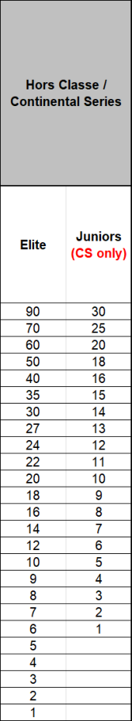
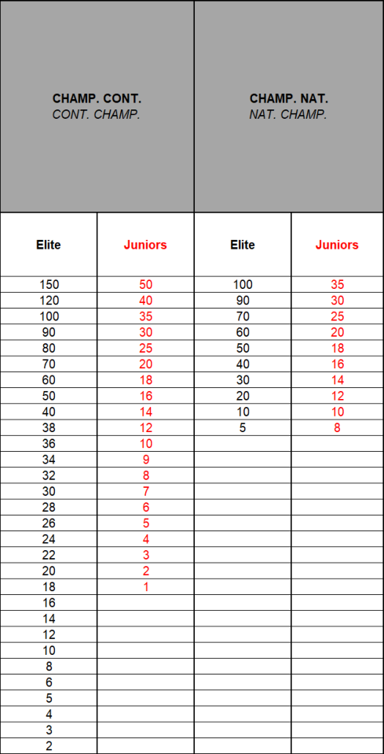

> **Amendment — tracked changes.** This document shows UCI’s amendments as tracked changes: <del>struck-through</del> text is being removed and the adjacent plain text is its replacement. Some character-level edits (numbers, word fragments) from the source PDF may display imperfectly — for the clean, in-force wording see the consolidated regulation in the sidebar or the [official PDF](https://www.uci.org/regulations/3MyLDDrwJCJJ0BGGOFzOat).

MEMORANDUM 29.09.2026 

**PART IV MOUNTAIN BIKE Rules amendments applying on 01.01.2027** 

## **Chapter I - GENERAL RULES** 

### **Enduro - EDR** 

**4.1.007bis** Except for the UCI World Championships and UCI World Cup, enduro competitions are open to all riders aged 17 or over. 

At the UCI World Championships and at the UCI World Cup, separate enduro junior competitions must be organized for men and women (aged 17 and 18). 

At the Continental Championships and at the National Championships, separate junior competitions may be organised for men and women (aged 17 and 18). In this case, separate results must be sent to the UCI. 

For all other enduro competitions on the international calendar, the UCI points are awarded in relation to the riders’ time and not to their category. To ensure that this rule is correctly applied, only one combined result shall be sent to the UCI. 

_(article introduced on 01.01.13; text modified on 01.01.23; 01.01.25, 01.01.27)._ 

#### **§ 3 Calendar** 

- **4.1.011** International mountain bike races are registered on the UCI international calendar in accordance with the following classification: 

   - Olympic Games <del>(OG)</del> 

      - No other international mountain bike competition of cross-country (XC) may be organised during the mountain bike competition of the Olympic Games. 

   - UCI World Championships <del>(CM)</del> 

      - No other international mountain bike competition of the same format may be organised during the UCI World Championships. 

   - UCI World Cup <del>(CDM)</del> 

      - No hors class or UCI Mountain Bike Continental Series <del>or class 1</del> competition of the same format may be organised on the same continent on the same day as a UCI World Cup competition. 

      - No Class 1 competition of the same format may be organised in the same country on the same day as a UCI World Cup competition. 

      - The continental championships <del>(CC)</del> and national championships <del>(CN)</del> in a format may not be organised during a UCI World Cup competition in the same format. 

Page **1** / **31** 

Allée Ferdi Kübler 12 1860 Aigle Switzerland 

T: +41 24 468 58 11 E: admin@uci.ch 

- UCI Masters World Championships <del>(CMM)</del> 

- Continental championships <del>(CC)</del> 

   - No National Championship, hors class, UCI Mountain Bike Continental Series or class 1 competition of the same format may be organised on the same continent on the same day as a continental championships. 

- UCI Mountain Bike Continental Series ( <del>CS)</del> 

- Upon consultation with the respective Continental Confederation, the UCI will appoint a certain number of competitions to be part of each UCI Mountain Bike Continental Series in accordance with the dedicated document publised by the UCI. 

- The competition name must be UCI Mountain Bike Continental Series followed by the competition name. 

- No UCI Mountain Bike Continental Series may be organised during the UCI Mountain Bike World Championships, the UCI Mountain Bike World Cup or the Continental Championships of the same format on the same continent. 

- Stage races 

- Class: Hors class <del>(SHC)</del> / Class 1 <del>(S1)</del> / Class 2 <del>(S2)</del> 

- No stage race Hors Class may be organised during the mountain bike competition of the Olympic Games, or the UCI World Championships cross-country (XC) or marathon, in the concerned continent. 

- ▪  No stage race, in HC or C1, may be organised during the Continental Championships of the same format on the concerned continent. 

- One-day races 

- Class: Hors class <del>(HC)</del> / Class 1 <del>(C1)</del> / Class 2 <del>(C2)</del> / Class 3 <del>(C3)</del> 

- UCI XCO junior series: 

- The UCI will appoint a certain number of UCI XCO junior series competitions every year in accordance with the dedicated document published by the UCI. 

- National Championships: 

- National championships cannot be run during the mountain bike competition at the Olympic Games, UCI World Championships or UCI World Cup of the same format and cannot be run during continental championships of the same format on the concerned continent. 

- Cross-country Olympic (XCO) or cross-country short track (XCC) national championships cannot be run during an international mountain bike race. For all other formats, in the competition a national championship is incorporated in an international mountain bike race, a rider can only receive points once. The riders with the sporting nationality of the national federation will receive the national championships points according to their rank in the race (i.e. including all riders regardless of their sporting nationality) and other riders will receive the class competition points according to their rank in the race. 

- Regional Games <del>(JR)</del> 

The competitions status for stage races and one-day races are allocated to each competition annually by the UCI on the basis of the commissaires race report from the 

Page **2** / **31** 

Allée Ferdi Kübler 12 1860 Aigle Switzerland 

T: +41 24 468 58 11 E: admin@uci.ch 

preceding year and any other information at disposal of the UCI. A new competition may only be given class 2 or 3 status in its first year. 

HC status can only be given with the following cumulative conditions: 

- Competition registered for at least the last three years as C1 on the UCI International Calendar 

- A separate under 23 race registered for both genders for XCO 

- At least eight riders from the top 50 of the UCI ranking for both gender 

- At least ten nations represented in the last edition of the competition 

- A high level tv production for the Elite categories taking into account the sporting aspect 

Under exceptional circumstances and justified reasons related to development, the UCI can grant derogations awarding HC status to competitions which do not meet the criteria above. 

A detailed technical guide must be presented to UCI during the calendar registration process. A template for such technical guide is provided by UCI upon request. All competitions registered on the UCI international calendar must respect the UCI financial obligations (in particular calendar fee, prize money) approved by the UCI and published on the UCI website. 

Race entry fees, including uplift ticket for downhill and enduro, for competitions on the international calendar are waived for any rider belonging to a UCI MTB WORLD SERIES TEAM. This applies only to the format in which the team has UCI MTB WORLD SERIES TEAM status. <del>and does not apply to stage races, eliminator and enduro competitions.</del> (text modified on 1.02.12; 1.10.13; 4.04.14; 1.01.16; 1.01.17; 1.01.19, 1.01.21; 1.01.22; 1.01.23; 1.01.24; 1.01.25; 1.01.26, 01.01.27). 

### **Before the start** 

- **4.1.024** The course of each competition must be clearly defined before the start and displayed at registration or made available online. Access to the course is under <del>UCI</del> the control of UCI officials from the time that the UCI technical delegate or, where applicable, the president of the commissaires’ panel appointed for the competition arrives (course inspection). 

Before they arrive, access to the course must be subject to the laws in force and local rules governing the competition venue. The organiser may not refuse access to the course for any other reason. 

(text modified on 01.01.27). 

Page **3** / **31** 

Allée Ferdi Kübler 12 1860 Aigle Switzerland 

T: +41 24 468 58 11 E: admin@uci.ch 

### **Conduct of riders** 

- **4.1.035** If a rider exits the course with one or both wheels for any reason, he/she must return to the course between the same two course markers where he/she exited. 

<del>In case a rider fails to return to the course as provided for in this article, the commissaires</del> ’ <del>panel can disqualify the rider.</del> 

(text modified on 1.01.16; 1.01.19; 01.01.27). 

- **4.1.036** The riders undertake to respect nature and the environment throughout the course and not pollute the site. Littering of any kind is strictly prohibited on the course. If a littering zone is implemented on the course, riders must use it and must abide by any instructions given in this respect. 

(text modified on 01.01.25; 01.01.26; 01.01.27). 

   - **§ 10 UCI International Elite Number System** 

- **4.1.049** Riders who have won an Elite UCI World Cup race (XCO, DHI, EDR) will be asked to select a career number (2-999) for the UCI Mountain Bike World Cup (XCO, DHI, EDR). 

<del>Upon retirement being confirmed to the UCI or communicated publicly, a rider</del> ’ <del>s unique career number will be made available for allocation to other riders.</del> A rider’s unique career number will be made available for allocation to other riders one season after publicly announcing or communicating their retirement to the UCI, provided they have not participated in a UCI World Cup competition in the format corresponding to their number, or two seasons after not having participated to a UCI World Cup competition in the discipline corresponding to their number. 

- <del>Elite riders will be asked to select their number in descending order starting with the rider who currently has the highest number of UCI World Cup wins.</del> 

For the UCI World Cup, the current UCI World Cup leader will race with number 1, superseding <del>his</del> their unique career number. 

_(article introduced on 01.01.25; text modified on 01.01.26; 01.01.27)_. 

## **Chapter II CROSS-COUNTRY COMPETITIONS** 

**Cross-country eliminator – XCE** 

**Organisation of competition** 

**<del>Qualifying round</del>** 

Page **4** / **31** 

Allée Ferdi Kübler 12 1860 Aigle Switzerland 

T: +41 24 468 58 11 E: admin@uci.ch 

- **4.2.011** <del>A</del> t least 6 riders must be entered for the qualifying round, otherwise no XCE competition may be held. 

The complete program, qualifying round and main competition shall be organized on the same day. Upon reasoned request, the UCI may allow the race program to be split over 2 different days (one day for the qualifying round and one day for the main competition). 

The qualifying round takes the form of an individual timed run of one lap of the course and a maximum of 4 subsequent qualification heats. <del>The best 32 riders (8x4) go through to the main competition.</del> 

<del>In case of a tie between riders during the qualifying round, their order is determined by the last UCI XCO individual ranking. If the riders are not ranked in the UCI XCO individual ranking, lots are drawn to determine their order</del> 

The qualification heats are elimination heats in which the riders who are not directly qualified for the main competition after the timed run are matched in groups of 2, 3 or 4 riders and compete for a spot in the main competition. The qualification heats are run over 1 lap. 

The main competition comprises elimination heats in which the riders are matched in groups of 3 or 4 riders. If the length of the course is 700m or less, the elimination heats of the main competition are run over 2 laps. Upon reasoned request, the president of the commissaires’ panel may adjust the number of laps to allow for a compact race program. 

<del>If there are less than 6 finishers in the timed run, the competition may not proceed to the main competition and no results shall be established.</del> 

#### **Qualifying round (QR)** 

The race numbers for the <del>qualifying rounds</del> timed run are in sequence, starting from 33, based on the most recent UCI XCE World Cup standing and UCI XCO individual ranking and in the following order: 

1. riders ranked in the top 32 men and the top 16 women of the most recent UCI XCE World Cup standing (for the first competition, as per the final UCI XCE World Cup standing of the previous year) in ascending order <del>rank;</del> 

2. <del>standings of the previous year</del>; 

3. <del>classified e</del> lite and U23 riders ranked in the UCI ranking in <del>with</del> ascending order <del>rank;</del> 

4. <del>classified j</del> unior riders ranked in the UCI ranking in <del>with</del> ascending order <del>rank;</del> 

5. unclassified elite and U23 riders in random order; 

6. unclassified junior riders in random order. 

Page **5** / **31** 

Allée Ferdi Kübler 12 1860 Aigle Switzerland 

T: +41 24 468 58 11 E: admin@uci.ch 

The riders start in the timed run <del>sequence by</del> following the order of race numbers, the highest number starting first. The women ride before the men. 

If qualification heats are held, they take place after the men’s timed run. The women’s qualification heats take place before the men’s. 

A rider must finish the timed run in order to be ranked. In case of a tie between riders in the timed run, their order is determined by giving precedence to the rider with the smaller race number. 

The following rules apply for qualification to the main competition, according to the number of riders ranked after the timed run: 

|**Number** **of riders**|**Riders going to qualification** **heats**|**Riders qualified for** **main competition**|**Maximum** **number of riders** **in main** **competition**|
|---|---|---|---|
|4 – 5|/|4|4|
|6 - 8|/|8|8|
|9 - 11|Riders ranked 8 to 11 in timed run|- top 7 of the timed run - winner of the qualification heat|8|
|12 – 16|/|All riders|16|
|17 - 23|Riders ranked 14 to 23 in timed run Qualification heat 1:  14 – 19 – 22 Qualification heat 2: 15 – 18 – 21 Qualification heat 3: 16 - 17 – 20 – 23|- top 13 of the timed run - winner qualification heat 1: 14 - winner qualification heat 1: 15 - winner qualification heat 1: 16|16|
|24 - 32|/|All riders|32|
|33 - 35|Riders ranked 29 to 35 in timed run Qualification heat 1: 29 – 31 – 34 Qualification heat 2: 30 – 32 – 35|- top 28 of the timed run - top 2 qualification heat 1: 29 - 31 - top 2 qualification heat 2: 30 - 32|32|
|> 35|Riders ranked 29 to 44 in timed run Qualification heat 1: 29 – 36 – 40 - 44 Qualification heat 2: 30 – 35 – 39 - 43 Qualification heat 3: 31 – 34 – 38 - 42 Qualification heat 4: 32 – 33 – 37 - 41|- top 28 of the timed run - winner qualification heat 1: 29 - winner qualification heat 2: 30 - winner qualification heat 3: 31 - winner qualification heat 4: 32|32|

Page **6** / **31** 

Allée Ferdi Kübler 12 1860 Aigle Switzerland 

T: +41 24 468 58 11 

E: admin@uci.ch 

Riders qualified through the qualification heats are ranked in the qualifying round immediately after the directly-qualified riders (the top riders of the timed run). The winners of the qualification heats are ranked first, in order of heat number (winner of heat 1, then winner of heat 2, and so on); where a heat also qualifies its secondplaced rider, all heat winners are ranked ahead of all second-placed riders, the second-placed riders then being ordered by heat number. 

_(text modified on 1.02.12; 1.07.12; 1.01.21; 1.01.22; 1.01.23; 01.01.27)._ 

#### **Main competition** 

**4.2.012** The race numbers for the main competition are allocated on the basis of the results of the qualifying round, starting with the number 1 for the winner of the qualifying round. 

The main competition comprises elimination heats in which the groups of riders are matched as shown in the tables in Annexes 5 - XCE competition formats. 

Heat order: 

- men first until women come to equal round of main competition <del>heat system</del>; 

- finals: women small final <del>followed by</del>; 

   - men small final <del>followed by;</del> 

   - women big final <del>and followed by;</del> 

   - men big final. 

Intentional contact by pushing, pulling or other means which causes another competitor to slow down, fall or exit the course is not allowed and results in disqualification for breach of UCI rules (DSQ) of the originator. 

At the sole discretion of the commissaires’ panel, a rider can be announced relegated (REL) and will be given a heat position different to that of his actual finish. 

Riders who are DNF, DSQ or DNS in the semi-finals may not enter the small final. 

- The final classification of the competition is drawn up in groups in the following order: 1. All riders competing in the big final, except for riders DSQ; 

2. All riders competing in the small final, except for riders DSQ; 

3. Riders DNF or DNS in the semi-finals; 

4. The classification of the other riders is determined by the round reached, then by the classification in their heat, then by their race number; 

5. The classification of the riders not qualified for the main competition is determined by their result in the timed run. 

Within each of the above-mentioned groups, riders DNF are classified before DNS. In case of multiple DNF or DNS, the tiebreaker is the race number. 

Riders DNF or DNS in the first round of the main competition are listed without classification. 

Riders DSQ in the main competition are listed without classification. 

Page **7** / **31** 

Allée Ferdi Kübler 12 1860 Aigle Switzerland 

T: +41 24 468 58 11 E: admin@uci.ch 

All riders ranked after a rider DSQ are re-ranked one place higher within the affected phase only. No rider eliminated in an earlier phase can move up in the final classification. For example, in case of a DSQ in the big final, all riders ranked after the DSQ rider will be ranked one place higher and the rank four in the final classification will remain unallocated. 

<del>Riders not qualified for the main competition are not listed in the final classification.</del> 

_(text modified on 1.02.12; 1.01.19; 1.01.22; 01.01.27)._ 

## **Chapter III DOWNHILL COMPETITIONS** 

#### **§ 2 Course** 

**4.3.006** The length of the course and the duration of the competition are determined as follows: 

<del>Minimum Maximum</del> 

<del>Course length 1500m 3500 m Duration of the competition  2 minutes 5 minutes</del> Course length Minimum 1500m - Maximum 3500 m Or duration as per table below: 

||UCI World Ch UCI World Cu Championship Mountain Bike Series, Hors C competitions|ampionships, p, Continental s, UCI Continental lass, Class 1|Class 2 com|petitions|Class 3 competitions|
|---|---|---|---|---|---|
||Minimum|Maximum|Minimum|Maximum||
|Duration of the competition|2 minutes|5 minutes|1 minute|5 minutes|No restriction|

(text modified on 1.01.16; 1.01.25; 1.01.26, 1.01.27) 

**4.3.010** The finish area must be at least 6 meters wide. 

There must be a braking area of minimum 35 <del>-50</del> m after the finish line <del>with adequate protection and c</del> ompletely cordoned off from the public. The riders exit must be designed in that way that the speed is kept to a minimum. 

This area must be free of obstacles. 

#### **§ 6 Training** 

**4.3.021** The following training sessions must be organised: 

Page **8** / **31** 

Allée Ferdi Kübler 12 1860 Aigle Switzerland 

T: +41 24 468 58 11 E: admin@uci.ch 

- an on-foot inspection of the course must be organised before the first training session. No bikes are allowed on the course during the on foot downhill course inspection. <del>The on-foot inspection is reserved exclusively for riders, the team managers and the coaches who must hold a valid license. Other team staff are not allowed to attend the on-foot inspection.</del> 

On foot inspections for UCI Mountain Bike World Cup competitions and UCI Mountain Bike World Championships are defined in article 4.11.006. 

- a training session, the day before competition. 

- a training session on the morning of the race day. 

No training is permitted whilst a race is in progress. 

(text modified on 1.01.20; 1.01.26; 1.01.27). 

- **4.3.024** Riders must display their handlebar number while training and <del>as well as their back number d</del> uring the qualifying round and the final. 

## **Chapter V ENDURO COMPETITIONS** 

   - **§ 1 Competitions characteristics** 

- **4.5.001** The race includes several liaison stages and timed stages (special stages). 

The times achieved in all timed stage will be accumulated to a total time. 

An enduro course comprises varied off-road terrain. The track should include a mixture of narrow and wide, slow and fast paths and tracks over a mixture of off-road surfaces. Each timed stage must be predominantly descending but small pedalling or uphill sections are acceptable. Stages must focus on testing the rider’s technical skills. 

Liaison stages can include either mechanical uplift (e.g. chairlift), pedal powered climbs or a mixture of both. The emphasis of the track must be on rider enjoyment, technical and physical ability. 

Any other system may be acceptable only under exceptional circumstances and subject to prior authorisation from the UCI. 

_(text modified on 01.01.26; 01.01.27)._ 

#### **§ 5 Course marking** 

- **4.5.007** Extra care must be taken by the organiser to make sure that the course is clearly marked and no shortcuts are possible. 

Page **9** / **31** 

Allée Ferdi Kübler 12 1860 Aigle Switzerland 

T: +41 24 468 58 11 E: admin@uci.ch 

Taking shortcuts on course to gain an advantage can damage both the environment and bring the sport of enduro mountain bike racing into disrepute. Where no defined trail exists, the organiser should mark the course to keep the riders on the intended racecourse. If a clear and defined trail exists, the organiser may choose to create gates. In this instance riders must ride the existing defined trail between gates and not look to leave the trail to take a short cut and gain an unfair advantage. 

Therefore, any rider trying to save time by intentionally choosing a line that lies outside of the marked, defined racecourse will be disqualified (DSQ). 

Any rider found damaging the course or altering a Special Stage without the UCI approval will be subject to a penalty including disqualification (DSQ). 

_(text modified on 01.01.26; 01.01.27)._ 

- **4.5.011** The organiser must provide the start times for each timed stage. Competitions other than UCI World Championships may choose start waves instead of start times. 

(text modified on 01.01.26; 01.01.27). 

- **4.5.012** Each rider takes an individual start, the start interval between the riders must be of 10 seconds at least. 

Riders must present themselves at the start line in time for their preassigned stage start time. 

All Special Stages will have a check-in point close to, but before the Special Stage start line. Riders must pass through this check-in point to record a check-in time. The checkin time may be used by Race Control to provide additional evidence of a rider’s arrival time at a Special Stage start in case of any delay or dispute around stage start time. 

All late riders must start only under instructions from the official starter, who will determine a suitable gap in the start order. No fixed start interval will be applied between late starters as the goal is to keep late riders in the competition, without affecting other riders. 

In cases where the late starter is delayed further due to insufficient gaps in the start order, penalties will be calculated based on a rider’s check-in time. If a rider fails to checkin, the penalty will be based on their Special Stage start time. 

Late starters will receive a fixed penalty: 

- up to 5 minutes late = 1-minute penalty; 

- 5+ minutes late = 5-minute penalty; 

- 30+ minutes late = DNF. 

Page **10** / **31** 

Allée Ferdi Kübler 12 1860 Aigle Switzerland 

T: +41 24 468 58 11 E: admin@uci.ch 

Any rider arriving at the start of a Special Stage later than 30 minutes after their specified start time will be assigned a DNF for the race and will not be allowed to continue. 

Except for the UCI World Championships, start waves may replace start times. In that case, a rider can start within a stage opening time window indicated by the organiser. Riders start in order of arrival. Any rider arriving at the start of a Special Stage later than the authorized start window will be assigned a DNF for the race and will not be allowed to continue. 

#### **Start Penalties** 

Riders must start from a stationary position with their front wheel on the start line. Run up starts are not permitted. 

Any rider starting before the starter’s orders may be subject to a penalty. Other Start Violations (example: pushing into queue, delaying start, jumping start etc.) may also be subject to penalty. 

#### **Delays** 

Any delay applied to Special Stage start times must be maintained throughout that day of racing. Commissaires must not attempt to catch up on delays while racing is underway. 

Example. If there is a 10-minute course hold on Special Stage 1, 10 minutes must be added to the start times of all remaining Special Stages, for all riders effected by the hold, for the remainder of the race. 

#### **Disrupted race stage.** 

In the competition of a rider being delayed on a Special Stage due to assisting another rider in a medical emergency or due to some other circumstance outside of their control, such as a race hold on that Special Stage, and only if Race Control decide it is appropriate, a rider may be offered a re-run on that Special Stage. 

If Race Control deem that a re-run of the Special Stage in question is not possible then at the end of the race the rider will be allocated an “average” Special Stage position and time. This will be calculated as follows: 

Race control will take the rider’s actual finishing position across all Special Stages completed, minus his worst stage result and using this calculate their average stage finishing position. This average Special Stage position will then be awarded for the incomplete stage. 

_(text modified on 01.01.26; 01.01.27)._ 

- **4.5.017** The transport of riders between Special Stages by private/team transport (shuttling) is strictly limited to official training and may be used only when an official rider shuttle provided by the organiser operates on the same route. Any rider found using a private or team vehicle at any other time or on any other route may be subject to penalties. 

Page **11** / **31** 

Allée Ferdi Kübler 12 1860 Aigle Switzerland 

T: +41 24 468 58 11 E: admin@uci.ch 

Any venue specific details or restrictions on shuttling will be outlined in the <del>Race Book</del> Technical Guide and the official training schedule. 

During the race, no private/team transport can be used at any time. 

(article introduced on 01.01.26; _text modified on 01.01.27_ ). 

## **Chapter IX - UCI MOUNTAIN BIKE WORLD SERIES** 

### **§ 1 General** 

### **Registration** 

- **4.9.003** All riders must be registered using the online registration system through a dedicated website provided by the UCI or its promoter, if any. UCI MTB WORLD SERIES TEAMS, <del>and wild cards</del> UCI MTB TEAMS which have been awarded a wild card, and UCI MTB Enduro Teams can register their riders. National federations register the other riders who qualify under provisions on participation. 

A table showing the opening and closing dates for entries is published on the UCI website. 

_(text modified on 01.01.25; 01.01.27)._ 

- **4.9.004** All riders, their team managers or their representatives must attend the riders’ confirmation presenting the rider licenses and picking up the race numbers within the deadlines indicated on the official schedule <del>program</del> published on the dedicated website for the UCI Mountain Bike World Series. Riders who are not confirmed before the indicated deadline are considered not to have completed the registration procedure and will not be allowed to compete in the competition. 

_(text modified on 01.01.27)._ 

- **4.9.005** Late entries from UCI MTB WORLD SERIES TEAMS, UCI MTB TEAMS, national federations and riders shall be disregarded. Derogations can be granted upon receipt of a reasoned request <del>are refused unless authorised</del> and subject to compliance with provisions for participation as well as payment of a fine of EUR 300. 

Late entries are entries handled after the on-line registration deadline. <del>and before the riders</del> ’ <del>confirmation deadline. Passed the</del> Late entries submitted after opening of the riders’ confirmation deadline <del>late entries are</del> shall not be considered. 

_(text modified on 01.01.25; 01.01.27)._ 

Page **12** / **31** 

Allée Ferdi Kübler 12 1860 Aigle Switzerland 

T: +41 24 468 58 11 E: admin@uci.ch 

#### **Leader's jersey** 

- **4.9.008** The colours and the design of the leaders’ jerseys shall be communicated to the riders concerned once approved by the UCI. The leader’s jersey may vary in design according to UCI’s or the promoter’s (if any) guidelines. 

_(text modified on 01.01.27)._ 

## **Chapter X UCI MOUNTAIN BIKE CROSS-COUNTRY WORLD CUP** 

### **Participation** 

**4.10.001** UCI Cross-country World Cup competitions (XCO and XCC) are open to riders corresponding to the following categories and criteria: 

|**Category**|**One of the below mentioned criteria needs to be fulfilled**|
|---|---|
|XCO - men elite (aged 23 and over) XCO - women elite (aged 23 and over)|1. UCI MTB WORLD SERIES TEAM, maximum 4 riders per race and category. Individual rights acquired by riders to enter one or several UCI Mountain Bike World Cup competitions through their results or ranking, as set out below, shall not allow the UCI MTB TEAM to enter more than 4 riders. 2. Maximum 8 UCI MTB TEAM wild cardsper competition, maximum 4 riders per race and category decided one month prior the competition.Individual rights acquired by riders to enter one or several UCI Mountain Bike World Cup competitions through their results or ranking, as set out below, shall not allow the UCI MTB TEAM to enter more than 4 riders. 3. Any rider ranked in the top 100 of the<del>last </del>UCI XCO individual rankingat the date referenced in the UCI Mountain Bike World Cup official document published on the UCI website. <del>before the</del> <del>competition entry closing date (one month prior to the competition)</del> 4. The national federations may enter a maximum of 3 supplementary riders per category. These riders must wear national team clothing. 5.Thetop three riders,excluding members of UCI WORLD SERIES TEAM,of any round of a UCI Mountain Bike Continental Seriesqualify for entry<del>limited</del> to one round of the UCI Mountain Bike World Cup within 52 weeks of<del>the qualification</del>such competition(Golden Ticket).<del>Not applicable for riders member of a</del> <del>UCI MTB WORLD SERIES TEAM.</del> 6.Thetop five riders,excluding members of UCI WORLD SERIES TEAM,from the final standings(Elite)of any <del>of theU</del>CI Mountain|

Page **13** / **31** 

Allée Ferdi Kübler 12 1860 Aigle Switzerland 

T: +41 24 468 58 11 E: admin@uci.ch 

||Bike Continental Series of the previous year<del>Elite.</del> <del>Not applicable</del> <del>for riders member of a UCI MTB WORLD SERIES TEAM.</del> 7.Thetop five riders,excluding members of UCI WORLD SERIES TEAM,from the(U23)final standings of any<del>of theU</del>CI Mountain Bike Continental Series of the previous year,<del>U23,i</del>fthe rider concernedprogresses totheElite category.<del>Not applicable for</del> <del>riders member of a UCI MTB WORLD SERIES TEAM. </del> 8. Current Olympic Champion, UCI World Champion, Continental Champions, National Champions|
|---|---|
|**Category** XCO - Men Under 23 (aged from 19 to 22) XCO - Women Under 23 (aged from 19 to 22)|**One of the below mentioned criteria needs to be fulfilled**   1. UCI MTB WORLD SERIES TEAM, maximum 4 riders per race and category. Individual rights acquired by riders to enter one or several UCI Mountain Bike World Cup competitions through their results or ranking, as set out below, shall not allow the UCI MTB TEAM to enter more than 4 riders. 2. Maximum 8 UCI MTB TEAM wild cardsper competition, maximum 4 riders per race and category decided one month prior the competition.Individual rights acquired by riders to enter one or several UCI Mountain Bike World Cup competitions through their results or ranking, as set out below, shall not allow the UCI MTB TEAM to enter more than 4 riders. 3. Any rider ranked in the top 200 of the<del>last </del>UCI XCO individual rankingat the date referenced in the UCI Mountain Bike World Cup official document published on the UCI website. <del>before the</del> <del>competition entry closing date (one month prior to the competition)</del> 4. The national federations may enter a maximum of 4 supplementary riders per category. These riders must wear national team clothing. 5.Thetop three riders,excluding members of UCI WORLD SERIES TEAM,of any round of a UCI Mountain Bike Continental Seriesqualify for entry<del>limited</del> to one round of the UCI Mountain Bike World Cup within 52 weeks of<del>the qualification</del>such competition(Golden Ticket).<del>Not applicable for riders member of a</del> <del>UCI MTB WORLD SERIES TEAM.</del> 6.Thetop five riders,excluding members of UCI WORLD SERIES TEAMS,from the final standings(U23)of any<del>of theU</del>CI Mountain Bike Continental Series of the previous year<del>U23. Not applicable</del> <del>for riders member of a UCI MTB WORLD SERIES TEAM.</del> <del>7. Top five riders from the final standings of any of the UCI</del> <del>Mountain Bike Continental Series of the previous year, Junior (if</del> <del>progressing into U23 category) </del>|

Page **14** / **31** 

Allée Ferdi Kübler 12 1860 Aigle Switzerland 

T: +41 24 468 58 11 E: admin@uci.ch 

||_<del>Not applicable for riders member of a UCI MTB WORLD SERIES</del>_ _<del>TEAM</del>_ 7. UCI World Champion, Continental Champions, National Champions|
|---|---|
|**Category**|**One of the below mentioned criteria needs to be fulfilled**|
|XCC – men elite (aged 23 and over) XCC – women elite (aged 23 and over) XCC – men under 23 (aged from 19 to 22)|Riders already registered and confirmed for the XCO competition taking place during the same weekend shall be allowed to start in the XCC competition. The riders shall be selected as per article 4.10.003, points 1 and 2, to reach a total number of 40 riders per gender. On top of those 40 riders, wild cards can be awarded as per article 4.10.003, point 3and to the current UCI Mountain Bike|
|XCC – women under 23 (aged from 19 to 22)|Cross-country Short Track World Champion. No online registration is required for the XCC competition. The same bike must be used for XCC and XCO. For XCC, the minimum tyre width must be 45mm.|

#### **Registration** 

Riders registration can be done only by a UCI MTB WORLD SERIES TEAM, a UCI MTB TEAM or a national federation. 

If a rider that confirmed his participation to the XCC competition is not starting, he will not be allowed to start the XCO competition on the same world cup round unless if the rider has been declared medically unfit to start the XCC competition by the organiser’s chief medical officer or the team doctor. The rider must then be declared medically fit prior to starting the XCO, no later than 2 hours prior to the race start time. 

#### **Wild cards** 

Criteria to award the maximum 8 UCI MTB TEAM wild cards (as per point 2 of the participation criteria for XCO competitions) per competition will be based on the: 

- UCI team ranking, current and previous season 

- Profile of any individual riders 

- UCI Team composition (multi-category, multi-gender) 

- Profile of team sponsors (out of industry, global, etc.) 

- Media profile of team (social media, etc.) 

- Any injury issues during current or previous season 

- Home country of team 

- UCI Mountain Bike Continental series <del>team standing p</del> articipation 

The UCI shall determine the ponderation for each of these criteria. It may also take into consideration, at its discretion, relevant facts or circumstances for the purpose of assessing the applicant teams’ entitlement to UCI MTB WORLD SERIES TEAM status, in particular, in the case of a tie upon ponderation of the applicable criteria. 

Page **15** / **31** 

Allée Ferdi Kübler 12 1860 Aigle Switzerland 

T: +41 24 468 58 11 E: admin@uci.ch 

Prior to issuing a decision, the UCI can request the production of information or documents to assess the applicable criteria <del>above.</del> The UCI may also take established facts into account at its own initiative. 

(text modified on 1.01.25; 1.01.26; 01.01.27). 

### **Start order – call-up** 

- **4.10.003** The start order is determined as follows: 

XCC men elite and women elite, XCC men under 23 and women under 23 

1. riders ranked in the top 16 of the most recently published XCO UCI World Cup standings (not applicable for the first UCI World Cup round of the season) 

2. as per the most recently published UCI XCO individual ranking 

3. riders ranked in below rankings, unless they are listed on the start order above: - top 10 of the UCI Cyclo-cross individual ranking on 28 February (same 

year); 

   - top 20 of the UCI Road individual world ranking on 30 October 

   - (preceding year). 

The place 41st and after will be allocated following the rank of each rider, whatever the ranking: UCI cyclo-cross or UCI road world ranking. If two or three riders have the same ranking, they will be placed by drawing lots. 

Riders with injury status shall be integrated in the start order in accordance with article 4.10.011. 

Riders with pregnancy status shall be integrated in the start order in accordance with article 4.10.012. 

XCO men elite and women elite 

1. the riders ranked in the top 24 of the XCC race of the same UCI World Cup round 

2. the place 25th to 32nd will be allocated as per the most recently published UCI XCO individual ranking. 

3. Place 33rd to 40th of the start order will be allocated to riders ranked in below rankings, unless they are listed on the start order between the place 1st to 32nd according to point 1 and 2 above: 

   - top 10 of the UCI cyclo-cross individual ranking 

   - top 20 of the UCI road individual world ranking 

The place 33rd to 40th will be allocated following the rank of each rider, whatever the ranking: UCI cyclo-cross or UCI road world ranking. If two or three riders have the same ranking, they will be placed by drawing lots. 

4. as per the most recently published UCI XCO individual ranking. 

5. unclassified riders: by drawing lots. 

Riders with injury status shall be integrated in the start order in accordance with article 4.10.011. 

Riders with pregnancy status shall be integrated in the start order in accordance with article 4.10.012. 

T: +41 24 468 58 11 Page **16** / **31** E: admin@uci.ch 

Allée Ferdi Kübler 12 1860 Aigle Switzerland 

XCO men under 23 and women under 23: 

1. the riders ranked in the top 24 of the XCC race of the same UCI World Cup round 

2. as per the most recently published UCI XCO individual ranking 

3. unclassified riders; by drawing lots 

Riders with injury status shall be integrated in the start order in accordance with article 4.10.011. 

Riders with pregnancy status shall be integrated in the start order in accordance with article 4.10.012. 

Riders shall be called by the UCI commissaires to take their place on the starting grid, one by one and in the start order set out above. The call-up of the first eight riders of the start order may be organised separately. 

_(text modified on 1.01.24; 1.01.25; 1.01.26; 01.01.27)._ 

### **Official ceremony** 

**4.10.007 &** The official ceremony takes place immediately after each race. Riders arriving later **4.11.017 &** than 5 minutes after they finished their race are fined. **4.13.008** 

The following riders must attend: 

- the first three riders in the elite XCO competitions; 

- the first three riders in the elite XCC competitions; 

- the leader of the elite UCI World Cup standings after the competition in question (XCO, XCC); 

- the first three riders in the under 23 competitions (XCO, XCC); 

- the leader of the under 23 UCI World Cup standings after the competition in question (XCO, XCC); 

- the team leading the team standings after the competition in question (specified in article 4.10.009). 

   - <del>the team of the day.</del> 

The first three riders in the race and the leader of the general classification of the UCI World Cup must attend the podium. 

The UCI Mountain Bike World Cup licensee shall award a trophy to the first three of the final classification of the UCI Mountain Bike World Cup in each category. 

N.B - Bicycles cannot be taken onto the podium. However, an area is provided in front of the podium to display the bicycle of the winner during the official ceremony. 

(text modified on 01.01.25; 01.01.26, 01.01.27). 

Page **17** / **31** 

Allée Ferdi Kübler 12 1860 Aigle Switzerland 

T: +41 24 468 58 11 E: admin@uci.ch 

### **Injury status** 

#### **4.10.011 &** 

#### **4.11.021 &** 

- **4.13.012** If due to injury a rider took part in less than three rounds of the UCI World Cup in a season, the national federation and the team may apply to the UCI for recognition of injury status. An application must be received at the UCI in writing no later than <del>October 30th D</del> ecember 31st of the disrupted season. 

A rider with injury status shall be integrated in the ranking that is used to determine the start list, with the number of points determined according to following calculation: the average points gained per round in which the rider took part multiplied by the number of rounds of the UCI World Cup season during which the rider was absent due to injury. 

In case the rider is no longer included in the UCI World Cup standings, his UCI ranking of the year n-2 on 31 December will be considered. 

Such benefit shall be limited to the first two rounds of the UCI World Cup in which the rider takes part during the following season. 

(text modified on 01.01.24; 01.01.26; 01.01.27) 

## **Chapter XI - UCI MOUNTAIN BIKE WORLD SERIES – DOWNHILL** 

### **Participation** 

**4.11.001** UCI Downhill World Cup competitions are open to riders corresponding to the following categories and criteria: 

|**Category**|**One of the below mentioned criteria needs to be fulfilled**|
|---|---|
|DHI - men elite|1. UCI MTB WORLD SERIES TEAM, maximum 4 riders per race|
|(aged 19 and over)|and category. Individual rights acquired by riders to enter one or|
|DHI - women elite|several UCI Mountain Bike World Cup competitions through their|
|(aged 19 and over)|results or ranking, as set out below, shall not allow the UCI MTB TEAM to enter more than 4 riders. 2. Maximum 8 UCI MTB TEAM wild cardsper competition, maximum 4 riders per race and category decided one month prior the competition.Individual rights acquired by riders to enter one or several UCI Mountain Bike World Cup competitions through their results or ranking, as set out below, shall not allow the UCI MTB TEAM to enter more than 4 riders. 3. Any rider ranked in the top 50 of the<del>last </del>UCI DHI individual ranking at the date referenced in the UCI Mountain Bike World Cup|

Page **18** / **31** 

Allée Ferdi Kübler 12 1860 Aigle Switzerland 

T: +41 24 468 58 11 

E: admin@uci.ch 

||official document published on the UCI website. <del>before the</del> <del>competition entry closing date (one month prior to the competition)</del> 4. The national federations may enter a maximum of 3 supplementary riders per category. These riders must wear national team clothing. 5.Thetop three riders,excluding members of UCI WORLD SERIES TEAMS,of any round of a UCI Mountain Bike Continental Seriesqualify for entry<del>limited</del> to one round of the UCI Mountain Bike World Cup within 52 weeks of<del>the qualification</del>such competition(Golden Ticket).<del>Not applicable for riders member of a</del> <del>UCI MTB WORLD SERIES TEAM.</del> 6.Thetop five riders,excluding members of UCI WORLD SERIES TEAMS,from the final standings (Elite) of any<del>of theU</del>CI Mountain Bike Continental Series of the previous year<del>Elite.</del> <del>Not applicable</del> <del>for riders member of a UCI MTB WORLD SERIES TEAM.</del> 7.Thetop five riders,excluding members of UCI WORLD SERIES TEAMS,from theJuniorfinal standings of any<del>of theU</del>CI Mountain Bike Continental Series of the previous year,<del>Junior,i</del>fthe rider concernedprogresses totheElite category.<del>Not applicable for</del> <del>riders member of a UCI MTB WORLD SERIES TEAM. </del> 8. Current Olympic Champion, UCI World Champion, Continental Champions, National Champions|
|---|---|
|**Category** DHI - men juniors (aged 17 and 18) DHI – women juniors (aged 17 and 18)|**One of the below mentioned criteria needs to be fulfilled** 1. UCI MTB WORLD SERIES TEAM, maximum 4 riders per race and category. Individual rights acquired by riders to enter one or several UCI Mountain Bike World Cup competitions through their results or ranking, as set out below, shall not allow the UCI MTB TEAM to enter more than 4 riders. 2. Maximum 8 UCI MTB TEAM wild cardsper competition, maximum 4 riders per race and category decided one month prior the competition.Individual rights acquired by riders to enter one or several UCI Mountain Bike World Cup competitions through their results or ranking, as set out below, shall not allow the UCI MTB TEAM to enter more than 4 riders. 3. Any rider ranked in the top 100 of the<del>last </del>UCI DHI individual rankingat the date referenced in the UCI Mountain Bike World Cup official document published on the UCI website. <del>before the</del> <del>competition entry closing date (one month prior to the competition)</del> 4. The national federations may enter a maximum of 4 supplementary riders per category. These riders must wear national team clothing. 5.Thetop three riders,excluding members of UCI WORLD SERIES TEAMS,of anyround of a UCI Mountain Bike Continental|

Page **19** / **31** 

Allée Ferdi Kübler 12 1860 Aigle Switzerland 

T: +41 24 468 58 11 E: admin@uci.ch 

Series qualify for entry <del>limited</del> to one round of the UCI Mountain Bike World Cup within 52 weeks of <del>the qualification</del> such competition (Golden Ticket). <del>Not applicable for riders member of a UCI MTB WORLD SERIES TEAM.</del> 6. The top five riders, excluding members of UCI WORLD SERIES TEAMS, from the final standings (Junior) of any <del>of the U</del> CI Mountain Bike Continental Series of the previous year <del>Junior. Not applicable for riders member of a UCI MTB WORLD SERIES TEAM. 7. Top five riders from the final standings of any of the UCI Mountain Bike Continental Series of the previous year, Cadet (if progressing into Junior category)</del> _Not applicable for riders member of a UCI MTB WORLD SERIES_ _<del>TEAM</del>_ 7. UCI World Champion, Continental Champions, National Champions 

#### **Registration** 

Riders registration can be done only by a UCI MTB WORLD SERIES TEAM, a UCI MTB TEAM or a national federation. 

#### **Wild cards** 

Criteria to award the maximum 8 UCI MTB TEAM wild cards (as per point 2 of the participation criteria for DHI competitions) per competition will be based on the: 

- UCI team ranking, current and previous season 

- Profile of any individual riders 

- UCI Team composition (multi-category, multi-gender) 

- Profile of team sponsors (out of industry, global, etc.) 

- Media profile of team (social media, etc.) 

- Any injury issues during current or previous season 

- Anti-doping and disciplinary history 

- Home country of team 

- UCI Mountain Bike Continental series <del>team standing p</del> articipation 

The UCI shall determine the ponderation for each of these criteria. It may also take into consideration, at its discretion, relevant facts or circumstances for the purpose of assessing the applicant teams’ entitlement to UCI MTB WORLD SERIES TEAM status, in particular, in the case of a tie upon ponderation of the applicable criteria. 

Prior to issuing a decision, the UCI can request the production of information or documents to assess the applicable criteria <del>above.</del> The UCI may also take established facts into account at its own initiative. 

(text modified on 1.01.25; 1.01.26; 01.01.27). 

Page **20** / **31** 

Allée Ferdi Kübler 12 1860 Aigle Switzerland 

T: +41 24 468 58 11 E: admin@uci.ch 

### **Training** 

**4.11.006** The organiser must ensure that the following minimum training program is provided. 

Three days before the final an on-foot downhill course inspection period must be provided for the riders. The course must be fully marked and cordoned off. No bikes are allowed on the course during the on foot downhill course inspection. 

A dedicated on-foot inspection time will be provided for UCI Mountain Bike WORLD SERIES TEAMS. 

The on-foot inspection is reserved exclusively for riders and team staff with a valid UCI licence. Specific accredited media may also attend the on-foot inspection for the UCI World Cup and UCI World Championships competitions. 

One day before the final a training period will be provided. 

A training period that is reserved only for the riders qualified for the finals must be provided, on the day of the final. This training period must last for at least 30 minutes. 

(text modified on 1.01.24; 01.01.27). 

## **Chapter XIII UCI MOUNTAIN BIKE ENDURO WORLD CUP** 

### **Participation** 

**4.13.003** UCI Enduro World Cup (Enduro and E-Enduro) competitions are open to riders following these conditions: 

|**Category**|**One of the below mentioned criteria needs to be fulfilled**|
|---|---|
|EDR - men elite|1. UCI MTB WORLD SERIES TEAM|
|(aged 19 and over)|2. UCI MTB TEAM|
|EDR - women elite|<del>3. Any rider ranked in the top 300 (men) or top 75 (women) of the</del>|
|(aged 19 and over)|<del>Enduro Global ranking on 31.12.2025</del> 3.Any rider ranked in the top300 <del>50 </del>(men) or top100 <del>50 </del>(women) of the<del>last</del> UCI EDR individual rankingat the date referenced in the official document published on the UCI Website .<del>before the</del> <del>competition entry closing date (one month prior to the competition)</del> 4. The national federations may enter a maximum of 3 supplementary riders per category. These riders must wear national team clothing. 5. Current UCI World Champion, Continental Champion, National Champions|

Page **21** / **31** 

Allée Ferdi Kübler 12 1860 Aigle Switzerland 

T: +41 24 468 58 11 E: admin@uci.ch 

|**Category**|**One of the below mentioned criteria needs to be fulfilled**|
|---|---|
|EDR - men junior (aged|1. UCI MTB WORLD SERIES TEAM|
|17 and 18) EDR –|2. UCI MTB TEAM|
|women junior (aged 17 and 18)|<del>3. Any rider ranked in the top 300 (men) or top 75 (women) of the</del> <del>Enduro Global ranking on 31.12.2025</del> 3.Any rider ranked in the top300 <del>50 </del>(men) or top100 <del>50 </del>(women) of the<del>last</del> UCI EDR individual rankingat the date referenced in the official document published on the UCI Website<del>before the</del> <del>competition entry closing date (one month prior to the competition)</del> 4.The national federations may enter a maximum of 4 supplementary riders per category. These riders must wear national team clothing. 5.Current UCI World Champion,Continental Champions, National Champions|

Details on the participation criteria are included in a dedicated UCI Enduro World Cup technical guide available on a dedicated website. 

(text modified on 01.01.26; 01.01.27). 

Page **22** / **31** 

Allée Ferdi Kübler 12 1860 Aigle Switzerland 

T: +41 24 468 58 11 E: admin@uci.ch 

#### **Start Order** 

#### **4.13.007 Seeding** 

Riders will be seeded based on a combination of the latest <del>current</del> UCI Enduro World Cup standings <del>the Enduro Global ranking</del> and the UCI EDR individual ranking. Riders will be seeded in reverse order. 

For the first round, the start order will be based on the <del>previous</del> UCI Enduro World Cup overall standings of the previous year <del>the Enduro Global ranking a</del> nd the UCI EDR individual ranking. 

Riders with injury status shall be integrated in the start order in accordance with article 4.13.012. 

Riders with pregnancy status shall be integrated in the start order in accordance with article 4.13.013. 

Group A will consist of the top 30 Men Elite / Top 15 Women Elite from the current <del>latest</del> UCI Enduro World Cup standings, plus any riders with a career number. All other riders are in Group B. 

#### **Reseeding - Final stage** 

For one day races, Group A riders will be reseeded for the final stage based on the General Classification to allow the best rider to start last for this final stage. For two-day races the reseeding of Group A riders will take place after day one. There will be no further reseed prior to the final stage. 

Riders ranked in the Top 30 (Men) and Top 15 (Women) of the General Classification may be reseeded to Group A after day one, if applicable. 

A mandatory time check may be conducted to ensure riders are reseeded accordingly. 

#### **Start Intervals** 

Riders in the UCI Enduro World Cup will have individual preassigned start times for all the stages. Start intervals between riders will be a minimum of 30 seconds. 

A minimum five-minute interval between the Group A Men and the Group A Women categories must be allocated. 

(text modified on 01.01.26, 01.01.27). 

Page **23** / **31** 

Allée Ferdi Kübler 12 1860 Aigle Switzerland 

T: +41 24 468 58 11 E: admin@uci.ch 

## **Chapter XIV -** **<del>UCI E-MOUNTAIN BIKE CROSS-COUNTRY WORLD CUP</del>** 

Abrogated. 

## **Chapter XVI - UCI MOUNTAIN BIKE RANKING** 

- **4.16.002** An individual ranking for men and one for women is drawn up for each of the following types of competition: 

   - UCI XCO individual ranking (elite and under 23 combined) 

   - UCI XCO juniors individual ranking 

   - UCI XCM individual ranking 

   - UCI DHI individual ranking 

   - UCI EDR <del>& E-EDR</del> individual ranking 

   - UCI 4X individual ranking 

(text modified on 1.02.12; 1.01.21; 1.01.26, 01.01.27). 

**4.16.006** A UCI endurance team ranking is calculated by adding the points of the 4 highest scoring riders of each team without making a distinction between men elite, men under 23, women elite and women under 23. 

A UCI marathon team ranking is calculated by adding the points of the 4 best placed men and the 4 best placed women of each UCI MTB TEAM in the UCI XCM individual ranking. 

A UCI Downhill <del>gravity</del> team ranking is calculated using by adding the point of the 4 highest scored points of each team without making a distinction between men elite, men juniors, women elite and women juniors. Only the results of the finals are taken into account. 

A UCI enduro team ranking is calculated by adding the point of the 4 highest scored points of each team without making a distinction between men elite, men junior, women elite and women junior. 

Tied teams have their relative positions determined by the place of their best rider on the individual ranking. 

(text modified on 01.07.12; 01.01.17, 01.01.21; 01.01.23; 01.01.25; 01.01.26; 01.01.27). 

- **4.16.007** The number of points to be awarded is shown in the annexes. 

Page **24** / **31** 

Allée Ferdi Kübler 12 1860 Aigle Switzerland 

T: +41 24 468 58 11 E: admin@uci.ch 

For the Cross-country Olympic (XCO) ranking only the types of competitions that meet the criteria set out in articles 4.2.001, 4.2.002, 4.2.008, 4.2.010, 4.2.011 to 4.2.013 and 4.2.015 are eligible. 

For the Cross-country Marathon (XCM) ranking only the types of competitions that meet the criteria set out in articles 4.2.004 and the general classification of stage races are eligible. No UCI point is awarded separately for the individual stages forming part of stage races. 

The Downhill ranking is based purely on individual downhill competitions. All Snow bike and Pump track competitions will be considered as Class 3 competitions. 

The 4X ranking is calculated from 4X competitions. 

The Enduro <del>and E-Enduro</del> ranking is calculated from Enduro <del>and E-Enduro</del> competitions. 

All Regional Games competitions will be considered as Class 2 competitions. 

(text modified on 1.02.12; 1.10.13; 1.01.16; 1.01.19, 1.01.21; 1.01.26, 01.01.27). 

## **Chapter XVIII  UCI MTB WORLD SERIES TEAMS** 

- **§ 1 Identity** 

#### <u>Application</u> 

- **4.18.002** A maximum of 15 UCI MTB WORLD SERIES TEAMS (per format endurance, gravity) shall be registered with such status each season. The award of the UCI MTB WORLD SERIES TEAM status shall be granted on the basis of the UCI <del>MTB TEAM</del> team ranking as set out in article 4.16.006. <del>as per below:</del> 

The top 15 endurance teams on the UCI endurance team ranking of the last Tuesday of October shall be given the right to register as UCI MTB WORLD SERIES CROSSCOUNTRY TEAM for the following season. 

The top 15 downhill teams on the UCI downhill team ranking of the last Tuesday of October shall be given the right to register as UCI MTB WORLD SERIES DOWNHILL TEAM for the following season. 

- <del>The UCI endurance team ranking is based on the individual UCI points of the riders in the team on the ranking on the last Tuesday of October of the previous year calculated as per article 4.16.006 and will be used to determine the UCI MTB WORLD SERIES CROSS-COUNTRY TEAM status.</del> 

- <del>The UCI gravity team ranking, is based on the individual UCI points of the riders in the team on the ranking on the last Tuesday of October of the previous year</del> 

Page **25** / **31** 

Allée Ferdi Kübler 12 1860 Aigle Switzerland 

T: +41 24 468 58 11 E: admin@uci.ch 

<del>calculated as per article 4.16.006 and will be used to determine the UCI MTB WORLD SERIES DOWNHILL TEAM status.</del> 

<del>Three (3) weekends after the UCI MTB TEAM registration deadline (as defined in article 4.19.011) the UCI will release the above teams ranking linked to the new team composition.</del> 

<del>The top 15 ranked teams in the UCI MTB TEAM rankings are offered the opportunity to register as a UCI MTB WORLD SERIES TEAM I</del> f <del>these</del> a team declines the opportunity to register as a UCI MTB WORLD SERIES TEAM, <del>then</del> the <del>invitation</del> corresponding right is <del>offered</del> granted to the next team in the relevant UCI <del>MTB</del> team ranking. Invitations are only extended to teams ranked in the top 20. 

#### **Wild cards** 

A maximum of five wild card invitations to be granted UCI MTB WORLD SERIES TEAM status can be issued at the discretion of the UCI during the registration process. Criteria to award the wild cards will be based on the: 

- UCI team ranking, current and previous season 

- Profile of any individual riders 

- UCI Team composition (multi-category, multi-gender) 

- Profile of team sponsors (out of industry, global, etc.) 

- Media profile of team (social media, etc.) 

- Any injury issues during current or previous season 

- Anti-doping and disciplinary history 

The UCI shall determine the ponderation for each of these criteria. It may also take into consideration, at its discretion, relevant facts or circumstances for the purpose of assessing the applicant teams’ entitlement to UCI MTB WORLD SERIES TEAM status, in particular, in the case of a tie upon ponderation of the applicable criteria. 

Prior to issuing a decision, the UCI can request the production of information or documents to assess the applicable criteria <del>above.</del> The UCI may also take established facts into account at its own initiative. 

**Duration and renewal of** <del>Multi-year</del> **UCI MTB WORLD SERIES TEAM status** 

UCI MTB WORLD SERIES TEAM status is awarded for a multi-year period or for one (1) year, in such a way that fifteen (15) statuses are allocated for each season and for each format (endurance, gravity), in accordance with the following provisions: 

- Multi-year status: the ten (10) highest-ranked teams in the UCI MTB TEAM ranking of the year preceding the beginning of the period are granted the status for a period of three (3) years starting with the period from 2028 to 2030. 

- Annual status: for each season, the statuses remaining after the allocation of the multi-year statuses are granted for one (1) year to the highest-ranked teams in the UCI MTB TEAM ranking of the preceding year which do not hold a multi-year status. 

Page **26** / **31** 

Allée Ferdi Kübler 12 1860 Aigle Switzerland 

T: +41 24 468 58 11 E: admin@uci.ch 

Where, for a given season, fewer than ten (10) teams hold a multi-year status, in particular following a withdrawal, a loss of status or a refusal of the offer, the statuses which thereby become available are granted for one (1) year in accordance with the preceding paragraph, so that fifteen (15) statuses are allocated for each season. 

Expiry of status: a status is not renewed automatically. Upon expiry of its status, whether granted for one (1) year or for three (3) years, a team must apply again and go through the registration process and is taken into consideration in the allocation for the following season on the same basis as all other teams, without any priority arising from the status previously held. 

Non-transferability of status: UCI MTB WORLD SERIES TEAM status, whether granted for one (1) year or for a multi-year period, is granted to a team on a personal basis and does not constitute an asset which may be assigned, transferred, sold, pledged or otherwise disposed of, in whole or in part, in any manner whatsoever. The UCI shall be entitled to carry out any verification it deems necessary in order to ascertain the continuity of a team and of its core elements, and thereby to determine whether the team is entitled to benefit from the rights attached to the status. For this purpose, the UCI may request the production of any information or document and may take established facts into account at its own initiative. Where the UCI considers that a core element of the team is such that the team can no longer be regarded as the continuation of the team invoked, the UCI may decide that the team is not entitled to be granted the status or that the status previously granted shall lapse. 

Transitional provision: the ten (10) highest-ranked teams in the 2025 UCI MTB TEAM ranking hold the status for the 2026 and 2027 seasons. The teams ranked 11th to 15th in that ranking hold a one-year status for the 2026 season; for the 2027 season, the remaining statuses are granted for one year based on the 2026 UCI MTB TEAM ranking. 

<del>From 2026, the UCI will award multi-year UCI MTB WORLD SERIES TEAM status. The status will be awarded as follows:</del> 

- <del>Top 10 teams ranked in the 2025 UCI Team Ranking are offered a 2-years status (2026-2027). For the sake of clarity, teams ranked 11th to 15th are offered a 1-year status (2026)</del> 

- <del>Top 10 teams ranked in the 2027 UCI Team Ranking are offered a 3-years status (2028-2030). For the sake of clarity, teams ranked 11th to 15th are offered a 1-year status (2028)</del> 

(text modified on 1.01.25; 01.01.27). 

- **4.18.013** Article 4.18.012 also applies to any changes to the riders and other staff for UCI MTB WORLD SERIES TEAMS. 

A UCI MTB WORLD SERIES TEAM may add one or more riders between the 15 November and the 31 December by justifying to its national federation and the UCI the 

Page **27** / **31** 

Allée Ferdi Kübler 12 1860 Aigle Switzerland 

T: +41 24 468 58 11 E: admin@uci.ch 

reason for the late addition. The information and contract must be transmitted to the UCI no later than 31 December. Such changes are immediately submitted by the UCI MTB WORLD SERIES TEAMS to the UCI. 

During the season, no rider <del>already registered with a UCI MTB WORLD SERIES TEAM or UCI MTB TEAM for the current season</del> may join or may add <del>another</del> a UCI MTB WORLD SERIES TEAM or UCI MTB TEAM outside the transfer period <del>as in the team benefits document sent at registration confirmation unless approved as a replacement or additional rider (article 4.18.001) as</del> specified in the reference document published on the UCI website. 

<del>During the season, a rider can be added to a UCI MTB WORLD SERIES TEAM or UCI MTB TEAM only during the transfer period set every season.</del> 

- **4.18.022** On the expiry of the term of the contract, the rider is free to enter the service of another paying agent. No system of transfer fees are permitted. 

Before the expiry date of the contract, the registration of the rider with another team shall only be authorised upon presentation of <del>transfers of riders are only permitted during the transfer period if</del> a written <del>global</del> agreement <del>in writing is reached</del> between the three parties concerned: the rider, his current paying agent and the new paying agent. Such registration may only occur during a registration or transfer period. 

_(text modified on 1.01.25; 01.01.27)._ 

## **Chapter XIX UCI MTB TEAMS** 

- **4.19.012** Article 4.19.011 also applies to any changes to the riders and other staff for UCI MTB TEAMS. 

A UCI MTB TEAM may add one or more riders between 15 November and 31 December by justifying to its national federation and the UCI the reason for the late addition. The information and contract must be transmitted to the UCI no later than 31 December. Such changes must be immediately submitted by the UCI MTB TEAM to the UCI. 

During the season, no rider <del>already registered with a UCI MTB WORLD SERIES TEAM or UCI MTB TEAM for the current season</del> may join <del>another</del> a UCI MTB WORLD SERIES TEAM or UCI MTB TEAM outside the transfer and registration period <del>as</del> specified in the reference document published on the UCI website. <del>team registration form.</del> 

<del>During the season, a rider can be added to a UCI MTB WORLD SERIES TEAM or UCI MTB TEAM only during the transfer period set every season..</del> 

- **4.19.013** Only UCI MTB TEAMS on the list approved by the UCI may receive benefits. 

Page **28** / **31** 

Allée Ferdi Kübler 12 1860 Aigle Switzerland 

T: +41 24 468 58 11 E: admin@uci.ch 

List of benefits: 

- Legal support through UCI 

- Inclusion in the UCI Team Ranking 

- Invite opportunities to each UCI MTB World Cup 

- 30m2 paddock allocation at UCI World Cup competitions (wild cards <del>invite</del> only) 

- Accreditation and team media rights at World Cup competitions (wild cards <del>invite o</del> nly) 

- Access to UCI MTB team area at selected UCI World Cup competitions 

- UCI Continental Series paddock space: 30m2 for free 

- Inclusion in the Continental Series Team Standings 

- Join the pathway to attending UCI World Cup races and qualifying to become a UCI MTB WORLD SERIES 

- UCI MTB World Championship paddock space 

- Negotiated registration fee at Continental Series 

- Accreditations for UCI MTB World Championships 

(text modified on 1.01.25; 01.01.27). 

**4.19.020** On the expiry of the term of the contract, the rider is free to enter the service of another paying agent. No system of transfer fees are permitted. 

Before the expiry date of the contract, the registration of the rider with another team shall only be authorised upon presentation of a written agreement <del>transfers of riders are only permitted if a global agreement in writing</del> is reached between the three parties concerned: the rider, his current paying agent and the new paying agent, and with the autorisation of the UCI. Such registration may only occur during a registration or transfer period. 

(text modified on 1.01.25; 01.01.27). 

## **Chapter II CROSS-COUNTRY COMPETITIONS** 

#### **<del>§</del> 7 Safety** 

#### **First aid (minimum requirements)** 

- **4.2.052** The provisions of articles 13.4.001 to 13.4.011 concerning medical services shall apply to all mountain bike competitions. The special provisions of articles 13.4.012 to 13.4.031 apply to UCI Mountain Bike World Championships and UCI Mountain Bike World cup competitions. 

At least one ambulance and one basic first aid post are required at all races. 

For each competition, at least one (1) doctor and at least six (6) people qualified to perform first aid under the laws of the country must be present at the venue. 

(text modified on 01.01.27). 

Page **29** / **31** 

Allée Ferdi Kübler 12 1860 Aigle Switzerland 

T: +41 24 468 58 11 E: admin@uci.ch 

# **ANNEX 3 - UCI MTB DHI points** 

Page **30** / **31** 

Allée Ferdi Kübler 12 1860 Aigle Switzerland 

T: +41 24 468 58 11 E: admin@uci.ch 

# **ANNEX 3a - UCI MTB EDR points** 

Page **31** / **31** 

Allée Ferdi Kübler 12 1860 Aigle Switzerland 

T: +41 24 468 58 11 E: admin@uci.ch
